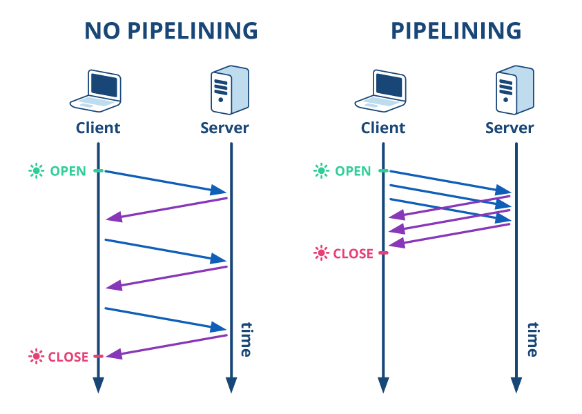
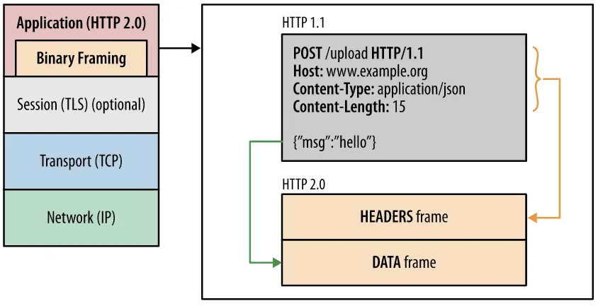
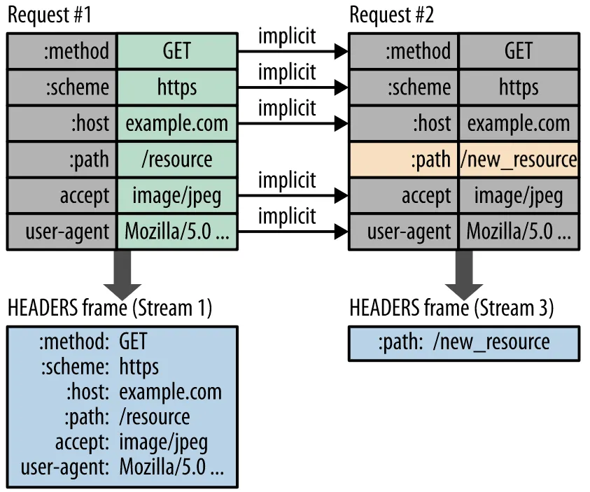
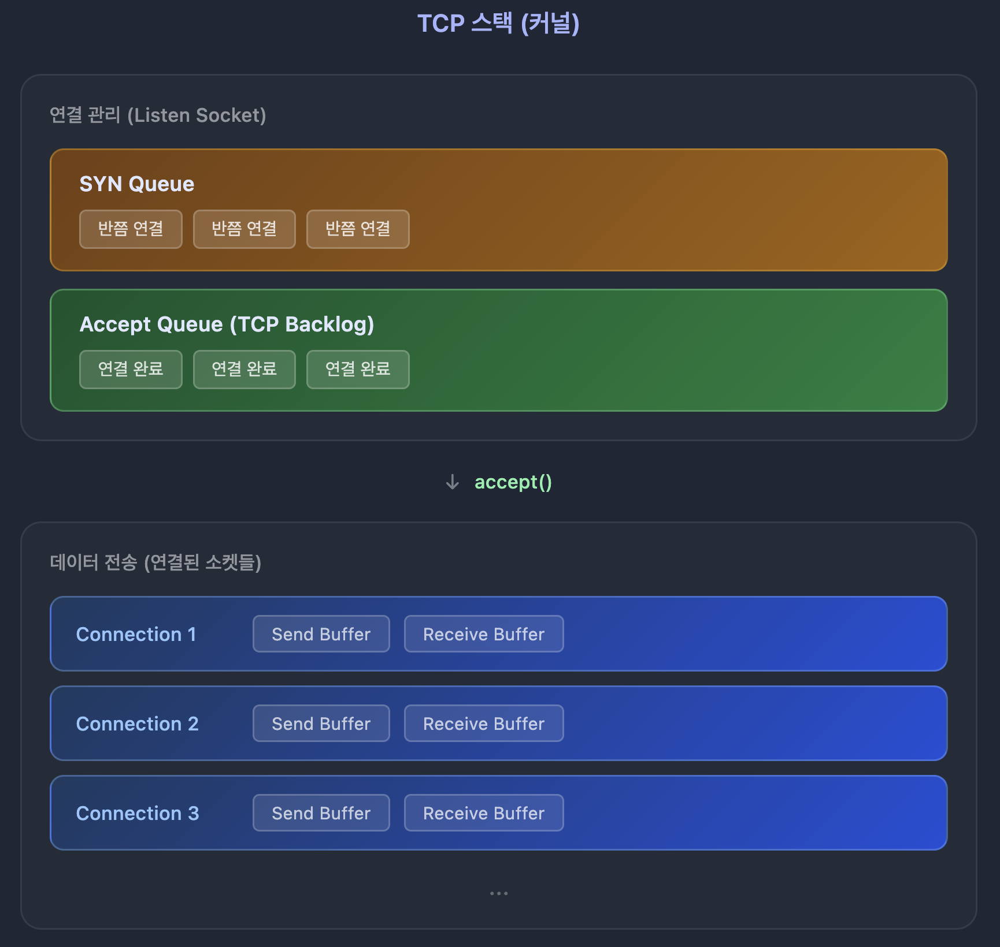
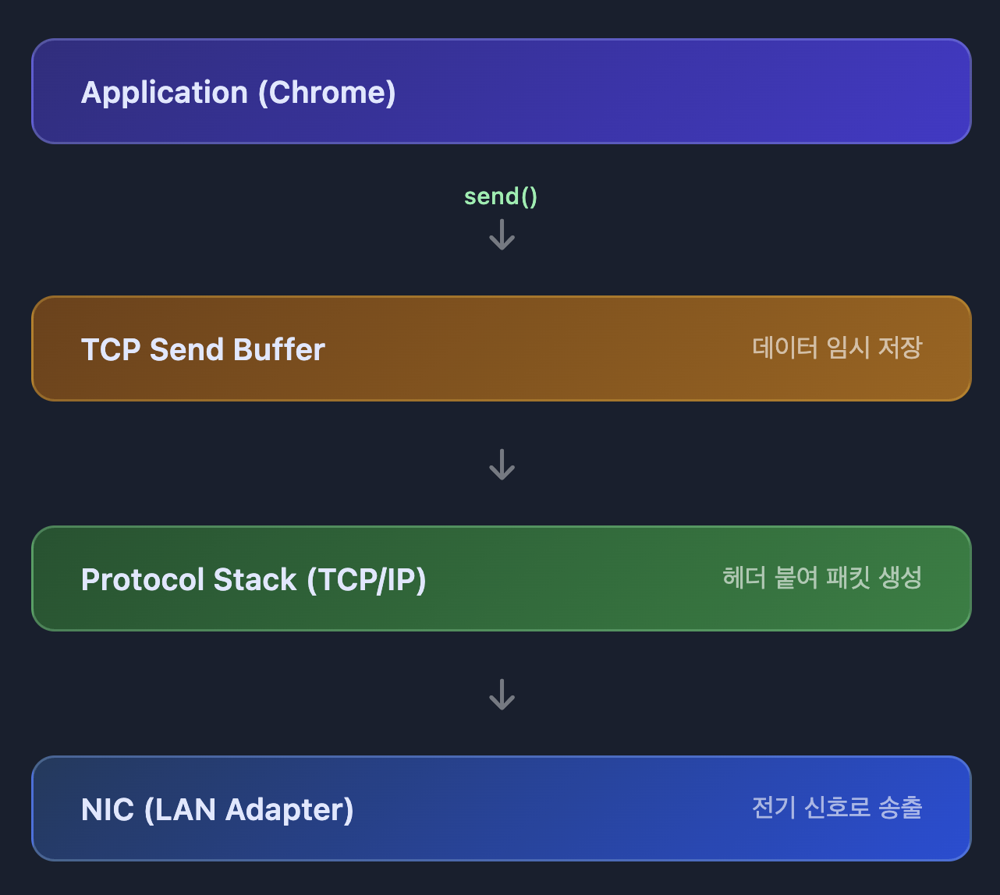

## 네트워크

서버에는 2개의 공인 IP가 있었습니다:
- **인바운드 IP**: 외부에서 서버로 들어올 때 쓰는 IP
- **아웃바운드 IP**: 서버에서 외부로 나갈 때 쓰는 IP


## 노드, 네트워크, 라우터

데이터를 송수신하는 모든 장치를 **노드**라고 부릅니다. 우리가 쓰는 휴대폰, 노트북, 서버 장비 등이 모두 노드에 해당합니다. 이런 각 노드가 서로 데이터를 주고받기 위해 연결된 시스템을 **네트워크**라고 합니다.


### 패킷(Packet)

노드가 네트워크를 통해 전송하는 데이터의 단위를 패킷이라고 합니다. 패킷은 헤더와 페이로드로 구성됩니다:
- **헤더**: 패킷의 발신자와 수신자 정보가 들어있습니다
- **페이로드**: 실제 전송되는 데이터가 들어있습니다

데이터는 일정 크기를 가진 여러 패킷으로 나뉘어 전송됩니다.

네트워크의 예로 집에서 쓰는 공유기에 연결된 장치들을 들 수 있습니다. 공유기에 연결된 휴대폰이나 컴퓨터가 하나의 네트워크를 구성하죠. 마찬가지로 사무실에서 사용하는 컴퓨터들도 하나의 네트워크를 구성합니다.

서로 다른 네트워크에 속한 노드는 직접 연결해서 패킷을 송수신할 수 없습니다.

이때 사용되는 것이 **라우터**입니다. 라우터는 네트워크 간에 패킷을 전송하는 역할을 합니다.


## 도메인과 IP 주소

각 노드의 IP 주소를 외우기는 쉽지 않습니다. 그래서 IP 주소에 기억하기 쉬운 이름을 붙이는데, 그게 바로 **도메인 이름**입니다. 도메인 이름을 IP 주소로 변환하는 체계가 **DNS**입니다. 

DNS를 인터넷 전화번호부라고 생각하시면 됩니다.

**도메인 이름은 계층 구조를 갖습니다. 각 계층은 점(.)으로 구분되며, 오른쪽이 상위 계층이고 왼쪽이 하위 계층입니다.**

### 도메인 계층 구조

가장 오른쪽이 **최상위 계층**입니다. 최상위 계층에는 두 가지 종류가 있습니다:
- **일반 최상위 도메인**: com, org, net, gov, app, biz, tech 등
- **국가 최상위 도메인**: kr, jp, au, cn 등

#### 일반 최상위 도메인 (예: .com)
- **2차 도메인이 주요 이름이 됩니다** (회사나 브랜드 이름)
- 예: naver.com → naver가 2차 도메인
- 3차부터는 용도별로 사용: cafe.naver.com, www.google.com

#### 국가 최상위 도메인 (예: .kr)
- **2차 계층**까지 미리 정의되어 있습니다
  - ac.kr: 대학 등 교육 기관용
  - co.kr: 기업용
  - go.kr: 정부 기관용
- **3차 계층이 주요 이름이 됩니다**
- 예: gasapp.co.kr → gasapp이 주요 이름

### DNS 작동 방식

도메인 이름에 해당하는 IP 주소는 DNS 서버를 통해 알아냅니다.

#### 간단한 설명
www.naver.com을 브라우저에 입력하면, 브라우저가 DNS 서버한테 "www.naver.com의 IP 주소가 뭐예요?"라고 물어봅니다. DNS 서버는 해당 IP 주소를 알려주고, 브라우저는 그 IP 주소로 데이터를 보냅니다.

```
1. www.naver.com의 IP 주소 요청
2. 223.130.192.248 응답
3. 데이터 전송
```

#### 실제 DNS 조회 과정 (상세)

실제로는 여러 DNS 서버를 거쳐가며 IP 주소를 찾습니다. **구글**에 접속하는 과정을 예로 들어보겠습니다:


이 과정이 복잡해 보이지만 실제로는 1초도 안 걸립니다. 한 번 조회한 결과는 캐시에 저장되어 다음에 더 빠르게 접속할 수 있습니다.

로컬에서 개발할 때 쓰는 localhost는 특별한 주소입니다. localhost의 IP 주소는 127.0.0.1입니다. 

이건 **루프백 주소**라고 해서 자기 자신을 가리킬 때 쓰는 IP 주소입니다.

### hosts 파일

모든 컴퓨터는 hosts 파일을 가지고 있습니다:
- **리눅스**: `/etc` 디렉토리에 있습니다
- **윈도우**: `C:\Windows\System32\drivers\etc` 디렉토리에 있습니다

### 도메인 이름과 IP 주소 개수

하나의 도메인에 여러 IP 주소가 매핑될 수 있습니다. nslookup 명령어로 확인해볼 수 있습니다:

```bash
$ nslookup www.naver.com
...
Address: 223.130.192.248
Address: 223.130.192.247
Address: 223.130.200.219
Address: 223.130.200.236
```

한 도메인에 IP 주소를 여러 개 매핑하는 이유 중 하나는 **부하 분산** 때문입니다.

## 고정 IP와 동적 IP

같은 네트워크에서 각 노드는 서로 다른 IP 주소를 가져야 합니다. IP 주소로 패킷을 보낼 노드를 구분하기 때문에, 같은 IP 주소를 가진 노드가 있으면 IP 충돌이 일어납니다.

노드의 IP 주소는 2가지 방식으로 지정합니다:

- **고정 IP**: 노드가 고정된 IP를 갖습니다. 서버 IP가 대표적이죠.
- **동적 IP**: 노드가 네트워크에 연결할 때마다 IP를 할당받습니다. DHCP(Dynamic Host Configuration Protocol) 서버가 이걸 담당합니다.

## DHCP 서버

#### DHCP 동작 과정 (DORA)

DHCP는 **브로드캐스팅**을 통해 IP를 할당받습니다. 이 과정을 **DORA**라고 부르는데, 각 단계의 앞글자를 딴 것입니다:

```
D - Discover (발견)
O - Offer (제안)
R - Request (요청)
A - Acknowledgment (확인)
```

#### 상세한 DHCP 과정

노트북을 WiFi에 연결하는 상황을 예로 들어보겠습니다:

**① DHCP Discover - "DHCP 서버 어디있어요?"**
```
노트북: "저 IP가 없는데 누가 좀 줘요!" (브로드캐스트)
발신: 0.0.0.0 (아직 IP가 없음)
수신: 255.255.255.255 (네트워크 전체에 외침)
```

**② DHCP Offer - "내가 줄 수 있어"**
```
공유기(DHCP 서버): "192.168.0.105 쓸래?"
제안 내용:
- IP 주소: 192.168.0.105
- 서브넷 마스크: 255.255.255.0
- 게이트웨이: 192.168.0.1
- DNS: 8.8.8.8
- 임대 시간: 24시간
```

**③ DHCP Request - "그거 주세요!"**
```
노트북: "네, 192.168.0.105 주세요!" (브로드캐스트)
→ 여러 DHCP 서버가 있을 수 있어서 가장 먼저 응답을 주는 DHCP 서버를 선택
→ 브로드 캐스팅으로 알림

메시지 내용:
- Transaction ID: 이전 DHCP 메시지와 동일한 ID
- DHCP Message Type: REQUEST
- Requested IP Address (Option 50): 192.168.0.105
- DHCP Server Identifier (Option 54): 선택한 서버의 IP
```

**④ DHCP ACK - "자, 여기 있어"**
```
공유기: "확인! 192.168.0.105는 24시간 동안 네 거야"
→ 이제 노트북은 정식으로 IP를 받음
```

#### 브로드캐스팅이란?

브로드캐스팅은 네트워크의 모든 기기에게 동시에 메시지를 보내는 방식입니다:

- **유니캐스트**: 1:1 통신 (특정 IP로 전송)
- **브로드캐스트**: 1:전체 통신 (255.255.255.255로 전송)
- **멀티캐스트**: 1:그룹 통신 (특정 그룹에만 전송)
- **애니캐스트**: 1:가장 가까운 1개 (같은 IP를 가진 여러 서버 중 가장 가까운 곳으로)

**애니캐스트 예시:**
CDN이나 DNS 루트 서버가 애니캐스트를 사용합니다. 예를 들어 구글 DNS(8.8.8.8)는 전 세계에 수백 개 서버가 있는데, 모두 같은 IP를 갖습니다. 한국에서 8.8.8.8에 접속하면 한국에서 가장 가까운 서버로 자동 연결됩니다.

DHCP가 브로드캐스트를 쓰는 이유는 간단합니다. **아직 IP가 없는 기기는 DHCP 서버가 어디 있는지 모르기 때문입니다**. 그래서 "야! 다들 들어봐! 나 IP 필요해!"라고 네트워크 전체에 외치는 거죠.

#### IP 임대 시간과 갱신

DHCP로 받은 IP는 영구적이지 않습니다:

1. **임대 시간**: 보통 24시간 (설정 가능)
2. **50% 시점**: 12시간 지나면 갱신 시도
3. **87.5% 시점**: 갱신 실패 시 다시 시도
4. **만료**: 새로 DHCP Discover부터 다시 시작

이렇게 임대 방식을 쓰는 이유는 한정된 IP 주소를 효율적으로 관리하기 위해서입니다.

## 공인 IP와 사설 IP

웹 브라우저에 www.google.com이나 www.daum.net 같은 도메인을 입력하면 DNS 서버에서 IP 주소를 받아와서 접속합니다. 이때 사용하는 IP 주소는 인터넷 어디서든 접근 가능한 **공인(public) IP** 주소입니다.

모든 네트워크에서 쓸 수 있는 공인 IP와 달리, 네트워크 내부에서만 쓰는 **사설(private) IP** 주소도 있습니다. 사설 IP는 특정 네트워크 안에서만 유효하고 외부에서는 접근할 수 없습니다.

사설 IP로 쓸 수 있는 주소 범위입니다:
- **192.168.x.x**
- **10.x.x.x**
- **172.16.x.x ~ 172.31.x.x**

### 공인 IP 알아내기

간단한 방법은 https://ifconfig.me 같은 사이트에 접속해서 확인하는 겁니다.

리눅스에서도 아래 명령어로 공인 IP 주소를 확인할 수 있습니다:
```bash
curl ifconfig.me
```

## NAT

**NAT**(Network Address Translation, 네트워크 주소 변환)는 네트워크 주소를 변환하는 기술입니다. 인터넷에 연결하려면 내부의 사설 IP와 인터넷의 공인 IP 간 변환이 필요한데, NAT가 이걸 처리합니다.

- **SNAT**(Source NAT): 나가는 패킷의 출발지 변경 (AWS NAT Gateway)

- **DNAT**(Destination NAT): 들어오는 패킷의 목적지 변경 (AWS ALB/NLB)


DNAT는 서버 구성할 때 많이 씁니다. 보통 보안이나 이중화를 위해 서버는 사설 IP를 쓰고, 공인 IP는 라우터나 방화벽 같은 네트워크 장비에 할당합니다.

## VPN

백엔드 서버를 개발하고 운영하다 보면 서버나 DB에 접속할 일이 많습니다. SSH로 서버에 접속해서 프로세스를 확인하거나 OS 설정을 바꿔야 할 때도 있고, DB에 접속해서 SQL을 실행해야 할 때도 있죠.

서버 네트워크의 노드에 안전하게 접근하려면 **VPN**(Virtual Private Network, 가상 사설 네트워크)을 사용합니다. VPN은 인터넷 같은 공용 네트워크에서 서로 다른 네트워크 간에 암호화된 연결을 제공합니다.


개발자는 VPN 클라이언트로 VPN에 접속할 수 있습니다. 집이나 카페에서 서버 네트워크에 접근해야 할 때 이 방식을 씁니다.

## 프로토콜과 TCP, UDP, QUIC

네트워크에서 두 노드가 데이터를 주고받기 위해 정한 규칙을 **프로토콜**(protocol)이라고 합니다. 네트워크는 여러 계층으로 구성되고 각 계층마다 사용하는 프로토콜이 있습니다.

**TCP/IP 모델의 계층별 프로토콜과 전송 단위:**

| 계층 | 프로토콜 | 전송 단위 |
|------|---------|----------|
| 응용 계층 | HTTP, FTP, SMTP | 메시지 (Message) |
| 전송 계층 | TCP | 세그먼트 (Segment) |
| 전송 계층 | UDP | 데이터그램 (Datagram) |
| 네트워크 계층 | IP | 패킷 (Packet) |

### TCP (Transmission Control Protocol)

TCP는 연결 기반 프로토콜입니다. 전화 통화처럼 먼저 연결을 맺고 나서 데이터를 주고받습니다. TCP에서 두 노드가 연결을 맺는 과정을 **3-Way Handshake**라고 부릅니다.


```
클라이언트 → 서버: SYN (Seq=1000)
서버 → 클라이언트: SYN-ACK (Seq=3000, Ack=1001)
클라이언트 → 서버: ACK (Seq=1001, Ack=3001)
```

**Seq와 Ack가 뭔가요?**
- **Seq**(Sequence Number): 내가 보내는 데이터의 번호
- **Ack**(Acknowledgment Number): 다음에 받고 싶은 상대방 데이터의 번호

예를 들어 서버가 `Ack=1001`을 보내면 "클라이언트님, 1000번까지 잘 받았고 이제 1001번 주세요"라는 의미입니다.

**왜 Sequence Number는 임의의 난수로 시작할까?**

클라이언트와 서버 모두 각자의 Seq를 임의의 난수로 시작합니다. 위 예시에서 클라이언트는 1000, 서버는 3000으로 시작했죠.

1. **보안**: 예측 가능한 번호(0, 1, 2...)를 쓰면 공격자가 패킷을 위조하기 쉬움
2. **이전 연결과 구분**: 같은 포트로 새 연결을 맺을 때, 이전 연결의 지연된 패킷과 섞이는 것 방지

TCP는 양방향 통신이라서 각자 자신의 송신 채널에 대한 Seq가 필요합니다:
- 클라이언트의 Seq: 클라이언트 -> 서버 데이터 추적
- 서버의 Seq: 서버 -> 클라이언트 데이터 추적


### TCP 연결 종료: 4-Way Handshake

TCP 연결은 **양방향 채널**입니다. 클라이언트 -> 서버, 서버 -> 클라이언트 두 개의 독립적인 채널이 있죠.

연결을 끊으려면 **각 채널을 따로 닫아야 합니다**. 그래서 4-Way가 필요합니다:

```
클라이언트 → 서버: FIN ("나는 더 보낼 거 없어")
서버 → 클라이언트: ACK ("알겠어")
서버 → 클라이언트: FIN ("나도 더 보낼 거 없어")
클라이언트 → 서버: ACK ("알겠어")
```

**왜 3-Way가 아니라 4-Way인가?**

3-Way Handshake처럼 서버가 ACK+FIN을 동시에 보내면 안 될까요?

문제는 서버가 **아직 보낼 데이터가 남아있을 수 있다**는 겁니다.

```
클라이언트: "나 다 보냈어" (FIN)
서버: "알겠어, 근데 나는 아직 보내는 중이야" (ACK만)
서버: (남은 데이터 전송...)
서버: "나도 이제 다 보냈어" (FIN)
클라이언트: "알겠어" (ACK)
```

만약 3-Way로 ACK+FIN을 동시에 보내면, 서버가 보내던 데이터가 중간에 끊길 수 있습니다.

**서버가 먼저 FIN을 보낼 수도 있다**

TCP는 대등한 양방향 통신이기 때문에, 누가 먼저 FIN을 보내든 상관없습니다:
- HTTP 서버가 응답을 다 보낸 후 먼저 연결을 끊는 경우
- 서버가 타임아웃으로 연결을 정리하는 경우

핵심은 **양쪽 모두 "나는 더 보낼 게 없다"고 선언해야 연결이 완전히 종료된다**는 것입니다.

**TIME_WAIT: 마지막 ACK 후에도 기다리는 이유**

클라이언트가 마지막 ACK를 보낸 후 바로 연결을 닫지 않고 **TIME_WAIT** 상태로 일정 시간(보통 60초) 대기합니다.

왜 기다릴까요?

1. **마지막 ACK가 유실될 수 있음**
```
클라이언트 → 서버: ACK (마지막)
         ↑
      이게 유실되면?

서버: "어? ACK 안 왔네, FIN 다시 보내야겠다"
서버 → 클라이언트: FIN (재전송)
```
클라이언트가 이미 연결을 닫았다면 서버의 FIN 재전송을 받을 수 없고, 서버는 계속 FIN을 보내며 대기하게 됩니다.

2. **지연된 패킷이 새 연결에 섞이는 것 방지**

이전 연결의 패킷이 네트워크 어딘가에서 지연되다가, 새 연결이 같은 포트를 사용하면 이전 연결의 패킷이 새 연결에 섞일 수 있습니다. TIME_WAIT으로 대기하면 이전 연결의 모든 패킷이 네트워크에서 사라질 시간을 확보합니다.

**HTTP/1.0**: 매 요청마다 새로운 TCP 연결을 맺어야 했습니다 (Connection: close가 기본값)

**HTTP/1.1**: **Keep-Alive**로 하나의 TCP 연결을 재사용할 수 있게 되었습니다 (Connection: keep-alive가 기본값)



**파이프라이닝 없음**: 요청을 보내고 응답을 받은 후에야 다음 요청을 보낼 수 있습니다

```
 (요청-응답-요청-응답)
 ```

**파이프라이닝 있음**: 응답을 기다리지 않고 여러 요청을 연속으로 보낼 수 있습니다 
```
(요청-요청-요청 → 응답-응답-응답)
```

그렇지만 파이프 라이닝은 일부 패킷이 유실되면 그 패킷이 도착할 때까지 이후 패킷을 처리하지 못하는 **HOL 블로킹**(Head-of-Line Blocking) 문제가 있습니다.

## HTTP/2.0

### HTTP/1.1의 문제

HTTP/1.1은 **한 번에 하나씩** 처리합니다.

```
브라우저: "index.html 줘"
서버: "여기"
브라우저: "style.css 줘"
서버: "여기"
브라우저: "image.png 줘"
서버: "여기"
```

파일이 10개면 10번 왔다갔다 해야 합니다. 느리죠.

### HTTP/2의 해결책: 멀티플렉싱

HTTP/2는 **동시에 여러 개**를 요청합니다.

```
브라우저: "index.html 줘, style.css 줘, image.png 줘" (한꺼번에)
서버: (섞어서 보냄)
```

근데 문제가 있습니다. 데이터가 섞여서 오면 **어떤 게 index.html이고 어떤 게 style.css인지** 어떻게 구분할까요?

### 바이너리 프레이밍

그래서 HTTP/2는 데이터를 **작은 조각**(Frame)으로 나누고, 각 조각에 **번호표**(Stream ID)를 붙입니다.

```
[Frame: Stream 1번, index.html 조각]
[Frame: Stream 2번, style.css 조각]
[Frame: Stream 1번, index.html 조각]
[Frame: Stream 3번, image.png 조각]
```

받는 쪽에서는 번호표를 보고 조각들을 다시 모읍니다:
- Stream 1번 조각들 모으기 -> index.html 완성
- Stream 2번 조각들 모으기 -> style.css 완성
- Stream 3번 조각들 모으기 -> image.png 완성

HTTP/1.x는 Plain Text(평문)를 사용하고 개행으로 구별했지만, HTTP/2.0에서는 **바이너리 포맷**으로 인코딩된 Message, Frame으로 구성됩니다.



**HTTP/2의 구성 요소:**

| 용어 | 의미 |
|------|------|
| **Frame** | 데이터 조각 + 번호표 (HTTP/2 통신의 최소 단위) |
| **Stream** | 같은 번호표를 가진 조각들의 그룹 (= 하나의 요청/응답) |
| **Message** | Stream을 모아서 완성한 전체 요청 또는 응답 |


위처럼, 하나의 커넥션에서 여러 병렬 스트림(3개)이 동시에 존재할 수 있습니다. 각 스트림의 프레임들이 뒤섞여서 전송되더라도, Stream Number를 통해 어떤 스트림에 속하는지 식별하여 정확하게 재조립됩니다.

**HTTP/2 프레임과 TCP 세그먼트의 관계**

HTTP/2 프레임은 결국 TCP 세그먼트의 페이로드로 들어갑니다. 중요한 점은 **TCP는 HTTP/2 프레임이 뭔지 모른다**는 겁니다. TCP 입장에서는 그냥 "바이트 덩어리"일 뿐이죠.

```
HTTP/2 레이어: [Frame A: Stream 1] [Frame B: Stream 3] [Frame C: Stream 1]
                        ↓
TCP 레이어: "그냥 바이트 덩어리로 보임"
                        ↓
TCP 세그먼트: [Frame A + Frame B 일부] [Frame B 나머지 + Frame C]
```

- 하나의 TCP 세그먼트에 **여러 개의 작은 프레임**이 담길 수 있습니다
- 하나의 큰 프레임이 **여러 TCP 세그먼트에 나뉘어** 담길 수도 있습니다
- 같은 세그먼트 안에 **서로 다른 스트림의 프레임**이 함께 있을 수 있습니다

수신 측의 HTTP/2 레이어가 각 프레임의 헤더에서 Stream ID와 길이를 읽고 "여기부터 여기까지가 하나의 프레임이다"를 파싱해서 재조립합니다.

### HTTP/2의 한계: TCP HOL 블로킹

HTTP/2는 응용 계층에서의 HOL 블로킹을 해결했지만, **TCP 레벨에서는 여전히 문제가 있습니다**.

**계층별 동작 이해:**

네트워크는 계층으로 나뉘어 동작합니다:
- **응용 계층**(HTTP/2): 프레임과 스트림으로 멀티플렉싱 구현
- **전송 계층**(TCP): 순서를 보장하는 바이트 스트림 전송

HTTP/2의 모든 스트림은 결국 **하나의 TCP 연결**을 통해 전송됩니다. TCP는 HTTP/2의 스트림 개념을 모르고, 단지 순서대로 바이트를 전달할 뿐입니다.

**실제 예시: 10MB 이미지 + 1KB CSS 파일 요청**

```
HTTP/1.1 (순차 처리):
1. 10MB 이미지 요청 → 완료 (10초)
2. 1KB CSS 요청 → 완료 (0.1초)
총 시간: 10.1초

HTTP/2 (멀티플렉싱):
1. 10MB 이미지 + 1KB CSS 동시 요청 (프레임 교대로 전송)
2. CSS는 1초 만에 완료 (이미지 중간에 끼워서 전송)
3. 이미지는 10초 만에 완료
총 시간: 10초 (CSS는 1초에 완료!)
```


HTTP/2는 하나의 TCP 연결만 사용하기 때문에, 패킷 하나만 유실되어도 **모든 스트림이 영향을 받습니다**. 오히려 HTTP/1.1이 여러 TCP 연결을 사용할 때보다 더 심각할 수 있죠.

**TCP 패킷 손실 시나리오:**
```
TCP 패킷: [1][2][3][4][5][6][7][8][9][10]
                ↑
           3번 패킷 유실!

TCP 패킷 손실 발생:
HTTP/1.1: 모든 데이터 정지 
HTTP/2: 모든 스트림 정지 

결과: 패킷 4~10번이 도착해도 처리 못함
→ TCP가 3번을 기다리느라 모든 HTTP/2 스트림이 멈춤
```

### Stream 우선순위


HTTP 메시지가 많은 개별 프레임으로 분할될 수 있고 여러 스트림의 프레임을 다중화(Multiplexing)할 수 있게 되면서, **스트림들의 우선순위를 지정할 필요가 생겼습니다.**

클라이언트는 우선순위 지정을 위해 '우선순위 지정 트리'를 사용하여 서버의 스트림 처리 우선순위를 지정할 수 있습니다. **서버는 우선순위가 높은 응답이 클라이언트에 우선적으로 전달될 수 있도록 대역폭을 설정합니다.**

### HTTP 헤더 압축 (HPACK)



이전 Header의 내용과 중복되는 필드를 재전송하지 않도록 하여 데이터를 절약합니다. 기존에 HTTP Header가 Plain Text(평문)이었지만, HTTP/2에서는 **Huffman Coding**을 사용하는 **HPACK**이라는 Header 압축방식을 이용하여 데이터 전송 효율을 높였습니다.

**Huffman Coding**: 데이터 문자의 빈도에 따라서 다른 길이의 부호를 사용하는 알고리즘

**TCP의 장점은 신뢰성**입니다. 패킷 순서를 보장하고 패킷이 유실되면 재전송해줘서 **안정적으로 데이터를 전송할 수 있습니다.** 그래서 **HTTP, SMTP** 같은 많은 프로토콜이 TCP를 기반으로 동작합니다.

하지만 시퀀스 번호, 확인 응답, 재전송 같은 기능 때문에 **UDP보다는 느립니다.**

### UDP (User Datagram Protocol)

TCP와 달리 UDP는 연결 과정 없이 바로 데이터를 보냅니다. **데이터가 제대로 전송됐는지도 모르고, 순서도 보장하지 않습니다.**

UDP를 쓰는 애플리케이션은 데이터가 유실될 수 있다고 가정하고 개발해야 합니다.

UDP는 응답 확인이나 패킷 정렬 같은 과정이 없어서 **TCP보다 빠릅니다.**

그래서 속도가 중요하거나 약간의 데이터 유실이 괜찮은 통신에 씁니다. **DNS, VoIP, 게임 등이 UDP를 사용하는 대표적인 예입니다.**

### QUIC

TCP는 신뢰성이 있지만 느립니다. UDP는 빠르지만 신뢰성이 없죠. 이 둘의 장점을 합친 프로토콜이 **QUIC**입니다.

QUIC은 UDP를 기반으로 하면서 TCP의 연결 관리 기능을 프로토콜 수준에서 제공합니다:

- **데이터에 연결 ID**(Connection ID)를 포함시켜 연결을 유지합니다
- TCP의 혼잡 제어나 패킷 유실 복구 기능을 QUIC에서 제어합니다
- **TLS를 통합해서 기본적으로 암호화됩니다**
- 멀티플렉싱으로 한 연결에서 여러 스트림을 동시에 처리합니다

### HTTP/3

HTTP/3 프로토콜은 QUIC을 기반으로 사용합니다.

**HTTP/3는 TCP를 버리고 UDP 위에 QUIC을 만들었습니다:**

```
HTTP/1.1: 여러 TCP 연결 (한 연결 막혀도 다른 연결은 OK)
HTTP/2:  하나의 TCP 연결 (패킷 하나 유실 → 전체 멈춤)
HTTP/3:  QUIC 스트림들 (각 스트림이 독립적으로 동작!)
```

**QUIC의 독립적인 스트림:**
```
Stream 1: 패킷 유실 → Stream 1만 대기
Stream 2: 정상 진행 ✓
Stream 3: 정상 진행 ✓
```

각 QUIC 스트림이 **자체적으로 순서 보장과 재전송을 처리**하기 때문에, 한 스트림의 패킷 유실이 다른 스트림에 영향을 주지 않습니다. 마치 여러 개의 독립적인 TCP 연결을 쓰는 것처럼요!

**QUIC의 순서 보장: 스트림 간이 아니라 스트림 내부**

QUIC은 **스트림 간의 순서**는 보장하지 않습니다. 스트림 1이 먼저 끝나든 스트림 3이 먼저 끝나든 상관없습니다.

대신 **스트림 내부의 순서**를 보장합니다:

```
받는 쪽 (QUIC 라이브러리):
  UDP 데이터그램 수신
  ↓
  Stream ID 확인 후 각 스트림 버퍼에 분류
  ↓
  Stream 1 버퍼: [1][ ][3] ← 2번 아직 안 옴, 대기
  Stream 2 버퍼: [1][2][3] ← 완성! 애플리케이션에 전달
  Stream 3 버퍼: [1][2]    ← 정상 진행
```

TCP는 OS 커널이 **연결 전체**에서 순서를 맞추지만, QUIC은 애플리케이션 레벨에서 **스트림별로 독립된 버퍼**를 관리합니다. 그래서 한 스트림의 패킷 유실이 다른 스트림에 영향을 주지 않습니다.

**HOL 블로킹 비교:**

| 계층 | HTTP/1.x | HTTP/2 | HTTP/3 |
|------|----------|--------|--------|
| 응용 계층 HOL | O (순차 응답) | X (멀티플렉싱) | X |
| 전송 계층 HOL | O (TCP) | O (TCP) | X (QUIC) |

HTTP/1.x는 응답을 순서대로 보내야 해서 무거운 요청이 앞에 있으면 뒤의 가벼운 요청이 대기합니다. HTTP/2는 멀티플렉싱으로 이를 해결했지만, TCP를 사용하기 때문에 패킷 유실 시 모든 스트림이 멈춥니다. HTTP/3(QUIC)만이 두 계층 모두에서 HOL 블로킹을 해결했습니다.

**현재 지원 현황:**
- **브라우저**: 크롬, 에지, 사파리 등 주요 브라우저
- **기업**: 구글, 페이스북 등 주요 기업
- **CDN**: 아카마이, 클라우드플레어, AWS 클라우드프론트 등

### TCP 연결은 65,535개가 한계인가?

포트 번호는 부호 없는 16비트 정수를 씁니다. 그래서 65,535가 포트 번호의 최대값입니다.

**하지만** 한 장비에서 만들 수 있는 TCP 연결 개수는 이론적으로 **2^96개**입니다.

TCP의 각 연결은 다음 4가지 조합으로 구분되거든요:
- **로컬 IP**
- **로컬 포트**
- **원격 IP**
- **원격 포트**

하나의 로컬 IP에서 특정 원격 IP의 1개 포트에 연결할 수 있는 TCP 연결이 65,535개인 겁니다.

> 실제로는 OS 설정(파일 디스크립터 개수, 포트 범위 설정 등)에 따라 제약을 받습니다.

## 웹 통신의 큰 흐름: www.google.com 접속 과정

면접에서 자주 나오는 질문입니다. 한 질문으로 DNS, TCP, 라우팅, 프로토콜 스택까지 다양한 개념을 확인할 수 있기 때문입니다.

### 1단계: 브라우저의 URL 파싱

브라우저에 `https://www.google.com`을 입력하면, 브라우저는 URL을 파싱해서 다음을 추출합니다:
- 프로토콜: HTTPS
- 도메인: www.google.com
- 포트: 443 (HTTPS 기본 포트)
- 경로: / (루트)

**URI와 URL의 차이**

```
URI (Uniform Resource Identifier) - 리소스 식별자
├── URL (Uniform Resource Locator) - 위치로 식별
└── URN (Uniform Resource Name) - 이름으로 식별
```

- **URL**: `https://google.com/search` - 위치(주소)로 리소스를 찾음
- **URN**: `urn:isbn:0451450523` - 고유한 이름으로 리소스를 찾음 (웹에서 거의 안 씀)

웹에서는 거의 URL만 쓰기 때문에 URI = URL로 봐도 무방합니다.

### 2단계: DNS Lookup

도메인으로는 패킷을 보낼 수 없습니다. IP 주소가 필요하죠. 브라우저는 다음 순서로 IP를 찾습니다:

1. **브라우저 DNS 캐시** 확인
2. **OS의 hosts 파일** 확인
3. **OS DNS 캐시** 확인
4. **DNS 서버에 질의** (앞서 설명한 DNS 조회 과정)

### 3단계: 브라우저에서 OS로 전송 요청

여기서 중요한 개념이 나옵니다. **브라우저는 직접 네트워크 통신을 할 수 없습니다.**

브라우저는 User Space에서 실행되는 일반 프로세스입니다. 네트워크 하드웨어(랜카드)에 접근하려면 Kernel Space의 권한이 필요합니다. 그래서 브라우저는 **시스템 콜**을 통해 OS에 전송을 요청합니다.

```
┌─────────────────────────────────────┐
│         User Space                  │
│  ┌─────────┐  ┌─────────┐           │
│  │ Chrome  │  │ Slack   │  ...      │
│  └────┬────┘  └────┬────┘           │
│       │            │                │
│       ▼            ▼                │
│  ┌─────────────────────────────┐    │
│  │      System Call            │    │
│  │  socket(), connect(), send()│    │
│  └─────────────────────────────┘    │
├─────────────────────────────────────┤
│         Kernel Space                │
│  ┌─────────────────────────────┐    │
│  │     Protocol Stack          │    │
│  │  (TCP/IP 처리)               │    │
│  └─────────────────────────────┘    │
│  ┌─────────────────────────────┐    │
│  │     Network Driver          │    │
│  └─────────────────────────────┘    │
│  ┌─────────────────────────────┐    │
│  │     NIC (랜카드)              │    │
│  └─────────────────────────────┘    │
└─────────────────────────────────────┘
```

브라우저가 직접 랜카드를 제어할 수 없습니다. 하드웨어 접근은 커널만 가능하거든요. 그래서 브라우저는 `socket()`, `connect()`, `send()` 같은 시스템 콜을 통해 OS에 "이 데이터 좀 보내줘"라고 요청하는 겁니다.

### 4단계: TCP 연결 (3-Way Handshake)

OS의 **프로토콜 스택**이 TCP 연결을 맺습니다. 프로토콜 스택은 OS에 내장된 네트워크 제어 소프트웨어입니다.

TCP 연결은 "브라우저 - 구글 서버" 사이에 맺어지지만, 실제 SYN/ACK 패킷 처리는 **양쪽 OS 커널**이 담당합니다.

```
[내 PC]                           [구글 서버]
Chrome -> Kernel(TCP) <---------> Kernel(TCP) -> Nginx
              ^                        ^
        실제 패킷 처리는 여기서 발생
```

**TCP 스택의 구조**

TCP 스택은 OS 커널에 내장된 **TCP/IP 프로토콜 처리 소프트웨어 전체**입니다. 패킷 생성, 순서 보장, 재전송, 흐름 제어 등 TCP의 모든 기능을 담당합니다.

TCP 스택은 크게 두 가지 역할을 합니다:

1. **연결 관리**: SYN Queue, Accept Queue로 연결 요청을 관리
2. **데이터 전송**: 각 연결(소켓)마다 Send/Receive Buffer로 데이터를 버퍼링



**연결 관리 큐:**
- **SYN Queue**: SYN 받고 SYN-ACK 보낸 상태 (반쯤 연결된 상태)
- **Accept Queue**: 3-Way 완료됐지만 아직 `accept()` 안 된 연결

**데이터 전송 버퍼:**
- **Send Buffer**: 애플리케이션이 보낼 데이터를 담아두는 버퍼
- **Receive Buffer**: 네트워크에서 받은 데이터를 담아두는 버퍼

> **중요**: Accept Queue는 **이미 3-Way Handshake가 완료된** 연결들입니다. 커널 레벨에서는 연결이 완료됐지만, 서버 애플리케이션이 아직 `accept()`를 호출하지 않아 대기 중인 상태입니다.

**1000개 연결 시 몇 개의 큐와 버퍼가 생길까?**

서버가 80 포트에서 `listen()`하고 1000개의 클라이언트가 연결했다면:

| 구분 | 개수 | 설명 |
|------|------|------|
| Listen Socket | 1개 | 80 포트에서 연결 대기 |
| SYN Queue | 1개 | Listen Socket당 1개 |
| Accept Queue | 1개 | Listen Socket당 1개 |
| TCP Buffer 쌍 | 1000개 | 연결(소켓)당 1쌍 |

**핵심 포인트:**
- **큐는 Listen Socket당 1개**: 포트 80으로 연결 요청이 오면 하나의 SYN Queue, 하나의 Accept Queue로 관리
- **버퍼는 연결당 1쌍**: 1000개 연결이면 1000개의 Send Buffer + 1000개의 Receive Buffer

```
포트 80 Listen Socket
├── SYN Queue (1개) ─────────────┐
├── Accept Queue (1개) ──────────┤ 연결 요청 관리
│                             
└── 연결된 소켓들 ────────────────────┐
    ├── Client 1: [Send] [Recv]    │
    ├── Client 2: [Send] [Recv]    │
    │                              │
    ├── Client 3: [Send] [Recv]    │ 1000개의 버퍼 쌍
    │    ...                       │
    └── Client 1000: [Send] [Recv] ┘
```

Backlog가 가득 차면 새 연결 요청이 거부됩니다. 서버 튜닝할 때 다음 설정으로 큐 크기를 조절합니다:
- `net.core.somaxconn`: Accept Queue 크기
- `net.ipv4.tcp_max_syn_backlog`: SYN Queue 크기

### 5단계: 패킷 생성 및 전송



프로토콜 스택이 HTTP 요청 메시지를 패킷으로 만들고, 각 계층에서 헤더를 붙입니다:

| 계층 | 추가되는 정보 |
|------|-------------|
| HTTP | 요청 메시지 (GET / HTTP/1.1) |
| TCP | 출발지/목적지 포트, 시퀀스 번호 |
| IP | 출발지/목적지 IP 주소 |
| Ethernet | MAC 주소 |

완성된 패킷은 **LAN 어댑터**(NIC)로 전달되고, 전기 신호로 변환되어 송출됩니다.

### 6단계: 네트워크 경유

패킷은 여러 장비를 거쳐 목적지로 이동합니다:

```
내 PC -> 공유기 -> ISP 라우터 -> 인터넷 코어 -> 구글 라우터 -> 구글 서버
```

각 라우터는 패킷의 목적지 IP를 보고 다음 경로를 결정합니다.

### 7단계: 서버 도착 및 응답

구글 서버에 도착한 패킷은:
1. **방화벽**이 검사
2. **로드밸런서**가 적절한 서버로 분배
3. 서버의 **프로토콜 스택**이 패킷에서 HTTP 메시지 추출
4. **웹 서버**(Nginx 등)가 요청 처리
5. 응답 데이터를 같은 경로로 회신

### 전체 흐름 요약

```
1. URL 입력
2. DNS로 IP 획득
3. 브라우저 -> OS (시스템 콜)
4. OS 커널에서 TCP 3-Way Handshake
5. HTTP 요청을 패킷으로 만들어 전송
6. 라우터들을 거쳐 서버 도착
7. 서버가 응답 패킷 회신
8. 브라우저가 HTML 렌더링
```