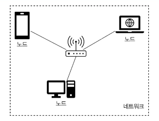
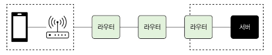
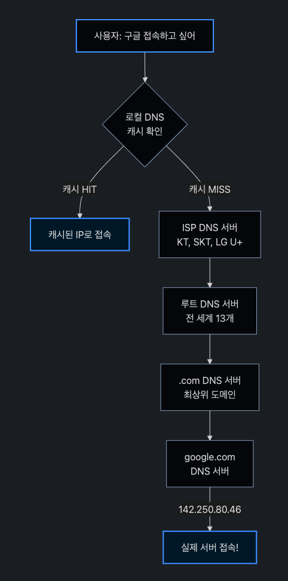
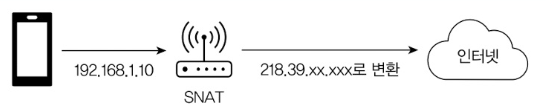
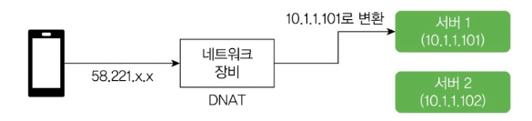
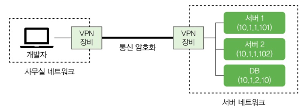
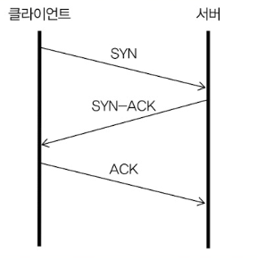
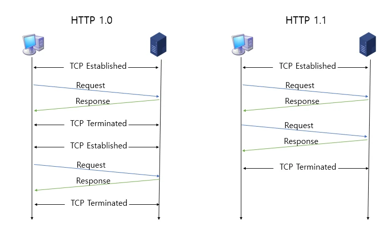

## TCP와 네트워크

서버에는 2개의 공인 IP가 있었습니다:
- **인바운드 IP**: 외부에서 서버로 들어올 때 쓰는 IP
- **아웃바운드 IP**: 서버에서 외부로 나갈 때 쓰는 IP

아웃바운드 IP를 알려줘야 했는데 인바운드 IP를 알려준 거죠. 이런 실수는 생각보다 자주 일어납니다.

## 노드, 네트워크, 라우터

데이터를 송수신하는 모든 장치를 **노드**라고 부릅니다. 우리가 쓰는 휴대폰, 노트북, 서버 장비 등이 모두 노드에 해당합니다. 이런 각 노드가 서로 데이터를 주고받기 위해 연결된 시스템을 **네트워크**라고 합니다.



### 패킷(Packet)

노드가 네트워크를 통해 전송하는 데이터의 단위를 패킷이라고 합니다. 패킷은 헤더와 페이로드로 구성됩니다:
- **헤더**: 패킷의 발신자와 수신자 정보가 들어있습니다
- **페이로드**: 실제 전송되는 데이터가 들어있습니다

데이터는 일정 크기를 가진 여러 패킷으로 나뉘어 전송됩니다.

네트워크의 예로 집에서 쓰는 공유기에 연결된 장치들을 들 수 있습니다. 공유기에 연결된 휴대폰이나 컴퓨터가 하나의 네트워크를 구성하죠. 마찬가지로 사무실에서 사용하는 컴퓨터들도 하나의 네트워크를 구성합니다.

서로 다른 네트워크에 속한 노드는 직접 연결해서 패킷을 송수신할 수 없습니다.

이때 사용되는 것이 **라우터**입니다. 라우터는 네트워크 간에 패킷을 전송하는 역할을 합니다.



## 도메인과 IP 주소

각 노드의 IP 주소를 외우기는 쉽지 않습니다. 그래서 IP 주소에 기억하기 쉬운 이름을 붙이는데, 그게 바로 **도메인 이름**입니다. 도메인 이름을 IP 주소로 변환하는 체계가 **DNS**입니다. 

DNS를 인터넷 전화번호부라고 생각하시면 됩니다.

**도메인 이름은 계층 구조를 갖습니다. 각 계층은 점(.)으로 구분되며, 오른쪽이 상위 계층이고 왼쪽이 하위 계층입니다.**

### 도메인 계층 구조

가장 오른쪽이 **최상위 계층**입니다. 최상위 계층에는 두 가지 종류가 있습니다:
- **일반 최상위 도메인**: com, org, net, gov, app, biz, tech 등
- **국가 최상위 도메인**: kr, jp, au, cn 등

#### 일반 최상위 도메인 (예: .com)
- **2차 도메인이 주요 이름이 됩니다** (회사나 브랜드 이름)
- 예: naver.com → naver가 2차 도메인
- 3차부터는 용도별로 사용: cafe.naver.com, www.google.com

#### 국가 최상위 도메인 (예: .kr)
- **2차 계층**까지 미리 정의되어 있습니다
  - ac.kr: 대학 등 교육 기관용
  - co.kr: 기업용
  - go.kr: 정부 기관용
- **3차 계층이 주요 이름이 됩니다**
- 예: gasapp.co.kr → gasapp이 주요 이름

### DNS 작동 방식

도메인 이름에 해당하는 IP 주소는 DNS 서버를 통해 알아냅니다.

#### 간단한 설명
www.naver.com을 브라우저에 입력하면, 브라우저가 DNS 서버한테 "www.naver.com의 IP 주소가 뭐예요?"라고 물어봅니다. DNS 서버는 해당 IP 주소를 알려주고, 브라우저는 그 IP 주소로 데이터를 보냅니다.

```
1. www.naver.com의 IP 주소 요청
2. 223.130.192.248 응답
3. 데이터 전송
```

#### 실제 DNS 조회 과정 (상세)

실제로는 여러 DNS 서버를 거쳐가며 IP 주소를 찾습니다. **구글**에 접속하는 과정을 예로 들어보겠습니다:



이 과정이 복잡해 보이지만 실제로는 1초도 안 걸립니다. 한 번 조회한 결과는 캐시에 저장되어 다음에 더 빠르게 접속할 수 있습니다.

로컬에서 개발할 때 쓰는 localhost는 특별한 주소입니다. localhost의 IP 주소는 127.0.0.1입니다. 

이건 **루프백 주소**라고 해서 자기 자신을 가리킬 때 쓰는 IP 주소입니다.

### hosts 파일

모든 컴퓨터는 hosts 파일을 가지고 있습니다:
- **리눅스**: `/etc` 디렉토리에 있습니다
- **윈도우**: `C:\Windows\System32\drivers\etc` 디렉토리에 있습니다

### 도메인 이름과 IP 주소 개수

하나의 도메인에 여러 IP 주소가 매핑될 수 있습니다. nslookup 명령어로 확인해볼 수 있습니다:

```bash
$ nslookup www.naver.com
...
Address: 223.130.192.248
Address: 223.130.192.247
Address: 223.130.200.219
Address: 223.130.200.236
```

한 도메인에 IP 주소를 여러 개 매핑하는 이유 중 하나는 **부하 분산** 때문입니다.

## 고정 IP와 동적 IP

같은 네트워크에서 각 노드는 서로 다른 IP 주소를 가져야 합니다. IP 주소로 패킷을 보낼 노드를 구분하기 때문에, 같은 IP 주소를 가진 노드가 있으면 IP 충돌이 일어납니다.

노드의 IP 주소는 2가지 방식으로 지정합니다:

- **고정 IP**: 노드가 고정된 IP를 갖습니다. 서버 IP가 대표적이죠.
- **동적 IP**: 노드가 네트워크에 연결할 때마다 IP를 할당받습니다. DHCP(Dynamic Host Configuration Protocol) 서버가 이걸 담당합니다.

## DHCP 서버

#### DHCP 동작 과정 (DORA)

DHCP는 **브로드캐스팅**을 통해 IP를 할당받습니다. 이 과정을 **DORA**라고 부르는데, 각 단계의 앞글자를 딴 것입니다:

```
D - Discover (발견)
O - Offer (제안)
R - Request (요청)
A - Acknowledgment (확인)
```

#### 상세한 DHCP 과정

노트북을 WiFi에 연결하는 상황을 예로 들어보겠습니다:

**① DHCP Discover - "DHCP 서버 어디있어요?"**
```
노트북: "저 IP가 없는데 누가 좀 줘요!" (브로드캐스트)
발신: 0.0.0.0 (아직 IP가 없음)
수신: 255.255.255.255 (네트워크 전체에 외침)
```

**② DHCP Offer - "내가 줄 수 있어"**
```
공유기(DHCP 서버): "192.168.0.105 쓸래?"
제안 내용:
- IP 주소: 192.168.0.105
- 서브넷 마스크: 255.255.255.0
- 게이트웨이: 192.168.0.1
- DNS: 8.8.8.8
- 임대 시간: 24시간
```

**③ DHCP Request - "그거 주세요!"**
```
노트북: "네, 192.168.0.105 주세요!" (브로드캐스트)
→ 여러 DHCP 서버가 있을 수 있어서 특정 DHCP 서버를 선택한 것을 브로드캐스트로 알림

메시지 내용:
- Transaction ID: 이전 DHCP 메시지와 동일한 ID
- DHCP Message Type: REQUEST
- Requested IP Address (Option 50): 192.168.0.105
- DHCP Server Identifier (Option 54): 선택한 서버의 IP
```

**④ DHCP ACK - "자, 여기 있어"**
```
공유기: "확인! 192.168.0.105는 24시간 동안 네 거야"
→ 이제 노트북은 정식으로 IP를 받음
```

#### 브로드캐스팅이란?

브로드캐스팅은 네트워크의 모든 기기에게 동시에 메시지를 보내는 방식입니다:

- **유니캐스트**: 1:1 통신 (특정 IP로 전송)
- **브로드캐스트**: 1:전체 통신 (255.255.255.255로 전송)
- **멀티캐스트**: 1:그룹 통신 (특정 그룹에만 전송)
- **애니캐스트**: 1:가장 가까운 1개 (같은 IP를 가진 여러 서버 중 가장 가까운 곳으로)

**애니캐스트 예시:**
CDN이나 DNS 루트 서버가 애니캐스트를 사용합니다. 예를 들어 구글 DNS(8.8.8.8)는 전 세계에 수백 개 서버가 있는데, 모두 같은 IP를 갖습니다. 한국에서 8.8.8.8에 접속하면 한국에서 가장 가까운 서버로 자동 연결됩니다.

DHCP가 브로드캐스트를 쓰는 이유는 간단합니다. **아직 IP가 없는 기기는 DHCP 서버가 어디 있는지 모르기 때문입니다**. 그래서 "야! 다들 들어봐! 나 IP 필요해!"라고 네트워크 전체에 외치는 거죠.

#### IP 임대 시간과 갱신

DHCP로 받은 IP는 영구적이지 않습니다:

1. **임대 시간**: 보통 24시간 (설정 가능)
2. **50% 시점**: 12시간 지나면 갱신 시도
3. **87.5% 시점**: 갱신 실패 시 다시 시도
4. **만료**: 새로 DHCP Discover부터 다시 시작

이렇게 임대 방식을 쓰는 이유는 한정된 IP 주소를 효율적으로 관리하기 위해서입니다.

## 공인 IP와 사설 IP

웹 브라우저에 www.google.com이나 www.daum.net 같은 도메인을 입력하면 DNS 서버에서 IP 주소를 받아와서 접속합니다. 이때 사용하는 IP 주소는 인터넷 어디서든 접근 가능한 **공인(public) IP** 주소입니다.

모든 네트워크에서 쓸 수 있는 공인 IP와 달리, 네트워크 내부에서만 쓰는 **사설(private) IP** 주소도 있습니다. 사설 IP는 특정 네트워크 안에서만 유효하고 외부에서는 접근할 수 없습니다.

사설 IP로 쓸 수 있는 주소 범위입니다:
- 192.168.x.x
- 10.x.x.x
- 172.16.x.x ~ 172.31.x.x

### 공인 IP 알아내기

간단한 방법은 https://ifconfig.me 같은 사이트에 접속해서 확인하는 겁니다.

리눅스에서도 아래 명령어로 공인 IP 주소를 확인할 수 있습니다:
```bash
curl ifconfig.me
```

## NAT

**NAT**(Network Address Translation, 네트워크 주소 변환)는 네트워크 주소를 변환하는 기술입니다. 인터넷에 연결하려면 내부의 사설 IP와 인터넷의 공인 IP 간 변환이 필요한데, NAT가 이걸 처리합니다.

- **SNAT(Source NAT)**: 나가는 패킷의 출발지 변경 (AWS NAT Gateway)

- **DNAT(Destination NAT)**: 들어오는 패킷의 목적지 변경 (AWS ALB/NLB)


DNAT는 서버 구성할 때 많이 씁니다. 보통 보안이나 이중화를 위해 서버는 사설 IP를 쓰고, 공인 IP는 라우터나 방화벽 같은 네트워크 장비에 할당합니다.

## VPN

백엔드 서버를 개발하고 운영하다 보면 서버나 DB에 접속할 일이 많습니다. SSH로 서버에 접속해서 프로세스를 확인하거나 OS 설정을 바꿔야 할 때도 있고, DB에 접속해서 SQL을 실행해야 할 때도 있죠.

서버 네트워크의 노드에 안전하게 접근하려면 **VPN**(Virtual Private Network, 가상 사설 네트워크)을 사용합니다. VPN은 인터넷 같은 공용 네트워크에서 서로 다른 네트워크 간에 암호화된 연결을 제공합니다.



개발자는 VPN 클라이언트로 VPN에 접속할 수 있습니다. 집이나 카페에서 서버 네트워크에 접근해야 할 때 이 방식을 씁니다.

## 프로토콜과 TCP, UDP, QUIC

네트워크에서 두 노드가 데이터를 주고받기 위해 정한 규칙을 **프로토콜**(protocol)이라고 합니다. 네트워크는 여러 계층으로 구성되고 각 계층마다 사용하는 프로토콜이 있습니다.

**TCP/IP 모델의 계층별 프로토콜**:
- 애플리케이션 계층: HTTP, FTP, SMTP
- 전송 계층: TCP, UDP
- 네트워크 계층: IP

### TCP (Transmission Control Protocol)

TCP는 연결 기반 프로토콜입니다. 전화 통화처럼 먼저 연결을 맺고 나서 데이터를 주고받습니다. TCP에서 두 노드가 연결을 맺는 과정을 **3-Way Handshake**라고 부릅니다.



```
클라이언트 → 서버: SYN (Seq=1000)
서버 → 클라이언트: SYN-ACK (Seq=3000, Ack=1001)
클라이언트 → 서버: ACK (Seq=1001, Ack=3001)
```

**Seq와 Ack가 뭔가요?**
- **Seq(Sequence Number)**: "내가 보내는 데이터의 번호"
- **Ack(Acknowledgment Number)**: "다음에 받고 싶은 상대방 데이터의 번호"

예를 들어 서버가 `Ack=1001`을 보내면 "클라이언트님, 1000번까지 잘 받았고 이제 1001번 주세요"라는 의미입니다.



**HTTP/1.0**: 매 요청마다 새로운 TCP 연결을 맺어야 했습니다 (Connection: close가 기본값)

**HTTP/1.1**: **Keep-Alive**로 하나의 TCP 연결을 재사용할 수 있게 되었습니다 (Connection: keep-alive가 기본값)


**파이프라이닝 없음**: 요청을 보내고 응답을 받은 후에야 다음 요청을 보낼 수 있습니다

```
 (요청-응답-요청-응답)
 ```

**파이프라이닝 있음**: 응답을 기다리지 않고 여러 요청을 연속으로 보낼 수 있습니다 
```
(요청-요청-요청 → 응답-응답-응답)
```

그렇지만 파이프 라이닝은 일부 패킷이 유실되면 그 패킷이 도착할 때까지 이후 패킷을 처리하지 못하는 **HOL 블로킹**(Head-of-Line Blocking) 문제가 있습니다. 


**TCP의 장점은 신뢰성**입니다. 패킷 순서를 보장하고 패킷이 유실되면 재전송해줘서 **안정적으로 데이터를 전송할 수 있습니다.** 그래서 **HTTP, SMTP** 같은 많은 프로토콜이 TCP를 기반으로 동작합니다.

하지만 시퀀스 번호, 확인 응답, 재전송 같은 기능 때문에 **UDP보다는 느립니다.**

### UDP (User Datagram Protocol)

TCP와 달리 UDP는 연결 과정 없이 바로 데이터를 보냅니다. **데이터가 제대로 전송됐는지도 모르고, 순서도 보장하지 않습니다.**

UDP를 쓰는 애플리케이션은 데이터가 유실될 수 있다고 가정하고 개발해야 합니다.

UDP는 응답 확인이나 패킷 정렬 같은 과정이 없어서 **TCP보다 빠릅니다.**

그래서 속도가 중요하거나 약간의 데이터 유실이 괜찮은 통신에 씁니다. **DNS, VoIP, 게임 등이 UDP를 사용하는 대표적인 예입니다.**

### QUIC

TCP는 신뢰성이 있지만 느립니다. UDP는 빠르지만 신뢰성이 없죠. 이 둘의 장점을 합친 프로토콜이 **QUIC**입니다.

QUIC은 UDP를 기반으로 하면서 TCP의 연결 관리 기능을 프로토콜 수준에서 제공합니다:

- **데이터에 연결 ID**(Connection ID)를 포함시켜 연결을 유지합니다
- TCP의 혼잡 제어나 패킷 유실 복구 기능을 QUIC에서 제어합니다
- **TLS를 통합해서 기본적으로 암호화됩니다**
- 멀티플렉싱으로 한 연결에서 여러 스트림을 동시에 처리합니다

### HTTP/3

HTTP/3 프로토콜은 QUIC을 기반으로 사용합니다.

**현재 지원 현황:**
- **브라우저**: 크롬, 에지, 사파리 등 주요 브라우저
- **기업**: 구글, 페이스북 등 주요 기업
- **CDN**: 아카마이, 클라우드플레어, AWS 클라우드프론트 등

### TCP 연결은 65,535개가 한계인가?

포트 번호는 부호 없는 16비트 정수를 씁니다. 그래서 65,535가 포트 번호의 최대값입니다.

**하지만** 한 장비에서 만들 수 있는 TCP 연결 개수는 이론적으로 **2^96개**입니다.

TCP의 각 연결은 다음 4가지 조합으로 구분되거든요:
- **로컬 IP**
- **로컬 포트**
- **원격 IP**
- **원격 포트**

하나의 로컬 IP에서 특정 원격 IP의 1개 포트에 연결할 수 있는 TCP 연결이 65,535개인 겁니다.

> 실제로는 OS 설정(파일 디스크립터 개수, 포트 범위 설정 등)에 따라 제약을 받습니다.