이 글은 Facebook의 공식 논문 [Scaling Memcache at Facebook](https://research.facebook.com/publications/scaling-memcache-at-facebook/)을 기반으로 작성되었습니다.

## Facebook이 직면한 도전과제

Facebook은 전 세계 수십억 명의 사용자가 실시간으로 소통하는 거대한 소셜 네트워크입니다. 매일 수억 명이 사용하는 이런 규모의 서비스를 운영하려면 전통적인 웹 아키텍처로는 감당할 수 없는 도전과제를 해결해야 했습니다.

**핵심 기술적 도전과제**

- **실시간 통신 지원**: 사용자들이 즉각적으로 콘텐츠를 주고받을 수 있어야 함
- **즉석 콘텐츠 집계**: 뉴스피드, 댓글, 좋아요 등 여러 소스의 데이터를 빠르게 집계해야 함
- **수십억 건의 요청 처리**: 초당 수십억 개의 요청을 안정적으로 처리할 수 있어야 함
- **지리적 분산**: 여러 지역에 걸쳐 수조 개의 항목을 저장하고, 장애에도 견딜 수 있어야 함

Facebook은 오픈소스 Memcached를 채택하고, 이를 단일 클러스터에서 다중 지역 분산 시스템까지 점진적으로 확장했습니다. 현재 Facebook의 Memcache 시스템은 세계 최대 규모로, 초당 10억 개 이상의 요청을 처리하고 수조 개의 아이템을 저장합니다.

## Memcached를 선택한 이유

### 단순함의 힘

Facebook이 Memcached를 선택한 이유는 **단순함**에 있습니다. Memcached는 단 3가지 연산만 제공합니다.

```java
set(key, value)  // 값 저장
get(key)         // 값 조회
delete(key)      // 값 삭제
```

이러한 단순함은 대규모 분산 시스템의 기본 구성요소로 매력적이었습니다. 오픈소스 Memcached는 단일 머신의 메모리 내 해시 테이블로 시작했지만, Facebook은 이를 초당 수십억 건을 처리하는 분산 키-값 저장소로 발전시켰습니다.

### 저지연 접근의 가치

Memcached가 제공하는 **저지연 접근**, **공유 스토리지 풀**, **저비용**은 데이터 집약적 기능을 실용적으로 구현할 수 있게 했습니다.

구체적인 예를 들어보겠습니다. 페이지당 수백 개의 DB 쿼리를 실행하는 기능은 너무 느리고 비용이 많이 들어 프로토타입 단계에서 포기하는 경우가 많았습니다. 하지만 Memcached를 사용하면 페이지당 수천 개의 키-값 쌍을 조회하는 것이 실용적으로 가능해졌습니다.

### 읽기 중심 워크로드

Facebook의 워크로드는 **읽기 중심**입니다. 사용자들은 콘텐츠를 생성하는 것보다 10배 더 많이 소비합니다. 이러한 10:1 비율의 읽기 중심 패턴은 캐싱 전략이 매우 효과적임을 의미합니다.

또한 데이터는 MySQL 데이터베이스, HDFS, 다양한 백엔드 서비스 등 이질적인 소스에서 가져와야 하므로 유연한 캐싱 전략이 필요했습니다.

## Facebook의 Memcache 활용 방식

Facebook에서는 **Memcached**를 소스 코드나 바이너리 자체를 의미하는 용어로 사용하고, **Memcache**는 그 위에 구축된 분산 시스템 전체를 의미합니다.

### Query Cache: DB 부하 감소

Memcache의 핵심 목적은 **데이터베이스에 직접 접근하는 빈도를 줄여 DB 부하를 낮추는 것**입니다. Look-aside cache 패턴을 사용하여 클라이언트가 먼저 캐시를 확인하고, 없으면 DB에서 조회 후 캐시에 저장합니다.

데이터베이스에 값이 변경되면 캐시의 해당 키를 **삭제**해서 다음 요청 시 DB에서 최신 값을 가져오도록 강제합니다. 이 방식은 캐시와 DB 간의 데이터 일관성을 유지하는 데 효과적입니다.

### Generic Cache: 계산 비용 감소

**머신러닝 등에서 계산 비용이 큰 결과를 미리 캐시에 저장해둡니다.** 여러 애플리케이션이 필요할 때 빠르게 접근할 수 있어 성능과 자원 효율이 크게 향상됩니다.

### 전체 아키텍처

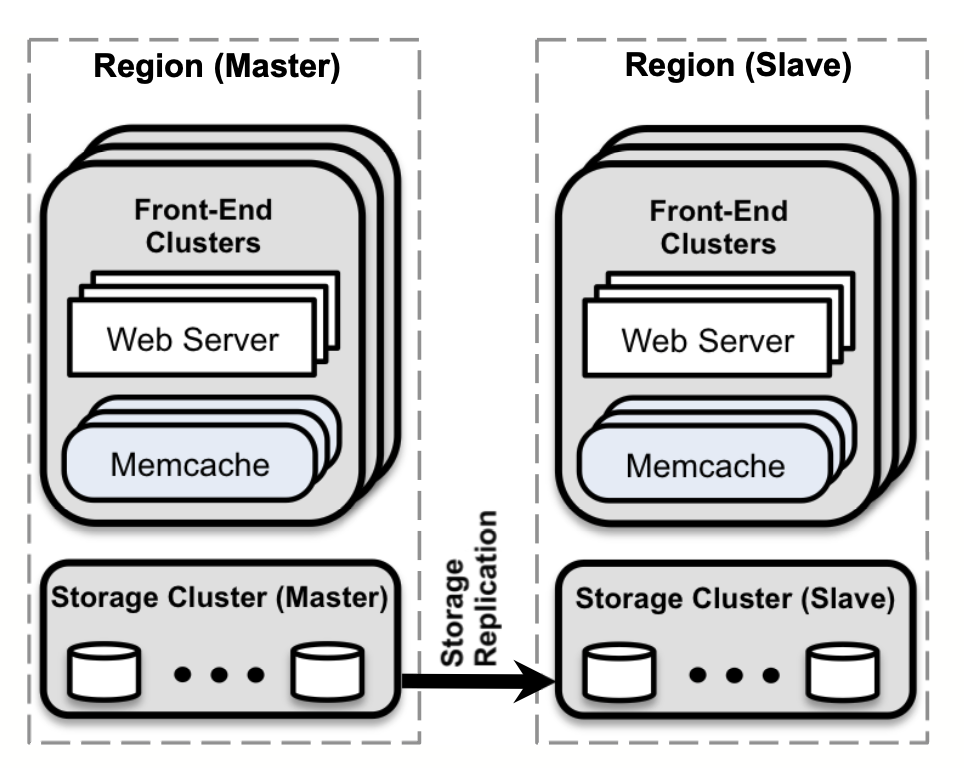

## Look-aside Cache 패턴

Facebook의 Memcache는 **Look-aside 캐시 패턴**을 사용합니다. 이는 캐시가 데이터베이스 앞에서 보조 역할을 수행한다는 의미입니다.

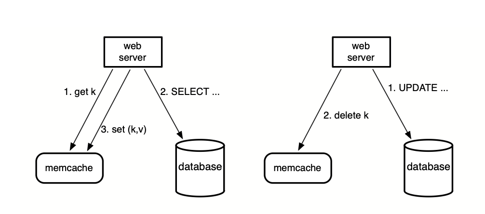

### 읽기 경로 (Cache Miss)

캐시 미스가 발생했을 때의 흐름입니다.

```java
// 1. 먼저 캐시에서 조회
value = memcache.get(key);

if (value == null) {
    // 2. 캐시 미스 시 DB에서 조회
    value = database.select(...);

    // 3. 다음을 위해 캐시에 저장
    memcache.set(key, value);
}
```

### 쓰기 경로

데이터를 수정할 때는 캐시를 업데이트하지 않고 **삭제**합니다.

```java
// 1. DB에 업데이트
database.update(...);

// 2. 캐시에서 삭제 (업데이트 X)
memcache.delete(key);
```

### 왜 업데이트가 아닌 삭제인가?

삭제를 사용하는 이유는 **멱등성** 때문입니다. 같은 삭제 연산을 여러 번 수행해도 결과는 동일합니다. 반면 업데이트는 순서에 따라 결과가 달라질 수 있습니다.

또한 캐시는 **Non-authoritative**합니다. 즉, 데이터베이스만이 유일한 진실의 소스(Single Source of Truth)입니다. 캐시는 성능을 위한 보조 수단일 뿐이며, 캐시된 데이터가 제거되어도 문제가 없습니다.

## 전체 시스템 구조

Facebook의 Memcache 시스템은 **Region 단위로 분할**되어 있습니다.

### Region 구조

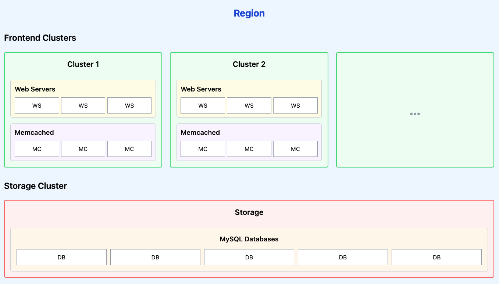

각 Region은 다음으로 구성됩니다:

- **여러 Frontend Cluster**: 웹서버(백엔드 WAS) + Memcached 서버로 구성된 클러스터
- **하나의 Storage Cluster**: MySQL 데이터베이스 클러스터

**Frontend Cluster**의 "Frontend"는 사용자와 직접 통신하는 계층을 의미합니다.

여기서 **웹서버는 Spring, Django 같은 백엔드 애플리케이션 서버**(WAS)를 말합니다.

이러한 구조는 지리적으로 분산된 사용자에게 낮은 지연시간을 제공하면서도, 데이터베이스는 한 곳에서 중앙 관리할 수 있게 합니다.

## 클러스터 내 확장: 지연시간과 부하 최적화

Facebook은 단일 클러스터 내에서 수천 대의 서버로 확장하면서 **지연시간 감소**와 **부하 감소**라는 두 가지 목표에 집중했습니다.

### 지연시간 감소

#### All-to-All 통신 패턴의 문제

Facebook의 인기 페이지를 로딩하면 평균 **521개의 서로 다른 아이템**을 Memcache에서 가져옵니다. 95 퍼센타일은 무려 1,740개입니다.

수백 대의 Memcached 서버가 클러스터에 배치되고, 데이터는 **Consistent Hashing**을 통해 분산됩니다. 따라서 웹서버는 하나의 사용자 요청을 처리하기 위해 수많은 Memcached 서버와 통신해야 합니다.

이러한 **All-to-All 통신 패턴**은 다음 문제를 야기합니다:

- **Incast Congestion**: 많은 서버의 응답이 동시에 도착하면 네트워크 정체 발생
- **단일 서버 병목**: 하나의 서버가 많은 웹서버의 병목이 될 수 있음

#### 병렬 요청과 배치 처리

Facebook은 웹 애플리케이션 코드를 구조화하여 네트워크 왕복을 최소화합니다. 데이터 간의 의존성을 나타내는 **DAG**를 구성하고, 이를 통해 동시에 가져올 수 있는 아이템을 최대화합니다.

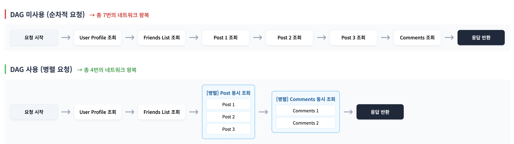

평균적으로 **요청당 24개의 키**로 구성됩니다. 100번의 요청 중 95번은 95개 이하의 키를 사용하며, 나머지 5%의 요청만 그보다 많은 키를 한 번에 조회합니다.

#### UDP와 TCP의 전략적 사용

**GET 요청: UDP 사용**

- 지연시간과 오버헤드를 줄이기 위해 UDP 사용
- UDP는 연결이 없으므로 각 스레드가 직접 Memcached 서버와 통신 가능
- 연결 유지 오버헤드 제거
- 패킷 손실이나 순서 오류는 캐시 미스로 처리
- 피크 로드에서 GET 요청의 0.25%만 손실됨
- UDP 사용 시 TCP 대비 **20% 지연시간 감소**

**SET/DELETE 요청: TCP 사용**

- 신뢰성을 위해 TCP 사용
- 웹서버와 같은 머신에서 실행되는 **mcrouter**를 통해 처리
- 상태 변경 확인이 필요한 작업에 적합

**mcrouter란?**

mcrouter는 memcached 프로토콜을 지원하는 라우팅 프록시입니다:

- **라우팅**: 클라이언트 요청을 적절한 Memcached 서버로 전달
- **연결 통합**: 웹서버의 수많은 스레드가 각각 TCP 연결을 맺는 대신, mcrouter를 통해 연결을 재사용
- **메모리 효율**: TCP 연결마다 소켓 버퍼와 상태 정보가 필요한데, 연결 수를 줄여 메모리 절약
- **프로토콜 지원**: UDP(GET)와 TCP(SET/DELETE) 모두 지원 가능

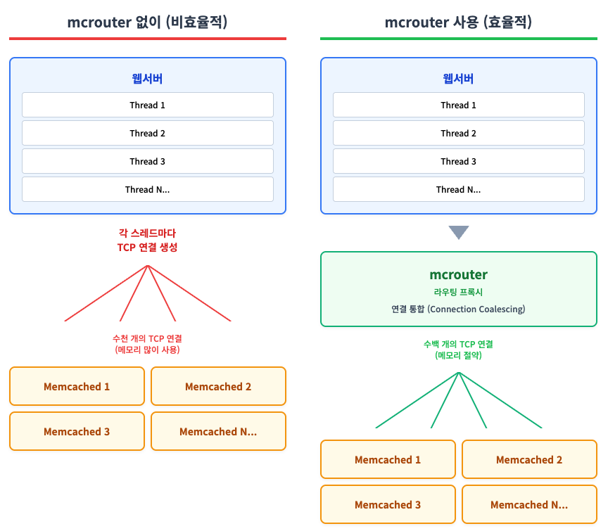

**연결 통합이란?**

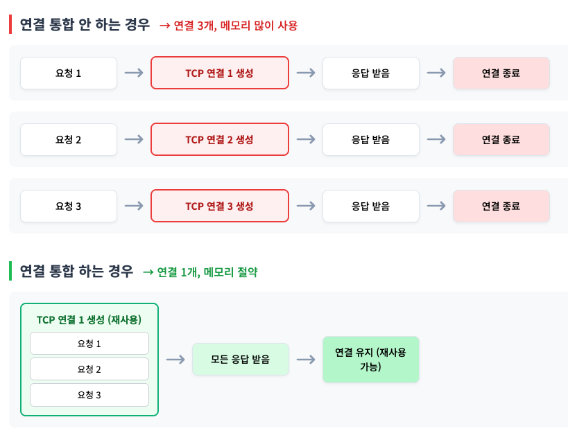

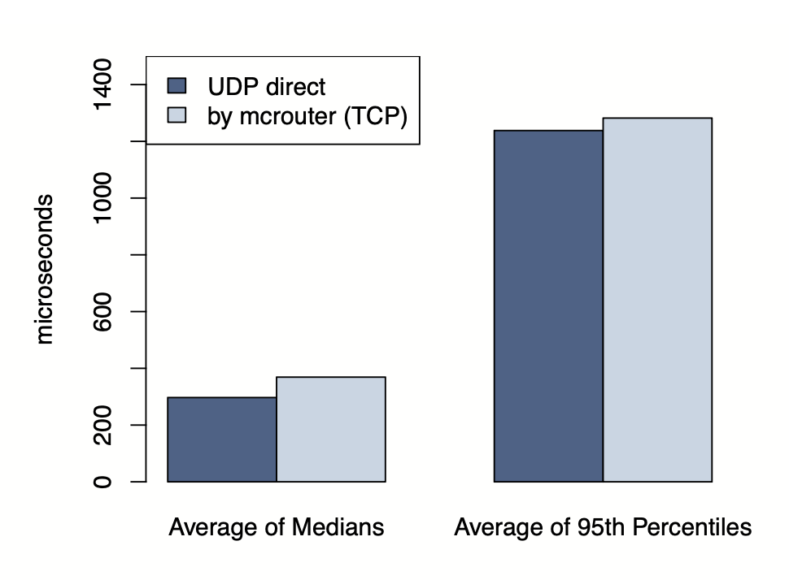

#### Incast Congestion 해결

웹서버는 **슬라이딩 윈도우 메커니즘**을 구현하여 Memcached로 보내는 동시 요청 수를 제한합니다.

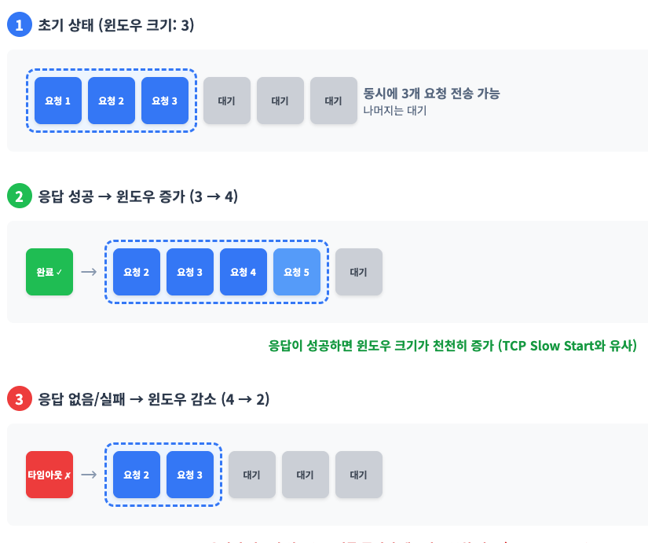

윈도우 크기가 너무 작으면 요청을 순차적으로 보내야 하므로 지연시간이 증가합니다.

**너무 크면 Incast Congestion이 발생합니다.** Facebook은 실험을 통해 최적의 윈도우 크기를 찾았습니다.

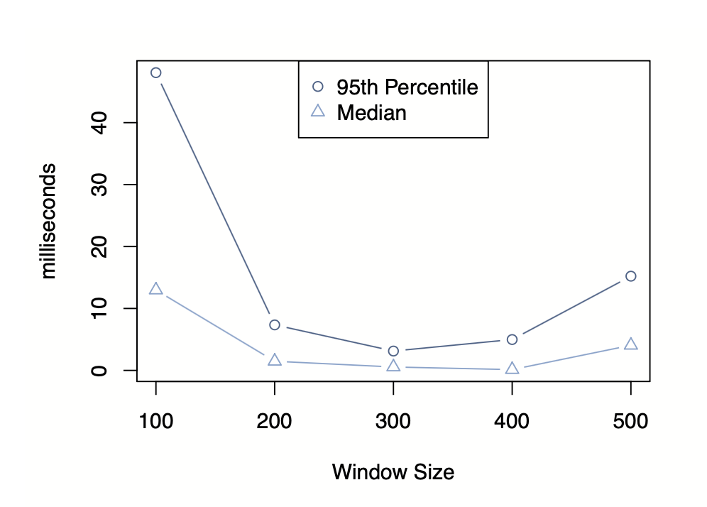

### 부하 감소: Leases 메커니즘

Leases는 Facebook이 개발한 핵심 메커니즘으로, 두 가지 주요 문제를 해결합니다.

#### Stale Sets 문제

오래된 데이터가 캐시에 저장되는 문제입니다. 동시 업데이트가 재정렬되면 발생합니다.

**웹서버 A가 DB에서 데이터를 조회하는 동안**, 웹서버 B가 데이터를 업데이트하고 캐시를 삭제합니다. 하지만 웹서버 A는 이미 오래된 값을 가지고 있었고, 나중에 이를 **캐시에 저장하여 최신 데이터를 덮어씁니다.**

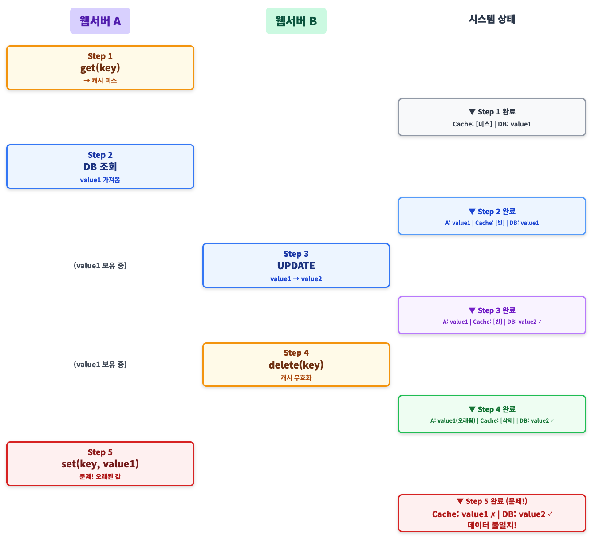


#### Thundering Herds 문제

특정 키에 대한 읽기와 쓰기 활동이 많을 때 발생합니다. 쓰기 활동이 반복적으로 값을 무효화하면 많은 읽기가 비용이 큰 DB 경로로 가게 됩니다.

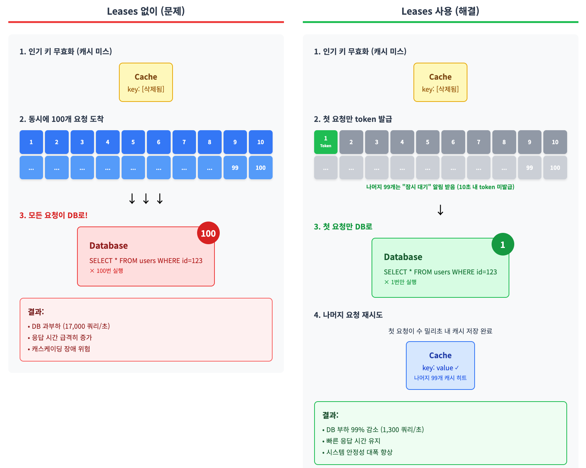

#### Leases 동작 방식

Memcached 인스턴스는 캐시 미스를 경험한 클라이언트에게 **Lease**를 제공합니다.

```java
// 1. 캐시 조회 (미스 시 lease 토큰 받거나 대기 알림 받음)
LeaseToken lease = memcache.get(key);

if (lease.isMiss()) {
    if (lease.hasToken()) {
        // 2-1. Token을 받은 경우 (첫 번째 요청만): DB 조회
        value = database.select(...);

        // 3. lease 토큰과 함께 캐시에 저장
        memcache.set(key, value, lease.getToken());
    } else {
        // 2-2. Token 없는 경우 (나머지 요청들): 잠시 대기 후 재시도
        Thread.sleep(10); // 수 밀리초 대기
        return memcache.get(key); // 캐시에서 재조회 (이미 저장됨)
    }
}
```

**Lease의 효과**

- Memcached는 토큰을 검증하여 데이터 저장 여부를 결정
- 해당 키에 대한 delete 요청을 받으면 토큰 무효화
- **10초당 키당 한 번만** 토큰 발행 (Thundering Herds 방지)
- 토큰이 최근에 발행된 경우, 클라이언트에게 잠시 대기하라고 알림

**실제 효과**

Thundering Herds가 발생하기 쉬운 키들을 1주일간 분석한 결과:

- Leases 없이: 피크 DB 쿼리율 **17K/s**
- Leases 사용: 피크 DB 쿼리율 **1.3K/s**

이는 DB 프로비저닝 비용을 크게 절감합니다.

#### Stale Values 허용

일부 사용 사례에서는 약간 오래된 데이터를 반환하는 것이 허용됩니다.

**동작 방식:**

```
1. delete(key) 실행
   ↓
2. 캐시에서 즉시 삭제하지 않고 "최근 삭제된 아이템" 임시 저장소로 이동
   ↓
3. GET 요청 시 선택:
   - Option A: lease token 발급 (DB에서 최신 값 가져오기)
   - Option B: stale로 마크된 오래된 값 즉시 반환
   ↓
4. 짧은 시간 후 임시 저장소에서 완전히 삭제 (flush)
```

**장점:**

- 애플리케이션이 stale 데이터로도 작동 가능하면 DB 조회 대기 불필요
- **예: 좋아요 수가 1초 전 데이터여도 사용자 경험에 큰 영향 없음**

### Memcache Pools

범용 캐싱 레이어로 Memcache를 사용하면 서로 다른 특성을 가진 데이터들이 같은 캐시 서버를 공유하게 됩니다.

**문제 상황:**

```
같은 Memcached 서버에:
- Low-churn 데이터: 변화 적고 계속 가치 있음 (사용자 프로필)
- High-churn 데이터: 빠르게 변하고 더 이상 접근 안 됨 (오래된 실시간 피드)

메모리가 부족하면?
→ LRU로 오래된 것 삭제
→ 가치 있는 Low-churn 데이터가 삭제됨
→ 더 이상 접근 안 하는 High-churn 데이터가 메모리 차지
→ 히트율 감소 (부정적인 간섭)
```

이런 **부정적인 간섭**을 방지하기 위해 churn 특성별로 캐시 서버를 분리합니다.

#### Pool 분리 전략

클러스터의 Memcached 서버를 별도의 **Pool**로 분할합니다:

- **Wildcard Pool**: 기본 풀 (대부분의 데이터)
- **특수 목적 Pool**: 문제가 되는 키들을 위한 별도 풀

**Pool 분리 예시**

**작은 풀:**
- 데이터: 온라인 상태 표시 (자주 액세스)
- 캐시 미스 시: 간단한 DB 쿼리 (비용 저렴)
- 풀 크기: 작게 유지

**큰 풀:**
- 데이터: 복잡한 머신러닝 결과 (드물게 액세스)
- 캐시 미스 시: 수십 초 걸리는 재계산 (비용 매우 비쌈)
- 풀 크기: 크게 할당 (미스 방지)

#### Churn 특성에 따른 분리

**Churn이란?**

Churn은 데이터의 변동률을 의미합니다:

- **Low-churn**: 데이터가 거의 안 바뀜 (사용자 프로필, 설정 등)
- **High-churn**: 데이터가 자주 바뀜 (실시간 피드, 트렌딩 목록 등)

**Low-churn 키**와 **High-churn 키**를 같은 풀에 두면 문제가 발생합니다:

```
문제:
- Low-churn 키(여전히 가치 있음)가 제거됨
- High-churn 키(더 이상 액세스 안 됨)보다 먼저 제거됨
```

이들을 다른 풀에 배치하면 이러한 부정적 간섭을 방지하고, High-churn 풀의 크기를 캐시 미스 비용에 적절하게 조정할 수 있습니다.

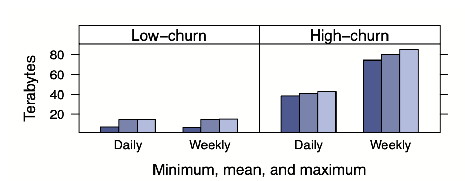

**워킹셋 그래프 해석**

워킹셋(Working Set)은 특정 기간 동안 실제로 사용되는 데이터의 총 크기입니다.

- **Low-churn 데이터**: 일일 워킹셋 ≈ 주간 워킹셋 (매일 같은 데이터 재사용)
- **High-churn 데이터**: 일일 워킹셋 << 주간 워킹셋 (매일 새로운 데이터 추가)

일일과 주간 워킹셋의 차이가 클수록 churn rate가 높다는 의미입니다.

**High-churn 데이터는 시간이 지나면 더 이상 접근하지 않지만 메모리를 차지하므로, 별도 풀로 분리하여 관리해야 합니다.**

### Pool 내 복제

일부 풀에서는 Memcached 서버의 지연시간과 효율성을 향상시키기 위해 **복제**를 사용합니다.

**복제를 선택하는 경우**

1. 애플리케이션이 정기적으로 많은 키를 동시에 가져옴
2. 전체 데이터 세트가 1~2개의 Memcached 서버에 들어감
3. 요청 속도가 단일 서버가 처리할 수 있는 것보다 훨씬 높음

**복제가 더 효율적인 이유**

**키 분할 방식**에서는 각 클라이언트가 100개 키를 모두 필요로 하기 때문에 모든 서버에 접근해야 합니다. 서버를 나눠도 각 서버가 받는 총 요청 수는 줄지 않습니다.
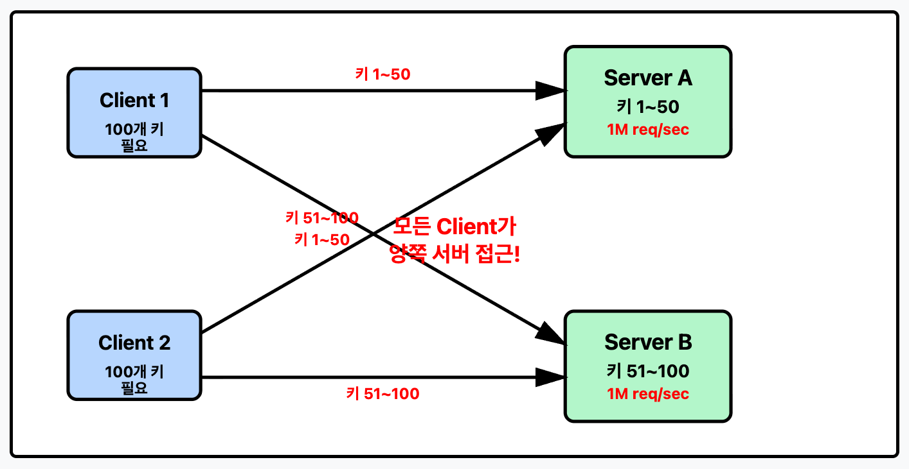


반면 **복제 방식**에서는 모든 서버가 전체 키를 가지고 있어 클라이언트가 아무 서버나 하나만 선택하면 됩니다. 이로 인해 요청이 여러 서버에 고르게 분산되어 각 서버의 부하가 실제로 감소합니다.
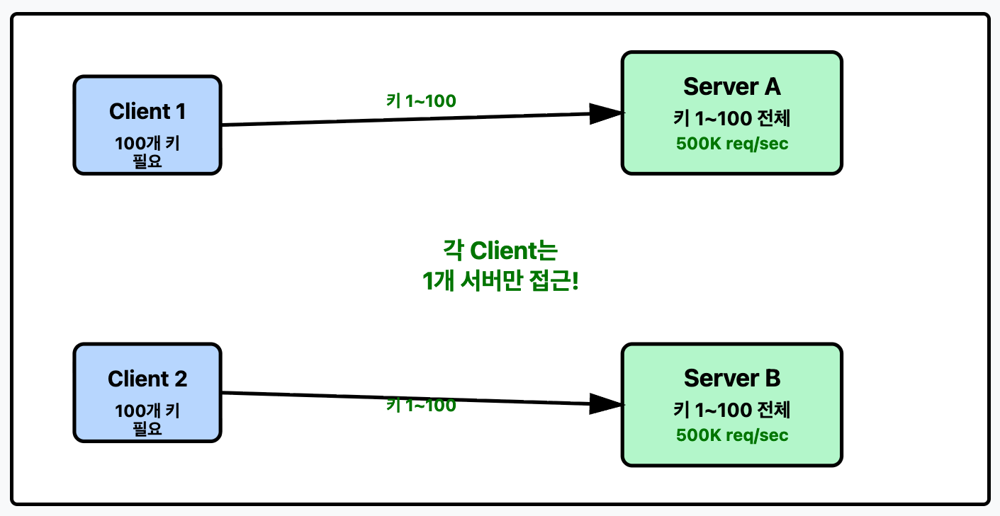

각 클라이언트는 자신의 IP 주소를 기반으로 복제본을 선택합니다. 일관성 유지를 위해 모든 복제본에 무효화를 전달해야 합니다.

### 장애 처리: Gutter 시스템

Memcache에서 데이터를 가져오지 못하면 백엔드 서비스에 과도한 부하가 발생하여 연쇄 장애를 일으킬 수 있습니다.

#### 두 가지 규모의 장애

1. **소규모 장애**: 네트워크나 서버 장애로 소수의 호스트에 접근 불가
2. **광범위한 장애**: 클러스터 내 상당 비율의 서버에 영향

전체 클러스터를 오프라인으로 전환해야 하는 경우, 사용자 요청을 다른 클러스터로 우회시킵니다.

#### Gutter 메커니즘

소규모 장애를 위해 **Gutter**라는 특수 시스템을 도입했습니다. Gutter는 실패한 몇 개 서버의 책임을 대신 맡는 작은 머신 세트입니다.

클러스터 내 Memcached 서버의 약 `1%`를 차지합니다.

**동작 방식**

```java
// 1. 일반 Memcached 서버에 요청
value = memcache.get(key);

if (value == null && isTimeout()) {
    // 2. Gutter 풀에 재시도
    value = gutterPool.get(key);

    if (value == null) {
        // 3. DB 조회 후 Gutter에 저장
        value = database.select(...);
        gutterPool.set(key, value, shortExpiration);
    }
}
```

**Gutter의 효과**

Gutter 시스템 도입 후 실제 효과:

- **실패를 히트로 전환**: 원래 Memcached 서버 장애로 실패했을 요청의 10~25%를 Gutter에서 성공적으로 처리
- **장애율 99% 감소**: 클라이언트가 체감하는 캐시 실패율이 거의 사라짐
- **빠른 복구**: Memcached 서버가 완전히 다운되어도 4분 이내에 Gutter 히트율이 35% 이상으로 상승 (자주 50%까지 도달)

**Gutter의 특징**

- 짧은 만료 시간(short expiration)을 사용하여 약간 오래된 데이터를 제공하더라도 DB 부하를 줄임
- 빠른 만료로 인해 별도의 무효화(invalidation) 메커니즘이 필요 없음

#### Rehashing을 사용하지 않는 이유

서버 장애 시 다른 접근 방법도 있습니다. 남은 정상 서버들에게 장애 서버의 키를 재분배(Rehashing)하는 것입니다.

**Rehashing의 문제점**

하지만 이 방식은 위험합니다:

```
시나리오: 10대 서버 중 1대 장애 발생

문제: 인기 있는 핫 키(예: 유명인 프로필)가 서버 전체 요청의 20%를 차지
→ 장애 서버가 이 핫 키를 담당했다면?
→ Rehashing으로 다른 정상 서버에 핫 키 재배치
→ 해당 서버에 갑자기 20% 추가 부하 발생
→ 그 서버도 과부하로 다운
→ 도미노처럼 연쇄 장애 발생
```

**Gutter의 장점**

Gutter는 유휴 상태의 별도 서버 풀(클러스터의 1%)이므로:
- 정상 서버에 추가 부하를 주지 않음
- 핫 키 문제와 무관하게 안전하게 장애 처리
- 연쇄 장애 위험 차단

---

다음 편에서는 지역 내/지역 간 확장과 성능 최적화를 다룹니다.
