이 글은 [Facebook Memcached 아키텍처 (1탄)](../cache-part1)의 후속편입니다.

이 글은 Facebook의 공식 논문 [Scaling Memcache at Facebook](https://research.facebook.com/publications/scaling-memcache-at-facebook/)을 기반으로 작성되었습니다.

## 지역 내 확장: 데이터 복제

트래픽 증가에 따라 더 많은 웹 및 Memcached 서버를 추가하는 것만으로는 모든 문제를 해결할 수 없습니다. 더 많은 웹서버가 추가될수록 요청이 많은 아이템은 더욱 인기가 높아지고, Memcached 서버 수가 증가하면 Incast Congestion도 악화됩니다.

Facebook은 웹 및 Memcached 서버를 여러 **Frontend Cluster**로 분할했습니다. 이러한 클러스터와 데이터베이스를 포함하는 Storage Cluster가 함께 **Region**을 정의합니다.

**Region 아키텍처의 이점**

**1. 더 작은 장애 도메인**
- 한 Frontend Cluster에 장애가 발생해도 다른 Cluster는 영향받지 않음
- 장애 범위가 전체 시스템이 아닌 하나의 Cluster로 제한됨

**2. 다루기 쉬운 네트워크 구성**
- 각 Cluster가 독립적으로 관리되어 네트워크 설정이 단순해짐
- 대규모 단일 클러스터보다 관리와 문제 해결이 쉬움

**3. Incast Congestion 감소**
- 단일 거대 클러스터에서는 수백 대의 Memcached 서버가 동시에 응답을 보냄
- 여러 작은 Cluster로 나누면 각 웹서버가 통신하는 Memcached 서버 수가 줄어듦
- 동시 응답 수가 감소하여 네트워크 정체 현상 완화

**4. 데이터 복제로 인한 독립적인 장애 도메인**
- 각 Frontend Cluster가 독립적인 Memcached를 가짐
- 같은 인기 데이터(예: 유명인 게시물)가 여러 Cluster의 캐시에 각각 복제되어 저장됨
- Cluster A 장애 시에도 Cluster B는 자신의 캐시 복사본으로 계속 서비스 가능

### 지역 무효화 (Regional Invalidations)

Region의 Storage Cluster(MySQL)는 데이터의 **원본**을 보유합니다. 사용자 요청에 따라 이 데이터가 여러 Frontend Cluster의 Memcached에 복제되어 캐시됩니다.

Storage Cluster는 원본 데이터가 변경되면 모든 **Frontend Cluster의 캐시된 복사본**을 **무효화**(invalidate)하여 일관성을 유지할 책임이 있습니다.

#### mcsqueal 데몬

원본 데이터(DB)를 수정하는 SQL 문은 트랜잭션이 커밋되면 무효화해야 할 Memcache 키를 포함하도록 수정됩니다.

모든 MySQL 데이터베이스에 **mcsqueal 데몬**이 배포됩니다. 이 데몬은 **CDC(Change Data Capture)** 방식으로 동작합니다.

**CDC란?**

모든 현대적인 데이터베이스(Oracle, MySQL 등)는 데이터의 변경 이력을 안정적으로 기록하고 관리하기 위한 **트랜잭션 로그**(Transaction Log)를 가지고 있습니다.

**CDC는 바로 이 데이터베이스의 핵심 기능을 활용**하여 애플리케이션과 완전히 분리되어, 데이터베이스의 **트랜잭션 로그를 직접 읽는 방식으로 동작**합니다.

이를 통해 데이터베이스는 데이터가 변경되면 그 변경 내용을 통지하는 기능을 제공합니다.

**mcsqueal의 동작 방식:**

- **MySQL의 Commit Log를 실시간으로 모니터링**
- 커밋된 SQL 문을 검사하여 무효화할 키(DELETE) 추출
- **해당 Region의 모든 Frontend Cluster에 무효화 명령 브로드캐스트**

**DELETE 명령의 이중 효과:**

mcsqueal이 보내는 DELETE 명령은 단순히 캐시 데이터만 삭제하는 것이 아닙니다:

1. **기존 캐시 데이터 삭제**
2. **해당 키에 발급된 모든 outstanding lease 무효화**

이를 통해 Race Condition을 방지합니다:

```
문제 상황:
1. 클라이언트 A: 캐시 미스 → lease 획득
2. 클라이언트 A: DB에서 데이터 읽음 (user:1 = "Alice")
3. 클라이언트 B: DB 업데이트 (user:1 = "Bob")
4. mcsqueal: DELETE 명령 브로드캐스트 → lease 무효화
5. 클라이언트 A: stale data를 set 시도 → lease가 무효화되어 set 실패

결과: stale data가 캐시에 들어가지 않음
```

**무효화 파이프라인**

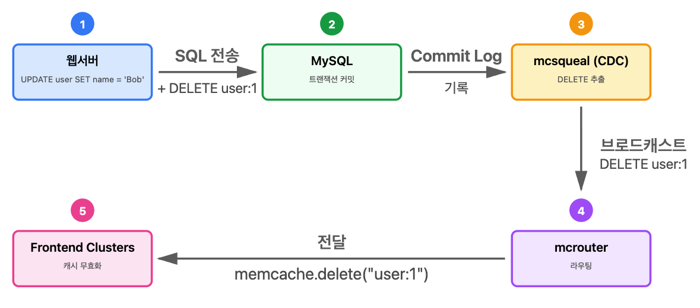

이 방식의 장점은 데이터베이스의 신뢰할 수 있는 로그를 기반으로 하기 때문에, 무효화 명령이 손실되거나 잘못 전달되어도 로그를 재실행(replay)하여 복구할 수 있다는 것입니다.

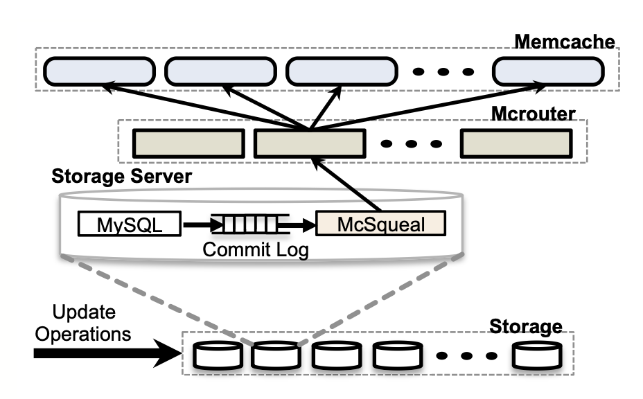

실제로 대부분의 무효화는 데이터를 삭제하지 않습니다. 발행된 모든 DELETE 중 **단 4%만** 실제로 캐시된 데이터를 무효화합니다.

#### 패킷 수 감소

**mcsqueal**이 각 Memcached 서버에 직접 DELETE 명령을 보낼 수도 있지만, **Storage Cluster**에서 수많은 **Frontend Cluster의 수천 대 Memcached 서버로 패킷**을 직접 보내면 **패킷 폭발**(packet storm)이 발생합니다.

**최적화 방법**

```
1. 무효화 데몬이 DELETE를 배치로 묶음
2. 각 Frontend Cluster의 mcrouter 전용 서버로 전송
3. mcrouter가 배치를 개별 DELETE로 언팩
4. Frontend Cluster 내의 올바른 Memcached 서버로 라우팅
```

배치 처리 결과, 패킷당 DELETE 수의 중간값이 **18배 개선**되었습니다.

#### 웹서버를 통한 무효화를 사용하지 않는 이유

웹서버가 모든 Frontend Cluster에 무효화를 브로드캐스트하는 방법이 더 간단하지만 두 가지 문제가 있습니다:

1. **패킷 오버헤드**: 웹서버는 mcsqueal 파이프라인보다 배치 처리가 덜 효과적
2. **시스템적 문제 대응 어려움**: 구성 오류로 인한 DELETE 잘못된 라우팅 발생 시, 과거에는 전체 Memcache 인프라를 롤링 재시작해야 했음 (느리고 방해적)

반면, SQL 문에 무효화를 포함시키면 데이터베이스가 커밋하고 신뢰할 수 있는 로그에 저장하므로, mcsqueal은 손실되거나 잘못 라우팅된 무효화를 간단히 재생할 수 있습니다.

### 지역 풀 (Regional Pools)

각 클러스터는 전송되는 사용자 요청의 혼합에 따라 독립적으로 데이터를 캐시합니다. 사용자 요청이 모든 Frontend Cluster에 무작위로 라우팅되면, 캐시된 데이터는 모든 Frontend Cluster에서 대략 동일합니다.

이를 통해 유지보수를 위해 클러스터를 오프라인으로 전환해도 히트율이 감소하지 않습니다. 하지만 데이터를 과도하게 복제하면 특히 크고 드물게 액세스되는 아이템의 경우 메모리 비효율적일 수 있습니다.

#### 클러스터 vs 지역 복제 결정

여러 Frontend Cluster가 동일한 Memcached 서버 세트를 공유하도록 하여 복제본 수를 줄일 수 있습니다. 이를 **Regional Pool**이라고 합니다.

- **복제**(단순 memcached 늘리기)
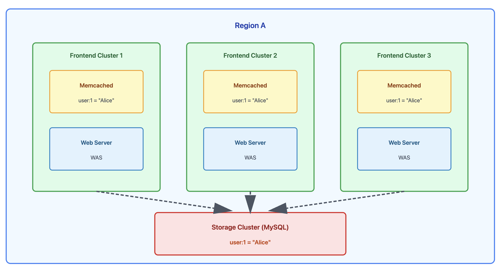

- **regional pool**
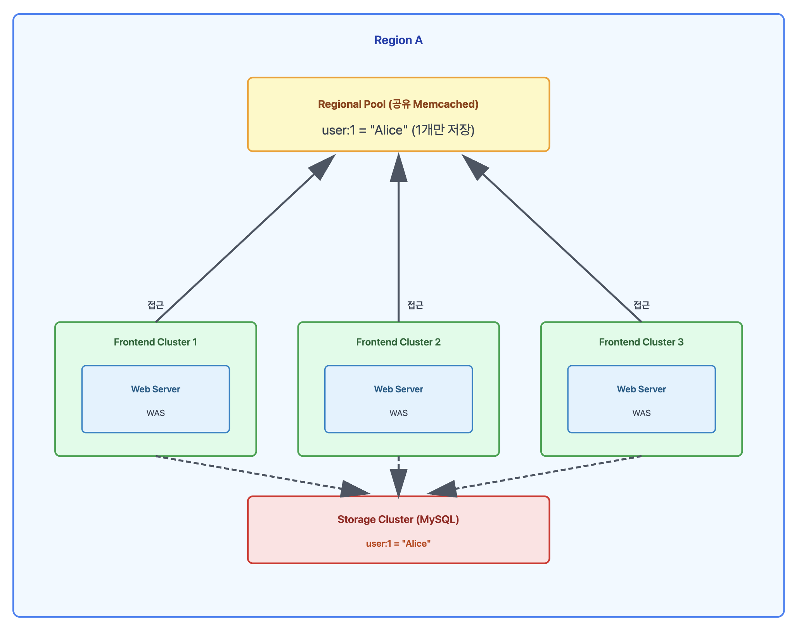

**트레이드오프**

```
복제 (Cluster별 Pool):
+ 낮은 지연시간
+ 높은 가용 대역폭 (클러스터 내부)
+ 더 나은 장애 내성
- 더 많은 Memcached 서버 필요

지역화 (Regional Pool):
+ 메모리 효율적
+ 적은 서버 필요
- 더 높은 지연시간 (클러스터 간)
- 40% 낮은 가용 대역폭
```

**네트워크 토폴로지 차이**

**클러스터 내부 통신:**
- 같은 데이터센터, 같은 랙에 위치
- 물리적 거리가 가깝고 네트워크 홉이 적음
- 높은 대역폭 사용 가능 (예: 10Gbps, 40Gbps 전용)
- 빠르고 병목이 적음

**클러스터 경계 넘는 통신:**
- 다른 랙 또는 다른 데이터센터 간 통신
- 여러 스위치를 거쳐야 함 (ToR → Aggregation → Core → Aggregation → ToR)
- 물리적 거리가 멀고 네트워크 홉이 많음
- 상위 스위치의 대역폭을 여러 클러스터가 공유
- 느리고 동시 다량 전송 시 병목 발생

이러한 이유로 Regional Pool은 메모리는 절약되지만, 네트워크 성능이 저하됩니다.

**실제 사례**

```
카테고리 A (Cluster별 복제):
- 중간 사용자 수: 30명
- 초당 GET 수: 3.26M
- 중간 값 크기: 10.7 kB

카테고리 B (Regional Pool):
- 중간 사용자 수: 1명
- 초당 GET 수: 458K
- 중간 값 크기: 4.34 kB
```

**카테고리 B의 Regional Pool 적합성:**

카테고리 B는 액세스 빈도가 낮아 Regional Pool의 주요 후보입니다:

- 클러스터 간 대역폭에 부정적인 영향을 주지 않음 (요청이 적음)
- 각 클러스터의 Wildcard Pool(한 클러스터의 Memcached 풀)의 **25%를 차지**

**메모리 절약 효과:**

예를 들어, 클러스터가 4개 있다면:

```
복제 방식 (변경 전):
- 각 클러스터가 카테고리 B 데이터를 독립적으로 저장
- 같은 데이터가 4번 중복 저장됨
- Wildcard Pool의 25% × 4개 클러스터 = 전체 메모리의 큰 비중

Regional Pool 방식 (변경 후):
- 카테고리 B 데이터를 Region 전체에서 한 번만 저장
- 각 클러스터의 Wildcard Pool에서 25% 메모리 확보
- 전체 Memcached 메모리 사용량 대폭 감소
```

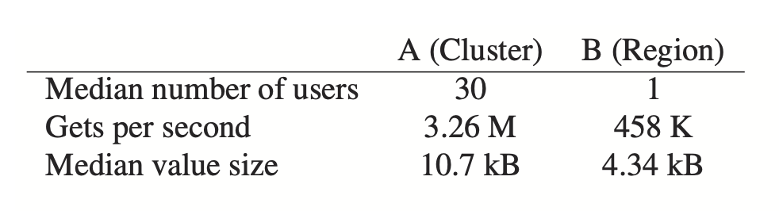

**의사결정 방식:**

현재 Regional Pool로 데이터를 마이그레이션하는 결정은 **수동 휴리스틱**에 기반합니다:

- **액세스 속도**: 얼마나 자주 요청되는가?
- **데이터 세트 크기**: 데이터가 얼마나 큰가?
- **고유 사용자 수**: 몇 명의 사용자가 접근하는가?

자동화된 알고리즘이 아닌, 실제 운영 경험과 이러한 기준들을 보고 **운영자가 직접 판단**하여 결정합니다. 예를 들어, 크고 드물게 접근되며 소수의 사용자만 사용하는 데이터는 Regional Pool에 넣는 것이 효율적입니다.

### 콜드 클러스터 워밍업

새 클러스터를 배포하거나, 기존 클러스터가 장애로 재시작되거나, 예정된 유지보수를 수행할 때 캐시는 매우 낮은 히트율을 가지게 되어 백엔드 서비스를 보호하는 능력이 감소합니다.

#### Cold Cluster Warmup 시스템

**Cold Cluster**(캐시가 비어있는 Frontend Cluster)의 클라이언트가 **DB**가 아닌 **Warm Cluster**(정상 히트율을 가진 클러스터)에서 데이터를 검색할 수 있도록 합니다.

이 시스템을 통해 Cold Cluster는 며칠이 아닌 **몇 시간 만에** 전체 용량으로 복구될 수 있습니다.

#### Race Condition 방지

Cold Cluster Warmup 과정에서 **Region 간 DB 복제 지연**으로 인한 stale data 문제가 발생할 수 있습니다.

**전제 조건:**

```
미국 Region:
- Cold Cluster (캐시 비어있음)
- Storage Cluster (MySQL)

유럽 Region:
- Warm Cluster (정상 캐시)
- Storage Cluster (MySQL)

중요: 미국 MySQL ↔ 유럽 MySQL은 비동기 복제 (수초~수분 지연)
```

**문제 시나리오:**

사용자 A가 미국에서 프로필 사진을 "old.jpg"에서 "new.jpg"로 변경하는 상황

```
[시간 0ms] 미국에서 프로필 사진 변경
- 사용자 A: 미국 MySQL에 업데이트 (user:1 = "new.jpg")
- 미국 mcsqueal: DELETE 명령을 전세계 모든 캐시에 브로드캐스트

[시간 50ms] 캐시 무효화 완료 (빠름!)
- 미국 Cold Cluster 캐시: 삭제됨 ✓
- 유럽 Warm Cluster 캐시: 삭제됨 ✓

[시간 100ms] 사용자 B가 미국 Cold Cluster에서 프로필 사진 조회
1. 미국 Cold Cluster 캐시 조회 → 미스 (이미 삭제됨)
2. Cold Cluster Warmup 로직 발동
   → Warm Cluster(유럽)에서 데이터 가져오기 시도
3. 유럽 Warm Cluster 캐시 조회 → 미스 (이미 삭제됨)
4. 유럽 MySQL 조회
   → 문제: 아직 미국→유럽 MySQL 복제가 안됨!
   → 유럽 MySQL에는 여전히 "old.jpg"
5. "old.jpg"를 미국 Cold Cluster 캐시에 저장

[시간 3초] MySQL 복제 완료 (느림!)
- 유럽 MySQL: "new.jpg"로 업데이트됨
- 하지만 미국 Cold Cluster 캐시에는 여전히 "old.jpg" (stale data!)
```

**핵심 문제:**
- **캐시 무효화는 빠름** (밀리초 단위로 전세계 전파)
- **MySQL 복제는 느림** (수초~수분 소요)
- 이 시간 차이 때문에 Warm Cluster에서 옛날 데이터를 가져와 Cold Cluster에 저장하는 문제 발생

#### Hold-off 메커니즘: Race Condition 해결

위에서 설명한 Race Condition 문제를 해결하기 위해 **Hold-off 메커니즘**을 사용합니다.

**해결 원리:**

Memcached DELETE 명령은 **Hold-off 시간**을 지정할 수 있습니다. Hold-off 시간 동안 해당 키에 대한 **ADD 연산을 거부**합니다.

**동작 방식:**

```java
// 1. Cold Cluster의 모든 DELETE는 2초 hold-off로 발행
memcache.delete(key, holdOffSeconds = 2);

// 2. Cold Cluster에서 미스 감지 시
value = coldCluster.get(key);
if (value == null) {
    // 3. Warm Cluster에서 재요청
    value = warmCluster.get(key);

    // 4. Cold Cluster에 ADD 시도
    boolean success = coldCluster.add(key, value);

    if (!success) {
        // ADD 실패 = hold-off 중 = 더 최신 데이터 존재
        // 5. DB에서 다시 조회
        value = database.select(...);
    }
}
```

**Race Condition 방지 과정:**

1. **[0ms]** 미국에서 프로필 사진 변경 (user:1 = "new.jpg")
2. **[50ms]** mcsqueal이 DELETE 명령 브로드캐스트 (2초 hold-off 포함)
   - 미국 Cold Cluster 캐시 삭제 + 2초간 ADD 금지
3. **[100ms]** 사용자 B가 미국 Cold Cluster에서 조회
   - Cold Cluster 미스 → Warm Cluster(유럽) 조회
   - 유럽 캐시 미스 → 유럽 MySQL 조회 (아직 "old.jpg")
   - Cold Cluster에 ADD 시도 → **실패** (hold-off 중!)
   - DB(미국 MySQL) 직접 조회 → "new.jpg" 획득
4. **[3초]** MySQL 복제 완료 (유럽 MySQL도 "new.jpg")

**결과:** Hold-off 덕분에 stale 데이터("old.jpg")가 캐시에 저장되지 않고, 최신 데이터("new.jpg")를 DB에서 직접 가져옵니다.

**트레이드오프:**

DELETE가 2초 이상 지연될 이론적 가능성은 있지만, 대다수의 경우에는 해당되지 않습니다. Cold Cluster Warmup의 운영상 이점이 드문 캐시 일관성 문제의 비용보다 훨씬 큽니다. Cold Cluster의 히트율이 안정화되고 이점이 감소하면 이 기능을 끕니다.

## 지역 간 확장: 일관성

### 지리적 분산의 이점

데이터 센터를 더 넓은 지리적 영역에 배치하면 여러 이점이 있습니다:

1. **지연시간 감소**: 웹서버를 최종 사용자에게 가까이 배치
2. **지리적 다양성**: 자연재해나 대규모 정전 같은 이벤트의 영향 완화
3. **경제적 인센티브**: 더 저렴한 전력 및 기타 경제적 혜택

Facebook은 여러 Region에 배포하여 이러한 이점을 얻습니다. 각 Region은 Storage Cluster와 여러 Frontend Cluster로 구성됩니다.

### 마스터-복제본 아키텍처

하나의 Region을 마스터 데이터베이스를 보유하도록 지정하고, 다른 Region은 읽기 전용 복제본을 포함하도록 합니다. MySQL의 복제 메커니즘을 사용하여 복제 데이터베이스를 마스터와 최신 상태로 유지합니다.

이 설계에서 웹서버는 로컬 Memcached 서버나 로컬 데이터베이스 복제본에 액세스할 때 낮은 지연시간을 경험합니다.

**주요 기술적 과제**

여러 Region에 걸쳐 확장할 때, Memcache의 데이터와 DB 간의 **일관성 유지**가 주요 기술적 과제가 됩니다. 이러한 문제는 **복제 데이터베이스가 마스터 데이터베이스보다 뒤처질 수 있다**는 단일 문제에서 비롯됩니다.

### 일관성 모델의 철학

Facebook의 시스템은 일관성과 성능 트레이드오프 스펙트럼의 한 지점을 나타냅니다. 일관성 모델은 사이트의 규모에 맞게 수년에 걸쳐 진화했습니다.

시스템이 관리하는 대량의 데이터는 네트워크나 스토리지 요구사항을 증가시키는 사소한 변경도 막대한 비용이 든다는 것을 의미합니다. 더 엄격한 의미론을 제공하는 대부분의 아이디어는 비용이 너무 비싸서 설계 단계를 거의 벗어나지 못합니다.

**설계 목표**

1. 사용자 대면 또는 운영 문제에 영향을 미치는 변경만 수행
2. **일시적으로 stale한 데이터를 읽을 확률**을 조정 가능한 매개변수로 취급 (응답성과 유사)
3. 백엔드 스토리지 서비스를 과도한 부하로부터 보호하기 위해 약간 stale한 데이터 노출 허용

Facebook은 **Best-effort Eventual Consistency**를 제공하지만 성능과 가용성을 강조합니다.

### 마스터 Region에서의 쓰기 처리

Storage Cluster가 데몬을 통해 데이터를 무효화하도록 요구하는 초기 결정은 다중 Region 아키텍처에서 중요한 결과를 가져옵니다.

**Race Condition 방지**

무효화가 데이터가 마스터 Region에서 복제되기 전에 도착하는 Race Condition을 피합니다.

```
문제가 되는 시나리오 (웹서버가 직접 무효화):
1. 마스터 Region 웹서버: DB 수정 완료
2. 웹서버: 복제본 Region에 무효화 전송
3. 복제본 Region: 캐시에서 데이터 삭제
4. 복제본 Region 클라이언트: 데이터 조회 (캐시 미스)
5. 복제본 DB 조회 → 아직 복제 안됨 (stale 데이터)
6. Stale 데이터를 캐시에 저장

안전한 방법 (mcsqueal 사용):
1. 마스터 Region 웹서버: DB 수정 + 무효화 키 포함
2. 마스터 DB: 트랜잭션 커밋 + 로그 기록
3. 복제 스트림: 복제본 Region으로 전파
4. 복제본 DB: 데이터 업데이트
5. mcsqueal: 복제 스트림에서 무효화 추출
6. mcsqueal: 복제본 Region Memcache 무효화
```

**Lease로 Race Condition 방지:**

문제가 되는 시나리오의 4-6단계에서 발생할 수 있는 Race Condition은 **Lease 메커니즘**으로 해결됩니다:

1. **[단계 4]** 복제본 Region 클라이언트가 캐시 미스 시 **lease 발급**
2. 복제본 DB에서 stale 데이터 조회
3. **[단계 2 이후]** mcsqueal의 DELETE 명령이 도착하면 **해당 키의 모든 outstanding lease 무효화**
4. **[단계 6]** 클라이언트가 stale 데이터를 ADD/SET 시도
   - Lease가 무효화되어 있으면 **실패**
   - 실패 시 다시 DB 조회 (이때는 복제 완료되어 최신 데이터)

이를 통해 복제 타이밍과 무관하게 stale 데이터가 캐시에 저장되는 것을 방지합니다.

**mcsqueal을 사용하는 이유:**

Lease만으로도 stale 데이터 캐싱을 방지할 수 있지만, mcsqueal을 사용하는 이유는:

1. **순서 보장**: MySQL 복제 스트림에서 무효화를 추출하므로 DB 업데이트 후 무효화 순서 보장
2. **웹서버 부하 감소**: 여러 Region에 무효화 요청을 보내는 오버헤드 제거
3. **안정적인 전파**: 복제 스트림 기반이므로 네트워크 일시 장애에도 결국 무효화 전파 보장

Lease는 최후의 방어선, mcsqueal은 설계상 안전성을 제공합니다.

### 비마스터 Region에서의 쓰기 처리

**문제 시나리오:**

사용자가 유럽 Region(비마스터)에서 프로필 사진을 "old.jpg" → "new.jpg"로 변경:

1. **[0ms]** 유럽 웹서버가 미국 마스터 DB에 쓰기 (user:1 = "new.jpg")
2. **[100ms]** 미국 마스터 DB 업데이트 완료 (user:1 = "new.jpg")
3. **[200ms]** 사용자가 페이지 새로고침 (유럽에서 조회)
   - 유럽 캐시 미스 → 유럽 DB 조회
   - 문제: 미국→유럽 MySQL 복제가 아직 안 됨 (수초 소요)
   - 유럽 DB에는 여전히 "old.jpg" → 캐시에 "old.jpg" 저장
4. **[3초]** MySQL 복제 완료 (유럽 DB도 "new.jpg"), 하지만 캐시에는 "old.jpg" (stale 데이터)

**핵심 문제:** 비마스터 Region에서 업데이트 후 즉시 조회하면, 로컬 DB 복제가 완료되기 전에 stale 데이터를 캐싱할 수 있습니다.

#### Remote Marker 메커니즘

위 문제를 해결하기 위해 **Remote Marker**를 사용합니다. 핵심 아이디어는 **"이 데이터를 방금 수정했다"는 표시를 남겨두는 것**입니다.

**동작 원리 (구체적 예시):**

유럽에서 프로필 사진을 "old.jpg" → "new.jpg"로 변경하는 경우:

**[쓰기 시]**
1. **Regional Pool에 marker 설정**: `r:user:1 = "1"` (유럽 Region 전체에서 공유)
   - "user:1을 방금 수정했다"는 표시
2. **미국 마스터 DB 업데이트**: `user:1 = "new.jpg"`
   - 무효화 키에 `user:1`과 `r:user:1` 포함 (mcsqueal이 나중에 처리)
3. **유럽 로컬 캐시 삭제**: `user:1` 삭제

**[200ms 후 조회 시]**
1. 유럽 로컬 캐시 조회 → 미스 (방금 삭제했으므로)
2. **Regional Pool에서 marker 확인**: `r:user:1` 존재하는가?
   - **존재함** → "아, 방금 수정된 데이터구나. 로컬 DB는 아직 복제 안 됐을 수 있음"
   - **미국 마스터 Region에 직접 쿼리** → "new.jpg" 획득 (정확한 데이터!)
3. Marker가 없었다면 → 유럽 로컬 DB 조회 (stale 위험)

**[3초 후 - 복제 완료 시]**
- mcsqueal이 `r:user:1` marker 무효화
- 이후 조회는 유럽 로컬 DB에서 안전하게 조회 가능 (복제 완료되었으므로)

**핵심:** Remote Marker는 `"복제가 완료될 때까지 마스터에 직접 물어보라"`는 임시 신호등 역할을 합니다.

**트레이드오프:**

캐시 미스 시 마스터 Region 쿼리로 인한 추가 지연시간 발생, 하지만 stale 데이터 방지.

### 운영상 고려사항

지역 간 통신은 데이터가 큰 지리적 거리(예: 미국 대륙 횡단)를 이동해야 하므로 비용이 많이 듭니다.

**네트워크 효율성:**

DELETE 스트림을 데이터베이스 복제와 동일한 통신 채널로 공유함으로써 낮은 대역폭 연결에서 네트워크 효율성을 얻습니다.

**mcsqueal 배포 위치:**

mcsqueal은 각 Region의 복제 DB와 함께 배포됩니다.

**동작 방식:**
- 미국 마스터 DB에서 `UPDATE user:1 = "new.jpg"` 실행
- MySQL은 이 변경사항을 **바이너리 로그**(transaction log)에 기록
- 유럽 MySQL 복제본이 이 바이너리 로그를 받아서 자신의 DB에 반영
- **유럽의 mcsqueal**이 유럽 MySQL 바이너리 로그를 읽음
- 무효화 키(`user:1`) 추출 → 유럽 Memcache에 DELETE 전송

즉, mcsqueal은 로컬 DB의 변경 로그를 읽어서 로컬 캐시를 무효화합니다.

**장애 시 버퍼링 메커니즘:**

Memcache 서버나 네트워크에 일시적 장애가 발생하면:

**문제 상황:**
- mcsqueal이 Memcache에 DELETE를 보내려 했지만 Memcache 서버가 다운됨
- DELETE가 전달되지 않음 → 캐시가 무효화되지 않음
- 이후 조회 시 stale 데이터를 읽을 위험 증가

**해결 방법:**
- mcrouter와 DB가 DELETE 명령을 **메모리에 버퍼링**(임시 저장)
- Memcache 서버가 복구되면 **버퍼링된 DELETE를 모두 재전송**
- 결국 캐시 무효화 보장

**다른 접근법과 비교:**

1. **클러스터 오프라인 전환**: 장애 감지 시 클러스터 전체를 중단 → 서비스 중단으로 인한 손실이 더 큼
2. **과도한 무효화**: 모든 캐시를 다 삭제 → DB 부하 폭증

Facebook은 일시적인 stale 데이터 노출을 허용하되, 버퍼링으로 결국 일관성을 보장하는 방식을 선택했습니다.

## 단일 서버 성능 개선

All-to-All 통신 패턴은 단일 서버가 클러스터의 병목이 될 수 있음을 의미합니다. 이 섹션에서는 Memcached의 성능 최적화와 메모리 효율성 향상을 설명합니다. 클러스터 내에서 더 나은 확장을 가능하게 합니다.

### 성능 최적화

Facebook은 고정 크기 해시 테이블을 사용하는 단일 스레드 Memcached로 시작했습니다.

**초기 주요 최적화**

1. **해시 테이블 자동 확장**: 조회 시간이 O(n)으로 늘어나는 것 방지
2. **멀티스레드 지원**: 글로벌 락으로 여러 데이터 구조 보호
3. **스레드별 UDP 포트**: 응답 전송 시 경합 감소 및 인터럽트 처리 오버헤드 분산

처음 두 최적화는 오픈소스 커뮤니티에 기여되었습니다.

#### Fine-grained Locking

**문제:** 기존 Memcached는 전체 해시 테이블에 **하나의 락**(Global Lock)을 사용했습니다.
- 여러 스레드가 서로 다른 키에 접근해도 같은 락을 놓고 경쟁
- 멀티코어 환경에서 병목 발생

**해결:** 해시 테이블을 여러 파티션으로 나누고 **각 파티션마다 독립적인 락** 부여
- 스레드 A가 `user:1` 접근, 스레드 B가 `user:2` 접근 시 서로 다른 락 사용 가능
- 락 경합 감소 → 병렬성 향상

**성능 테스트 결과**

```
테스트 환경:
- Intel Xeon CPU (X5650) @ 2.67GHz
- 12코어 + 12 하이퍼스레드
- Intel 82574L 기가비트 이더넷
- 12GB 메모리
- 15개 클라이언트 → 1개 서버 (24 스레드)

10-key Multiget 성능 (1ms 이하 평균 응답 시간):

히트:
- 원래 멀티스레드: 600K items/초
- Fine-grained locking: 1.8M items/초 (3배 향상)

미스:
- 원래 멀티스레드: 2.7M items/초
- Fine-grained locking: 4.5M items/초
```

**왜 캐시 히트가 미스보다 느린가?**

Multiget 요청: `GET user:1, user:2, user:3`

**히트 (600K items/초):**
- 각 키의 값을 메모리에서 읽기
- 각 값을 응답 패킷으로 구성
- 네트워크로 전송
```
VALUE user:1 "profile_data_1"
VALUE user:2 "profile_data_2"
VALUE user:3 "profile_data_3"
END
```

**미스 (2.7M items/초):**
- 해시 테이블 조회만 하고 값이 없음을 확인
- 간단한 응답 하나만 전송
```
END
```

히트는 실제 데이터를 읽고 전송해야 하므로 더 많은 작업이 필요합니다.

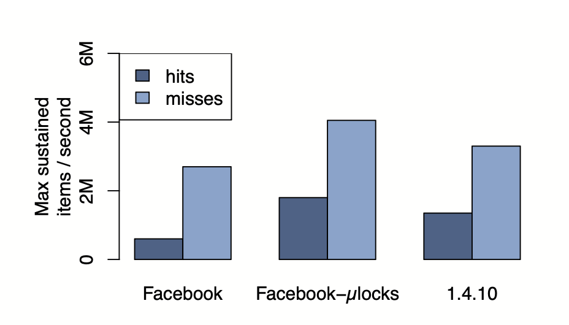

#### UDP vs TCP 성능

UDP 구현이 TCP 구현보다 성능이 우수합니다:

- **Single GET**: 13% 향상
- **10-key Multiget**: 8% 향상

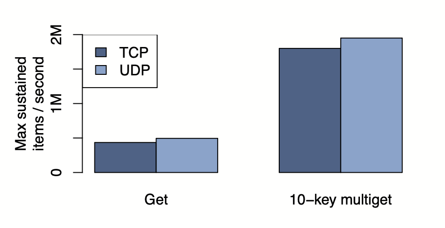

#### Multiget vs Single GET

Multiget은 각 요청에 더 많은 데이터를 포함하므로 동일한 작업에 더 적은 패킷을 사용합니다:

- **10-key Multiget**: Single GET 대비 약 **4배 향상**

### 적응형 슬랩 할당자 (Adaptive Slab Allocator)

Memcached는 메모리를 관리하기 위해 **Slab Allocator**를 사용합니다.

#### 기본 Slab Allocator

**비유: 크기별로 나눠진 주차장**

Memcached는 메모리를 **크기별로 미리 나눠진 주차 공간**(Slab Class)으로 관리합니다.

**Slab Class 구성:**
- **Class 1**: 64 bytes 크기 칸 (작은 오토바이용)
- **Class 2**: 68 bytes 크기 칸 (64 × 1.07)
- **Class 3**: 73 bytes 크기 칸 (68 × 1.07)
- ...
- **Class N**: 1 MB 크기 칸 (대형 트럭용)

**동작 원리:**

저장할 데이터가 50 bytes라면:
1. 50 bytes를 담을 수 있는 **가장 작은 Class** 찾기 → Class 1 (64 bytes)
2. Class 1의 빈 칸에 저장 (14 bytes는 낭비)
3. Class 1의 빈 칸이 없으면 → 1MB 메모리를 새로 요청해서 64 bytes 칸으로 나눔

**제거 정책 (LRU):**

전체 메모리가 꽉 차면:
- 새 50 bytes 데이터를 저장하려면 **Class 1 내에서만** 가장 오래된 데이터 제거
- Class 2, 3에 빈 공간이 많아도 사용 불가 (크기가 안 맞음)

**문제점:**

초기에는 작은 데이터가 많아서 Class 1에 메모리를 많이 할당했는데, 나중에 큰 데이터가 많아지면:
- Class 1은 빈 공간 많음 (낭비)
- Class N은 공간 부족 (히트율 하락)
- 하지만 메모리를 Class 간에 옮길 수 없음!

#### 적응형 할당자

기본 Slab Allocator의 문제(Class 간 메모리 이동 불가)를 해결하기 위해 **메모리 재균형** 메커니즘을 추가했습니다.

**재할당이 필요한 상황 판단:**

구체적인 예시:
- **Class 1 (64B)**: 가장 오래된 데이터가 10분 전에 사용됨
- **Class N (1MB)**: 가장 오래된 데이터가 1분 전에 사용됨 (계속 제거 중)

**조건 1**: Class N이 공간 부족으로 LRU 제거 중
**조건 2**: Class N의 제거 대상(1분 전)이 Class 1의 LRU(10분 전)보다 **20% 이상 최신**
- Class 1: 10분 = 600초
- Class N: 1분 = 60초
- 60초는 600초보다 훨씬 최신 (90% 더 최신)

**결론**: Class N이 더 중요한 데이터를 제거하고 있음 → 메모리 재할당 필요

**재할당 동작:**
- Class 1(빈 공간 많음)에서 1MB Slab을 빼앗아 Class N에게 할당
- Class N은 이제 더 많은 공간 확보

**오픈소스와의 차이**

오픈소스 커뮤니티는 Slab Class 간 제거율을 균형 잡는 유사한 할당자를 독립적으로 구현했습니다. Facebook의 알고리즘은 **가장 오래된 아이템의 나이**를 균형 잡는 데 초점을 맞춥니다.

나이를 균형 잡는 것이 제거율을 조정하는 것보다 전체 서버에 대한 단일 글로벌 LRU 제거 정책을 더 잘 근사합니다.

### 임시 아이템 캐시 (Transient Item Cache)

**문제 상황:**

실시간 이벤트(예: 라이브 스포츠 경기, 콘서트)가 있을 때:
- 수백만 명이 동시에 "실시간 점수" 데이터 조회
- 이 데이터는 30초마다 갱신 (30초 만료 시간 설정)
- 이벤트 종료 후에는 아무도 조회하지 않음

**기존 방식의 문제 (Lazy Eviction):**

```
[10:00] 실시간 점수 캐시 (만료: 30초 후)
[10:00:30] 만료됨! 하지만 메모리에는 그대로 남아있음
[10:01] 아무도 조회 안 함 → 만료 확인 안 함 → 메모리 낭비 계속
[10:02] 아무도 조회 안 함 → 여전히 메모리 차지
...
[11:00] LRU 끝에 도달해야 비로소 삭제
```

이벤트가 끝났는데도 1시간 동안 메모리의 6%를 낭비!

**해결 방법: Circular Buffer**

시계처럼 돌아가는 원형 버퍼 (예: 3600개 버킷 = 1시간 분량):

```
현재 시각: 10:00:00

버킷 인덱스:  [0] [1] [2] [3] ... [30] ... [3599]
               ↑ 헤드 (현재 초)

저장 시:
- 데이터 A (만료: 10초 후) → 버킷[10]에 삽입
- 실시간 점수 (만료: 30초 후) → 버킷[30]에 삽입
- 데이터 B (만료: 100초 후) → 버킷[100]에 삽입

매 초마다:
[10:00:01] 헤드 이동 → 버킷[1] 삭제
[10:00:02] 헤드 이동 → 버킷[2] 삭제
...
[10:00:10] 헤드 이동 → 버킷[10] 삭제 (데이터 A 정확히 10초 후 삭제!)
...
[10:00:30] 헤드 이동 → 버킷[30] 삭제 (실시간 점수 정확히 30초 후 삭제!)
...
[10:01:40] 헤드 이동 → 버킷[100] 삭제 (데이터 B 정확히 100초 후 삭제!)
```

**핵심**: 각 버킷은 "몇 초 후 만료"를 나타내며, 헤드가 그 버킷에 도달하면 정확히 만료 시간이 된 것입니다.

**저장 구조:**

1. **Memcache 해시 테이블**: 실제 데이터 저장 (key → value)
2. **Circular Buffer 버킷**: 해시 테이블 아이템의 **포인터(참조)만** 저장

```
해시 테이블:
user:1 → "점수 데이터" (메모리 주소: 0x1234)

Circular Buffer 버킷[30]:
→ 0x1234 (포인터만 저장)

삭제 시:
버킷[30] 도달 → 0x1234 주소의 데이터를 해시 테이블에서 삭제
```

**효과:**
- 만료 즉시 메모리 해제 (1시간 기다릴 필요 없음)
- 메모리 사용: 6% → 0.3% (20배 개선)
- 히트율: 영향 없음 (어차피 만료된 데이터)

### 소프트웨어 업그레이드

업그레이드, 버그 수정, 임시 진단 또는 성능 테스트를 위해 빈번한 소프트웨어 변경이 필요할 수 있습니다.

**문제점**

Memcached 서버는 피크 히트율의 90%에 도달하는 데 몇 시간이 걸릴 수 있습니다. 결과적으로 Memcached 서버 세트를 업그레이드하는 데 12시간 이상이 걸릴 수 있으며, 그 결과 발생하는 데이터베이스 부하를 신중하게 관리해야 합니다.

#### 공유 메모리 방식

**일반 메모리 vs 공유 메모리:**

**일반 메모리 (프로세스 전용):**
- 프로세스 A가 할당한 메모리는 프로세스 A만 사용
- 프로세스 종료 시 메모리도 함께 삭제됨

**System V 공유 메모리 (OS 관리 영역):**
- OS가 관리하는 특별한 메모리 영역
- 여러 프로세스가 공유 가능
- 프로세스 종료해도 메모리는 OS에 남아있음

**Memcached 개선:**

각 Memcached 서버에서 데이터를 저장할 때:

**기존 방식 (일반 메모리):**
```
Memcached 프로세스 (PID: 1234)
└─ 일반 메모리 할당
   └─ user:1 → "profile data"
   └─ user:2 → "settings"

프로세스 종료 → 메모리 전부 삭제됨
새 프로세스 시작 → 캐시 비어있음 (워밍업 12시간 필요)
```

**개선 방식 (공유 메모리):**
```
OS 공유 메모리 영역 (ID: 9999)
├─ user:1 → "profile data"
├─ user:2 → "settings"
└─ ...

Memcached 프로세스 (PID: 1234) → 공유 메모리 9999에 접근
프로세스 종료 → 공유 메모리는 OS에 유지됨
새 프로세스 (PID: 5678) → 공유 메모리 9999에 접근 (데이터 그대로!)
```

**업그레이드 절차:**
1. 기존 Memcached 프로세스(PID: 1234) 종료
2. OS의 공유 메모리(ID: 9999)는 그대로 유지
3. 새 버전 Memcached 프로세스(PID: 5678) 시작
4. 공유 메모리 9999 연결 → 모든 캐시 데이터 즉시 사용 가능
5. 워밍업 불필요 (히트율 90% 즉시 달성)

## Memcache 워크로드 특성 분석

프로덕션에서 실행 중인 서버의 데이터를 사용하여 Memcache 워크로드를 특성화합니다.

### 웹 서버에서의 측정

소수의 사용자 요청에 대한 모든 Memcache 작업을 기록하고 Fanout, 응답 크기, 지연시간 특성을 분석합니다.

#### Fanout: 서버 접근 패턴

**Fanout이란?** 하나의 페이지 요청을 처리하기 위해 접촉하는 Memcached 서버 개수

**전체 페이지 요청**

- **56%**: 20개 미만의 Memcached 서버 접촉
- 대부분의 사용자 요청은 적은 양의 캐시된 데이터만 필요
- 긴 꼬리 분포 존재

**인기 있는 특정 페이지 (예: 뉴스피드)**

All-to-All 통신 패턴을 명확히 보여줍니다:

- **대부분의 요청**: 100개 이상의 서버 액세스
- 수백 개의 Memcached 서버 액세스도 드물지 않음

**의미:**
- 뉴스피드 페이지는 수백 명 친구의 데이터를 조합
- 친구들의 데이터가 서로 다른 Memcached 서버에 분산 저장됨
- 따라서 한 페이지 요청이 100개 이상의 서버에 접촉 필요
- **단일 서버 장애도 여러 사용자에게 영향** → 높은 가용성 필수

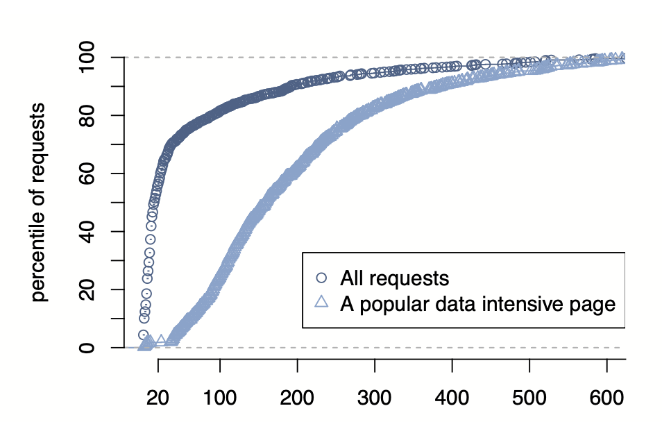

#### 응답 크기 분포

```
통계:
- 중간값: 135 bytes
- 평균: 954 bytes

특징:
- 중간값(135B)과 평균(954B)의 큰 차이 = 아이템 크기가 매우 다양함
- 그래프에서 특정 크기에 데이터가 집중됨:
  - 피크 1: ~100 bytes (작은 단일 값들)
  - 피크 2: ~200 bytes (중간 크기 데이터)
  - 피크 3: ~600 bytes (목록/집합 데이터)

해석 (구체적 예시):

큰 아이템 (평균 954 bytes):
- 친구 목록: [user1, user2, user3, ...] (수십~수백 개)
- 뉴스피드 ID 목록: [post1, post2, ...] (여러 게시물 ID)
- 댓글 목록 데이터

작은 아이템 (중간값 135 bytes):
- 단일 사용자 이름: "John Doe"
- 좋아요 개수: "42"
- 프로필 사진 URL: "https://..."
- 단일 설정 값: {"notifications": true}

의미:
- Facebook은 두 가지 캐싱 전략을 혼용
- 작은 개별 데이터 캐싱 (빠른 조회)
- 큰 집합 데이터 캐싱 (DB 부하 감소)
- Slab Allocator가 다양한 크기를 효율적으로 처리해야 함
```

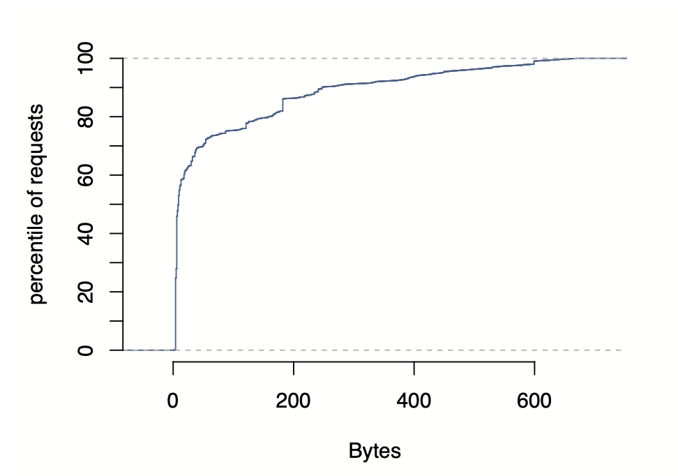

#### 지연시간 특성

웹서버가 Memcache에 데이터를 요청하고 받는 데 걸리는 시간을 측정합니다.

**7일간 측정 (μs = 마이크로초 = 0.001밀리초)**

```
프로덕션 부하 (실제 사용자 트래픽):
- 중간값: 333 μs = 0.333 ms
- p75 (75%): 475 μs = 0.475 ms
- p95 (95%): 1.135 ms

유휴 웹서버 (부하 없음):
- 중간값: 178 μs = 0.178 ms
- p75: 219 μs = 0.219 ms
- p95: 374 μs = 0.374 ms
```

**차이의 원인:**

p95에서 프로덕션(1.135ms)이 유휴(0.374ms)보다 3배 느린 이유:
1. **큰 응답 처리**: 954 bytes 평균 크기 데이터 전송/역직렬화
2. **웹서버 부하**: CPU 바쁠 때 스레드가 스케줄링 대기

### Pool별 통계

4개의 Memcache Pool의 사용 패턴을 분석합니다:

- **Wildcard**: 기본 풀 (모든 데이터)
- **App**: 특정 앱 전용 풀 (게임, 채팅 등)
- **Replicated**: 복제 풀 (인기 데이터)
- **Regional**: 지역 풀 (공유 데이터)

**측정 결과:**

각 풀의 사용 패턴이 완전히 다릅니다:

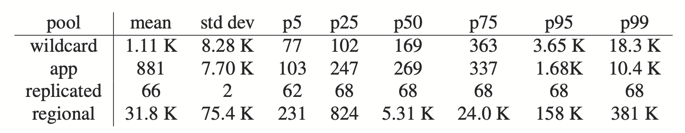


```
Replicated Pool (인기 데이터):
- GET 비율: 가장 높음 (다른 풀의 2.7배)
- 아이템 크기: 가장 작음 (단일 값)
- 예: 사용자 이름, 프로필 사진 URL
- 이유: 자주 읽히는 작은 데이터를 여러 서버에 복제

App Pool (앱 전용):
- 데이터 churn: 높음 (자주 변경됨)
- 미스율: 높음
- 예: 게임 점수, 라이브 채팅 메시지
- 이유: 몇 시간만 사용되고 사라지는 데이터

Regional Pool (지역 공유):
- 접근 빈도: 낮음
- 메모리 효율: 높음
- 예: 카테고리 데이터
- 이유: 여러 클러스터가 공유
```

**의미:** 워크로드 특성에 맞춰 Pool을 분리하면 각각 최적화 가능

### 무효화 지연시간

데이터 수정 후 캐시 무효화가 전파되는 속도를 측정합니다.

**측정 방법:**

```
[시작] 미국 웹서버가 프로필 사진 변경
  ↓
[1단계] 미국 마스터 DB에 쓰기 (user:1 = "new.jpg")
  ↓
[2단계] 미국 로컬 Memcache 무효화 (DELETE user:1)
  ↓
[3단계] 다른 Region 웹서버들이 user:1을 1초마다 조회
  ↓
[측정] 캐시 미스 발생 = 무효화 완료 시점 감지
```

**결과 (p95 기준):**

```
마스터 Region (미국 내):
- 같은 클러스터: 수 밀리초 (2~5ms)
- 다른 Frontend Cluster: 수십 밀리초 (20~50ms)
- 이유: 네트워크 홉 수 차이

복제 Region (미국→유럽):
- 수백 밀리초 (200~500ms)
- 이유: MySQL 복제 지연 + mcsqueal 처리 + 네트워크 전송
```

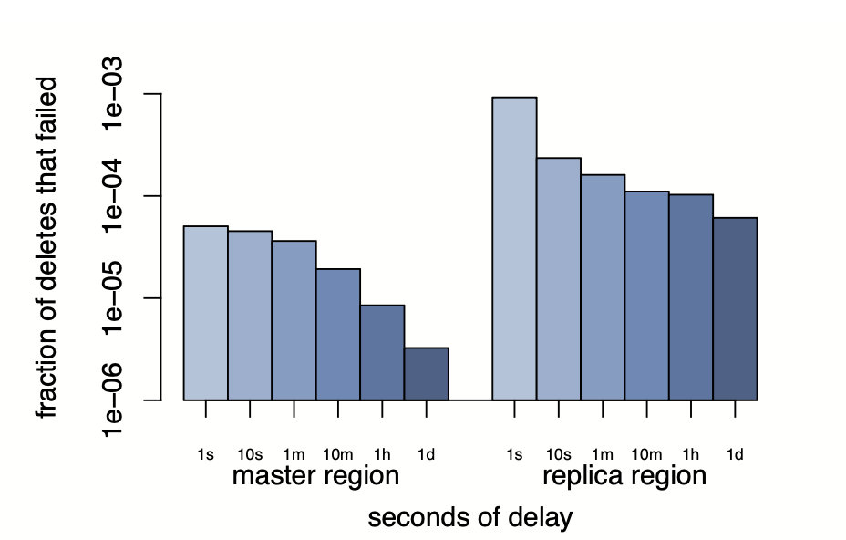

**의미:**
- 같은 Region 내에서는 매우 빠른 무효화 (밀리초)
- 다른 Region은 MySQL 복제 때문에 느림 (수백 밀리초)
- Remote Marker가 이 지연을 보완

## 규모별 우선순위의 변화

Facebook의 경험은 특정 규모에서 일부 품질이 다른 것보다 더 많은 노력을 필요로 한다는 것을 보여줍니다.

**소규모 (단일 클러스터)**

- 초점: 읽기 중심 워크로드, Wide fan-out
- 최적화: 지연시간 감소, 부하 감소
- 일관성: 상대적으로 쉬움 (복제 최소)

**중간 규모 (Region 내 여러 클러스터)**

- 초점: 데이터 복제, 메모리 효율성
- 최적화: 무효화 전파, Regional Pool
- 문제: 클러스터 간 데이터 일관성

**대규모 (여러 Region)**

- 초점: 지리적 분산, 일관성
- 최적화: 복제 지연 처리, Remote Marker
- 문제: 여러 Region 간 일관성 유지
- 서버 수 증가: 통신 스케줄링의 중요성 급증

성능, 효율성, 장애 내성, 일관성 모두 모든 규모에서 중요하지만, 각 규모에서 우선순위는 달라집니다.
