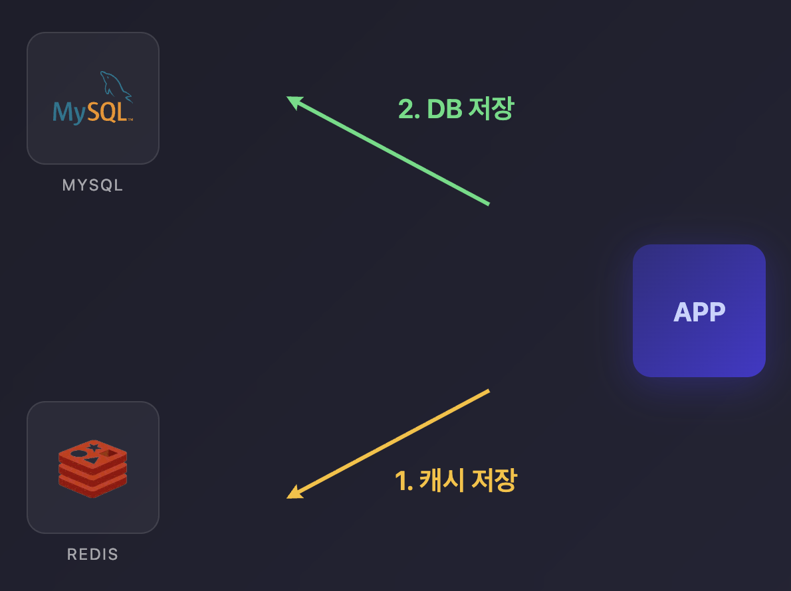
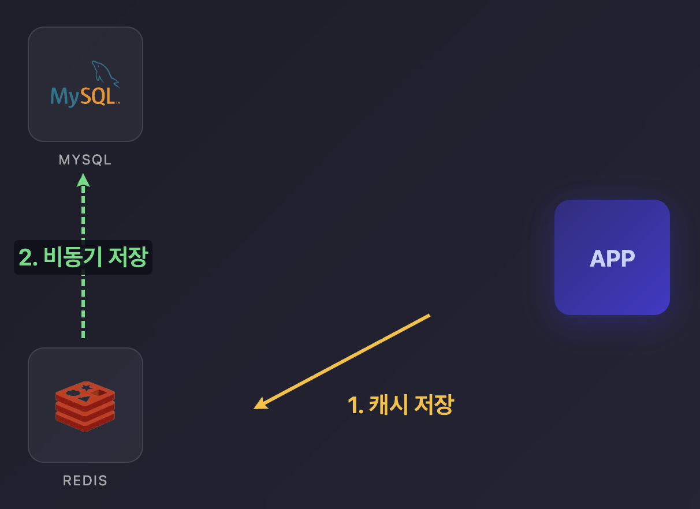
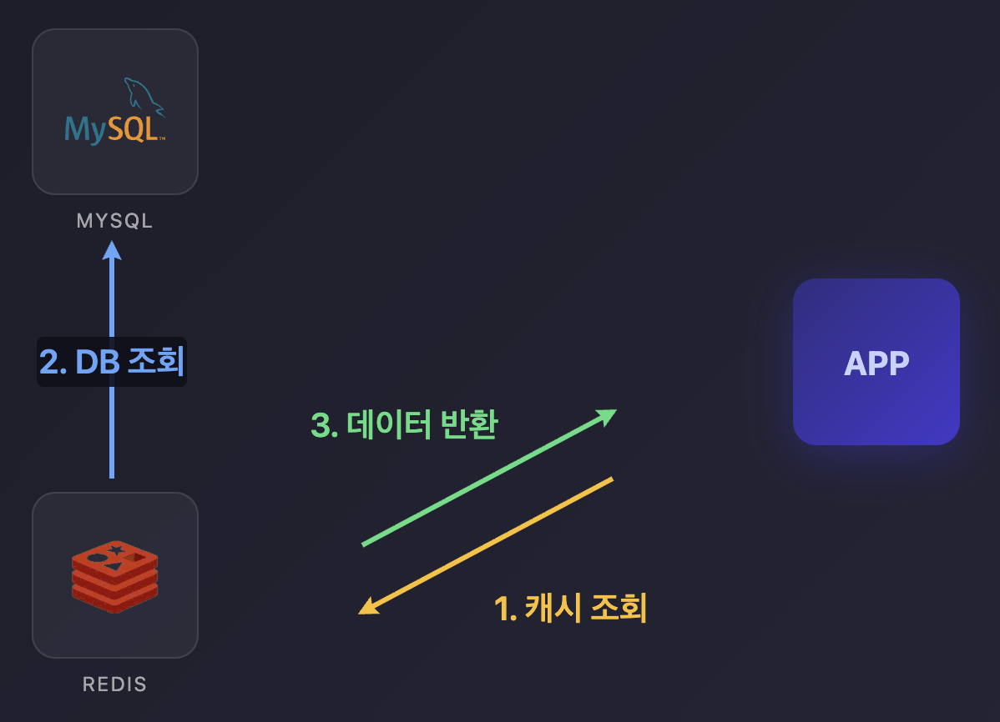
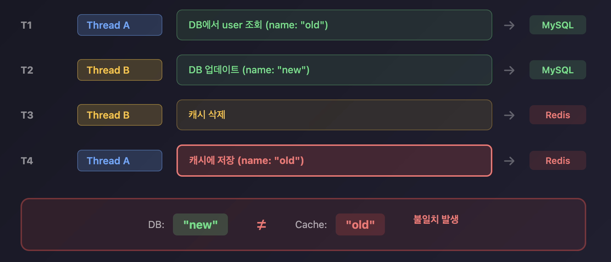
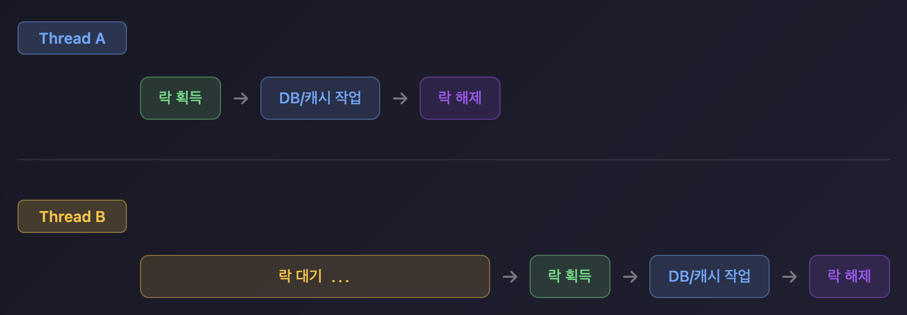
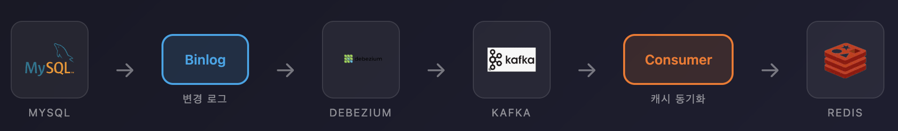
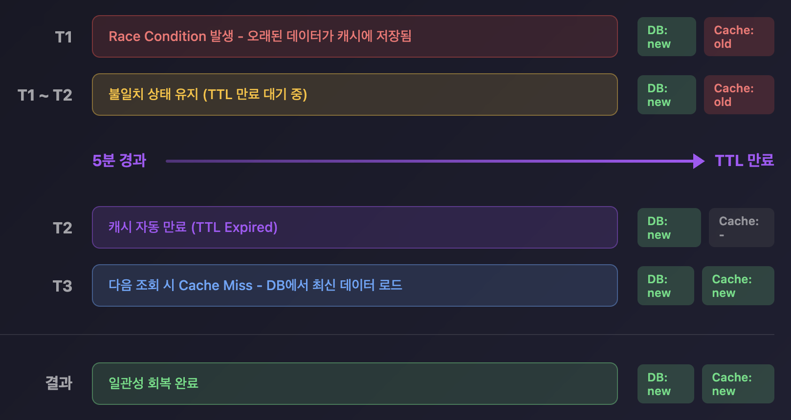

## 들어가며

캐시는 DB 부하를 줄이고 응답 속도를 높이는 핵심 기술입니다. 하지만 **같은 데이터가 두 곳(DB, Cache)에 존재**하기 때문에 일관성 문제가 발생합니다.

이 글에서는 캐시 전략별 특징과 일관성 문제, 그리고 실무에서 사용하는 해결 방법을 알아봅니다.

## 캐시 전략 개요

### 1. Cache-Aside (Lazy Loading)

가장 널리 사용되는 패턴입니다. **애플리케이션이 캐시와 DB를 직접 관리**합니다.


```java
public class CacheAsideService {

    public User getUser(Long userId) {
        String cacheKey = "user:" + userId;

        // 1. 캐시 조회
        User cached = cache.get(cacheKey, User.class);
        if (cached != null) {
            return cached;  // Cache Hit
        }

        // 2. Cache Miss - DB 조회
        User user = userRepository.findById(userId)
            .orElseThrow();

        // 3. 캐시에 저장
        cache.put(cacheKey, user, Duration.ofMinutes(30));

        return user;
    }

    public void updateUser(Long userId, UserUpdateRequest request) {
        // 1. DB 업데이트
        userRepository.update(userId, request);

        // 2. 캐시 삭제 (무효화)
        cache.delete("user:" + userId);
    }
}
```

**장점**
- **구현이 단순함**
- 읽기가 많은 워크로드에 효과적
- 필요한 데이터만 캐싱 (Lazy)

**단점**
- 첫 조회 시 **Cache Miss로 지연 발생**
- 캐시 삭제와 DB 업데이트 사이에 불일치 가능

### 2. Write-Through

쓰기 시 **캐시와 DB를 동시에 업데이트**합니다.



```java
public class WriteThroughService {

    public void updateUser(Long userId, UserUpdateRequest request) {
        User user = User.from(request);
        String cacheKey = "user:" + userId;

        // 캐시와 DB 동시 업데이트 (트랜잭션 내에서)
        cache.put(cacheKey, user);
        userRepository.save(user);
    }
}
```

**장점**
- **캐시가 항상 최신 상태**
- 읽기 시 Cache Miss 감소

**단점**
- **쓰기 지연 증가** (캐시 + DB 둘 다 기다림)
- 사용되지 않는 데이터도 캐싱될 수 있음

### 3. Write-Behind (Write-Back)

쓰기를 **캐시에만 먼저** 하고, **DB 반영은 비동기로** 처리합니다.



```java
public class WriteBehindService {

    private final Queue<WriteEvent> writeQueue = new ConcurrentLinkedQueue<>();

    public void updateUser(Long userId, UserUpdateRequest request) {
        User user = User.from(request);

        // 1. 캐시에만 즉시 저장
        cache.put("user:" + userId, user);

        // 2. 쓰기 큐에 추가 (비동기 처리)
        writeQueue.offer(new WriteEvent(userId, user));
    }

    @Scheduled(fixedRate = 1000)
    public void flushToDatabase() {
        List<WriteEvent> batch = drainQueue(100);
        if (!batch.isEmpty()) {
            userRepository.batchUpdate(batch);
        }
    }
}
```

**장점**
- **쓰기 응답 속도 매우 빠름**
- DB 부하 감소 (배치 처리)

**단점**
- **캐시 장애 시 데이터 유실 위험**
- 복잡한 구현
- 일관성 보장 어려움

### 4. Read-Through

**캐시가 DB 조회까지 담당**합니다. 애플리케이션은 캐시만 바라봅니다.



```java
// Spring Cache 추상화가 Read-Through 패턴
@Cacheable(value = "users", key = "#userId")
public User getUser(Long userId) {
    // Cache Miss 시에만 실행됨
    return userRepository.findById(userId)
        .orElseThrow();
}
```

## 일관성 문제 시나리오

### 문제 1: Race Condition - 동시 읽기/쓰기

두 요청이 거의 동시에 발생할 때 **캐시에 오래된 데이터가 남을 수 있습니다.**




```
[시간 순서]
T1: Thread A가 DB 조회 시작 (name: "old" 읽음)
T2: Thread B가 DB 업데이트 (name: "new")
T3: Thread B가 캐시 삭제
T4: Thread A가 캐시에 저장 (name: "old")  <-- 문제!

결과: DB는 "new", 캐시는 "old"
```

### 문제 2: 캐시 삭제 실패

DB는 업데이트됐는데 **캐시 삭제가 실패하면 불일치가 발생**합니다.

```java
public void updateUser(Long userId, UserUpdateRequest request) {
    userRepository.update(userId, request);  // 성공

    cache.delete("user:" + userId);  // 실패! (네트워크 오류 등)

    // DB는 변경됐는데 캐시에는 이전 데이터가 남아있음
}
```

### 문제 3: DB 트랜잭션 롤백

캐시는 업데이트됐는데 **DB 트랜잭션이 롤백**되는 경우입니다.

```java
@Transactional
public void updateUser(Long userId, UserUpdateRequest request) {
    cache.put("user:" + userId, newUser);  // 캐시 먼저 업데이트

    userRepository.update(userId, request);  // DB 업데이트

    // 이후 로직에서 예외 발생 -> 롤백
    // DB는 롤백되지만 캐시는 이미 변경됨
    someRiskyOperation();
}
```

## 해결 전략

### 전략 1: Cache Invalidation (삭제)
Cache-Aside 패턴에서 **"DB 업데이트 후 캐시 삭제"**는 표준적인 베스트 프랙티스입니다.

```java
// 캐시 삭제 
public void updateUser(Long userId, UserUpdateRequest request) {
    userRepository.update(userId, request);
    cache.delete("user:" + userId);  // 삭제
}
```

**삭제 방식의 장점**
- Race Condition 발생 확률 감소
- 다음 조회 시 자연스럽게 최신 데이터 로드
- 불필요한 캐시 갱신 방지

**갱신 방식의 고려사항**
- 캐시 갱신 시점에 또 다른 Race Condition 가능

### 전략 2: Double Delete 패턴

Race Condition을 줄이기 위해 **캐시를 두 번 삭제**하는 보조 전략입니다.

<!-- [다이어그램 6: Double Delete 패턴]
1. 캐시 삭제 (1차)
2. DB 업데이트
3. 짧은 대기 (500ms)
4. 캐시 삭제 (2차) - 그 사이 잘못 저장된 캐시 제거
-->

```java
public void updateUser(Long userId, UserUpdateRequest request) {
    String cacheKey = "user:" + userId;

    // 1. 먼저 캐시 삭제
    cache.delete(cacheKey);

    // 2. DB 업데이트
    userRepository.update(userId, request);

    // 3. 지연 후 한 번 더 삭제 (비동기)
    CompletableFuture.runAsync(() -> {
        try {
            Thread.sleep(500);  // DB 복제 지연 + 진행 중인 읽기 완료 대기
            cache.delete(cacheKey);
        } catch (InterruptedException e) {
            Thread.currentThread().interrupt();
        }
    });
}
```

**동작 원리**
1. 첫 번째 삭제: 기존 캐시 제거
2. DB 업데이트 실행
3. 두 번째 삭제: 그 사이 Race Condition으로 저장된 오래된 캐시 제거

**주의사항**
- 500ms 같은 고정 지연 시간은 **DB 복제 지연**, 시스템 부하에 따라 효과가 달라짐
- 실제 환경에서는 **모니터링 기반으로 적절한 지연 시간을 튜닝**해야 함
- 완벽한 해결책이 아닌 **Race Condition 확률을 줄이는 보조 수단**으로 활용

### 전략 3: 분산 락을 통한 동시성 제어

동시에 같은 데이터를 수정하지 못하도록 **락을 걸어 직렬화**합니다. **Thundering Herd** 방지와 동시 갱신 제어에 효과적입니다.



```java
@Service
public class UserServiceWithLock {

    private final RedissonClient redisson;

    public void updateUser(Long userId, UserUpdateRequest request) {
        String lockKey = "lock:user:" + userId;
        RLock lock = redisson.getLock(lockKey);

        try {
            // 락 획득 (최대 10초 대기, 락 유지 30초)
            if (lock.tryLock(10, 30, TimeUnit.SECONDS)) {
                userRepository.update(userId, request);
                cache.delete("user:" + userId);
            } else {
                throw new ConcurrentModificationException("락 획득 실패");
            }
        } finally {
            if (lock.isHeldByCurrentThread()) {
                lock.unlock();
            }
        }
    }

    public User getUser(Long userId) {
        String cacheKey = "user:" + userId;
        User cached = cache.get(cacheKey, User.class);

        if (cached != null) {
            return cached;
        }

        // Cache Miss 시에도 락 사용 (Thundering Herd 방지)
        String lockKey = "lock:user:" + userId;
        RLock lock = redisson.getLock(lockKey);

        try {
            if (lock.tryLock(5, 10, TimeUnit.SECONDS)) {
                // Double Check
                cached = cache.get(cacheKey, User.class);
                if (cached != null) {
                    return cached;
                }

                User user = userRepository.findById(userId).orElseThrow();
                cache.put(cacheKey, user, Duration.ofMinutes(30));
                return user;
            }
        } finally {
            if (lock.isHeldByCurrentThread()) {
                lock.unlock();
            }
        }

        // 락 획득 실패 시 DB 직접 조회
        return userRepository.findById(userId).orElseThrow();
    }
}
```

**적용 범위 고려**
- 모든 읽기에 락을 걸면 성능이 크게 저하됨
- 실무에서는 **"쓰기 작업"**이나 **"Cache Miss 시에만"** 락을 거는 것이 일반적
- 특정 **핫키**(자주 접근되는 데이터)에만 선별적으로 적용하는 것을 권장

### 전략 4: Lease 기반 낙관적 동시성 제어

분산 락이 **비관적**(미리 잠금) 방식이라면, **Lease**는 **낙관적**(저장 시점에 검증) 방식입니다. Cache Miss 시 토큰을 발급받고, 저장 시 토큰이 유효한 경우에만 저장을 허용합니다.

```
[Lease 동작 원리]

T1: Thread A가 캐시 조회 → Cache Miss → Lease Token #1 발급
T2: Thread B가 DB 업데이트 (name: "new")
T3: Thread B가 캐시 삭제 → Lease Token #1 무효화
T4: Thread A가 캐시 저장 시도 (Token #1) → 토큰 무효 → 저장 거부

결과: DB "new", 캐시 비어있음 → 다음 조회 시 최신 데이터 로드
```

```java
public User getUser(Long userId) {
    String cacheKey = "user:" + userId;

    // 1. 캐시 조회 시 lease token 함께 발급
    LeaseResult<User> result = cache.getWithLease(cacheKey, User.class);

    if (result.getValue() != null) {
        return result.getValue();  // Cache Hit
    }

    // 2. Cache Miss - DB 조회
    User user = userRepository.findById(userId).orElseThrow();

    // 3. lease token과 함께 저장 시도
    // 토큰이 무효화됐으면 저장 실패 (다른 쓰기가 있었다는 의미)
    cache.putIfLeaseValid(cacheKey, user, result.getLeaseToken());

    return user;
}
```

Lease는 Facebook이 Memcached에서 **Stale Sets**와 **Thundering Herd** 문제를 해결하기 위해 도입한 메커니즘입니다. 자세한 내용은 [Facebook의 대규모 Memcached 운영 전략](/cache-part1/#부하-감소-leases-메커니즘)에서 확인할 수 있습니다.

### 전략 5: 트랜잭션 커밋 후 캐시 처리

DB 트랜잭션이 **확실히 커밋된 후에 캐시를 처리**합니다.

```java
@Service
public class TransactionAwareCacheService {

    @Transactional
    public void updateUser(Long userId, UserUpdateRequest request) {
        userRepository.update(userId, request);

        // 트랜잭션 커밋 후에 캐시 삭제 실행
        TransactionSynchronizationManager.registerSynchronization(
            new TransactionSynchronization() {
                @Override
                public void afterCommit() {
                    cache.delete("user:" + userId);
                }
            }
        );
    }
}
```

```java
// 또는 이벤트 기반으로
@Service
public class UserService {

    private final ApplicationEventPublisher eventPublisher;

    @Transactional
    public void updateUser(Long userId, UserUpdateRequest request) {
        userRepository.update(userId, request);

        // 트랜잭션 커밋 후 이벤트 발행
        eventPublisher.publishEvent(new UserUpdatedEvent(userId));
    }
}

@Component
public class CacheInvalidationListener {

    @TransactionalEventListener(phase = TransactionPhase.AFTER_COMMIT)
    public void handleUserUpdate(UserUpdatedEvent event) {
        cache.delete("user:" + event.getUserId());
    }
}
```

### 전략 6: CDC 기반 캐시 동기화

**Change Data Capture**를 통해 DB 변경을 감지하고 캐시를 동기화합니다.



```
[CDC 아키텍처]
MySQL Binlog --> Debezium --> Kafka --> Consumer --> Redis Cache

장점:
- 애플리케이션 코드에서 캐시 로직 분리
- DB 변경은 무조건 캐시에 반영됨
- 여러 서비스가 같은 데이터를 캐싱해도 일관성 유지

단점:
- 인프라 복잡도 증가 (Debezium, Kafka 운영 필요)
- 이벤트 처리 지연 발생 가능
- 운영/모니터링 부담 증가
```

### 전략 7: TTL 기반 최종 일관성

완벽한 즉시 일관성 대신 TTL을 통해 **"일정 시간 내 수렴"**하는 **최종 일관성**(Eventual Consistency)을 보장합니다.



```java
public User getUser(Long userId) {
    String cacheKey = "user:" + userId;

    User cached = cache.get(cacheKey, User.class);
    if (cached != null) {
        return cached;
    }

    User user = userRepository.findById(userId).orElseThrow();

    // 짧은 TTL 설정 - 불일치가 있어도 금방 해소됨
    cache.put(cacheKey, user, Duration.ofMinutes(5));

    return user;
}
```