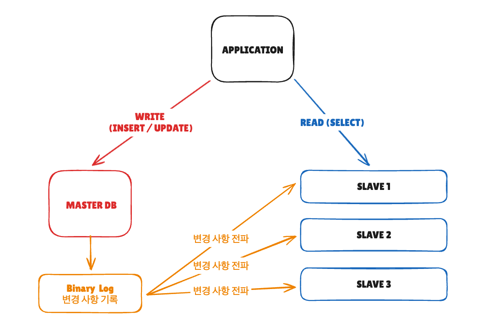
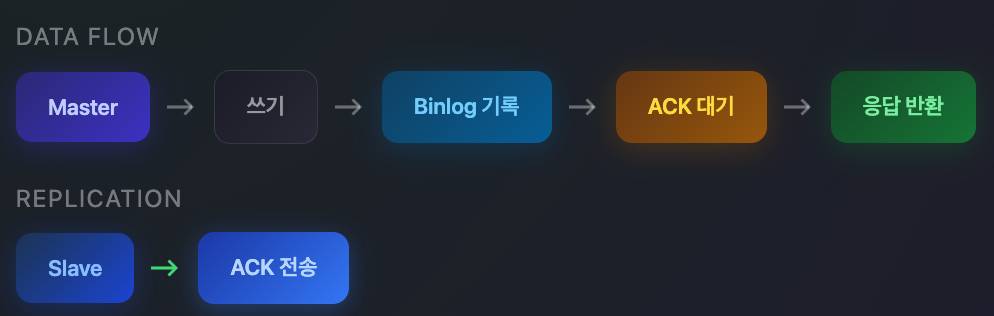
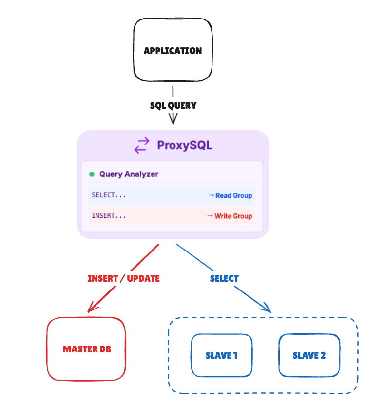

## 들어가며

대규모 서비스에서는 읽기 부하 분산을 위해 Master-Slave(Primary-Replica) 복제 구조를 사용합니다. 하지만 복제는 즉시 이루어지지 않기 때문에 **데이터 일관성 문제**가 발생할 수 있습니다.

이 글에서는 복제 지연이 왜 발생하는지, 어떤 문제를 일으키는지, 그리고 어떻게 해결하는지 알아봅니다.

## Master-Slave 복제 구조



### 비동기 복제의 동작 방식

MySQL의 기본 복제는 **비동기(Asynchronous)** 방식입니다.

```
[비동기 복제 흐름]
1. Client가 Master에 INSERT 실행
2. Master가 Binlog에 기록
3. Master가 Client에 즉시 응답 (커밋 완료)
4. Slave가 Binlog를 가져와서 Relay Log에 저장
5. Slave가 Relay Log를 실행하여 데이터 반영
```

3번과 5번 사이에 시간 차이가 발생하는데, 이것이 **Replication Lag**입니다.

## 복제 지연이 일으키는 문제

### 1. Read-Your-Writes 불일치

가장 흔한 문제입니다. 사용자가 데이터를 저장한 직후 조회했는데 반영이 안 된 것처럼 보입니다.

<!-- [다이어그램 2: Read-Your-Writes 문제]
시간순으로:
1. 사용자 -> Master: 닉네임 변경 (user123 -> newName)
2. Master -> 사용자: 변경 완료!
3. 사용자 -> Slave: 내 프로필 조회
4. Slave -> 사용자: 닉네임: user123 (아직 복제 안됨)
5. 사용자: "???"
-->

```java
// 문제 상황 예시
public void updateAndShow(Long userId, String newNickname) {
    // 1. Master에 쓰기
    userRepository.updateNickname(userId, newNickname);

    // 2. Slave에서 읽기 (복제 지연으로 이전 값이 조회될 수 있음)
    User user = userRepository.findById(userId);

    // user.getNickname()이 여전히 이전 값일 수 있음
    return user;
}
```

**실제 사례**
- 회원가입 직후 로그인 시도 시 "존재하지 않는 회원" 오류
- 게시글 작성 후 목록에서 안 보임
- 결제 완료 후 주문 내역에서 조회 안 됨

### 2. Monotonic Read 불일치

같은 데이터를 연속으로 읽었는데 값이 왔다 갔다 하는 현상입니다.

<!-- [다이어그램 3: Monotonic Read 문제]
Slave1: 복제 완료 (최신 데이터)
Slave2: 복제 지연 (이전 데이터)

1번째 조회 -> Slave1 -> 주문상태: 배송중
2번째 조회 -> Slave2 -> 주문상태: 결제완료 (과거 상태)
3번째 조회 -> Slave1 -> 주문상태: 배송중

사용자 입장에서 상태가 왔다갔다 하는 것처럼 보임
-->

```
[시나리오]
사용자의 연속 조회:
1번째 조회 --> Slave1 --> 주문상태: "배송중"
2번째 조회 --> Slave2 --> 주문상태: "결제완료" (?)
3번째 조회 --> Slave1 --> 주문상태: "배송중"

Slave 간 복제 진행도가 달라서 발생
```

### 3. 팬텀 데이터

트랜잭션 내에서 여러 테이블을 조회할 때, 일부는 최신 데이터고 일부는 과거 데이터인 상황입니다.

```java
// 주문과 결제가 동시에 생성되었는데
Order order = orderRepository.findById(orderId);  // Slave1에서 조회 - 있음
Payment payment = paymentRepository.findByOrderId(orderId);  // Slave2에서 조회 - 없음

// 주문은 있는데 결제 정보가 없는 비정상 상태로 보임
```

## 복제 지연 측정

문제를 해결하기 전에 현재 지연 상태를 파악해야 합니다.

### MySQL에서 복제 지연 확인

```sql
-- Slave에서 실행
SHOW SLAVE STATUS\G

-- 주요 확인 항목
Seconds_Behind_Master: 5  -- Master 대비 5초 지연
Slave_IO_Running: Yes
Slave_SQL_Running: Yes
```

## 해결 전략

### 1. Read-Your-Writes 보장: 쓰기 후 Master 읽기

가장 단순한 방법입니다. **쓰기 직후에는 Master에서 읽습니다.**

<!-- [다이어그램 4: 쓰기 후 Master 읽기 전략]
1. Client -> Master: 데이터 쓰기
2. Master -> Client: 완료
3. Client -> Master: 같은 데이터 읽기 (Slave 대신 Master로)
4. Master -> Client: 최신 데이터 반환

일정 시간(예: 3초) 이후에는 다시 Slave에서 읽기
-->

```java
@Service
public class ProductService {

    private final MasterSlaveRoutingDataSource dataSource;
    private final StringRedisTemplate redisTemplate;

    private static final String WRITE_TIME_PREFIX = "write:product:";
    private static final long MASTER_READ_DURATION_MS = 3000;

    @Transactional
    public void updatePrice(Long productId, BigDecimal newPrice) {
        // Master에 가격 수정
        productRepository.updatePrice(productId, newPrice);

        // Redis에 최근 쓰기 기록 (모든 인스턴스가 공유)
        String key = WRITE_TIME_PREFIX + productId;
        redisTemplate.opsForValue().set(
            key,
            String.valueOf(System.currentTimeMillis()),
            Duration.ofMillis(MASTER_READ_DURATION_MS)
        );
    }

    @Transactional(readOnly = true)
    public Product getProduct(Long productId) {
        // 최근에 수정된 상품이면 Master에서 읽기
        if (shouldReadFromMaster(productId)) {
            dataSource.setRoutingKey(RoutingKey.MASTER);
        }

        return productRepository.findById(productId);
    }

    private boolean shouldReadFromMaster(Long productId) {
        String key = WRITE_TIME_PREFIX + productId;
        return redisTemplate.hasKey(key);
    }
}
```

### 2. 세션 기반 Slave 고정

같은 세션(사용자)은 항상 같은 Slave에서 읽도록 고정합니다. Monotonic Read 문제를 해결합니다.

```
사용자 A의 세션 --> 항상 Slave1
사용자 B의 세션 --> 항상 Slave2
사용자 C의 세션 --> 항상 Slave3

세션 ID를 해싱하여 특정 Slave에 고정
```

```java
@Component
public class SessionBasedSlaveRouter {

    private final List<DataSource> slaves;

    public DataSource getSlaveForSession(String sessionId) {
        // 세션 ID를 해싱하여 항상 같은 Slave 선택
        int index = Math.abs(sessionId.hashCode()) % slaves.size();
        return slaves.get(index);
    }
}
```

### 3. GTID 기반 동기화 대기

MySQL 5.6+에서 지원하는 GTID(Global Transaction ID)를 활용합니다. 특정 트랜잭션까지 복제가 완료될 때까지 대기합니다.

<!-- [다이어그램 6: GTID 기반 동기화]
1. Client -> Master: INSERT (GTID: uuid:100 발급)
2. Master -> Client: 완료, GTID=uuid:100
3. Client -> Slave: "uuid:100까지 복제됐나요?" (WAIT_FOR_EXECUTED_GTID_SET)
4. Slave: 복제 완료될 때까지 대기...
5. Slave -> Client: 준비됨
6. Client -> Slave: SELECT 실행
-->

```java
@Service
public class GtidAwareService {

    @Autowired
    private JdbcTemplate masterJdbc;

    @Autowired
    private JdbcTemplate slaveJdbc;

    public void writeAndReadConsistently(Data data) {
        // 1. Master에 쓰기
        masterJdbc.update("INSERT INTO ...", data);

        // 2. 현재 GTID 위치 확인
        String gtid = masterJdbc.queryForObject(
            "SELECT @@GLOBAL.gtid_executed", String.class);

        // 3. Slave가 해당 GTID까지 복제 완료할 때까지 대기
        slaveJdbc.queryForObject(
            "SELECT WAIT_FOR_EXECUTED_GTID_SET(?, ?)",
            Integer.class,
            gtid,
            5  // 최대 5초 대기
        );

        // 4. 이제 Slave에서 읽어도 일관성 보장
        return slaveJdbc.queryForObject("SELECT ...", Data.class);
    }
}
```

**주의사항**
- 대기 시간이 길어지면 응답 지연 발생
- 타임아웃 설정 필수
- 모든 쿼리에 적용하면 성능 저하

### 4. Semi-Synchronous Replication

MySQL 설정 레벨에서 최소 1개 Slave에 복제가 완료된 후에 커밋을 확정합니다.

```sql
-- Master 설정
INSTALL PLUGIN rpl_semi_sync_master SONAME 'semisync_master.so';
SET GLOBAL rpl_semi_sync_master_enabled = 1;
SET GLOBAL rpl_semi_sync_master_timeout = 1000;  -- 1초

-- Slave 설정
INSTALL PLUGIN rpl_semi_sync_slave SONAME 'semisync_slave.so';
SET GLOBAL rpl_semi_sync_slave_enabled = 1;
```

#### semi-sync replication


```
[Semi-Sync 흐름]
1. Client -> Master: INSERT
2. Master: Binlog 기록
3. Master -> Slave: Binlog 전송
4. Slave: 수신 확인 (ACK)
5. Master <- Slave: ACK
6. Master -> Client: 커밋 완료

장점: 최소 1개 Slave에는 데이터가 있음을 보장
단점: 쓰기 지연 증가 (네트워크 RTT만큼)
```

### 5. 쿼리 라우터 활용 (ProxySQL)

애플리케이션 코드 수정 없이 프록시 레벨에서 라우팅을 처리합니다.



ProxySQL이 쿼리를 분석하여 자동 라우팅
- **SELECT -> Slave**
- **INSERT/UPDATE/DELETE -> Master**
- 복제 지연 감지 시 **해당 Slave 제외**


```sql
-- ProxySQL 설정 예시

-- 서버 등록
INSERT INTO mysql_servers(hostgroup_id, hostname, port) VALUES
(10, 'master.db.local', 3306),   -- Writer 그룹
(20, 'slave1.db.local', 3306),   -- Reader 그룹
(20, 'slave2.db.local', 3306);

-- 쿼리 라우팅 규칙
INSERT INTO mysql_query_rules(rule_id, match_pattern, destination_hostgroup) VALUES
(1, '^SELECT.*FOR UPDATE', 10),   -- SELECT FOR UPDATE는 Master로
(2, '^SELECT', 20),               -- 일반 SELECT는 Slave로
(3, '.*', 10);                    -- 나머지는 Master로

-- 복제 지연 임계치 설정 (3초 초과 시 해당 Slave 제외)
UPDATE mysql_servers SET max_replication_lag = 3 WHERE hostgroup_id = 20;
```

ProxySQL이 주기적으로 각 Slave의 `Seconds_Behind_Master`를 체크해서 자동으로 관리합니다.

```
[동적 Slave 관리]
T1: Slave2 복제 지연 5초 -> 임계치(3초) 초과 -> 라우팅 제외
T2: Slave2가 복제 따라잡는 중...
T3: Slave2 복제 지연 1초 -> 임계치 이하 -> 다시 라우팅에 포함
```

**상태에 따라 동적으로** 포함/제외됩니다.

```java
// 애플리케이션은 ProxySQL만 바라봄
spring:
  datasource:
    url: jdbc:mysql://proxysql.local:6033/mydb
    username: app_user
    password: xxx
```
