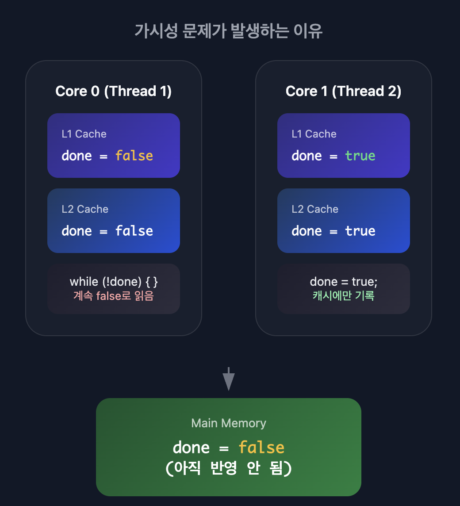
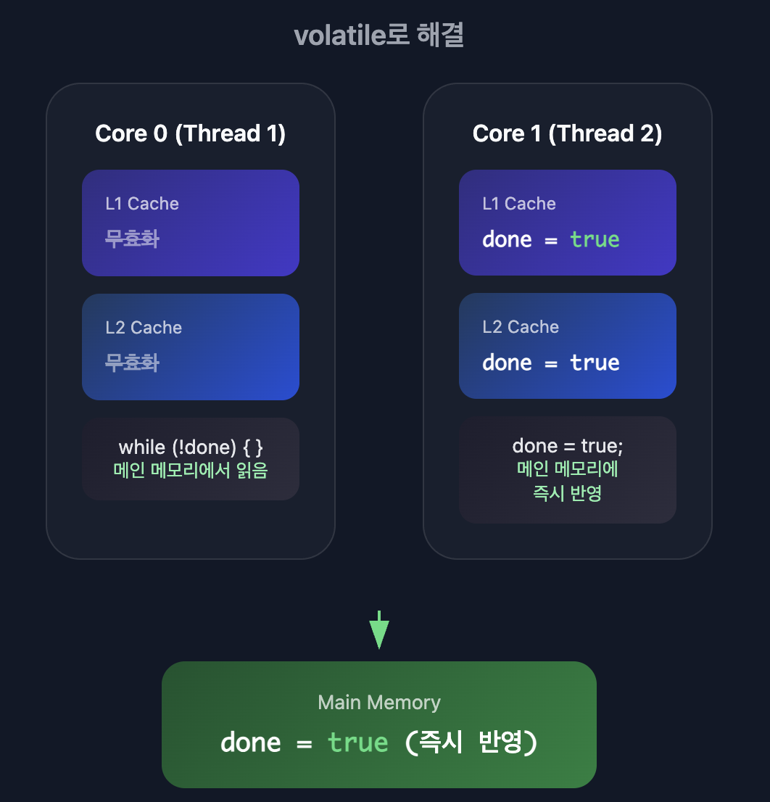
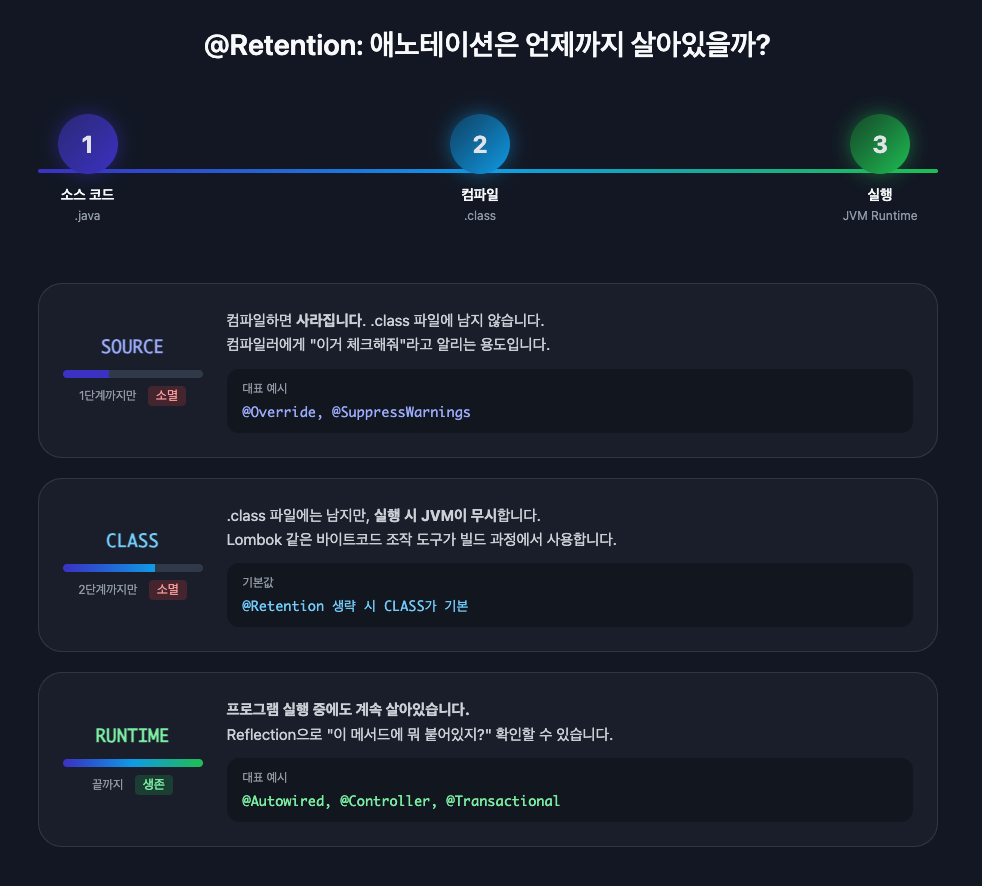
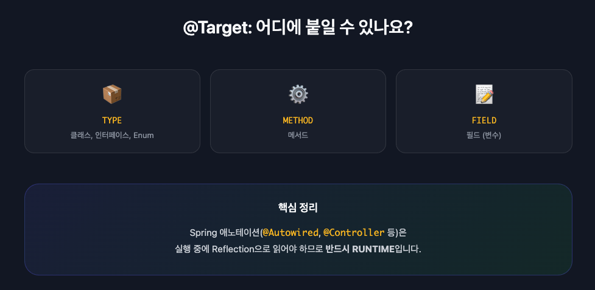
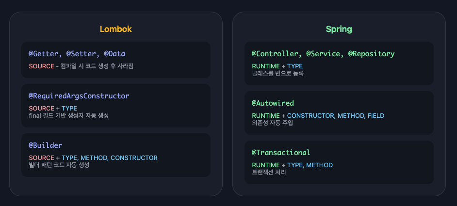

## Collection Framework란?

자바에서 데이터를 효율적으로 저장, 검색, 삭제하기 위한 표준화된 자료구조 프레임워크입니다.

인터페이스(`List`, `Set`, `Map`)와 구현체(`ArrayList`, `HashMap`), 유틸리티 클래스(`Collections`)를 포함합니다.

---

## Collection Framework 계층 구조

Java Collections Framework는 두 개의 주요 인터페이스 그룹으로 나뉜다.

```
Collection (root interface)
├── List (순서 유지, 중복 허용)
│   ├── ArrayList
│   ├── LinkedList
│   └── Vector
├── Set (중복 불허)
│   ├── HashSet
│   ├── LinkedHashSet
│   └── TreeSet (SortedSet 구현)
└── Queue (FIFO/우선순위)
    ├── PriorityQueue
    └── Deque (양방향 큐)
        └── LinkedList

Map (별도 계층, Collection 미상속)
├── HashMap
├── LinkedHashMap
├── TreeMap (SortedMap 구현)
└── ConcurrentHashMap
```

**핵심 특징**:
- `Collection`은 최상위 인터페이스로, 객체 그룹을 표현
- `Map`은 `Collection`을 상속하지 않는 별도의 계층 구조
- 모든 핵심 컬렉션 인터페이스는 제네릭 타입

---

## ArrayList vs LinkedList

### ArrayList - 동적 배열

```java
// 내부 구조
Object[] elementData; // 실제 요소를 저장하는 배열
int size; // 현재 요소 개수
```

- 연속된 메모리 공간에 요소 저장
- 용량 부족 시 더 큰 배열 생성 후 복사
- 초기 용량: 10, 확장 시 1.5배 증가

### LinkedList - 이중 연결 리스트

```java
// Node 구조
private static class Node<E> {
    E item;
    Node<E> next;     // 다음 노드 참조
    Node<E> prev;     // 이전 노드 참조
}

transient Node<E> first;  // 첫 번째 노드
transient Node<E> last;   // 마지막 노드
```

- 각 노드가 이전/다음 노드를 참조
- `List`와 `Deque` 인터페이스 모두 구현

### 성능 비교

| 작업                | ArrayList | LinkedList         |
| ------------------- | --------- | ------------------ |
| get(index)          | O(1)      | O(n)               |
| add(element)        | O(1) 평균 | O(1)               |
| add(index, element) | O(n)      | O(n)               |
| remove(index)       | O(n)      | O(n)               |
| 메모리 효율         | 더 효율적 | 추가 링크 오버헤드 |

**선택 기준**:
- **ArrayList**: 빠른 랜덤 액세스, 삽입/삭제가 적을 때
- **LinkedList**: 양 끝에서 빈번한 삽입/삭제

---

## HashMap 내부 동작 원리

### 기본 구조

```java
transient Node<K,V>[] table;  // 버킷 배열

static class Node<K,V> implements Map.Entry<K,V> {
    final int hash;
    final K key;
    V value;
    Node<K,V> next;  // 다음 노드 (충돌 시)
}
```

### 동작 순서

1. `key.hashCode()` 호출하여 해시값 계산
2. 해시값을 배열 크기로 나눈 나머지로 버킷 인덱스 결정
3. 해당 버킷에 키-값 쌍 저장

### 해시 충돌 처리 (Java 8+)

Java 8부터 성능 개선을 위해 트리 구조를 도입했습니다.

```java
static final int TREEIFY_THRESHOLD = 8;      // 트리로 변환되는 임계값
static final int UNTREEIFY_THRESHOLD = 6;    // 다시 리스트로 변환되는 임계값
static final int MIN_TREEIFY_CAPACITY = 64;  // 트리화 최소 용량
```

**트리화 프로세스**:
1. 버킷에 8개 미만: 연결 리스트 사용
2. 버킷의 노드가 8개 이상 && 전체 용량 64 이상: Red-Black Tree로 변환
3. 노드가 6개 이하로 감소: 다시 연결 리스트로 변환

**성능 영향**:

```
Linked List: O(n) 탐색
Red-Black Tree: O(log n) 탐색

최악의 경우 (모든 키가 같은 버킷):
- Java 7: O(n)
- Java 8+: O(log n)
```

---

## HashSet은 HashMap을 사용한다

```java
public class HashSet<E> {
    private transient HashMap<E,Object> map;
    private static final Object PRESENT = new Object();  // 더미 값

    public HashSet() {
        map = new HashMap<>();
    }

    public boolean add(E e) {
        return map.put(e, PRESENT) == null;
    }

    public boolean contains(Object o) {
        return map.containsKey(o);
    }
}
```

- 추가할 요소를 **키**로, `PRESENT` 상수를 **값**으로 사용
- HashMap의 키 유일성을 활용하여 중복 제거
- `add()`, `remove()`, `contains()`: O(1) 평균 시간 복잡도

---

## ConcurrentHashMap vs Collections.synchronizedMap

| 특성        | synchronizedMap | ConcurrentHashMap              |
| ----------- | --------------- | ------------------------------ |
| 잠금 범위   | 전체 맵         | 세그먼트/버킷 레벨             |
| 동시성 레벨 | 1개 스레드만    | 기본 16개 스레드 동시 (Java 7) |
| 읽기 작업   | 잠금 필요       | Non-blocking                   |
| Iterator    | Fail-fast       | Fail-safe                      |
| Null 허용   | 키/값 모두 허용 | 키/값 모두 불허                |

### 동작 방식 비교

**synchronizedMap**: 읽기/쓰기 모두 전체 맵에 락

```java
public V get(Object key) {
    synchronized (mutex) { return m.get(key); }  // 전체 맵 락
}
public V put(K key, V value) {
    synchronized (mutex) { return m.put(key, value); }  // 전체 맵 락
}
```

**ConcurrentHashMap**: 읽기는 락 없음, 쓰기는 CAS 우선

```java
// 읽기: volatile 읽기만 (락 없음)
public V get(Object key) { ... }

// 쓰기: CAS 시도 → 실패 시 해당 버킷만 synchronized
final V putVal(K key, V value, boolean onlyIfAbsent) {
    if (casTabAt(tab, i, null, newNode)) { /* 성공 */ }
    else { synchronized (existingNode) { /* 버킷 락 */ } }
}
```

| 작업 | synchronizedMap | ConcurrentHashMap     |
| ---- | --------------- | --------------------- |
| 읽기 | 전체 맵 락      | 락 없음 (volatile)    |
| 쓰기 | 전체 맵 락      | CAS → 실패 시 버킷 락 |

---

## fail-fast vs fail-safe Iterator

### fail-fast

컬렉션을 순회하는 도중에 그 컬렉션을 수정하면 `ConcurrentModificationException`이 발생합니다.

```java
List<String> list = new ArrayList<>();
list.add("A");
list.add("B");

Iterator<String> iterator = list.iterator();
while (iterator.hasNext()) {
    String value = iterator.next();
    list.add("C");  // ConcurrentModificationException 발생
}
```

Iterator가 생성될 때 `modCount`(수정 횟수)를 기억해둡니다.

순회 중에 `add`나 `remove`가 호출되면 `modCount`가 증가하는데, Iterator가 다음 요소를 가져올 때 이 값이 달라졌으면 예외를 던집니다.

`for-each`도 내부적으로 Iterator를 사용하기 때문에 동일하게 적용됩니다.

내부 구현:

```java
private class Itr implements Iterator<E> {
    int expectedModCount = modCount;

    final void checkForComodification() {
        if (modCount != expectedModCount)
            throw new ConcurrentModificationException();
    }
}
```

### fail-safe

순회 중 수정해도 `ConcurrentModificationException`이 발생하지 않습니다.

```java
CopyOnWriteArrayList<String> list = new CopyOnWriteArrayList<>();
list.add("A");
list.add("B");

Iterator<String> iterator = list.iterator();
while (iterator.hasNext()) {
    String value = iterator.next();
    list.add("C");  // 예외 발생 안 함 (복사본에서 순회)
}
```

`ConcurrentHashMap`은 "weakly consistent" Iterator를 제공합니다.

순회 도중 추가된 요소는 보일 수도 있고 안 보일 수도 있습니다.

```java
ConcurrentHashMap<String, String> map = new ConcurrentHashMap<>();
map.put("A", "1");
map.put("B", "2");

for (String key : map.keySet()) {
    if (key.equals("A")) {
        map.put("C", "3");  // 순회 중 추가해도 예외 없음
    }
    System.out.println(key);
}
// 출력: A, B (C는 안 나올 수도 있음)
// 또는: A, B, C (C가 나올 수도 있음)
```

| 특성      | fail-fast                       | fail-safe                               |
| --------- | ------------------------------- | --------------------------------------- |
| 예외 발생 | ConcurrentModificationException | 없음                                    |
| 동작 방식 | 원본에서 직접 순회              | 복사본 또는 특수 구조                   |
| 사용 예   | ArrayList, HashMap              | CopyOnWriteArrayList, ConcurrentHashMap |

---

## 제네릭 (Generics)

### Type Erasure (타입 소거)

컴파일 시 제네릭 타입 정보가 사라집니다.

`<T>`는 `Object`로, `<T extends Number>`는 `Number`로 바뀝니다.

```java
// 컴파일 전
public class Box<T> {
    private T item;
}

// 컴파일 후 (T → Object)
public class Box {
    private Object item;
}

// 컴파일 전
public class NumberBox<T extends Number> {
    private T item;
}

// 컴파일 후 (T extends Number → Number)
public class NumberBox {
    private Number item;
}
```

### PECS (Producer Extends Consumer Super)

와일드카드로 타입 범위를 제한합니다.

- `? extends T`: T와 T의 **하위 타입**만 가능 (상한 제한)
- `? super T`: T와 T의 **상위 타입**만 가능 (하한 제한)

```java
// ? extends Number: Number 또는 그 하위(Integer, Double 등)
List<? extends Number> list1 = new ArrayList<Integer>();  // OK
List<? extends Number> list2 = new ArrayList<Object>();   // 컴파일 에러

// ? super Integer: Integer 또는 그 상위(Number, Object)
List<? super Integer> list3 = new ArrayList<Number>();    // OK
List<? super Integer> list4 = new ArrayList<Double>();    // 컴파일 에러
```

**Producer Extends** (`? extends T`): 컬렉션에서 값을 **꺼내기만** 할 때

```java
List<? extends Number> numbers = new ArrayList<Integer>();
Number num = numbers.get(0);  // OK: 읽기 가능
numbers.add(new Integer(1));  // 컴파일 에러: 쓰기 불가
```

내부 요소가 Number 또는 그 하위 타입임이 보장되므로, Number 타입으로 안전하게 읽을 수 있습니다.

하지만 `List<Integer>`일 수도, `List<Double>`일 수도 있어서 컴파일러가 어떤 타입을 넣어야 할지 알 수 없으므로 쓰기가 불가능합니다.

**Consumer Super** (`? super T`): 컬렉션에 값을 **넣기만** 할 때

```java
List<? super Integer> integers = new ArrayList<Number>();
integers.add(new Integer(1)); // OK: 쓰기 가능
Integer i = integers.get(0);  // 컴파일 에러: Object로만 읽기 가능
```

컨테이너가 Integer 또는 그 상위 타입을 받으므로, Integer 타입은 항상 안전하게 넣을 수 있습니다.

하지만 `List<Integer>`일 수도, `List<Number>`일 수도, `List<Object>`일 수도 있어서 정확한 타입을 알 수 없으므로 Object로만 읽을 수 있습니다.

### Raw Type 사용 금지

**Raw Type**이란 제네릭 클래스 혹은 인터페이스의 이름만 홀로 사용하는 것을 말합니다. 즉, 제네릭 선언(예: `List<E>`)에서 **타입 파라미터(`<String>` 등)를 생략한 형태**입니다.

```java
List<String> strings = new ArrayList<>(); // 제네릭 타입 (명시적)
List raw = new ArrayList();               // Raw Type (비권장)
```

JLS 4.8에서 명시:

> "Raw 타입의 사용은 레거시 코드와의 호환성을 위한 양보로만 허용됩니다. 
> 
> Java에 제네릭이 도입된 후 작성된 코드에서 raw 타입 사용은 강력히 권장되지 않습니다."

**문제점**:
- 타입 안전성 우회
- Heap Pollution (힙 오염)
- 런타임 ClassCastException

**왜 예외가 존재할까?** (Type Erasure의 영향)

컴파일이 끝나고 런타임이 되면 `List<String>`이든 `List<Integer>`든 제네릭 타입 정보가 모두 지워지고 그냥 `List`가 됩니다. 
즉, **런타임에는 제네릭 타입을 구별할 수 없습니다.**

따라서 다음의 두 가지 경우에는 어쩔 수 없이 Raw Type을 사용해야 합니다.

1. **클래스 리터럴**(.class)

   ```java
   List.class          // (O) 가능
   List<String>.class  // (X) 컴파일 에러
   ```

   런타임에는 `List` 클래스 하나만 존재하므로, 구체적인 제네릭 타입을 가진 클래스 리터럴은 존재하지 않습니다.

2. **instanceof 연산자**

   ```java
   if (o instanceof Set)          // (O) 가능
   if (o instanceof Set<String>)  // (X) 컴파일 에러
   ```

   런타임에 객체의 타입이 `Set`인지는 확인할 수 있지만, 그 내부가 `String`인지 `Integer`인지는 타입 정보가 소거되어 확인할 수 없기 때문입니다.

### 제네릭의 제한사항

```java
// 1. Primitive 타입 불가
Pair<int, char> p = new Pair<>(8, 'a');  // 컴파일 에러
Pair<Integer, Character> p = new Pair<>(8, 'a');  // OK

// 2. 타입 파라미터 인스턴스 생성 불가
E elem = new E();  // 컴파일 에러

// 3. 배열 생성 불가
new T[]  // 불가능
new List<String>[]  // 불가능

// 4. 정적 필드로 타입 파라미터 사용 불가
private static T os;  // 컴파일 에러

// 5. 제네릭 예외 클래스 불가
class MathException<T> extends Exception { }  // 컴파일 에러

// 6. 같은 raw 타입으로 소거되는 메서드 오버로드 불가
public void print(Set<String> strSet) { }
public void print(Set<Integer> intSet) { }  // 컴파일 에러
```

---

## 동시성 프로그래밍

### synchronized 키워드 (JLS 17.1)

Java의 모든 객체는 **intrinsic lock**(모니터 락)을 가집니다.

```java
// 1. 인스턴스 메서드 = 'this' 락
public synchronized void method() {
    // 이 메서드를 호출한 '각 객체(this)' 기준으로 잠깁니다.
    // obj1.method()와 obj2.method()는 서로 다른 락을 쓰므로 동시에 실행 가능합니다.
}

// 2. 정적(static) 메서드 = 'Class' 락
public static synchronized void staticMethod() {
    // '클래스 그 자체(Class 객체)' 기준으로 잠깁니다.
    // 메모리에 클래스는 하나뿐이므로, 이 클래스의 모든 정적 동기화 메서드는 
    // 한 번에 하나의 스레드만 접근할 수 있는 '전역 락'처럼 동작합니다.
}

// 3. 블록 동기화
public void logData(String data) {
    // (A) 준비 작업: 오래 걸리지만 동시 실행 가능 (락 불필요)
    String formatted = complexPreparation(data); 

    // (B) 락 블록: 꼭 필요한 부분만 잠금 (성능 향상)
    synchronized(this) {
        // 'this'는 이 메서드를 호출한 '바로 그 객체'만 잠급니다. (다른 객체와 무관)
        list.add(formatted);
    }
}
```

**실제 동작 예시**:

```java
MyClass a = new MyClass();
MyClass b = new MyClass();

// 1. 인스턴스 메서드 (this 락)
// 객체 a와 b는 서로 다른 락을 가지므로 '동시에' 실행됩니다.
new Thread(() -> a.method()).start();
new Thread(() -> b.method()).start(); 

// 2. 정적 메서드 (Class 락)
// MyClass의 락은 전역적으로 하나뿐이므로, 뒤에 온 스레드는 앞 스레드가 끝날 때까지 '대기'해야 합니다.
new Thread(() -> MyClass.staticMethod()).start();
new Thread(() -> MyClass.staticMethod()).start(); 
```

### 모니터 락(Monitor Lock)과 재진입성(Reentrancy)

**1. 모니터 락이란?** (Intrinsic Lock)
- **질문**: "그냥 Mutex 아닌가요?"
- **답변**: 네, 맞습니다! Java의 모든 객체에는 **Mutex가 하나씩 내장**되어 있다고 생각하면 됩니다. 이걸 Java에서는 '모니터 락' 또는 '고유 락(Intrinsic Lock)'이라고 부릅니다.
- 별도의 `Mutex m = new Mutex();` 생성 없이, 그냥 `synchronized(this)`라고 쓰면 바로 그 내장된 Mutex를 사용하는 것입니다.

**2. 재진입 가능(Reentrant)이란?**
- **질문**: "이미 락을 건 스레드가 또 락을 걸면 데드락 걸리지 않나요?"
- **답변**: Java의 모니터 락은 **같은 스레드**라면 **이미 잠긴 문을 통과**시켜줍니다. 이걸 '재진입 가능하다'고 합니다.

**재진입이 필요한 이유**(예시):

```java
public synchronized void methodA() {
    // 락 획득!
    methodB(); 
}

public synchronized void methodB() {
    // 이미 methodA에서 락을 잡았지만, 
    // "어? 너 아까 그 스레드네? 열쇠 가지고 있지?" 하고 통과시켜줌.
    // 만약 재진입이 안 된다면 여기서 자기 자신 때문에 데드락에 걸림.
}
```

### volatile 키워드 (JLS 17.4)



**각 CPU 코어는 독립적인 L1/L2 캐시를 가지고 있습니다.**

Thread 2가 done = true로 변경해도, **이 값은 Core 1의 캐시에만 저장**됩니다.

Thread 1은 Core 0의 캐시에서 여전히 false를 읽기 때문에 무한 루프에 빠집니다.



volatile 변수는 캐시를 거치지 않고 메인 메모리에서 직접 읽고 씁니다.

**쓰기:** 값을 변경하면 즉시 메인 메모리에 반영됩니다.

**읽기:** 캐시를 무효화하고 항상 메인 메모리에서 최신 값을 읽습니다.

### 가시성 vs 원자성

**가시성**(Visibility): 한 스레드에서 수행한 변경을 다른 스레드가 볼 수 있는지

```java
private boolean done = false;  // volatile 없음

// Thread 1
while (!done) { }  // done이 true로 변경되어도 못 볼 수 있음

// Thread 2
done = true;  // 다른 스레드에 즉시 보이지 않을 수 있음
```

**원자성**(Atomicity): 작업이 중단 없이 완전히 수행되는지

```java
private int count = 0;
count++;  // 읽기, 증가, 쓰기의 세 단계 - 원자적이지 않음
```

**volatile은 가시성을 보장하지만 원자성은 보장하지 않습니다**:

```java
private volatile int count = 0;
count++;  // 여전히 race condition
```

### Atomic 클래스와 CAS

`java.util.concurrent.atomic` 패키지는 lock-free 스레드 안전 프로그래밍을 지원합니다.

```java
AtomicInteger counter = new AtomicInteger(0);

// 원자적 증가
int newValue = counter.incrementAndGet();

// CAS(Compare-And-Set) 연산
boolean success = counter.compareAndSet(expectedValue, newValue);
```

**compareAndSet**: 현재 값이 예상 값과 같으면 업데이트 값으로 원자적으로 설정합니다.

**CAS의 실제 동작**(AtomicInteger.incrementAndGet 내부):

```java
public class AtomicInteger {
    private volatile int value;  // volatile로 선언

    public final int incrementAndGet() {
        int prev, next;
        do {
            prev = get();           // 1. 메인 메모리에서 현재 값 읽기 (volatile)
            next = prev + 1;        // 2. 새 값 계산
        } while (!compareAndSet(prev, next));  // 3. CAS 실패하면 재시도
        return next;
    }
}
```

`AtomicInteger`의 내부 값은 `volatile`로 선언되어 있습니다.

`get()`과 `compareAndSet()` 모두 캐시가 아닌 메인 메모리 기준으로 동작합니다.

다른 스레드가 중간에 값을 바꿨다면 `compareAndSet`이 실패하고, 처음부터 다시 시도합니다.

락을 사용하지 않고 반복문으로 동시성을 처리하는 방식입니다.

### ThreadLocal

각 스레드가 독립적으로 초기화된 복사본을 가집니다.

```java
private static final ThreadLocal<User> currentUser =
    ThreadLocal.withInitial(() -> new User());

public static User getCurrentUser() {
    return currentUser.get();
}
```

**메모리 누수 주의**: 스레드 풀 사용 시 반드시 `remove()` 호출

```java
try {
    threadLocal.set(value);
    // 작업 수행
} finally {
    threadLocal.remove();  // 반드시 정리
}
```

### synchronized vs ReentrantLock

| 특징          | synchronized  | ReentrantLock       |
| ------------- | ------------- | ------------------- |
| 공정성        | 지원 안 함    | 선택 가능           |
| 타임아웃      | 불가          | tryLock(timeout)    |
| 논블로킹 시도 | 불가          | tryLock()           |
| 인터럽트      | 불가          | lockInterruptibly() |
| 조건 변수     | 단일 wait-set | 다중 Condition      |
| 사용 편의성   | 자동 unlock   | 명시적 unlock 필요  |

**공정성**: 락을 기다리는 스레드들 중 누가 먼저 락을 획득하는지

- `synchronized`: 순서 보장 안 됨. 늦게 온 스레드가 먼저 락을 획득할 수 있음
- `ReentrantLock(true)`: 먼저 기다린 스레드가 먼저 획득 (FIFO)

**타임아웃**: 락을 기다리는 시간 제한

```java
// synchronized: 락을 얻을 때까지 무한 대기
synchronized (lock) { }

// ReentrantLock: 1초 기다려보고 안 되면 포기
if (lock.tryLock(1, TimeUnit.SECONDS)) { }
```

**논블로킹 시도**: 락이 안 되면 바로 포기

```java
// ReentrantLock: 락이 가능하면 획득, 불가능하면 즉시 false 반환
if (lock.tryLock()) { }
```

**인터럽트**: 락 대기 중에 스레드를 깨울 수 있는지

```java
// synchronized: 락을 얻을 때까지 무조건 대기. 중간에 깨울 방법 없음
synchronized (lock) { }

// ReentrantLock: 대기 중에 interrupt() 호출하면 대기를 멈추고 예외 발생
try {
    lock.lockInterruptibly();
} catch (InterruptedException e) {
    // 다른 스레드가 interrupt() 호출하면 여기로 옴
}
```

스레드가 락을 10분째 기다리고 있는데 서버가 종료되어야 하는 상황이면, `interrupt()`를 호출해서 대기를 중단시킬 수 있습니다.

`synchronized`는 이게 안 돼서 락을 얻을 때까지 무한정 기다립니다.

**조건 변수**: `wait()/notify()` 같은 기능

- `synchronized`: 객체당 하나의 wait-set만 있음
- `ReentrantLock`: 여러 개의 Condition을 만들 수 있음 (예: 생산자용, 소비자용 분리)

```java
// 공유 버퍼 (생산자가 넣고, 소비자가 꺼내는 큐)
LinkedList<String> buffer = new LinkedList<>();

// synchronized: notifyAll()하면 모든 대기 스레드가 깨어남 (생산자/소비자 구분 불가)
synchronized (buffer) {
    while (buffer.isEmpty()) {
        buffer.wait();  // 버퍼가 비었으면 대기
    }
    // 소비
}
synchronized (buffer) {
    // 생산
    buffer.notifyAll();  // 누구를 깨우는지 구분 불가
}

// ReentrantLock: Condition으로 대기 큐를 분리
ReentrantLock lock = new ReentrantLock();
Condition notFull = lock.newCondition();   // 생산자용 대기 큐
Condition notEmpty = lock.newCondition();  // 소비자용 대기 큐

// 생산자
lock.lock();
try {
    while (buffer.isFull()) {
        notFull.await();  // "버퍼가 안 찼다" 조건 대기
    }
    buffer.add(item);
    notEmpty.signal();    // 소비자만 깨움
} finally {
    lock.unlock();
}

// 소비자
lock.lock();
try {
    while (buffer.isEmpty()) {
        notEmpty.await();  // "버퍼가 안 비었다" 조건 대기
    }
    item = buffer.remove();
    notFull.signal();      // 생산자만 깨움
} finally {
    lock.unlock();
}
```

`synchronized`에서 `notifyAll()`을 호출하면 생산자와 소비자 구분 없이 모든 스레드가 깨어나서 불필요한 경쟁이 발생합니다.

`ReentrantLock`은 `Condition`을 여러 개 만들어서 생산자는 `notFull` 조건에서, 소비자는 `notEmpty` 조건에서 따로 대기시킬 수 있습니다. `signal()`을 호출하면 해당 조건에서 대기 중인 스레드만 정확히 깨울 수 있습니다.

**사용 편의성**:

```java
// synchronized: 블록 끝나면 자동 unlock
synchronized (lock) { }

// ReentrantLock: 직접 unlock 호출 필수 (try-finally 패턴)
lock.lock();
try { } finally { lock.unlock(); }
```

### ExecutorService와 스레드 풀

```java
ExecutorService executor = Executors.newFixedThreadPool(4);

Future<String> future = executor.submit(() -> "Task result");

executor.shutdown();
executor.awaitTermination(60, TimeUnit.SECONDS);
```

**팩토리 메서드**:
- `newFixedThreadPool`: 고정 크기 스레드 풀
- `newCachedThreadPool`: 필요에 따라 스레드 생성, 60초 미사용 시 제거
- `newSingleThreadExecutor`: 단일 스레드
- `newScheduledThreadPool`: 지연/주기적 실행

---

## 애노테이션 (Annotation)

### 메타 애노테이션

### 1. @Target



### 2. @Retention



### 자주 쓰는 애노테이션은 어떻게 생겼을까?




```java
@Retention(RetentionPolicy.RUNTIME) // 실행 중에도 읽어야 하니까 RUNTIME 필수!
@Target(ElementType.METHOD)         // 메서드 위에만 붙이세요!
public @interface MyAnnotation { ... }
```

**@Inherited**: 클래스 상속 시 애노테이션도 상속

**@Documented**: Javadoc에 포함

### 커스텀 애노테이션

```java
@Retention(RetentionPolicy.RUNTIME)
@Target(ElementType.METHOD)
public @interface PerformanceTest {
    int iterations() default 1;
    long timeout() default 1000L;
    String description() default "";
}

// 사용
@PerformanceTest(iterations = 1000, timeout = 5000L)
public void testMethod() { }
```

---

## 정리

| 개념                    | 핵심                                      |
| ----------------------- | ----------------------------------------- |
| ArrayList vs LinkedList | 배열 기반 vs 이중 연결 리스트             |
| HashMap                 | 버킷 배열 + 해시 충돌 시 트리화 (Java 8+) |
| Type Erasure            | 컴파일 시 타입 정보 제거, 호환성 위해     |
| PECS                    | Producer Extends, Consumer Super          |
| synchronized            | intrinsic lock (모니터), 재진입 가능      |
| volatile                | 가시성 보장, 원자성 미보장                |
| Atomic                  | CAS 기반 lock-free 연산                   |
