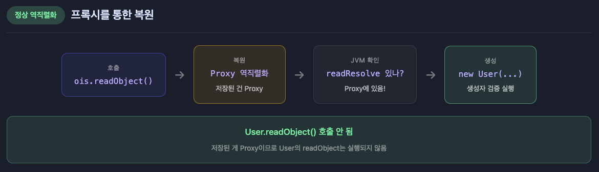
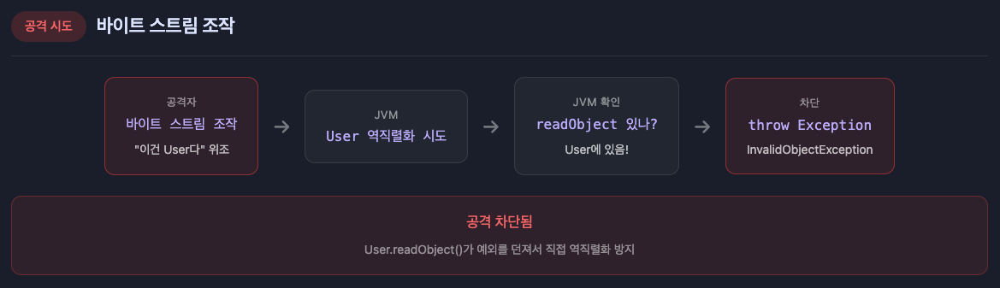

## 직렬화란?

**직렬화**(Serialization): 객체의 상태를 바이트 스트림으로 변환하는 과정입니다.

**역직렬화**(Deserialization): 바이트 스트림을 다시 객체로 복원하는 과정입니다.

```java
// 직렬화: Object → byte[]
ObjectOutputStream oos = new ObjectOutputStream(new FileOutputStream("data.ser"));
oos.writeObject(myObject);

// 역직렬화: byte[] → Object
ObjectInputStream ois = new ObjectInputStream(new FileInputStream("data.ser"));
MyClass obj = (MyClass) ois.readObject();
```

---

## 왜 필요한가?

### 1. 네트워크 전송

객체를 네트워크 전송하거나 파일로 저장할 때 바이트 스트림으로 변환 필요

```java
// RMI, 소켓 통신 등에서 객체 전송
socket.getOutputStream().write(serializedBytes);
```

### 2. 영속성(Persistence)

객체 상태를 파일이나 데이터베이스에 저장

```java
// 세션 정보, 설정값 등을 파일로 저장
try (ObjectOutputStream oos = new ObjectOutputStream(
        new FileOutputStream("session.dat"))) {
    oos.writeObject(sessionData);
}
```

### 3. 캐시

메모리 객체를 디스크나 분산 캐시에 저장

```java
// Redis, Memcached 등에 객체 저장 시
byte[] serialized = serialize(cacheObject);
redisTemplate.set(key, serialized);
```

---

## Serializable 인터페이스

### 마커 인터페이스

`Serializable`은 메서드가 없는 **마커 인터페이스**(Marker Interface)입니다.

```java
public interface Serializable {
    // 메서드 없음
}
```

이 인터페이스를 구현하면 JVM에게 "이 클래스는 직렬화 가능"이라고 알려줍니다.

```java
public class User implements Serializable {
    private String name;
    private int age;
    // ...
}
```

### 상속 관계에서의 동작

```java
// 부모 클래스가 Serializable을 구현하면 자식도 자동으로 직렬화 가능
class Parent implements Serializable { }
class Child extends Parent { }  // Serializable
```

#### 부모가 Serializable이 아니면?

```java
class Parent {  // Serializable 아님
    String parentData = "초기값";
}

class Child extends Parent implements Serializable {
    String childData;
}
```

부모가 `Serializable`이 아니면 부모 필드는 직렬화되지 않습니다. 

역직렬화 시 부모의 무인자 생성자가 호출되어 부모 필드는 초기값으로 리셋됩니다. 

**초기값이 없으면 타입 기본값**(`null`, `0` 등)이 됩니다.

### Enum과 Record

```java
// Enum: 자동으로 직렬화 가능, name()으로 직렬화됨
enum Status { ACTIVE, INACTIVE }

// Record (Java 14+): Serializable 구현 시 직렬화 가능
record Point(int x, int y) implements Serializable { }
```

---

## serialVersionUID

### 역할

`serialVersionUID`는 직렬화된 클래스의 버전을 식별하는 고유 번호입니다.

```java
public class User implements Serializable {
    private static final long serialVersionUID = 1L;

    private String name;
    private int age;
}
```

### 왜 명시적 선언이 필요한가?

명시하지 않으면 JVM이 클래스 구조를 기반으로 자동 계산합니다.

```java
// serialVersionUID 자동 계산에 영향을 주는 요소들:
// - 클래스 이름
// - 필드 이름, 타입, 순서
// - 메서드 시그니처
// - 인터페이스 구현
// - 컴파일러 구현 (!)
```

**문제점**: 컴파일러 구현에 따라 같은 소스코드라도 다른 `serialVersionUID`가 생성될 수 있습니다.

**배포 시 문제 시나리오**

```
1. v1 서버가 User 객체를 직렬화해서 Redis에 저장

2. 서버를 v2로 업데이트 (age 필드 추가)

3. v2 서버가 Redis에서 읽으려고 함
   → InvalidClassException! (serialVersionUID 불일치)
```

`serialVersionUID`를 명시하지 않으면 JVM이 클래스 구조를 기반으로 자동 생성합니다. 

필드가 추가되면 UID가 바뀌어서 "다른 클래스"로 인식합니다.

```java
// serialVersionUID 명시하면 배포 후에도 기존 데이터 읽기 가능
class User implements Serializable {
    private static final long serialVersionUID = 1L;
    String name;
    int age;  // 새 필드는 기본값(0)으로 역직렬화
}
```

**Oracle 공식 권장**: 모든 `Serializable` 클래스에 `serialVersionUID`를 명시적으로 선언하세요.

---

## transient 키워드

### 직렬화에서 제외

`transient` 키워드가 붙은 필드는 직렬화되지 않습니다.

```java
public class User implements Serializable {
    private String username;
    private transient String password;  // 직렬화 제외
    private transient Connection dbConn; // 직렬화 불가능한 객체
}
```

### 역직렬화 시 기본값

`transient` 필드는 역직렬화 시 **타입의 기본값**으로 초기화됩니다.

```java
// 역직렬화 후
user.username  // "john" (직렬화된 값)
user.password  // null (기본값)
user.dbConn    // null (기본값)
```

### 사용 사례

```java
public class CacheEntry implements Serializable {
    private String key;
    private Object value;

    // 1. 민감 정보
    private transient String secretToken;

    // 2. 캐시/파생 값 (다시 계산 가능)
    private transient int cachedHashCode;

    // 3. 직렬화 불가능한 객체
    private transient Logger logger;
    private transient Thread workerThread;
}
```

---

## ObjectInputStream / ObjectOutputStream

### ObjectOutputStream - 직렬화

```java
public class ObjectOutputStream extends OutputStream {
    // 핵심 메서드
    public final void writeObject(Object obj);
    public void writeInt(int val);
    public void writeUTF(String str);
    public void flush();
    public void close();
}
```

```java
try (ObjectOutputStream oos = new ObjectOutputStream(
        new FileOutputStream("data.ser"))) {
    oos.writeObject(user);
    oos.writeInt(100);
    oos.writeUTF("metadata");
}
```

### ObjectInputStream - 역직렬화

```java
public class ObjectInputStream extends InputStream {
    // 핵심 메서드
    public final Object readObject();
    public int readInt();
    public String readUTF();
    public void close();
}
```

```java
try (ObjectInputStream ois = new ObjectInputStream(
        new FileInputStream("data.ser"))) {
    User user = (User) ois.readObject();
    int value = ois.readInt();
    String metadata = ois.readUTF();
}
```

**보안 경고**: `readObject()`는 신뢰할 수 없는 데이터에 절대 사용하지 마세요.

---

## 커스텀 직렬화

### writeObject / readObject

기본 직렬화 동작을 커스터마이징할 수 있습니다.

```java
public class SecureUser implements Serializable {
    private String username;
    private String password;

    // 정확한 시그니처: private void writeObject(ObjectOutputStream)
    private void writeObject(ObjectOutputStream oos) throws IOException {
        oos.defaultWriteObject();  // 기본 필드 직렬화

        // 커스텀 처리: 비밀번호 암호화
        String encrypted = encrypt(password);
        oos.writeObject(encrypted);
    }

    // 정확한 시그니처: private void readObject(ObjectInputStream)
    private void readObject(ObjectInputStream ois)
            throws IOException, ClassNotFoundException {
        ois.defaultReadObject();  // 기본 필드 역직렬화

        // 커스텀 처리: 비밀번호 복호화
        String encrypted = (String) ois.readObject();
        this.password = decrypt(encrypted);
    }
}
```

**규칙**:
- 메서드는 반드시 `private`: 직렬화 메커니즘이 리플렉션으로 호출하며, 외부에서 직접 호출을 방지합니다.
- `defaultWriteObject()` / `defaultReadObject()`를 먼저 호출
- 쓴 순서대로 읽어야 함

### 불변식 검증

직렬화된 바이트 스트림은 조작할 수 있습니다. 역직렬화는 생성자를 거치지 않으므로 생성자의 검증 로직이 실행되지 않습니다. `readObject`에서 별도로 검증해야 합니다.

```java
private void readObject(ObjectInputStream ois)
        throws IOException, ClassNotFoundException {
    ois.defaultReadObject();

    // 불변식 검증
    if (age < 0 || age > 150) {
        throw new InvalidObjectException("Invalid age: " + age);
    }
    if (name == null || name.isEmpty()) {
        throw new InvalidObjectException("Name cannot be empty");
    }
}
```

---

## Externalizable 인터페이스

### Serializable과의 차이

`Externalizable`은 직렬화를 **완전히 제어**할 수 있습니다.

```java
public interface Externalizable extends Serializable {
    void writeExternal(ObjectOutput out) throws IOException;
    void readExternal(ObjectInput in) throws IOException, ClassNotFoundException;
}
```

| 특성 | Serializable | Externalizable |
| --- | --- | --- |
| 직렬화 대상 | 모든 non-transient 필드 | 명시적으로 지정한 필드만 |
| 성능 | 리플렉션 사용 (느림) | 직접 구현 (빠름) |
| 생성자 | 호출 안 함 | **public 무인자 생성자 필수** |
| 제어 수준 | 부분 커스터마이징 | 완전 제어 |

### 구현 예시

```java
public class Product implements Externalizable {
    private String name;
    private double price;
    private transient int viewCount;  // transient 무의미

    // 필수: public 무인자 생성자
    public Product() { }

    @Override
    public void writeExternal(ObjectOutput out) throws IOException {
        out.writeUTF(name);
        out.writeDouble(price);
        // viewCount는 직렬화하지 않음
    }

    @Override
    public void readExternal(ObjectInput in)
            throws IOException, ClassNotFoundException {
        name = in.readUTF();
        price = in.readDouble();
        viewCount = 0;  // 초기화
    }
}
```

---

## writeReplace / readResolve

### 싱글톤 패턴 보호

역직렬화는 새로운 객체를 생성하기 때문에 싱글톤이 깨질 수 있습니다.

```java
Singleton original = Singleton.getInstance();

// 직렬화 후 역직렬화
ObjectOutputStream oos = new ObjectOutputStream(...);
oos.writeObject(original);

ObjectInputStream ois = new ObjectInputStream(...);
Singleton restored = (Singleton) ois.readObject();

original == restored  // false! 싱글톤이 깨짐
```

`readResolve`를 정의하면 JVM이 역직렬화 후 리플렉션으로 호출합니다.

```
ois.readObject() 호출
    ↓
JVM이 내부적으로 객체 역직렬화 (새 객체 생성)
    ↓
JVM이 readResolve() 있는지 확인
    ↓
있으면 readResolve() 반환값을 최종 결과로 사용
```

```java
public class Singleton implements Serializable {
    private static final Singleton INSTANCE = new Singleton();

    private Singleton() { }

    public static Singleton getInstance() {
        return INSTANCE;
    }

    // 역직렬화 시 기존 인스턴스 반환
    private Object readResolve() {
        return INSTANCE;  // 새 객체 대신 싱글톤 반환
    }
}
```

### writeReplace - 직렬화 프록시 패턴

직렬화 프록시 패턴은 두 가지 핵심 장점이 있습니다.

1. **보안**: 바이트 스트림 조작 공격 차단
2. **생성자 검증**: 역직렬화 시에도 생성자의 유효성 검사 로직 실행

```java
public class User implements Serializable {
    private final String name;
    private final int age;

    public User(String name, int age) {
        // 생성자에서 검증
        if (name == null || name.isEmpty()) {
            throw new IllegalArgumentException("이름은 필수");
        }
        if (age < 0 || age > 150) {
            throw new IllegalArgumentException("나이가 유효하지 않음");
        }
        this.name = name;
        this.age = age;
    }

    // 직렬화 시 User 대신 Proxy 저장
    private Object writeReplace() {
        return new SerializationProxy(this);
    }

    // 공격자가 User를 직접 역직렬화하려 하면 차단
    private void readObject(ObjectInputStream s) throws InvalidObjectException {
        throw new InvalidObjectException("프록시를 통해서만 역직렬화 가능");
    }

    private static class SerializationProxy implements Serializable {
        private final String name;
        private final int age;

        SerializationProxy(User user) {
            this.name = user.name;
            this.age = user.age;
        }

        // 역직렬화 시 생성자를 통해 User 생성 → 검증 로직 실행
        private Object readResolve() {
            return new User(name, age);  // 생성자 검증이 여기서 실행됨
        }
    }
}
```

프록시 패턴 없이 일반 역직렬화를 하면 생성자가 호출되지 않아 `age = -100` 같은 잘못된 값도 그대로 복원됩니다. 

프록시 패턴을 사용하면 `readResolve()`에서 `new User(name, age)`를 호출하므로 생성자의 검증 로직이 실행됩니다.

`writeReplace`는 개발자가 직접 호출하는 게 아니라 JVM이 리플렉션으로 호출합니다.

```java
// 개발자가 작성하는 코드
ObjectOutputStream oos = new ObjectOutputStream(...);
oos.writeObject(user);  // 그냥 이렇게만 호출

// JVM 내부에서 일어나는 일
// 1. user 객체에 writeReplace() 있나? → 리플렉션으로 확인
// 2. 있으면 writeReplace() 호출
```

#### 직렬화


#### 역직렬화


#### 공격 시나리오


---

## 역직렬화 공격

### 위험성

역직렬화는 바이트 스트림으로부터 객체를 생성하므로, **신뢰할 수 없는 데이터**를 역직렬화하면 공격에 노출됩니다.

### Gadget Chain 공격

클래스패스에 있는 여러 클래스들을 연결하여 악의적인 코드를 실행합니다.

```java
// 공격 시나리오
// 1. 공격자가 악의적인 바이트 스트림 생성
// 2. 서버에서 readObject() 호출
// 3. 역직렬화 과정에서 연쇄적으로 메서드 호출
// 4. 최종적으로 Runtime.exec() 등 위험한 메서드 실행
```

### DoS 공격

```java
// HashSet의 해시 충돌을 이용한 DoS
// 같은 해시값을 가진 수만 개의 문자열로 HashSet 생성
// 역직렬화 시 O(n^2) 시간 소요

// 깊이 중첩된 객체로 스택 오버플로우 유발
// Set<Set<Set<...>>> 구조로 깊이 수천의 중첩
```

### 방어 전략

1. **신뢰할 수 없는 데이터 역직렬화 금지**
2. **ObjectInputFilter 사용** (Java 9+)
3. **화이트리스트 기반 필터링**
4. **JSON/XML 등 대안 사용**

---

## ObjectInputFilter (Java 9+)

### JEP 290 도입 배경

Java 9에서 역직렬화 공격 방어를 위해 `ObjectInputFilter`가 도입되었습니다.

### JVM 전역 필터

```bash
# JVM 옵션으로 설정
java -Djdk.serialFilter=com.myapp.*;!* MyApp

# 패턴 의미:
# com.myapp.*   → com.myapp 패키지 허용
# !*            → 그 외 모든 클래스 거부
```

### 스트림 단위 필터

```java
ObjectInputStream ois = new ObjectInputStream(inputStream);

// 람다로 필터 설정
ois.setObjectInputFilter(info -> {
    Class<?> clazz = info.serialClass();

    if (clazz != null) {
        // 화이트리스트 검사
        if (clazz.getName().startsWith("com.myapp.")) {
            return ObjectInputFilter.Status.ALLOWED;
        }
        return ObjectInputFilter.Status.REJECTED;
    }

    // 리소스 제한 검사
    if (info.depth() > 10) {
        return ObjectInputFilter.Status.REJECTED;
    }

    return ObjectInputFilter.Status.UNDECIDED;
});
```

### 필터 패턴 문법

```java
// 패턴 기반 필터 생성
ObjectInputFilter filter = ObjectInputFilter.Config.createFilter(
    "com.myapp.**;" +           // com.myapp과 하위 패키지 허용
    "java.util.*;" +            // java.util 패키지 허용
    "!com.dangerous.*;" +       // com.dangerous 패키지 거부
    "maxarray=1000;" +          // 배열 최대 크기
    "maxdepth=10;" +            // 최대 객체 그래프 깊이
    "maxrefs=1000;" +           // 최대 참조 수
    "maxbytes=100000"           // 최대 바이트 수
);
```

### 필터 정보 활용

```java
ois.setObjectInputFilter(info -> {
    // 클래스 정보
    Class<?> clazz = info.serialClass();

    // 배열 길이 (배열인 경우)
    long arrayLength = info.arrayLength();

    // 객체 그래프 깊이
    long depth = info.depth();

    // 지금까지 읽은 참조 수
    long references = info.references();

    // 지금까지 읽은 바이트 수
    long streamBytes = info.streamBytes();

    return ObjectInputFilter.Status.ALLOWED;
});
```

---

## Java 직렬화 vs JSON 직렬화

### 성능 비교

| 라이브러리 | 직렬화 (ops/sec) | 역직렬화 (ops/sec) |
| --- | --- | --- |
| Java Serialization | 약 50,000 | 약 25,000 |
| Jackson | 약 200,000 | 약 150,000 |
| Gson | 약 100,000 | 약 80,000 |
| Fastjson2 | 약 250,000 | 약 200,000 |

**결론**: JSON 라이브러리가 Java 기본 직렬화보다 **3~5배 빠릅니다**.

### 특징 비교

| 특성 | Java 직렬화 | JSON 직렬화 |
| --- | --- | --- |
| 언어 종속성 | Java 전용 | 언어 독립적 |
| 가독성 | 바이너리 (불가) | 텍스트 (가능) |
| 버전 호환성 | serialVersionUID 의존 | 스키마 유연 |
| 보안 | 역직렬화 공격 위험 | 상대적으로 안전 |
| 클래스 타입 보존 | 완벽 보존 | 별도 처리 필요 |
| 크기 | 메타데이터 포함 (큼) | 필드명만 (작음) |

### 언제 무엇을 쓰는가?

**Java 직렬화 사용**:
- RMI 기반 분산 시스템
- Java 전용 캐시 (Ehcache 등)
- 깊은 객체 그래프 + 순환 참조
- 클래스 타입 정보 보존 필수

**JSON 직렬화 사용**:
- REST API 통신
- 다른 언어와의 상호운용
- 사람이 읽을 수 있어야 할 때
- 브라우저와 통신

### Jackson 사용 예시

```java
// 의존성: com.fasterxml.jackson.core:jackson-databind

ObjectMapper mapper = new ObjectMapper();

// JSON 문자열로 직렬화 (가장 일반적)
String json = mapper.writeValueAsString(user);
// 결과: {"name":"김철수","age":25}

// 바이트 배열로 직렬화 (네트워크 전송용)
byte[] bytes = mapper.writeValueAsBytes(user);
// 결과: JSON 문자열을 UTF-8 바이트로 인코딩한 것

// 역직렬화
User user = mapper.readValue(json, User.class);
List<User> users = mapper.readValue(json,
    new TypeReference<List<User>>() {});
```

### Spring MVC에서는 누가 호출하는가?

Spring MVC를 사용하면 `objectMapper.readValue()`를 직접 호출하지 않습니다.

```java
// 개발자가 작성하는 코드
@PostMapping("/users")
public ResponseEntity<User> createUser(@RequestBody User user) {
    // user 객체가 이미 만들어져서 들어옴
}
```

`@RequestBody`만 붙이면 Spring이 알아서 JSON을 객체로 변환해줍니다.

**Spring 내부에서 일어나는 일**

```java
// spring-web.jar 안의 코드 (단순화)
public class MappingJackson2HttpMessageConverter {

    public Object read(Class<?> clazz, HttpInputMessage inputMessage) {
        String json = readBody(inputMessage);
        return objectMapper.readValue(json, clazz);  // Spring이 호출
    }
}
```

`clazz`(User.class)는 어디서 올까요?

```java
// Spring이 컨트롤러 메서드를 분석할 때 (리플렉션)
Method method = controller.getClass().getMethod("createUser", User.class);
Parameter[] params = method.getParameters();  // 리플렉션
Class<?> paramType = params[0].getType();     // → User.class
```

Spring이 리플렉션으로 컨트롤러 메서드의 파라미터 타입을 알아내서 Jackson에 넘겨줍니다.

**정리**

```
1. 클라이언트가 POST /users 요청 (JSON body)
2. Spring이 컨트롤러 메서드 찾음
3. 리플렉션으로 파라미터 타입 확인 → User.class
4. Jackson에게 전달: objectMapper.readValue(json, User.class)
5. Jackson이 리플렉션으로 User 객체 생성
6. 컨트롤러 메서드 호출
```

**writeValueAsString() vs writeValueAsBytes()**

| 메서드 | 반환 | 용도 |
|------|------|------|
| `writeValueAsString()` | String | 로그 출력, 디버깅, 파일 저장 |
| `writeValueAsBytes()` | byte[] | 소켓 직접 사용, 메시지 큐 (Kafka 등) |

네트워크 전송은 항상 byte[] 단위입니다. REST API에서는 Spring이 내부적으로 byte[]로 변환해주므로 개발자는 객체나 String만 다루면 됩니다.

**UTF-8 vs Base64**

| 구분 | UTF-8 | Base64 |
|------|-------|--------|
| 정체 | 문자 인코딩 | 바이너리를 텍스트로 변환 |
| 용도 | 텍스트를 바이트로 | 바이너리를 텍스트로 |
| 입력 | 문자열 | 바이너리 데이터 |
| 출력 | 바이트 | ASCII 문자열 |

Base64는 JSON이나 HTTP 헤더에 바이너리 데이터(이미지, 파일 등)를 넣을 수 없어서 ASCII 텍스트로 변환할 때 사용합니다.

### 대안 기술

| 기술 | 특징 | 사용 사례 |
| --- | --- | --- |
| Protocol Buffers | Google, 스키마 기반, 빠름 | gRPC, 대용량 데이터 |
| Avro | Apache, 스키마 진화 지원 | Kafka, 빅데이터 |
| Kryo | Java 전용, 매우 빠름 | Spark, 게임 서버 |
| MessagePack | 바이너리 JSON | IoT, 모바일 |

---

## 정리

| 개념 | 핵심 포인트 |
| --- | --- |
| Serializable | 마커 인터페이스, 기본 직렬화 제공 |
| serialVersionUID | 버전 호환성, 반드시 명시적 선언 |
| transient | 직렬화 제외, 역직렬화 시 기본값 |
| writeObject/readObject | 커스텀 직렬화, private 메서드 |
| Externalizable | 완전 제어, public 무인자 생성자 필수 |
| readResolve | 싱글톤 보호, 객체 치환 |
| 역직렬화 공격 | 신뢰할 수 없는 데이터 절대 역직렬화 금지 |
| ObjectInputFilter | Java 9+, 화이트리스트 필터링 |

**권장사항**:
1. 새 프로젝트에서는 JSON 직렬화(Jackson) 사용
2. Java 직렬화 사용 시 반드시 `serialVersionUID` 선언
3. 역직렬화 시 반드시 `ObjectInputFilter` 적용
4. 민감 정보는 `transient` 또는 암호화 처리
