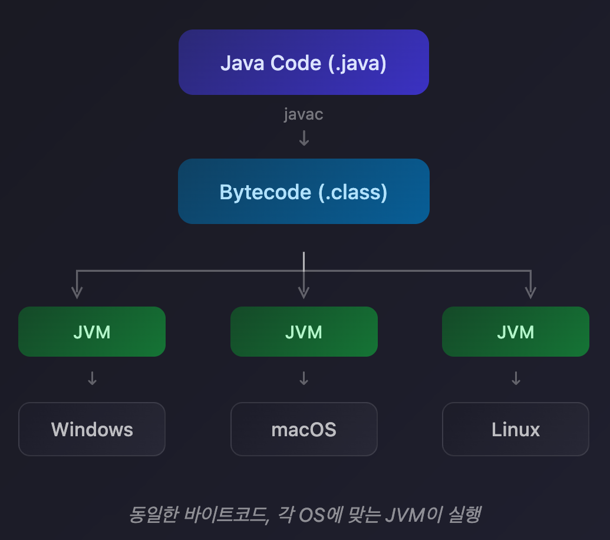
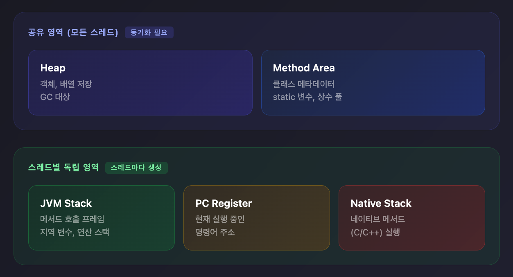

## JVM이란?

**JVM(Java Virtual Machine)**은 Java 바이트코드를 실행하는 가상 머신입니다.

Java는 한 번 작성하면 어디서나 실행할 수 있습니다(Write Once, Run Anywhere). 이게 가능한 이유가 JVM입니다.

```
Java 코드 (.java)
      ↓ 컴파일 (javac)
바이트코드 (.class)
      ↓
    JVM → 각 OS에 맞게 실행
```

### 바이트코드

Java 소스 코드를 컴파일하면 **바이트코드**(.class 파일)가 생성됩니다.

바이트코드는 기계어가 아닌 **중간 언어**입니다. JVM이 이 바이트코드를 읽어서 각 운영체제에 맞는 기계어로 변환해 실행합니다.

Windows에서는 Windows용 JVM이, Mac에서는 Mac용 JVM이 동일한 바이트코드를 실행합니다.



---

## JVM 구조

JVM은 크게 4가지 컴포넌트로 구성됩니다.


### 1. Class Loader

클래스 파일(.class)을 메모리에 로드하는 역할을 합니다.

**동작 과정**

| 단계 | 설명 |
|------|------|
| Loading | .class 파일을 메모리로 로드 |
| Linking - Verification | 바이트코드가 JVM 스펙에 맞는지 검증 |
| Linking - Preparation | static 변수 메모리 할당, 기본값 초기화 |
| Linking - Resolution | 심볼릭 레퍼런스를 실제 메모리 주소로 변환 |
| Initialization | static 블록 실행, static 변수에 실제 값 할당 |

**Class Loader 계층 (Delegation Model)**

클래스 로딩 요청이 오면 먼저 부모 클래스 로더에게 위임합니다. 부모가 찾지 못하면 자신이 직접 찾습니다.

| Class Loader | 역할 |
|--------------|------|
| Bootstrap | 핵심 라이브러리 로드 (`java.lang.*`, `java.util.*`) |
| Platform (Extension) | 플랫폼 클래스 로드 |
| Application | 애플리케이션 클래스패스의 클래스 로드 |

---

### 2. Runtime Data Area

JVM이 프로그램 실행 중 사용하는 메모리 영역입니다.



**스레드 공유 영역**

| 영역 | 설명 |
|------|------|
| Heap | 객체와 배열이 저장되는 영역. GC 대상 |
| Method Area | 클래스 메타데이터, static 변수, 상수 풀 저장 |

**스레드별 독립 영역**

| 영역 | 설명 |
|------|------|
| JVM Stack | 메서드 호출 시 프레임 생성. 지역 변수, 연산 스택 저장 |
| PC Register | 현재 실행 중인 명령어 주소 저장 |
| Native Method Stack | 네이티브 메서드(C/C++) 실행 시 사용 |

---

### 3. Execution Engine

바이트코드를 실제로 실행하는 엔진입니다.

**Interpreter**

바이트코드를 한 줄씩 해석해서 실행합니다. 시작은 빠르지만 반복 실행 시 매번 해석해야 해서 느립니다.

**JIT Compiler (Just-In-Time)**

자주 실행되는 코드(Hotspot)를 감지해서 네이티브 코드로 컴파일합니다. 이후에는 컴파일된 코드를 바로 실행해서 빠릅니다.

```
처음 실행: Interpreter로 해석
     ↓
Runtime Profiler가 호출 횟수 모니터링
     ↓
임계값 초과 (Hotspot 감지)
     ↓
JIT Compiler가 네이티브 코드로 컴파일
     ↓
이후 실행: 컴파일된 코드 직접 실행
```

**Tiered Compilation (HotSpot VM)**

HotSpot VM은 두 가지 JIT 컴파일러를 사용합니다.

| 단계 | 컴파일러 | 설명 |
|------|----------|------|
| Level 0 | Interpreter | 해석 실행 |
| Level 1-3 | C1 | 빠른 컴파일, 기본 최적화 |
| Level 4 | C2 | 느린 컴파일, 고급 최적화 |

호출 횟수가 증가하면 더 높은 레벨로 재컴파일됩니다.

**JIT 최적화 기법**

| 기법 | 설명 |
|------|------|
| Inlining | 메서드 호출을 메서드 본문으로 대체 |
| Loop Unrolling | 루프를 풀어서 반복 오버헤드 제거 |
| Escape Analysis | 객체가 메서드 밖으로 나가지 않으면 스택에 할당 |

**Inlining 예시**

```java
// Before
int add(int a, int b) { return a + b; }
int result = add(5, 3);

// After (Inlined)
int result = 5 + 3;
```

메서드 호출 오버헤드(스택 프레임 생성, 매개변수 전달, 반환)가 제거됩니다.

**Loop Unrolling 예시**

```java
// Before
for (int i = 0; i < 4; i++) {
    process(i);
}

// After (Unrolled)
process(0);
process(1);
process(2);
process(3);
```

인덱스 증가, 조건 검사 오버헤드가 제거됩니다.

---

### 4. Garbage Collector

더 이상 참조되지 않는 객체를 자동으로 메모리에서 제거합니다.

**Heap 구조**

```
Heap
├── Young Generation
│   ├── Eden        (새 객체 할당)
│   └── Survivor    (Minor GC 생존 객체)
└── Old Generation  (오래 살아남은 객체)
```

**GC 종류**

| 이벤트 | 대상 | 특징 |
|--------|------|------|
| Minor GC | Young Generation | 자주 발생, 빠름 |
| Major GC | Old Generation | 드물게 발생, 느림 |

**GC 알고리즘 (Java 11+)**

| GC | 특징 | 사용 시점 |
|----|------|-----------|
| G1 | 기본 GC. 대용량 힙에 적합 | 일반적인 서버 애플리케이션 |
| ZGC | 초저지연 (10ms 이하) | 지연 시간이 중요한 경우 |
| Shenandoah | 저지연, 동시 처리 | ZGC와 유사한 요구사항 |

---

## 스택 기반 아키텍처

JVM은 스택 기반으로 동작합니다. 연산 시 스택에 값을 push/pop합니다.

```java
int a = 5;
int b = 3;
int c = a + b;
```

```
PUSH 5      → Stack: [5]
PUSH 3      → Stack: [5, 3]
ADD         → Stack: [8]  (5, 3을 pop하고 결과 push)
STORE c     → Stack: []   (8을 pop해서 c에 저장)
```

**왜 스택 기반인가?**

레지스터 기반(Dalvik, V8)은 CPU 아키텍처마다 레지스터 개수와 사용 방식이 다릅니다. 스택 기반은 하드웨어에 독립적이라 **이식성**이 높습니다. Java의 "Write Once, Run Anywhere" 철학에 맞습니다.

---

## JDK vs JRE vs JVM

```
JDK (Java Development Kit)
├── JRE (Java Runtime Environment)
│   ├── JVM
│   └── 표준 라이브러리
├── javac (컴파일러)
├── jdb (디버거)
└── 기타 개발 도구
```

| 구성 | 용도 |
|------|------|
| JVM | 바이트코드 실행 |
| JRE | Java 프로그램 실행 (JVM + 라이브러리) |
| JDK | Java 프로그램 개발 (JRE + 개발 도구) |

---

## 정리

| 컴포넌트 | 역할 |
|----------|------|
| Class Loader | .class 파일을 메모리에 로드 |
| Runtime Data Area | 프로그램 실행에 필요한 메모리 관리 |
| Execution Engine | 바이트코드를 기계어로 변환해 실행 |
| Garbage Collector | 사용하지 않는 객체 메모리 해제 |

JVM 덕분에 Java는 플랫폼 독립적이고, 개발자가 메모리 관리를 직접 하지 않아도 됩니다.
