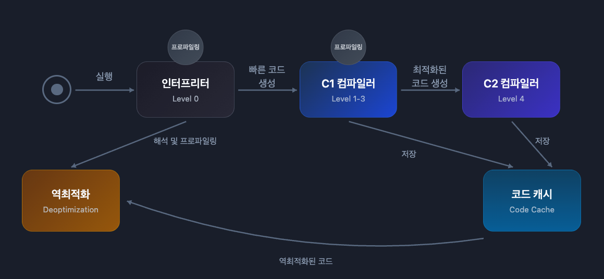
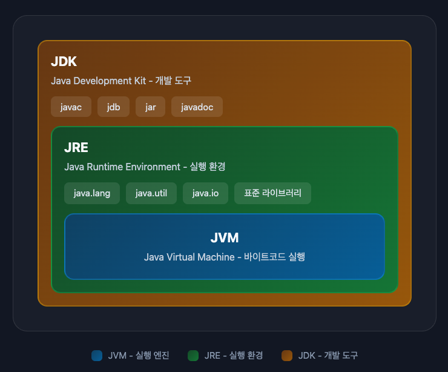

## 인터프리터 vs 컴파일러

프로그래밍 언어의 실행 방식은 크게 두 가지입니다.

**컴파일 언어**(C, C++, Go)

```
소스 코드 → 컴파일러 → 기계어 (실행 파일) → 실행
```

실행 전에 전체 코드를 기계어로 변환합니다. 실행 속도가 빠르지만 OS마다 실행 파일 형식과 시스템 콜이 다르기 때문에 플랫폼마다 다시 컴파일해야 합니다.

**인터프리터 언어**(Python, JavaScript)

```
소스 코드 → 인터프리터 → 한 줄씩 해석하며 실행
```

실행 시점에 코드를 해석합니다. 이식성이 좋지만 실행 속도가 느립니다.

**Java의 하이브리드 방식**

```
소스 코드 → javac → 바이트코드 → JVM (인터프리터 + JIT) → 실행
```

Java는 둘을 조합합니다. 바이트코드로 컴파일해서 이식성을 확보하고, JIT 컴파일러로 런타임에 기계어로 변환해서 성능을 높입니다.

---

## JVM이란?

**JVM**(Java Virtual Machine)은 Java 바이트코드를 실행하는 가상 머신입니다.

Java는 한 번 작성하면 어디서나 실행할 수 있습니다(Write Once, Run Anywhere). 이게 가능한 이유가 JVM입니다.

```
Java 코드 (.java)
      ↓ 컴파일 (javac)
바이트코드 (.class)
      ↓
    JVM → 각 OS에 맞게 실행
```

### 바이트코드

Java 소스 코드를 컴파일하면 **바이트코드**(.class 파일)가 생성됩니다.

바이트코드는 기계어가 아닌 **중간 언어**입니다. JVM이 이 바이트코드를 읽어서 각 운영체제에 맞는 기계어로 변환해 실행합니다.

Windows에서는 Windows용 JVM이, Mac에서는 Mac용 JVM이 동일한 바이트코드를 실행합니다.


---

## JVM 구조

JVM은 크게 4가지 컴포넌트로 구성됩니다.


### 1. Class Loader

.class 파일을 JVM 메모리에 적재하는 역할을 합니다. Java는 컴파일 타임이 아니라 **런타임에 클래스를 로드**합니다.

```java
public class Main {
    public static void main(String[] args) {
        User user = new User();  // 이 시점에 User.class 로드
    }
}
```

**동작 과정**

```
1. Loading
   .class 파일을 디스크에서 읽어 메모리에 올림
       ↓
2. Linking
   - Verification: 바이트코드가 JVM 스펙에 맞는지 검증
   - Preparation: static 변수 메모리 할당 (기본값 0, null 등)
   - Resolution: 심볼릭 참조 → 실제 메모리 주소로 변환
       ↓
3. Initialization
   static 블록 실행, static 변수에 실제 값 할당
```

**Class Loader 계층**(Delegation Model)

클래스 로딩 요청이 오면 먼저 부모에게 위임합니다. 부모가 찾지 못하면 자신이 찾습니다.

```
클래스 로딩 요청 (User.class)
    ↓
Application Loader: "나한테 있나?" → 없으면 위임
    ↓
Platform Loader: "나한테 있나?" → 없으면 위임
    ↓
Bootstrap Loader: java.lang.*, java.util.* 등 핵심 클래스 담당
    ↓
없으면 다시 내려오면서 각자 찾음
```

이렇게 하는 이유는 **핵심 클래스(String 등)가 악의적으로 대체되는 걸 방지**하기 위함입니다.

---

### 2. Runtime Data Area

JVM이 프로그램 실행 중 사용하는 메모리 영역입니다.


**스레드 공유 영역**

| 영역 | 설명 |
|------|------|
| Heap | 객체와 배열이 저장되는 영역. GC 대상 |
| Method Area | 클래스 메타데이터, static 변수, 상수 풀 저장 |

**스레드별 독립 영역**

| 영역 | 설명 |
|------|------|
| JVM Stack | 메서드 호출 시 프레임 생성. 지역 변수, 연산 스택 저장 |
| PC Register | 현재 실행 중인 명령어 주소 저장 |
| Native Method Stack | 네이티브 메서드(C/C++) 실행 시 사용 |

---

### 3. Execution Engine

바이트코드를 실제로 실행하는 엔진입니다.

#### JIT Compiler



자주 실행되는 코드(Hotspot)를 감지해서 네이티브 코드로 컴파일합니다.

```
처음 실행: Interpreter로 해석
     ↓
Runtime Profiler가 호출 횟수 모니터링
     ↓
임계값 초과 (Hotspot 감지)
     ↓
JIT Compiler가 네이티브 코드로 컴파일
     ↓
이후 실행: 컴파일된 코드 직접 실행
```

#### Tiered Compilation

HotSpot VM은 단계별로 컴파일 수준을 높여갑니다.

| Level | 컴파일러 | 특징 |
|-------|----------|------|
| 0 | Interpreter | 해석 실행, 프로파일링 수집 |
| 1-3 | C1 | 빠른 컴파일, 단순 최적화 |
| 4 | C2 | 느린 컴파일, 공격적 최적화 |

#### C1 최적화 기법

C1은 빠른 컴파일이 목적입니다. 단순한 최적화만 적용합니다.

**Inlining**

메서드 호출을 본문으로 대체해서 호출 오버헤드를 제거합니다.

```java
// Before
int add(int a, int b) { return a + b; }
int result = add(5, 3);

// After
int result = 5 + 3;
```

**Constant Folding**

상수 연산을 컴파일 타임에 미리 계산합니다.

```java
// Before
int x = 3 * 4 + 2;

// After
int x = 14;
```

#### C2 최적화 기법

C2는 프로파일링 데이터를 분석해서 공격적인 최적화를 적용합니다. 컴파일 시간은 길지만 최고 성능을 냅니다.

**Loop Unrolling**

루프를 풀어서 분기 비용을 제거합니다.

```java
// Before
for (int i = 0; i < 4; i++) {
    process(i);
}

// After
process(0);
process(1);
process(2);
process(3);
```

**Escape Analysis**

객체가 메서드 밖으로 안 나가면 힙 대신 스택에 할당하거나 스칼라로 치환합니다.

```java
// Before
void calculate() {
    Point p = new Point(1, 2);  // 힙 할당
    return p.x + p.y;
}

// After
void calculate() {
    int x = 1, y = 2;  // 객체 자체가 사라짐
    return x + y;
}
```

**Dead Code Elimination**

사용하지 않는 코드를 제거합니다.

```java
// Before
int x = 10;
int y = 20;  // 사용 안 함
return x;

// After
int x = 10;
return x;
```

#### Code Cache

JIT 컴파일러가 생성한 네이티브 코드를 저장하는 메모리 영역입니다.

```
바이트코드 실행
     ↓
JIT 컴파일 (C1 또는 C2)
     ↓
네이티브 코드 생성
     ↓
Code Cache에 저장
     ↓
다음 호출 시 Code Cache에서 직접 실행
```

Code Cache는 네이티브 메모리에 위치하며, Heap과는 별도입니다. 크기가 가득 차면 더 이상 JIT 컴파일이 안 되고 인터프리터로만 실행됩니다.

```bash
# Code Cache 크기 설정
-XX:ReservedCodeCacheSize=256m
```

#### Deoptimization (역최적화)

C2가 추측 기반 최적화를 적용했는데, 런타임에 가정이 깨지면 **역최적화**가 발생합니다.

```java
void process(Animal animal) {
    animal.speak();  // C2: "항상 Dog만 들어오네? Dog.speak()로 인라이닝!"
}

// 갑자기 Cat이 들어오면?
process(new Cat());  // 역최적화 발생!
```

역최적화가 발생하면:
1. Code Cache에서 최적화된 코드 무효화
2. 인터프리터로 롤백
3. 다시 프로파일링 시작
4. 새로운 정보로 재컴파일

역최적화는 성능 저하를 일으키므로, JVM은 이를 최소화하려고 충분한 프로파일링 후에 최적화합니다.

---

### 4. Garbage Collector

더 이상 참조되지 않는 객체를 자동으로 메모리에서 제거합니다.

**Heap 구조**

```
Heap
├── Young Generation
│   ├── Eden        (새 객체 할당)
│   └── Survivor    (Minor GC 생존 객체)
└── Old Generation  (오래 살아남은 객체)
```

**GC 종류**

| 이벤트 | 대상 | 특징 |
|--------|------|------|
| Minor GC | Young Generation | 자주 발생, 빠름 |
| Major GC | Old Generation | 드물게 발생, 느림 |

**GC 알고리즘**(Java 11+)

| GC | 특징 | 사용 시점 |
|----|------|-----------|
| G1 | 기본 GC. 대용량 힙에 적합 | 일반적인 서버 애플리케이션 |
| ZGC | 초저지연 (10ms 이하) | 지연 시간이 중요한 경우 |
| Shenandoah | 저지연, 동시 처리 | ZGC와 유사한 요구사항 |

> 자세한 내용은 [Garbage Collection](/javaGarbage) 참고

---

## 스택 기반 아키텍처

JVM은 **스택 기반**으로 동작합니다. 연산에 필요한 값을 스택에 push/pop하며 실행합니다.

```java
// 소스 코드
int result = 1 + 2;

// 바이트코드 (스택 기반)
iconst_1    // 스택에 1 push
iconst_2    // 스택에 2 push
iadd        // 스택에서 두 값 pop, 더한 결과 push
istore_1    // 스택에서 pop해서 지역변수에 저장
```

```
스택 변화: [] → [1] → [1, 2] → [3] → []
```

| 구분 | 레지스터 기반 (x86, ARM) | 스택 기반 (JVM) |
|------|------------------------|-----------------|
| 연산 | add r1, r2, r3 | iadd (피연산자 암묵적) |
| 장점 | 빠름 | 이식성, 구현 단순 |
| 단점 | 플랫폼 종속 | 스택 조작 오버헤드 |

**왜 스택 기반인가?**

레지스터 기반은 CPU마다 레지스터 수와 구조가 다르기 때문에 플랫폼 종속적입니다. 

**스택 기반은 레지스터를 고려할 필요 없이 어떤 플랫폼에서든 동일하게 동작합니다.** 또한 바이트코드가 단순해져서 JVM 구현도 쉬워집니다.


---

## JDK vs JRE vs JVM



**JVM** (Java Virtual Machine)
- 바이트코드를 실행하는 가상 머신
- 플랫폼마다 다른 구현체 (Windows용, Mac용, Linux용)

**JRE** (Java Runtime Environment)
- Java 프로그램을 **실행**하기 위한 환경
- JVM + 표준 라이브러리 (java.lang, java.util 등)
- 사용자가 Java 프로그램을 돌리려면 JRE만 있으면 됨

**JDK** (Java Development Kit)
- Java 프로그램을 **개발**하기 위한 도구
- JRE + 개발 도구 (javac, jdb, jar 등)
- 개발자는 JDK가 필요

---

## JVM 동작 흐름

JVM은 먼저 클래스 로더를 통해 `.class` 파일의 바이트코드를 메모리로 로드합니다.

그 후 바이트코드를 검증하고, 런타임 데이터 영역에 적재한 뒤 인터프리터와 JIT 컴파일러를 사용해 네이티브 코드로 실행합니다.

마지막으로 가비지 컬렉터가 사용하지 않는 객체를 회수하며 메모리를 관리합니다.

---

## 정리

| 컴포넌트 | 역할 |
|----------|------|
| Class Loader | .class 파일을 메모리에 로드 |
| Runtime Data Area | 프로그램 실행에 필요한 메모리 관리 |
| Execution Engine | 바이트코드를 기계어로 변환해 실행 |
| Garbage Collector | 사용하지 않는 객체 메모리 해제 |

JVM 덕분에 Java는 플랫폼 독립적이고, 개발자가 메모리 관리를 직접 하지 않아도 됩니다.
