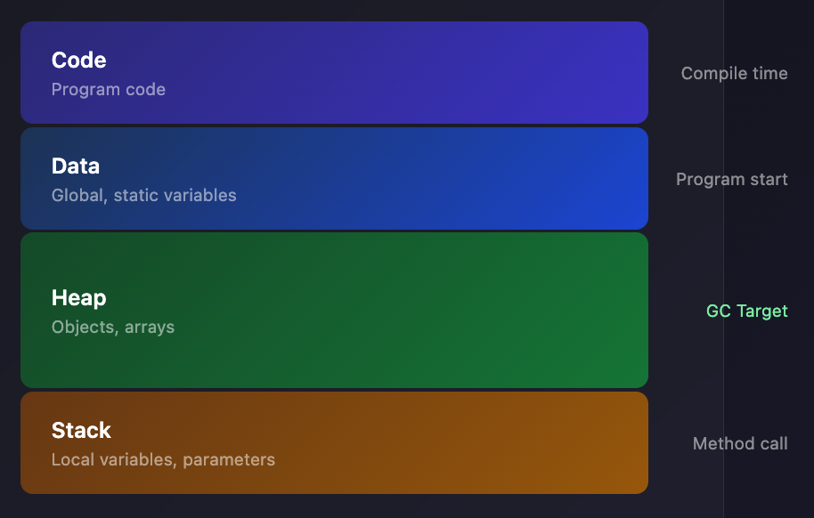
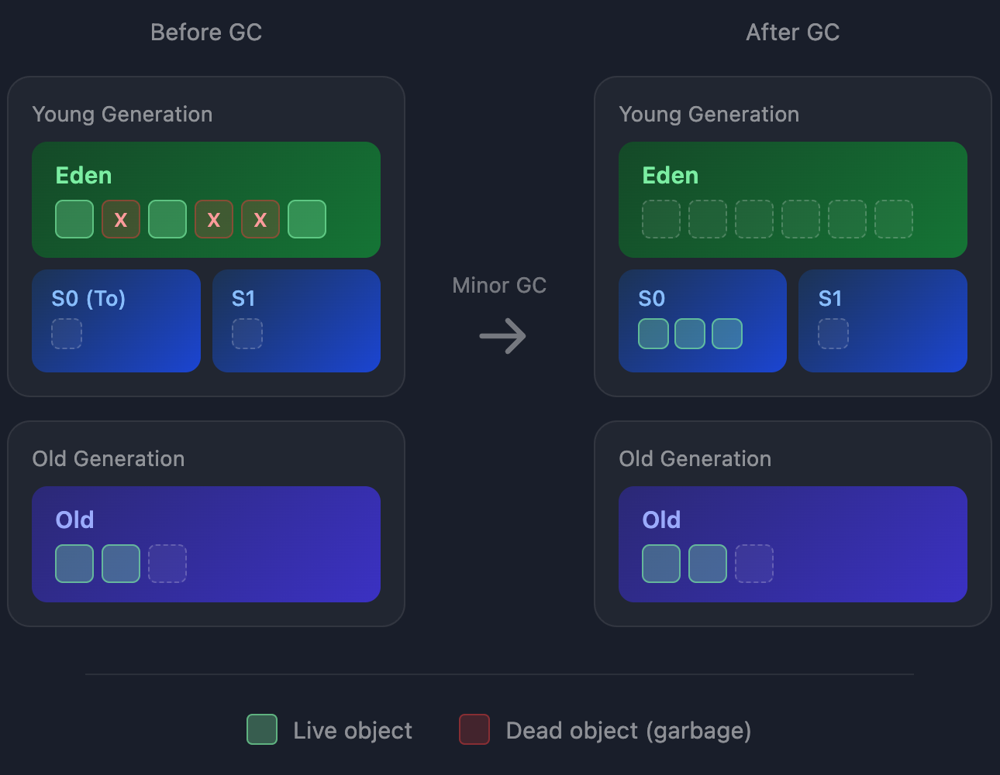
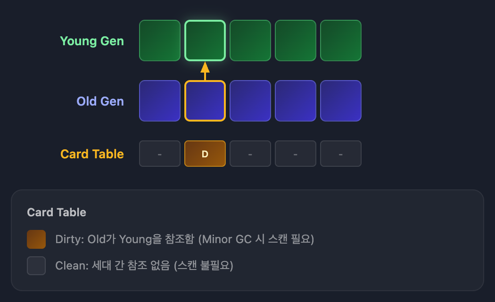
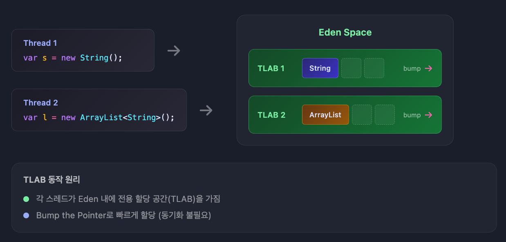
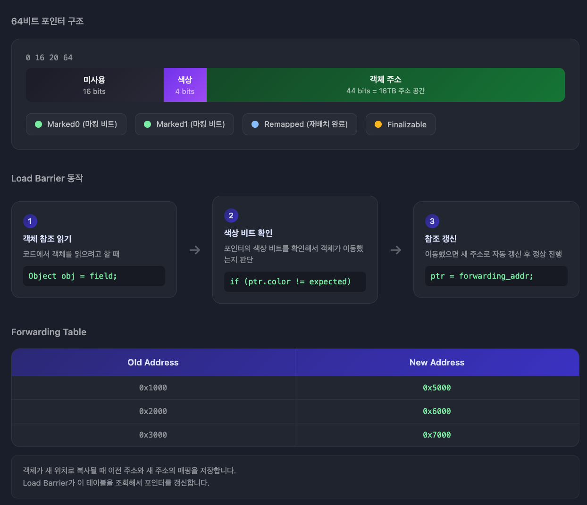

## 가비지 컬렉션이란?

**Garbage Collection**(GC)은 더 이상 참조되지 않는 객체를 자동으로 메모리에서 제거하는 메커니즘입니다.

C/C++에서는 개발자가 직접 `malloc`/`free`로 메모리를 관리해야 합니다. Java는 GC가 자동으로 처리하므로 메모리 해제를 신경 쓰지 않아도 됩니다.

```
C/C++: 개발자가 직접 메모리 해제 → 실수 시 메모리 누수
Java:  GC가 자동으로 메모리 해제 → 메모리 관리 부담 감소
```

---

## 힙 메모리 구조

GC는 **힙(Heap)** 영역을 관리합니다. 힙은 객체와 배열이 저장되는 공간입니다.



| 영역 | 저장 내용 | 특징 |
|------|----------|------|
| 코드 영역 | 실행할 프로그램 코드 | 컴파일 시 결정 |
| 데이터 영역 | 전역 변수, static 변수 | 프로그램 시작 시 할당 |
| 힙 영역 | 객체, 배열 | **GC 대상** |
| 스택 영역 | 지역 변수, 매개변수 | 메서드 호출 시 생성/소멸 |

```java
public class MemoryExample {
    static int count = 0;                    // 데이터 영역 (static 변수)

    public void process() {                  // 코드 영역 (메서드 바이트코드)
        int x = 10;                          // 스택 영역 (primitive 지역 변수)
        String name = new String("hello");   // name(참조): 스택, String 객체: 힙
        User user = new User();              // user(참조): 스택, User 객체: 힙
    }
}
```

`name`과 `user`는 **참조 변수**(포인터)로 스택에 8바이트 주소가 저장됩니다.

실제 객체는 힙에 생성되고, 스택의 참조 변수가 힙의 객체 주소를 가리킵니다.

---

## Mark and Sweep

GC의 기본 알고리즘입니다.

**Mark 단계**: 루트 객체(GC Root)에서 시작해 참조 가능한 모든 객체를 마킹합니다.

**Sweep 단계**: 마킹되지 않은 객체를 메모리에서 제거합니다.

```
GC Root
├── 스택의 지역 변수
├── 메서드의 매개변수
├── static 변수
└── JNI 참조

Mark: GC Root → 참조 체인을 따라 살아있는 객체 마킹
Sweep: 마킹되지 않은 객체 제거
```

**GC Root에서 도달할 수 없는 객체 = 가비지**

---

## 세대별 가비지 컬렉션

**Weak Generational Hypothesis**: 대부분의 객체는 생성 직후 곧바로 쓸모없어집니다.

이 가설을 기반으로 힙을 **Young**과 **Old** 세대로 나눠 관리합니다.

```
Heap
├── Young Generation
│   ├── Eden        (새 객체 할당)
│   ├── Survivor 0  (Minor GC 생존 객체)
│   └── Survivor 1  (Minor GC 생존 객체)
└── Old Generation  (오래 살아남은 객체)
```

---

## Minor GC

**Young Generation**에서 발생하는 GC입니다. 자주 발생하고 빠르게 끝납니다.



**동작 과정**

1. 새 객체가 **Eden**에 할당됩니다
2. Eden이 가득 차면 **Minor GC** 발생
3. Eden + 현재 Survivor의 살아있는 객체가 **반대편 Survivor**로 이동
4. 매 Minor GC마다 S0 ↔ S1을 번갈아 사용 
5. 여러 번 살아남은 객체는 **Old Generation**으로 승격

```
[1차 Minor GC] Eden → S0 (S1은 비어있음)
[2차 Minor GC] Eden + S0 → S1 (S0 비움)
[3차 Minor GC] Eden + S1 → S0 (S1 비움)
... 반복 ...
[N회 생존] → Old Generation으로 승격
```

### 카드 테이블

Minor GC는 Young 영역만 스캔합니다. 그런데 Old 영역의 객체가 Young 영역 객체를 참조하고 있다면 어떻게 될까요?

Young 영역만 스캔하면 해당 객체가 참조되지 않는 것처럼 보여서 **잘못 삭제될 수 있습니다**. 그렇다고 매번 Old 영역 전체를 스캔하면 Minor GC가 느려져서 의미가 없습니다.

**카드 테이블**은 이 문제를 해결합니다. 

**Old→Young** 참조가 발생하면 해당 위치를 미리 기록해두고, Minor GC 시 기록된 영역만 추가로 스캔합니다.



| 개념 | 설명 |
|------|------|
| Card | 힙의 512바이트 메모리 블록 |
| Dirty Card | Old→Young 참조가 있는 카드 |
| Write Barrier | 참조 변경 시 카드를 Dirty로 마킹 |

Minor GC 시 **Dirty 카드가 가리키는 영역만 추가로 스캔**합니다.

---

## Major GC (Full GC)

**Old Generation**에서 발생하는 GC입니다. 드물게 발생하지만 오래 걸립니다.

| 구분 | Minor GC | Major GC |
|------|----------|----------|
| 대상 | Young Generation | Old Generation (+ Young) |
| 빈도 | 자주 발생 | 드물게 발생 |
| 속도 | 빠름 | 느림 |

**동작 과정**

1. Old Generation이 가득 차면 Major GC 발생
2. **Mark**: 살아있는 객체 마킹
3. **Sweep**: 죽은 객체 제거
4. **Compact** (선택): 메모리 단편화 해소

---

## Stop-the-World

GC 실행 중에는 **모든 애플리케이션 스레드가 일시 정지**됩니다.

```
애플리케이션 스레드: ====[정지]=====>
GC 스레드:              [GC 실행]
```

**Minor GC**: STW 시간이 짧다 (밀리초 단위)

**Major GC**: STW 시간이 길다 (수백 밀리초~초 단위)

STW 시간을 줄이는 것이 GC 튜닝의 핵심입니다.

---

## 객체 할당 최적화

### Bump the Pointer

Eden 영역에서 빠르게 객체를 할당하는 기법입니다.

```
마지막 할당 위치를 기억 → 다음 객체는 바로 그 뒤에 할당
```

빈 공간을 찾지 않고 포인터만 증가시키면 되므로 매우 빠릅니다.

### TLAB (Thread-Local Allocation Buffers)



멀티스레드 환경에서 Bump the Pointer를 사용하면 문제가 생깁니다.

여러 스레드가 동시에 Eden에 객체를 할당하면, 같은 포인터 위치에 객체를 쓰려고 경쟁합니다.

이를 방지하려면 **락**이 필요한데, 객체 할당은 매우 빈번하게 발생하므로 락 경합이 심해져 **성능이 급격히 저하됩니다.**

**TLAB**은 이 문제를 해결합니다. Eden 영역을 스레드별로 나눠서 **각 스레드에 전용 할당 공간**을 부여합니다. 각 스레드는 자신만의 포인터를 가지므로 다른 스레드와 경쟁할 필요가 없습니다.

```
Thread 1 → [TLAB 1] ← Bump the Pointer (동기화 불필요)
Thread 2 → [TLAB 2] ← Bump the Pointer (동기화 불필요)
Thread 3 → [TLAB 3] ← Bump the Pointer (동기화 불필요)
```

각 스레드는 자신의 TLAB에서만 객체를 할당하므로 락 없이 빠르게 할당할 수 있습니다.

---

## Java 버전별 기본 GC

| Java 버전 | 기본 GC | 특징 |
|-----------|---------|------|
| **Java 8** | Parallel GC | 높은 **처리량**(Throughput) 목표 |
| **Java 9~21** | G1 GC | 처리량과 지연 시간의 균형 |

---

## GC 알고리즘 비교

### Serial GC

```bash
-XX:+UseSerialGC
```

**단일 스레드**로 GC를 수행합니다. 가장 단순한 GC입니다.

```
[STW 시작]
애플리케이션:  ──────[정지]──────────────────>
GC Thread 1:        [Mark → Sweep → Compact]
[STW 종료]
```

- 힙이 작고 CPU 코어가 1개인 환경에 적합
- 클라이언트 애플리케이션이나 임베디드 시스템용

### Parallel GC

```bash
-XX:+UseParallelGC
```

**여러 GC 스레드**가 동시에 GC를 수행합니다. Serial GC의 멀티스레드 버전입니다.

```
[STW 시작]
애플리케이션:  ──────[정지]──────────────────>
GC Thread 1:        [Eden 일부 스캔]
GC Thread 2:        [Eden 일부 스캔]
GC Thread 3:        [Survivor 스캔]
GC Thread 4:        [Old 일부 스캔]
[STW 종료]
```

- Java 8의 기본 GC
- 여러 스레드가 힙을 **분할해서 병렬 처리**
- **처리량**(Throughput)을 최대화
- STW 동안 모든 GC 스레드가 전력으로 작업하므로 **총 GC 시간은 짧지만**, STW 자체는 발생

### G1 GC (Garbage-First)

```bash
-XX:+UseG1GC  # Java 9+ 기본값
```

힙을 **동일 크기의 리전**(Region)으로 분할하고, 가비지가 많은 리전부터 우선 정리합니다.

```
힙 구조 (전통적 GC)          힙 구조 (G1 GC)
┌─────────────────┐        ┌──┬──┬──┬──┬──┬──┐
│     Young       │        │E │E │S │O │O │H │
├─────────────────┤   →    ├──┼──┼──┼──┼──┼──┤
│      Old        │        │O │E │O │S │O │O │
└─────────────────┘        └──┴──┴──┴──┴──┴──┘
                           E=Eden, S=Survivor, O=Old, H=Humongous
```

**동작 방식**

1. 힙을 1~32MB 크기의 리전으로 분할
2. 각 리전은 Eden, Survivor, Old 중 하나의 역할을 동적으로 할당받음
3. **가비지 비율이 높은 리전**부터 먼저 정리 (Garbage-First)
4. 목표 STW 시간(기본 200ms) 내에 정리할 수 있는 리전만 선택

```
[Minor GC]
가비지 80%: Region 3 ← 우선 정리
가비지 60%: Region 7 ← 다음 정리
가비지 20%: Region 1 ← 나중에 정리
```

- Java 9부터 기본 GC
- **예측 가능한 STW 시간** 제공 (`-XX:MaxGCPauseMillis=200`)
- 힙 4GB~32GB에서 최적

### ZGC

```bash
-XX:+UseZGC -XX:+ZGenerational  # Java 21+
```

**애플리케이션과 동시에** GC를 수행합니다. STW가 거의 없습니다.

```
애플리케이션: ═══════════════════════════════>
             ↑       ↑           ↑
ZGC:         [동시 Mark]  [동시 Relocate]
             (앱 실행 중)  (앱 실행 중)

STW: 단 1ms 미만 (스레드 동기화 시점에만)
```

**핵심 기술: Colored Pointer**



64비트 포인터에서 실제 주소로 44비트만 사용합니다.

44비트면 16TB 주소 공간을 표현할 수 있어서 대부분의 서버에 충분합니다.

남는 비트 중 4개를 **색상 비트**로 활용해서 객체 상태를 저장합니다.

| 색상 비트 | 의미 |
|----------|------|
| Marked0/Marked1 | 살아있는 객체 표시 (GC 사이클마다 번갈아 사용) |
| Remapped | 포인터가 새 주소를 가리킴 (참조 갱신 완료) |
| Finalizable | finalizer를 통해서만 도달 가능 |

**Marked vs Remapped**

- **Marked**: "이 객체는 살아있다" (삭제 대상 아님)
- **Remapped**: "이 포인터는 새 주소를 가리킨다" (참조 갱신 완료)

두 비트는 서로 다른 정보입니다. Marked는 객체의 생존 여부, Remapped는 포인터의 갱신 여부를 나타냅니다.

**ZGC 사이클**

```
1. Mark 단계
   - GC Root에서 도달 가능한 객체에 Marked 비트 설정
   - "이 객체는 살아있다"

2. Relocate 단계
   - 살아있는 객체를 새 위치로 복사
   - Forwarding Table에 이전 주소 → 새 주소 매핑 저장
   - 아직 모든 포인터가 갱신되지 않음

3. 참조 갱신 (Load Barrier)
   - 객체 접근 시 색상 비트 확인
   - Remapped가 아니면 → Forwarding Table에서 새 주소 조회 → 포인터 갱신 → Remapped 설정
   - Remapped면 → 이미 갱신됨, 그냥 사용
```

#### Forwarding Table

객체가 이동할 때 이전 주소와 새 주소의 매핑을 저장합니다.

```
Forwarding Table
┌─────────────────┬─────────────────┐
│ Old Address     │ New Address     │
├─────────────────┼─────────────────┤
│ 0x1000          │ 0x5000          │
│ 0x2000          │ 0x6000          │
└─────────────────┴─────────────────┘
```

Load Barrier가 Remapped가 아닌 포인터를 만나면 이 테이블에서 새 주소를 조회합니다.

모든 참조가 갱신되면(Remapped 상태가 되면) 해당 테이블 항목은 삭제됩니다.

#### Load Barrier

객체를 읽을 때마다 JVM이 자동으로 색상 비트를 확인합니다.

```java
Object obj = field;  // JVM이 Load Barrier 삽입
// 1. 포인터의 색상 비트 확인
// 2. Remapped가 아니면 → Forwarding Table에서 새 주소 조회
// 3. 포인터를 새 주소로 갱신하고 Remapped 설정
// 4. 정상 진행
```

**기존 GC**(G1, Parallel)는 객체 이동 후 **모든 참조를 한 번에 업데이트**해야 해서 STW가 길었습니다.

**ZGC**는 객체 접근 시점에 **점진적으로 업데이트**하므로 STW가 1ms 미만입니다.

#### ZPage

ZGC도 G1처럼 힙을 분할합니다. **ZPage**라는 단위를 사용합니다.


| ZPage 종류 | 크기 | 저장 객체 |
|-----------|------|----------|
| Small | 2MB | 256KB 이하 |
| Medium | 32MB | 256KB ~ 4MB |
| Large | N x 2MB (가변) | 4MB 초과 (1개만 저장) |

**Generational ZGC (Java 21+)**

초기 ZGC는 세대 구분 없이 전체 힙을 동일하게 취급했습니다.

Java 21부터 **Generational ZGC**가 도입되어 Young/Old 세대를 구분합니다.

```
Young Generation          Old Generation
┌──────┬──────┬──────┐    ┌──────┬──────┬──────┐
│Small │Small │Medium│    │Medium│Large │Small │
└──────┴──────┴──────┘    └──────┴──────┴──────┘
   새 객체 할당              오래 살아남은 객체
```

| 비교 | G1 GC | Generational ZGC |
|------|-------|------------------|
| 분할 단위 | Region (1~32MB 고정) | ZPage (2MB/32MB/가변) |
| 세대 구분 | Eden, Survivor, Old | Young, Old |
| STW | 수백 ms 가능 | 1ms 미만 |
| 참조 갱신 | STW 중 일괄 처리 | Load Barrier로 점진적 |

```bash
# Java 21
-XX:+UseZGC -XX:+ZGenerational

# Java 23+ (기본값)
-XX:+UseZGC
```

- **초저지연 GC** (STW 1ms 미만)
- 힙 크기와 관계없이 일정한 지연 시간
- 수백 GB~TB 규모의 대용량 힙에 적합
- Java 15+ 프로덕션 사용 가능

### Shenandoah GC

```bash
-XX:+UseShenandoahGC
```

ZGC와 마찬가지로 **애플리케이션과 동시에** GC를 수행합니다.

**핵심 기술: Brooks Pointer**

각 객체 앞에 **포워딩 포인터**를 추가합니다.

```
일반 객체              Shenandoah 객체
┌─────────┐           ┌─────────────┐
│ 객체     │           │ Forward Ptr │ ← 자기 자신 또는 새 위치
└─────────┘           ├─────────────┤
                      │ 객체         │
                      └─────────────┘
```

객체가 이동하면 Forward Ptr만 새 주소로 갱신합니다. 이전 참조도 Forward Ptr을 통해 새 객체를 찾습니다.

- Red Hat에서 개발
- STW 1~10ms 범위
- 8~64GB 중간 크기 힙에 최적
- OpenJDK에서 사용 가능 (Oracle JDK 미포함)

### 선택 가이드

| 상황 | 권장 GC |
|------|---------|
| 범용 애플리케이션 | G1 GC (기본값 사용) |
| 힙 < 32GB | G1 GC |
| 힙 > 64GB + 초저지연 필요 | ZGC |
| 힙 8~64GB + 저지연 필요 | Shenandoah |
| 높은 처리량 + 지연 덜 중요 | Parallel GC |

---

## JVM 튜닝 옵션

| 옵션 | 설명 | 기본값 |
|------|------|--------|
| `-Xms` | 초기 힙 크기 | 물리 메모리의 1/64 |
| `-Xmx` | 최대 힙 크기 | 물리 메모리의 1/4 |
| `-XX:NewRatio=N` | Old/Young 비율 | 2 (Old:Young = 2:1) |
| `-XX:SurvivorRatio=N` | Eden/Survivor 비율 | 8 (Eden:S0:S1 = 8:1:1) |
| `-XX:MaxGCPauseMillis=N` | 목표 STW 시간 (G1) | 200ms |

### GC 로그 확인

```bash
# Java 8
java -XX:+PrintGCDetails -XX:+PrintGCDateStamps MyApp

# Java 9+
java -Xlog:gc*:file=gc.log MyApp
```

---

## 정리

| 개념 | 설명 |
|------|------|
| GC | 참조되지 않는 객체를 자동으로 메모리에서 제거 |
| Mark and Sweep | GC Root에서 도달 가능한 객체를 마킹하고 나머지 제거 |
| 세대별 GC | Young(새 객체)과 Old(오래된 객체)를 분리 관리 |
| Minor GC | Young Generation 대상, 자주 발생, 빠름 |
| Major GC | Old Generation 대상, 드물게 발생, 느림 |
| Stop-the-World | GC 중 애플리케이션 스레드 일시 정지 |
| G1 GC | Java 9+ 기본, 예측 가능한 STW 시간 |
| ZGC | 초저지연 GC, 대용량 힙에 적합 |

GC를 이해하면 메모리 문제를 진단하고 애플리케이션 성능을 최적화할 수 있습니다.
