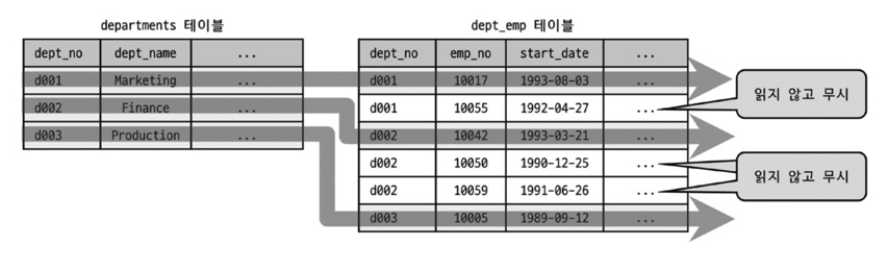
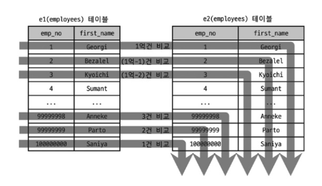
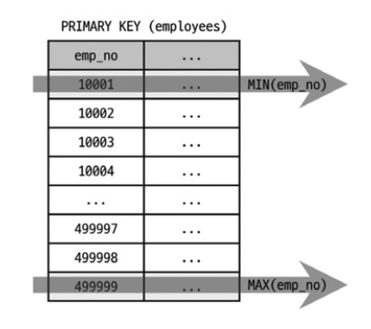
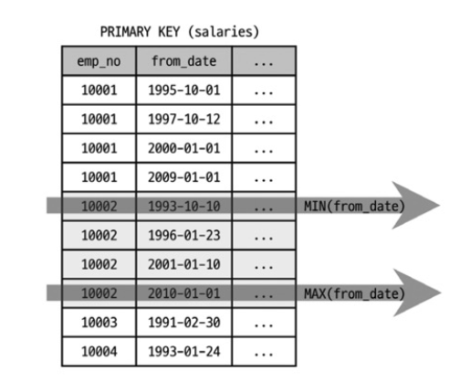

> 이 글은 Real MySQL 8.0 책의 내용을 참고하여 작성되었습니다.

## Extra 컬럼이란?

Extra 컬럼은 실행 계획에서 **추가 정보를 제공**하는 매우 중요한 컬럼입니다. 쿼리 최적화와 성능 개선에 핵심적인 정보를 담고 있습니다.

---

## 성능 관련 중요 메시지 요약

| 메시지 | 의미 |  |
|--------|------|-----------|
| Using index | 커버링 인덱스 사용 | 
| Using index condition | 인덱스 컨디션 푸시다운 | 
| Using filesort | 인덱스 없이 정렬 | 
| Using temporary | 임시 테이블 사용 | 
| Using where | WHERE 필터링 | 
| Using join buffer | 조인 버퍼 사용 | 

---

## 1. const row not found

**의미**: const 접근 방법으로 테이블을 읽었지만 레코드가 1건도 없음

테이블에 테스트 데이터를 저장하고 다시 실행 계획을 확인해 봐야함.

---

## 2. Deleting all rows

**의미**: WHERE 조건 없이 테이블의 모든 레코드를 삭제

MySQL 8.0에서는 더 이상 표시되지 않습니다. 전체 삭제는 **TRUNCATE TABLE** 사용을 권장합니다.

---

## 3. Distinct

**의미**: DISTINCT 처리 시 조인하지 않아도 되는 항목은 무시

```sql
EXPLAIN
SELECT DISTINCT d.dept_no
FROM departments d, dept_emp de
WHERE de.dept_no=d.dept_no;
```

| id | select_type | table | type | Extra |
|----|-------------|-------|------|-------|
| 1 | SIMPLE | d | index | Using index; Using temporary |
| 1 | SIMPLE | de | ref | Using index; Distinct |

필요한 것만 조인하여 효율적으로 처리합니다.



---

## 4. FirstMatch / LooseScan / Start temporary, End temporary

**의미**: 세미 조인 최적화 전략 사용

```sql
-- FirstMatch
EXPLAIN
SELECT *
FROM employees e
WHERE e.first_name='Matt'
  AND e.emp_no IN (SELECT t.emp_no FROM titles t WHERE t.from_date BETWEEN '1995-01-01' AND '1995-01-30');
```

| id | table | type | Extra |
|----|-------|------|-------|
| 1 | e | ref | NULL |
| 1 | t | ref | Using where; Using index; FirstMatch(e) |

**세미 조인 최적화 종류**

- **FirstMatch**: 첫 번째로 일치하는 한 건만 검색
- **LooseScan**: 인덱스를 듬성듬성 읽어서 중복 제거
- **Duplicate Weed-out**: 임시 테이블로 중복 제거 (Start temporary ~ End temporary)

---

## 5. Full scan on NULL key

**의미**: `col1 IN (SELECT col2 FROM ...)` 형태에서 col1이 NULL일 때 서브쿼리를 풀 스캔

**해결 방법**

```sql
SELECT *
FROM tb_test1
WHERE col1 IS NOT NULL
  AND col1 IN (SELECT col2 FROM tb_test2);
```

---

## 6. Impossible HAVING / Impossible WHERE

**의미**: 조건이 항상 FALSE

```sql
-- emp_no는 NOT NULL이므로 항상 FALSE
EXPLAIN
SELECT * FROM employees WHERE emp_no IS NULL;
```

쿼리가 잘못 작성된 경우이므로 점검이 필요합니다.

---

## 7. No matching min/max row / no matching row in const table

**의미**: 조건에 일치하는 레코드가 없음

```sql
EXPLAIN
SELECT MIN(dept_no), MAX(dept_no)
FROM dept_emp
WHERE dept_no='';  -- 일치하는 레코드 없음
```

---

## 8. No matching rows after partition pruning

**의미**: 파티션 프루닝 후 대상 파티션이 없음

```sql
-- 최대 hire_date가 2000-01-28인 경우
EXPLAIN DELETE FROM employees_parted WHERE hire_date>='2020-01-01';
```

2020년 이상의 파티션이 없으므로 삭제할 대상이 없습니다.

---

## 9. No tables used

**의미**: FROM 절이 없거나 FROM DUAL 형태

```sql
EXPLAIN SELECT 1;
EXPLAIN SELECT 1 FROM dual;
```

---

## 10. Not exists

**의미**: 안티 조인(Anti-JOIN)을 아우터 조인으로 최적화

```sql
EXPLAIN
SELECT *
FROM dept_emp de
    LEFT JOIN departments d ON de.dept_no=d.dept_no
WHERE d.dept_no IS NULL;
```

| id | select_type | table | type | Extra |
|----|-------------|-------|------|-------|
| 1 | SIMPLE | de | ALL | NULL |
| 1 | SIMPLE | d | eq_ref | Using where; Not exists |

조건에 일치하는 레코드 1건만 있어도 즉시 처리를 완료합니다.

---

## 11. Plan isn't ready yet

**의미**: `EXPLAIN FOR CONNECTION` 실행 시 대상 커넥션이 아직 실행 계획을 수립하지 못한 상태

시간을 두고 다시 실행하면 됩니다.

---

## 12. Range checked for each record

**의미**: 레코드마다 인덱스 레인지 스캔을 체크

```sql
EXPLAIN
SELECT *
FROM employees e1, employees e2
WHERE e2.emp_no >= e1.emp_no;
```

| id | select_type | table | type | Extra |
|----|-------------|-------|------|-------|
| 1 | SIMPLE | e1 | ALL | NULL |
| 1 | SIMPLE | e2 | ALL | Range checked for each record (index map: 0x1) |



**index map 해석**

`0x1` = 16진수 0x1 = 이진수 `00001`
- 첫 번째 인덱스(PRIMARY KEY)를 후보로 고려

**index map 0x19 예시**

`0x19` = 16진수 0x19 = 이진수 `11001`

| 비트 위치 | 5 | 4 | 3 | 2 | 1 |
|----------|---|---|---|---|---|
| 비트 값  | 1 | 1 | 0 | 0 | 1 |
| 인덱스   | 5번째 | 4번째 | 3번째 | 2번째 | PRIMARY KEY |

비트 값이 1인 인덱스가 후보입니다.

---

## 13. Recursive

**의미**: CTE(Common Table Expression)를 이용한 재귀 쿼리

```sql
EXPLAIN
WITH RECURSIVE cte (n) AS
(
    SELECT 1
    UNION ALL
    SELECT n + 1 FROM cte WHERE n < 5
)
SELECT * FROM cte;
```

| id | select_type | table | Extra |
|----|-------------|-------|-------|
| 1 | PRIMARY | `<derived2>` | NULL |
| 2 | DERIVED | NULL | No tables used |
| 3 | UNION | cte | Recursive; Using where |

---

## 14. Rematerialize

**의미**: 래터럴 조인(LATERAL JOIN)에서 선행 테이블의 레코드별로 임시 테이블 재생성

```sql
EXPLAIN
SELECT * FROM employees e
    LEFT JOIN LATERAL (
        SELECT *
        FROM salaries s
        WHERE s.emp_no=e.emp_no
        ORDER BY s.from_date DESC LIMIT 2
    ) s2 ON s2.emp_no=e.emp_no
WHERE e.first_name='Matt';
```

employees 테이블의 레코드마다 임시 테이블이 새로 생성됩니다.

---

## 15. Select tables optimized away

**의미**: MIN() / MAX() 또는 COUNT(*)를 인덱스로 최적화

```sql
EXPLAIN
SELECT MAX(emp_no), MIN(emp_no) FROM employees;
```


```sql
EXPLAIN
SELECT MAX(from_date), MIN(from_date)
FROM salaries
WHERE emp_no=10002;
```


| id | select_type | table | Extra |
|----|-------------|-------|-------|
| 1 | SIMPLE | NULL | Select tables optimized away |

인덱스의 첫 번째와 마지막 레코드만 읽어서 처리합니다.


---

## 16. unique row not found

**의미**: 아우터 조인에서 아우터 테이블에 일치하는 레코드가 없음

```sql
CREATE TABLE tb_test1 (fdpk INT, PRIMARY KEY(fdpk));
CREATE TABLE tb_test2 (fdpk INT, PRIMARY KEY(fdpk));

INSERT INTO tb_test1 VALUES (1),(2);
INSERT INTO tb_test2 VALUES (1);

EXPLAIN
SELECT t1.fdpk
FROM tb_test1 t1
    LEFT JOIN tb_test2 t2 ON t2.fdpk=t1.fdpk
WHERE t1.fdpk=2;
```

tb_test2 테이블에 fdpk=2인 레코드가 없습니다.

---

## 17. Using filesort

**의미**: ORDER BY를 인덱스로 처리하지 못하고 정렬 수행

```sql
EXPLAIN
SELECT * FROM employees
ORDER BY last_name DESC;
```

| id | select_type | table | type | rows | Extra |
|----|-------------|-------|------|------|-------|
| 1 | SIMPLE | employees | ALL | 300363 | Using filesort |

**성능 영향**

- 정렬용 메모리 버퍼 사용 (Sort buffer)
- 퀵 소트 또는 힙 소트 알고리즘 수행
- **많은 부하를 일으키므로 튜닝이 필수**

**개선 방법**

- ORDER BY에 사용되는 컬럼에 인덱스 생성


---

## 18. Using index (커버링 인덱스)

**의미**: 데이터 파일을 읽지 않고 인덱스만으로 쿼리 처리

```sql
-- 비효율적: 데이터 파일까지 읽어야 함
EXPLAIN
SELECT first_name, birth_date
FROM employees
WHERE first_name BETWEEN 'Babette' AND 'Gad';
```

| id | select_type | table | type | rows | Extra |
|----|-------------|-------|------|------|-------|
| 1 | SIMPLE | employees | ALL | 300473 | Using where |

```sql
-- 효율적: 인덱스만으로 처리
EXPLAIN
SELECT first_name
FROM employees
WHERE first_name BETWEEN 'Babette' AND 'Gad';
```

| id | select_type | table | type | key | Extra |
|----|-------------|-------|------|-----|-------|
| 1 | SIMPLE | employees | range | ix_firstname | Using where; Using index |

**장점**

- 데이터 파일 I/O 없음
- 매우 빠른 처리 속도
- **가장 이상적인 상태**

**InnoDB의 커버링 인덱스 특징**

InnoDB의 세컨더리 인덱스는 프라이머리 키를 포함하므로 커버링 인덱스 활용 가능성이 높습니다.

```sql
-- first_name 인덱스에 emp_no(PK)도 포함됨
EXPLAIN
SELECT emp_no, first_name
FROM employees
WHERE first_name BETWEEN 'Babette' AND 'Gad';
```

| id | select_type | table | type | key | Extra |
|----|-------------|-------|------|-----|-------|
| 1 | SIMPLE | employees | range | ix_firstname | Using where; Using index |

**주의사항**

- 무조건 커버링 인덱스로 만들려고 인덱스에 많은 컬럼을 추가하면 위험합니다
- 인덱스 크기 증가 → 메모리 낭비 → INSERT/UPDATE 성능 저하

**혼동 주의**

- **Extra의 "Using index"**: 커버링 인덱스 (좋음)
- **type의 "index"**: 인덱스 풀 스캔 (느림)

---

## 19. Using index condition

**의미**: 인덱스 컨디션 푸시다운(ICP) 최적화 사용

```sql
-- 인덱스: ix_lastname_firstname (last_name, first_name)
EXPLAIN
SELECT *
FROM employees
WHERE last_name='Acton' AND first_name LIKE '%sal';
```

| id | select_type | table | type | key | Extra |
|----|-------------|-------|------|-----|-------|
| 1 | SIMPLE | employees | ref | ix_lastname_firstname | Using index condition |

### ICP가 없을 때의 문제점

인덱스에 `(last_name, first_name)` 두 컬럼이 모두 포함되어 있지만, 기존 방식에서는 비효율적으로 동작합니다.

**기존 방식 (ICP 없이)**

1. 스토리지 엔진 (InnoDB):
   - 인덱스에서 `last_name='Acton'` 조건만 확인
   - 매칭되는 100건 발견
   - 100건 모두 실제 테이블에서 전체 row 읽기

2. MySQL 엔진:
   - 100건을 받아서 `first_name LIKE '%sal'` 체크
   - 실제로는 3건만 조건에 맞음
   - **97건은 쓸데없이 읽은 것**

### ICP 적용 후

**Index Condition Pushdown 방식**

1. MySQL 엔진:
   - "스토리지 엔진, `first_name LIKE '%sal'` 조건도 인덱스에서 체크할 수 있으니 너가 미리 확인해!"

2. 스토리지 엔진 (InnoDB):
   - 인덱스에서 `last_name='Acton'` 확인
   - 인덱스에 `first_name`도 있으니 여기서 바로 체크
   - `first_name LIKE '%sal'`도 확인
   - **3건만 조건 만족 → 이 3건만 테이블에서 읽기**

3. MySQL 엔진:
   - 3건만 받음 (97건 안 읽음)

**성능 개선**

- 불필요한 테이블 접근 97건 제거
- 인덱스에 포함된 컬럼은 최대한 활용하여 필터링


---

## 20. Using index for group-by

**의미**: GROUP BY 처리를 인덱스로 최적화 (루스 인덱스 스캔)

### 타이트 인덱스 스캔 (Using index for group-by 없음)

```sql
EXPLAIN
SELECT first_name, COUNT(*) AS counter
FROM employees
GROUP BY first_name;
```

| id | select_type | table | type | key | Extra |
|----|-------------|-------|------|-----|-------|
| 1 | SIMPLE | employees | index | ix_firstname | Using index |

AVG(), SUM(), COUNT()처럼 모든 인덱스를 읽어야 하면 듬성듬성 읽을 수 없습니다.

### 루스 인덱스 스캔 (Using index for group-by 표시)

```sql
EXPLAIN
SELECT emp_no, MIN(from_date), MAX(from_date)
FROM salaries
GROUP BY emp_no;
```

| id | select_type | table | type | key | Extra |
|----|-------------|-------|------|-----|-------|
| 1 | SIMPLE | salaries | range | PRIMARY | Using index for group-by |

MIN()/MAX()처럼 첫 번째/마지막 레코드만 읽으면 되는 경우 루스 인덱스 스캔을 사용합니다.

**루스 인덱스 스캔 사용 조건**

- WHERE 조건이 없거나
- WHERE 조건과 GROUP BY가 같은 인덱스를 사용할 수 있어야 함

---

## 21. Using index for skip scan

**의미**: 인덱스 스킵 스캔 최적화 사용 (MySQL 8.0+)

```sql
ALTER TABLE employees
ADD INDEX ix_gender_birthdate (gender, birth_date);

EXPLAIN
SELECT gender, birth_date
FROM employees
WHERE birth_date>='1965-02-01';
```

| id | table | type | key | Extra |
|----|-------|------|-----|-------|
| 1 | employees | range | ix_gender_birthdate | Using where; Using index for skip scan |

인덱스의 첫 번째 컬럼(gender)을 건너뛰고 두 번째 컬럼(birth_date)만으로 검색할 수 있습니다.

---

## [2편에서 계속...](mysql-extra-part2)

2편에서는 다음 내용을 다룹니다:

- Using join buffer (Block Nested Loop, Batched Key Access, hash join)
- Using MRR
- Using sort_union / Using union / Using intersect
- Using temporary
- Using where
- Zero limit

---

## 튜닝 체크리스트

쿼리 튜닝 시 Extra 컬럼에서 확인할 항목:

1. **Using filesort**: 인덱스로 정렬 가능한가?
2. **Using temporary**: GROUP BY/ORDER BY를 인덱스로 처리 가능한가?
3. **Using index**: 커버링 인덱스 적용 가능한가?
4. **Using where + type: ALL**: 인덱스 추가가 필요한가?
5. **Using index condition**: ICP 최적화가 적용됐는가?
