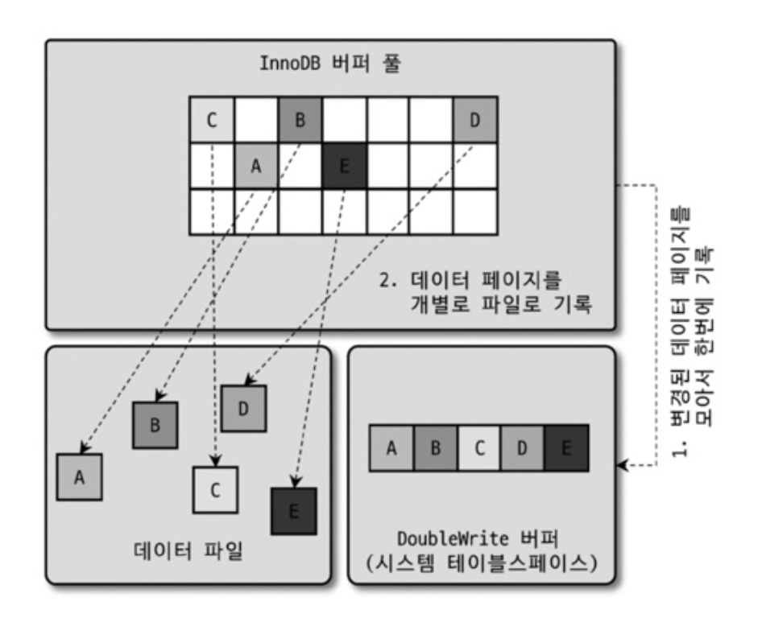

# MySQL 엔진 아키텍처

## MySQL의 전체 구조


### MySQL 엔진

- **커넥션 핸들러**
- **SQL 파서 및 전처리기**
- **옵티마이저**

### 스토리지 엔진

- 디스크 스토리지에 write, read
- MySQL 엔진 하나에 여러 스토리지 엔진을 동시에 사용할 수 있음
- 각 스토리지 엔진은 성능 향상을 위해 **키 캐시** (MyISAM 스토리지 엔진)나 **InnoDB 버퍼 풀** (InnoDB 스토리지 엔진)과 같은 기능을 내장

```SQL
CREATE TABLE test_table (fd1 INT, fd2 INT) ENGINE=INNODB;
```

### 핸들러 API

- MySQL 엔진의 쿼리 실행기가 각 스토리지 엔진에 요청을 보낼 때 사용되는 API

```
1. MySQL 엔진이 쿼리를 파싱하고 최적화합니다

2. 실행 엔진이 최적화된 계획에 따라 각 스토리지 엔진에 핸들러 요청을 보냅니다

3. 스토리지 엔진이 핸들러 API를 통해 실제 데이터 작업을 수행합니다

4. 결과를 다시 MySQL 엔진으로 전달합니다
```

> 핸들러 API를 통해 얼마나 많은 작업이 있었나?
>
> ```sql
> SHOW GLOBAL STATUS LIKE 'Handler%';
> ```

## MySQL 스레딩 구조


- 프로세스가 아닌 **스레드 기반**으로 작동
- **포그라운드** (Foreground)와 **백그라운드** (Background)

> MySQL에서 실행 중인 스레드의 목록
>
> ```sql
> SELECT thread_id, name, type, processlist_user, processlist_host
> FROM performance_shcema.threads ORDER BY type, thread_id;
> ```

### 포그라운드 스레드(클라이언트 스레드)

- **MySQL 서버에 접속한 클라이언트 수만큼 존재**
- 각 클라이언트 사용자가 요청하는 쿼리를 처리
- 커넥션을 종료하면 **스레드 캐시** (Thread cache)로 돌아감
    - 이미 일정 개수의 스레드 캐시가 있다면 종료
    - 스레드 캐시의 최대 스레드 개수는 `thread_cache_size` 시스템 변수로 설정
- 데이터를 MySQL의 **데이터 버퍼**나 **캐시**로부터 가져오고, 없으면 직접 **디스크**나 **인덱스 파일**로부터 가져옴
  
  **데이터 버퍼**: InnoDB의 버퍼 풀(Buffer Pool), MyISAM의 키 캐시(Key Cache)  
  **캐시**: 메모리에 캐싱된 데이터 페이지와 인덱스

  - **MyISAM 테이블은 쓰기 작업까지 포그라운드 스레드가 처리**
    
    >포그라운드 스레드(클라이언트 스레드)가 **디스크 I/O까지 직접 담당**  
    >테이블 락으로 인해 쓰기 중에는 다른 작업이 대기  
    >**Table Level Locking**을 사용하여 전체 테이블을 잠금

  - **InnoDB 테이블은 데이터 버퍼나 캐시까지만 포그라운드 스레드가 처리**

    >포그라운드 스레드는 **변경사항을 버퍼 풀(메모리)에만 기록하고 즉시 반환**
    >실제 디스크 쓰기는 백그라운드 스레드가 나중에 처리 (쓰기 지연)
    >
    >**MyISAM vs InnoDB 비교**
    >- MyISAM: 디스크까지 직접 처리 → 느림, Table Level Locking
    >- InnoDB: 메모리까지만 처리 → 빠름, Row Level Locking
    >- 자세한 동작 방식은 아래 백그라운드 스레드 섹션 참고


### 백그라운드 스레드

백그라운드 스레드는 **청소부**와 같은 역할입니다. 포그라운드 스레드가 급하게 메모장(버퍼 풀)에 메모만 남기고 가면, 백그라운드 스레드가 나중에 그 메모를 정리해서 안전한 금고(디스크)에 보관합니다.

#### 주요 백그라운드 스레드 종류

**로그 스레드 (Log Thread)**

변경 내역(Redo Log, Undo Log)을 디스크에 기록하여 장애 복구와 데이터 일관성을 보장합니다.

비유: 회사의 **작업 일지**를 기록하는 담당자
- 누가, 언제, 무엇을 변경했는지 기록
- 문제 발생 시 이 기록을 보고 복구

**쓰기 스레드 (Write Thread)**

버퍼 풀의 더티 페이지(변경된 데이터)를 실제 데이터 파일로 내려씁니다.

비유: **정리 담당자**
- 메모장에 적힌 변경사항을 실제 파일 캐비닛(디스크)에 정리
- 여러 건을 모아서 한 번에 처리 (배치 처리로 효율성 향상)

설정 예시:
```sql
-- 일반 디스크: 2~4개, 고성능 SSD: 4개 이상 권장
SHOW VARIABLES LIKE 'innodb_write_io_threads';
SET GLOBAL innodb_write_io_threads = 4;
```

**읽기 스레드 (Read Thread)**

데이터를 디스크에서 버퍼 풀로 읽어오는 작업을 **보조**합니다.

**쓰기 vs 읽기 스레드의 결정적 차이**

쓰기 스레드:
```
포그라운드 → 메모리에만 기록 → 즉시 "완료" 반환 (클라이언트 대기 안 함)
백그라운드 → 나중에 디스크에 기록
```

읽기 스레드:
```
포그라운드 → 버퍼 풀 확인
  - 있으면: 즉시 반환
  - 없으면: 포그라운드가 직접 디스크에서 읽어옴 (클라이언트 대기)
백그라운드 → 병렬 처리로 속도만 향상 (클라이언트는 여전히 대기)
```

**읽기 스레드는 언제 사용되나?**

단일 행 조회:
```sql
SELECT * FROM users WHERE id = 1;
-- 1개 페이지만 필요
-- 포그라운드 스레드가 직접 디스크에서 읽어옴
-- 백그라운드 스레드 개입 안 함
```

대량 데이터 조회 (테이블 풀 스캔):
```sql
SELECT * FROM users;  -- 100만 건
-- 수천 개 페이지 필요
-- 포그라운드 스레드 혼자서는 느림

-- 백그라운드 읽기 스레드 4개 활용
-- 포그라운드: 페이지 1~25 담당
-- 백그라운드1: 페이지 26~50 담당
-- 백그라운드2: 페이지 51~75 담당
-- 백그라운드3: 페이지 76~100 담당
-- → 병렬 처리로 더 빠름 (하지만 클라이언트는 대기)
```

**핵심 정리**

읽기는 본질적으로 **클라이언트가 지금 당장 필요**하기 때문에 백그라운드로 미룰 수 없습니다. 읽기 스레드는 단지 **병렬 처리로 속도를 높여줄 뿐**입니다.

설정 예시:
```sql
-- 보통 4개면 충분
SHOW VARIABLES LIKE 'innodb_read_io_threads';
SET GLOBAL innodb_read_io_threads = 4;
```

**기타 스레드**
- **인서트 버퍼 병합 스레드**: 인덱스 삽입 작업을 모아서 일괄 처리
- **잠금/데드락 모니터링 스레드**: 교착 상태 감지 및 해결

#### 왜 백그라운드 스레드가 중요한가?

**포그라운드 vs 백그라운드 역할 분담**

`포그라운드 스레드가 디스크 I/O까지 직접 하면:`
- 디스크는 느리기 때문에 클라이언트가 오래 대기
- 동시에 많은 요청 처리 불가

`백그라운드로 분리하면:`
- 포그라운드는 빠르게 메모리 작업만 하고 응답
- 느린 디스크 작업은 백그라운드가 알아서 처리
- 동시 처리 능력 대폭 향상

**실제 시나리오**

커피숍으로 비유:
1. **포그라운드 스레드 = 주문 받는 직원**
   - 고객 주문을 메모장에 적고 즉시 "주문 완료!"
   - 실제 커피는 안 만듦 (빠른 응답)

2. **백그라운드 스레드 = 바리스타**
   - 메모장 보고 실제 커피 제조
   - 고객은 기다리지 않음

3. **MyISAM 방식 = 주문 받는 직원이 커피까지 만듦**
   - 한 고객당 시간 오래 걸림
   - 뒤 고객들은 계속 대기

#### 스레드 개수 설정 가이드

```sql
-- 고성능 스토리지(SSD) 환경
SET GLOBAL innodb_write_io_threads = 8;
SET GLOBAL innodb_read_io_threads = 4;

-- 일반 환경
SET GLOBAL innodb_write_io_threads = 4;
SET GLOBAL innodb_read_io_threads = 4;
```

**핵심 포인트**
- 읽기 작업은 주로 포그라운드 스레드가 처리 → 읽기 스레드는 많이 필요 없음
- 쓰기 작업은 대부분 백그라운드로 처리 → 쓰기 스레드를 충분히 설정해야 병목 방지

#### 쓰기 버퍼링 (Write Buffering)

**핵심 개념**
- 읽기 작업은 즉시 처리해야 함 (고객이 기다림)
- 쓰기 작업은 지연해도 됨 (나중에 처리해도 문제없음)

**MyISAM vs InnoDB**
- **MyISAM**: 쓰기도 포그라운드 스레드가 즉시 디스크에 기록 → 느림
- **InnoDB**: 메모리에 먼저 기록 후, 백그라운드 스레드가 일괄 처리 → 빠름

**InnoDB UPDATE 쿼리 실행 시 전체 과정**

```sql
BEGIN;
UPDATE users SET name = 'John' WHERE id = 1;
COMMIT;
```

**1단계: UPDATE 실행 시점**
```
① 포그라운드 스레드가 버퍼 풀에서 해당 페이지 찾기
② 버퍼 풀의 데이터 수정 (더티 페이지로 표시)
③ 리두 로그 버퍼에 물리적 변경사항 기록
   예: "페이지 100, 오프셋 50에 'John' 기록"
④ 바이너리 로그 캐시에 SQL 기록
   예: "UPDATE users SET name = 'John' WHERE id = 1"
```

**2단계: COMMIT 시점 (중요!) - 포그라운드 스레드가 직접 처리**
```
① 리두 로그 버퍼 → 리두 로그 파일(디스크)에 기록 
   (WAL - Write Ahead Log 원칙)
   → 포그라운드 스레드가 직접 기록 (동기적)

② 바이너리 로그 캐시 → 바이너리 로그 파일(디스크)에 기록
   → 포그라운드 스레드가 직접 기록 (동기적)

③ 트랜잭션 커밋 완료
④ 클라이언트에게 "OK" 응답
```

**3단계: 이후 백그라운드 처리 - 백그라운드 스레드가 처리**
```
백그라운드 쓰기 스레드가 적절한 시점에
버퍼 풀의 더티 페이지 → 실제 데이터 파일(디스크)에 기록 (비동기적)
```

**누가 무엇을 기록하나?**

**포그라운드 스레드가 디스크에 기록 (COMMIT 시):**
- 리두 로그 파일
- 바이너리 로그 파일
- 이유: 데이터 영속성 보장이 필요한 시점 (클라이언트가 대기)

**백그라운드 스레드가 디스크에 기록 (나중에):**
- 실제 데이터 파일
- 이유: 리두 로그가 있으면 복구 가능하므로 굳이 기다릴 필요 없음

**왜 이렇게 설계되었나?**

COMMIT은 데이터 영속성 보장이 필수:
```
만약 백그라운드가 로그 기록을 한다면?

포그라운드: "OK" 응답 → 클라이언트는 성공으로 인식
백그라운드: 아직 로그 기록 중...
서버 다운! → 데이터 손실! (복구 불가능)
```

포그라운드가 로그를 디스크에 확실히 기록한 후 응답:
```
포그라운드: 리두 로그 기록 완료 → 바이너리 로그 기록 완료 → "OK" 응답
서버 다운해도 → 리두 로그로 복구 가능!
```

**핵심 정리**

리두 로그가 먼저 디스크에 기록되는 이유:
- 장애 발생 시 리두 로그만 있으면 복구 가능
- 실제 데이터 파일은 나중에 써도 안전함
- 이를 **WAL (Write Ahead Log)** 원칙이라고 함

실제 데이터 파일 기록은 왜 백그라운드로?
- 여러 변경사항을 모아서 한 번에 쓰면 효율적
- 디스크 I/O 횟수 최소화
- 클라이언트는 로그 기록만 기다리면 되므로 빠르게 응답 받음

## 메모리 할당 및 사용 구조


MySQL의 메모리는 크게 **글로벌 메모리 영역** (모든 스레드 공유)과 **로컬 메모리 영역** (각 클라이언트 전용)으로 나뉩니다.

### 어떤 메모리가 더 중요할까?

많은 사람들이 "성능을 위해 글로벌 메모리(특히 InnoDB 버퍼 풀)가 중요하다"고 말합니다. 맞는 말입니다. 하지만 **운영 관점에서는 로컬 메모리가 훨씬 더 위험하고 중요합니다.**

**왜 로컬 메모리가 더 중요한가?**

**글로벌 메모리: 예측 가능하고 안전**
- 서버 시작 시 한 번만 할당
- 크기가 고정됨 (예: 버퍼 풀 8GB → 항상 8GB)
- 모니터링과 관리가 쉬움

**로컬 메모리: 예측 불가능하고 위험**
- 클라이언트가 접속할 때마다 동적으로 할당
- 총 메모리 = `클라이언트 수 × 버퍼 크기`
- 트래픽 급증 시 메모리 폭증 → 서버 다운 위험

**실제 장애 시나리오**

설정:
```sql
SET GLOBAL sort_buffer_size = 10485760;  -- 10MB로 설정
```

정상 상황:
- 클라이언트 100개 접속
- 메모리 사용: 100 × 10MB = 1GB (괜찮음)

장애 상황:
- 갑자기 이벤트로 트래픽 급증
- 클라이언트 1000개 동시 접속
- 메모리 사용: 1000 × 10MB = **10GB 폭증!**
- 서버 메모리 부족 → **OOM (Out of Memory) 에러**
- MySQL 서버 다운 → 서비스 장애

### 글로벌 메모리 영역

**특징**
- 모든 클라이언트 스레드가 공유
- MySQL 서버 시작 시 한 번만 할당
- 클라이언트 수와 무관하게 고정 크기

#### 주요 메모리 영역

**InnoDB 버퍼 풀**

데이터와 인덱스를 메모리에 캐싱하여 디스크 I/O 최소화

```sql
-- 전체 메모리의 50~80% 할당 권장
SHOW VARIABLES LIKE 'innodb_buffer_pool_size';
```

**InnoDB 리두 로그 버퍼**

트랜잭션 로그를 임시 보관 (장애 복구용)

**InnoDB 어댑티브 해시 인덱스**

자주 사용되는 데이터의 인덱스를 자동 생성

**테이블 캐시**

테이블 메타데이터(구조 정보) 캐싱

### 로컬 메모리 영역 (주의 필요!)

**특징**
- 각 클라이언트 스레드마다 독립적으로 할당
- 쿼리 실행에 필요한 경우에만 동적 할당
- 쿼리 종료 시 해제

**주의사항**

로컬 메모리는 **클라이언트 수에 비례**하므로 신중하게 설정해야 합니다.

#### 주요 메모리 영역

**정렬 버퍼 (Sort Buffer)**

`ORDER BY`, `GROUP BY` 시 사용

```sql
-- 기본값: 256KB (적절함)
SHOW VARIABLES LIKE 'sort_buffer_size';

-- 잘못된 설정 (위험!)
SET GLOBAL sort_buffer_size = 10485760;  -- 10MB
-- 클라이언트 1000개 시 = 10GB 메모리 사용!
```

**조인 버퍼 (Join Buffer)**

테이블 조인 시 사용

```sql
SHOW VARIABLES LIKE 'join_buffer_size';
```

**바이너리 로그 캐시**

트랜잭션의 변경 내역을 메모리에 임시 저장하는 공간

**왜 로컬 메모리인가?**

각 트랜잭션마다 독립적으로 할당해야 하기 때문입니다.

트랜잭션 격리:
```sql
-- 세션 1
BEGIN;
UPDATE users SET name = 'John' WHERE id = 1;
-- 커밋 전 → 바이너리 로그 캐시에만 있음

-- 세션 2
BEGIN;
UPDATE users SET name = 'Jane' WHERE id = 2;
-- 각 세션은 독립적인 캐시 사용

COMMIT;  -- 이때 캐시 → 디스크 바이너리 로그 파일로 기록
```

**리두 로그 vs 바이너리 로그 차이**

둘 다 변경사항을 기록하지만 용도가 다릅니다.

**리두 로그 (Redo Log)**
- 목적: 장애 복구 (Crash Recovery)
- 대상: InnoDB 전용
- 내용: 물리적 변경 (어떤 페이지의 어떤 위치를)
- 형식: 바이너리 형식 (사람이 못 읽음)
- 위치: 글로벌 메모리 (InnoDB 리두 로그 버퍼)
- 예시: `페이지 100, 오프셋 50에 값 0x1234 기록`

**바이너리 로그 (Binary Log)**
- 목적: 복제(Replication), 백업/복구
- 대상: MySQL 전체 (모든 스토리지 엔진)
- 내용: 논리적 변경 (어떤 SQL을 실행했는지)
- 형식: SQL 문장 또는 Row 변경 내역
- 위치: 로컬 메모리 (각 트랜잭션마다)
- 예시: `UPDATE users SET name = 'John' WHERE id = 1`

**왜 둘 다 필요한가?**
- 리두 로그: MySQL 재시작 시 빠른 복구
- 바이너리 로그: Slave 서버 동기화, 특정 시점 복구

**왜 리두 로그로 복제가 안 되나?**

리두 로그는 물리적 구조에 의존하기 때문에 복제에 사용할 수 없습니다.

물리적 vs 논리적 차이:

리두 로그 (물리적):
```
페이지 100, 오프셋 50에 0x1234 기록
페이지 200, 오프셋 30에 0x5678 기록
```
→ Master의 페이지 100 ≠ Slave의 페이지 100 (구조가 다를 수 있음)

바이너리 로그 (논리적):
```sql
UPDATE users SET name = 'John' WHERE id = 1;
```
→ 어떤 서버에서든 실행 가능 (구조 독립적)

실제 복제 시나리오:
```sql
-- Master에서 실행
DELETE FROM users WHERE id = 5;
UPDATE users SET name = 'John' WHERE id = 1;

-- 리두 로그 방식 (불가능)
페이지 100에서 행 삭제  ← Slave는 페이지 번호가 다를 수 있음
페이지 50에서 값 변경   ← 적용 불가능

-- 바이너리 로그 방식 (가능)
DELETE FROM users WHERE id = 5;  ← Slave에서 SQL 실행
UPDATE users SET name = 'John' WHERE id = 1;  ← Slave의 구조에 맞게 자동 적용
```

스토리지 엔진 독립성:
- Master: InnoDB, Slave: MyISAM 조합 가능
- 리두 로그: InnoDB 전용 → MyISAM Slave에 적용 불가
- 바이너리 로그: SQL이므로 모든 엔진에서 실행 가능

**핵심 정리**
- 리두 로그: 같은 서버 내에서 빠른 복구 (물리적, InnoDB 전용)
- 바이너리 로그: 다른 서버로 복제 (논리적, 모든 엔진 지원)

설정:
```sql
SHOW VARIABLES LIKE 'binlog_cache_size';
-- 기본값: 32KB (트랜잭션당)
-- 클라이언트 1000개 × 32KB = 32MB
```

**네트워크 버퍼**

클라이언트와의 통신용 버퍼

#### 메모리 설정 가이드라인

**글로벌 메모리**
- 크게 설정해도 안전 (고정 크기)
- 성능 향상에 직접적인 효과
- 전체 메모리의 50~80%를 버퍼 풀에 할당

**로컬 메모리**
- 보수적으로 설정 (작게 시작)
- 기본값(256KB~1MB)이 대부분 적절
- 특별한 이유 없이 크게 설정하지 말 것

**안전한 설정 예시**
```sql
-- 글로벌: 크게 설정 (16GB 서버 기준)
SET GLOBAL innodb_buffer_pool_size = 10737418240;  -- 10GB

-- 로컬: 작게 유지
SET GLOBAL sort_buffer_size = 262144;        -- 256KB (기본값)
SET GLOBAL join_buffer_size = 262144;        -- 256KB (기본값)

-- 최대 동시 접속자 1000명이라도
-- 로컬 메모리: 1000 × 256KB = 256MB (안전)
```

**핵심 포인트**

성능은 글로벌 메모리로 높이되, 안정성은 로컬 메모리 관리에 달려있습니다. 특히 트래픽이 많은 서비스라면 로컬 메모리 설정을 더욱 신중하게 해야 합니다.

## 플러그인 스토리지 엔진 모델

- 스토리지 엔진 뿐만 아니라 다양한 플러그인이 가능
    - 검색어 파서
    - Native Authentication
    - Caching SHA-2 Authentication
- 스토리지 엔진은 쿼리의 실행 과정 중 **데이터의 읽기/쓰기** 작업만 담당
    1.  SQL 파서
    2.  SQL 옵티마이저
    3.  SQL 실행기
    4.  데이터 읽기/쓰기
- 스토리지 엔진 확인
    ```sql
    SHOW ENGINE;
    ```
    - Support 칼럼
        - YES : 사용 가능
        - DEFAULT : 필수 스토리지 엔진
        - NO : 포함되지 않음
        - DISABLED : 포함됐지만 파라미터에 의해 비활성화
- 플러그인 확인
    ```sql
    SHOW PLUGINS;
    ```

## 컴포넌트

- 플러그인 아키텍처의 단점을 보완하기 위해 등장
    - 오직 MySQL 서버와 인터페이스할 수 있고, 플러그인끼리는 통신할 수 없음
    - MySQL 서버의 변수나 함수를 직접 호출 → 캡슐화가 되지 않아 안전하지 않음
    - 상호 의존 관계를 설정할 수 없어 초기화가 어려움

```sql
INSTALL COMPONENT 'file://component_validate_password';
SELECT * FROM mysql.component;
```

## 쿼리 실행 구조


### 쿼리 파서

- 사용자 요청으로 들어온 쿼리 문장은 토큰으로 분리
    - 토큰 : MySQL이 인식할 수 있는 최소 단위의 어휘나 기호
- 토큰을 트리 형태의 구조로 만드는 작업
- 쿼리 문장의 기본 문법 오류를 발견

### 전처리기

- 파서 트리를 기반으로 쿼리 문장에 구조적인 문제점이 있는지 확인
- 각 토큰을 테이블 이름이나 칼럼 이름, 또는 내장 함수와 같은 개체와 매핑
- 객체의 존재 여부와 객체의 접근 권한 등을 확인

### 옵티마이저

- 요청으로 들어온 쿼리 문장을 가장 빠르게 처리하는 방법을 결정

### 실행 엔진

- 만들어진 계획대로 각 핸들러에게 요청해서 받은 결과를 또 다른 핸들러의 요청의 입력으로 연결하는 역할

### 핸들러

- MySQL 실행 엔진의 요청에 따라 데이터를 디스크로 저장하고 읽어오는 역할
- 결국 스토리지 엔진을 의미
    - MyISAM 테이블을 조작하는 경우 핸들러가 MyISAM 스토리지 엔진
    - InnoDB 테이블을 조작하는 경우 핸들러가 InnoDB 스토리지 엔진

## 쿼리 캐시

- SQL의 **실행 결과를 메모리에 캐시**
- 동일 SQL 쿼리가 실행되면 테이블을 읽지 않고 즉시 결과를 반환
- 테이블의 데이터가 변경되면 캐시에 저장된 결과 중 이와 관련된 것들을 모두 삭제(Invalidate)해야 함
    - 심각한 동시 처리 성능 저하 → **MySQL8.0에서 제거**

## 스레드 풀

- 사용자의 요청을 처리하는 스레드 개수를 줄여서 서버의 자원 소모를 줄이는 것이 목표
- 스케줄링 과정에서 CPU 시간을 제대로 확보하지 못하면 더 느려질 수 있음

### Percona Server

- MySQL 서버 엔터프라이즈 에디션은 스레드 풀 기능을 제공
- MySQL 커뮤니티 에디션을 지원하지 않아서 **Percona Server의 스레드 풀 플러그인**을 사용

### 스레드 개수

- Percona Server의 스레드 풀은 기본적으로 **CPU 코어의 개수만큼** 스레드 그룹을 생성
    - `thread_pool_size` 시스템 변수로 조정 가능
    - 일반적으로 CPU 코어의 개수와 맞추는 것이 CPU 프로세서 친화도를 높이는 데 좋음

### 스레드 추가

- 스레드 풀에 이미 처리중인 작업이 있는 경우에는 `thread_pool_oversubscribe`에 설정된 개수만큼 추가로 처리
    - 기본값 3
- 모든 스레드가 작업중이라면
    - 새로운 작업 스레드를 추가할지, 기존 스레드가 작업을 완료할 때까지 기다릴지 판단
    - 스레드 풀의 **타이머 스레드**가 주기적으로 스레드 그룹의 상태를 체크
    - `thread_pool_stall_limit` 시스템 변수만큼 스레드가 작업을 끝내지 못하면 새로 스레드를 추가
    - 모든 스레드가 작업중이라면 `thread_pool_stall_limit` 이후에 새 요청을 처리할 수 있음

**중요한 제한 조건**

스레드는 무한정 추가될 수 없습니다:
- `thread_pool_max_threads` 시스템 변수로 최대 스레드 개수 제한
- 이 값을 초과하면 더 이상 스레드를 추가할 수 없음
- 초과 시 기존 스레드가 작업을 완료할 때까지 대기

### 선순위 큐 & 후순위 큐

- 먼저 시작된 트랜잭션 내에 속한 SQL을 빨리 처리
- 해당 트랜잭션이 가지고 있던 잠금을 빨리 해제 → 경합 감소 → 처리 성능 향상

## 트랜잭션 지원 메타데이터

### 메타데이터

- 테이블의 구조 정보
- 스토어드 프로그램
- 기존에는 FRM 등 **파일 기반**으로 관리
    → 트랜잭션을 지원하지 않아 테이블 생성 도중 비정상 종료시 일관성이 깨짐

### InnoDB

- 테이블의 구조 정보나 스토어드 프로그램과 관련된 정보를 InnoDB에 저장하도록 개선

#### 시스템 테이블

- MySQL 서버가 작동하는 데 기본적으로 필요한 테이블들
- 사용자의 인증과 권한 관리 등
- mysql DB에 저장됨
    - 통째로 `mysql.ibd` 테이블스페이스에 저장

> 시스템 테이블에 접근
> 보안을 위해 `information_schema`를 통해 조회
>
> ```sql
> SHOW CREATE TABLE INFORMATION_SCHEMA.TABLES;
> ```
>
> 직접 접근 시 ‘테이블 없음’ 에러가 아닌 ‘접근 거절’
>
> ```sql
> SELECT * FROM mysql.tables LIMIT 1;
> ```

### SDI(Serialized Dictionary Information)

- InnoDB 스토리지 엔진을 사용하는 테이블은 메타데이터를 InnoDB 테이블 기반의 딕셔너리에 저장
- MyISAM이나 CSV 등과 같은 스토리지 엔진의 메타데이터는 여전히 저장할 공간이 필요
- `*.sdi` 파일이 기존의 `*.FRM`과 동일한 역할을 수행
- InnoDB 테이블들의 구조도 SDI 파일로 변환 가능
    - `idb2sdi` 유틸리티 이용

# InnoDB 스토리지 엔진 아키텍처

- **레코드 기반의 잠금**을 제공
- **높은 동시성 처리**가 가능


## 프라이머리 키에 의한 클러스터링

- InnoDB의 모든 테이블은 **프라이머리 키를 기준으로 클러스터링되어 저장**
    → **프라이머리 키 값의 순서대로 디스크에 저장**
    → 모든 세컨더리 인덱스는 레코드의 주소 대신 **프라이머리 키의 값을 논리적인 주소로 사용**
- MyISAM 스토리지 엔진에서는 클러스터링 키를 지원하지 않음
    - 프라이머리 키는 유니크 제약을 가진 세컨더리 인덱스와 동일하게 동작


## 외래 키 지원

- InnoDB 스토리지 엔진 레벨에서 지원
    - MyISAM이나 MEMORY에서는 사용 불가
- **잠금이 여러 테이블로 전파되며 데드락이 발생**할 수 있음
    - 외래 키는 부모 테이블과 자식 테이블 모두 해당 칼럼에 인덱스 생성이 필요
    - 변경 시 반드시 부모 테이블이나 자식 테이블에 데이터가 있는지 체크하는 작업이 필요
- `foreign_key_checks` 시스템 변수를 `OFF`로 설정하여 일시적으로 외래 키 관계 체크 작업을 비활성화
    - 비활성화된 동안 `ON DELETE CASCADE`와 `ON UPDATE CASCADE` 옵션도 무시
    - 대량 레코드 적재 및 삭제 작업을 빠르게 진행할 수 있음
    - 일관성을 맞춰준 후 다시 활성화해줘야 함

## MVCC(Multi Version Concurrency Control)

- 일반적으로 레코드 레벨의 트랜잭션을 지원하는 DBMS가 제공하는 기능
- **잠금을 사용하지 않는 일관된 읽기를 제공**하는 것이 가장 큰 목적
- InnoDB는 **언두 로그** (Undo log)를 이용해 구현
- 멀티 버전 : **하나에 레코드에 대해 여러 개의 버전**이 동시에 관리됨을 의미

### 격리 수준(Isolation level)

- `INSERT` 이후 InnoDB 버퍼 풀과 데이터 파일에 새로운 값이 추가됨
- `UPDATE`를 하면
    - 커밋 실행 여부와 관계없이 InnoDB의 **버퍼 풀을 새로운 값으로** 업데이트됨
    - **변경 전 값을 언두로그**에 기록
    - 데이터 파일은 백그라운드 스레드에 의해 기록되기 때문에 시점에 따라 업데이트 여부가 다름
- 아직 `COMMIT`이나 `ROLLBACK`되지 않은 상태에서 다른 사용자가 해당 레코드를 조회하면
    - `transaction_isolation`에 설정된 **격리 수준**에 따라 결과가 다름
    - **`READ_UNCOMMITTED`**
        - **버퍼 풀이 가지고 있는 데이터를 반환**
    - **`READ_COMMITTED`**, `REPEATABLE_READ`, `SERIALIZABLE`
        - 버퍼 풀이나 데이터 파일에 있는 내용 대신 변경되기 이전의 내용인 **언두 영역의 데이터를 반환**

### 트랜잭션 종료

- `COMMIT`
    - 더 이상의 변경 작업 없이 지금의 상태를 영구적인 데이터로 만들어버림
    - 언두 영역의 백업 데이터를 바로 삭제하지 않고, 이를 필요로하는 트랜잭션이 더 없을 때 삭제
- `ROLLBACK`
    - 언두 영역에 있는 백업된 데이터를 버퍼 풀로 다시 복구하고, 언두 영역의 내용을 삭제

## 잠금 없는 일관된 읽기

- MVCC 기술을 이용해 잠금을 걸지 않고 읽기 작업을 수행
    - `SERIALIZABLE` 제외
- 특정 사용자가 레코드를 변경하고 아직 커밋하지 않았다 하더라도 언두 로그의 데이터를 읽음

> 오랜 시간 동안 트래잭션이 활성 상태이면
> 언두 로그를 삭제하지 못하고 계속 유지해야 함
> MySQL 서버가 느려지거나 문제가 발생할 수 있음

## 자동 데드락 감지

- 잠금 대기 목록을 **그래프(Wait-for List)** 형태로 관리
- 데드락 감지 스레드가 잠금 대기 그래프를 검사해 교착 상태에 빠진 트랜잭션들 중 하나를 강제 종료
    - **언두 로그를 더 적게 가진 트랜잭션**이 일반적으로 롤백의 대상이 됨
        → 롤백을 해도 언두 처리를 해야 할 내용이 적기 때문
- MySQL 엔진에서 관리되는 테이블 잠금(`LOCK TABLES` 명령)은 볼 수 없어서 데드락 감지가 불확실
    - **`innodb_table_locks`** 시스템 변수를 활성화하면 테이블 레벨의 잠금까지 감지 가능

### 데드락 감지 부하

- 데드락 스레드가 잠금 목록을 검사하기 위해 **잠금 목록이 저장된 리스트(잠금 테이블)에 새로운 잠금**을 걸음
- 동시 처리 스레드가 많아지거나, 각 트랜잭션의 잠금 개수가 증가하면 데드락 감지 스레드가 느려짐
- `innodb_deadlock_detect` 시스템 변수를 `OFF`로 설정하면 감지 안함
    → **데드락 발생 시 무한정 대기**
- `innodb_lock_wait_timeout` 시스템 변수를 활성화
    → **데드락 상황에서 자동으로 요청이 실패**하고 에러 메시지를 반환

## 자동화된 장애 복구

- InnoDB 데이터 파일은 기본적으로 MySQL 서버가 시작될 때 자동으로 복구를 수행
    - 복구될 수 없는 손상이 있다면 종료
- `innodb_force_recovery` 시스템 변수로 **파일의 손상 여부를 선별적으로 진행**
    - 1부터 6까지, 높을수록 심각한 상황
- `mysqldump`를 이용해 데이터를 가능한 만큼 백업한 뒤 새로 DB와 테이블을 생성하는 것이 좋음

### `innodb_force_recovery` 옵션

- 1(`SRV_FORCE_IGNORE_CORRUPT`)
    - 데이터나 인덱스 페이지에서 손상된 부분이 발견돼도 무시하고 시작하는 모드
- 2(`SRV_FORCE_NO_BACKGROUND`)
    - 불필요한 언두 데이터는 메인 스레드가 주기적으로 삭제(Undo purge)
    - 메인 스레드를 시작하지 않고 서버를 시작하여 언두 데이터로 인한 장애를 무시하는 모드
- 3(`SRV_FORCE_NO_TRX_UNDO`)
    - 일반적으로 서버가 다시 시작하면서 언두 영역의 데이터를 데이터 파일의 적용하고, 리두 파일의 내용을 덮어써서 장애 시점의 데이터 상태를 만들어 냄
    - 커밋되지 않은 트랜잭션의 작업을 롤백하지 않고 그대로 두는 모드
- 4(`SRV_FORCE_NO_IBUF_MERGE`)
    - 데이터 변경으로 인한 인덱스 변경 작업은 인서트 버퍼에 저장해두고 나중에 처리될 수 있음
    - 인서트 버퍼의 내용을 무시하고 시작하는 모드
- 5(`SRV_FORCE_NO_UNDO_LOG_SCAN`)
    - 언두 로그를 모두 무시하고 시작하는 모드
    - 커밋되지 않은 트랜잭션을 모두 커밋된 것처럼 처리
- 6(`SRV_FORCE_NO_LOG_REDO`)
    - 리두 로그를 무시한 채로 시작
    - 커밋이 되어도 리두 로그에만 기록되였다면 무시됨 → 마지막 체크포인트 시점의 데이터만 남음

## InnoDB 버퍼 풀

- 디스크의 데이터 파일이나 인덱스 정보를 **메모리에 캐시**해두는 공간
- 쓰기 작업을 지연시켜 일괄 작업으로 처리할 수 있게 해주는 **버퍼 역할**
    → 랜덤한 디스크 작업의 횟수를 줄임

### 버퍼 풀의 크기 설정

- **레코드 버퍼** : 각 클라이언트 세션에서 테이블의 레코드를 읽고 쓸 때 버퍼로 사용하는 공간
    - 별도로 설정할 수 없고, 전체 커넥션 개수와 각 커넥션이 다루는 테이블 개수에 따라 결정됨
    - 동적으로 해제되기도 해서 정확한 필요 메모리 계산이 불가능
- 버퍼 풀의 크기를 적절히 **작은 값으로 설정한 뒤 조금씩 증가**시키는 방법이 최적
- `innodb_buffer_pool_size` 시스템 변수로 크기를 설정
    - 동적으로 버퍼 풀의 크기를 확장할 수 있음
    - **크기를 줄이는 작업**은 크리티컬하므로 주의
    - 버퍼 풀 크기의 단위는 128MB
#### 버퍼 풀 인스턴스

**문제: 단일 버퍼 풀의 경합**

버퍼 풀은 여러 클라이언트 스레드가 동시에 접근하는 공유 자원입니다.

단일 버퍼 풀 사용 시:
```
클라이언트 1000개가 동시에 버퍼 풀 접근
→ 하나의 버퍼 풀을 잠금(세마포어)으로 보호
→ 한 번에 하나의 스레드만 접근 가능
→ 나머지 999개는 대기 (심각한 경합)
```

**해결: 버퍼 풀을 여러 개로 분할**

비유: 은행 창구 1개 vs 창구 8개

창구 1개:
- 1000명이 한 줄로 대기
- 대기 시간 매우 길음

창구 8개:
- 1000명을 8개 줄로 분산 (각 줄당 125명)
- 대기 시간 대폭 감소

버퍼 풀도 마찬가지:
```sql
-- 버퍼 풀 8GB를 8개 인스턴스로 분할
SET GLOBAL innodb_buffer_pool_size = 8589934592;  -- 8GB
SET GLOBAL innodb_buffer_pool_instances = 8;      -- 8개로 분할

-- 각 인스턴스: 1GB씩 담당
-- 경합: 1/8로 감소
```

**동작 방식**

버퍼 풀 인스턴스 8개로 분할:
```
인스턴스 1: 페이지 1, 9, 17, 25...
인스턴스 2: 페이지 2, 10, 18, 26...
인스턴스 3: 페이지 3, 11, 19, 27...
...
인스턴스 8: 페이지 8, 16, 24, 32...
```

스레드 A가 페이지 1 요청 → 인스턴스 1만 잠금
스레드 B가 페이지 2 요청 → 인스턴스 2만 잠금 (동시 처리 가능!)

### 버퍼 풀의 구조

- 버퍼 풀을 페이지 크기의 조각으로 쪼개어 InnoDB 스토리지 엔진이 데이터를 필요로 할 때, 해당 데이터 페이지를 읽어와 각 조각에 저장
- **LRU** (Least Recently Used) 리스트, **플러시** (Flush) 리스트, **프리** (Free) 리스트

#### 프리(Free) 리스트

**프리 리스트는 InnoDB 버퍼 풀이 처음 시작될 때 존재하는 빈 페이지들의 목록**입니다.

**버퍼 풀 초기화 시**

MySQL이 시작되면 버퍼 풀(예: 10GB)이 할당되지만, 처음에는 모든 페이지가 비어있습니다. 이 빈 페이지들이 프리 리스트에 들어갑니다.

**데이터 적재 과정**

1. 쿼리가 실행되면 디스크에서 데이터를 읽어와야 함
2. 프리 리스트에서 빈 페이지를 하나 가져옴
3. 디스크에서 읽은 데이터로 해당 페이지를 채움
4. 채워진 페이지는 LRU 리스트로 이동

**프리 리스트가 고갈되면?**

프리 리스트가 비면 LRU 리스트의 꼬리(Tail)에서 가장 오래 사용되지 않은 페이지를 제거하여 공간을 확보합니다:
- 깨끗한 페이지: 바로 제거하고 재사용
- 더티 페이지: 디스크에 먼저 기록한 후 재사용

따라서 프리 리스트는 "아직 한 번도 사용되지 않은 빈 공간"이고, LRU 리스트는 "실제 데이터가 들어있는 공간"입니다.

#### LRU(Least Recentrly Used)


- 엄밀하게는 LRU와 MRU(Most Recently Used) 리스트가 결합된 형태

1. 필요한 레코드가 저장된 데이터 페이지가 버퍼 풀에 있는지 검사
   - InnoDB 어댑티브 해시 인덱스로 페이지 검색
   - 해당 테이블의 인덱스(B-Tree)를 이용해 버퍼 풀에서 페이지를 검색
   - 버퍼 풀에 이미 데이터가 있었다면 해당 페이지의 포인터를 **MRU 방향으로 승급**
2. 디스크에서 필요한 데이터 페이지를 버퍼 풀에 적재
3. 적재된 페이지에 대한 포인터를 **LRU 헤더 부분에 추가**
4. 적재된 페이지가 실제로 읽히면 **MRU 헤더 부분으로 이동**
   - 대량 읽기의 경우 버퍼 풀에 적재되고 실제 쿼리에서 사용되지 않을 수 있기 때문
5. 버퍼 풀에서 오랫동안 사용되지 않으면 Aging되어 버퍼 풀에서 제거되고, 사용되면 나이가 초기화되고 **MRU의 헤더 부분으로 이동**
6. 자주 접근됐다면 해당 페이지의 인덱스 키를 **어댑티브 해시 인덱스에 추가**

#### 플러시 리스트

**더티 페이지** (Dirty Page)란 버퍼 풀에서 변경되었지만 아직 디스크에 기록되지 않은 데이터 페이지를 의미합니다. 

플러시 리스트는 이러한 더티 페이지들을 변경 시점 순서대로 관리하는 자료구조입니다.

**UPDATE 쿼리 실행 시 데이터 흐름**

1. 사용자가 `UPDATE users SET age = 30 WHERE id = 1` 실행
2. InnoDB는 다음 두 곳에 변경사항을 기록:
   - **리두 로그 버퍼**에 변경 내역 기록 (WAL 원칙)
   - **버퍼 풀의 데이터 페이지**를 직접 수정 (이때 해당 페이지는 더티 페이지가 됨)
3. 더티 페이지는 **플러시 리스트에 추가**되어 관리
4. **COMMIT 시점**에 리두 로그 버퍼 내용이 디스크의 리두 로그 파일에 기록 (fsync)
5. 하지만 **데이터 페이지 자체는 아직 디스크에 기록되지 않음**

리두 로그가 디스크에 기록되었다고 해서 실제 데이터 페이지가 디스크에 기록된 것은 아닙니다. 

데이터 페이지는 플러시 리스트에서 관리되다가 다음 시점에 디스크로 기록됩니다:

- **체크포인트 이벤트** 발생 시
- **버퍼 풀 공간 부족** 시 (LRU 알고리즘에 의해 오래된 더티 페이지 방출)
- **백그라운드 페이지 클리너 스레드**가 주기적으로 처리

이러한 구조 덕분에 MySQL은 커밋 성능을 유지하면서도 크래시 복구가 가능합니다. 

크래시 발생 시 리두 로그를 재생하여 디스크에 기록되지 않은 더티 페이지를 복구할 수 있기 때문입니다.

### 버퍼 풀과 리두 로그


- 버퍼 풀의 크기는 서버의 메모리가 허용하는 한 **클수록 쿼리의 성능이 향상**
	- 캐시 기능만 향상시키는 것

#### 활성 리두 로그(Active Redo Log)

리두 로그는 고정된 크기의 파일들을 **원형 큐처럼 순환**하면서 사용합니다. 마치 카세트테이프처럼 끝까지 가면 다시 처음으로 돌아와서 기존 내용을 덮어쓰는 구조입니다.

**예시: 리두 로그 파일이 3개 (각 1GB)인 경우**

```
[ib_logfile0: 1GB] → [ib_logfile1: 1GB] → [ib_logfile2: 1GB] → (다시 처음으로)
```

**동작 과정**

1. 처음에는 `ib_logfile0`부터 차례로 기록
2. `ib_logfile2`까지 가득 차면 다시 `ib_logfile0`의 처음부터 덮어쓰기 시작
3. **문제**: 아직 디스크에 기록되지 않은 더티 페이지의 로그를 덮어쓰면 크래시 복구 불가능

**활성 리두 로그 = 재사용 불가능한 영역**

리두 로그의 일부 영역은 아직 디스크에 반영되지 않은 더티 페이지와 연결되어 있어서 덮어쓸 수 없습니다. 이 영역을 **활성 리두 로그** (Active Redo Log)라고 합니다.

#### LSN(Log Sequence Number)

LSN은 리두 로그의 **논리적 위치**를 나타내는 단조 증가하는 숫자입니다. 

**물리적으로는 리두 로그 파일이 순환하지만, LSN은 절대 감소하지 않고 계속 증가합니다.**

**주요 개념**

- 리두 로그 파일은 물리적으로 **순환**하지만, LSN은 논리적으로 **계속 증가**
- InnoDB는 주기적으로 **체크포인트 이벤트**를 발생시켜 더티 페이지를 디스크에 동기화
- 체크포인트가 발생하면 체크포인트 LSN보다 작은 리두 로그 엔트리와 연결된 더티 페이지가 디스크로 기록됨
- **체크포인트 에이지(Checkpoint Age)** = 현재 LSN - 마지막 체크포인트 LSN
  - 이 값이 활성 리두 로그의 크기를 나타냄
  - 이 값이 전체 리두 로그 크기에 가까워지면 **쓰기 작업이 지연**될 수 있음


**버퍼 풀 vs 리두 로그: 왜 리두 로그가 훨씬 작아도 되는가?**

예시로 이해해봅시다:

```sql
UPDATE users SET age = 31 WHERE id = 1;
```

**버퍼 풀에 저장되는 것**
- 전체 데이터 페이지 (16KB)
- 해당 페이지에는 여러 행의 데이터가 포함됨
- 예: `id=1`부터 `id=100`까지의 사용자 정보 모두

**리두 로그에 저장되는 것**
- 변경된 부분만 (수십 바이트)
- 예: "users 테이블, id=1, age 컬럼을 30에서 31로 변경"

따라서 버퍼 풀이 10GB라도 리두 로그는 1~2GB 정도면 충분합니다. 리두 로그는 **변경 이력**만 기록하기 때문입니다.

### 버퍼 풀 플러시(Buffer Pool Flush)

- 더티 페이지를 성능상의 악영향 없이 디스크에 동기화하기 위해 2개의 플러시 기능을 백그라운드로 실행

#### 플러시 리스트 플러시

- 오래된 리두 로그 공간이 지워지려면 반드시 InnoDB 버퍼 풀의 **더티 페이지가 먼저 디스크와 동기화**돼야함
- 주기적으로 **플러시 리스트(Flush_list)** 플러시 함수를 호출
	- 오래전에 변경된 데이터 페이지 순서대로 디스크에 동기화
- `innodb_page_cleaners`
	- **클리너 스레드** (더티 페이지를 디스크로 동기화하는 스레드)의 개수를 조정
	- 하나의 클리너 스레드가 하나의 버퍼 풀 인스턴스를 처리
		- 버퍼 풀 인스턴스보다 많은 클리너 스레드가 설정되어도 버퍼 풀 인스턴스의 개수에 맞춰짐
		- 버퍼 풀 인스턴스보다 적을 때에는 하나의 클리너 스레드가 여러 버퍼 풀 인스턴스를 처리
		- **되도록 동일한 값으로 설정**
- `innodb_max_dirty_pages_pct`
	- **더티 페이지의 비율**을 조정
	- 더티 페이지의 비율이 클수록 디스크 쓰기 작업을 줄이는 효과가 극대화 → **가능한 기본값 유지**
- `innodb_io_capacity`, `innodb_io_capacity_max`
	- **디스크 IO Burst 문제**: 더티 페이지가 계속 쌓이다가 한계에 도달하면 갑자기 대량의 디스크 쓰기가 발생
	- 예시: 평소에는 초당 100MB 쓰기 → 갑자기 초당 5GB 쓰기 발생 → 쿼리 응답 시간 폭증
	- `innodb_io_capacity`: InnoDB가 평상시에 초당 디스크에 쓸 수 있는 IOPS (기본값: 200)
	- `innodb_io_capacity_max`: 급한 상황에서 사용할 수 있는 최대 IOPS
	- 주의: 디스크의 최대 성능을 그대로 설정하면 안 됨 (사용자 쿼리 처리에도 디스크 IO 필요)
- `innodb_max_dirty_pages_pct_lwm`
	- 디스크로 기록되는 더티 페이지보다 더 많은 더티 페이지가 발생하면 디스크 폭발 가능
	- **일정 수준 이상의 더티 페이지**가 발생하면 조금씩 디스크로 동기화
	- 더티 페이지의 비율이 너무 낮은 값으로 유지된다면, 높게 조정
- `innodb_adaptive_flushing`
	- 다른 시스템 변수를 무시하고, **리두 로그의 증가 속도를 분석해서 적절한 수준의 더티 페이지가 버퍼 풀에 유지될 수 있도록** 디스크 쓰기를 실행
	- `innodb_adaptive_flushing_lwm`
		- 이 값보다 활성 리두 공간의 비율이 낮으면 어댑티브 플러시가 작동 안함
- `innodb_flush_neighbors`
	- **이웃 페이지 함께 쓰기 기능**: 더티 페이지를 디스크에 기록할 때, 물리적으로 인접한 페이지 중 더티 페이지가 있으면 같이 기록

	**예시로 이해하기**

	디스크에 페이지가 다음과 같이 저장되어 있다고 가정:
	```
	[페이지100] [페이지101] [페이지102] [페이지103] [페이지104]
	   더티       깨끗한       더티       더티       깨끗한
	```

	- `innodb_flush_neighbors = 0` (비활성화)
	  - 페이지100만 디스크에 쓰기 (1번의 디스크 IO)

	- `innodb_flush_neighbors = 1` (활성화)
	  - 페이지100, 102, 103을 한 번에 쓰기 (1번의 디스크 IO로 3개 처리)
	  - HDD는 헤드가 움직이는 비용이 크므로 한 번에 여러 페이지를 쓰는 게 효율적

	**디스크 타입별 권장 설정**

	- **HDD**: `innodb_flush_neighbors = 1` 권장
	  - 디스크 헤드 이동 비용이 크므로 인접 페이지를 함께 쓰면 IO 횟수 감소
	- **SSD**: `innodb_flush_neighbors = 0` 권장 (기본값)
	  - 랜덤 쓰기 성능이 좋아서 인접 페이지를 찾는 오버헤드가 더 비효율적

#### LRU 리스트 플러시

- LRU 리스트에서 사용 빈도가 낮은 데이터 페이지를 제거할 때 **LRU 리스트(LRU_list)** 플러시 함수를 사용
- LRU 리스트의 끝에서 최대 `innodb_lru_scan_depth`만큼 페이지를 스캔
- 클린 페이지는 즉시 프리 리스트로, 더티 페이지는 디스크에 동기화
- 버퍼 풀 인스턴스마다 스캔하기 때문에 스캔은 `innodb_buffer_pool_instances * innodb_lru_scan_depth` 수만큼 수행

### 버퍼 풀 상태 백업 및 복구

- 버퍼 풀에 쿼리들이 사용할 데이터가 이미 준비되어 있어야 성능이 좋음
	- **워밍업(Warming Up)** : 버퍼 풀에 데이터가 적재되어있는 상태
	- 몇십 배의 쿼리 처리 속도를 보임
- `innodb_buffer_pool_dump_now`, `innodb_buffer_pool_load_now`
	- 서버를 재시작 하는 과정에서 버퍼 풀의 상태를 백업한 뒤 복구

#### 백업

- 데이터 디렉토리의 `ib_buffer_pool` 파일에 저장
- LRU 리스트에 적재된 데이터 페이지의 메타 정보만 저장
  → 버퍼 풀의 크기에 비해 작은 용량만 차지

#### 복구

- 백업된 메타 정보를 바탕으로 디스크에서 데이터 페이지를 읽어와야 하기 때문에 상당한 시간이 소요됨
- `innodb_buffer_pool_load_abort`
	- 복구가 완료되지 않은 상태에서 서버를 재개할 수 있도록 함

>
> `ib_buffer_pool` 파일의 데이터 페이지가 실제로 존재하지 않는 페이지는 무시
> \
> 셧다운 직전의 파일을 사용하지 않더라도 정상적으로 서버를 시작할 수 있음

#### 자동화

- `innodb_buffer_pool_dump_at_shutdown`, `innodb_buffer_pool_load_at_startup`

### 버퍼 풀의 적재 내용 확인

- `information_schema`의 `innodb_cached_indexes` 테이블
	- 인덱스별로 데이터 페이지가 얼마나 InnoDB 버퍼 풀에 적재되어 있는지 확인

## Double Write Buffer



**왜 리두 로그만으로는 부족한가?**

리두 로그는 **변경된 내용(delta)**만 기록합니다. 예를 들어:
```
리두 로그: "13번 페이지의 100번째 바이트를 'A'에서 'B'로 변경"
```

이는 **원본 페이지가 온전하다는 전제** 하에서만 복구가 가능합니다.

**부분 페이지 손상(Partial Page) 문제**

16KB 페이지를 디스크에 쓰는 도중 전원이 나가면:

```
정상 페이지: [16KB 완전한 데이터]
손상 페이지: [8KB 새로운 데이터] [8KB 쓰레기 데이터]
```

이 상태에서 리두 로그를 재생하면:
- 리두 로그: "13번 페이지의 100번째 바이트를 'A'에서 'B'로 변경"
- 문제: **13번 페이지가 이미 손상되어 있어서 적용 불가능**

**Double Write Buffer의 역할**

1. 더티 페이지를 디스크에 쓰기 전에:
   - 더티 페이지 → DoubleWrite 버퍼에 먼저 기록 (완전한 페이지 백업)

2. DoubleWrite 버퍼 기록 완료 후:
   - 더티 페이지 → 실제 데이터 파일에 기록

3. 크래시 복구 시:
   - 데이터 파일 페이지가 손상되었나? → DoubleWrite 버퍼에서 복사
   - 데이터 파일 페이지가 정상인가? → 리두 로그로 복구

## 언두 로그

- DML(`INSERT`, `UPDATE`, `DELETE`)로 **변경되기 이전의 데이터를 백업**
- **트랜잭션 보장**
	- 트랜잭션 롤백 시 언두 로그의 데이터를 이용해 복구
- **격리 수준 보장**
	- 데이터 변경 도중 다른 커넥션에서 데이터를 조회하면, 격리 수준에 따라 언두 로그의 데이터를 반환

### 언두 로그 레코드 모니터링

- **대용량의 데이터를 처리**하는 경우, **트랜잭션이 오래 실행**되는 경우에 언두 로그의 양이 급격히 증가
	- 여러 트랜잭션이 동일한 데이터를 다루는 경우, 남아있는 트랜잭션이 있으면 모든 리두 로그를 보관
- 이전에는 한 번 늘어난 언두 로그 사용 공간을 줄일 수 없었음
	- 언두 로그를 순환하며 순차적으로 사용해 디스크 공간 절약
	- MySQL 서버가 필요한 시점에 사용 공간을 자동으로 줄임

> 언두 로그 레코드 건수 확인
> ```sql
> SHOW ENGINE INNODB STATUS \G
> ```

### 언두 테이블스페이스 관리

- **언두 테이블스페이스(Undo Tablespace)** : 언두 로그가 저장되는 공간
- 시스템 테이블스페이스 외부의 별도 로그 파일에 기록되도록 개선됨

#### 언두 테이블스페이스 구조


- 하나의 언두 테이블 스페이스는 1 ~ 128 개의 **롤백 세그먼트**를 가짐
- 롤백 세그먼트는 1개 이상의 **언두 슬롯** (Undo Slot)을 가짐
	- InnoDB의 페이지 크기를 16바이트로 나눈 값 만큼
	- 예: 16KB 페이지 = 16 * 1024 / 16 = 1024개의 슬롯
	- 언두 로그 슬롯이 부족한 경우에는 트랜잭션을 시작할 수 없음
- 하나의 트랜잭션이 필요로 하는 언두 슬롯의 개수는 **최대 4개**
	- 일반적으로는 **2개** 사용 (INSERT용 1개 + UPDATE/DELETE용 1개)

**최대 동시 처리 가능한 트랜잭션 개수 계산**

공식:
```
(InnoDB 페이지 크기) / 16 * (롤백 세그먼트 개수) * (언두 테이블스페이스 개수) / (트랜잭션당 평균 슬롯)
```

기본 설정 기준 계산:
- 페이지 크기: 16KB
- 롤백 세그먼트: 128개 (`innodb_rollback_segments=128`)
- 언두 테이블스페이스: 2개 (`innodb_undo_tablespaces=2`)
- 트랜잭션당 평균 슬롯: 2개

```
16 * 1024 / 16 * 128 * 2 / 2 = 131,072개
```

약 **13만 개의 트랜잭션을 동시에 처리**할 수 있습니다.

**권장 사항**

- 일반적인 서비스에서 13만 개의 동시 트랜잭션이 필요한 경우는 거의 없음
- 기본값으로 충분하므로 **가능하면 기본값을 유지**
- 언두 로그 공간이 남는 것은 문제없지만, **슬롯이 부족하면 트랜잭션을 시작할 수 없는 심각한 문제** 발생

#### Undo tablespace truncate

- 언두 테이블스페이스 공간을 필요한 만큼만 남기고 **과도하게 할당된 공간을 운영체제로 반납**하는 것
- 자동 모드
	- InnoDB 스토리지 엔진의 **퍼지 스레드** (Purge Thread)가 주기적으로 불필요한 언두로그를 제거
		- 완료된 트랜잭션이 생성한 언두 로그들
	- `innodb_undo_log_tuncate`을 설정해 퍼지 스레드가 언두 로그 파일의 사용되지 않는 부분을 반납
	- `innodb_purge_rseg_truncate_frequency`로 작업의 빈도를 조절
- 수동 모드
	- 언두 테이블 스페이스를 비활성화
	- 퍼지 스레드가 비활성 상태의 언두 테이블의 불필요한 공간을 반납
	- 언두 테이블 스페이스가 최소 3개 이상 되어야 작동할 수 있음

> 언두 테이블스페이스 비활성화
> ```sql
> ALTER UNDO TABLESPACE tablespace_name SET INACTIVE;
> ```

## 체인지 버퍼

**버퍼 풀에는 데이터 페이지와 인덱스 페이지가 모두 캐시됩니다.**

InnoDB는 데이터와 인덱스를 모두 16KB 페이지 단위로 관리하며, 이 페이지들이 버퍼 풀에 캐시됩니다:
- **데이터 페이지**: 실제 테이블 행(row) 데이터
- **인덱스 페이지**: B-Tree 인덱스 노드

**체인지 버퍼가 필요한 이유**

레코드를 `INSERT`하거나 `UPDATE`할 때:

1. **데이터 페이지 수정**
   - 테이블의 실제 데이터를 저장하는 페이지 수정

2. **인덱스 페이지 수정** (여러 개일 수 있음)
   - 해당 테이블의 모든 인덱스 업데이트 필요
   - 예: `users` 테이블에 `email`, `created_at` 인덱스가 있다면 둘 다 업데이트

**문제**: 인덱스 페이지가 버퍼 풀에 없으면?

```
시나리오: INSERT INTO users (id, email) VALUES (1000, 'test@example.com')

필요한 작업:
1. users 테이블 데이터 페이지 수정 (버퍼 풀에 있음 - 즉시 수정)
2. email 인덱스 페이지 수정 (버퍼 풀에 없음 - 디스크에서 읽어야 함)
   → 랜덤 디스크 IO 발생 (느림)
```

**체인지 버퍼의 해결책**

- 인덱스 페이지가 버퍼 풀에 **있으면**: 즉시 업데이트
- 인덱스 페이지가 버퍼 풀에 **없으면**:
  1. 디스크에서 읽지 않고
  2. **체인지 버퍼**에 "나중에 이 인덱스를 업데이트하라"는 메모 저장
  3. 나중에 해당 인덱스 페이지가 버퍼 풀에 로드되면 그때 병합

**버퍼 머지 스레드** (Merge Thread)
- 체인지 버퍼에 저장된 인덱스 변경 사항을 실제 인덱스 페이지에 병합하는 백그라운드 스레드

**유니크 인덱스는 체인지 버퍼 사용 불가**

유니크 인덱스는 중복 체크를 위해 **즉시** 인덱스 페이지를 읽어야 하므로 체인지 버퍼를 사용할 수 없습니다.
- `innodb_change_buffering` : 작업의 종류별로 체인지 버퍼를 활성화
	- `all` : 모든 인덱스 관련 작업(`inserts` + `deletes` + `purges`)
	- `none` : 버퍼링 안함
	- `inserts` : 인덱스에 새로운 아이템을 추가하는 작업만 버퍼링
	- `deletes` : 인덱스에서 기존 아이템을 삭제하는 작업(삭제됐다는 마킹 작업)만 버퍼링
	- `changes` : 인덱스에 추가하고 삭제하는 작업(`inserts` + `deletes`)만 버퍼링
	- `purges` : 인덱스 아이템을 영구적으로 삭제하는 작업만 버퍼링(백그라운드 작업)
- 기본적으로 버퍼 풀의 25%, 최대 50%까지 사용 가능
	- `innodb_change_buffer_max_size`로 설정

## 리두 로그 및 로그 버퍼

- 데이터베이스는 **데이터 변경을 로그에 먼저 기록**
- 읽기보다 쓰기가 더 느리기 때문에, **쓰기 성능이 좋은 자료구조의 리두 로그를 관리**
- 비정상 종료가 발생하면 리두 로그의 내용으로 데이터 파일을 서버가 종료되기 전으로 복구
- 서버가 비정상 종료된 경우
	- 커밋됐지만 데이터 파일에 기록되지 않은 데이터 → 리두 로그에 저장된 데이터를 데이터 파일에 복사
	- 롤백됐지만 데이터 파일에 이미 기록된 데이터 → 언두 로그에 저장된 데이터를 데이터 파일에 복사
	- 상황 판단을 위해서 우선 리두 로그가 필요
**`innodb_flush_log_at_trx_commit` - 리두 로그 디스크 동기화 설정**

리두 로그를 **리두 로그 파일** (디스크 파일)에 기록하는 방식을 결정하는 가장 중요한 설정입니다.

**중요**: 리두 로그 파일도 결국 디스크의 파일입니다. 하지만 디스크 파일에 쓸 때 OS의 페이지 캐시(메모리 버퍼)를 거칩니다.

**파일 쓰기의 2단계**

```
[MySQL 메모리 영역]
리두 로그 버퍼 (innodb_log_buffer_size)
     ↓ write() 시스템 콜

[OS 메모리 영역]
OS 페이지 캐시 (ib_logfile0, ib_logfile1의 메모리 캐시)
     ↓ fsync() 시스템 콜

[디스크]
리두 로그 파일 (ib_logfile0, ib_logfile1 실제 디스크 파일)
```

- **write()**: 리두 로그 버퍼 → OS 페이지 캐시 (메모리 to 메모리, 빠름)
- **fsync()**: OS 페이지 캐시 → 디스크의 리두 로그 파일 (메모리 to 디스크, 느림, 안전함)

**왜 OS 페이지 캐시를 거치나요?**

모든 파일 쓰기는 성능을 위해 OS가 메모리에 먼저 캐싱합니다. `fsync()`를 명시적으로 호출해야만 실제 디스크로 강제 쓰기됩니다.

**설정값별 동작 방식**

**`0` - 가장 빠르지만 가장 위험**
```
동작: 1초마다 write + fsync

트랜잭션 커밋 → 아무것도 안 함 (리두 로그 버퍼에만 존재)
1초 후 → 리두 로그 버퍼 → OS 페이지 캐시 (write) → ib_logfile (fsync)

위험: MySQL이나 서버 장애 시 최대 1초치 데이터 손실
```

**`1` - 가장 안전하지만 가장 느림 (기본값, 권장)**
```
동작: 커밋마다 write + fsync

트랜잭션 커밋 → 리두 로그 버퍼 → OS 페이지 캐시 (write) → ib_logfile (fsync)

안전: 커밋된 트랜잭션은 절대 손실 안 됨 (ACID 보장)
단점: fsync 호출이 많아서 성능이 떨어짐
```

**`2` - 절충안**
```
동작: 커밋마다 write, 1초마다 fsync

트랜잭션 커밋 → 리두 로그 버퍼 → OS 페이지 캐시 (write)
1초 후 → OS 페이지 캐시 → ib_logfile (fsync)

위험: OS 장애(커널 패닉, 전원 차단) 시 최대 1초치 데이터 손실
      MySQL만 죽으면 데이터 안전 (OS 페이지 캐시에 있음)
장점: fsync를 1초마다만 하므로 성능이 1번보다 훨씬 좋음
```

**추가 설정**

- `innodb_flush_log_at_timeout`: fsync 주기 조절 (기본값 1초 권장)


> ACID
> Atomic - 원자성
> Consistent - 일관성
> Isolated - 격리성
> Durable - 지속성

### 리두 로그 아카이빙

- 백업을 위해 데이터를 복사하는 동안, 리두 로그도 복사해줘야함
	- 리두 로그가 매우 빠르게 증가하면 리두 로그를 복사하기 전에 **새 리두 로그에 의해 덮어씌워질 수 있음**
- 리두 로그 아카이빙을 통해 리두 로그가 덮어쓰인다고 해도 **백업이 실패하지 않도록** 함
- `innodb_redo_log_archive_dirs`로 아카이빙된 리두 로그가 저장될 디렉토리를 설정
- `innodb_redo_log_archive_start`
	- **UDF(User Defined Function)**
	- 첫 번째 파라미터는 리두 로그를 아카이빙할 디렉토리
	- 두 번째 파라미터는 서브디렉토리 (`innodb_redo_log_archive_dirs`)
	- `DO innodb_redo_log_archive_start('backup', '20251003');`
	- `innodb_redo_log_archive_stop`으로 종료
- 로그 파일이 로테이션될 때가 아니라 리두 로그 파일에 로그 엔트리가 추가될 때 함께 기록
- 아카이빙 중 세션이 종료되는 등 문제가 발생하면 **아카이빙 파일도 자동으로 삭제**

### 리두 로그 활성화 및 비활성화

- 트랜잭션이 커밋돼도 데이터 파일은 즉시 디스크로 동기화되지 않지만, 리두 로그는 항상 디스크로 기록
- **데이터 복구나 대용량 데이터를 한 번에 적재하는 경우** 리두 로그를 비활성화 가능
	- `ALTER INSTANCE DISABLE INNODB REDO_LOG;`
	- `ALTER INSTANCE ENABLE INNODB REDO_LOG;`
- 리두 로그가 비활성화된 상태에서 서버가 비정상적으로 종료된 경우
	- 데이터 파일의 각 부분이 마지막 체크포인트 이후의 여러 시점의 데이터를 갖게 됨
	- 데이터가 중요하지 않더라도 리두 로그를 활성화해서 일관성을 유지

## 어댑티브 해시 인덱스


**B-Tree 인덱스 vs 어댑티브 해시 인덱스**

- 일반적인 인덱스는 테이블에 사용자가 생성한 **B-Tree 인덱스**를 의미
	- 루트 노드 → 브랜치 노드 → 리프 노드 (3단계 탐색 필요)
- 어댑티브 해시 인덱스는 **사용자가 자주 요청하는 데이터에 대해 자동으로 생성하는 인덱스**
	- `innodb_adaptive_hash_index` 시스템 변수로 활성화 여부 결정
- 자주 읽히는 데이터 페이지의 키 값을 이용해 **해시 인덱스**를 구성
	- 필요할 때마다 어댑티브 해시 인덱스를 검색해서 레코드가 저장된 데이터 페이지에 **바로 1단계 접근**

**해시 인덱스 키와 값**

- **인덱스 키**: B-Tree 인덱스의 고유번호(Id) + B-Tree 인덱스의 실제 키 값 조합
	- 예: `(idx_001, "user@example.com")` → `hash_key_12345`
- **인덱스 값**: InnoDB 버퍼 풀에 로딩된 페이지의 메모리 주소
	- 예: `0x7f8a4c002000`

**파티션 구조**

- `innodb_adaptive_hash_index_parts`: 어댑티브 해시 인덱스의 파티션 개수 설정
- 하나의 메모리 객체로 관리하면 내부 잠금(세마포어) 경합 발생
- 파티션을 나누면 여러 스레드가 병렬로 접근 가능

### 어댑티브 해시 인덱스 효과가 없는 경우

**1. 디스크 읽기가 많은 경우**

어댑티브 해시 인덱스는 **버퍼 풀의 메모리 주소**를 저장합니다. 데이터가 버퍼 풀에 없으면 소용이 없습니다.

```
시나리오: 100GB 데이터, 10GB 버퍼 풀

대부분의 쿼리가 디스크에서 데이터를 읽어야 함
→ 어댑티브 해시 인덱스 생성해도 버퍼 풀에 없어서 사용 불가
→ 해시 인덱스 관리 오버헤드만 발생
```

**2. 조인이나 LIKE 패턴 검색이 많은 경우**

해시 인덱스는 **동등 비교(=)**만 가능합니다.

```sql
-- 효과 있음
SELECT * FROM users WHERE id = 100;
SELECT * FROM users WHERE email IN ('a@test.com', 'b@test.com');

-- 효과 없음
SELECT * FROM users WHERE name LIKE '%kim%';  -- 범위 검색
SELECT * FROM orders o JOIN users u ON o.user_id = u.id;  -- 조인
```

**3. 데이터 접근이 골고루 분산된 경우**

어댑티브 해시 인덱스는 **자주 접근하는 데이터(핫 데이터)**에만 생성됩니다.

```
시나리오: 1억 건 중 매번 다른 데이터 조회

id=1, id=5000, id=9999, id=12345... (매번 다름)
→ 같은 키를 100번 이상 연속 접근하지 않음
→ 해시 인덱스 생성 안 됨
```

### 어댑티브 해시 인덱스가 효과적인 경우

**1. 워킹셋이 버퍼 풀에 들어가는 경우**

```
시나리오: 20GB 데이터, 32GB 버퍼 풀

자주 사용하는 데이터(워킹셋)가 모두 버퍼 풀에 상주
→ 해시 인덱스로 빠르게 접근 가능
```

**2. 동등 조건 검색이 많은 경우**

```sql
-- PK 조회
SELECT * FROM users WHERE id = 100;

-- 유니크 키 조회
SELECT * FROM users WHERE email = 'test@example.com';

-- IN 절
SELECT * FROM products WHERE id IN (1, 2, 3, 4, 5);
```

**3. 핫 데이터 집중 패턴**

```
시나리오: 최근 1주일 주문 데이터만 반복 조회

전체 데이터: 1억 건
자주 조회: 최근 100만 건 (1%)
→ 100만 건에 대해 해시 인덱스 생성
→ 해당 데이터 조회 시 B-Tree 탐색 생략
```

### 테이블 변경 시 주의사항

**DROP TABLE이나 ALTER TABLE 실행 시 문제**

```
테이블 삭제/변경 시:
1. 해당 테이블의 모든 해시 인덱스 엔트리를 찾아서 제거해야 함
2. 해시 테이블 전체를 스캔해야 함 (시간 소요)
3. 스캔 중 다른 쿼리들이 해시 인덱스에 접근하지 못함 (세마포어 잠금)

큰 테이블의 경우:
- 수백만 개의 해시 인덱스 엔트리
- 제거하는데 수 초 ~ 수십 초 소요
- 그동안 CPU 사용률 급증
```

**권장 사항**

- 테이블 구조 변경이 빈번한 환경: 어댑티브 해시 인덱스 비활성화 고려
- 대부분의 운영 환경: 기본값(ON) 유지 권장

## InnoDB와 MyISAM, MEMORY 스토리지 엔진 비교

### MyISAM

- 기존에는 MyISAM이 기본 스토리지 엔진
- 공간 좌표 검색, 전문 검색 기능 등 모두 InnoDB 스토리지 엔진을 지원하도록 개션
- **MySQL 서버의 모든 기능을 InnoDB 스토리지 엔진만으로 구현**할 수 있어서 없어질 것

### MEMORY

- 메모리 기반이라 하나의 스레드에서만 데이터를 읽고 쓴다면 InnoDB보다 빠를 수 있음
- 온라인 트랜잭션 처리에서는 **동시 처리 성능**이 매우 중요
	- MEMORY 스토리지 엔진은 테이블 수준의 잠금으로 성능이 부족함
- 사용자의 쿼리를 처리하기 위한 임시 테이블도 MEMORY에서 TempTable 스토리지 엔진으로 대체
- 향후 버전에서 제거될 것

## 에러 로그 파일

- MySQL이 실행되는 도중 발생하는 **에러나 경고 메시지가 출력**되는 로그 파일
- MySQL 설정 파일(`my.cnf`)에서 `log_error` 파라미터로 정의된 경로에 생성
	- 별도로 정의되지 않으면 `datadir` 파라미터로 정의된 경로에 `.err` 확장자로 생성

### MySQL이 시작하는 과정과 관련된 정보성 및 에러 메시지

- MySQL 서버의 정상적인 기동 확인 (`mysqld: ready for connections`)
- 새로 변경하거나 추가한 파라미터가 정상적으로 적용되었는지 확인하는 용도

### 마지막으로 종료할 때 비정상적으로 종료된 경우 나타나는 InnoDB의 트랜잭션 복구 메시지

- 비정상으로 종료된 경우 다시 시작하면서 **재처리 작업**을 수행
	1. 완료되지 못한 트랜잭션 정리
	2. 디스크에 기록되지 못한 데이터를 다시 기록

### 쿼리 처리 도중 발생하는 문제에 대한 에러 메시지

- 사전 예방이 어려움
	- 주기적으로 에러 로그 파일을 검토하며 발견

### 비정상적으로 종료된 커넥션 메시지(Aborted connection)

- 클라이언트 애플리케이션에서 정상적으로 접속 종료를 하지 못하고 프로그램이 종료된 경우
- 네트워크 문제일 수 있지만, **애플리케이션의 커넥션 종료 로직을 검토**
- `max_connect_errors`
	- 클라이언트 호스트에서 발생한 에러의 횟수가 이 시스템 변수를 넘어가는지 확인
	- 넘어가면 `Host ‘host_name’ is blocked` 에러 발생

### InnoDB의 모니터링 또는 상태 조회 명령의 결과 메시지

- 테이블 모니터링, 락 모니터링, 엔진 상태 조회 명령은 상대적으로 **큰 메시지를 에러 로그 파일에 기록**
- InnoDB의 모니터링을 활성화 상태로 유지하는 경우, 에러 로그 파일이 매우 커질 수 있음

### MySQL의 종료 메시지

- **왜 MySQL이 종료됐는지 확인하는 유일한 방법**
- `Received SHUTDOWN from user ...` : 누군가 MySQL 서버를 종료시킨 경우
- 종료 메시지가 없거나 스택 트레이스가 출력되는 경우 **세그멘테이션 폴트(Segmentation fault)**

## 제너럴 쿼리 로그 파일

- MySQL 서버에서 실행되는 **쿼리의 전체 목록 검토 목적**
- 쿼리 로그 활성화 → 쿼리 로그 파일 기록
- 슬로우 쿼리 로그와 달리 제너럴 쿼리 로그는 실행되기 전에 MySQL이 **요청을 받으면 바로 기록**
	- 쿼리 실행 중 에러가 발생해도 일단 로그 파일에 기록됨
- `general_log_file` : 쿼리 로그 파일의 경로
- `log_output` : 파일이 아닌 테이블에 저장하도록 설정할 수 있음

## 슬로우 쿼리 로그

- **쿼리 튜닝** 목적으로 어떤 쿼리가 문제의 쿼리인지 판단하기 위함
- `long_query_time` 시스템 변수보다 오래 걸린 쿼리를 기록
- 쿼리가 **정상적으로 실행이 완료되어야** 슬로우 쿼리에 기록될 수 있음
- `log_output` : 쿼리를 파일로 기록할지 테이블로 기록할지 선택
	- `TABLE`로 설정하면 `general_log`와 `slow_log` 테이블에 저장
- InnoDB 테이블에만 접근하는 쿼리 문장의 슬로우 쿼리 로그에서 `Lock_time` 값은 도움안됨
	- InnoDB는 MySQL의 **엔진 레벨 잠금**과 **스토리지 엔진 자체의 잠금**을 갖고있음
- Percona Toolkit의 `pt-query-digest` 스크립트를 이용하여 **빈도나 처리 성능별 쿼리 정렬**이 가능

### 슬로우 쿼리 통계

- 모든 쿼리를 대상으로 슬로우 쿼리 로그의 **실행 시간** (`Exec time`), **잠금 대기 시간** (`Lock time`)에 평균 및 최소/최대를 표시

### 실행 빈도 및 누적 실행 시간순 랭킹

- 각 쿼리별 응답 시간과 실행 횟수
- `Query ID`는 쿼리 문장을 정규화해서 만들어진 해시 값을 의미
	- 같은 모양의 쿼리라면 동일한 `Query ID`를 가짐

### 쿼리별 실행 횟수 및 누적 실행 시간 상세 정보

- `Query ID`별 쿼리를 쿼리 랭킹에 표시된 순서대로 자세한 내용을 표시
- 쿼리가 얼마나 실행됐는지, 쿼리에 응답 시간에 대한 히스토그램