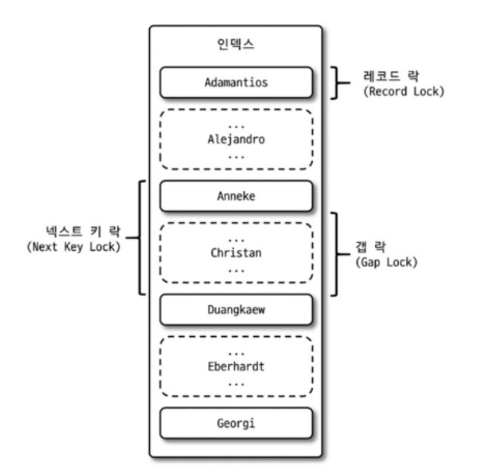
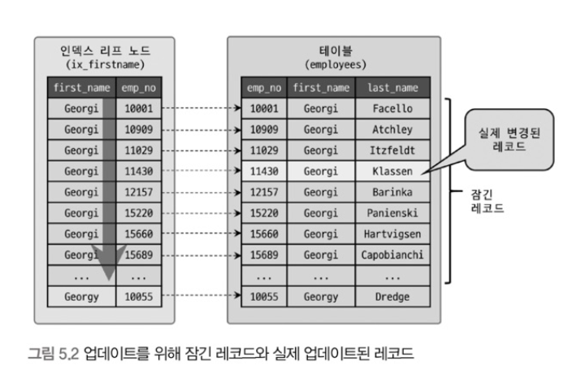
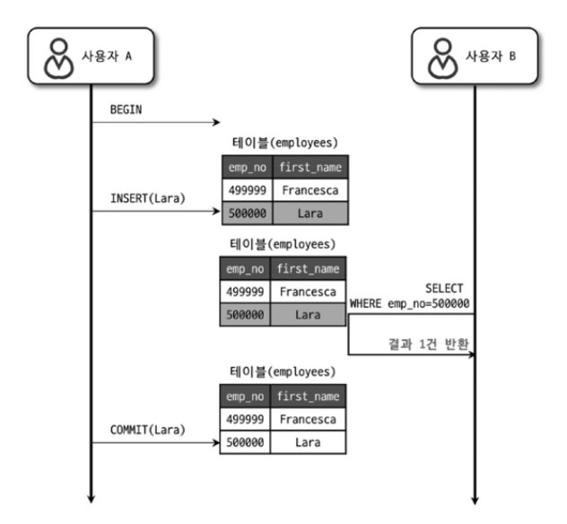
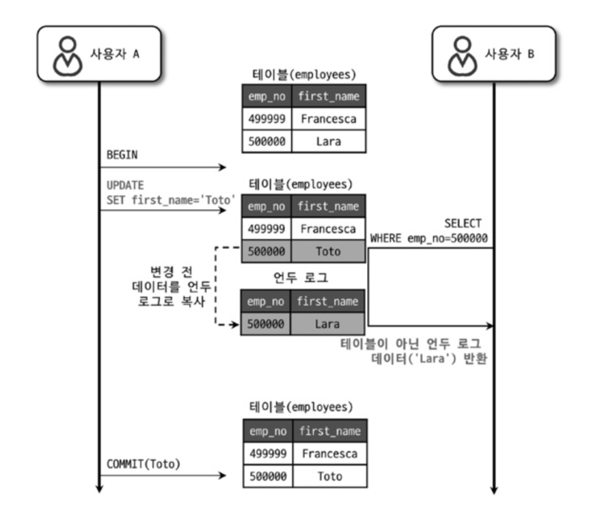
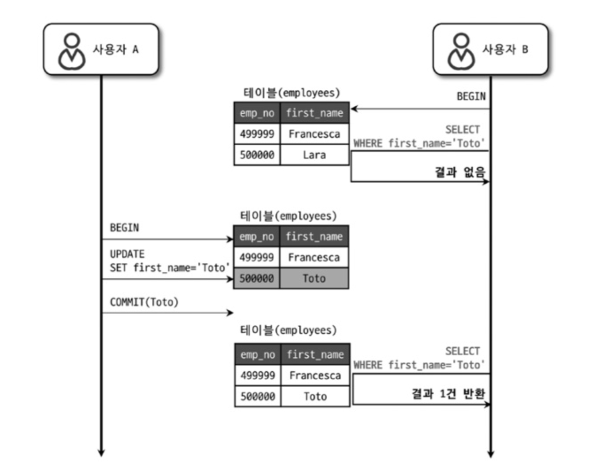
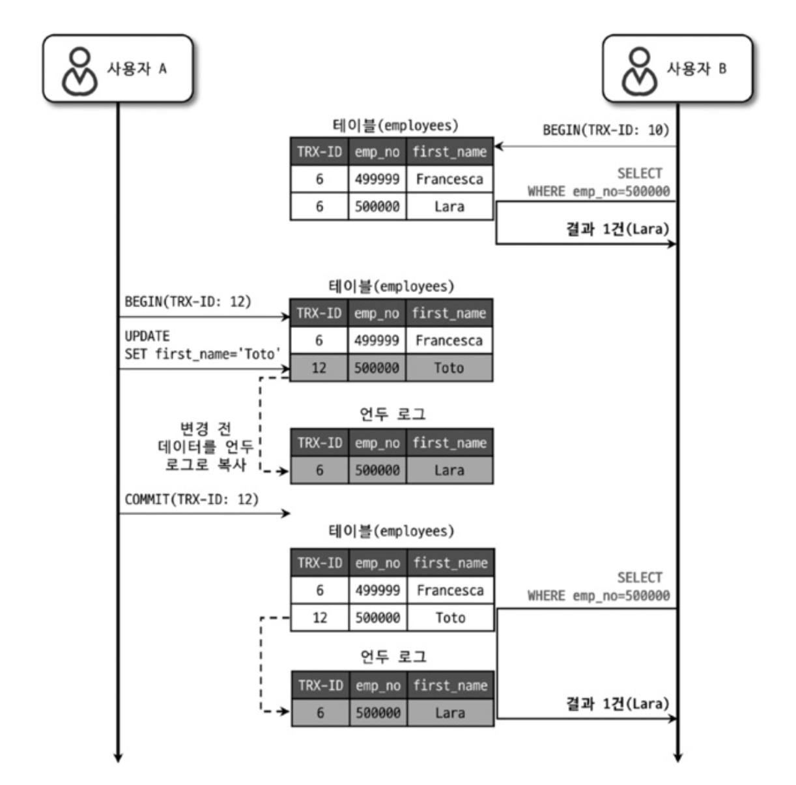
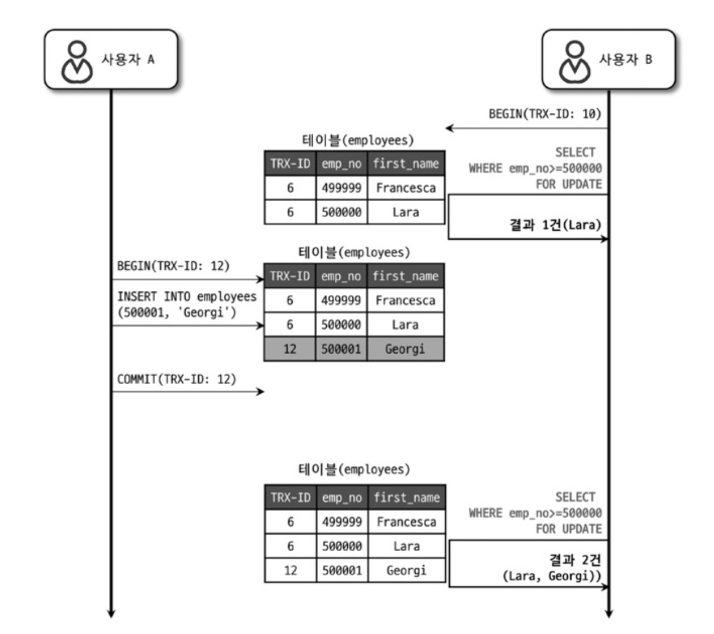
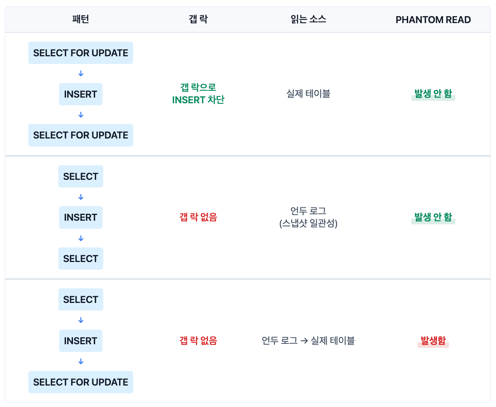

## InnoDB 잠금 종류

InnoDB 스토리지 엔진은 **레코드 기반 잠금 기능**을 제공합니다.

> **락 에스컬레이션이란?**
>
> \
> 일부 DBMS에서는 잠금 개수가 많아지면 메모리 부족을 방지하기 위해 여러 개의 레코드 락을 페이지 락이나 테이블 락으로 자동 업그레이드합니다.
>
> \
> 예: 1000개 레코드 락 → 1개 테이블 락으로 변환
>
> \
> **InnoDB는 잠금 정보를 매우 작은 공간으로 관리하므로 락 에스컬레이션이 발생하지 않습니다.**

일반 상용 DBMS와는 다르게 InnoDB에서는 다음과 같은 잠금 종류를 제공합니다.



### 레코드 락

레코드 자체만을 잠그는 것을 **레코드 락**(Record Lock, Record Only Lock)이라고 합니다. 다른 상용 DBMS의 레코드 락과 동일한 역할을 하지만, 중요한 차이점이 있습니다.

**InnoDB는 레코드 자체가 아니라 인덱스의 레코드를 잠급니다.**

- 인덱스가 하나도 없는 테이블이라도 내부적으로 자동 생성된 **클러스터 인덱스**를 이용해 잠금을 설정합니다.
- 레코드 자체를 잠그느냐, 인덱스를 잠그느냐는 상당히 크고 중요한 차이를 만들어냅니다.

**인덱스 종류에 따른 잠금 범위**

```sql
-- 1. 유니크 인덱스로 조회 (특정 레코드 1건만 존재)
UPDATE users SET name = '홍길동' WHERE id = 100;
-- 잠금: id=100 레코드만 잠금 (갭 락 없음)
-- 이유: 유니크이므로 id=100은 딱 1건만 존재, 중간에 끼어들 수 없음

-- 2. 일반 인덱스로 조회 (같은 값의 레코드가 여러 개 가능)
UPDATE users SET name = '홍길동' WHERE age = 30;
-- 잠금: age=30인 레코드들 + 그 사이사이 갭까지 잠금 (넥스트 키 락)
-- 이유: age=30인 레코드 사이에 새로운 age=30 레코드가 INSERT될 수 있음
```

**왜 차이가 나는가?**

- **유니크 인덱스**: 해당 값이 딱 1건만 존재 → 중간에 끼어들 여지가 없음 → 갭 락 불필요
- **일반 인덱스**: 같은 값이 여러 개 → 그 사이에 새로운 레코드 INSERT 가능 → 갭 락 필요

### 갭 락

**갭 락**(Gap Lock)은 레코드 자체가 아니라 **레코드와 바로 인접한 레코드 사이의 간격만을 잠급니다.**

갭 락의 역할은 레코드와 레코드 사이의 간격에 새로운 레코드가 생성(INSERT)되는 것을 제어하는 것입니다. 

갭 락 그 자체보다는 다음에 설명할 **넥스트 키 락의 일부로 자주 사용**됩니다.

### 넥스트 키 락

**레코드 락 + 갭 락 = 넥스트 키 락**(Next Key Lock)

**왜 필요한가?**

MySQL의 복제(Replication) 환경에서 Master와 Replica 서버의 데이터 일관성을 보장하기 위해 필요합니다.

```sql
-- Master 서버
START TRANSACTION;
DELETE FROM orders WHERE price >= 10000;  -- 현재 10건 삭제

-- 만약 갭 락이 없다면?
-- 다른 트랜잭션에서 INSERT INTO orders VALUES (11, 15000); 실행 가능

COMMIT;

-- 바이너리 로그에 기록됨: "DELETE FROM orders WHERE price >= 10000"
```

**문제 상황**

- **갭 락이 없으면**: DELETE 실행 중에 price=15000인 새 주문이 INSERT될 수 있음
- **Replica 서버에서 재생 시**: 이 INSERT가 없는 상태에서 DELETE 실행
- **결과**: Master는 11건 삭제, Replica는 10건 삭제 → **데이터 불일치**

**넥스트 키 락으로 해결**

- DELETE 실행 시 price >= 10000 범위의 레코드 + 갭까지 모두 잠금
- 그 사이에 INSERT 불가능
- Master와 Replica의 결과가 동일하게 보장됨

> **바이너리 로그 포맷 차이**
>
> \
> **STATEMENT 포맷**: SQL 문장 자체를 기록
> ```sql
> -- Master에서 실행
> DELETE FROM orders WHERE price >= 10000;
>
> -- 바이너리 로그에 기록
> "DELETE FROM orders WHERE price >= 10000"
>
> -- Replica에서 이 SQL을 그대로 재실행
> -- 문제: Replica 실행 시점에 Master와 데이터가 다를 수 있음
> -- 해결: 넥스트 키 락으로 INSERT 차단 필요
> ```
> **ROW 포맷**: 변경된 행의 실제 데이터를 기록
>
> 
> ```sql
> -- Master에서 실행
> DELETE FROM orders WHERE price >= 10000;
>
> -- 바이너리 로그에 기록
> "id=5, price=10000 삭제"
> "id=7, price=12000 삭제"
> "id=9, price=15000 삭제"
>
> -- Replica에서 정확히 이 행들만 삭제
> -- 중간에 INSERT가 있어도 상관없음 (삭제할 행이 명확히 지정됨)
> -- 해결: 넥스트 키 락 불필요
> ```
> ROW 포맷은 삭제할 행을 명확히 지정하므로 갭 락이 불필요하여 성능이 향상됩니다.

### 자동 증가 락

**AUTO_INCREMENT 락이란?**

**AUTO_INCREMENT 컬럼**

JPA의 `@GeneratedValue(strategy = GenerationType.IDENTITY)`을 사용할 때, 여러 커넥션에서 동시에 INSERT해도 ID 값이 중복되지 않도록 보장하는 테이블 수준의 잠금입니다.

```sql
-- 테이블 정의
CREATE TABLE users (
    id BIGINT AUTO_INCREMENT PRIMARY KEY,  -- JPA @GeneratedValue(IDENTITY)
    name VARCHAR(50)
);

-- 동시에 두 INSERT 실행
-- Connection 1
INSERT INTO users (name) VALUES ('홍길동');  -- id=1 할당

-- Connection 2
INSERT INTO users (name) VALUES ('김철수');  -- id=2 할당 (중복 없이)
```

**특징**

- INSERT/REPLACE에서만 사용 (UPDATE/DELETE는 무관)
- ID 값을 가져오는 순간만 잠금 후 즉시 해제
- 트랜잭션과 무관하게 작동

**락 방식의 차이**

> **AUTO_INCREMENT 락 vs 경량 래치(Mutex)**
>
> \
> **AUTO_INCREMENT 락**: INSERT 문장이 완료될 때까지 락 유지 (느림)
>
> \
> **경량 래치(Mutex)**: ID 값만 가져가면 즉시 해제 (빠름, 뮤텍스라고도 함)

```sql
-- AUTO_INCREMENT 락 사용 시
INSERT INTO users (name) SELECT name FROM temp_users;  -- 1000건
-- 1. 락 획득
-- 2. ID 1~1000 할당
-- 3. 1000건 모두 INSERT 완료
-- 4. 락 해제 ← INSERT가 끝나야 해제 (느림)

-- 경량 래치 사용 시
INSERT INTO users (name) VALUES ('홍길동');
-- 1. 래치 획득
-- 2. ID=5 할당받음
-- 3. 래치 즉시 해제 ← INSERT 완료 전에 해제 (빠름)
-- 4. INSERT 계속 진행
-- → 다른 커넥션이 바로 ID=6 받아갈 수 있음
```

**innodb_autoinc_lock_mode 설정 (MySQL 8.0 기준)**

| 모드 | 잠금 방식 | 성능 | 연속성 |
|------|----------|------|--------|
| **0** | 모든 INSERT에 락 사용 | 느림 | 완벽 보장 |
| **1** | 단순 INSERT는 래치, 대량은 락 | 중간 | 한 문장만 |
| **2** (기본값) | 모든 INSERT에 래치만 | 빠름 | 보장 안 됨 |

**각 모드별 동작 예시**

```sql
-- 모드 1: 단순 INSERT (건수 예측 가능)
INSERT INTO users (name) VALUES ('홍길동');  -- 경량 래치 사용 (빠름)

-- 모드 1: 대량 INSERT (건수 예측 불가)
INSERT INTO users (name) SELECT name FROM temp_users;  -- AUTO_INCREMENT 락 사용 (느림)

-- 모드 2: 모든 경우
INSERT INTO users ...  -- 항상 경량 래치 (가장 빠름, 하지만 연속성 보장 안 됨)
```

> **ID 연속성이 보장되지 않는다는 의미**
>
> 
> ```sql
> -- Connection 1이 대량 INSERT 시작
> INSERT INTO users SELECT * FROM temp_users;  -- 1000건
>
> -- 모드 1 (연속성 보장):
> -- 1. Connection 1이 AUTO_INCREMENT 락 획득
> -- 2. id=1~1000 모두 할당받음
> -- 3. 1000건 INSERT 완료
> -- 4. 락 해제
> -- → Connection 1이 끝날 때까지 다른 커넥션은 대기
> -- → 결과: Connection 1은 id=1~1000을 연속으로 받음
>
> -- 모드 2 (연속성 보장 안 됨):
> -- 1. Connection 1: id=1 받음 → 래치 즉시 해제
> -- 2. Connection 1: id=2 받음 → 래치 즉시 해제
> -- 3. Connection 2: id=3 받음 → 래치 즉시 해제 (끼어듦!)
> -- 4. Connection 1: id=4 받음 → 래치 즉시 해제
> -- 5. Connection 2: id=5 받음 → 래치 즉시 해제 (또 끼어듦!)
> -- 6. Connection 1: id=6 받음...
> -- → Connection 1은 id=1,2,4,6,7... (중간이 빠짐)
> -- → Connection 2는 id=3,5,8,10... (끼어든 것들)
> ```
>
> \
> **핵심**: 모드 2에서는 대량 INSERT 중간에 다른 커넥션이 끼어들어 ID를 가져갈 수 있어서, 한 INSERT 문장이 연속된 ID를 받지 못합니다.
>
> \
> **MySQL 8.0 기본값이 2인 이유**
>
> \
> ROW 포맷은 실제 데이터를 기록하므로 ("id=1 삭제", "id=3 삭제") ID 순서가 뒤섞여도 복제에 문제가 없습니다.
>
> \
> **STATEMENT 포맷 사용 시 주의**: 모드 2에서는 Master와 Replica의 AUTO_INCREMENT 값이 달라질 수 있으므로 모드 1로 변경 권장

**왜 INSERT 실패 시 ID가 건너뛰는가?**

AUTO_INCREMENT는 **테이블 전체에서 공유하는 하나의 카운터**입니다.

```sql
-- AUTO_INCREMENT 카운터 = 5 (테이블 전체 공유)

-- Connection 1
-- 1. 래치 획득 → 카운터에서 5 받음 → 카운터 6으로 증가 → 래치 해제
-- 2. INSERT 실행 중...

-- Connection 2 (동시에 실행)
-- 1. 래치 획득 → 카운터에서 6 받음 → 카운터 7으로 증가 → 래치 해제
-- 2. INSERT 완료

-- Connection 3
-- 1. 래치 획득 → 카운터에서 7 받음 → 카운터 8으로 증가 → 래치 해제
-- 2. INSERT 완료

-- Connection 1
-- 3. INSERT 실패! (중복 이메일)
-- 4. 카운터를 5로 되돌리려면?
--    → 이미 카운터는 8
--    → 다른 커넥션이 6, 7 사용 중
--    → 되돌리면 6, 7과 충돌! (매우 복잡)
```

그래서 **실패해도 카운터는 되돌리지 않고**, id=5는 영구 건너뛴 채로 단순하게 처리합니다.

## 인덱스와 잠금

InnoDB의 잠금과 인덱스는 상당히 중요한 연관 관계가 있습니다. **InnoDB의 잠금은 레코드를 잠그는 것이 아니라 인덱스를 잠그는 방식으로 처리됩니다.**

즉, **변경해야 할 레코드를 찾기 위해 검색한 인덱스의 레코드를 모두 락을 걸어야 합니다.**

### 예제: 인덱스와 잠금 범위

employees 테이블에 다음과 같은 인덱스가 있다고 가정하겠습니다.

```sql
-- ix_firstname 인덱스 구성
KEY ix_firstname (first_name)
```

**데이터 분포**

```sql
-- first_name='Georgi'인 사원: 253명
mysql> SELECT COUNT(*) FROM employees WHERE first_name='Georgi';
+----------+
|      253 |
+----------+

-- first_name='Georgi'이고 last_name='Klassen'인 사원: 1명
mysql> SELECT COUNT(*) FROM employees WHERE first_name='Georgi' AND last_name='Klassen';
+----------+
|        1 |
+----------+
```

**UPDATE 쿼리 실행**

```sql
mysql> UPDATE employees
SET hire_date=NOW()
WHERE first_name='Georgi' AND last_name='Klassen';
```

**결과 분석**

- 실제로 업데이트되는 레코드: 1건
- 실제로 잠금이 걸리는 레코드: 253건

**왜 253건이 잠기는가?**

1. 인덱스를 이용할 수 있는 조건은 `first_name='Georgi'`
2. `last_name` 컬럼은 인덱스에 없음
3. 따라서 `first_name='Georgi'`인 레코드 253건을 모두 검색하면서 잠금
4. 각 레코드에서 `last_name='Klassen'` 조건을 추가로 필터링



**인덱스가 하나도 없다면?**

```sql
-- 사용자가 생성한 인덱스가 없어도 InnoDB는 자동으로 클러스터 인덱스를 생성
CREATE TABLE test (
    id INT,           -- PRIMARY KEY 없음
    name VARCHAR(50)
);

UPDATE test SET name = '홍길동' WHERE name = '김철수';

-- 동작:
-- 1. 클러스터 인덱스(내부적으로 자동 생성)로 풀 스캔
-- 2. 모든 레코드를 검색하면서 잠금
-- 3. name='김철수' 조건에 맞는 레코드만 UPDATE
-- 4. 결과: 30만 건 모두 잠금 (1건만 UPDATE해도!)
```

> **클러스터 인덱스 자동 생성 규칙**
>
> 
> 1. PRIMARY KEY가 있으면 그것을 클러스터 인덱스로 사용
> 2. PRIMARY KEY가 없으면 첫 번째 UNIQUE NOT NULL 인덱스를 사용
> 3. 둘 다 없으면 InnoDB가 숨겨진 6바이트 Row ID를 자동 생성하여 클러스터 인덱스로 사용
>
> 
> **문제**: 자동 생성된 Row ID 클러스터 인덱스는 WHERE 조건에 사용할 수 없어서, 결국 풀 스캔하며 모든 레코드에 잠금을 걸게 됩니다.

> **인덱스 설계의 중요성**
>
> \
> UPDATE 문장을 위해 적절한 인덱스가 준비되어 있지 않다면 클라이언트 간의 동시성이 상당히 떨어집니다.
>
> \
> 한 세션에서 UPDATE 작업을 하는 중에는 다른 클라이언트는 그 테이블을 업데이트하지 못하고 기다려야 하는 상황이 발생합니다.

## 레코드 수준의 잠금 확인 및 해제

InnoDB 스토리지 엔진을 사용하는 테이블의 레코드 수준 잠금은 테이블 수준 잠금보다 조금 더 복잡합니다.

- **테이블 잠금**: 잠금의 대상이 테이블 자체라 쉽게 문제의 원인을 발견하고 해결 가능
- **레코드 잠금**: 각각의 레코드에 잠금이 걸리므로 자주 사용되지 않으면 오랜 시간 잠겨 있어도 잘 발견되지 않음

**MySQL 버전별 잠금 조회 방법**

- **MySQL 5.1 이전**: 레코드 잠금에 대한 메타 정보(딕셔너리 테이블)를 제공하지 않아 어려움
- **MySQL 5.1 ~ 7.x**: `information_schema`의 `INNODB_TRX`, `INNODB_LOCKS`, `INNODB_LOCK_WAITS` 테이블로 확인
- **MySQL 8.0 이상**: `performance_schema`의 `data_locks`와 `data_lock_waits` 테이블로 대체

강제 해제는 `KILL` 명령어로 프로세스를 종료하면 됩니다.

### 잠금 시나리오 예제

| 커넥션 1 | 커넥션 2 | 커넥션 3 |
|:---|:---|:---|
| `BEGIN;` | | |
| `UPDATE employees SET birth_date=NOW() WHERE emp_no=100001;` | | |
| | `UPDATE employees SET hire_date=NOW() WHERE emp_no=100001;` | |
| | | `UPDATE employees SET hire_date=NOW(), birth_date=NOW() WHERE emp_no=100001;` |

### 프로세스 목록 확인

```sql
mysql> SHOW PROCESSLIST;
```

```
+----+------+-----------+-------+---------+------+----------+------------------------------------------------------------------+
| Id | User | Host      | db    | Command | Time | State    | Info                                                             |
+----+------+-----------+-------+---------+------+----------+------------------------------------------------------------------+
| 17 | root | localhost | testdb| Sleep   | 607  |          | NULL                                                             |
| 18 | root | localhost | testdb| Query   | 22   | updating | UPDATE employees SET hire_date=NOW() WHERE emp_no=100001         |
| 19 | root | localhost | testdb| Query   | 21   | updating | UPDATE employees SET hire_date=NOW(), birth_date=NOW() WHERE ... |
+----+------+-----------+-------+---------+------+----------+------------------------------------------------------------------+
```

**결과 해석**

- **17번 스레드**: `Sleep` 상태, 607초 동안 유휴 상태
  - 트랜잭션을 시작(`BEGIN`)하고 UPDATE 후 커밋하지 않은 상태
  - 현재 실행 중인 쿼리가 없어서 `NULL`로 표시
  - **이 스레드가 잠금을 보유하고 있어서 다른 스레드들이 대기 중**

- **18번 스레드**: `updating` 상태, 22초 동안 대기
  - 17번 스레드가 잠근 레코드를 UPDATE하려고 시도
  - 잠금을 획득하지 못해 대기 중

- **19번 스레드**: `updating` 상태, 21초 동안 대기
  - 17번과 18번 스레드가 잠근 레코드를 UPDATE하려고 시도
  - 두 스레드 모두 완료될 때까지 대기 중

### 잠금 대기 순서 확인

`performance_schema`의 `data_locks` 테이블과 `data_lock_waits` 테이블을 조인하여 잠금 대기 순서를 확인합니다.

```sql
mysql> SELECT
    r.trx_id waiting_trx_id,
    r.trx_mysql_thread_id waiting_thread,
    r.trx_query waiting_query,
    b.trx_id blocking_trx_id,
    b.trx_mysql_thread_id blocking_thread,
    b.trx_query blocking_query
FROM performance_schema.data_lock_waits w
INNER JOIN information_schema.innodb_trx b
    ON b.trx_id = w.blocking_engine_transaction_id
INNER JOIN information_schema.innodb_trx r
    ON r.trx_id = w.requesting_engine_transaction_id;
```

```
+-------------+----------------+------------------+----------------+------------------+----------------+
| waiting_trx | waiting_thread | waiting_query    | blocking_trx   | blocking_thread  | blocking_query |
| _id         |                |                  | _id            |                  |                |
+-------------+----------------+------------------+----------------+------------------+----------------+
| 11990       | 19             | UPDATE employees | 11984          | 17               | NULL           |
| 11990       | 19             | UPDATE employees | 11984          | 17               | NULL           |
| 11989       | 18             | UPDATE employees | 11984          | 17               | NULL           |
+-------------+----------------+------------------+----------------+------------------+----------------+
```

**결과 분석**

- 18번 스레드는 17번 스레드를 기다리고 있음
- 19번 스레드는 17번 스레드와 18번 스레드를 기다리고 있음

**잠금 대기 큐**

1. 17번 스레드가 잠금을 해제
2. 18번 스레드가 잠금을 획득하고 UPDATE 완료 후 잠금 해제
3. 19번 스레드가 UPDATE 실행 가능

### 상세 잠금 정보 확인

17번 스레드가 어떤 잠금을 가지고 있는지 더 상세히 확인하려면 `performance_schema`의 `data_locks` 테이블을 조회합니다.

```sql
mysql> SELECT * FROM performance_schema.data_locks\G
```

```
*************************** 1. row ***************************
                  ENGINE: INNODB
                        ...
               LOCK_TYPE: TABLE
               LOCK_MODE: IX
             LOCK_STATUS: GRANTED
               LOCK_DATA: NULL
*************************** 2. row ***************************
                  ENGINE: INNODB
                        ...
               LOCK_TYPE: RECORD
               LOCK_MODE: X,REC_NOT_GAP
             LOCK_STATUS: GRANTED
               LOCK_DATA: 100001
```

**결과 해석**

17번 스레드가 **2개의 락을 동시에 보유**하고 있습니다:

**1행**: 테이블에 IX 잠금 (의도 표시)
- `LOCK_TYPE: TABLE`
- `LOCK_MODE: IX` (Intention Exclusive)
- 역할: "이 테이블에 레코드 락을 걸 예정"이라고 선언

**2행**: 실제 레코드에 쓰기 잠금
- `LOCK_TYPE: RECORD`
- `LOCK_MODE: X,REC_NOT_GAP`
- 역할: `emp_no=100001` 레코드를 실제로 잠금

> **IX 잠금의 역할**
>
> 
> InnoDB는 레코드 락을 걸 때 **항상 2단계**로 진행합니다:
>
> 
> 1. **먼저** 테이블에 IX 락을 걸어서 의도를 표시
> 2. **그 다음** 실제 레코드에 레코드 락을 걸음
>
> 
> IX 락은 실제 데이터 접근을 막지 않고, `LOCK TABLES` 같은 테이블 전체 락과의 충돌만 방지합니다.

**다른 레코드는 동시에 접근 가능한가?**

**인덱스가 있는 경우**
```sql
-- Connection 1
BEGIN;
UPDATE employees SET salary = 5000 WHERE emp_no = 100001;
-- IX 락 + emp_no=100001 레코드 락만

-- Connection 2 (다른 레코드)
UPDATE employees SET salary = 6000 WHERE emp_no = 100002;
-- 성공! 동시 실행 가능

-- Connection 3 (같은 레코드)
UPDATE employees SET salary = 7000 WHERE emp_no = 100001;
-- 대기! emp_no=100001은 Connection 1이 보유 중
```

**인덱스가 없는 경우**
```sql
CREATE TABLE test (
    id INT,           -- PRIMARY KEY 없음
    name VARCHAR(50)
);

-- Connection 1
BEGIN;
UPDATE test SET salary = 5000 WHERE name = '홍길동';
-- IX 락 + 전체 레코드 락 (30만 건)

-- Connection 2 (다른 조건)
UPDATE test SET salary = 6000 WHERE name = '김철수';
-- 대기! '김철수' 레코드도 이미 Connection 1이 잠금

-- Connection 3 (전혀 다른 조건)
UPDATE test SET age = 30 WHERE name = '박영희';
-- 대기! '박영희' 레코드도 이미 Connection 1이 잠금
```

**핵심**: IX 락끼리는 충돌하지 않습니다. 실제 충돌은 **레코드 락 레벨**에서 발생합니다. 하지만 인덱스가 없으면 전체 레코드를 잠그므로 WHERE 조건이 달라도 모두 대기하게 됩니다.

### 잠금 강제 해제

17번 스레드가 잠금을 가진 상태에서 상당히 오래 시간 멈춰 있다면 다음과 같이 강제 종료하여 나머지 UPDATE 명령들이 실행되도록 할 수 있습니다.

```sql
mysql> KILL 17;
```

## MySQL의 격리 수준

### 격리 수준이란?

**트랜잭션의 격리 수준**(Isolation Level)이란 여러 트랜잭션이 동시에 처리될 때 특정 트랜잭션이 다른 트랜잭션에서 변경하거나 조회하는 데이터를 볼 수 있게 허용할지 말지를 결정하는 것입니다.

### 4가지 격리 수준

1. **READ UNCOMMITTED**
2. **READ COMMITTED**
3. **REPEATABLE READ**
4. **SERIALIZABLE**

**특징**

- 격리 수준이 높아질수록 트랜잭션 간의 데이터 격리(고립) 정도가 높아집니다.
- **격리 수준이 높아질수록 동시 처리 성능은 떨어지는 것이 일반적입니다.**
- **SERIALIZABLE** 격리 수준이 아니라면 크게 성능의 개선이나 저하는 발생하지 않습니다.

### 격리 수준별 부정합 문제

데이터베이스의 격리 수준을 이야기하면 항상 함께 언급되는 **세 가지 부정합 문제**가 있습니다.

|                    | DIRTY READ | NON-REPEATABLE READ | PHANTOM READ |
|--------------------|-----------|---------------------|--------------|
| READ UNCOMMITTED   | 발생      | 발생                | 발생         |
| READ COMMITTED     | 없음      | 발생                | 발생         |
| REPEATABLE READ    | 없음      | 없음                | 발생(InnoDB는 없음) |
| SERIALIZABLE       | 없음      | 없음                | 없음         |

> **InnoDB의 특별한 점**
>
> \
> SQL-92 또는 SQL-99 표준에 따르면 REPEATABLE READ 격리 수준에서는 PHANTOM READ가 발생할 수 있지만, **InnoDB에서는 독특한 특성 때문에 REPEATABLE READ 격리 수준에서도 PHANTOM READ가 발생하지 않습니다.**

**부정합 문제 상세 설명**

- **DIRTY READ**: 커밋되지 않은 데이터를 읽는 문제
- **NON-REPEATABLE READ**: 하나의 트랜잭션에서 같은 쿼리를 두 번 실행했을 때 결과가 다른 문제
- **PHANTOM READ**: 같은 쿼리를 두 번 실행했을 때 없던 레코드가 나타나는 문제

각 부정합 문제에 대한 상세한 내용은 각 격리 수준별 설명에서 다루겠습니다.

> **테스트 환경 설정**
>
> 여기서 설명하는 SQL 예제는 모두 **AUTOCOMMIT이 OFF인 상태**에서만 테스트할 수 있습니다.
>
> ```sql
> SET autocommit=OFF;
> ```
>
> **왜 자동 커밋이 false여야 할까?**
>
> \
> AUTO-COMMIT을 자동으로 해놓으면 각 SQL 문이 바로 커밋됩니다.
>
> \
> SELECT, UPDATE, INSERT, DELETE 등 모든 명령이 자체적으로 트랜잭션을 시작하고 끝내기 때문에 트랜잭션은 Rollback이 불가능합니다.
> 
### READ UNCOMMITTED

READ UNCOMMITTED 격리 수준에서는 각 트랜잭션에서의 변경 내용이 **COMMIT이나 ROLLBACK 여부와 상관없이 다른 트랜잭션에서 보입니다.**



**시나리오**

1. 사용자 A가 `emp_no=500000`, `first_name="Lara"`인 새로운 사원을 INSERT
2. 사용자 A가 커밋하기 전에 사용자 B가 `emp_no=500000`인 사원을 SELECT
3. **사용자 B는 커밋되지 않은 상태에서도 사원 정보를 조회할 수 있음**
4. 사용자 A가 알 수 없는 문제로 INSERT를 ROLLBACK
5. 사용자 B는 여전히 "Lara"가 정상적인 사원이라고 생각하고 계속 처리

**DIRTY READ란?**

어떤 트랜잭션에서 처리한 작업이 완료되지 않았는데도 다른 트랜잭션에서 볼 수 있는 현상을 **더티 리드**(Dirty Read)라고 합니다.

**문제점**

- 데이터가 나타났다가 사라졌다 하는 현상 발생
- 애플리케이션 개발자와 사용자를 상당히 혼란스럽게 만듦
- RDBMS 표준에서는 트랜잭션의 격리 수준으로 인정하지 않을 정도로 정합성에 문제가 많음

> **권장사항**
>
> \
> MySQL을 사용한다면 최소한 **READ COMMITTED 이상의 격리 수준**을 사용할 것을 권장합니다.

### READ COMMITTED

**READ COMMITTED**는 Oracle DBMS에서 기본으로 사용되는 격리 수준이며, 온라인 서비스에서 가장 많이 선택되는 격리 수준입니다.

**특징**

- 더티 리드(Dirty Read) 같은 현상은 발생하지 않음
- **COMMIT이 완료된 데이터만** 다른 트랜잭션에서 조회 가능

#### COMMIT된 데이터만 읽기



**시나리오**

1. 사용자 A가 `emp_no=500000`인 사원의 `first_name`을 "Lara"에서 "Toto"로 변경
   - 새로운 값 "Toto"는 employees 테이블에 즉시 기록
   - 이전 값 "Lara"는 **언두 영역**으로 백업
2. 사용자 A가 커밋을 수행하기 전에 사용자 B가 `emp_no=500000`인 사원을 SELECT
   - 조회된 결과의 `first_name`은 "Toto"가 아니라 **"Lara"**
   - SELECT 쿼리 결과는 employees 테이블이 아니라 **언두 영역에 백업된 레코드**에서 가져옴
3. 사용자 A가 변경된 내용을 커밋
   - 그때부터 다른 트랜잭션에서도 새롭게 변경된 "Toto" 값을 참조 가능

#### NON-REPEATABLE READ 문제

READ COMMITTED 격리 수준에서도 **NON-REPEATABLE READ**라는 부정합 문제가 있습니다.



**시나리오**

1. 사용자 B가 `BEGIN` 명령으로 트랜잭션을 시작
2. 사용자 B가 `first_name="Toto"`인 사용자를 검색 → 결과 없음
3. 사용자 A가 사원 번호 500000인 사원의 이름을 "Toto"로 변경하고 커밋
4. 사용자 B가 똑같은 SELECT 쿼리로 다시 조회 → 결과 1건 조회됨

> **READ COMMITTED의 동작 원리**
> 
> ```sql
> -- 초기 상태: name='Lara'
>
> -- 사용자 A
> UPDATE users SET name = 'Toto' WHERE id = 1;
> -- 실제 테이블: name='Toto' (즉시 변경)
> -- 언두 로그: name='Lara' (백업)
> -- 아직 커밋 안 함
>
> -- 사용자 B (READ COMMITTED)
> SELECT * FROM users WHERE id = 1;
> -- 결과: name='Lara'
> -- 왜? 커밋되지 않은 데이터는 언두 로그에서 변경 전 데이터를 읽음
>
> -- 사용자 A
> COMMIT;  -- 커밋 완료
>
> -- 사용자 B (같은 트랜잭션 내에서)
> SELECT * FROM users WHERE id = 1;
> -- 결과: name='Toto'
> -- 왜? 커밋된 데이터는 실제 테이블에서 읽음
> ```
>
> \
> **READ COMMITTED의 핵심**:
> - **커밋 안 된 데이터**: 언두 로그에서 변경 전 데이터를 읽음
> - **커밋된 데이터**: 실제 테이블에서 변경 후 데이터를 읽음
> - 같은 트랜잭션 내에서도 **매번 커밋 상태를 확인**하므로 결과가 달라집니다.

**문제점**

사용자 B가 하나의 트랜잭션 내에서 똑같은 SELECT 쿼리를 실행했을 때는 항상 같은 결과를 가져와야 한다는 **REPEATABLE READ 정합성에 어긋납니다.**

### REPEATABLE READ

**REPEATABLE READ**는 MySQL의 InnoDB 스토리지 엔진에서 기본으로 사용되는 격리 수준입니다.

**특징**

- 바이너리 로그를 가진 MySQL 서버에서는 최소 REPEATABLE READ 격리 수준 이상을 사용해야 함
- READ COMMITTED 격리 수준에서 발생하는 **NON-REPEATABLE READ** 부정합이 발생하지 않음
- **MVCC**(Multi Version Concurrency Control)를 이용해 동일 트랜잭션 내에서는 동일한 결과를 보장

#### MVCC를 통한 스냅샷 격리

> **MVCC란?**
>
> \
> 레코드가 변경되기 전의 데이터를 언두(Undo) 공간에 백업하여, 동일한 레코드에 여러 버전의 데이터가 존재하도록 하는 방식입니다.
>
> \
> REPEATABLE READ는 MVCC를 활용하여 트랜잭션 시작 시점의 스냅샷을 기준으로 항상 동일한 결과를 보장합니다.

**트랜잭션 번호와 스냅샷 메커니즘**

- 모든 트랜잭션은 **고유한 트랜잭션 번호**(순차적으로 증가)를 가짐
- 언두 영역의 백업 레코드에는 **변경한 트랜잭션의 번호**가 포함됨
- 트랜잭션은 **자신의 번호보다 작은 트랜잭션 번호에서 변경한 데이터만 조회**
- 실행 중인 가장 오래된 트랜잭션 번호보다 앞선 언두 데이터는 삭제 불가능

#### 동작 예시



**시나리오**

1. 사용자 B: 트랜잭션 시작 (트랜잭션 번호: 10)
2. 사용자 A: 트랜잭션 시작 (트랜잭션 번호: 12) → `emp_no=500000`의 이름을 "Lara"에서 "Toto"로 변경 후 커밋
3. 사용자 B: `emp_no=500000` 조회 → 결과는 항상 **"Lara"** (언두 로그에서 조회)

> **주의사항**
>
> \
> 장시간 트랜잭션을 종료하지 않으면 언두 영역이 무한정 커져 **MySQL 서버의 처리 성능이 떨어질 수 있습니다.**

#### PHANTOM READ 문제



#### REPEATABLE READ에서도 PHANTOM READ가 발생하는 경우

> **일반 SELECT만 사용하면 PHANTOM READ가 발생하지 않습니다.**
>
> \
> 일반 SELECT는 트랜잭션 시작 시점의 스냅샷(언두 로그)을 읽기 때문에 중간에 INSERT가 발생해도 영향을 받지 않습니다.
>
> \
> **하지만 SELECT -> INSERT -> SELECT FOR UPDATE 순서면 PHANTOM READ가 발생할 수 있습니다.**



**PHANTOM READ가 발생하는 원리**

```sql
-- Transaction A
SELECT * FROM member WHERE id >= 50;
-- 갭 락 없음, 언두 로그 읽음 → id=50 한 건

-- Transaction B
INSERT INTO member (id, name) VALUES (51, '홍길순');
COMMIT;  -- 갭 락이 없어서 성공

-- Transaction A (같은 트랜잭션)
SELECT * FROM member WHERE id >= 50 FOR UPDATE;
-- 쓰기 잠금 필요 → 실제 테이블 읽음 → id=50, 51 두 건 (PHANTOM READ!)
```

> **왜 SELECT FOR UPDATE는 실제 테이블을 읽어야 하는가?**
>
> \
> **언두 로그에는 잠금을 걸 수 없기 때문입니다.**
>
> \
> 언두 로그는 여러 트랜잭션이 공유하는 읽기 전용 히스토리 공간으로, 과거 버전에 잠금을 걸면 다른 트랜잭션의 스냅샷 읽기를 방해합니다.
>
> \
> 따라서 `SELECT FOR UPDATE`는 쓰기 잠금을 걸어야 하므로 실제 테이블의 현재 레코드를 읽을 수밖에 없습니다.

> **SELECT FOR UPDATE의 잠금 방식**
>
> \
> `SELECT FOR UPDATE`는 **쓰기 잠금(X Lock) + 갭 락**을 모두 획득합니다:
>
> 
> - **레코드 락 (X Lock)**: 조회된 레코드에 쓰기 잠금
> - **갭 락 (Gap Lock)**: 레코드 사이 간격을 잠궈 **INSERT 차단**
>
> 
> 반면 일반 SELECT는 아무 잠금도 걸지 않아 언두 로그에서 스냅샷을 읽고, INSERT도 허용합니다.

> **일반 DBMS는 어떻게 동작하는가?**
>
> \
> 일반 DBMS에서는 갭 락 자체가 없어 `SELECT FOR UPDATE`를 처음부터 사용해도 범위 내 INSERT를 막지 못해 PHANTOM READ가 발생합니다.

### SERIALIZABLE

**SERIALIZABLE**은 가장 엄격한 트랜잭션 격리 수준입니다.

**특징**

- 가장 높은 데이터 일관성 보장
- 트랜잭션들이 마치 **순차적으로**(serial) 실행되는 것처럼 처리
- 여러 트랜잭션이 **동일한 레코드에 동시에 접근하는 일이 차단**됨
- 데이터의 부정합이나 예기치 않은 읽기 문제는 발생하지 않음
- **병렬 실행이 제한**되므로, **동시 처리 성능은 크게 떨어질 수 있음**

#### SERIALIZABLE의 동작 방식

**일반 SELECT조차도 공유 잠금(Shared Lock)을 획득**

- Next-Key Lock을 통해 해당 범위의 삽입, 수정, 삭제를 차단
- 한 트랜잭션에서 읽는 레코드를 다른 트랜잭션에서는 변경 불가능
- PHANTOM READ 완전 방지

> **InnoDB에서는 SERIALIZABLE이 불필요한 이유**
>
> \
> InnoDB 스토리지 엔진에서는 **갭 락**과 **넥스트 키 락** 덕분에 REPEATABLE READ 격리 수준에서도 이미 PHANTOM READ가 발생하지 않기 때문에 굳이 SERIALIZABLE을 사용할 필요성은 없어 보입니다.

**권장사항**

- **안정성이 최우선인 특수한 상황**이 아닌 이상, **일반적인 애플리케이션에서는 이 수준을 사용하지 않는 것이 바람직**합니다.
- 동시성이 중요한 데이터베이스에서는 거의 사용하지 않음
- 성능 저하를 감수하고 최고 수준의 데이터 일관성이 필요한 경우에만 사용
- 트랜잭션 간 충돌과 잠금 경합이 빈번해져 **성능 저하가 크기 때문에**, 일반적인 트랜잭션 처리에서는 신중하게 사용
