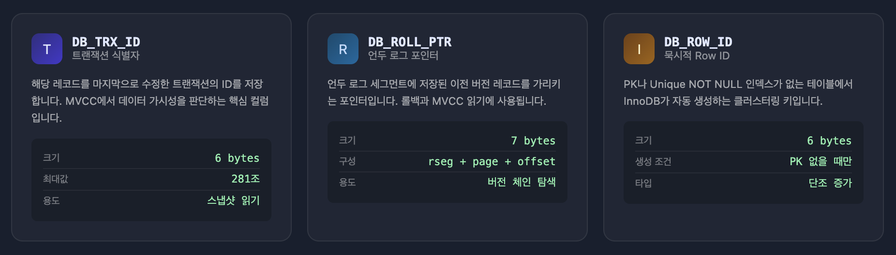
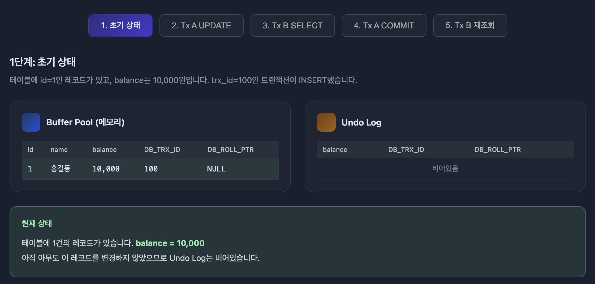
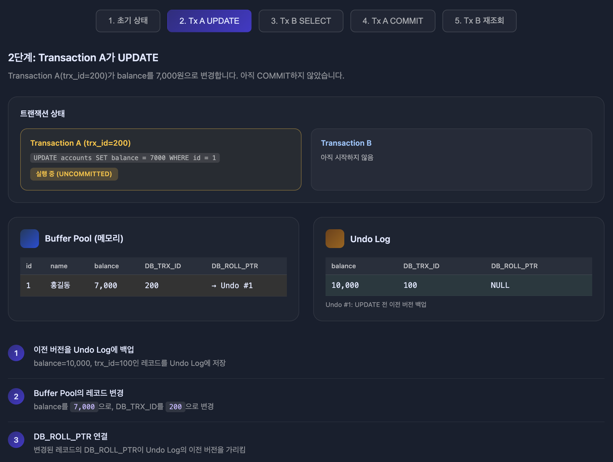
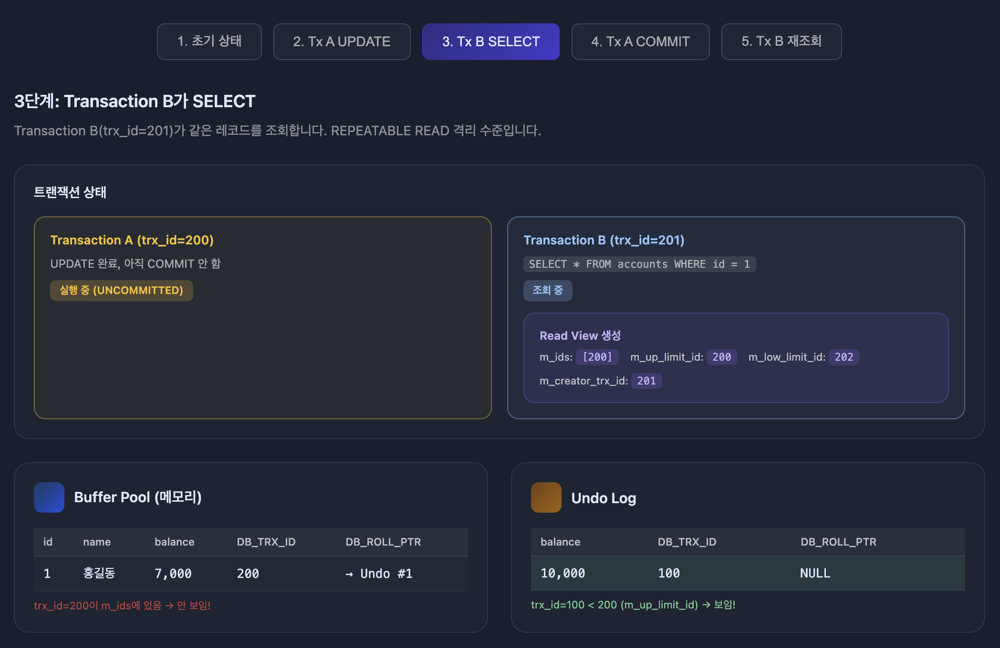
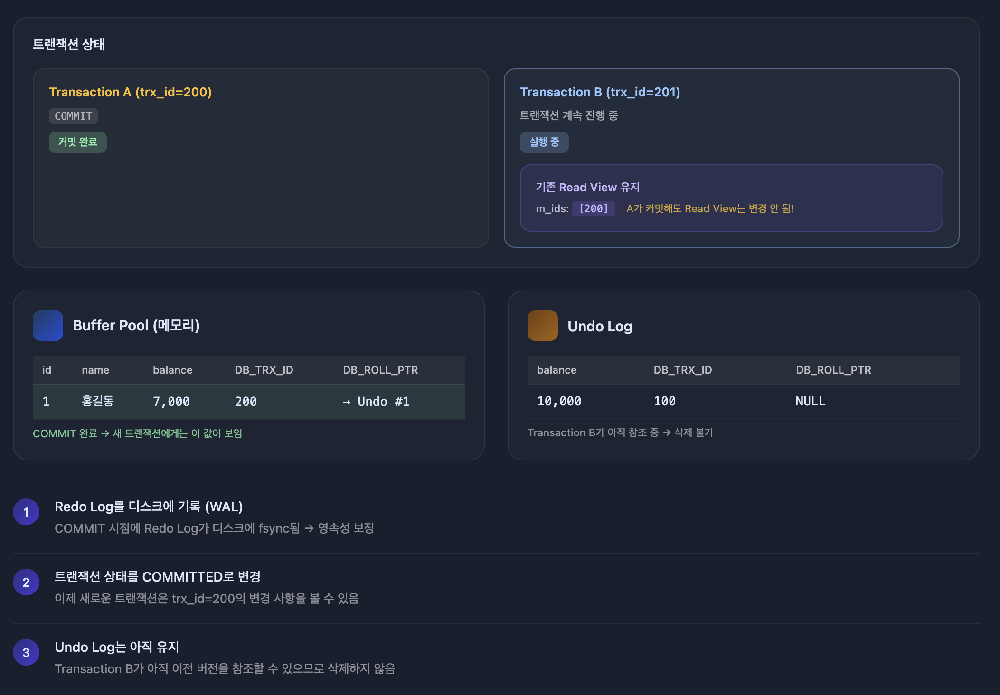
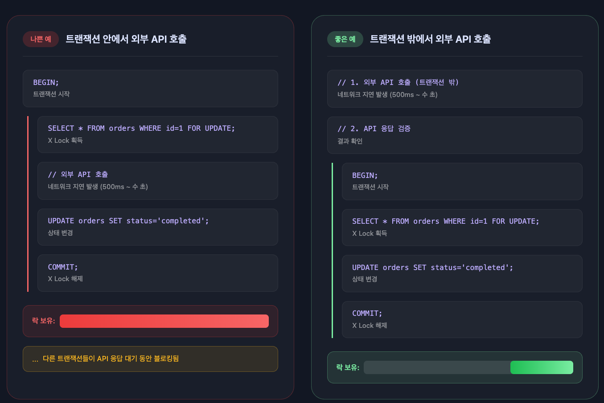

## 동시성 제어와 MVCC

### 동시성 제어란?

**동시성 제어**(Concurrency Control)는 여러 트랜잭션이 동시에 같은 데이터에 접근할 때 **일관성을 유지**하면서 **성능을 최적화**하는 기술입니다.

**왜 필요한가?**

```sql
-- 계좌 잔액: 10,000원

-- Transaction A (출금)
BEGIN;
SELECT balance FROM accounts WHERE id = 1;  -- 10,000원 읽음
UPDATE accounts SET balance = balance - 3000 WHERE id = 1;

-- Transaction B (동시에 출금)
BEGIN;
SELECT balance FROM accounts WHERE id = 1;  -- 10,000원 읽음 (A가 커밋 전)
UPDATE accounts SET balance = balance - 5000 WHERE id = 1;

-- 둘 다 COMMIT하면?
-- 예상: 10,000 - 3,000 - 5,000 = 2,000원
-- 실제: Lost Update 발생 가능 → 5,000원 또는 7,000원
```

동시성 제어가 없으면 **Lost Update**(갱신 분실), **Dirty Read**(더티 리드), **Non-Repeatable Read**(반복 불가능한 읽기) 같은 문제가 발생합니다.

### 낙관적 동시성 제어 vs 비관적 동시성 제어

**비관적 동시성 제어**(Pessimistic Concurrency Control)

- 충돌이 발생할 것이라고 가정
- 데이터를 읽을 때 미리 잠금을 획득
- 다른 트랜잭션은 잠금이 해제될 때까지 대기

```sql
-- 비관적: 먼저 잠그고 작업
SELECT * FROM accounts WHERE id = 1 FOR UPDATE;  -- 잠금 획득
UPDATE accounts SET balance = balance - 3000 WHERE id = 1;
COMMIT;  -- 잠금 해제
```

**낙관적 동시성 제어**(Optimistic Concurrency Control)

- 충돌이 거의 발생하지 않을 것이라고 가정
- 잠금 없이 작업 후, 커밋 시점에 충돌 여부 확인
- 충돌 시 롤백하고 재시도

```sql
-- 낙관적: 잠금 없이 작업 후 버전 확인
SELECT balance, version FROM accounts WHERE id = 1;  -- version=5
UPDATE accounts SET balance = balance - 3000, version = version + 1
WHERE id = 1 AND version = 5;  -- version이 바뀌었으면 0건 업데이트
-- 0건이면 충돌 → 재시도
```

### 공유 락과 배타 락

**공유 락**(Shared Lock, S Lock)

- **읽기 전용** 잠금
- 여러 트랜잭션이 동시에 공유 락을 획득 가능
- 공유 락이 걸린 데이터는 다른 트랜잭션도 읽을 수 있음
- 쓰기는 불가능

```sql
SELECT * FROM accounts WHERE id = 1 LOCK IN SHARE MODE;  -- 공유 락
-- 다른 트랜잭션도 SELECT 가능
-- 다른 트랜잭션의 UPDATE/DELETE는 대기
```

공유 락은 읽는 동안 다른 트랜잭션이 해당 레코드를 수정하지 못하게 할 때 사용합니다.

```sql
-- 재고 확인 후 주문 (다른 트랜잭션이 수정 못하게)
BEGIN;
SELECT stock FROM products WHERE id = 1 FOR SHARE;
-- stock이 충분하면 주문 진행
INSERT INTO orders (product_id, quantity) VALUES (1, 5);
COMMIT;
```

**배타 락**(Exclusive Lock, X Lock)

- **쓰기** 잠금
- UPDATE, DELETE, SELECT FOR UPDATE 시 자동 획득
- 다른 트랜잭션의 Locking read(`FOR UPDATE`, `FOR SHARE`)와 쓰기는 대기
- 일반 `SELECT`는 MVCC로 처리되어 대기 없이 가능 

```sql
SELECT * FROM accounts WHERE id = 1 FOR UPDATE;  -- 배타 락
-- 다른 트랜잭션의 일반 SELECT는 가능 (MVCC)
-- 다른 트랜잭션의 FOR UPDATE, FOR SHARE, UPDATE, DELETE는 대기
```

**동시 락 획득 가능 여부**

두 트랜잭션이 같은 레코드에 동시에 락을 걸 수 있는지 여부입니다.

| | 공유 락(S) | 배타 락(X) |
|---|---|---|
| **공유 락**(S) | 가능 | 대기 |
| **배타 락**(X) | 대기 | 대기 |

### MVCC가 해결하는 것

**MVCC**(Multi-Version Concurrency Control)는 **읽기 작업에서 잠금 없이 일관된 읽기**를 제공합니다.

**MVCC가 없다면?**

```sql
-- Writer
BEGIN;
UPDATE accounts SET balance = 5000 WHERE id = 1;
-- 10초 동안 복잡한 작업 수행...

-- Reader (동시에 실행)
SELECT * FROM accounts WHERE id = 1;
-- Writer가 COMMIT할 때까지 대기해야 함 (10초 대기)
```

**MVCC가 있으면?**

```sql
-- Writer
BEGIN;
UPDATE accounts SET balance = 5000 WHERE id = 1;
-- 10초 동안 복잡한 작업 수행...

-- Reader (동시에 실행)
SELECT * FROM accounts WHERE id = 1;
-- 즉시 이전 버전(Undo Log)을 읽음 → 대기 없음!
```

**핵심 원리**

- 데이터를 변경할 때 **이전 버전을 Undo Log에 보관**
- 읽기 트랜잭션은 **자신의 시작 시점 기준으로 보이는 버전**을 읽음
- **쓰기는 잠금 필요, 읽기는 잠금 불필요**

---

## MySQL의 격리 수준

**격리 수준**(Isolation Level)은 여러 트랜잭션이 동시에 처리될 때, 특정 트랜잭션이 다른 트랜잭션에서 변경하거나 조회하는 데이터를 볼 수 있게 허용할지 여부를 결정하는 것입니다.

격리 수준은 크게 다음과 같이 나뉩니다:

- **READ UNCOMMITTED**
- **READ COMMITTED**
- **REPEATABLE READ**
- **SERIALIZABLE**

순서대로 격리 수준이 높아지며, **SERIALIZABLE** 격리 수준이 가장 엄격합니다.

격리 수준이 높아질수록 MySQL 서버의 처리 성능이 많이 떨어질 것으로 생각할 수 있지만, **SERIALIZABLE 격리 수준이 아니라면 크게 성능 저하가 발생하지 않습니다.**

### 격리 수준에 따른 부정합 문제

아래 표에서 **PHANTOM READ**의 경우 **REPEATABLE READ** 격리 수준에서도 발생할 수 있지만, 

InnoDB에서는 MVCC 덕분에 일반 SELECT에서 Phantom Read가 발생하지 않습니다. 특별한 경우에서의 Phantom Read 방지는 아래에서 소개합니다.

일반적으로는 온라인 서비스 용도의 데이터베이스는 **READ COMMITTED**와 **REPEATABLE READ** 격리 수준 중 하나를 사용합니다.

| 격리 수준 | DIRTY READ | NON-REPEATABLE READ | PHANTOM READ |
|---|:---:|:---:|:---:|
| READ UNCOMMITTED | O | O | O |
| READ COMMITTED | X | O | O |
| REPEATABLE READ | X | X | O (InnoDB는 X) |
| SERIALIZABLE | X | X | X |

### READ UNCOMMITTED

**READ UNCOMMITTED** 격리 수준에서는 각 트랜잭션에서의 변경 내용이 `COMMIT`이나 `ROLLBACK` 여부에 상관없이 다른 트랜잭션에서 보입니다.


**문제 시나리오**

1. 사용자 A가 `emp_no=500000`이고 `first_name='Lara'`인 새로운 사원을 `INSERT`
2. 사용자 B가 `emp_no=500000`인 사원을 검색
3. 사용자 A가 아직 커밋하지 않았지만, 사용자 B는 해당 사원을 조회할 수 있음
4. 사용자 A가 알 수 없는 문제로 `INSERT`를 `ROLLBACK`하면, 사용자 B가 조회한 데이터는 무효화됨

이처럼 어떤 트랜잭션에서 처리한 작업이 완료되지 않았는데도 다른 트랜잭션에서 볼 수 있는 현상을 **더티 리드**(Dirty Read)라고 합니다.

더티 리드를 유발하는 **READ UNCOMMITTED**는 RDBMS 표준에서는 트랜잭션의 격리 수준으로 인정하지 않을 정도로 정합성에 문제가 많은 격리 수준입니다.

### READ COMMITTED

**READ COMMITTED** 격리 수준에서는 **커밋된 데이터만 다른 트랜잭션에서 조회**할 수 있기 때문에 더티 리드 현상이 발생하지 않습니다.


**동작 방식**

1. 사용자 A가 `emp_no=500000`인 사원의 `first_name`을 'Lara'에서 'Toto'로 변경
2. 새 값인 'Toto'는 테이블에 즉시 기록됨
3. 이전 값인 'Lara'는 **Undo Log**로 백업됨
4. 사용자 A가 커밋하기 전에 사용자 B가 조회하면 **Undo Log에서 백업된 Lara**를 읽음

**NON-REPEATABLE READ 문제**


**문제 시나리오**

1. 사용자 B가 `BEGIN`으로 트랜잭션 시작
2. 사용자 B가 `first_name='Toto'` 조회 → 결과 없음
3. 사용자 A가 'Lara'를 'Toto'로 변경 후 `COMMIT`
4. 사용자 B가 같은 조건으로 다시 조회 → 'Toto' 1건 조회됨

사용자 B의 입장에서 **같은 트랜잭션 내에서 같은 쿼리를 실행했는데 결과가 다릅니다.** 이것이 **NON-REPEATABLE READ**입니다.

일반적인 웹 애플리케이션에서는 크게 문제가 되지 않을 수 있지만, **하나의 트랜잭션에서 동일 데이터를 여러 번 읽고 변경하는 작업이 금전적인 처리와 연결되면** 문제가 될 수 있습니다.

예를 들어, 다른 트랜잭션에서 입금과 출금 처리가 계속 진행될 때 오늘 입금된 금액의 총합을 조회하는 상황에서, **트랜잭션 내에서 실행되는 SELECT 쿼리가 실행될 때마다 다른 결과를 가져오면** 문제가 됩니다.

### REPEATABLE READ

**REPEATABLE READ**는 MySQL InnoDB 스토리지 엔진에서 기본으로 사용되는 격리 수준입니다.

이 격리 수준에서는 **NON-REPEATABLE READ** 부정합이 발생하지 않습니다. InnoDB 스토리지 엔진은 트랜잭션이 `ROLLBACK`될 가능성에 대비해 변경되기 전 레코드를 **Undo 공간에 백업**해두고 실제 레코드 값을 변경합니다.

**READ COMMITTED와의 차이**

- **READ COMMITTED**: 항상 최신 커밋된 데이터를 읽음
- **REPEATABLE READ**: **트랜잭션 번호를 기준**으로 자신보다 먼저 시작된 트랜잭션에서 커밋된 데이터만 읽음

모든 InnoDB 트랜잭션은 고유한 **트랜잭션 번호**(순차 증가 값)를 가지며, Undo 영역에 백업된 모든 레코드에는 변경을 발생시킨 **트랜잭션 번호가 포함**되어 있습니다.

**동작 예시**


1. 사용자 B의 트랜잭션 번호는 10번
2. 사용자 A의 트랜잭션 번호는 12번
3. 사용자 A가 `emp_no=500000`의 `first_name`을 'Lara'에서 'Toto'로 변경 후 커밋
4. **사용자 B**가 `emp_no=500000`을 조회하면:
   - 테이블의 레코드를 찾음 (`first_name='Toto'`, `trx_id=12`)
   - 해당 레코드의 `trx_id`(12)가 자신의 트랜잭션 번호(10)보다 큼
   - **Undo Log**에서 자신의 트랜잭션 번호(10)보다 작은 `trx_id`(6)를 가진 버전을 찾음
   - 결과: **'Lara'** 반환

이렇게 **자신의 트랜잭션 번호보다 작은 트랜잭션 번호에서 변경한 것만 보이게** 되어, 사용자 B의 트랜잭션 안에서 실행되는 모든 SELECT 쿼리는 같은 결과를 보장받습니다.


한 사용자가 `BEGIN`으로 트랜잭션을 시작하고 장시간 트랜잭션을 종료하지 않으면 Undo 영역에 백업된 데이터가 삭제되지 못하고 계속 Undo 영역이 커져서 시스템 성능에 영향을 미칠 수 있습니다.

### SERIALIZABLE

**SERIALIZABLE**은 가장 엄격한 격리 수준입니다.

동시 처리 성능이 다른 격리 수준보다 떨어지며, InnoDB 테이블에서 기본적으로 순수한 SELECT 작업은 아무런 레코드 잠금도 설정하지 않고 실행됩니다.

하지만 **SERIALIZABLE** 격리 수준에서는 읽기 작업도 **공유 잠금**(읽기 잠금)을 획득해야 하며, 동시에 다른 트랜잭션은 그 레코드를 변경하지 못합니다.

즉, **한 트랜잭션에서 읽고 쓰는 레코드를 다른 트랜잭션에서는 절대 접근할 수 없습니다.**

---

## InnoDB MVCC 히든 컬럼

InnoDB는 **MVCC**(Multi-Version Concurrency Control)를 구현하기 위해 각 레코드에 **히든 컬럼**(Hidden Column)을 추가합니다.

이 컬럼들은 사용자에게 보이지 않지만, InnoDB가 내부적으로 **트랜잭션 관리**와 **버전 관리**를 위해 사용합니다.

### 히든 컬럼의 종류


| 컬럼 | 크기 | 설명 |
|---|---|---|
| **DB_TRX_ID** | 6 bytes | 해당 레코드를 마지막으로 INSERT/UPDATE한 트랜잭션 ID |
| **DB_ROLL_PTR** | 7 bytes | Undo Log 레코드를 가리키는 포인터 |
| **DB_ROW_ID** | 6 bytes | 행 ID (PK가 없을 때 자동 생성되는 클러스터 인덱스용) |

### 히든 컬럼의 역할

**DB_TRX_ID**

- 해당 레코드를 **마지막으로 변경한 트랜잭션의 ID**
- Read View에서 **이 레코드가 현재 트랜잭션에서 보이는지** 판단하는 데 사용
- SELECT가 아닌 **INSERT, UPDATE, DELETE 시에만 갱신**

**DB_ROLL_PTR**

- **Undo Log 레코드를 가리키는 포인터**
- UPDATE 시 이전 버전의 데이터가 Undo Log에 저장됨
- 이 포인터를 따라가면 **이전 버전의 레코드**를 찾을 수 있음
- **MVCC**에서 이전 버전을 읽을 때 이 포인터 체인을 따라감

**DB_ROW_ID**

- **클러스터 인덱스용 행 ID**
- PRIMARY KEY가 있으면 사용되지 않음
- PRIMARY KEY가 없고 UNIQUE NOT NULL 인덱스도 없을 때만 InnoDB가 자동 생성

### Undo Log와 버전 관리



UPDATE가 발생하면 이전 데이터는 Undo Log에 백업되고, DB_ROLL_PTR이 이 백업을 가리킵니다.


여러 번 UPDATE가 발생하면 Undo Log에 버전 체인이 형성됩니다. 각 버전은 DB_ROLL_PTR로 연결됩니다.


### MVCC 동작 흐름

**1단계: 초기 상태**

테이블에 id=1인 레코드가 있고, balance는 10,000원입니다. trx_id=100인 트랜잭션이 INSERT했습니다.



**2단계: Transaction A가 UPDATE**

Transaction A(trx_id=200)가 balance를 7,000원으로 변경합니다. 아직 COMMIT하지 않았습니다.



**3단계: Transaction B가 SELECT**

Transaction B(trx_id=201)가 같은 레코드를 조회합니다. REPEATABLE READ 격리 수준입니다.




**4단계: Transaction A가 COMMIT**

Transaction A가 COMMIT합니다. 변경 사항이 영구 반영됩니다.



**5단계: Transaction B가 다시 SELECT**

Transaction A가 COMMIT한 후, Transaction B가 같은 레코드를 다시 조회합니다.


---

## Read View 구조

**Read View**는 특정 시점에 **어떤 트랜잭션의 변경 사항이 보이는지** 결정하는 구조체입니다.

MVCC에서 SELECT 쿼리 실행 시 Read View를 참조하여 각 레코드의 가시성을 판단합니다.

### Read View의 구성 요소

| 필드 | 설명 |
|---|---|
| **m_ids** | Read View 생성 시점에 **활성 상태인 트랜잭션 ID 목록** |
| **m_up_limit_id** | m_ids 중 **가장 작은 트랜잭션 ID** (이보다 작으면 무조건 보임) |
| **m_low_limit_id** | Read View 생성 시점의 **다음에 할당될 트랜잭션 ID** (이보다 크거나 같으면 무조건 안 보임) |
| **m_creator_trx_id** | Read View를 **생성한 트랜잭션의 ID** (자기 자신은 항상 보임) |

### 가시성 판단 알고리즘

레코드의 `DB_TRX_ID`를 확인하여 다음 순서로 판단합니다.

```
                    m_up_limit_id          m_low_limit_id
                         |                      |
  -----------------------|----------------------|-------------------> trx_id
        무조건 보임         |   m_ids 확인 필요      |   무조건 안 보임
                         |                      |
                    (Read View 생성 시점에      (Read View 생성 이후
                     이미 활성 중인 트랜잭션)     시작된 트랜잭션)
```

| 영역 | 조건 | 결과 |
|------|------|------|
| trx_id < m_up_limit_id | Read View 생성 전에 이미 커밋됨 | 보임 |
| m_up_limit_id <= trx_id < m_low_limit_id | m_ids 확인 필요 | m_ids에 있으면 안 보임, 없으면 보임 |
| trx_id >= m_low_limit_id | Read View 생성 이후 시작됨 | 안 보임 |

**예시 상황**

```
m_ids = [200, 202]
m_up_limit_id = 200
m_low_limit_id = 210
m_creator_trx_id = 205
```

| 레코드의 trx_id | 판단 | 이유 |
|---|---|---|
| 150 | 보임 | 150 < 200 (m_up_limit_id) |
| 200 | 안 보임 | 200이 m_ids에 있음 (활성 트랜잭션) |
| 201 | 보임 | 200 < 201 < 210이고 m_ids에 없음 (이미 커밋됨) |
| 205 | 보임 | 자기 자신 (m_creator_trx_id) |
| 210 | 안 보임 | 210 >= 210 (m_low_limit_id) |

### Read View 생성 이후 시작된 트랜잭션 처리

Read View 생성 시점에 m_ids에 없던 트랜잭션이 이후에 시작되면 어떻게 처리될까요?

**시나리오**

```sql
-- 시간순

1. B: BEGIN
2. B: SELECT → Read View 생성
   ├─ m_ids = []  (현재 활성 트랜잭션 없음)
   ├─ m_up_limit_id = 7  (다음 할당될 ID)
   └─ m_low_limit_id = 7  (다음 할당될 ID)

3. A: BEGIN
4. A: UPDATE → trx_id = 7 할당, 버퍼풀 변경
5. A: COMMIT

6. B: SELECT (같은 트랜잭션 내)
```

**B의 두 번째 SELECT에서 가시성 판단**

```
레코드의 DB_TRX_ID = 7 (A가 변경)

판단:
├─ 7 >= m_low_limit_id (7) ?
├─ → YES
└─ → Read View 생성 이후에 시작된 트랜잭션이므로 안 보임
```

m_low_limit_id는 Read View 생성 시점에 **다음에 할당될 trx_id**를 기록합니다. 이 값보다 크거나 같은 trx_id를 가진 레코드는 Read View 생성 이후에 변경된 것이므로 무조건 안 보입니다.

**핵심 정리**

- **m_ids**: Read View 생성 시점에 **이미 활성 중**인 트랜잭션 처리
- **m_low_limit_id**: Read View 생성 **이후에 시작될** 트랜잭션 처리

### 격리 수준에 따른 Read View 생성 시점

**READ COMMITTED**

```sql
BEGIN;
SELECT * FROM accounts;  -- Read View 생성 #1
-- 다른 트랜잭션 커밋 발생
SELECT * FROM accounts;  -- Read View 생성 #2 (새로 생성)
-- 다른 트랜잭션 커밋 발생
SELECT * FROM accounts;  -- Read View 생성 #3 (새로 생성)
COMMIT;
```

- **매 SELECT마다 새로운 Read View 생성**
- 다른 트랜잭션이 커밋하면 다음 SELECT에서 보임

**REPEATABLE READ**

```sql
BEGIN;
SELECT * FROM accounts;  -- Read View 생성 (최초 1회)
-- 다른 트랜잭션 커밋 발생
SELECT * FROM accounts;  -- 기존 Read View 재사용
-- 다른 트랜잭션 커밋 발생
SELECT * FROM accounts;  -- 기존 Read View 재사용
COMMIT;
```

- **트랜잭션 시작 후 첫 SELECT에서만 Read View 생성**
- 이후 모든 SELECT는 동일한 Read View 사용
- 트랜잭션 동안 일관된 스냅샷 보장

---

## 트랜잭션 ID 할당 시점

InnoDB에서 **트랜잭션 ID**(trx_id)는 트랜잭션이 시작될 때가 아니라, **처음으로 데이터를 변경할 때** 할당됩니다. 이를 **Lazy Allocation**이라고 합니다.

### 할당 규칙

```sql
-- 이 시점에서는 trx_id가 할당되지 않음
BEGIN;

-- 이 시점에서도 trx_id가 할당되지 않음 (읽기만 수행)
SELECT * FROM accounts WHERE id = 1;

-- 이 시점에 trx_id가 할당됨 (첫 번째 쓰기 작업)
UPDATE accounts SET balance = 5000 WHERE id = 1;

-- 이후 쓰기 작업은 같은 trx_id 사용
UPDATE accounts SET balance = 3000 WHERE id = 2;

COMMIT;
```

**왜 이렇게 설계되었는가?**

- **읽기 전용 트랜잭션 최적화**: SELECT만 실행하는 트랜잭션에는 ID를 할당할 필요가 없음
- **리소스 절약**: 트랜잭션 ID는 전역 카운터를 증가시키므로, 불필요한 할당을 피함
- **MVCC 효율성**: 읽기 전용 트랜잭션은 Read View만 사용하고, 다른 트랜잭션의 가시성에 영향을 주지 않음

### 소스코드 레벨 증명

MySQL 공식 Worklog WL#6047에서 정의한 trx_id 할당 조건은 다음과 같습니다.

1. Read-only 트랜잭션이 TEMP 테이블에 쓰기할 때
2. 트랜잭션이 X 또는 IX 락을 획득할 때 (쓰기 작업)
3. 명시적으로 read-write 트랜잭션으로 선언된 경우

**트랜잭션 초기화 (trx0trx.cc - trx_init)**

```c
static void trx_init(trx_t *trx) {
  trx->id = 0;  // 초기값은 0 (ID 없음)
  trx->no = TRX_ID_MAX;
  // ...
}
```

BEGIN 시점에는 `trx->id = 0`으로 초기화됩니다.

**실제 ID 할당 (trx0trx.cc - trx_start_low)**

```c
if (!trx->read_only && (trx->mysql_thd == nullptr ||
    read_write || trx->ddl_operation)) {

  trx_assign_rseg_durable(trx);

  trx_sys_mutex_enter();
  trx->id = trx_sys_allocate_trx_id();  // 여기서 비로소 ID 할당
  trx_sys->rw_trx_ids.push_back(trx->id);
  trx_add_to_rw_trx_list(trx);
  trx->state.store(TRX_STATE_ACTIVE, std::memory_order_relaxed);
  trx_sys_mutex_exit();
}
```

`read_write = true`일 때만 `trx_sys_allocate_trx_id()`가 호출되어 trx_id가 할당됩니다.

**트랜잭션 상태 전환 흐름**

```
[BEGIN]
├─ trx->id = 0
├─ ro_trx_list에 배치
└─ 롤백 세그먼트 미할당

      ↓ (첫 번째 쓰기 연산)

[INSERT/UPDATE/DELETE]
├─ trx_start_if_not_started(trx, true) 호출
├─ trx->id = trx_sys_allocate_trx_id()
├─ rw_trx_list로 이동
└─ 롤백 세그먼트 할당
```

> **참고**: 일부 자료에서 BEGIN 시점에 trx_id가 할당되는 것처럼 설명하는 경우가 있습니다. 이는 개념 설명을 위한 단순화이며, 실제 InnoDB 구현은 Lazy Allocation 방식입니다.

### 명시적 READ ONLY 트랜잭션의 이점

`START TRANSACTION READ ONLY`를 명시적으로 선언하면 InnoDB가 최적화를 더 적극적으로 적용합니다.

**암묵적 vs 명시적 읽기 전용**

```sql
-- 암묵적 읽기 전용 (InnoDB가 추론)
BEGIN;
SELECT * FROM users;  -- 첫 SELECT 후에야 읽기 전용으로 판단

-- 명시적 읽기 전용
START TRANSACTION READ ONLY;
SELECT * FROM users;  -- 시작부터 읽기 전용으로 확정
```

암묵적인 경우 InnoDB는 "혹시 쓰기가 올 수도 있다"고 가정하고 준비 상태를 유지합니다. 명시적 선언은 이 불확실성을 제거합니다.

**최적화 항목**

| 항목 | READ ONLY 선언 시 |
|------|------------------|
| trx_id | 할당 안 함 (0 유지) |
| 롤백 세그먼트 | 할당 안 함 |
| rw_trx_list | 등록 안 함 (ro_trx_list만) |
| redo log | 기록 안 함 |
| 락 획득 준비 | 안 함 |

**동시성 향상 효과**

```
rw_trx_list 크기가 작아짐
    ↓
다른 트랜잭션의 Read View 생성 시 m_ids 스캔 비용 감소
    ↓
전체 시스템 동시성 향상
```

Read View 생성 시 `rw_trx_list`를 스캔해서 `m_ids`를 구성합니다. READ ONLY 트랜잭션은 이 리스트에 들어가지 않으므로 스캔 대상이 줄어듭니다.

**실수 방지 (안전장치)**

```sql
START TRANSACTION READ ONLY;
UPDATE users SET name = 'test';
-- ERROR 1792: Cannot execute statement in a READ ONLY transaction
```

실수로 쓰기 쿼리를 날려도 DB가 거부합니다.

**사용 권장 상황**

- 대량 조회 배치 작업
- 리포트 생성
- 데이터 검증/감사 작업
- 읽기 전용 API 엔드포인트

### Read View와의 관계

```sql
-- Transaction A (읽기 전용)
BEGIN;
SELECT * FROM accounts;  -- Read View 생성 (trx_id는 없음)
SELECT * FROM accounts;  -- 같은 Read View 재사용
COMMIT;

-- Transaction B (쓰기 포함)
BEGIN;
SELECT * FROM accounts;  -- Read View 생성 (trx_id는 아직 없음)
UPDATE accounts SET balance = 5000 WHERE id = 1;  -- 이제 trx_id 할당
SELECT * FROM accounts;  -- 같은 Read View 재사용, 자신의 변경 사항 보임
COMMIT;
```

**m_creator_trx_id와의 관계**

- Read View 생성 시점에 trx_id가 아직 없으면 `m_creator_trx_id = 0`
- 이후 쓰기 작업으로 trx_id를 할당받아도 Read View의 `m_creator_trx_id`는 변경되지 않음
- 하지만 자신이 변경한 레코드는 `DB_TRX_ID`가 자신의 trx_id이므로 별도 로직으로 보임 처리

---

## PHANTOM READ

**PHANTOM READ**는 같은 트랜잭션 내에서 같은 조건으로 조회했을 때, **이전에 없던 레코드가 새로 나타나는 현상**입니다.

### PHANTOM READ 발생 조건

```sql
-- Transaction A (REPEATABLE READ)
BEGIN;
SELECT * FROM employees WHERE dept = 'IT';  -- 3건 조회

-- Transaction B
BEGIN;
INSERT INTO employees VALUES (100, 'IT', '신입');  -- dept='IT'인 새 레코드
COMMIT;

-- Transaction A
SELECT * FROM employees WHERE dept = 'IT';  -- 여전히 3건 (MVCC로 보호)
SELECT * FROM employees WHERE dept = 'IT' FOR UPDATE;  -- 4건! (PHANTOM READ)
COMMIT;
```

**왜 `FOR UPDATE`에서만 발생하는가?**

- 일반 `SELECT`: MVCC의 Read View를 사용하여 **스냅샷 읽기**
- `SELECT FOR UPDATE`: 현재 시점의 **최신 데이터에 잠금**을 걸어야 하므로 스냅샷이 아닌 실제 데이터를 읽음


### InnoDB의 PHANTOM READ 방지

InnoDB는 **넥스트 키 락**(Next-Key Lock)으로 PHANTOM READ를 방지합니다.

```sql
-- Transaction A
BEGIN;
SELECT * FROM employees WHERE dept = 'IT' FOR UPDATE;
-- dept='IT'인 레코드들 + 그 사이의 갭까지 잠금

-- Transaction B
BEGIN;
INSERT INTO employees VALUES (100, 'IT', '신입');  -- 대기! 갭 락에 막힘
-- Transaction A가 COMMIT할 때까지 대기

-- Transaction A
SELECT * FROM employees WHERE dept = 'IT' FOR UPDATE;  -- 동일한 결과 보장
COMMIT;

-- Transaction B
-- 이제 INSERT 실행됨
COMMIT;
```

**핵심**

- **레코드 락**: 기존 레코드를 잠금
- **갭 락**: 레코드 사이의 빈 공간을 잠금 (새로운 INSERT 방지)
- **넥스트 키 락**: 레코드 락 + 갭 락


### SELECT FOR UPDATE vs SELECT FOR SHARE

| 구문 | 잠금 종류 | 다른 트랜잭션의 읽기 | 다른 트랜잭션의 쓰기 |
|---|---|---|---|
| `SELECT ... FOR UPDATE` | 배타 락 (X) | 가능 (일반 SELECT) | 대기 |
| `SELECT ... FOR SHARE` | 공유 락 (S) | 가능 | 대기 |
| `SELECT ...` (일반) | 잠금 없음 | 가능 | 가능 |

---

## MVCC 버전 체인

MVCC에서 하나의 레코드는 여러 버전을 가질 수 있으며, 이전 버전들은 **Undo Log**에 체인 형태로 연결됩니다.

### 버전 체인 구조


**체인 탐색 과정**

1. 테이블의 현재 레코드에서 시작
2. `DB_TRX_ID`로 가시성 판단
3. 보이지 않으면 `DB_ROLL_PTR`을 따라 Undo Log의 이전 버전으로 이동
4. 가시성이 확인될 때까지 체인을 따라 탐색
5. 모든 버전이 보이지 않으면 해당 레코드는 결과에서 제외

**성능 고려사항**

- 체인이 길어지면 SELECT 성능 저하
- 오래된 트랜잭션이 있으면 Undo Log를 정리하지 못함
- **장기 실행 트랜잭션 주의**: `BEGIN` 후 오래 열어두면 Undo Log가 계속 쌓임

---

## 트랜잭션은 짧게 유지해야 하는 이유

트랜잭션이 길어지면 여러 문제가 발생합니다.

**Undo Log 비대화**

MVCC에서 Read View는 트랜잭션 시작 시점의 스냅샷을 유지합니다. 오래된 트랜잭션이 있으면 해당 시점 이후의 모든 Undo Log를 정리하지 못합니다.

```
Tx A: BEGIN (trx_id=100)  -- 오래 열어둠
Tx B: UPDATE → Undo Log 생성
Tx C: UPDATE → Undo Log 생성
Tx D: UPDATE → Undo Log 생성
...
-- Tx A가 끝나지 않아서 모든 Undo Log가 쌓임
```

**버전 체인 길이 증가**


트랜잭션 A가 Read View를 생성한 시점 이후에, 다른 트랜잭션들이 같은 row를 수정할 때마다 버전이 추가됩니다.

```
시점 1: 트랜잭션 A 시작 (Read View 생성)
        row의 현재 값: "원본"

시점 2: 트랜잭션 B가 row 수정 → "수정1"
        버전 체인: 수정1 → 원본

시점 3: 트랜잭션 C가 row 수정 → "수정2"
        버전 체인: 수정2 → 수정1 → 원본

시점 4: 트랜잭션 D가 row 수정 → "수정3"
        버전 체인: 수정3 → 수정2 → 수정1 → 원본
```

트랜잭션 A가 SELECT를 실행하면 "원본"을 읽기 위해 체인을 끝까지 따라가야 합니다. 

또한 체인 연결을 유지하기 위해 중간의 모든 버전도 보관해야 합니다.

트랜잭션 A가 종료되지 않는 한 "원본" 버전의 Undo Log는 삭제할 수 없고, 체인이 길어질수록 탐색 비용이 증가하여 성능이 저하됩니다.

**락 보유 시간 증가**



`SELECT FOR UPDATE`, `UPDATE`, `DELETE` 등은 락을 획득합니다. 트랜잭션이 길면 락 보유 시간이 길어져 다른 트랜잭션이 대기합니다.

