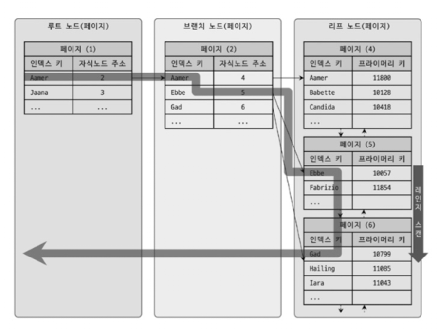
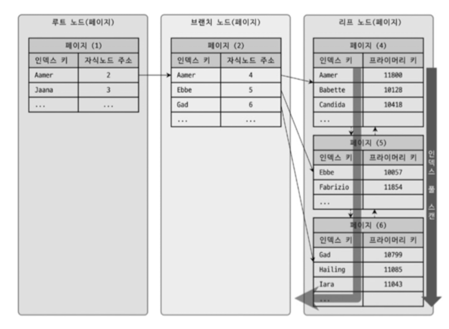
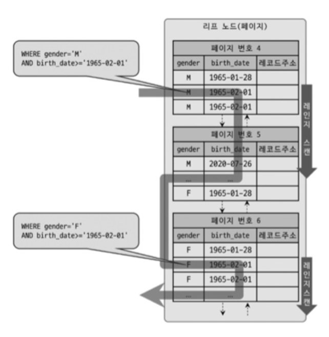
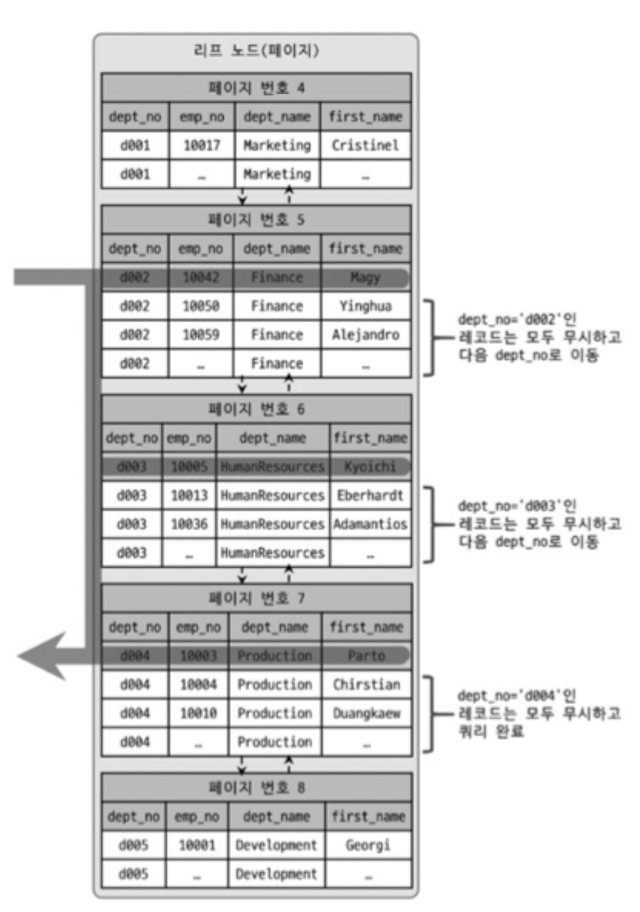
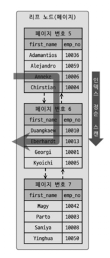
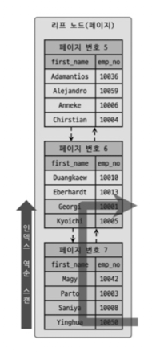
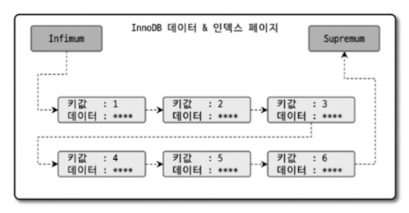

## 인덱스란 무엇인가?

인덱스는 테이블의 데이터를 빠르게 검색하기 위한 자료구조입니다. MySQL InnoDB는 **B-Tree 인덱스**를 사용하여 데이터를 정렬된 상태로 저장합니다.

**B-Tree 인덱스 특징:**

- 인덱스 레코드를 B-Tree 구조의 리프 페이지에 저장
- 키가 정렬되어 있어 범위 검색에 효율적
- 인덱스 생성 시 "sorted index build" 방식으로 bulk load 수행

```sql
-- B-Tree 인덱스 생성
CREATE INDEX idx_user_email ON users(email);

-- 인덱스를 활용한 범위 검색
SELECT * FROM users
WHERE email BETWEEN 'a@example.com' AND 'z@example.com';
```

## 인덱스 키 크기가 중요한 이유

### 16KB 페이지와 키 개수의 관계

InnoDB의 기본 페이지 크기는 **16KB**입니다. 인덱스 키 크기가 클수록 한 페이지에 저장할 수 있는 키 개수가 줄어듭니다.

**예시:**

| 인덱스 키 크기 | 페이지당 저장 가능한 키 개수 (대략) |
|--------------|--------------------------------|
| 10 bytes | 약 1,600개 |
| 100 bytes | 약 160개 |
| 1,000 bytes | 약 16개 |

페이지당 키 개수가 적으면:
- B-Tree 깊이가 증가 (더 많은 페이지 접근 필요)
- 인덱스 스캔 시 더 많은 I/O 발생
- 캐시 효율성 감소

### 인덱스 키 크기 제한

MySQL은 Row Format에 따라 인덱스 키 크기 제한이 다릅니다:

| Row Format | 최대 인덱스 키 크기 | 페이지 크기 |
|-----------|------------------|-----------|
| DYNAMIC / COMPRESSED | 3,072 bytes | 16KB (기본값) |
| REDUNDANT / COMPACT | 767 bytes | 16KB (기본값) |
| DYNAMIC / COMPRESSED | 1,536 bytes | 8KB |
| DYNAMIC / COMPRESSED | 768 bytes | 4KB |

```sql
-- 에러: 인덱스 키가 너무 큼
CREATE INDEX idx_long_text ON posts(content);
-- ERROR 1071: Specified key was too long

-- 해결: 프리픽스 인덱스 사용
CREATE INDEX idx_content_prefix ON posts(content(100));
```

**권장사항:**

- 인덱스 키는 가능한 작게 유지
- 긴 문자열 컬럼은 프리픽스 인덱스 사용
- 불필요한 컬럼은 복합 인덱스에서 제외

## 카디널리티와 선택도

### 카디널리티 (Cardinality)

카디널리티는 **인덱스 컬럼의 고유 값(distinct values) 개수**를 의미합니다.

```sql
-- 카디널리티 확인
SHOW INDEXES FROM users;

-- Cardinality 컬럼에 고유 값 개수 표시
+-------+------------+----------+--------------+-------------+
| Table | Non_unique | Key_name | Seq_in_index | Cardinality |
+-------+------------+----------+--------------+-------------+
| users |          0 | PRIMARY  |            1 |      100000 |
| users |          1 | idx_city |            1 |          50 |
| users |          1 | idx_age  |            1 |          80 |
+-------+------------+----------+--------------+-------------+
```

**카디널리티 예시:**

| 컬럼 | 카디널리티 | 설명 |
|------|----------|------|
| user_id (PK) | 100,000 | 모든 값이 고유 |
| gender | 2 | 남/여 2가지 |
| city | 50 | 50개 도시 |
| age | 80 | 1~80세 |

### 선택도 (Selectivity)

선택도는 **쿼리 결과를 얼마나 잘 좁히는지**를 나타냅니다.

```
선택도 = 카디널리티 / 전체 행 수
```

**선택도 예시:**

| 컬럼 | 카디널리티 | 전체 행 수 | 선택도 | 인덱스 효율 |
|------|----------|----------|--------|-----------|
| user_id | 100,000 | 100,000 | 1.0 | 매우 높음 |
| city | 50 | 100,000 | 0.0005 | 높음 |
| age | 80 | 100,000 | 0.0008 | 높음 |
| gender | 2 | 100,000 | 0.00002 | 매우 낮음 |

**옵티마이저의 인덱스 선택:**

MySQL 옵티마이저는 카디널리티 통계를 기반으로 선택도가 높은 인덱스를 우선 선택합니다.

```sql
-- gender 컬럼은 선택도가 낮아 인덱스를 사용하지 않을 수 있음
SELECT * FROM users WHERE gender = 'M';
-- EXPLAIN: type = ALL (Full Table Scan)

-- user_id는 선택도가 높아 인덱스를 사용
SELECT * FROM users WHERE user_id = 12345;
-- EXPLAIN: type = const (Primary Key)
```

**카디널리티 통계 갱신:**

```sql
-- 통계 갱신 (random dive 방식)
ANALYZE TABLE users;

-- 통계 확인
SELECT * FROM mysql.innodb_index_stats
WHERE table_name = 'users';
```

## 복합 인덱스와 WHERE 절 순서

### WHERE 절 순서는 중요하지 않습니다

많은 사람들이 WHERE 절의 컬럼 순서를 인덱스 순서와 맞춰야 한다고 생각하지만, **MySQL 옵티마이저가 알아서 최적의 인덱스를 선택**합니다.

```sql
-- 복합 인덱스 생성
CREATE INDEX idx_name_age_sex ON users(name, age, sex);
```

**WHERE 절 순서와 무관하게 동일한 인덱스 사용:**

```sql
-- 케이스 1: 인덱스 순서와 동일
SELECT * FROM users
WHERE name = 'John' AND age = 25 AND sex = 'M';
-- 인덱스 사용: idx_name_age_sex

-- 케이스 2: WHERE 절 순서가 다름
SELECT * FROM users
WHERE age = 25 AND name = 'John' AND sex = 'M';
-- 인덱스 사용: idx_name_age_sex (동일하게 사용)

-- 케이스 3: WHERE 절 순서가 완전히 다름
SELECT * FROM users
WHERE sex = 'M' AND age = 25 AND name = 'John';
-- 인덱스 사용: idx_name_age_sex (동일하게 사용)
```

**EXPLAIN으로 확인:**

```sql
EXPLAIN SELECT * FROM users
WHERE age = 25 AND name = 'John' AND sex = 'M';

+------+------------------+------+-----------------------+
| type | key              | rows | Extra                 |
+------+------------------+------+-----------------------+
| ref  | idx_name_age_sex |    1 | Using index condition |
+------+------------------+------+-----------------------+
```

### 인덱스 사용 규칙 (중요)

WHERE 절 순서는 중요하지 않지만, **어떤 컬럼을 사용하는지**는 중요합니다.

**복합 인덱스 (name, age, sex)의 사용 규칙:**

| WHERE 조건 | 인덱스 사용 여부 | 사용되는 인덱스 컬럼 |
|-----------|--------------|-----------------|
| name = 'John' | 사용 | name |
| name = 'John' AND age = 25 | 사용 | name, age |
| name = 'John' AND age = 25 AND sex = 'M' | 사용 | name, age, sex |
| name = 'John' AND sex = 'M' | 사용 (제한적) | name만 (age 누락으로 sex 사용 불가) |
| age = 25 | 사용 안 함 | - |
| age = 25 AND sex = 'M' | 사용 안 함 | - |
| sex = 'M' | 사용 안 함 | - |

**핵심 규칙:**
- leftmost 컬럼(name)으로 시작하지 않으면 인덱스를 사용할 수 없습니다.
- 중간 컬럼을 건너뛰면 그 이후 컬럼은 인덱스를 사용할 수 없습니다.
- MySQL 8.0.13+의 **Index Skip Scan**은 특정 조건에서 예외적으로 사용될 수 있습니다.(아래 나옴)

**왼쪽부터 순서대로 사용:**

```sql
-- 복합 인덱스: (name, age, sex)

-- OK: name부터 시작
WHERE name = 'John'  -- name 사용

-- OK: name부터 시작하고 age까지
WHERE name = 'John' AND age = 25  -- name, age 사용

-- OK: name부터 시작하지만 age가 없으므로 sex는 인덱스 사용 불가
WHERE name = 'John' AND sex = 'M'  -- name만 사용 (sex는 사용 불가)

-- 사용 안 함: leftmost(name)로 시작하지 않음
WHERE age = 25  -- Full Table Scan (Skip Scan은 예외적 최적화)

-- 사용 안 함: leftmost(name)로 시작하지 않음
WHERE sex = 'M'  -- Full Table Scan
```

**실험:**

```sql
-- 복합 인덱스 생성
CREATE INDEX idx_name_age_sex ON users(name, age, sex);

-- WHERE 절 순서를 바꿔도 동일한 실행 계획
EXPLAIN SELECT * FROM users WHERE name = 'John' AND age = 25;
EXPLAIN SELECT * FROM users WHERE age = 25 AND name = 'John';
-- 둘 다 동일: type=ref, key=idx_name_age_sex, rows=1
```

### 정리

- **WHERE 절 순서는 중요하지 않습니다** - 옵티마이저가 알아서 최적화
- **인덱스 컬럼 순서는 중요합니다** - 왼쪽부터 순서대로 사용
- **첫 번째 컬럼이 없으면** - Skip Scan 또는 Full Table Scan
- **중간 컬럼을 건너뛰면** - 건너뛴 이후 컬럼은 사용 안 됨

## 인덱스 스캔 방식

MySQL은 쿼리 조건에 따라 다양한 인덱스 스캔 방식을 사용합니다.

### 1. Index Range Scan (인덱스 레인지 스캔)

**가장 일반적인 인덱스 스캔 방식**으로, 인덱스의 특정 범위를 스캔합니다.

```sql
-- 범위 조건
SELECT * FROM users WHERE age BETWEEN 20 AND 30;

-- 부등호 조건
SELECT * FROM users WHERE created_at > '2024-01-01';

-- IN 절
SELECT * FROM users WHERE user_id IN (1, 5, 10);
```

```
EXPLAIN 출력:
+------+-------+------+------------------------+
| type | key   | rows | Extra                  |
+------+-------+------+------------------------+
| range| idx_age| 1000 | Using index condition |
+------+-------+------+------------------------+
```

**동작 방식:**



### 2. Index Full Scan (인덱스 풀 스캔)

인덱스 전체를 스캔하는 방식입니다. 테이블 풀 스캔보다는 빠르지만, 레인지 스캔보다는 느립니다.

```sql
-- ORDER BY만 있고 WHERE 조건이 없는 경우
SELECT * FROM users ORDER BY email;
```

```
EXPLAIN 출력:
+------+-------+--------+----------------+
| type | key   | rows   | Extra          |
+------+-------+--------+----------------+
| index| idx_email| 100000 | Using index |
+------+-------+--------+----------------+
```

**동작 방식:**



### 3. Index Skip Scan (인덱스 스킵 스캔)

MySQL 8.0.13+에서 지원하는 방식으로, 복합 인덱스의 첫 번째 컬럼을 건너뛰고 두 번째 컬럼으로 검색할 수 있습니다.

```sql
-- 복합 인덱스 생성
CREATE INDEX idx_gender_age ON users(gender, age);

-- 첫 번째 컬럼(gender)을 WHERE 절에 사용하지 않음
SELECT * FROM users WHERE age = 25;
```

```
EXPLAIN 출력:
+------+---------------+------+--------------------------------+
| type | key           | rows | Extra                          |
+------+---------------+------+--------------------------------+
| range| idx_gender_age| 2000 | Using index for skip scan      |
+------+---------------+------+--------------------------------+
```

**동작 방식:**

1. gender의 고유 값(M, F)을 먼저 찾음
2. 각 gender 값에 대해 age = 25 조건 검색
3. 결과 병합

**Skip Scan 사용 조건:**

- **WHERE 조건절에 조건이 없는 인덱스의 선행 컬럼의 유니크한 값의 개수가 적어야 함**
  - 예: gender 컬럼의 유니크 값이 2개(M, F)로 적음
  - 유니크 값이 많으면 각 값마다 검색해야 하므로 비효율적

- **쿼리가 인덱스에 존재하는 칼럼만으로 처리 가능해야 함 (커버링 인덱스)**
  - 인덱스에 포함된 컬럼만 SELECT하거나
  - WHERE 조건과 SELECT 컬럼이 모두 인덱스에 포함되어야 함



**Skip Scan 활성화:**

```sql
-- Skip Scan 플래그 확인
SHOW VARIABLES LIKE 'optimizer_switch';
-- skip_scan=on (기본값)

-- Skip Scan 비활성화
SET optimizer_switch='skip_scan=off';
```

### 4. Loose Index Scan (인덱스 루스 스캔)

**GROUP BY 최적화**에 사용되는 방식으로, 인덱스의 일부 키만 읽고 나머지는 건너뜁니다.

```sql
-- 복합 인덱스 생성
CREATE INDEX idx_city_age ON users(city, age);

-- GROUP BY로 city별 최소 나이 조회
SELECT city, MIN(age) FROM users GROUP BY city;
```

```
EXPLAIN 출력:
+------+-------------+------+----------------------------+
| type | key         | rows | Extra                      |
+------+-------------+------+----------------------------+
| range| idx_city_age| 50   | Using index for group-by   |
+------+-------------+------+----------------------------+
```

**동작 방식:**

1. 인덱스에서 각 city의 첫 번째 레코드만 읽음
2. 나머지 레코드는 건너뜀 (loose)
3. MIN/MAX 집계 함수에 효율적



### 5. Index Merge (인덱스 머지)

**여러 인덱스를 동시에 사용**하여 결과를 병합하는 방식입니다.

```sql
-- 두 개의 단일 컬럼 인덱스 생성
CREATE INDEX idx_age ON users(age);
CREATE INDEX idx_city ON users(city);

-- OR 조건으로 두 인덱스 모두 활용
SELECT * FROM users
WHERE age = 25 OR city = 'Seoul';
```

```
EXPLAIN 출력:
+-------------+-------------------+------+------------------------------+
| type        | key               | rows | Extra                        |
+-------------+-------------------+------+------------------------------+
| index_merge | idx_age,idx_city  | 3000 | Using union(idx_age,idx_city)|
+-------------+-------------------+------+------------------------------+
```

**Index Merge 종류:**

| 종류 | 설명 | 예시 |
|------|------|------|
| Union | OR 조건 | age = 25 OR city = 'Seoul' |
| Intersection | AND 조건 | age = 25 AND city = 'Seoul' |
| Sort-Union | OR 조건 + 정렬 | age > 25 OR city = 'Seoul' |

[여기에 Index Merge 동작 방식 이미지가 들어갈 예정]

### 6. Table Full Scan (테이블 풀 스캔)

인덱스를 사용하지 않고 테이블 전체를 스캔합니다.

```sql
-- 인덱스가 없거나 선택도가 낮은 경우
SELECT * FROM users WHERE gender = 'M';
```

```
EXPLAIN 출력:
+------+------+--------+-------+
| type | key  | rows   | Extra |
+------+------+--------+-------+
| ALL  | NULL | 100000 |       |
+------+------+--------+-------+
```

**Full Table Scan이 발생하는 경우:**

- 인덱스가 없는 컬럼 검색
- 선택도가 낮은 조건 (결과가 테이블의 20% 이상)
- 테이블이 매우 작은 경우 (10개 미만의 행)
- 함수 사용으로 인덱스 무효화 (`WHERE YEAR(created_at) = 2024`)

## 멀티밸류 인덱스 (MySQL 8.0.17+)

### 멀티밸류 인덱스란?

**멀티밸류 인덱스**(Multi-Valued Index)는 **JSON 배열의 각 요소를 개별적으로 인덱싱**하는 기능입니다.

### 왜 필요한가?

**문제:** 블로그 포스트를 태그로 검색하고 싶습니다.

```sql
CREATE TABLE posts (
    id INT PRIMARY KEY,
    title VARCHAR(200),
    tags JSON  -- ["MySQL", "Database", "Index"]
);

-- "MySQL" 태그를 가진 포스트를 찾고 싶다
SELECT * FROM posts WHERE JSON_CONTAINS(tags, '"MySQL"');
```

**일반 인덱스로는 불가능합니다.** 왜냐하면:

```
일반 인덱스의 한계:
Row 1: tags = ["MySQL", "Database", "Index"]  ← 배열 전체가 하나의 값
Row 2: tags = ["Java", "Spring"]              ← 배열 전체가 하나의 값
Row 3: tags = ["MySQL", "InnoDB"]             ← 배열 전체가 하나의 값

→ "MySQL"을 찾으려면? 모든 행을 스캔하며 JSON_CONTAINS() 실행 (느림)
→ EXPLAIN: type = ALL, rows = 10000
```

**멀티밸류 인덱스는 가능합니다.** 배열의 각 요소를 개별 인덱스 엔트리로 저장하기 때문입니다:

```
멀티밸류 인덱스 구조:
"MySQL"    → [Row 1, Row 3]  ← 인덱스 엔트리
"Database" → [Row 1]
"Index"    → [Row 1]
"Java"     → [Row 2]
"Spring"   → [Row 2]
"InnoDB"   → [Row 3]

→ "MySQL"을 찾으려면? 인덱스에서 "MySQL" 검색 (빠름)
→ EXPLAIN: type = ref, rows = 2
```

### 실제 예시

**멀티밸류 인덱스 생성:**

```sql
-- 태그 멀티밸류 인덱스 생성
ALTER TABLE posts
ADD INDEX idx_tags((CAST(tags AS CHAR(20) ARRAY)));

-- 이제 인덱스를 사용해서 빠르게 검색
SELECT * FROM posts WHERE JSON_CONTAINS(tags, '"MySQL"');
```

**문법:**

```sql
CREATE INDEX index_name ON table_name (
    (CAST(json_column AS type ARRAY))
);

-- 타입 예시:
-- CHAR(N): 문자열 배열 (태그, 카테고리명)
-- UNSIGNED: 정수 배열 (카테고리 ID, 우편번호)
-- DATE: 날짜 배열 (기념일, 이벤트 날짜)
```

## 인덱스 정순/역순 스캔

### Forward Index Scan (정순 스캔)



인덱스를 **정방향으로 스캔**하는 방식입니다.

```sql
-- 오름차순 정렬 (정순 스캔)
SELECT * FROM users ORDER BY user_id ASC LIMIT 10;
```

```
EXPLAIN FORMAT=TREE 출력:
-> Limit: 10 row(s)
    -> Index scan on users using PRIMARY
```

### Backward Index Scan (역순 스캔)




인덱스를 **역방향으로 스캔**하는 방식입니다.

```sql
-- 내림차순 정렬 (역순 스캔)
SELECT * FROM users ORDER BY user_id DESC LIMIT 10;
```

```
EXPLAIN FORMAT=TREE 출력:
-> Limit: 10 row(s)
    -> Index scan on users using PRIMARY (reverse)
```

### 성능 차이

**Forward Scan이 Backward Scan보다 약 28.9% 더 빠릅니다.**

**이유:**

1. **페이지 래치(Latch)가 인덱스 정순 스캔에 적합한 구조**

   InnoDB는 페이지를 읽을 때 **페이지 래치**(latch)를 사용합니다. 래치는 페이지에 대한 단기 메모리 보호 장치입니다.

   **정순 스캔의 래치 흐름:**
   ```
   1. 페이지 1 래치 획득
   2. 페이지 1의 레코드 읽기 (첫 번째 레코드부터 순차적으로)
   3. 다음 페이지(페이지 2) 포인터 확인
   4. 페이지 1 래치 해제
   5. 페이지 2 래치 획득
   6. 반복...
   ```

   **역순 스캔의 래치 흐름:**
   ```
   1. 마지막 페이지 찾기 (추가 탐색)
   2. 마지막 페이지 래치 획득
   3. 페이지 내에서 마지막 레코드 찾기 (전체 스캔 필요)
   4. 이전 페이지 포인터 확인
   5. 현재 페이지 래치 해제
   6. 이전 페이지 래치 획득
   7. 다시 그 페이지의 마지막 레코드 찾기...
   ```

   **문제점: 래치 경합(Latch Contention)**

   정순 스캔과 역순 스캔이 동시에 실행될 때:
   ```
   트랜잭션 A (정순): 페이지 1 → 페이지 2 → 페이지 3 →
   트랜잭션 B (역순): ← 페이지 3 ← 페이지 2 ← 페이지 1

   충돌 지점: 페이지 2에서 두 트랜잭션이 동시에 접근 시도
   → 트랜잭션 A가 페이지 2 래치를 먼저 획득하면 B는 대기
   → 트랜잭션 B가 페이지 2 래치를 먼저 획득하면 A는 대기
   ```

   - **정순 스캔끼리**: 같은 방향으로 진행 → 충돌 최소화
   - **역순 스캔 + 정순 스캔**: 반대 방향에서 진행 → 중간 페이지에서 충돌 가능성 증가 → 대기 시간 증가

2. **페이지 내에서 인덱스 레코드가 단방향으로만 연결된 구조**
   - **페이지 간 연결**: 양방향 링크 (이전 페이지 ↔ 다음 페이지)
   - **페이지 내 레코드**: 단방향 링크 (레코드1 → 레코드2 → 레코드3)
   - **정순 스캔**: 페이지의 첫 번째 레코드부터 링크를 따라가기만 하면 됩니다.
   - **역순 스캔**: 페이지의 마지막 레코드를 찾기 위해 페이지 전체를 스캔하거나, 역방향 탐색을 위해 매번 이전 레코드를 찾아야 하는 추가 오버헤드가 발생합니다.
  



### DESC 인덱스 (MySQL 8.0+)

**배경:**

MySQL 5.7 이하 버전에서는 `DESC` 옵션을 사용해도 실제로는 무시되고 모든 인덱스가 오름차순(ASC)으로 저장되었습니다.

```sql
-- MySQL 5.7 이하
CREATE INDEX idx_score_desc ON users(score DESC);
-- DESC가 무시되고 실제로는 ASC로 저장됨

-- 내림차순 정렬 쿼리 시
SELECT * FROM users ORDER BY score DESC;
-- Backward Index Scan 발생 (느림)
```

**MySQL 8.0의 개선:**

**MySQL 8.0부터 내림차순 인덱스를 지원**합니다. DESC 인덱스는 실제로 내림차순으로 정렬되어 저장됩니다.

```sql
-- 내림차순 인덱스 생성
CREATE INDEX idx_user_score_desc
ON users(user_id ASC, score DESC);

-- 혼합 정렬 쿼리
SELECT * FROM users
ORDER BY user_id ASC, score DESC
LIMIT 10;
```

```
EXPLAIN FORMAT=TREE 출력:
-> Limit: 10 row(s)
    -> Index scan on users using idx_user_score_desc
    -- (reverse) 없음 = Forward Scan 사용
```

**DESC 인덱스 장점:**

1. **혼합 정렬 최적화**
   - `ORDER BY a ASC, b DESC` 같은 쿼리에서 filesort 방지

2. **Forward Scan 활용**
   - 내림차순 정렬이 필요한 경우에도 Forward Scan 사용 가능

3. **다중 컬럼 정렬**
   - 각 컬럼마다 정렬 방향 지정 가능

**사용 예시:**

```sql
-- 사용자별 최신 주문 조회
CREATE INDEX idx_order_user_date
ON orders(user_id ASC, created_at DESC);

SELECT * FROM orders
WHERE user_id = 12345
ORDER BY created_at DESC
LIMIT 10;
-- Forward Scan 사용 (빠름)
```


### DESC 인덱스 제약사항

```sql
-- InnoDB만 지원
CREATE INDEX idx_score_desc ON users(score DESC)
ENGINE=InnoDB;  -- OK

-- GROUP BY MIN()/MAX() 최적화에 사용 불가
SELECT MIN(score) FROM users;
-- DESC 인덱스가 있어도 인덱스 스캔 대신 filesort 사용
```


**요약:**

| 인덱스 타입 | 정렬 방향 | 스캔 방식 | 성능 |
|-----------|---------|---------|------|
| INDEX (a ASC) | ORDER BY a ASC | Forward | 빠름 |
| INDEX (a ASC) | ORDER BY a DESC | Backward | 느림  |
| INDEX (a DESC) | ORDER BY a DESC | Forward | 빠름 |
| INDEX (a DESC) | ORDER BY a ASC | Backward | 느림 |

**권장사항:**

- 자주 사용되는 정렬 방향에 맞춰 인덱스 생성
- 혼합 정렬이 필요한 경우 DESC 인덱스 활용
- 역순 스캔이 필요한 경우 DESC 인덱스로 Forward Scan 사용

## 유니크 인덱스

유니크 인덱스는 사실 인덱스라기보다는 **제약 조건에 가깝습니다**. 같은 값이 2개 이상 저장될 수 없음을 의미하는데, MySQL에서는 인덱스 없이 유니크 제약만 설정할 방법이 없습니다.

유니크 인덱스에서 `NULL`도 저장될 수 있는데, `NULL`은 특정 값이 아니므로 2개 이상 저장될 수 있습니다. 

MySQL에서 프라이머리 키는 기본적으로 `NULL`을 허용하지 않는 유니크 속성이 자동으로 부여됩니다. 

### 유니크 인덱스 vs 일반 세컨더리 인덱스

유니크 인덱스와 유니크하지 않은 일반 세컨더리 인덱스는 **사실 인덱스의 구조상 아무런 차이점이 없습니다.**

유니크 인덱스와 일반 세컨더리 인덱스의 **읽기와 쓰기를 성능 관점**에서 한번 살펴보겠습니다.

#### 인덱스 읽기

많은 사람이 유니크 인덱스가 더 빠르다고 생각합니다. 하지만 **실제 성능 차이는 거의 없습니다**.

**왜 일반 세컨더리 인덱스는 한 건 더 확인해야 할까?**

```sql
-- 유니크 인덱스
SELECT * FROM users WHERE email = 'user@example.com';
-- 인덱스에서 "user@example.com"을 찾음 → 끝 (유니크하므로 하나만 존재)

-- 일반 세컨더리 인덱스
SELECT * FROM posts WHERE category = 'MySQL';
-- 인덱스에서 "MySQL"을 찾음
-- → 다음 레코드 확인 → "MySQL"인지 체크
-- → 다르면 끝, 같으면 계속
```

**유니크 인덱스:**
- 찾는 값이 **하나밖에 없다는 보장**이 있음
- 해당 값을 찾으면 **바로 종료**

**일반 세컨더리 인덱스:**
- 중복 값이 있을 수 있음
- 찾은 값 다음에 **같은 값이 더 있는지 확인** 필요
- 다음 레코드를 읽어서 값이 다르면 종료

**왜 성능 차이가 미미한가?**

다음 레코드 확인 작업은 **대부분 같은 페이지 내에서 처리**됩니다:

**케이스 1: 같은 페이지 내** (대부분의 경우)
```
페이지 1: [MySQL, MySQL, MySQL, Python, ...]
          ↑ 찾음  ↑ 다음 레코드 확인 (메모리에서 비교)
```
- **디스크 I/O 없음** (이미 로드된 페이지)
- **메모리에서 CPU 비교만** 수행
- 성능 영향 거의 없음

**케이스 2: 페이지 경계** (드문 경우)
```
페이지 1: [..., MySQL]
페이지 2: [MySQL, ...]  ← 다음 페이지 읽기 필요
```
- **디스크 I/O 발생 가능**
- 하지만 16KB 페이지에 수백~수천 개 레코드가 들어가므로 **페이지 경계에 걸릴 확률은 매우 낮음**

```
디스크 I/O: ~10ms
메모리 비교: ~0.001ms (약 10,000배 빠름)
```

**결론:**

대부분의 경우 다음 레코드는 같은 페이지에 있으므로 성능 차이는 거의 없습니다. 

실제로 느린 경우는 **중복 값이 많아서 여러 페이지에 걸쳐 많은 레코드를 읽어야 하는 경우**이지, 단순히 한 건 더 확인하는 것 때문이 아닙니다.

#### 인덱스 쓰기

새로운 레코드가 `INSERT`되거나 인덱스 컬럼의 값이 변경되는 경우에는 인덱스 쓰기 작업이 필요합니다. 

**그런데 유니크 인덱스의 키 값을 쓸 때는 중복된 값이 있는지 없는지 체크하는 과정이 한 단계 더 필요합니다.**

그래서 유니크하지 않은 세컨더리 인덱스의 쓰기보다 느립니다.

그런데 MySQL에서는 유니크 인덱스에서 **중복된 값을 체크할 때는 읽기 잠금을 사용하고**, **쓰기를 할 때는 쓰기 잠금**을 사용하는데 이 과정에서 데드락이 아주 빈번히 발생합니다.

**또한 InnoDB 스토리지 엔진에는 인덱스 키의 저장을 버퍼링하기 위해 체인지 버퍼가 사용됩니다.** 

그래서 인덱스의 저장이나 변경 작업이 상당히 빨리 처리되지만, **유니크 인덱스는 반드시 중복 체크를 해야 하므로 작업 자체를 버퍼링하지 못합니다.**

이 때문에 **유니크 인덱스는 일반 세컨더리 인덱스보다 변경 작업이 더 느리게 작동합니다.**

### 유니크 인덱스 사용 시 주의사항

꼭 필요한 경우라면 유니크 인덱스를 생성하는 것은 당연합니다. 하지만 더 성능이 좋아질 것으로 생각하고 불필요하게 유니크 인덱스를 생성하지는 않는 것이 좋습니다.

그리고 가끔 특정한 칼럼에 대해 프라이머리 키와 유니크 인덱스를 동일하게 생성한 경우도 있는데, 이 또한 불필요한 중복으로 주의해야 합니다.

결론적으로 유일성이 꼭 보장돼야 하는 칼럼에 대해서는 유니크 인덱스를 생성하되, 꼭 필요하지 않다면 유니크 인덱스보다는 유니크하지 않은 세컨더리 인덱스를 생성하는 방법도 한 번쯤 고려해볼 수 있습니다.

```sql
CREATE TABLE tb_unique (
    id INTEGER NOT NULL,
    nick_name VARCHAR(100),
    PRIMARY KEY (id),
    UNIQUE INDEX ux_nickname (nick_name),
    INDEX ix_nickname (nick_name)  -- 불필요한 중복 인덱스
);
```

이미 유니크 인덱스 `ux_nickname`이 있으므로 일반 세컨더리 인덱스 `ix_nickname`은 필요하지 않습니다. 

유니크 인덱스도 일반 세컨더리 인덱스와 같은 역할을 동일하게 수행할 수 있으므로 다음과 같이 세컨더리 인덱스를 중복으로 만들어 줄 필요는 없습니다.

## 외래키

**외래키**(Foreign Key)는 한 테이블의 컬럼이 다른 테이블의 기본 키(Primary Key)를 **참조**하는 제약 조건입니다.

**외래키의 역할:**

1. **참조 무결성 보장**: 존재하지 않는 부모 레코드를 참조할 수 없습니다.
2. **CASCADE 동작**: 부모 레코드 삭제/업데이트 시 자식 레코드도 자동으로 처리할 수 있습니다.

**예시:**
```sql
-- 부모 테이블: 사용자
CREATE TABLE users (
    id INT PRIMARY KEY,
    name VARCHAR(100)
);

-- 자식 테이블: 게시글
CREATE TABLE posts (
    id INT PRIMARY KEY,
    user_id INT,  -- users 테이블의 id를 참조하는 외래키
    content TEXT,
    FOREIGN KEY (user_id) REFERENCES users(id)
);

-- user_id는 반드시 users 테이블에 존재하는 id여야 함
```

### MySQL에서의 외래키

MySQL에서 외래키는 **InnoDB 스토리지 엔진에서만 생성할 수 있습니다**. 외래키 제약이 설정되면 자동으로 연관되는 테이블의 칼럼에 인덱스까지 생성됩니다.

외래키가 제거되지 않은 상태에서는 자동으로 생성된 인덱스를 삭제할 수 없습니다.

**InnoDB의 외래키 관리 특징:**

- 테이블의 변경(쓰기 잠금)이 발생하는 경우에만 잠금 경합(잠금 대기)이 발생합니다.
- 외래키와 연관되지 않은 칼럼의 변경은 최대한 잠금 경합(잠금 대기)을 발생시키지 않습니다.

```sql
CREATE TABLE tb_parent (
    id INT NOT NULL,
    fd VARCHAR(100) NOT NULL,
    PRIMARY KEY (id)
) ENGINE=InnoDB;

CREATE TABLE tb_child (
    id INT NOT NULL,
    pid INT DEFAULT NULL,  -- parent.id 칼럼 참조
    fd VARCHAR(100) DEFAULT NULL,
    PRIMARY KEY (id),
    KEY ix_parentid (pid),
    CONSTRAINT child_ibfk_1 FOREIGN KEY (pid) REFERENCES tb_parent (id) ON DELETE CASCADE
) ENGINE=InnoDB;

INSERT INTO tb_parent VALUES (1, 'parent-1'), (2, 'parent-2');
INSERT INTO tb_child VALUES (100, 1, 'child-100');
```

### 자식 테이블의 변경이 대기하는 경우

| 작업 번호 | 커넥션-1 | 커넥션-2 |
|----------|---------|---------|
| 1 | BEGIN; | |
| 2 | UPDATE tb_parent SET fd='changed-2' WHERE id=2; | |
| 3 | | BEGIN; |
| 4 | | UPDATE tb_child SET pid=2 WHERE id=100; |
| 5 | ROLLBACK; | |
| 6 | | Query OK, 1 row affected (3.04 sec) |

**동작 과정:**

**1단계: 부모 테이블 잠금**
- 1번 커넥션에서 트랜잭션을 시작하고 부모(tb_parent) 테이블에서 id가 2인 레코드에 UPDATE를 실행합니다.
- 1번 커넥션이 tb_parent 테이블에서 id가 2인 레코드에 대해 **쓰기 잠금을 획득**합니다.

**2단계: 자식 테이블 변경 시도 → 대기**
- 2번 커넥션에서 자식 테이블(tb_child)의 **외래키 칼럼** pid를 2로 변경하는 쿼리를 실행합니다.
- 이 쿼리(작업번호 4번)는 부모 테이블의 변경 작업이 완료될 때까지 **대기**합니다.

**3단계: 트랜잭션 종료 → 작업 재개**
- 1번 커넥션에서 ROLLBACK이나 COMMIT으로 트랜잭션을 종료하면 2번 커넥션의 대기 중이던 작업이 즉시 처리됩니다.

**핵심:**

**자식 테이블의 외래 키 칼럼 변경**(INSERT, UPDATE)은 **부모 테이블의 확인이 필요**합니다. 이 상태에서 부모 테이블의 해당 레코드가 **쓰기 잠금**이 걸려 있으면 해당 쓰기 잠금이 **해제될 때까지 기다려야** 합니다.

이것이 InnoDB의 외래키 관리의 **첫 번째 특징**에 해당합니다.

**참고:**

자식 테이블의 **외래키가 아닌 칼럼**(tb_child 테이블의 fd 칼럼)의 변경은 외래키로 인한 잠금 확장이 발생하지 않습니다. 이것이 InnoDB의 외래키의 **두 번째 특징**에 해당합니다.

### 부모 테이블의 변경 작업이 대기하는 경우

| 작업 번호 | 커넥션-1 | 커넥션-2 |
|----------|---------|---------|
| 1 | BEGIN; | |
| 2 | UPDATE tb_child SET fd='changed-100' WHERE id=100; | |
| 3 | | BEGIN; |
| 4 | | DELETE FROM tb_parent WHERE id=1; |
| 5 | ROLLBACK; | |
| 6 | | Query OK, 1 row affected (6.09 sec) |

**동작 과정:**

**1단계: 자식 테이블 잠금**
- 1번 커넥션에서 부모 키 "1"을 참조하는 **자식 테이블의 레코드를 변경**하면 tb_child 테이블의 레코드에 대해 **쓰기 잠금을 획득**합니다.

**2단계: 부모 테이블 변경 시도 → 대기**
- 2번 커넥션이 tb_parent 테이블에서 id가 1인 레코드를 삭제하려고 시도합니다.
- 이 쿼리(작업번호 4번)는 tb_child 테이블의 레코드에 대한 **쓰기 잠금이 해제될 때까지 대기**합니다.

**3단계: 트랜잭션 종료 → 작업 재개**
- 1번 커넥션에서 ROLLBACK이나 COMMIT으로 트랜잭션을 종료하면 2번 커넥션의 대기 중이던 작업이 즉시 처리됩니다.

**핵심:**

부모 레코드 삭제 시 **자식 테이블의 레코드에 대한 잠금**이 필요합니다. 이는 외래키 특성(`ON DELETE CASCADE`) 때문에 부모 레코드가 삭제되면 **자식 레코드도 동시에 삭제**되기 때문입니다.

**외래키 사용 시 고려사항:**

데이터베이스에서 외래 키를 물리적으로 생성하려면 이러한 현상으로 인한 **잠금 경합까지 고려**해 모델링을 진행하는 것이 좋습니다.

물리적으로 외래키를 생성하면 자식 테이블에 레코드가 추가되는 경우 **해당 참조키가 부모 테이블에 있는지 확인**하는 것은 이미 알고 있을 것입니다.

하지만 물리적인 외래키의 **핵심 고려 사항**은 이러한 체크 작업이 아니라 **이러한 체크를 위해 연관 테이블에 읽기 잠금을 걸어야 한다는 것**입니다.

이렇게 **잠금이 다른 테이블로 확장**되면 그만큼 **전체적으로 쿼리의 동시 처리에 영향**을 미칩니다.

