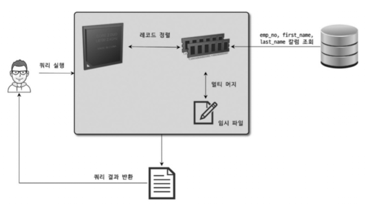
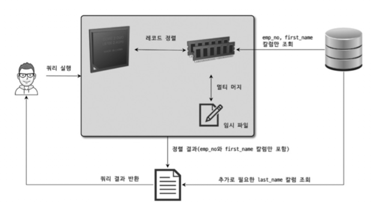
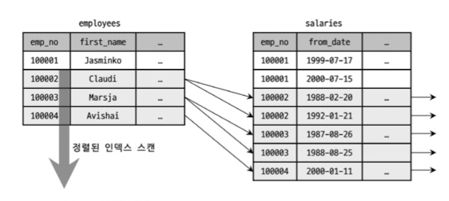
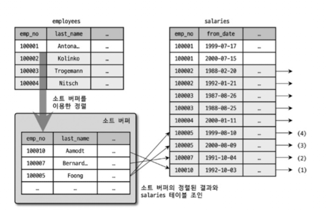
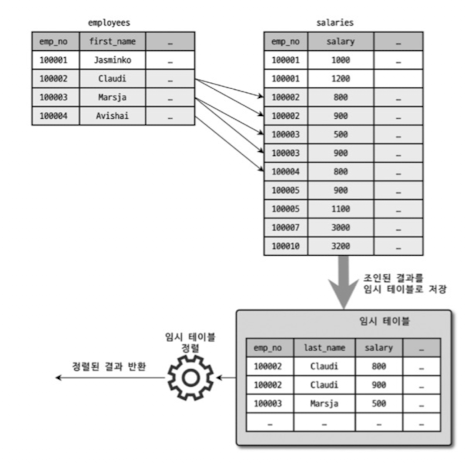
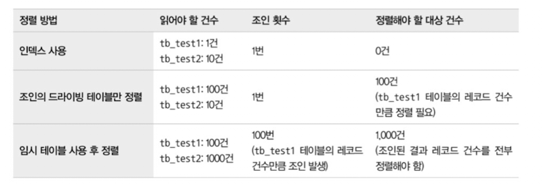
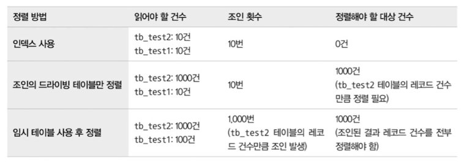
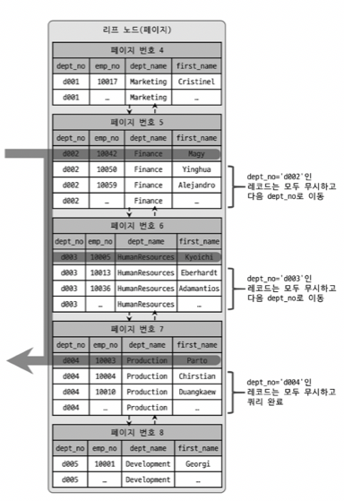

## 기본 데이터 처리

### 풀 테이블 스캔과 풀 인덱스 스캔

**풀 테이블 스캔**(Full Table Scan)은 인덱스를 사용하지 않고 테이블의 데이터를 처음부터 끝까지 읽는 방식입니다. 옵티마이저는 주로 다음 조건에서 풀 테이블 스캔을 선택합니다.

-   테이블 레코드 건수가 너무 적어 인덱스보다 빠른 경우 (페이지 1개 수준)
-   WHERE나 ON 절에 적절한 인덱스를 이용할 수 없는 경우
-   인덱스 레인지 스캔이 가능해도, 조건 일치 레코즈가 너무 많은 경우

**InnoDB의 리드 어헤드**(Read Ahead)

InnoDB는 풀 테이블 스캔 시 성능을 위해 **리드 어헤드** 기능을 사용합니다.
-   **동작 방식**: 처음 몇 개 페이지는 포그라운드 스레드가 읽지만, 특정 시점부터는 **백그라운드 스레드**가 미리 대량의 페이지(최대 64개)를 읽어 버퍼 풀에 적재합니다.
-   **효과**: 포그라운드 스레드는 버퍼 풀의 데이터를 바로 가져다 쓰므로 처리 속도가 빨라집니다.
-   **설정**: `innodb_read_ahead_threshold` 변수로 리드 어헤드 시작 임계값을 설정할 수 있습니다.

**풀 인덱스 스캔**(Full Index Scan)

인덱스를 처음부터 끝까지 스캔하는 방식입니다.
-   **리드 어헤드 사용**: 풀 테이블 스캔과 마찬가지로, 풀 인덱스 스캔에서도 리드 어헤드가 동일하게 사용됩니다.
-   `SELECT COUNT(*) FROM employees` 처럼 단순히 건수만 필요하거나, 인덱스에 포함된 칼럼만 조회할 때 사용됩니다.
-   **왜 더 빠른가? (페이지 효율과 밀도 차이)**
    -   **PK(클러스터링 인덱스) 페이지**
        -   모든 컬럼 데이터를 포함하므로 레코드 크기가 큽니다 
        -   한 페이지(16KB)에 들어가는 레코드 개수가 적습니다.
    -   **세컨더리 인덱스 페이지**
        -   인덱스 칼럼 + PK만 포함하므로 레코드 크기가 작습니다.
        -   한 페이지에 훨씬 더 많은 레코드를 담을 수 있습니다.
    -   **결과**
        -   같은 건수를 세더라도 세컨더리 인덱스가 읽어야 할 페이지 수가 훨씬 적으므로(I/O 감소)
        -   옵티마이저는 `COUNT(*)` 처리 시 세컨더리 인덱스를 우선적으로 선택합니다. (세컨더리 인덱스가 없다면 어쩔 수 없이 PK를 읽습니다.)

### 병렬 처리

MySQL 8.0부터는 **하나의 쿼리를 여러 스레드가 동시에 처리**하는 병렬 처리가 가능해졌습니다.

-   **주의점**: 여러 개의 쿼리를 동시에 처리하는 것이 아니라, **하나의 쿼리 작업을 나누어 처리**하는 것을 의미합니다.
-   **제약 사항**: 아직은 `WHERE` 조건 없이 단순히 테이블의 전체 건수를 가져오는 쿼리`SELECT COUNT(*)`만 병렬로 처리할 수 있습니다.
-   **설정**: `innodb_parallel_read_threads` 시스템 변수로 하나의 쿼리에 사용할 최대 스레드 개수를 설정합니다.

**병렬 처리 예시**
스레드 개수를 늘릴수록 처리 시간이 단축되는 것을 확인할 수 있습니다.

```sql
mysql> SET SESSION innodb_parallel_read_threads=1;
mysql> SELECT COUNT(*) FROM salaries;
1 row in set (0.32 sec)

mysql> SET SESSION innodb_parallel_read_threads=2;
mysql> SELECT COUNT(*) FROM salaries;
1 row in set (0.20 sec)

mysql> SET SESSION innodb_parallel_read_threads=4;
mysql> SELECT COUNT(*) FROM salaries;
1 row in set (0.18 sec)

mysql> SET SESSION innodb_parallel_read_threads=8;
mysql> SELECT COUNT(*) FROM salaries;
1 row in set (0.13 sec)
```

### ORDER BY 처리(Using filesort)

레코드 정렬은 인덱스를 이용하는 방법과 쿼리가 실행될 때 "Filesort"라는 별도의 처리를 이용하는 방법으로 나눌 수 있습니다.

|                   | 장점                                                                                                           | 단점                                                                 |
| ----------------- | -------------------------------------------------------------------------------------------------------------- | -------------------------------------------------------------------- |
| **인덱스 이용**   | INSERT, UPDATE, DELETE 시 이미 정렬돼 있어 읽기만 하면 되므로 매우 빠름                                        | 부가적인 인덱스 추가/삭제, 디스크 공간, 버퍼 풀 메모리가 많이 필요함 |
| **Filesort 이용** | 인덱스를 생성하지 않아도 되므로 인덱스 사용 시 단점이 없음. 정렬 대상이 적으면 메모리에서 충분히 빠르게 처리됨 | 레코드 대상 건수가 많아질수록 쿼리 응답 속도가 느림                  |

다음과 같은 이유로 모든 정렬을 인덱스를 이용하도록 튜닝하기란 거의 불가능합니다.
-   정렬 기준이 너무 많아 인덱스 생성이 불가능한 경우
-   GROUP BY나 DISTINCT, UNION 결과를 정렬해야 하는 경우
-   랜덤하게 결과 레코드를 가져와야 하는 경우

#### 소트 버퍼 (Sort Buffer)

MySQL은 정렬을 위해 **소트 버퍼(Sort buffer)** 라는 별도의 메모리 공간을 할당받아 사용합니다.
-   **특징**: 정렬이 필요한 경우에만 할당되며 쿼리 실행 완료 시 즉시 반납됩니다. `sort_buffer_size` 시스템 변수로 크기 설정이 가능합니다.
-   **크기 설정**:
    -   **세션(로컬) 메모리 영역**에 해당하므로, 커넥션마다 독립적으로 할당됩니다.
    -   따라서 무조건 크게 설정하면 운영체제 메모리 부족(OOM) 현상을 겪을 수 있습니다.
    -   일반적인 트랜잭션 처리용 서버라면 **56KB ~ 1MB 미만**이 적절합니다.

**멀티 머지 (Multi-merge)**

정렬해야 할 레코드 건수가 소트 버퍼 크기보다 크다면?
1.  레코드를 여러 조각으로 나눠서 처리합니다.
2.  메모리(소트 버퍼)에서 정렬 후 디스크에 임시 저장합니다.
3.  각 버퍼 크기만큼 정렬된 레코드를 다시 병합(Merge)하며 정렬을 수행합니다.
    -   이때 발생하는 병합 작업을 **멀티 머지**라고 합니다.
    -   이 작업은 모두 디스크 읽기/쓰기를 유발하므로 레코드 건수가 많을수록 쿼리 성능이 저하됩니다.

#### 정렬 알고리즘

레코드를 정렬할 때 **소트 버퍼에 무엇을 담느냐**에 따라 2가지 방식으로 나뉩니다.

**1. 싱글 패스**(Single-pass) 



**정렬 방식** : 소트 버퍼에 **정렬 기준 칼럼 + SELECT 대상 칼럼 전부**를 담아서 정렬하는 방식입니다.
-   **특징**: 정렬이 완료되면 별도의 테이블 읽기 없이 바로 결과를 반환합니다.
-   **장점**: 테이블을 한 번만 읽으면 되므로 디스크 I/O가 줄어듭니다.
-   **단점**: 소트 버퍼 공간을 많이 사용합니다. (레코드 크기가 크면 불리)
-   **사용**: **최신 버전에서는 일반적으로 이 방식을 주로 사용합니다.**
  
---

**2. 투 패스**(Two-pass) 



**정렬 방식** : 소트 버퍼에 **정렬 기준 칼럼 + 프라이머리 키**(Row ID)만 담아서 정렬하는 방식입니다.
-   **특징**: 정렬 완료 후, 프라이머리 키로 다시 테이블을 읽어서 필요한 칼럼을 가져옵니다.
-   **단점**: 테이블을 두 번 읽어야 하며, 특히 두 번째 읽기는 랜덤 I/O가 발생하여 성능이 떨어질 수 있습니다.
-   **사용**:
    -   레코드의 크기가 `max_length_for_sort_data` 시스템 변수보다 클 때
    -   **BLOB이나 TEXT 타입의 칼럼이 포함될 때**

**옵티마이저 트레이스로 확인하는 정렬 방식**
-   `<sort_key, rowid>`: 투 패스 방식
-   `<sort_key, additional_fields>`: 싱글 패스 방식 (고정 크기)
-   `<sort_key, packed_additional_fields>`: 싱글 패스 방식 (레코드의 컬럼들은 가변 크기로 메모리에 저장, 효율적)

#### 정렬 처리 방법

쿼리에 ORDER BY가 사용되면 다음 3가지 중 하나의 방법으로 처리됩니다. 아래쪽으로 갈수록 처리 속도가 느려집니다.

| 정렬 처리 방법             | 실행 계획 (Extra)                 | 특징                                                        |
| -------------------------- | --------------------------------- | ----------------------------------------------------------- |
| **인덱스 사용**            | 별도 표기 없음                    | 별도의 정렬 과정 없이 인덱스를 순서대로 읽음 (가장 빠름)    |
| **드라이빙 테이블만 정렬** | `Using filesort`                  | 조인 전, 첫 번째 테이블(드라이빙)만 먼저 정렬하고 조인 수행 |
| **임시 테이블 사용**       | `Using temporary; Using filesort` | 조인 결과를 임시 테이블에 저장 후 정렬 (가장 느림)          |

**1. 인덱스를 이용한 정렬**



**조건**:
- `ORDER BY`에 명시된 칼럼이 제일 먼저 읽는 테이블(드라이빙 테이블)에 속하고, 순서대로 생성된 인덱스가 있어야 함.
- `WHERE` 절에 첫 번째 읽는 테이블의 칼럼 조건이 있다면, 그 조건과 `ORDER BY`는 같은 인덱스를 사용할 수 있어야 함.

**특징**: 실제 MySQL 엔진에서 별도의 정렬 작업을 수행하지 않고 인덱스를 읽기만 하면 정렬된 결과가 나옵니다.

ORDER BY가 드라이빙 테이블의 인덱스 순서와 일치하면 인덱스를 이용해 정렬 없이 결과를 가져올 수 있습니다.

```sql
-- employees 테이블에 idx_dept_salary(dept_no, salary) 인덱스 존재
SELECT e.emp_no, e.dept_no, s.salary
FROM employees e
JOIN salaries s ON e.emp_no = s.emp_no
WHERE e.dept_no = 'd001'
ORDER BY e.dept_no, e.salary;
-- EXPLAIN: Using index (별도의 정렬 없음)
```

**2. 조인의 드라이빙 테이블만 정렬**



-   **원리**: 조인이 수행되면 레코드 건수와 크기가 기하급수적으로 늘어나므로, **조인하기 전에 먼저 정렬**하는 것이 효율적입니다.
-   **조건**: `ORDER BY` 절의 정렬 기준 칼럼이 드라이빙 테이블에 포함되어 있어야 함.
-   **과정**:
    1.  드라이빙 테이블에서 조건에 맞는 레코드를 검색
    2.  검색된 레코드를 정렬(Filesort)
    3.  정렬된 결과를 순서대로 읽으면서 드리븐 테이블과 조인
   
WHERE의 칼럼과 ORDER BY의 칼럼이 인덱스 순서와 맞지 않으면 인덱스를 사용할 수 없습니다.

```sql
SELECT e.emp_no, e.dept_no, s.salary
FROM employees e
JOIN salaries s ON e.emp_no = s.emp_no
WHERE e.dept_no = 'd001'
ORDER BY e.salary;
-- EXPLAIN: Using filesort (dept_no 없이 salary만 정렬)
```

**3. 임시 테이블을 이용한 정렬**



-   **원리**: 2개 이상의 테이블을 조인해서 그 결과를 정렬해야 하는데, 정렬 기준이 드라이빙 테이블에 있는 것이 아니라면 **조인을 끝낸 후 정렬**해야 합니다.
-   **조건**: `ORDER BY` 절의 정렬 기준 칼럼이 드리븐 테이블에 있는 경우 등.
-   **특징**: 정렬해야 할 레코드 건수가 가장 많아지므로 가장 느린 정렬 방법입니다.
  
ORDER BY가 드리븐 테이블의 칼럼이면 조인 후 정렬해야 하므로 임시 테이블이 필요합니다.

```sql
SELECT e.emp_no, e.dept_no, s.salary
FROM employees e
JOIN salaries s ON e.emp_no = s.emp_no
WHERE e.dept_no = 'd001'
ORDER BY s.salary;
-- EXPLAIN: Using temporary; Using filesort
```

#### 정렬 처리 방법의 성능 비교 (스트리밍 vs 버퍼링)

쿼리 처리는 데이터를 클라이언트로 보내는 방식에 따라 **스트리밍**(Streaming)과 **버퍼링**(Buffering)으로 나뉩니다.

**1. 스트리밍 방식**(Streaming)
-   **개념**: 서버가 조건에 일치하는 레코드를 찾는 **즉시 클라이언트로 전송**하는 방식.
-   **장점**:
    -   클라이언트는 첫 번째 레코드를 매우 빠르게 받을 수 있습니다 (빠른 응답 시간).
    -   `LIMIT` 조건을 사용하면 전체 시간을 획기적으로 줄일 수 있습니다. (원하는 건수만 채우면 즉시 멈춤)
-   **해당**: 인덱스를 사용한 정렬.

**2. 버퍼링 방식**(Buffering)
-   **개념**: 결과를 모아서 가공(정렬, 그룹핑)해야 하므로, **모든 레코드를 스토리지 엔진에서 가져올 때까지 기다려야** 하는 방식.
-   **단점**:
    -   모든 결과를 모을 때까지 클라이언트는 기다려야 합니다.
    -   `LIMIT` 조건을 사용해도 성능 향상에 별로 도움이 되지 않습니다. (어차피 정렬하려면 다 읽어야 함)
-   **해당**: `ORDER BY`(Filesort), `GROUP BY` 등.

**JDBC 라이브러리의 버퍼링**
-   MySQL 서버가 스트리밍으로 보내더라도, JDBC 라이브러리가 내부적으로 모두 받아서 버퍼링한 뒤 애플리케이션에 반환하는 경우가 많습니다.
-   이유: 전체 처리 시간(Throughput) 최적화 및 서버와의 통신 횟수 감소.
-   대량 데이터를 스트리밍으로 받으려면 JDBC 설정을 별도로 해야 합니다.

| 정렬 방법                | 처리 방식 | LIMIT 효과                                                    |
| ------------------------ | --------- | ------------------------------------------------------------- |
| **인덱스 사용**          | 스트리밍  | **매우 큼** (필요한 만큼 읽고 즉시 멈춤)                      |
| **드라이빙 테이블 정렬** | 버퍼링    | **없음/미미** (조인 전 정렬하므로 전체를 다 읽고 정렬해야 함) |
| **임시 테이블 사용**     | 버퍼링    | **없음** (모든 조인 결과를 만들고 정렬해야 함)                |

#### 성능 비교 예시 (LIMIT 10 사용 시)

`tb_test1` (100건)과 `tb_test2` (1,000건)를 조인하면서 `LIMIT 10`을 사용하는 쿼리의 성능 차이를 비교해 봅시다.

 이때 `tb_test1`의 레코드 1건당 `tb_test2`의 레코드가 10건씩 존재한다고 가정합니다.

```sql
SELECT *
FROM tb_test1 t1, tb_test2 t2
WHERE t1.col1 = t2.col1
ORDER BY t1.col2
LIMIT 10
```

**tb_test1이 드라이빙 테이블인 경우**



위 표는 `LIMIT 10`이 포함된 쿼리에서 정렬 처리 방식(인덱스, 드라이빙 테이블, 임시 테이블)에 따른 성능 차이를 보여줍니다.

-   **인덱스 사용**
    -   이미 정렬된 인덱스를 사용하므로 `LIMIT` 건수만큼만 읽고 멈추기에 가장 빠릅니다. 
    -   `tb_test1` 1건만 읽고 조인해도 `tb_test2` 결과 10건이 완성되므로 조인 1회로 종료


**tb_test2가 드라이빙 테이블인 경우**



> **참고: LIMIT와 Filesort**
> 인덱스를 이용하지 못하고 Filesort를 해야 한다면 `LIMIT`이 있어도 성능 향상이 크지 않습니다. 
>
> MySQL은 상위 10건을 찾기 위해 **전체 레코드(1,000건)를 읽어서 정렬(Heap Sort 등)을 수행**해야 하기 때문입니다. 따라서 페이징 쿼리라고 해도 인덱스를 타지 않으면 기대만큼 빠르지 않을 수 있습니다.


### 정렬 관련 상태 변수

MySQL 서버는 정렬 작업에 대한 상태를 누적해서 저장합니다. 

`SHOW STATUS LIKE 'Sort%';` 명령으로 확인할 수 있습니다.

-   **`Sort_merge_passes`**: 멀티 머지(디스크 사용하는 정렬) 처리 횟수. (값이 클수록 디스크 정렬이 많이 발생했다는 의미)
-   **`Sort_range`**: 인덱스 레인지 스캔을 통해 검색된 결과에 대한 정렬 횟수.
-   **`Sort_scan`**: 풀 테이블 스캔을 통해 나온 결과에 대한 정렬 횟수.
-   **`Sort_rows`**: 지금까지 정렬한 전체 레코드 건수.

### GROUP BY 처리

`GROUP BY` 또한 쿼리가 스트리밍 처리를 할 수 없게 하는 대표적인 처리 중 하나입니다. 

`ORDER BY`와 마찬가지로 인덱스를 사용하거나 임시 테이블을 사용하여 처리됩니다.
-   **HAVING 절**
    -   `GROUP BY` 결과에 대해 필터링 역할을 합니다. HAVING 절의 집계 조건 자체(예: `COUNT(*) > 100`)를 인덱스로 필터링할 수는 없습니다. 
    -   하지만 `GROUP BY` 칼럼에 인덱스가 있다면 Tight Index Scan으로 임시 테이블 없이 처리되므로, HAVING 절도 효율적으로 수행됩니다.

#### 인덱스 스캔을 이용하는 GROUP BY (타이트 인덱스 스캔)

조인의 드라이빙 테이블에 속한 칼럼만 이용해 그루핑할 때, 해당 칼럼에 이미 인덱스가 있다면 사용됩니다.

**중요 제약조건**

`GROUP BY` 칼럼이 인덱스의 **연속된 왼쪽 prefix**여야 합니다. 

인덱스가 (a, b, c)일 때, `GROUP BY a` 또는 `GROUP BY a, b`는 가능하지만, `GROUP BY b`나 `GROUP BY a, c`는 불가능합니다. 

인덱스의 두 번째 이상 칼럼으로 그루핑하면 첫 번째 칼럼 값이 바뀔 때마다 해당 값이 반복되므로 그룹 경계를 감지할 수 없기 때문입니다.

**왜 두 번째 칼럼으로 그루핑하면 안 되는가?**

인덱스가 (dept_no, emp_no)일 때 `GROUP BY emp_no`를 한다면:

```
인덱스 순서대로 읽기:
dept_no=d001, emp_no=10001 → count: 1
dept_no=d001, emp_no=10002 → 10001 그룹 끝? 아직 모름!
dept_no=d001, emp_no=10003
dept_no=d002, emp_no=10001 → 10001이 또 나타남!
dept_no=d002, emp_no=10002 → 10002가 또 나타남!
dept_no=d002, emp_no=10003
```

emp_no가 반복되므로 그룹 경계를 감지할 수 없습니다. 따라서 모든 데이터를 읽고 임시 테이블에서 그루핑해야 합니다.

**정상 동작하는 코드**

인덱스를 차례대로 읽으면서 그루핑 작업을 수행하고 조인 등을 처리합니다.

**특징**: 이미 정렬된 인덱스를 읽으므로 추가적인 정렬이나 임시 테이블이 필요 없습니다.

```sql
-- employees 테이블에 idx_dept_no(dept_no) 인덱스 존재
-- dept_emp 테이블과 조인하여 부서별 직원 수 집계

SELECT e.dept_no, COUNT(*)
FROM employees e
JOIN dept_emp de ON e.emp_no = de.emp_no
WHERE e.dept_no BETWEEN 'd001' AND 'd010'
GROUP BY e.dept_no;

-- EXPLAIN 결과:
-- 1. employees가 드라이빙 테이블
-- 2. idx_dept_no 인덱스 사용
-- 3. Extra: Using index (임시 테이블 없음, 정렬 없음)
--
-- 동작 순서:
-- 1. idx_dept_no 인덱스를 순서대로 읽음 (d001 레코드들 ... 이후 d002 레코드들 ...)
-- 2. d001 그룹의 레코드를 읽을 때마다 조인을 수행하고 집계(Count)
-- 3. dept_no가 d002로 바뀌는 순간 d001 그룹의 집계 결과를 반환
-- 4. d002 그룹에 대해서도 동일하게 조인 및 집계 과정을 반복
```

인덱스가 이미 dept_no 순서로 정렬되어 있기 때문에, MySQL은 인덱스를 순차적으로 읽으면서 dept_no가 바뀔 때마다 집계를 확정하고 다음 그룹으로 넘어갑니다. 

**별도의 정렬이나 임시 테이블이 필요 없어 매우 효율적입니다.**


**가시적 실행 예시**:

**1. 테이블 데이터 가정**

**employees 테이블 (드라이빙, dept_no 인덱스)**
| emp_no  | dept_no  | ...  |
| :------ | :------- | :--- |
| **100** | **d001** | ...  |
| **101** | **d001** | ...  |
| **102** | **d002** | ...  |

**dept_emp 테이블 (드리븐)**
| emp_no | from_date | ...  |
| :----- | :-------- | :--- |
| 100    | 2020...   | ...  |
| 101    | 2021...   | ...  |
| 102    | 2022...   | ...  |

**2. 실행 흐름 (Tight Index Scan)**

1.  **읽기**: `employees`에서 첫 번째 **`d001`** (emp_no 100) 읽음
    -   **조인 확인**: `dept_emp` 테이블에 emp_no=100이 있는지 확인 (있음)
    -   **카운트**: 현재 `d001` 그룹 개수 = 1
2.  **읽기**: `employees`에서 두 번째 **`d001`** (emp_no 101) 읽음
    -   **조인 확인**: `dept_emp` 테이블에 emp_no=101이 있는지 확인 (있음)
    -   **카운트**: 현재 `d001` 그룹 개수 = 2
3.  **읽기**: `employees`에서 **`d002`** (emp_no 102) 읽음 **(그룹 변경!)**
    -   **완료 반환**: "아 `d001`은 끝났구나" 판단 -> **`d001: 2건`** 결과 출력
    -   **새 집계**: `d002` 그룹 집계 새로 시작
    -   **조인 확인**: `dept_emp` 테이블에 emp_no=102가 있는지 확인 (있음)
    -   **카운트**: 현재 `d002` 그룹 개수 = 1

이처럼 인덱스 순서대로 읽으면서 "그룹이 바뀔 때" 결과를 툭툭 뱉어내는 방식입니다.

#### 루스 인덱스 스캔을 이용하는 GROUP BY


```sql
SELECT dept_no, MIN(emp_no)
FROM dept_emp
GROUP BY dept_no;
```




인덱스의 레코드를 건너뛰면서 필요한 부분만 읽어서 가져오는 방식입니다.

-   **실행 계획**: Extra 칼럼에 `Using index for group-by` 문구가 표시됩니다.
-   **동작 원리**:
    1.  인덱스의 첫 번째 유니크한(그룹 키) 값을 찾습니다.
    2.  인덱스에서 찾은 유니크한 값과 관련된 레코드만(WHERE 조건 등) 읽습니다.
    3.  그다음 유니크한 키 값을 향해 불필요한 레코드는 건너뛰며(Jump) 탐색합니다.
-   **장점**: 유니크한 값의 수가 적을수록(분포도가 좋지 않을수록) 성능이 향상됩니다. 별도의 임시 테이블을 사용하지 않습니다.


#### 임시 테이블을 사용하는 GROUP BY

GROUP BY 기준 칼럼이 드라이빙 테이블에 있든 드리븐 테이블에 있든, 인덱스를 전혀 사용하지 못할 때는 이 방식으로 처리됩니다.

**예시 쿼리**:

```sql
EXPLAIN
SELECT e.last_name, AVG(s.salary)
FROM employees e, salaries s
WHERE s.emp_no = e.emp_no
GROUP BY e.last_name;
```

**실행 계획**: `Extra` 칼럼에 `Using temporary`가 표시됩니다.
-   **원인**: `employees` 테이블을 풀 스캔해서가 아니라, `GROUP BY`에 사용된 `e.last_name`에 사용할 수 있는 인덱스가 없기 때문입니다.

**MySQL 8.0에서의 변화 (묵시적 정렬 제거)**:

MySQL 8.0에서는 `GROUP BY`가 필요한 경우 내부적으로 **`GROUP BY` 절의 칼럼들로 구성된 유니크 인덱스를 가진 임시 테이블**을 만들어서 중복 제거와 집합 함수 연산을 수행합니다.

1.  조인의 결과를 한 건씩 가져옵니다.
2.  임시 테이블에서 중복 체크를 하면서 `INSERT` 또는 `UPDATE`를 실행합니다.
3.  이 과정에서 별도의 정렬 작업 없이 `GROUP BY`가 처리됩니다. (따라서 `Using filesort` 미표시)

내부적으로는 다음과 유사한 임시 테이블을 생성하여 처리한다고 볼 수 있습니다.

```sql
CREATE TEMPORARY TABLE ... (
    last_name VARCHAR(16),
    salary INT,
    UNIQUE INDEX ux_lastname (last_name)
);
```

**주의**: 과거 버전(MySQL 8.0 이전)과 달리 `GROUP BY` 결과가 자동으로 정렬되지 않습니다. 

정렬된 결과가 필요하다면 반드시 `ORDER BY` 절을 명시해야 하며, 이때 비로소 `Using filesort`가 나타납니다.

### DISTINCT의 오해

단순히 SELECT되는 레코드 중에서 유니크한 레코드만 가져오고자 하면 SELECT DISTINCT 형태의 쿼리 문장을 사용합니다. 

이 경우에는 GROUP BY와 동일한 방식으로 처리됩니다. 

특히 MySQL 8.0 버전부터는 GROUP BY를 수행하는 쿼리에 ORDER BY 절이 없으면 정렬을 사용하지 않기 때문에 내부적으로 두 쿼리는 내부적으로 같은 작업을 수행합니다.

**DISTINCT 사용 시 주의점**:

```sql
-- 예시 1: emp_no만 유니크하게 가져오기
mysql> SELECT DISTINCT emp_no FROM salaries;

-- 예시 2: emp_no 칼럼의 유니크한 값을 가져오려는 의도
mysql> SELECT emp_no FROM salaries GROUP BY emp_no;
```

DISTINCT를 사용할 때 자주 실수하는 것이 있습니다. DISTINCT는 SELECT하는 레코드(튜플)를 유니크하게 SELECT하는 것이지, **특정 칼럼만 유니크하게 조회하는 것이 아닙니다.**

즉, 다음 쿼리에서 SELECT하는 결과는 first_name만 유니크한 것을 가져오는 것이 아니라 (first_name, last_name) 조합 전체가 유니크한 레코드를 가져오는 것입니다.

```sql
mysql> SELECT DISTINCT first_name, last_name FROM employees;
```

만약 first_name만 유니크하게 가져오고 싶다면 다음과 같이 GROUP BY를 사용해야 합니다.

```sql
mysql> SELECT first_name FROM employees GROUP BY first_name;
```

가끔 DISTINCT를 다음과 같이 사용하는 사람도 있습니다.

```sql
mysql> SELECT DISTINCT(first_name), last_name FROM employees;
```

위의 쿼리는 얼핏 보면 **first_name만 유니크하게 조회하고 last_name은 그냥 전체가 조회하는 쿼리처럼 보입니다.** 그리고 실제로 상당히 그렇게 아무렇게나 사용되기 때문에 쉽게 살펴봐야 합니다. 

하지만 MySQL 서버는 DISTINCT 뒤의 괄호를 그냥 의미 없이 사용된 괄호로 해석하고 제거해 버립니다. DISTINCT는 함수가 아니므로 그 뒤의 괄호는 의미가 없는 것입니다.

**SELECT 절에 사용된 DISTINCT 키워드는 조회되는 모든 칼럼에 영향을 미칩니다.** 

절대로 SELECT하는 여러 칼럼 중에서 **일부 칼럼만 유니크하게 조회하는 것은 아니기 때문에** 이어서 설명할 집합 함수와 함께 사용될 때는 주의가 필요합니다.


### 집합 함수와 함께 사용된 DISTINCT

`COUNT()` 또는 `MIN()`, `MAX()` 같은 집합 함수 내에서 `DISTINCT` 키워드가 사용될 수 있는데, 이 경우에는 일반적으로 `SELECT DISTINCT`와 다른 형태로 해석됩니다.
-   **`SELECT DISTINCT`**: 조회하는 **모든 칼럼의 조합**이 유니크한 것들만 가져옵니다.
-   **집합 함수 내 `DISTINCT`**: 해당 집합 함수의 **인자로 전달된 칼럼값**이 유니크한 것들을 가져옵니다.

```sql
mysql> EXPLAIN SELECT COUNT(DISTINCT s.salary)
       FROM employees e, salaries s
       WHERE e.emp_no=s.emp_no
       AND e.emp_no BETWEEN 100001 AND 100100;
```

**임시 테이블 사용 (메시지 미표시 주의)**
이 쿼리는 내부적으로는 `COUNT(DISTINCT s.salary)`를 처리하기 위해 **임시 테이블**을 사용합니다.
-   하지만 실행 계획에는 `Using temporary` 메시지가 표시되지 않을 수 있습니다(버그성 동작이지만 전 버전 공통).
-   **동작**:조인 결과에서 `salary` 칼럼의 값만 저장하는 임시 테이블을 만듭니다. 이때 `salary` 칼럼에 **유니크 인덱스**가 생성되므로 레코드 건수가 많아지면 상당히 느려질 수 있습니다.

**다중 DISTINCT 사용 시 주의사항**
만약 `COUNT(DISTINCT ...)`를 여러 개 사용하면 어떻게 될까요?

```sql
mysql> SELECT COUNT(DISTINCT s.salary), 
              COUNT(DISTINCT e.last_name)
       FROM employees e, salaries s
       ...
```

-   이 쿼리를 처리하려면 `s.salary`를 위한 임시 테이블 하나, `e.last_name`을 위한 임시 테이블 하나, **총 2개의 임시 테이블**이 필요합니다.
-   임시 테이블이 늘어날수록 성능 부하가 커지므로 주의해야 합니다.

**인덱스를 이용한 최적화**

만약 `DISTINCT` 처리를 위해 인덱스를 이용할 수 있다면 임시 테이블 없이 처리가 가능합니다.

```sql
mysql> SELECT COUNT(DISTINCT emp_no) FROM employees;
```
-   인덱스된 칼럼에 대해 `DISTINCT` 처리를 수행할 때는 인덱스 풀 스캔이나 레인지 스캔을 하면서 최적화된 처리를 수행할 수 있습니다. (Extra: `Using index`)

---

**정리: 3가지 쿼리의 차이점**

다음 3가지 쿼리의 결과와 동작 방식이 조금씩 다르다는 점을 정확히 기억해둡시다.

1.  **`SELECT DISTINCT first_name, last_name`**
    -   `(first_name, last_name)` 조합 전체가 유니크한 레코드를 조회
2.  **`SELECT COUNT(DISTINCT first_name), COUNT(DISTINCT last_name)`**
    -   `first_name`의 유니크 건수, `last_name`의 유니크 건수를 각각 계산 (임시 테이블 각각 필요)
3.  **`SELECT COUNT(DISTINCT first_name, last_name)`**
    -   `(first_name, last_name)` 조합의 유니크 건수를 계산


## 임시 테이블(Temporary Table)

MySQL 옵티마이저가 쿼리를 처리하는 과정에서 중간 결과를 저장하기 위해 자동으로 생성하는 테이블을 **임시 테이블**이라고 합니다. 

사용자가 `CREATE TEMPORARY TABLE` 명령으로 직접 생성하는 임시 테이블과는 다르게, MySQL 엔진이 내부적으로 생성하고 삭제하는 테이블입니다.

### 임시 테이블의 종류

MySQL에서 임시 테이블은 크게 두 가지로 구분됩니다.

**사용자가 생성한 임시 테이블**

`CREATE TEMPORARY TABLE` 명령으로 직접 생성한 테이블입니다.

```sql
CREATE TEMPORARY TABLE temp_employees (
    emp_no INT,
    first_name VARCHAR(14)
);
```

-   세션별로 독립적으로 존재합니다.
-   세션이 종료되면 자동으로 삭제됩니다.
-   `SHOW TABLES` 명령으로는 보이지 않습니다.
-   스토리지 엔진(InnoDB, MyISAM 등)을 명시적으로 선택할 수 있습니다.

**MySQL 내부 임시 테이블**

옵티마이저가 쿼리 처리를 위해 내부적으로 생성하는 테이블입니다.

-   사용자가 직접 제어할 수 없습니다.
-   **쿼리가 완료되면 자동으로 삭제됩니다.**
-   실행 계획에서 **Using temporary**로 표시됩니다.
-   MySQL 8.0부터는 **TempTable** 스토리지 엔진을 기본으로 사용합니다.

### MySQL 8.0의 TempTable 스토리지 엔진

MySQL 8.0 이전 버전에서는 내부 임시 테이블을 메모리에 생성할 때 MEMORY 스토리지 엔진을 사용했고, 디스크에 저장할 때는 MyISAM을 사용했습니다.

하지만 MEMORY 엔진은 가변 길이 타입(VARCHAR, TEXT, BLOB)을 지원하지 않아 고정 길이로 변환되면서 메모리 낭비가 심했습니다.

MySQL 8.0부터는 **TempTable**이라는 새로운 스토리지 엔진을 도입하여 이러한 문제를 개선했습니다.

**TempTable의 동작 방식**

TempTable 엔진은 메모리와 디스크를 효율적으로 사용하는 2단계 전략을 사용합니다.

1.  **메모리 단계**
    -   임시 테이블이 처음 생성되면 메모리에 저장됩니다.
    -   `temptable_max_ram` 시스템 변수로 설정된 크기까지 메모리를 사용할 수 있습니다. (기본값: 1GB)
    -   가변 길이 타입(VARCHAR, TEXT, BLOB)을 효율적으로 처리할 수 있습니다.

2.  **디스크 단계**
    -   메모리 한계를 초과하면 디스크로 이동합니다.
    -   `temptable_use_mmap` 시스템 변수로 디스크 저장 방식을 결정합니다.
        -   `ON` (기본값): MMAP 파일로 저장 (메모리 매핑 파일)
        -   `OFF`: InnoDB 내부 임시 테이블로 저장

**MMAP(Memory-Mapped File)란?**

MMAP은 디스크 파일을 메모리 주소 공간에 매핑하여 마치 메모리에 접근하듯이 파일을 읽고 쓸 수 있는 기법입니다.

-   운영체제의 페이지 캐시를 활용하여 성능을 최적화합니다.
-   파일 I/O보다 빠른 접근 속도를 제공합니다.
-   `tmpdir` 시스템 변수로 지정된 디렉토리에 파일이 생성됩니다.

**주요 시스템 변수**

| 변수명 | 기본값 | 설명 |
|--------|--------|------|
| `internal_tmp_mem_storage_engine` | TempTable | 내부 임시 테이블의 메모리 스토리지 엔진 (TempTable 또는 MEMORY) |
| `temptable_max_ram` | 1GB | TempTable이 메모리에서 사용할 수 있는 최대 크기 |
| `temptable_use_mmap` | ON | 메모리 한계 초과 시 MMAP 사용 여부 |
| `tmp_table_size` | 16MB | MEMORY 엔진 사용 시 최대 크기 (deprecated) |
| `max_heap_table_size` | 16MB | MEMORY 엔진 힙 테이블 최대 크기 (deprecated) |

### 임시 테이블이 필요한 쿼리 패턴

다음과 같은 쿼리 패턴에서 MySQL은 내부 임시 테이블을 생성합니다.

**1. ORDER BY와 GROUP BY에 명시된 칼럼이 다른 경우**

```sql
SELECT first_name, last_name
FROM employees
GROUP BY first_name
ORDER BY last_name;
```

-   `GROUP BY`는 `first_name`으로 그룹핑하고, `ORDER BY`는 `last_name`으로 정렬합니다.
-   중간 결과를 임시 테이블에 저장한 후 정렬을 수행합니다.

**2. ORDER BY나 GROUP BY에 명시된 칼럼이 첫 번째 조인 테이블이 아닌 경우**

```sql
SELECT e.first_name, s.salary
FROM employees e
JOIN salaries s ON e.emp_no = s.emp_no
ORDER BY s.salary;
```

-   첫 번째 테이블(드라이빙 테이블)이 `employees`인데, `ORDER BY`는 `salaries` 테이블의 칼럼을 사용합니다.
-   조인 결과를 임시 테이블에 저장한 후 정렬합니다.

**3. DISTINCT와 ORDER BY가 동시에 사용되는 경우**

```sql
SELECT DISTINCT first_name
FROM employees
ORDER BY last_name;
```

-   `DISTINCT`로 중복을 제거하고, `ORDER BY`로 정렬하기 위해 임시 테이블이 필요합니다.

**4. UNION 또는 UNION DISTINCT 사용**

```sql
SELECT emp_no FROM employees WHERE emp_no < 10010
UNION
SELECT emp_no FROM employees WHERE emp_no > 10020;
```

-   `UNION`은 중복을 제거하기 위해 임시 테이블을 사용합니다.
-   `UNION ALL`을 사용하면 중복 제거를 하지 않아 임시 테이블이 필요 없습니다.

**5. 서브쿼리가 FROM 절에 사용되는 경우 (Derived Table)**

```sql
SELECT *
FROM (
    SELECT emp_no, MAX(salary) as max_salary
    FROM salaries
    GROUP BY emp_no
) AS derived_table
WHERE max_salary > 100000;
```

-   서브쿼리의 결과를 저장하기 위해 임시 테이블(파생 테이블)을 생성합니다.
-   MySQL 8.0부터는 파생 테이블 최적화(Derived Table Optimization)가 개선되어 일부 경우 임시 테이블을 사용하지 않을 수 있습니다.

**6. COUNT(DISTINCT column)이 인덱스를 사용하지 못하는 경우**

```sql
SELECT COUNT(DISTINCT first_name)
FROM employees
WHERE hire_date > '2000-01-01';
```

-   `DISTINCT` 처리를 위해 유니크한 값을 저장할 임시 테이블이 필요합니다.

### 임시 테이블 사용 확인 방법

실행 계획에서 **Using temporary**를 확인하면 임시 테이블이 사용되는지 알 수 있습니다.

```sql
mysql> EXPLAIN SELECT first_name, COUNT(*)
       FROM employees
       GROUP BY first_name
       ORDER BY COUNT(*);

+----+-------------+-----------+-------+---------------+---------+---------+------+--------+----------------------------------------------+
| id | select_type | table     | type  | possible_keys | key     | key_len | ref  | rows   | Extra                                        |
+----+-------------+-----------+-------+---------------+---------+---------+------+--------+----------------------------------------------+
|  1 | SIMPLE      | employees | index | NULL          | PRIMARY | 4       | NULL | 300024 | Using index; Using temporary; Using filesort |
+----+-------------+-----------+-------+---------------+---------+---------+------+--------+----------------------------------------------+
```

-   **Using temporary**: 임시 테이블을 사용합니다.
-   **Using filesort**: 정렬을 위해 추가 작업이 필요합니다.

### 임시 테이블 최적화 방법

임시 테이블은 메모리나 디스크 I/O를 추가로 발생시키므로, 가능한 한 사용을 피하는 것이 좋습니다.

**1. 인덱스 활용**

`GROUP BY`나 `ORDER BY`에 사용되는 칼럼에 적절한 인덱스를 생성하면 임시 테이블 없이 처리할 수 있습니다.

```sql
-- 인덱스: (first_name, last_name)
SELECT first_name, last_name
FROM employees
GROUP BY first_name, last_name;
```

**2. UNION ALL 사용**

중복 제거가 필요하지 않다면 `UNION` 대신 `UNION ALL`을 사용합니다.

```sql
SELECT emp_no FROM employees WHERE emp_no < 10010
UNION ALL
SELECT emp_no FROM employees WHERE emp_no > 10020;
```

**3. 파생 테이블 최적화**

MySQL 8.0부터는 파생 테이블을 외부 쿼리와 병합(Merge)하여 최적화할 수 있습니다. 가능한 경우 서브쿼리를 JOIN으로 변환합니다.

**4. temptable_max_ram 증가**

대용량 임시 테이블을 자주 사용한다면, `temptable_max_ram` 값을 증가시켜 디스크 I/O를 줄일 수 있습니다.

```sql
SET GLOBAL temptable_max_ram = 2147483648;  -- 2GB
```

-   단, 메모리 사용량이 증가하므로 시스템 리소스를 고려해야 합니다.

### 임시 테이블이 디스크에 생성되는 경우

내부 임시 테이블은 기본적으로 메모리상에 만들어지지만, 다음과 같은 조건을 만족하면 메모리 임시 테이블을 사용할 수 없게 됩니다. 그래서 이 경우에는 디스크 기반의 임시 테이블을 사용합니다.

**디스크 임시 테이블이 사용되는 조건**

1.  **UNION이나 UNION ALL에서 SELECT되는 칼럼 중에서 길이가 512바이트 이상인 크기의 칼럼이 있는 경우**

2.  **GROUP BY나 DISTINCT 칼럼에서 512바이트 이상인 크기의 칼럼이 있는 경우**

3.  **메모리 임시 테이블의 크기가 시스템 변수보다 큰 경우**
    -   MEMORY 스토리지 엔진에서: `tmp_table_size` 또는 `max_heap_table_size`
    -   TempTable 스토리지 엔진에서: `temptable_max_ram`

**MySQL 8.0.13 버전의 개선사항**

MySQL 8.0.13 이전 버전까지는 BLOB이나 TEXT 칼럼을 가진 경우, 임시 테이블을 메모리에 생성하지 못하고 디스크에 생성했습니다. 

하지만 **MySQL 8.0.13 버전부터는** BLOB이나 TEXT 칼럼을 가진 임시 테이블에 대해서도 메모리에 임시 테이블을 생성할 수 있게 개선됐습니다.

단, 메모리 임시 테이블이 TempTable 스토리지 엔진이 아니라 MEMORY 스토리지를 사용하는 경우에는 여전히 디스크 임시 테이블을 사용합니다.

### 임시 테이블 관련 상태 변수

실행 계획상에서 **Using temporary**가 표시되면 임시 테이블을 사용했다는 사실을 알 수 있습니다. 하지만 임시 테이블이 메모리에서 처리됐는지 디스크에서 처리됐는지는 알 수 없으며, 몇 개의 임시 테이블이 사용됐는지도 알 수 없습니다.

**Using temporary**가 한 번 표시됐다고 해서 임시 테이블을 하나만 사용했다는 것을 의미하지는 않습니다.

임시 테이블이 디스크에 생성됐는지 메모리에 생성됐는지 확인하려면 MySQL 서버의 상태 변수를 확인해 보면 됩니다.

```sql
mysql> FLUSH STATUS;

mysql> SELECT first_name, last_name
       FROM employees
       GROUP BY first_name, last_name;

mysql> SHOW SESSION STATUS LIKE 'Created_tmp%';
+-------------------------+-------+
| Variable_name           | Value |
+-------------------------+-------+
| Created_tmp_disk_tables | 1     |
| Created_tmp_tables      | 1     |
+-------------------------+-------+
```

테스트 쿼리를 실행하기 전에 먼저 **FLUSH STATUS** 명령을 실행해 현재 세션의 상태 값을 초기화합니다. 그리고 SELECT 쿼리를 실행한 후, 다시 상태 조회 명령을 실행해 보면 됩니다.

**상태 변수의 의미**

-   **Created_tmp_tables**: 쿼리의 처리를 위해 만들어진 내부 임시 테이블의 개수를 누적하는 상태 값입니다. 이 값은 내부 임시 테이블이 메모리에 만들어졌는지 디스크에 만들어졌는지를 구분하지 않고 모두 누적합니다.

-   **Created_tmp_disk_tables**: 디스크에 내부 임시 테이블이 만들어진 개수만 누적해서 가지고 있는 상태 값입니다.

위 예제에서 내부 임시 테이블의 사용 현황을 보면, 임시 테이블이 1개 생성됐는데 **Created_tmp_disk_tables** 상태 변수 값의 변화를 보면 해당 임시 테이블이 디스크에 만들어졌음을 알 수 있습니다.

---


