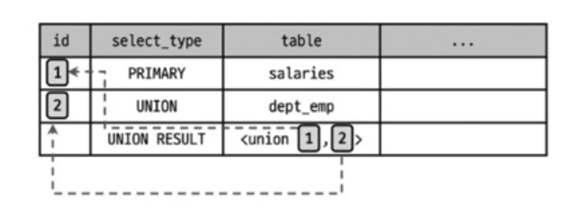
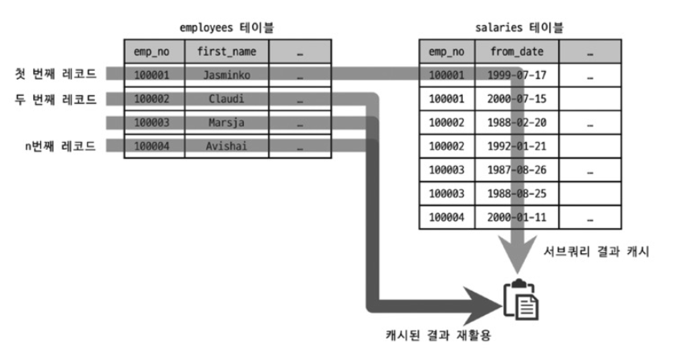

## 실행 계획 포맷

MySQL 8.0부터는 실행 계획을 세 가지 포맷으로 출력할 수 있습니다.

- **TABLE 포맷** (기본): 가장 일반적인 표 형태
- **TREE 포맷**: 실행 순서를 들여쓰기로 표현
- **JSON 포맷**: 상세한 정보를 JSON으로 제공

```sql
-- 기본 TABLE 포맷
EXPLAIN
SELECT *
FROM employees e
INNER JOIN salaries s ON s.emp_no = e.emp_no
WHERE first_name = 'ABC';

-- TREE 포맷
EXPLAIN FORMAT=TREE
SELECT ...;

-- JSON 포맷
EXPLAIN FORMAT=JSON
SELECT ...;
```

**TABLE 포맷 실행 계획 예시**
```
| id | select_type | table | partitions | type | possible_keys | key | key_len | ref | rows | filtered | Extra |
|----|-------------|-------|------------|------|---------------|-----|---------|-----|------|----------|-------|
| 1 | SIMPLE | e | NULL | ref | PRIMARY,ix_firstname | ix_firstname | 58 | const | 1 | 100.00 | NULL |
| 1 | SIMPLE | s | NULL | ref | PRIMARY | PRIMARY | 4 | employees.e.emp_no | 10 | 100.00 | NULL |
```

이 포스트에서는 가독성이 높은 **TABLE 포맷**을 중심으로 설명합니다.

## 실행 계획 읽는 기본 원칙


**기본 규칙**

- 조인 쿼리의 경우 id가 같으며, 위에서 아래로 순서대로 실행됩니다
- 서브쿼리나 UNION이 포함되면 실행 순서가 복잡해지므로 TREE 포맷으로 확인해야 합니다


## id 칼럼

단위 SELECT 쿼리별로 부여되는 식별자입니다.

### 같은 id - 조인

하나의 SELECT 문장에서 여러 테이블을 조인하면 같은 id가 부여됩니다.

```sql
EXPLAIN
SELECT e.emp_no, e.first_name, s.from_date, s.salary
FROM employees e, salaries s
WHERE e.emp_no = s.emp_no LIMIT 10;
```

| id | select_type | table | type | key | ref | rows | Extra |
|----|-------------|-------|------|-----|-----|------|-------|
| 1 | SIMPLE | e | index | ix_firstname | NULL | 300252 | Using index |
| 1 | SIMPLE | s | ref | PRIMARY | employees.e.emp_no | 10 | NULL |

두 테이블 모두 **id=1**로 동일합니다. 같은 SELECT 쿼리 안에서 조인되었기 때문입니다.

### 다른 id - 서브쿼리

서브쿼리가 포함되면 각 단위 SELECT마다 다른 id가 부여됩니다.

```sql
EXPLAIN
SELECT
  ((SELECT COUNT(*) FROM employees) + (SELECT COUNT(*) FROM departments)) AS total_count;
```

| id | select_type | table | type | key | ref | rows | Extra |
|----|-------------|-------|------|-----|------|------|-------|
| 1 | PRIMARY | NULL | NULL | NULL | NULL | NULL | No tables used |
| 3 | SUBQUERY | departments | index | ux_deptname | NULL | 9 | Using index |
| 2 | SUBQUERY | employees | index | ix_hiredate | NULL | 300252 | Using index |

3개의 단위 SELECT 쿼리가 각각 **id=1, 2, 3**을 받았습니다.


### 실행 순서 확인 - TREE 포맷

TABLE 포맷에서는 실행 순서가 헷갈릴 수 있습니다. TREE 포맷을 사용하면 명확합니다.

```sql
EXPLAIN FORMAT=TREE
SELECT * FROM dept_emp de
WHERE de.emp_no = (
    SELECT e.emp_no
    FROM employees e
    WHERE e.first_name = 'Georgi'
      AND e.last_name = 'Facello'
    LIMIT 1
);
```

**TABLE 포맷**

| id | select_type | table | type | key | rows | Extra |
|----|-------------|-------|------|-----|------|-------|
| 1 | PRIMARY | de | ref | ix_empno_fromdate | 1 | Using where |
| 2 | SUBQUERY | e | ref | ix_firstname | 253 | Using where |

TABLE 포맷만 보면 dept_emp가 먼저 실행될 것 같지만, 실제로는 **employees → dept_emp** 순서입니다.

**TREE 포맷**

```
-> Filter: (de.emp_no = (select #2)) (cost=1.10 rows=1)
   -> Index lookup on de using ix_empno_fromdate (emp_no=(select #2)) (cost=1.10 rows=1)
   -> Select #2 (subquery in condition; run only once)
         -> Limit: 1 row(s)
            -> Filter: (e.last_name = 'Facello') (cost=70.49 rows=25)
               -> Index lookup on e using ix_firstname (first_name='Georgi') (cost=70.49 rows=253)
```

가장 들여쓰기가 많은 부분(employees 테이블)부터 실행됩니다.
Index lookup on de가 `emp_no=(select #2)`를 사용하므로, Select #2가 완료되어야 emp_no 값을 알 수 있습니다. 

---

## select_type 칼럼

각 단위 SELECT 쿼리가 어떤 타입인지 표시하는 칼럼입니다.

### SIMPLE

UNION이나 서브쿼리를 사용하지 않는 단순한 SELECT 쿼리입니다. 조인이 포함되어도 SIMPLE입니다.

```sql
SELECT * FROM employees WHERE emp_no = 10001;
```

실행 계획에서 **SIMPLE은 하나만** 존재합니다. 가장 바깥쪽 SELECT가 SIMPLE로 표시됩니다.

### PRIMARY

UNION이나 서브쿼리가 있는 SELECT 쿼리에서 가장 바깥쪽 쿼리입니다.

바깥쪽 SELECT가 **PRIMARY**로 표시되고, **PRIMARY도 하나만** 존재합니다.

### UNION

UNION으로 결합하는 단위 SELECT 중 **두 번째 이후** 쿼리입니다.

```sql
EXPLAIN
SELECT * FROM (
    (SELECT emp_no FROM employees e1 LIMIT 10)
    UNION ALL
    (SELECT emp_no FROM employees e2 LIMIT 10)
    UNION ALL
    (SELECT emp_no FROM employees e3 LIMIT 10)
) tb;
```

| id | select_type | table | type | key | ref | rows | Extra |
|----|-------------|-------|------|-----|-----|------|-------|
| 1 | PRIMARY | \<derived2\> | ALL | NULL | NULL | 30 | NULL |
| 2 | DERIVED | e1 | index | ix_hiredate | NULL | 300252 | Using index |
| 3 | UNION | e2 | index | ix_hiredate | NULL | 300252 | Using index |
| 4 | UNION | e3 | index | ix_hiredate | NULL | 300252 | Using index |

첫 번째(e1)는 DERIVED, 나머지(e2, e3)는 **UNION**입니다.

### DEPENDENT UNION

UNION이면서 외부 쿼리에 의존하는 경우입니다.

#### Before
```sql
EXPLAIN
SELECT *
FROM employees e1
WHERE e1.emp_no IN (
    SELECT e2.emp_no FROM employees e2 WHERE e2.first_name = 'Matt'
    UNION
    SELECT e3.emp_no FROM employees e3 WHERE e3.last_name = 'Matt'
);
```

#### After
```sql
SELECT * FROM employees e1
WHERE EXISTS (
    (SELECT 1 FROM employees e2 
     WHERE e2.first_name = 'Matt' AND e2.emp_no = e1.emp_no)  -- e1 추가됨!
    UNION
    (SELECT 1 FROM employees e3 
     WHERE e3.last_name = 'Matt' AND e3.emp_no = e1.emp_no)   -- e1 추가됨!
);
```

> mysql이 자동으로 **semijoin**으로 변환


| id | select_type | table | type | key | ref | rows | Extra |
|----|-------------|-------|------|-----|-----|------|-------|
| 1 | PRIMARY | e1 | ALL | NULL | NULL | 300252 | Using where |
| 2 | DEPENDENT SUBQUERY | e2 | eq_ref | PRIMARY | func | 1 | Using where |
| 3 | DEPENDENT UNION | e3 | eq_ref | PRIMARY | func | 1 | Using where |
| NULL | UNION RESULT | \<union2,3\> | ALL | NULL | NULL | NULL | Using temporary |

UNION의 두 번째 쿼리(e3)가 외부 쿼리(e1.emp_no)에 의존하므로 **DEPENDENT UNION**입니다.

내부적으로 `e2.emp_no = e1.emp_no`, `e3.emp_no = e1.emp_no` 조건이 자동 추가됩니다.

### UNION RESULT

UNION 결과를 담는 임시 테이블입니다.

```sql
EXPLAIN
SELECT emp_no FROM salaries WHERE salary > 100000
UNION DISTINCT
SELECT emp_no FROM dept_emp WHERE from_date > '2001-01-01';
```

| id | select_type | table | type | key | rows | Extra |
|----|-------------|-------|------|-----|------|-------|
| 1 | PRIMARY | salaries | range | ix_salary | 191348 | Using where; Using index |
| 2 | UNION | dept_emp | range | ix_fromdate | 5325 | Using where; Using index |
| NULL | UNION RESULT | \<union1,2\> | ALL | NULL | NULL | Using temporary |

<union1,2>는 **id=1과 id=2**의 결과를 UNION했다는 의미입니다.

**UNION ALL vs UNION**

```sql
-- UNION ALL은 UNION RESULT 없음
EXPLAIN
SELECT emp_no FROM salaries WHERE salary > 100000
UNION ALL
SELECT emp_no FROM dept_emp WHERE from_date > '2001-01-01';
```



MySQL 8.0부터 UNION ALL은 임시 테이블을 사용하지 않으므로 UNION RESULT가 없습니다.

**그러나 UNION이나 UNION DISTINCT는 여전히 중복 제거를 위해 임시 테이블에서 버퍼링하기에 UNION RESULT가 필요함.**


### SUBQUERY

**FROM 절 이외에서 사용되는 서브쿼리만을 의미합니다.**

```sql
EXPLAIN
SELECT e.first_name,
       (SELECT COUNT(*)
        FROM dept_emp de, dept_manager dm
        WHERE dm.dept_no = de.dept_no) AS cnt
FROM employees e
WHERE e.emp_no = 10001;
```

| id | select_type | table | type | key | rows | Extra |
|----|-------------|-------|------|-----|------|-------|
| 1 | PRIMARY | e | const | PRIMARY | 1 | NULL |
| 2 | SUBQUERY | dm | index | PRIMARY | 24 | Using index |
| 2 | SUBQUERY | de | ref | PRIMARY | 41392 | Using index |


**서브쿼리 용어 정리**

> **서브쿼리는 사용하는 위치에 따라 각각 다른 이름을 지니고 있다.**
>
> - **중첩된 쿼리(Nested Query)**: SELECT되는 칼럼에 사용된 서브쿼리
> - **서브쿼리(Subquery)**: WHERE 절에 사용된 서브쿼리
> - **파생 테이블(Derived Table)**: FROM 절에 사용된 서브쿼리 (인라인 뷰, 서브 셀렉트라고도 함)
>
> **서브쿼리가 반환하는 값의 특성에 따라:**
>
> - **스칼라 서브쿼리(Scalar Subquery)**: 하나의 값만 반환 (칼럼 1개, 레코드 1건)
> - **로우 서브쿼리(Row Subquery)**: 하나의 레코드만 반환 (칼럼 개수 무관)

### DEPENDENT SUBQUERY

서브쿼리가 외부 SELECT 쿼리의 칼럼을 사용하는 경우입니다.

```sql
EXPLAIN
SELECT e.first_name,
       (SELECT COUNT(*)
        FROM dept_emp de, dept_manager dm
        WHERE dm.dept_no = de.dept_no AND de.emp_no = e.emp_no) AS cnt
FROM employees e
WHERE e.first_name = 'Matt';
```

| id | select_type | table | type | key | rows | Extra |
|----|-------------|-------|------|-----|------|-------|
| 1 | PRIMARY | e | ref | ix_firstname | 233 | Using index |
| 2 | DEPENDENT SUBQUERY | de | ref | ix_empno_fromdate | 1 | Using index |
| 2 | DEPENDENT SUBQUERY | dm | ref | PRIMARY | 2 | Using index |

서브쿼리가 외부 쿼리의 `e.emp_no`를 참조하므로 **DEPENDENT SUBQUERY**입니다.

외부 쿼리가 먼저 실행되고, 각 레코드마다 서브쿼리가 실행되므로 일반 SUBQUERY보다 느릴 수 있습니다.

### DERIVED

FROM 절에 사용된 서브쿼리입니다. 임시 테이블(파생 테이블)을 생성합니다.

```sql
EXPLAIN
SELECT *
FROM (SELECT de.emp_no FROM dept_emp de GROUP BY de.emp_no) tb,
     employees e
WHERE e.emp_no = tb.emp_no;
```

| id | select_type | table | type | key | rows | Extra |
|----|-------------|-------|------|-----|------|-------|
| 1 | PRIMARY | \<derived2\> | ALL | NULL | 331143 | NULL |
| 1 | PRIMARY | e | eq_ref | PRIMARY | 1 | NULL |
| 2 | DERIVED | de | index | ix_empno_fromdate | 331143 | Using index |

FROM 절의 서브쿼리(tb)가 **DERIVED**로 표시되고, \<derived2\>라는 임시 테이블이 생성됩니다.

**MySQL 8.0부터는 가능하면 서브쿼리를 조인으로 재작성하여 최적화합니다.**

> 쿼리를 튜닝하기 위해 실행 계획을 확인할 때 가장 먼저 select_type 칼럼의 값이 DERIVED인 것이 있는지 확인해야 한다. 
> \
> \
> **서브쿼리를 조인으로 해결할 수 있는 경우라면 서브쿼리보다는 조인을 사용할 것을 강력히 권장한다.**

### DEPENDENT DERIVED

MySQL 8.0부터 지원하는 래터럴 조인(LATERAL JOIN)에서 사용됩니다.

```sql
SELECT *
FROM employees e
LEFT JOIN LATERAL (
    SELECT *
    FROM salaries s
    WHERE s.emp_no = e.emp_no
    ORDER BY s.from_date DESC
    LIMIT 2
) AS s2 ON s2.emp_no = e.emp_no;
```

| id | select_type | table | type | key | Extra |
|----|-------------|-------|------|-----|-------|
| 1 | PRIMARY | e | ALL | NULL | Rematerialize (\<derived2\>) |
| 1 | PRIMARY | \<derived2\> | ref | \<auto_key0\> | NULL |
| 2 | DEPENDENT DERIVED | s | ref | PRIMARY | Using filesort |

FROM 절의 서브쿼리가 외부 칼럼(e.emp_no)을 참조하므로 **DEPENDENT DERIVED**입니다.

### UNCACHEABLE SUBQUERY

서브쿼리 결과를 캐시할 수 없는 경우입니다.

**서브쿼리 캐시 동작**

- **SUBQUERY**: 처음 한 번만 실행하고 결과를 캐시
- **DEPENDENT SUBQUERY**: 외부 쿼리 값마다 캐시 생성



**캐시 불가능한 경우**

- 사용자 변수 사용
- NOT-DETERMINISTIC 스토어드 루틴 사용
- UUID(), RAND() 같은 비결정적 함수 사용

```sql
EXPLAIN
SELECT *
FROM employees e
WHERE e.emp_no = (
    SELECT @status
    FROM dept_emp de
    WHERE de.dept_no = 'd005'
);
```

| id | select_type | table | type | key | rows | Extra |
|----|-------------|-------|------|-----|------|-------|
| 1 | PRIMARY | e | ALL | NULL | 300252 | Using where |
| 2 | UNCACHEABLE SUBQUERY | de | ref | PRIMARY | 165571 | Using index |

사용자 변수 `@status`를 사용하므로 **UNCACHEABLE SUBQUERY**입니다.

### UNCACHEABLE UNION

UNION이면서 캐시할 수 없는 경우입니다. UNION과 UNCACHEABLE의 속성을 모두 가집니다.

### MATERIALIZED

MySQL 5.7부터 IN(subquery)나 FROM 절 서브쿼리를 임시 테이블로 구체화하여 최적화합니다.

```sql
EXPLAIN
SELECT *
FROM employees e
WHERE e.emp_no IN (
    SELECT emp_no FROM salaries WHERE salary BETWEEN 100 AND 1000
);
```

| id | select_type | table | type | key | rows | Extra |
|----|-------------|-------|------|-----|------|-------|
| 1 | SIMPLE | \<subquery2\> | ALL | NULL | NULL | NULL |
| 1 | SIMPLE | e | eq_ref | PRIMARY | 1 | NULL |
| 2 | MATERIALIZED | salaries | range | ix_salary | 1 | Using where; Using index |

서브쿼리 내용이 임시 테이블로 **구체화**(Materialization)되어 employees 테이블과 조인됩니다.

**MySQL 5.6까지는 employees 테이블의 각 레코드마다 서브쿼리를 실행했지만, 5.7부터는 서브쿼리를 먼저 구체화한 후 조인하므로 성능이 개선되었습니다.**
