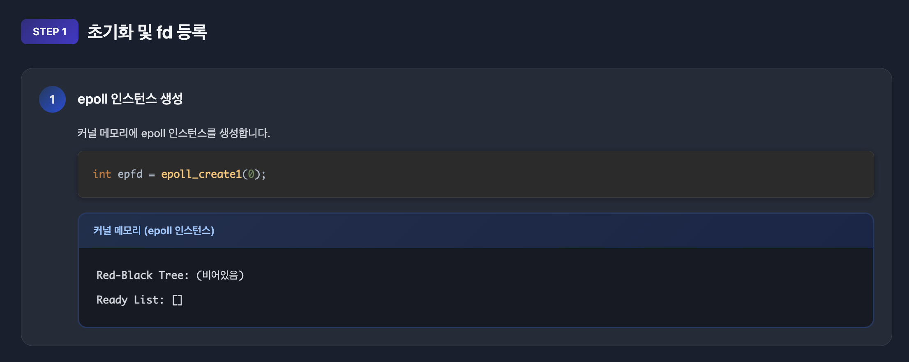
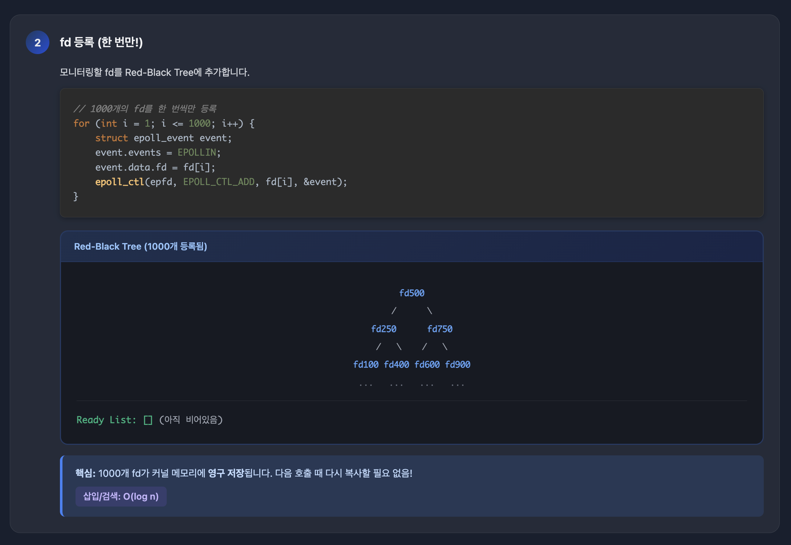
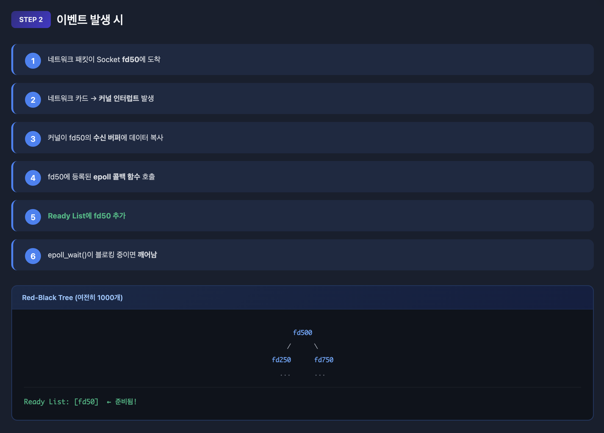
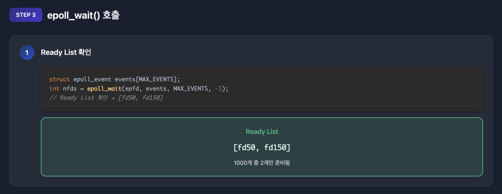
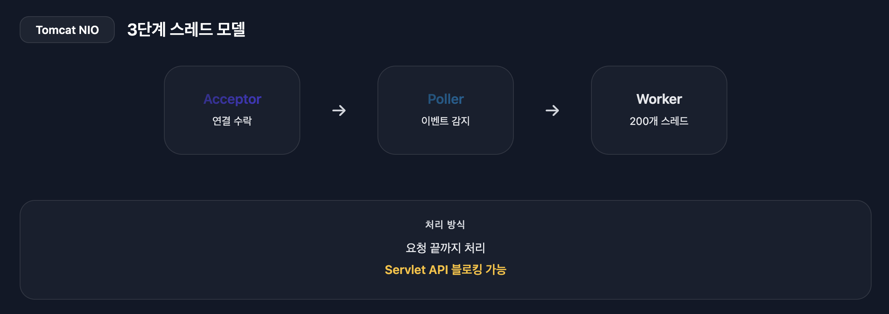
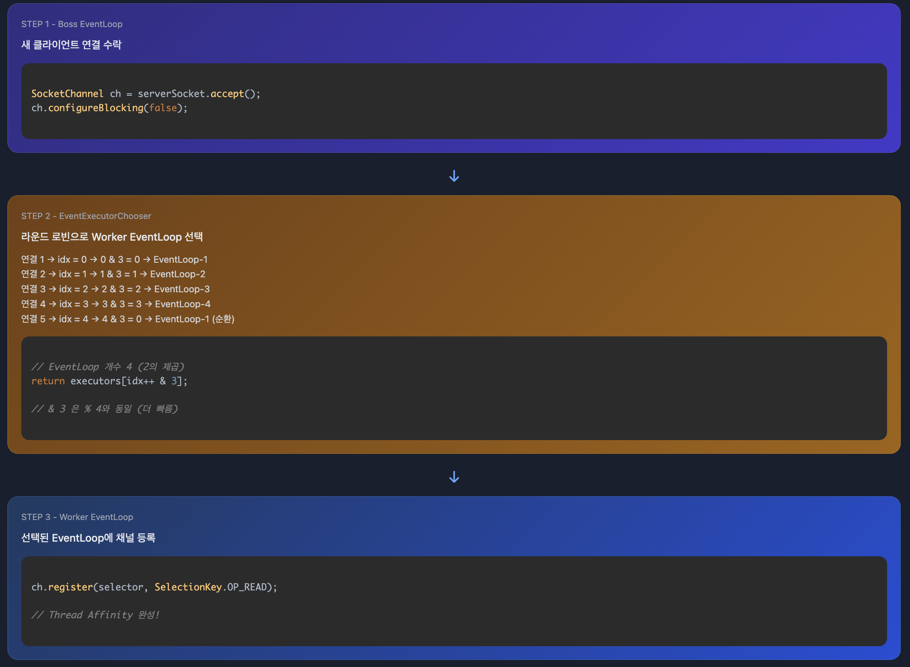
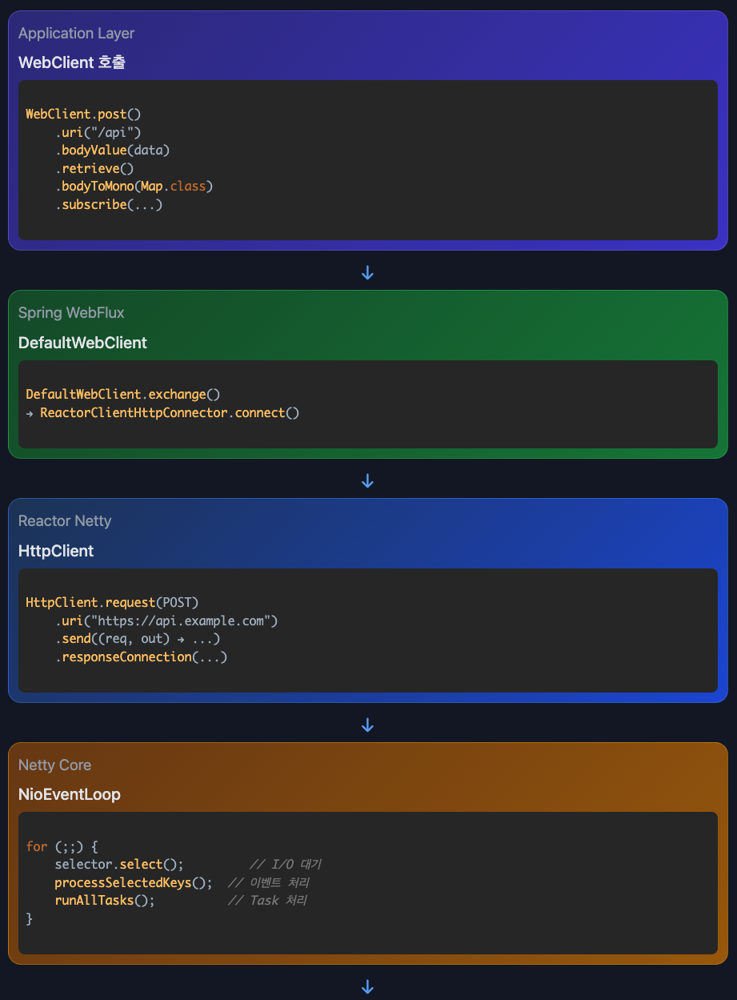
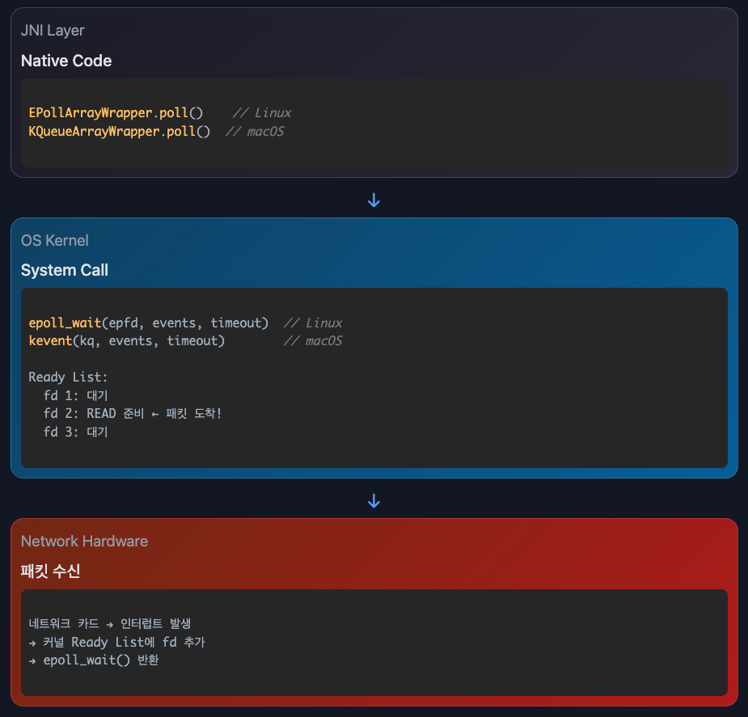

# Netty 이벤트 루프

Selector 기초부터 OS 레벨 동작, Tomcat NIO vs Netty 구현, WebClient까지 모든 것을 다룹니다.

---

## Selector란 무엇인가

### 개념

**Selector**는 단일 스레드로 여러 채널의 I/O 이벤트를 모니터링하는 Java NIO의 핵심 컴포넌트입니다.

```
전통적인 블로킹 I/O (BIO)
Thread 1 → Socket 1 (blocking read...)
Thread 2 → Socket 2 (blocking read...)
Thread 3 → Socket 3 (blocking read...)
...
Thread 1000 → Socket 1000 (blocking read...)

문제: 1000개 연결 = 1000개 스레드 = 메모리 부족
```

```
Selector 기반 논블로킹 I/O (NIO)
        Selector (1개 스레드)
            ↓
    ┌───────┼───────┐
Channel 1 Channel 2 Channel 3 ... Channel 1000
(wait)    (ready!)   (wait)         (wait)

해결: 1000개 연결 = 1개 스레드 = 메모리 효율적
```

### Selector의 역할

1. **채널 등록**: 여러 채널을 Selector에 등록
2. **이벤트 감시**: 등록된 채널의 I/O 이벤트 모니터링
3. **준비된 채널 선택**: I/O 가능한 채널만 선택
4. **이벤트 처리**: 선택된 채널에 대해 I/O 작업 수행

### SelectionKey의 이벤트 타입

```java
SelectionKey.OP_ACCEPT   // 서버가 클라이언트 연결 수락 가능
SelectionKey.OP_CONNECT  // 클라이언트가 서버 연결 완료
SelectionKey.OP_READ     // 채널에서 데이터 읽기 가능
SelectionKey.OP_WRITE    // 채널에 데이터 쓰기 가능
```

---

## OS 레벨 I/O 멀티플렉싱

### System Call의 진화

#### 1단계: select() (초기)

**select**는 I/O 멀티플렉싱을 구현하는 시스템 콜입니다.

**I/O 멀티플렉싱**이란 하나의 스레드로 여러 I/O 채널(소켓)을 동시에 모니터링하는 기술입니다. select()는 그 기술을 실제로 구현한 가장 초기의 시스템 콜입니다.

```
전통적인 방식:              select() 방식:
Thread 1 → Socket 1        1개 Thread
Thread 2 → Socket 2            ↓
Thread 3 → Socket 3        select([Socket 1, 2, 3, ...])
...                            ↓
Thread 1000 → Socket 1000  "Socket 2가 준비됨!"
                               ↓
1000개 스레드 필요         1개 스레드로 처리
```

```c
// Linux select() system call
int select(int nfds,
           fd_set *readfds,    // 읽기 가능한 파일 디스크립터
           fd_set *writefds,   // 쓰기 가능한 파일 디스크립터
           fd_set *exceptfds,  // 예외 발생한 파일 디스크립터
           struct timeval *timeout);
```

**문제점**:
- fd_set 크기 제한 (일반적으로 1024개)
- 매번 전체 fd_set을 커널로 복사 (O(n))
- 준비된 fd를 찾기 위해 전체 순회 필요

**select() 동작 과정 (매 호출마다 반복)**

```
1. User Space → Kernel Space
   fd_set 전체를 복사 (1000개 등록되어 있으면 1000개 전부)

2. Kernel에서 처리
   각 fd를 순회하며 이벤트 발생 여부 확인

3. Kernel Space → User Space
   결과를 다시 복사 (준비된 fd 개수와 무관하게 전체 fd_set)
```

**핵심 문제**: 1000개의 fd가 등록되어 있는데 1개만 준비되어도, 1000개 전부를 왕복 복사해야 합니다.

#### 2단계: poll() (개선)

```c
// Linux poll() system call
int poll(struct pollfd *fds,  // 파일 디스크립터 배열
         nfds_t nfds,          // 배열 크기
         int timeout);

struct pollfd {
    int fd;           // 파일 디스크립터
    short events;     // 관심 이벤트
    short revents;    // 실제 발생한 이벤트
};
```

**개선점**:
- fd 개수 제한 없음
- 비트마스크 대신 구조체 배열 사용

**여전한 문제**:
- 매번 전체 배열을 커널로 복사 (O(n))
- 준비된 fd를 찾기 위해 전체 순회

#### 3단계: epoll() (Linux 최적화)

**과정**







```c
// epoll 생성
int epfd = epoll_create1(0);

// fd 등록 (한 번만!)
struct epoll_event event;
event.events = EPOLLIN;  // 읽기 이벤트
event.data.fd = sockfd;
epoll_ctl(epfd, EPOLL_CTL_ADD, sockfd, &event);

// 이벤트 대기
struct epoll_event events[MAX_EVENTS];
int nfds = epoll_wait(epfd, events, MAX_EVENTS, timeout);

// 준비된 fd만 반환됨! (O(1) 조회)
for (int i = 0; i < nfds; i++) {
    if (events[i].events & EPOLLIN) {
        // 읽기 가능한 소켓 처리
        int fd = events[i].data.fd;
        read(fd, buffer, size);
    }
}
```

**핵심 개선**:
- fd를 커널에 한 번만 등록
- 준비된 fd만 반환 (O(1) 조회)
- Red-Black Tree로 fd 관리
- Ready List에 준비된 fd만 추가

##### epoll의 3가지 시스템 콜

epoll은 단일 시스템 콜이 아니라 **3개의 시스템 콜의 조합**입니다.

**1. epoll_create1() - epoll 인스턴스 생성**

```c
int epfd = epoll_create1(0);
```

커널 내부에 epoll 인스턴스를 생성합니다. 이 인스턴스는 Red-Black Tree와 Ready List를 포함합니다.

**2. epoll_ctl() - 파일 디스크립터 등록/수정/삭제**

```c
struct epoll_event event;
event.events = EPOLLIN;  // 관심 이벤트
event.data.fd = sockfd;

// 등록
epoll_ctl(epfd, EPOLL_CTL_ADD, sockfd, &event);

// 수정
epoll_ctl(epfd, EPOLL_CTL_MOD, sockfd, &event);

// 삭제
epoll_ctl(epfd, EPOLL_CTL_DEL, sockfd, NULL);
```

Red-Black Tree에 fd를 등록하거나 관심 이벤트를 수정합니다.

**3. epoll_wait() - 이벤트 대기**

```c
struct epoll_event events[MAX_EVENTS];
int nfds = epoll_wait(epfd, events, MAX_EVENTS, timeout);
```

Ready List에 준비된 fd가 있는지 확인합니다. 없으면 **블로킹됩니다**.

##### epoll_wait()의 블로킹 동작

**epoll_wait()는 의도적으로 블로킹됩니다**.

```c
// timeout 예시
epoll_wait(epfd, events, MAX_EVENTS, -1);     // 무한 대기 (이벤트 올 때까지)
epoll_wait(epfd, events, MAX_EVENTS, 0);      // 즉시 반환 (논블로킹)
epoll_wait(epfd, events, MAX_EVENTS, 5000);   // 5초 대기
```

**블로킹되는 이유**:
- **이벤트를 기다리는 것이 목적**이기 때문입니다
- Ready List가 비어있으면 스레드를 재우고 대기합니다
- 이벤트 발생 시 커널이 스레드를 깨웁니다

**이벤트 대기 vs I/O 작업**:
```
[이벤트 대기]
epoll_wait() → 블로킹 (이벤트 올 때까지 대기)
    ↓
패킷 도착!
    ↓
epoll_wait() 반환

[I/O 작업]
read(fd, buffer, size) → 논블로킹 (데이터가 이미 준비됨)
    ↓
즉시 읽기 완료
```

**핵심**: 이벤트 대기는 항상 블로킹이지만, 실제 I/O 작업(read/write)은 논블로킹입니다.

##### Java NIO Selector와 epoll 매핑

Java NIO Selector API는 내부적으로 epoll 시스템 콜로 변환됩니다.

```java
// 1. Selector.open() → epoll_create1()
Selector selector = Selector.open();
//   ↓ JNI
// int epfd = epoll_create1(0);

// 2. channel.register() → epoll_ctl(EPOLL_CTL_ADD)
ServerSocketChannel serverSocket = ServerSocketChannel.open();
serverSocket.register(selector, SelectionKey.OP_ACCEPT);
//   ↓ JNI
// struct epoll_event event;
// event.events = EPOLLIN;
// epoll_ctl(epfd, EPOLL_CTL_ADD, fd, &event);

// 3. selector.select() → epoll_wait()
int readyChannels = selector.select();  // 블로킹!
//   ↓ JNI
// int nfds = epoll_wait(epfd, events, MAX_EVENTS, -1);

// 4. selector.select(timeout) → epoll_wait(timeout)
int readyChannels = selector.select(5000);  // 5초 대기
//   ↓ JNI
// int nfds = epoll_wait(epfd, events, MAX_EVENTS, 5000);

// 5. selector.selectNow() → epoll_wait(0)
int readyChannels = selector.selectNow();  // 즉시 반환
//   ↓ JNI
// int nfds = epoll_wait(epfd, events, MAX_EVENTS, 0);
```

**Java NIO Selector의 3단계**:
```
1. Selector.open()
   → epoll_create1()
   → 커널에 epoll 인스턴스 생성

2. channel.register(selector, ops)
   → epoll_ctl(EPOLL_CTL_ADD)
   → Red-Black Tree에 fd 등록

3. selector.select()
   → epoll_wait()
   → Ready List 확인 (블로킹 대기)
```

##### 전통적인 블로킹 I/O vs 이벤트 기반 I/O

**전통적인 블로킹 I/O**: I/O 작업에서 블로킹

```java
// 전통적인 블로킹 I/O
ServerSocket serverSocket = new ServerSocket(8080);

while (true) {
    Socket socket = serverSocket.accept();  // 블로킹 1: 연결 대기

    new Thread(() -> {
        try {
            InputStream in = socket.getInputStream();
            byte[] buffer = new byte[1024];

            while (true) {
                int bytesRead = in.read(buffer);  // 블로킹 2: 데이터 대기
                if (bytesRead == -1) break;

                // 데이터 처리
                socket.getOutputStream().write(buffer, 0, bytesRead);
            }
        } catch (IOException e) {
            e.printStackTrace();
        }
    }).start();
}

// 문제점:
// - 1000개 연결 = 1000개 스레드
// - 각 스레드가 read()에서 블로킹
// - 메모리 낭비 (스레드당 1MB 스택)
```

**이벤트 기반 논블로킹 I/O**: Tomcat NIO (스레드 분리)

```java
// Acceptor 스레드 (1개): 연결 수락 전담
class Acceptor implements Runnable {
    public void run() {
        while (running) {
            SocketChannel socket = serverSocket.accept();  // 블로킹: 연결 대기
            socket.configureBlocking(false);

            // Poller에게 소켓 등록 요청
            poller.register(socket);
        }
    }
}

// Poller 스레드 (1-2개): 이벤트 감지 전담
class Poller implements Runnable {
    private Selector selector = Selector.open();

    public void run() {
        while (running) {
            selector.select();  // 블로킹: 이벤트 대기

            Iterator<SelectionKey> iterator = selector.selectedKeys().iterator();
            while (iterator.hasNext()) {
                SelectionKey key = iterator.next();
                iterator.remove();

                if (key.isReadable()) {
                    // Worker 스레드 풀에 작업 위임
                    workerExecutor.execute(new SocketProcessor(key));
                }
            }
        }
    }

    public void register(SocketChannel socket) {
        socket.register(selector, SelectionKey.OP_READ);
    }
}

// Worker 스레드 (200개 기본값): 실제 I/O 및 비즈니스 로직 처리
class SocketProcessor implements Runnable {
    public void run() {
        ByteBuffer buffer = ByteBuffer.allocate(8192);
        int bytesRead = socket.read(buffer);  // 논블로킹: 즉시 읽기

        // HTTP 파싱, Servlet 실행, 응답 생성
        processRequest(buffer);

        socket.write(responseBuffer);  // 논블로킹: 즉시 쓰기
    }
}

// 장점:
// - 역할 분리: Acceptor(연결) / Poller(이벤트) / Worker(처리)
// - 1000개 연결 = 3개 스레드 (Acceptor 1 + Poller 1-2 + Worker 필요시)
// - Poller는 이벤트만 감지, 실제 작업은 Worker 풀 사용
// - 메모리 효율적
```

**핵심 차이**:

```
[전통적인 블로킹 I/O]
accept() → 블로킹 (연결 대기)
read() → 블로킹 (데이터 대기)
write() → 블로킹 (버퍼 공간 대기)

→ 스레드가 I/O 작업마다 블로킹됨
→ 1000개 연결 = 1000개 스레드 필요

[Tomcat NIO - 이벤트 기반 + 스레드 분리]
Acceptor: serverSocket.accept() → 블로킹 (연결 대기)
Poller: selector.select() → 블로킹 (이벤트 대기)
Worker: read() → 논블로킹 (데이터 준비됨)
Worker: write() → 논블로킹 (버퍼 준비됨)

→ Acceptor/Poller는 블로킹, 실제 I/O는 논블로킹
→ 1000개 연결 = 3개 스레드 (Acceptor 1 + Poller 1-2 + Worker 필요시)
```

#### 4단계: kqueue() (BSD/macOS)

```c
// kqueue 생성
int kq = kqueue();

// 이벤트 등록
struct kevent change;
EV_SET(&change, sockfd, EVFILT_READ, EV_ADD, 0, 0, NULL);
kevent(kq, &change, 1, NULL, 0, NULL);

// 이벤트 대기
struct kevent event;
int nev = kevent(kq, NULL, 0, &event, 1, NULL);

if (nev > 0 && event.filter == EVFILT_READ) {
    // 읽기 가능
    read(event.ident, buffer, size);
}
```

### Java NIO와 OS의 연결

```
      Java Selector.select()
                ↓
    JNI (Java Native Interface)
                ↓
┌──────────────────────────────────┐
│   Linux    │   macOS   │ Windows │
│   epoll()  │  kqueue() │  IOCP   │
└──────────────────────────────────┘
                ↓
      커널이 파일 디스크립터 모니터링
                ↓
       네트워크 카드에서 패킷 도착
                ↓
          커널 인터럽트 발생
                ↓
        Ready List에 fd 추가
                ↓
         epoll_wait() 반환
                ↓
      Java Selector.select() 반환
```

### OS별 구현 차이

| OS | System Call | 특징 |
|---|---|---|
| Linux | epoll | Red-Black Tree, O(1) 조회 |
| macOS/BSD | kqueue | Event-driven, 파일 시스템 감시도 가능 |
| Windows | IOCP | Completion 기반, 비동기 I/O |

---

## Tomcat NIO 구현

Tomcat의 Acceptor/Poller/Worker 스레드 모델과 실제 구현 코드는 [Tomcat 요청 처리 흐름](/tomcat-request-flow/#nio-thread-모델)을 참고하세요.

---

## Netty vs Tomcat NIO

Tomcat과 Netty는 둘 다 Java NIO를 사용하지만, 스레드 모델과 최적화 방식이 다릅니다.

### 핵심 차이점

#### 톰캣 구조


#### netty 구조


**Netty의 Thread Affinity:**



각 채널은 생성 시 특정 EventLoop에 할당되고, 해당 채널의 모든 I/O 이벤트는 항상 동일한 EventLoop에서 처리됩니다.

```
EventLoopGroup (8개 스레드)
├── EventLoop-1 (스레드 1)
│   ├── Channel A → 모든 이벤트 항상 여기서 처리
│   └── Channel B
│
├── EventLoop-2 (스레드 2)
│   └── Channel C
│
├── EventLoop-3 (스레드 3)
    ├── Channel D
    ├── Channel E
    └── Channel F
```

**장점:**
- 스레드 안전성: 동일 채널은 항상 같은 스레드 → 락 불필요
- 순서 보장: 이벤트 처리 순서 보장
- CPU 캐시 친화성: 같은 채널 데이터가 같은 CPU 캐시에 유지

**Tomcat과의 차이:**
```
Tomcat: 요청마다 Worker 풀에서 임의 할당
Request 1 → Worker-5
Request 2 → Worker-3 (같은 연결인데 다른 스레드)
Request 3 → Worker-7

Netty: 채널당 고정 EventLoop
Channel A의 모든 이벤트 → EventLoop-1 (항상 동일)
```

**2. Selector 최적화**

```java
// Tomcat: 기본 Java NIO Selector
Set<SelectionKey> keys = selector.selectedKeys();
Iterator<SelectionKey> it = keys.iterator();

// Netty: Selector 내부를 Array로 교체
for (int i = 0; i < selectedKeys.size; ++i) {
    SelectionKey key = selectedKeys.keys[i];
}
// Array는 연속된 메모리 공간 → CPU 캐시 지역성 향상
```

**3. I/O 처리 방식**

핵심 차이는 **요청 바디를 읽는 방식**입니다.

**Tomcat: 전체 바디를 다 받을 때까지 Worker 스레드 블로킹**

```java
worker.execute(() -> {
    // HTTP 파싱 (논블로킹)
    HttpServletRequest request = parseRequest(socket);

    // Servlet 호출 (블로킹 가능)
    InputStream in = request.getInputStream();
    byte[] body = in.readAllBytes();  // 전체 바디를 다 받을 때까지 블로킹!

    // 10MB 바디가 천천히 도착하면?
    // → Worker 스레드가 계속 대기
    // → 다른 요청 처리 불가
});
```

**Netty: 바디를 논블로킹으로 조각조각 읽음**

```java
channel.pipeline()
    .addLast(new HttpServerCodec())        // 논블로킹 디코딩
    .addLast(new MyHandler() {
        @Override
        public void channelRead(ChannelHandlerContext ctx, Object msg) {
            // 소켓에 준비된 만큼 읽음 (가변적: 100바이트 ~ 수KB)
            // → channelRead() 호출
            // 또 준비된 만큼 읽음 → channelRead() 다시 호출
            // ...반복...

            // HttpServerCodec이 조각들을 모아서
            // 완전한 HttpRequest로 만들어서 전달
            HttpRequest request = (HttpRequest) msg;

            // EventLoop 스레드는 즉시 리턴
            // 다른 채널의 이벤트 처리 가능
        }
    });
```

**처리 방식 비교:**

```
[Tomcat]
10MB 바디 천천히 도착
→ Worker 스레드가 전체 받을 때까지 블로킹
→ 해당 스레드는 다른 요청 처리 불가

[Netty]
10MB 바디 천천히 도착
→ 준비된 만큼 읽을 때마다 channelRead() 호출 (가변적)
→ EventLoop 스레드는 즉시 반환
→ 다른 수천 개 채널 처리 가능
```

### Netty가 하는 것 vs 개발자가 하는 것

#### 핵심 구분

**Netty가 자동으로 하는 것**

네트워크 I/O의 비동기 처리만 담당합니다.

- `selector.select()` 실행 (이벤트 감지)
- `channel.read()` 실행 (소켓에서 데이터 읽기)
- `pipeline.fireChannelRead()` 실행 (Handler 체인 호출)
- `ctx.writeAndFlush()` 네트워크 전송

**개발자가 작성해야 하는 것**

Handler 구현과 비즈니스 로직의 비동기 처리를 담당해야 합니다.

- Pipeline에 Handler 추가
- Handler 구현 (channelRead 메서드)
- 비동기 DB 조회 (CompletableFuture 등)
- 비즈니스 로직

**개발자가 아무 Handler도 추가하지 않으면?**

Pipeline이 비어있어서 데이터가 그냥 버려집니다. Netty는 Handler 체인을 실행할 뿐, Handler 자체를 제공하지 않습니다.

#### 실제 코드 예시 (GPT API 호출 및 DB 저장)

**서버 시작 시 Pipeline 설정**

```java
// 개발자가 작성
channel.pipeline()
    .addLast(new HttpServerCodec())      // Netty 제공
    .addLast(new MyHandler(gptClient, dbExecutor)); // 개발자 구현
```

**MyHandler 구현**

```java
public class MyHandler extends ChannelInboundHandlerAdapter {
    private final GptClient gptClient;
    private final ExecutorService dbExecutor;

    @Override
    public void channelRead(ChannelHandlerContext ctx, Object msg) {
        HttpRequest request = (HttpRequest) msg;

        // GPT API 호출 (논블로킹)
        gptClient.callAsync(request)
            .thenCompose(gptResponse ->
                // GPT 응답을 DB에 저장 (블로킹, 별도 스레드 풀)
                CompletableFuture.supplyAsync(() ->
                    chatHistoryRepository.save(new ChatHistory(gptResponse)), dbExecutor
                ).thenApply(savedHistory -> gptResponse)
            )
            .thenAccept(gptResponse -> {
                HttpResponse response = createResponse(gptResponse);
                ctx.writeAndFlush(response);  // EventLoop의 taskQueue에 제출
            });

        // 즉시 리턴! EventLoop 스레드는 다른 채널 처리 가능
    }
}
```

**스레드 흐름**

```
1. EventLoop 스레드: channelRead() 호출
2. EventLoop 스레드: GPT API 비동기 호출하고 즉시 리턴
3. EventLoop 스레드: GPT 응답 수신 (논블로킹)
4. dbExecutor 스레드: DB 저장 (블로킹)
5. dbExecutor 스레드: thenAccept() 콜백 실행
6. dbExecutor 스레드: ctx.writeAndFlush() → EventLoop에 Task 제출
7. EventLoop 스레드: Task 실행하여 네트워크 전송
```

#### 잘못된 예시 (EventLoop 블로킹)

```java
// ❌ 잘못된 코드: 동기 블로킹 작업
@Override
public void channelRead(ChannelHandlerContext ctx, Object msg) {
    HttpRequest request = (HttpRequest) msg;

    // EventLoop 스레드가 GPT 응답 올 때까지 블로킹!
    GptResponse gptResponse = gptClient.callSync(request);  // 블로킹!

    // DB 저장까지 블로킹!
    chatHistoryRepository.save(new ChatHistory(gptResponse));  // 블로킹!

    // 다른 수천 개 채널도 같이 대기
    // Netty의 장점 완전히 상실!

    HttpResponse response = createResponse(gptResponse);
    ctx.writeAndFlush(response);
}
```

**결과**: EventLoop 스레드 1개가 GPT API 응답 대기 및 DB 저장까지 블로킹되고, 해당 EventLoop가 담당하는 수천 개의 다른 채널도 함께 대기하게 됩니다. Tomcat과 다를 바 없습니다.

**4. Task 처리**

**EventLoop의 이중 역할**

Netty의 EventLoop는 두 가지 작업을 처리합니다.

1. **I/O 이벤트 처리**: Selector를 통해 소켓의 읽기/쓰기 이벤트 처리
2. **Task 처리**: taskQueue에 제출된 일반 작업 처리

**taskQueue가 필요한 이유**

다른 스레드에서 EventLoop 스레드에게 작업을 요청할 때 사용됩니다.

```java
// 예: GPT 응답 받고 DB 저장 후 응답 전송
gptClient.callAsync(request)
    .thenCompose(gptResponse ->
        CompletableFuture.supplyAsync(() ->
            chatHistoryRepository.save(new ChatHistory(gptResponse)), dbExecutor
        ).thenApply(savedHistory -> gptResponse)
    )
    .thenAccept(gptResponse -> {
        HttpResponse response = createResponse(gptResponse);
        ctx.writeAndFlush(response);  // ← dbExecutor 스레드가 호출
    });
```

`ctx.writeAndFlush()`는 네트워크 I/O 작업이므로 반드시 EventLoop 스레드에서 실행되어야 합니다. 하지만 호출한 스레드는 dbExecutor 스레드입니다.

Netty는 이를 해결하기 위해 다른 스레드가 `ctx.writeAndFlush()`를 호출하면 자동으로 해당 작업을 Task로 변환하여 EventLoop의 taskQueue에 제출합니다.

**Tomcat과의 차이**

```java
// Tomcat: Worker 스레드가 모든 작업을 순차 처리
read() → 파싱 → 비즈니스 로직 → 응답 생성 → write()
// I/O와 비즈니스 로직이 분리되지 않음

// Netty: I/O와 Task를 비율에 따라 처리
long ioStartTime = System.nanoTime();
processSelectedKeys();  // I/O 이벤트 처리 (읽기/쓰기)

long ioTime = System.nanoTime() - ioStartTime;
runAllTasks(ioTime * (100 - ioRatio) / ioRatio);  // Task 처리
// I/O:Task = 50:50 (ioRatio 기본값)
```

**ioRatio의 의미**

ioRatio가 50이면 I/O 처리에 10ms가 걸렸을 때 Task 처리에도 10ms를 할당합니다. 이를 통해 I/O 이벤트와 Task 모두 공정하게 처리할 수 있습니다.

I/O만 집중 처리하면 taskQueue에 쌓인 작업들이 지연되고, Task만 처리하면 네트워크 I/O가 지연됩니다. ioRatio는 이 균형을 조절합니다.

**5. 안정성**

```java
// Netty: JDK epoll bug 자동 감지 및 복구
if (unexpectedSelectorWakeup(selectCnt)) {
    rebuildSelector();  // Selector 재구성
    selectCnt = 0;
}

// Tomcat: 기본 JDK Selector에 의존
```

---
## 코드 비교 분석

### 1. Selector 생성

| 항목 | Tomcat NIO | Netty |
|---|---|---|
| 생성 | `Selector.open()` | `provider.openSelector()` + 최적화 |
| 최적화 | 없음 | selectedKeys를 Set → Array로 교체 |
| 코드 | 1줄 | ~60줄 (Reflection 포함) |

### 2. 이벤트 루프 구조

| 항목 | Tomcat NIO | Netty |
|---|---|---|
| 무한 루프 | `while(true)` | `for(;;)`|
| select() | 매번 호출 | 전략 패턴 (Task 있으면 skip) |
| Task 처리 | 없음 | I/O와 Task 비율 조절 (ioRatio) |
| 예외 처리 | 기본 try-catch | epoll bug 감지 및 재구성 |

**Netty의 select() 전략 상세**

Task 유무에 따라 블로킹 여부를 결정합니다.

```java
// Task가 없을 때: I/O 이벤트 대기
if (!hasTasks()) {
    selector.select(timeout);  // 블로킹: I/O 이벤트 올 때까지 대기
    processSelectedKeys();     // I/O 처리
}

// Task가 있을 때: 블로킹 스킵
if (hasTasks()) {
    selector.selectNow();      // 논블로킹: 즉시 확인하고 리턴
    processSelectedKeys();     // I/O 이벤트 있으면 처리
    runAllTasks();             // Task 처리
}
```

**왜 Task가 있어도 selectNow()를 하나?**

Task만 처리하면 네트워크 I/O 이벤트를 놓치기 때문입니다.

```java
// 잘못된 예시: select() 없이 Task만 처리
while (hasTasks()) {
    runAllTasks();  // Task만 계속 처리
}
// 이 동안 클라이언트가 보낸 요청은?
// → 읽지 못함! 클라이언트는 응답 못 받고 타임아웃

// 올바른 예시: selectNow()로 I/O도 확인
if (hasTasks()) {
    selector.selectNow();      // I/O 이벤트 빠르게 확인
    processSelectedKeys();     // 있으면 처리
    runAllTasks();             // Task 처리
}
```

`selectNow()`는 I/O 이벤트가 있으면 가져오고, 없으면 0을 반환하고 즉시 리턴합니다. Task를 빨리 처리하면서도 I/O 이벤트를 놓치지 않는 전략입니다.

### 3. selectedKeys 순회

| 항목 | Tomcat NIO | Netty (최적화) |
|---|---|---|
| 자료구조 | `Set<SelectionKey>` | `SelectionKey[]` |
| 순회 | Iterator | 배열 인덱스 |
| 성능 | Iterator 생성 오버헤드 | 캐시 친화적 순차 접근 |


### 4. 스레드 모델

| 항목 | Tomcat NIO | Netty |
|---|---|---|
| 구조 | Acceptor + Poller + Worker 분리 | Boss + Worker EventLoopGroup |
| Worker 스레드 | 200개 (기본값) | CPU 코어 * 2 (기본값) |
| 스레드 안전성 | 동기화 필요 | Thread Affinity로 자동 보장 |
| 작업 제출 | Worker 스레드 풀 | EventLoop.execute(Runnable) |

---

## WebClient에서 Netty까지

### 전체 호출 스택




### Pipeline과 Handler

**Pipeline**은 Handler들을 담는 컨테이너(체인 구조)이고, **Handler**는 Pipeline에 추가되는 개별 처리 단위입니다.

#### 관계 구조

```java
// 1. Pipeline 생성 및 Handler 추가
ChannelPipeline pipeline = channel.pipeline();
pipeline.addLast("codec", new HttpClientCodec());           // Handler 1
pipeline.addLast("aggregator", new HttpObjectAggregator()); // Handler 2
pipeline.addLast("reactor", new ReactorNettyHandler());     // Handler 3

// 2. 이벤트 발생 시 Pipeline이 Handler들을 순차 실행
pipeline.fireChannelRead(buffer);
//   ↓
// HttpClientCodec.channelRead() 실행
//   ↓
// HttpObjectAggregator.channelRead() 실행
//   ↓
// ReactorNettyHandler.channelRead() 실행
```

#### 실제 동작

```java
// Channel 생성 시 Bootstrap에서 Handler 등록
Bootstrap b = new Bootstrap();
b.handler(new ChannelInitializer<>() {
    @Override
    protected void initChannel(Channel ch) {
        ChannelPipeline p = ch.pipeline();

        // Handler들을 Pipeline에 순서대로 추가
        p.addLast(new HttpClientCodec());
        p.addLast(new HttpObjectAggregator(8192));
        p.addLast(new ReactorNettyHandler());
    }
});

// 데이터 읽을 때
socketChannel.read(buffer);  // OS에서 데이터 읽기
pipeline.fireChannelRead(buffer);  // Pipeline의 모든 Handler 순차 실행
```

**정리:**
- **Pipeline**: Handler들의 연결 고리 (LinkedList 구조)
- **Handler**: 실제 데이터 처리 로직 (HTTP 파싱, 압축, 암호화 등)
- `fireChannelRead()`: Pipeline의 첫 Handler부터 마지막 Handler까지 순차 호출

### WebClient가 자동으로 설정하는 Handler

WebClient를 사용하면 Spring이 다음 Handler들을 자동으로 Pipeline에 추가합니다.

```java
// Spring WebClient 내부에서 자동으로 실행
channel.pipeline()
    .addLast(new HttpClientCodec())           // Spring이 자동 추가
    .addLast(new HttpObjectAggregator(256KB)) // Spring이 자동 추가
    .addLast(new ReactorNettyHandler());      // Spring이 자동 추가
```

**각 Handler의 역할:**

1. **HttpClientCodec**: HTTP 메시지를 바이트로 변환(인코딩) 또는 바이트를 HTTP 메시지로 변환(디코딩)
2. **HttpObjectAggregator**: HTTP 청크 전송으로 조각조각 들어온 데이터를 하나의 완전한 응답으로 병합
3. **ReactorNettyHandler**: HTTP 응답을 Mono/Flux로 변환하여 리액티브 스트림 제공

**청크 병합 예시:**

```
서버가 전송:
Chunk 1: "Hello "
Chunk 2: "World"
Chunk 3: "!"

HttpObjectAggregator가 병합
→ 최종 결과: "Hello World!"
```

개발자는 그냥 `webClient.get()`만 하면 됩니다. Spring이 모든 Handler 설정을 자동으로 처리합니다.

### Codec과 Connector

#### Codec (webclient)

**HTTP 메시지 ↔ 바이트 변환**을 담당합니다.

```java
// 인코딩 (요청 전송)
User user = new User("John");
→ Codec: Object를 JSON 바이트로 변환
→ {"name":"John"}
→ 네트워크 전송

// 디코딩 (응답 수신)
네트워크에서 바이트 수신
→ {"name":"John"}
→ Codec: JSON 바이트를 User 객체로 변환
→ User user = ...
```

**설정 예시:**

```java
@Bean
public WebClient webClient() {
    return WebClient.builder()
        .codecs(configurer -> configurer.defaultCodecs()
            .maxInMemorySize(16 * 1024 * 1024))  // 16MB 제한
        .build();
}
```

`maxInMemorySize(16MB)`: 메모리에 버퍼링할 최대 크기입니다. 16MB보다 큰 응답은 에러가 발생합니다.

#### Connector

**WebClient와 실제 HTTP 클라이언트 구현체를 연결하는 어댑터**입니다.

WebClient는 Spring이 만든 추상화된 인터페이스입니다. 실제 HTTP 통신은 여러 라이브러리가 할 수 있습니다:

```
실제 HTTP 통신을 할 수 있는 라이브러리들:
- Reactor Netty (논블로킹)
- Jetty (논블로킹)
- Apache HttpClient (블로킹/논블로킹)
```

**커넥터의 역할:**

```
WebClient (Spring 표준 인터페이스)
    ↓
ReactorClientHttpConnector (어댑터)
    ↓
HttpClient (Reactor Netty)
    ↓
NioEventLoop (실제 네트워크)
```

**설정 예시:**

```java
@Bean
public WebClient webClient() {
    // 1. Reactor Netty 사용
    HttpClient nettyClient = HttpClient.create()
        .option(ChannelOption.CONNECT_TIMEOUT_MILLIS, 5000)
        .responseTimeout(Duration.ofSeconds(10));

    return WebClient.builder()
        .clientConnector(new ReactorClientHttpConnector(nettyClient))
        .build();

    // 2. Jetty 사용 가능
    // .clientConnector(new JettyClientHttpConnector())

    // 3. Apache HttpClient 사용 가능
    // .clientConnector(new HttpComponentsClientHttpConnector())
}
```

**내부 동작:**

```java
// WebClient 내부 코드 (단순화)
public class WebClient {
    private ClientHttpConnector connector;

    public Mono<String> get() {
        // WebClient는 HTTP 통신 방법을 모름
        // 커넥터에게 위임
        return connector.connect(request)
            .flatMap(connection -> ...);
    }
}

// ReactorClientHttpConnector 내부
public class ReactorClientHttpConnector implements ClientHttpConnector {
    private HttpClient httpClient;  // Netty

    @Override
    public Mono<Connection> connect(HttpRequest request) {
        // Netty에게 실제 HTTP 통신 요청
        return httpClient.connect();
    }
}
```

커넥터는 WebClient라는 표준 인터페이스와 Netty라는 실제 구현체를 연결해주는 어댑터입니다.

### 상세 실행 흐름

#### 1. WebClient 요청 시작

```java
// Spring Controller (http-nio-8080-exec-5 스레드)
@PostMapping("/chat")
public Mono<ChatResponse> chat(@RequestBody ChatRequest request) {
    // GPT API 호출
    return webClient.post()
        .uri("https://api.openai.com/v1/chat/completions")
        .bodyValue(createGptRequest(request.message()))
        .retrieve()
        .bodyToMono(GptResponse.class)
        .flatMap(gptResponse ->
            // GPT 응답을 DB에 저장 (블로킹 작업)
            Mono.fromCallable(() ->
                chatHistoryRepository.save(new ChatHistory(request, gptResponse))
            ).subscribeOn(Schedulers.boundedElastic())
            .thenReturn(new ChatResponse(gptResponse))
        );
    // Mono 반환 후 즉시 리턴 → Tomcat 스레드는 다른 요청 처리 가능
}
```

#### 2. Spring WebFlux Layer

```java
// DefaultWebClient.java
private Mono<ClientResponse> exchange() {
    return Mono.defer(() -> {
        // HTTP 요청 생성
        ClientHttpRequest httpRequest = createRequest();

        // ReactorClientHttpConnector로 전달
        return this.connector.connect(
            this.method,
            this.uri,
            requestCallback
        );
    });
}
```

#### 3. Reactor Netty Layer

```java
// ReactorClientHttpConnector.java
@Override
public Mono<ClientHttpResponse> connect(HttpMethod method, URI uri, ...) {
    return this.httpClient
        .request(adaptHttpMethod(method))
        .uri(uri.toString())
        .send((request, outbound) -> {
            // 요청 본문 전송
            return requestCallback.apply(new ReactorClientHttpRequest(...));
        })
        .responseConnection((response, connection) -> {
            // 응답 수신
            return Mono.just(new ReactorClientHttpResponse(...));
        });
}
```

#### 4. Netty Core - Channel 등록

```java
// Bootstrap.java
public ChannelFuture connect(SocketAddress remoteAddress) {
    ChannelFuture regFuture = initAndRegister();

    // Channel을 EventLoop에 등록
    Channel channel = regFuture.channel();
    EventLoop eventLoop = channel.eventLoop();

    // EventLoop에서 실행
    eventLoop.execute(() -> {
        channel.register(selector, SelectionKey.OP_CONNECT);
        channel.connect(remoteAddress);
    });

    return regFuture;
}
```

#### 5. Netty Core - EventLoop 동작

```java
// NioEventLoop.run() - reactor-http-nio-2 스레드
for (;;) {
    // 1. I/O 이벤트 대기
    selector.select(timeoutMillis);
    //   ↓
    // JNI → epoll_wait()
    //   ↓
    // 커널이 Ready List 확인
    //   ↓
    // HTTP 응답 패킷 도착!
    //   ↓
    // fd가 READ 가능 상태가 됨
    //   ↓
    // epoll_wait() 반환

    // 2. 준비된 채널 처리
    processSelectedKeys();
    //   ↓
    for (int i = 0; i < selectedKeys.size; i++) {
        SelectionKey key = selectedKeys.keys[i];
        AbstractNioChannel channel = (AbstractNioChannel) key.attachment();

        if (key.readyOps & OP_READ) {
            // 3. 데이터 읽기
            channel.unsafe().read();
            //   ↓
            // ByteBuffer에 데이터 읽기
            ByteBuffer buffer = ByteBuffer.allocate(8192);
            int bytesRead = socketChannel.read(buffer);
            //   ↓
            // 4. Pipeline 처리
            ChannelPipeline pipeline = channel.pipeline();
            pipeline.fireChannelRead(buffer);
            //   ↓
            // HttpClientCodec: HTTP 파싱
            // HttpObjectAggregator: 청크 병합
            // ReactorNettyHandler: Mono/Flux로 변환
            //   ↓
            // 5. Mono에 데이터 전달
            sink.next(httpResponse);
        }
    }

    // 6. 일반 Task 처리
    runAllTasks();
}
```

#### 6. 데이터가 Mono로 전달

```java
// reactor-http-nio-2 스레드에서 GPT 응답 수신
mono
    .doOnNext(gptResponse -> {
        // EventLoop 스레드에서 실행!
        log.info("Thread: {}", Thread.currentThread().getName());
        // 출력: Thread: reactor-http-nio-2
        log.info("GPT Response: {}", gptResponse.getChoices().get(0).getMessage());
    })
    .flatMap(gptResponse ->
        // DB 저장은 boundedElastic 스레드로 위임
        Mono.fromCallable(() ->
            chatHistoryRepository.save(new ChatHistory(gptResponse))
        ).subscribeOn(Schedulers.boundedElastic())
        .thenReturn(gptResponse)
    )
    .subscribe(finalResponse -> {
        // 사용자에게 응답 전송
        log.info("최종 응답 전송");
    });
```

#### 블로킹 작업 처리와 Spring의 자동화

**블로킹 작업이 있을 때 Bounded 스레드를 써야 하는 이유**

만약 DB 저장 같은 블로킹 작업을 EventLoop 스레드에서 하면 치명적입니다.

```java
// 잘못된 예시: EventLoop 스레드에서 블로킹
@PostMapping("/chat")
public Mono<ChatResponse> chat(@RequestBody ChatRequest request) {
    return webClient.post()
        .uri("https://api.openai.com/v1/chat/completions")
        .bodyValue(createGptRequest(request.message()))
        .retrieve()
        .bodyToMono(GptResponse.class)
        .map(gptResponse -> {
            // ❌ EventLoop 스레드에서 블로킹 DB 작업!
            chatHistoryRepository.save(new ChatHistory(gptResponse));
            return new ChatResponse(gptResponse);
        });
    // subscribeOn() 없음 → reactor-http-nio 스레드에서 실행
}
```

**문제:**
```
EventLoop 스레드 (reactor-http-nio-2)
    ↓
GPT 응답 수신 (논블로킹 ✓)
    ↓
DB 저장 시작 (블로킹!)
    ↓
DB 응답 올 때까지 대기... (100ms)
    ↓
이 EventLoop가 담당하는 수천 개 채널도 모두 대기!
    ↓
Netty의 장점 완전히 상실
```

**올바른 예시: Bounded 스레드 풀 사용**

```java
// 올바른 코드: Bounded 스레드에서 블로킹
@PostMapping("/chat")
public Mono<ChatResponse> chat(@RequestBody ChatRequest request) {
    return webClient.post()
        .uri("https://api.openai.com/v1/chat/completions")
        .bodyValue(createGptRequest(request.message()))
        .retrieve()
        .bodyToMono(GptResponse.class)
        .flatMap(gptResponse ->
            // ✓ boundedElastic 스레드에서 DB 저장
            Mono.fromCallable(() ->
                chatHistoryRepository.save(new ChatHistory(gptResponse))
            ).subscribeOn(Schedulers.boundedElastic())
            .thenReturn(new ChatResponse(gptResponse))
        );
}
```

**동작:**
```
EventLoop 스레드 (reactor-http-nio-2)
    ↓
GPT 응답 수신 (논블로킹)
    ↓
Mono 생성하고 즉시 리턴 (논블로킹!)
    ↓
다른 채널 처리 가능

별도로:
boundedElastic-1 스레드
    ↓
DB 저장 (블로킹)
    ↓
완료 후 EventLoop에 응답 전달
```

**Spring이 자동으로 ctx.writeAndFlush() 처리**

순수 Netty에서는 개발자가 직접 `ctx.writeAndFlush()`를 호출해야 하지만, Spring WebFlux는 자동으로 처리합니다.

**순수 Netty (개발자가 직접 처리):**

```java
@Override
public void channelRead(ChannelHandlerContext ctx, Object msg) {
    HttpRequest request = (HttpRequest) msg;

    // GPT API 호출 후 DB 저장
    gptClient.callAsync(request)
        .thenCompose(gptResponse ->
            CompletableFuture.supplyAsync(() ->
                chatHistoryRepository.save(new ChatHistory(gptResponse)), dbExecutor
            ).thenApply(savedHistory -> gptResponse)
        )
        .thenAccept(gptResponse -> {
            HttpResponse response = createResponse(gptResponse);
            ctx.writeAndFlush(response);  // ← 개발자가 직접!
            // → EventLoop taskQueue에 제출
        });
}
```

**Spring WebFlux (Spring이 자동 처리):**

```java
@PostMapping("/chat")
public Mono<ChatResponse> chat(@RequestBody ChatRequest request) {
    return webClient.post()
        .uri("https://api.openai.com/v1/chat/completions")
        .bodyValue(createGptRequest(request.message()))
        .retrieve()
        .bodyToMono(GptResponse.class)
        .flatMap(gptResponse ->
            Mono.fromCallable(() ->
                chatHistoryRepository.save(new ChatHistory(gptResponse))
            ).subscribeOn(Schedulers.boundedElastic())
            .thenReturn(new ChatResponse(gptResponse))
        );

    // ← 그냥 Mono 반환만!
    // Spring이 알아서 ctx.writeAndFlush() 해줌
}
```

**Spring 내부 동작:**

```java
// Spring WebFlux 내부 코드 (단순화)
mono.subscribe(result -> {
    // 1. HTTP 응답 생성
    HttpResponse response = createHttpResponse(result);

    // 2. 자동으로 ctx.writeAndFlush() 호출!
    ctx.writeAndFlush(response);
    // → EventLoop taskQueue에 자동 제출
});
```

**스레드 흐름:**

```
1. Tomcat Worker 스레드: 사용자로부터 HTTP 요청 수신
2. Tomcat Worker 스레드: WebClient로 GPT 서버 요청, Mono 생성하고 즉시 리턴
3. EventLoop 스레드 (reactor-http-nio): GPT 서버에 HTTP 요청 전송 (논블로킹)
4. EventLoop 스레드: GPT 서버 응답 수신 (논블로킹)
5. EventLoop 스레드: Mono에 응답 데이터 전달
6. boundedElastic 스레드: 응답 데이터 블로킹 처리 (DB 저장 등)
7. boundedElastic 스레드: 처리 완료, 최종 응답 생성
8. Tomcat Worker 스레드: 사용자에게 최종 응답 전송
```

개발자는 그냥 `Mono<ChatResponse>`만 반환하면 됩니다. Spring이 알아서:
- Mono 완료 대기
- HTTP 응답 생성
- `ctx.writeAndFlush()` 호출
- EventLoop taskQueue 제출

모두 자동으로 처리합니다.

---

## 성능 최적화 기법

### 1. Zero-Copy

**HeapByteBuffer의 데이터 복사 과정 (Tomcat 기본값)**

Tomcat은 기본적으로 HeapByteBuffer를 사용합니다. 이 과정에서 최소 3번의 CPU 복사가 발생합니다.

```java
// Tomcat Poller 스레드
ByteBuffer heapBuffer = ByteBuffer.allocate(8192);  // JVM 힙 메모리
socketChannel.read(heapBuffer);  // 커널 버퍼 → JVM 힙

// Spring Controller에서
@PostMapping("/api")
public User create(@RequestBody User user) {
    // Spring 내부에서 수행되는 작업:
    // 1. request.getInputStream() 호출
    // 2. HeapByteBuffer → byte[] 배열로 복사
    // 3. Jackson이 byte[]를 User 객체로 역직렬화
    return user;
}
```

**복사 흐름:**

```
네트워크 카드
    ↓ DMA 복사 (하드웨어)
커널 버퍼 (OS)
    ↓ CPU 복사 (1) - socketChannel.read()
HeapByteBuffer (JVM 힙 메모리)
    ↓ CPU 복사 (2) - request.getInputStream().read()
byte[] 배열 (JVM 힙 메모리)
    ↓ CPU 복사 (3) - Jackson 역직렬화
Java Object (User, DTO 등)

총 3번의 CPU 복사 발생!
```

**왜 이렇게 많이 복사하나?**

HeapByteBuffer는 JVM 힙 메모리에 위치하므로, 커널이 직접 쓸 수 없습니다. 커널은 먼저 임시 네이티브 버퍼에 쓰고, JVM이 이를 다시 힙으로 복사합니다. 이후 애플리케이션이 사용하려면 또 다시 복사가 필요합니다.

**Netty의 DirectByteBuffer (기본값)**

Netty는 DirectByteBuffer를 사용하여 JVM 힙을 우회합니다.

```java
// Netty EventLoop 스레드
ByteBuf buffer = channel.alloc().directBuffer(8192);  // Native 메모리
channel.read(buffer);  // 커널 버퍼 → DirectBuffer

// Handler에서 바로 사용
@Override
public void channelRead(ChannelHandlerContext ctx, Object msg) {
    ByteBuf data = (ByteBuf) msg;
    // 바로 처리 가능 (추가 복사 없음)
}
```

**복사 흐름:**

```
네트워크 카드
    ↓ DMA 복사
커널 버퍼
    ↓ CPU 복사 (1) - JVM 힙 우회!
DirectBuffer (Native 메모리)
    ↓
애플리케이션 접근

총 1번의 CPU 복사 발생 (JVM 힙 우회로 GC 압박 없음)
```

**DirectBuffer 사용 시 헤더 vs 바디 처리 차이**

Netty는 DirectBuffer에서 데이터를 읽을 때 헤더와 바디를 다르게 처리합니다.

**HTTP 헤더 파싱 (DirectBuffer에서 직접 처리)**

```java
// Netty Handler
@Override
public void channelRead(ChannelHandlerContext ctx, Object msg) {
    ByteBuf directBuf = (ByteBuf) msg;  // DirectBuffer

    // HTTP 헤더 파싱 - DirectBuffer에서 직접 읽음 (복사 없음!)
    byte method = directBuf.readByte();  // 'G' (GET)
    byte[] uriBytes = new byte[10];
    directBuf.readBytes(uriBytes);       // "/api/users"

    // 헤더 정보 추출 - Native 메모리에서 직접 읽음
    String contentType = parseHeader(directBuf, "Content-Type");
    int contentLength = parseInt(parseHeader(directBuf, "Content-Length"));

    // → 복사 없이 DirectBuffer에서 바로 파싱
}
```

**HTTP 바디 처리 (비즈니스 로직 필요 시 힙으로 복사)**

```java
@Override
public void channelRead(ChannelHandlerContext ctx, Object msg) {
    HttpRequest request = (HttpRequest) msg;
    ByteBuf bodyBuf = ((HttpContent) msg).content();  // DirectBuffer

    // 1. 단순 전달 (파일 다운로드, 프록시 등): 복사 없음
    if (isProxyRequest()) {
        ctx.write(bodyBuf);  // DirectBuffer → 소켓 (복사 없음!)
        return;
    }

    // 2. 비즈니스 로직 필요 (JSON → Java 객체): 힙으로 복사
    if (needsDeserialization()) {
        byte[] bodyBytes = new byte[bodyBuf.readableBytes()];
        bodyBuf.readBytes(bodyBytes);  // DirectBuffer → byte[] (복사 발생!)

        User user = objectMapper.readValue(bodyBytes, User.class);
        // → Java 객체로 변환하려면 힙 메모리 필요
    }
}
```

**처리 방식 비교:**

**HTTP 헤더:**
```
커널 버퍼
    ↓ CPU 복사 (1)
DirectBuffer (Native 메모리)
    ↓
Header 파싱 (복사 없음)
    ↓
라우팅, 인증 체크 등

총 복사: 1번
```

**HTTP 바디 - 프록시/파일 전송:**
```
커널 버퍼
    ↓ CPU 복사 (1)
DirectBuffer (Native 메모리)
    ↓
바로 소켓으로 전송 (복사 없음)

총 복사: 1번
```

**HTTP 바디 - 비즈니스 로직:**
```
커널 버퍼
    ↓ CPU 복사 (1)
DirectBuffer (Native 메모리)
    ↓ CPU 복사 (2)
byte[] (JVM 힙)
    ↓ CPU 복사 (3) - Jackson 내부 복사
Java Object (User, DTO 등)

총 복사: 3번
```

**왜 바디만 선택적으로 복사하나?**

1. **헤더는 항상 필요**: 라우팅, 인증, 압축 여부 등을 판단하기 위해 항상 읽어야 하므로 DirectBuffer에서 직접 파싱
2. **바디는 선택적**:
   - 프록시나 파일 전송: 그대로 전달 (복사 불필요)
   - JSON → Java 객체: Jackson이 힙 메모리의 객체를 생성하므로 복사 필요
3. **성능 최적화**: 모든 데이터를 힙으로 복사하면 GC 압박이 커지므로, 필요한 경우만 복사

**HeapByteBuffer - Tomcat 기본값:**
```
커널 버퍼 → JVM 힙 → byte[] → Object
(헤더/바디 구분 없이 무조건 3번 CPU 복사)
```

**DirectByteBuffer - Netty 기본값:**
```
커널 버퍼 → Native 메모리 (1번 복사)
    ↓
헤더: DirectBuffer에서 직접 파싱 → 총 1번 복사
바디 (프록시/파일): DirectBuffer → 소켓 → 총 1번 복사
바디 (비즈니스 로직): DirectBuffer → byte[] → Object → 총 3번 복사
```

**응답 쓰기 최적화 - Netty CompositeByteBuf:**

Netty는 응답을 쓸 때 헤더와 바디를 논리적으로만 결합하여 물리적 복사를 제거합니다.

```java
// 여러 버퍼를 복사 없이 결합
ByteBuf header = ...;
ByteBuf body = ...;

CompositeByteBuf composite = Unpooled.compositeBuffer();
composite.addComponents(true, header, body);
// 실제 복사 없음! 논리적 결합만
```

**Tomcat vs Netty 응답 쓰기:**

```
[Tomcat]
헤더 버퍼 + 바디 버퍼
    ↓
새 버퍼 생성 후 물리적 복사 (수 MB 복사!)
    ↓
소켓으로 전송

[Netty - CompositeByteBuf]
헤더 버퍼 + 바디 버퍼
    ↓
논리적 결합 (포인터 2개만 저장, 16바이트)
    ↓
두 버퍼를 순차적으로 소켓 전송
```

CompositeByteBuf는 여러 ByteBuf를 물리적으로 복사하지 않고 논리적으로만 결합합니다.

**내부 구조**:
```java
class CompositeByteBuf {
    private Component[] components;  // 버퍼 참조 배열

    static class Component {
        ByteBuf buf;           // 실제 버퍼 (복사 안 함)
        int offset;            // 논리적 시작 위치
        int endOffset;         // 논리적 끝 위치
    }
}
```

**읽기 동작**:
```java
// CompositeByteBuf에서 데이터 읽기
composite.readByte();

// 내부적으로
int componentIndex = findComponent(readerIndex);
Component c = components[componentIndex];
return c.buf.getByte(readerIndex - c.offset);
// → 실제 버퍼에서 직접 읽음 (복사 없음)
```

**실제 사용 예시**:
```java
// HTTP 응답 생성 시
ByteBuf header = Unpooled.copiedBuffer("HTTP/1.1 200 OK\r\n...", UTF_8);
ByteBuf body = readFromFile();  // 파일에서 읽은 큰 데이터

// 전통적 방식: 새 버퍼 생성 후 복사
ByteBuf response = Unpooled.buffer(header.readableBytes() + body.readableBytes());
response.writeBytes(header);  // 복사 1
response.writeBytes(body);    // 복사 2 (큰 데이터!)

// CompositeByteBuf: 복사 없이 결합
CompositeByteBuf composite = Unpooled.compositeBuffer();
composite.addComponents(true, header, body);  // 참조만 저장
channel.write(composite);  // 두 버퍼를 순차적으로 전송
```

**성능 효과**:
- HTTP 헤더(수백 바이트) + 응답 바디(수 MB) 결합 시
  - 전통적 방식: 수 MB 복사 발생
  - CompositeByteBuf: 포인터 2개만 저장 (16바이트)
- 큰 파일 전송 시 메모리 복사 오버헤드 제거
- CPU 사용률 감소 및 처리량 향상

**DirectByteBuffer와 GC의 관계**

DirectByteBuffer는 두 부분으로 구성됩니다.

```java
class DirectByteBuffer extends ByteBuffer {
    private long address;      // Native 메모리 주소 (포인터)
    private Cleaner cleaner;   // Native 메모리 해제용
    // ... 기타 필드들 (~100바이트)
}
```

**메모리 구조:**

```
JVM 힙 메모리
┌─────────────────────────────┐
│ DirectByteBuffer 객체        │ ← GC 대상!
│ - address: 0x7f8a3c000000   │ (객체 크기: ~100바이트)
│ - cleaner: Cleaner 객체      │
└─────────────────────────────┘
         │
         │ 포인터
         ↓
Native 메모리 (힙 외부)
┌─────────────────────────────┐
│ 실제 데이터 버퍼 (8KB)          │ ← GC가 직접 수거 불가!
│ [바이트 데이터...]             │   (malloc으로 할당)
└─────────────────────────────┘
```

**GC 동작 과정:**

```
1. DirectByteBuffer 객체가 더 이상 참조되지 않음
   ↓
2. GC가 DirectByteBuffer 객체(힙)를 수거 대상으로 식별
   ↓
3. Cleaner.clean() 실행 (finalization)
   ↓
4. Cleaner가 free(address) 호출
   ↓
5. Native 메모리(힙 외부) 해제
```

**문제점:**

DirectByteBuffer는 처음에는 Eden 영역에 생성되지만, 계속 사용되면 Old Generation으로 승격됩니다.

```
Eden 영역에 생성
    ↓
계속 참조됨 (여러 요청 처리)
    ↓
Minor GC 살아남음
    ↓
Old Generation으로 승격
    ↓
Minor GC로는 수거 불가 
    ↓
Major/Full GC 필요 (느리고 자주 안 일어남)
```

1. **Old Generation 승격 후 수거 지연**: DirectByteBuffer가 Old Generation으로 승격되면 Minor GC로는 수거할 수 없습니다. Major/Full GC가 일어나야 Cleaner가 실행됩니다.
2. **Native 메모리 부족 OOM**: JVM 힙은 충분하지만 Native 메모리가 부족한 경우, Minor GC만 자주 일어나고 Major/Full GC는 일어나지 않아 Native 메모리가 해제되지 않습니다.
3. **Cleaner 오버헤드**: finalization 자체가 GC 성능에 부담을 줍니다.

### 2. Object Pooling

Netty는 ByteBuf 객체를 풀(pool)에서 재사용하여 메모리 할당/해제 비용을 제거합니다.

**문제: 매번 새로 생성하면?**

```java
// 매 요청마다 새 버퍼 생성
for (int i = 0; i < 100000; i++) {
    ByteBuf buffer = Unpooled.directBuffer(8192);  // Native 메모리 할당 (비용 큼!)
    buffer.writeBytes(data);
    channel.write(buffer);
    // GC가 나중에 수거 → GC 압박 증가
}
```

**문제점:**
1. DirectByteBuffer 생성 비용이 큼 (native 메모리 할당은 malloc 호출)
2. 초당 수만~수십만 개의 버퍼 생성 → GC 부담
3. 메모리 할당/해제 반복 → CPU 낭비

**해결: Object Pooling**

```java
// Netty의 PooledByteBufAllocator
ByteBufAllocator alloc = PooledByteBufAllocator.DEFAULT;

// 풀에서 재사용
ByteBuf buffer = alloc.buffer(8192);  // 풀에서 빌림 (생성 X)
try {
    buffer.writeBytes(data);
    channel.write(buffer);
} finally {
    buffer.release();  // 풀로 반환 (GC 대상 아님!)
}
```

**동작 원리:**

```
[버퍼 풀]
┌─────────────────────────────┐
│ ByteBuf[8KB] - 사용 가능      │
│ ByteBuf[8KB] - 사용 중       │
│ ByteBuf[8KB] - 사용 가능      │
│ ByteBuf[16KB] - 사용 가능     │
└─────────────────────────────┘

요청 1: alloc.buffer(8192)
    → 풀에서 빌림 (생성 X)
    → 사용
    → buffer.release()
    → 풀로 반환

요청 2: alloc.buffer(8192)
    → 방금 반환된 버퍼 재사용!
```

**일반적인 방식**

```
[매번 새로 생성 (일반적인 방식)]
매 요청:
new DirectByteBuffer(8192)
    ↓ JVM 힙: 객체 생성 (~100바이트)
    ↓ Native 메모리: malloc() 호출 (8KB) → 100us
   사용
    ↓
GC가 DirectByteBuffer 객체(힙) 수거
    ↓
Cleaner가 Native 메모리 해제 (free 호출)
    ↓
GC 일시 정지 발생
```

**Netty Object Pooling 방식**

```
[Netty Pooling]
매 요청:
풀에서 빌림                 // 배열 접근 → 1us
    ↓
   사용
    ↓
 풀로 반환                  // 배열 삽입 → 1us
    ↓
GC 대상 아님 (계속 재사용)
```

**효과**:
- **GC 압박 감소**: 버퍼가 풀에서 재사용되므로 GC 대상이 아님
- **메모리 할당 오버헤드 제거**: malloc() 호출 없음
- **처리량 30-50% 향상**: 메모리 할당 시간 절약

### 3. 배치 처리

배치 처리는 **여러 개의 작은 작업을 모아서 한 번에 처리**하여 시스템 콜 오버헤드를 줄이는 최적화 기법입니다.

**왜 배치 처리가 필요한가?**

시스템 콜은 User Mode → Kernel Mode 전환 비용이 큽니다.

```
[개별 처리 - 비효율적]
write(buffer1)  → 시스템 콜 (User → Kernel 전환: ~100ns)
write(buffer2)  → 시스템 콜 (~100ns)
write(buffer3)  → 시스템 콜 (~100ns)
총 시스템 콜: 3번 (300ns)

[배치 처리 - 효율적]
write([buffer1, buffer2, buffer3])  → 시스템 콜 1번 (~100ns)
총 시스템 콜: 1번 (100ns)

→ 시스템 콜 횟수 67% 감소!
```

**배치 쓰기 (Gathering Write)**

Netty는 여러 write 호출을 버퍼에 모아두었다가 flush 시점에 한 번의 `writev()` 시스템 콜로 전송합니다.

이것은 **Tomcat과의 핵심 차이점**입니다. Tomcat은 write 호출마다 즉시 소켓에 쓰기를 시도하지만, Netty는 명시적으로 flush를 호출할 때까지 버퍼에 쌓아둡니다.

```java
// 여러 write 호출
channel.write(header);   // 즉시 전송 안 함! 버퍼에 저장
channel.write(body);     // 버퍼에 저장
channel.write(footer);   // 버퍼에 저장

// flush 호출 시 한 번에 전송
channel.flush();  // 3개를 모아서 한 번에 전송!

// Netty 내부 동작
private void flush() {
    // outboundBuffer에 쌓인 여러 버퍼를 배열로 변환
    ByteBuf[] buffers = outboundBuffer.nioBuffers();
    // [header, body, footer]

    // 한 번의 시스템 콜로 전송 (Gathering Write)
    long bytesWritten = channel.write(buffers);
    // writev() 시스템 콜 1번으로 3개 버퍼 전송!
}
```

**실제 예시:**

```java
// HTTP 응답 전송
ctx.write(httpHeaders);     // 버퍼에 추가 (전송 X)
ctx.write(responseBody);    // 버퍼에 추가 (전송 X)
ctx.writeAndFlush(trailer); // 3개를 모아서 한 번에 전송!

// 내부적으로 writev() 시스템 콜 1번
// writev([httpHeaders, responseBody, trailer])
```

**Tomcat과의 차이:**

```java
// Tomcat: write 호출마다 즉시 전송 시도
response.getOutputStream().write(header);  // write() 시스템 콜
response.getOutputStream().write(body);    // write() 시스템 콜
response.getOutputStream().write(footer);  // write() 시스템 콜
// → 시스템 콜 3번

// Netty: flush 전까지 버퍼에 모아둠
ctx.write(header);   // 버퍼에만 저장
ctx.write(body);     // 버퍼에만 저장
ctx.writeAndFlush(footer);  // writev() 1번으로 한 번에 전송
// → 시스템 콜 1번
```

**효과:**

- **시스템 콜 횟수 감소**: User ↔ Kernel 전환 비용 감소
- **처리량 향상**: 같은 시간에 더 많은 데이터 전송 가능
- **CPU 효율 증가**: 시스템 콜 오버헤드 감소

### 4. Backpressure

Backpressure는 **생산자가 소비자보다 빠를 때, 생산 속도를 조절**하여 메모리 부족을 방지하는 메커니즘입니다.

**문제 상황:**

```
클라이언트가 초당 10,000개 요청 전송 (빠름)
    ↓
Netty EventLoop가 요청을 읽어서 Handler로 전달
    ↓
Handler에서 DB 조회 (느림: 초당 100개만 처리 가능)
    ↓
읽은 데이터가 메모리에 계속 쌓임
    ↓
OutOfMemoryError 발생!
```

**해결: Backpressure로 읽기 속도 조절**

```java
@Override
public void channelRead(ChannelHandlerContext ctx, Object msg) {
    // 1. 요청 받음
    HttpRequest request = (HttpRequest) msg;

    // 2. DB 처리 중이면 읽기 중단
    if (dbQueue.size() > 100) {
        ctx.channel().config().setAutoRead(false);  // 네트워크 읽기 중단!
    }

    // 3. DB 조회 (비동기)
    CompletableFuture.supplyAsync(() ->
        dbRepository.find(request.id()), dbExecutor
    )
    .thenAccept(result -> {
        ctx.writeAndFlush(createResponse(result));

        // 4. DB 처리 완료 후 읽기 재개
        if (dbQueue.size() < 50) {
            ctx.channel().read();  // 네트워크 읽기 재개
        }
    });
}
```

**동작 흐름:**

```
[읽기 중단 전]
클라이언트 → Netty → Handler → DB 큐 (100개)
계속 읽음   요청 쌓임    느림      메모리 부족!

[읽기 중단 후]
클라이언트 → Netty (읽기 중단) → Handler → DB 큐 (50개로 감소)
대기        더 이상 안 읽음      처리 중         안정적

[읽기 재개]
클라이언트 → Netty (읽기 재개) → Handler → DB 큐 (여유 있음)
전송 재개       요청 읽음        정상 처리        안정적
```

**효과:**

- **메모리 보호**: 처리 속도에 맞춰 읽기 속도 조절하여 OOM 방지
- **안정성**: 느린 하위 시스템(DB, 외부 API)이 있어도 안정적 운영
- **자동 조절**: 읽기 중단 시 TCP 윈도우 크기 조절로 클라이언트도 전송 속도 자동 감소

**Reactor의 Backpressure**

Reactor는 선언적 방식으로 Backpressure를 제공합니다.

```java
Flux.range(1, 1000000)
    .onBackpressureBuffer(1000)  // 버퍼링: 1000개까지 버퍼에 저장
    .onBackpressureDrop()         // 드랍: 처리 못하면 버림
    .onBackpressureLatest()       // 최신 값만: 가장 최근 값만 유지
    .subscribe(new BaseSubscriber<Integer>() {
        @Override
        protected void hookOnSubscribe(Subscription subscription) {
            request(10);  // 10개만 요청
        }

        @Override
        protected void hookOnNext(Integer value) {
            // 처리
            request(1);  // 처리 완료 후 1개 더 요청
        }
    });
```

Reactor의 `request(n)` 패턴은 소비자가 처리 가능한 만큼만 요청하여 자연스럽게 Backpressure를 적용합니다.

### 5. 스레드 친화성 (Thread Affinity)

```java
// EventLoopGroup - CPU 코어별 EventLoop
EventLoopGroup group = new NioEventLoopGroup(
    Runtime.getRuntime().availableProcessors() * 2
);

// 각 EventLoop는 하나의 Selector를 가짐
// → CPU 캐시 친화적
```

---

## 정리

### Java NIO Selector의 핵심

1. **단일 스레드로 다중 채널 처리**
2. **OS 커널의 I/O 멀티플렉싱 활용**
3. **논블로킹 I/O로 스레드 블로킹 없음**

### Netty가 Java NIO보다 나은 이유

1. **성능 최적화**
   - selectedKeys를 Set → Array로 교체
   - Zero-Copy 기술
   - Object Pooling

2. **안정성**
   - JDK epoll bug 자동 감지 및 복구
   - 세밀한 에러 처리
   - Backpressure 지원

3. **확장성**
   - EventLoopGroup으로 멀티 스레드
   - Channel Pipeline으로 확장 가능
   - 다양한 프로토콜 지원

4. **사용성**
   - 고수준 추상화 (Channel, Pipeline)
   - Reactor와 통합
   - Spring WebFlux 기본 클라이언트

### WebClient → Netty → OS 전체 흐름

```
WebClient.subscribe()
    ↓ (메인 스레드)
Mono 체인 구성
    ↓
ReactorClientHttpConnector
    ↓
Netty HttpClient.request()
    ↓
Channel.write() → EventLoop에 제출
    ↓ (reactor-http-nio-2 스레드)
NioEventLoop.execute(task)
    ↓
selector.select() 호출
    ↓ (JNI)
epoll_wait() / kevent() 호출
    ↓ (OS 커널)
Ready List 모니터링
    ↓
네트워크 패킷 도착
    ↓
인터럽트 발생
    ↓
Ready List에 fd 추가
    ↓
epoll_wait() 반환
    ↓ (Java)
processSelectedKeys()
    ↓
channel.read() → ByteBuf
    ↓
Pipeline 처리 (HTTP 파싱)
    ↓
Mono.next(response)
    ↓
.doOnNext() 실행
    ↓
.subscribe() 콜백 실행
```

### 핵심 코드 위치

**Java NIO**:
- `java.nio.channels.Selector`
- `java.nio.channels.SelectionKey`
- `java.nio.channels.SocketChannel`

**Netty**:
- `io.netty.channel.nio.NioEventLoop` - EventLoop 구현
- `io.netty.channel.nio.NioSocketChannel` - Channel 구현
- `io.netty.buffer.ByteBuf` - 버퍼 추상화
- `io.netty.channel.ChannelPipeline` - 처리 파이프라인

**Reactor Netty**:
- `reactor.netty.http.client.HttpClient`
- `reactor.netty.Connection`

**Spring WebFlux**:
- `org.springframework.web.reactive.function.client.WebClient`
- `org.springframework.http.client.reactive.ReactorClientHttpConnector`


> **Netty 이벤트 루프를 이해하면 WebClient의 비동기 처리를 완전히 이해할 수 있습니다**
>
> \
> [Spring WebClient와 논블로킹 I/O](../webclient)에서 WebClient의 실전 사용법을 확인하세요.
