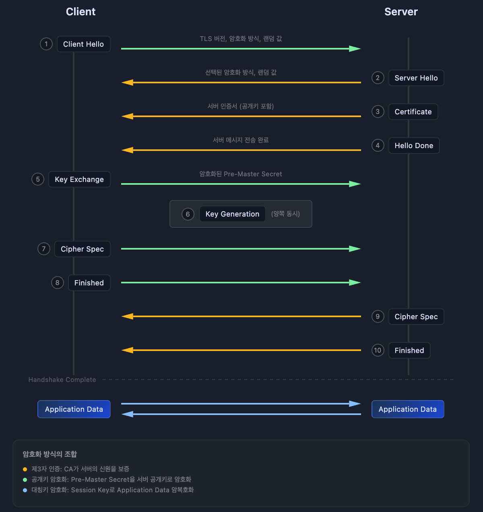
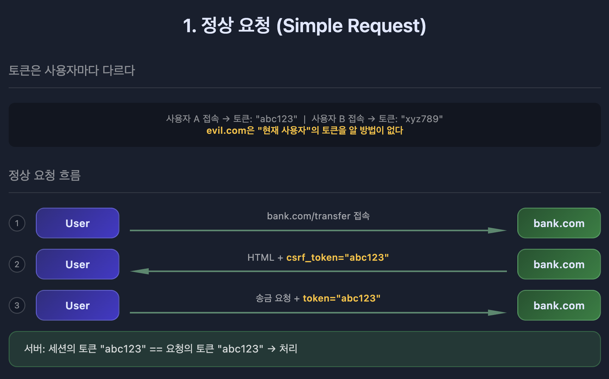
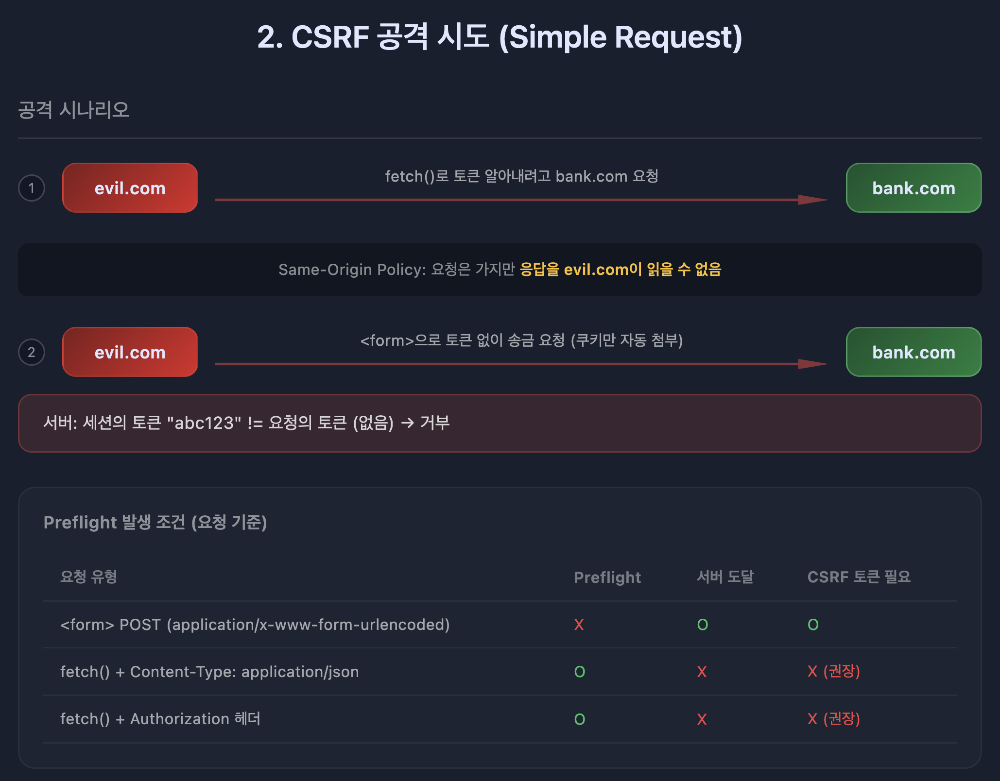
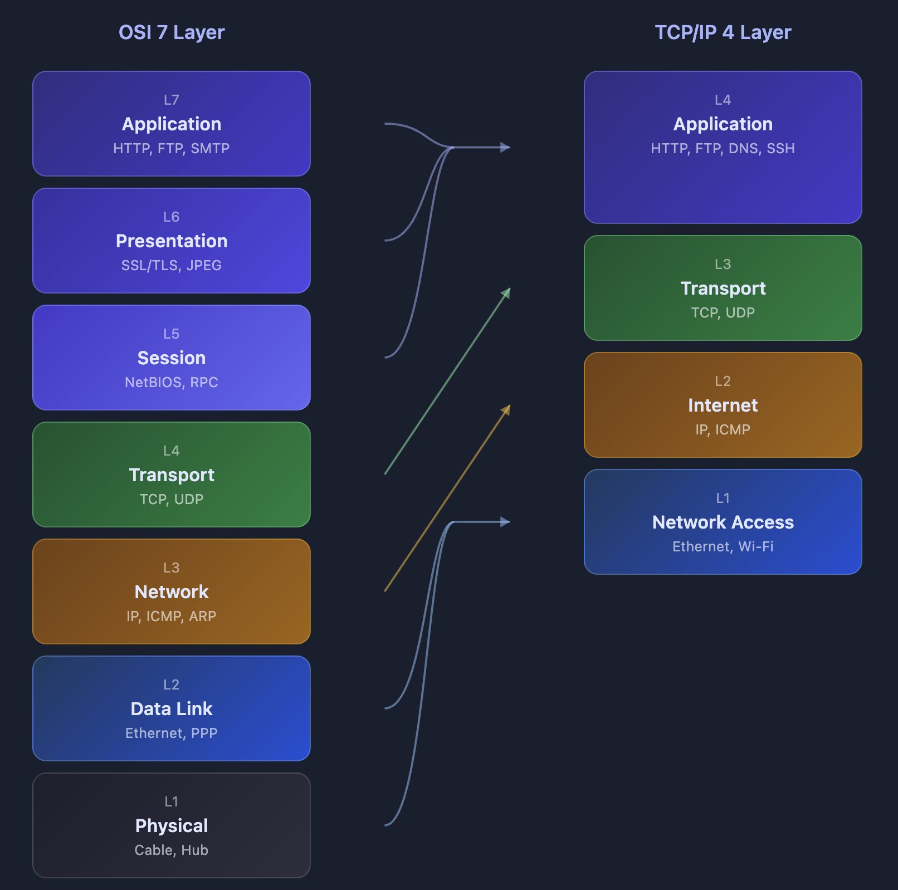
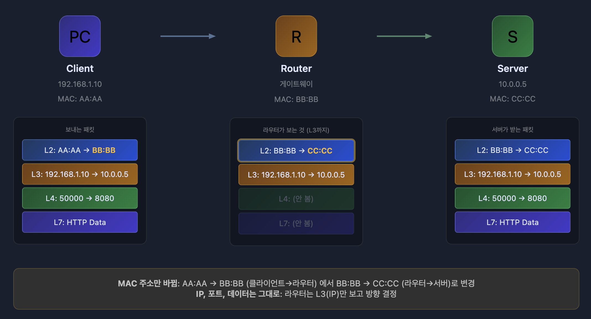
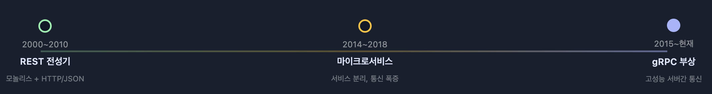
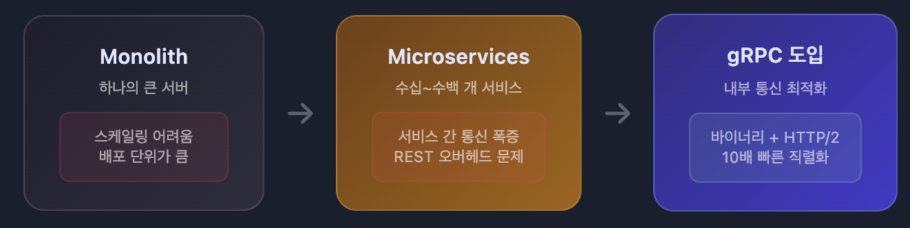
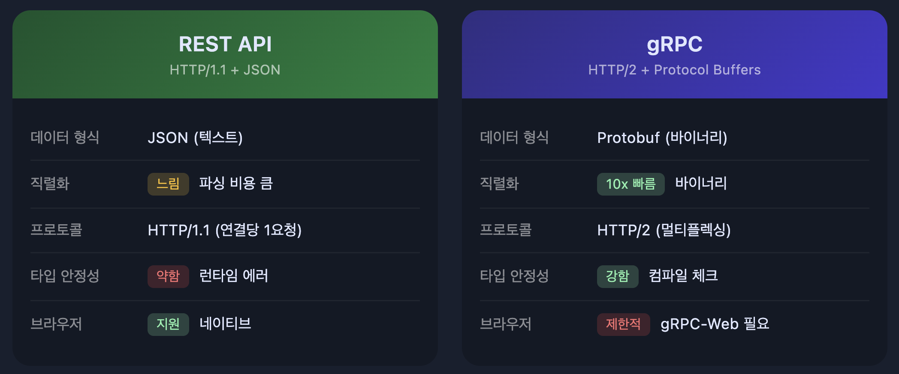

## HTTP vs HTTPS

HTTP는 데이터를 평문으로 전송한다. 즉, 중간에 누군가 패킷을 가로채면 내용을 그대로 볼 수 있다는 뜻이다. 로그인 정보, 결제 정보 같은 민감한 데이터가 그대로 노출될 수 있다.

HTTPS는 이 문제를 해결하기 위해 HTTP에 **보안 계층**(SSL/TLS)을 추가한 것이다. 데이터가 암호화되어 전송되기 때문에 중간에 패킷을 가로채도 내용을 해독할 수 없다.

### HTTPS가 사용하는 3가지 보안 메커니즘

HTTPS는 단순히 "암호화"만 하는 게 아니다. 3가지 보안 메커니즘을 조합해서 사용한다.

| 메커니즘 | 목적 | 사용 시점 |
|---------|------|----------|
| **제3자 인증** | 서버가 진짜인지 확인 | 인증서 검증 |
| **공개키 암호화**(비대칭키) | 비밀키를 안전하게 공유 | 핸드셰이크 |
| **비밀키 암호화**(대칭키) | 실제 데이터 암호화 | 통신 전체 |

왜 공개키 암호화와 비밀키 암호화를 둘 다 쓸까? 공개키 암호화는 안전하지만 느리고, 비밀키 암호화는 빠르지만 키를 어떻게 공유할지가 문제다. 그래서 **처음에 공개키로 비밀키를 안전하게 공유**하고, **이후 통신은 빠른 비밀키로** 진행한다.

---

## SSL/TLS Handshake 과정

TCP 3-way handshake가 끝나면 SSL Handshake가 시작된다. 이 과정을 통해 클라이언트와 서버는 암호화 통신에 사용할 비밀키를 안전하게 공유한다.



### 단계별 설명

**1. Client Hello**
클라이언트가 지원하는 암호화 방식 목록과 **Client Random**(랜덤 데이터)을 서버에 전송한다.

**2. Server Hello + 인증서 전송**
서버가 암호화 방식을 선택하고, **Server Random**과 함께 자신의 인증서를 보낸다. 이 인증서 안에 서버의 공개키가 들어있다.

**3. 인증서 검증**
클라이언트는 받은 인증서가 신뢰할 수 있는 **CA**(인증기관)가 발급한 것인지 확인한다. 브라우저에는 주요 CA들의 공개키가 미리 내장되어 있어서, CA의 서명을 검증할 수 있다.

**4. Pre-Master Secret 전송**
클라이언트가 **Pre-Master Secret**을 생성하고, **서버의 공개키로 암호화**해서 전송한다. 서버만 자신의 개인키로 이를 복호화할 수 있다.

**5. Session Key 생성**
양쪽 모두 **Client Random + Server Random + Pre-Master Secret**을 조합해서 동일한 **세션 키**(대칭키)를 생성한다.

**6. 암호화 통신 시작**
이후 모든 HTTP 데이터는 이 세션 키로 암호화되어 전송된다.

### 왜 Random 데이터가 필요한가?

Pre-Master Secret만 사용하면 같은 값을 재사용할 경우 동일한 Session Key가 생성된다. 매 연결마다 다른 Random 값을 사용하면:

- **재생 공격 방지**: 공격자가 이전 통신을 녹화해서 재전송해도, Random 값이 다르므로 Session Key가 달라진다
- **세션 고유성**: 같은 서버에 여러 번 연결해도 각 세션이 독립적으로 동작한다
- **예측 불가능**: 공격자가 Session Key를 추측할 수 없다

### 왜 공개키와 대칭키를 복합적으로 사용하는가?

**성능** 때문이다. 공개키 암호화(RSA 등)는 대칭키 암호화(AES 등)보다 100~1000배 느리다.

**공개키가 느린 이유**

공개키 암호화는 **큰 수의 소인수분해나 이산로그** 같은 수학적 난제에 기반한다.

```
// RSA
암호화: C = M^e mod n
복호화: M = C^d mod n
```

여기서 n은 2048비트 이상의 거대한 수다. 이런 큰 수의 거듭제곱과 나머지 연산은 CPU 연산량이 많다.

**대칭키가 빠른 이유**

```
// AES
XOR, 비트 시프트, 치환 테이블 참조
```

단순한 비트 연산이라 CPU가 빠르게 처리한다. 현대 CPU는 AES 전용 하드웨어 명령어(AES-NI)까지 내장하고 있다.

그래서 **키 교환에만 공개키 사용**(Pre-Master Secret 1회 전송), **실제 통신은 대칭키 사용**(세션 키로 빠르게 암호화/복호화)하는 것이다.

### 핵심 포인트

- 인증서는 **CA의 개인키로 서명**되어 있고, **CA의 공개키로 검증**한다
- Pre-Master Secret은 **서버의 공개키로 암호화**하고, **서버의 개인키로 복호화**한다
- 실제 통신은 **세션 키**(대칭키)로 암호화한다

---

## HTTP 메서드

HTTP 메서드는 클라이언트가 서버에 **어떤 동작을 요청하는지**를 나타낸다.

### 주요 메서드

| 메서드 | 역할 | CRUD | 특징 |
|--------|------|------|------|
| **GET** | 리소스 조회 | R | 캐싱 가능, Body 없음 |
| **POST** | 리소스 생성 | C | 멱등성 없음 |
| **PUT** | 리소스 전체 수정/생성 | C, U | 리소스 없으면 생성 |
| **PATCH** | 리소스 부분 수정 | U | 일부 필드만 수정 |
| **DELETE** | 리소스 삭제 | D | 리소스 없어도 동일 동작 |

### GET vs POST 차이

**GET 요청**
- 서버에 존재하는 정보를 **조회**한다
- Request Body를 사용하지 않는 것이 관례. 레거시 시스템은 Body가 있으면 거부하기도 함
- 응답이 **캐싱**될 수 있음
- 같은 요청을 여러 번 해도 결과가 같다. 멱등성

**POST 요청**
- 서버에 새로운 리소스를 **생성**한다
- Request Body에 데이터를 담아 전송
- 서버 상태를 변경하므로 **멱등성이 없음**. 같은 요청을 두 번 하면 두 개가 생성됨

### 알아두면 좋은 메서드

- **OPTIONS**: 해당 URI에서 서버가 허용하는 메서드 목록 확인. CORS preflight에서 사용
- **HEAD**: GET과 동일하지만 Body 없이 헤더만 반환

### 보안 관점

불필요한 HTTP 메서드는 비활성화하는 것이 좋다. 예를 들어 PUT, DELETE가 필요 없는 API라면 해당 메서드를 허용하지 않는 **Whitelist 방식**으로 관리한다. HTTP Method 취약점으로 검색하면 관련 보안 이슈를 확인할 수 있다.

---

## REST API

REST는 HTTP URI로 **자원을 표현**하고, HTTP Method로 **자원에 대한 행위를 표현**하는 아키텍처 스타일이다.

### 특징

- **사람이 읽을 수 있는 API**: `/users/123`을 보면 "123번 유저"라는 것을 직관적으로 알 수 있다
- **HTTP 활용**: HTTP의 특성인 캐싱, 상태 코드 등을 그대로 사용
- **별도 인프라 불필요**: HTTP만 있으면 됨

### 단점

- **명확한 표준이 없음**: 회사마다, 개발자마다 구현이 다름
- **완전한 REST 구현이 어려움**: Roy Fielding이 정의한 REST의 모든 조건을 만족시키기는 매우 어렵다 ("그런 REST API로 괜찮은가" 발표 참고)

### HATEOAS

REST의 제약 조건 중 하나로, 응답에 **관련 동작의 URI를 함께 제공**하는 것이다.

```json
{
  "id": 123,
  "name": "John",
  "links": [
    { "rel": "self", "href": "/users/123" },
    { "rel": "orders", "href": "/users/123/orders" },
    { "rel": "delete", "href": "/users/123", "method": "DELETE" }
  ]
}
```

클라이언트는 하드코딩된 URI 대신 응답에 포함된 링크를 따라가면 되므로, API 변경에 유연하게 대응할 수 있다.

---

## CORS (Cross-Origin Resource Sharing)

CORS는 **서로 다른 출처(Origin) 간에 리소스를 공유**하는 메커니즘이다.

### 왜 기본적으로 차단하는가?

**CSRF**(Cross-Site Request Forgery) 공격을 막기 위해서다.

예를 들어, 사용자가 `bank.com`에 로그인한 상태에서 악성 사이트 `evil.com`을 방문했다고 하자. 

`evil.com`의 스크립트가 `bank.com/transfer?to=hacker&amount=1000000` 같은 요청을 보낸다면? 

브라우저는 **요청의 목적지 도메인을 보고 해당 도메인의 쿠키를 자동으로 첨부**한다. `evil.com`이 쿠키를 "읽는" 게 아니라, 브라우저가 `bank.com`으로 가는 요청에 `bank.com` 쿠키를 알아서 붙이는 것이다. 그래서 사용자 모르게 인증된 요청이 실행될 수 있다.

Same-Origin Policy는 이런 공격을 방어한다. `evil.com`에서 `bank.com`으로 요청을 보내면, 브라우저가 **응답을 차단**해버린다. 다만 요청 자체는 서버에 도달할 수 있어서, 추가로 CSRF 토큰 같은 방어가 필요하다.

### 정상 요청


### csrf 토큰을 통한 방어


### 그럼 CORS는 언제 필요한가?

프론트엔드(`localhost:3000`)에서 백엔드 API(`localhost:8080`)를 호출하는 건 일상적인 일이다. 하지만 포트가 다르면 다른 출처로 간주되어 Same-Origin Policy에 걸린다.

CORS는 서버가 "이 출처는 접근을 허용해"라고 명시적으로 알려주는 방법이다. 신뢰할 수 있는 출처만 허용 목록에 추가하면, 보안을 유지하면서 필요한 크로스 오리진 요청을 허용할 수 있다.

### Preflight Request

브라우저는 실제 요청을 보내기 전에 **OPTIONS 메서드로 사전 요청**을 보낸다. 이를 **Preflight Request**라고 한다.

```
OPTIONS /api/users HTTP/1.1
Origin: https://frontend.com
Access-Control-Request-Method: POST
```

서버가 CORS를 허용하면 아래와 같이 응답한다.

```
HTTP/1.1 200 OK
Access-Control-Allow-Origin: https://frontend.com
Access-Control-Allow-Methods: GET, POST, PUT, DELETE
```

이 응답을 받은 후에야 브라우저는 실제 요청을 보낸다.

### Simple Request vs Preflight

모든 cross-origin 요청에 Preflight가 발생하는 건 아니다. **Simple Request** 조건을 만족하면 Preflight 없이 바로 요청이 간다.

**Simple Request 조건** (모두 만족해야 함)

| 조건 | 허용 값 |
|------|---------|
| **메서드** | GET, HEAD, POST만 |
| **Content-Type** | `application/x-www-form-urlencoded`, `multipart/form-data`, `text/plain`만 |
| **헤더** | Accept, Accept-Language, Content-Language, Content-Type만 |

**Preflight가 필요한 경우** (위 조건 중 하나라도 벗어나면)

- `Content-Type: application/json` 사용
- `Authorization` 헤더 사용
- 커스텀 헤더 사용 (예: `X-Custom-Header`)
- PUT, DELETE, PATCH 메서드 사용

**왜 이렇게 나눴을까?**

HTML `<form>` 태그는 Same-Origin Policy 이전부터 cross-origin 요청이 가능했다. 하위 호환성을 위해 이 범위의 요청은 Simple Request로 허용한다. 

반면 `fetch()`로 JSON을 보내거나 커스텀 헤더를 붙이는 건 JavaScript에서만 가능한 동작이므로, Preflight로 서버 허락을 먼저 받아야 한다.

### 주요 CORS 헤더

| 헤더 | 설명 |
|------|------|
| `Access-Control-Allow-Origin` | 허용할 출처 (`*`는 모든 출처) |
| `Access-Control-Allow-Methods` | 허용할 HTTP 메서드 |
| `Access-Control-Allow-Headers` | 허용할 요청 헤더 |
| `Access-Control-Allow-Credentials` | 인증 정보(쿠키 등) 포함 허용 여부 |

---

## OSI 7계층과 TCP/IP 4계층

네트워크 통신을 이해하려면 계층 구조를 알아야 한다. OSI 7계층은 이론적 표준이고, 실제로는 TCP/IP 4계층을 많이 사용한다.



### 계층별 역할과 헤더 구조

각 계층은 **자신만의 헤더**를 가진다. 데이터가 전송될 때 위에서 아래로 내려가면서 각 계층의 헤더가 추가된다.

```
[Ethernet Header] + [IP Header] + [TCP Header] + [HTTP Data]
      L2              L3            L4             L7
```

| 계층 | 헤더 | 핵심 정보 | 역할 |
|------|------|----------|------|
| **L2** | Ethernet Header | **MAC 주소** | 같은 네트워크 내에서 다음 장비까지 전달 |
| **L3** | IP Header | **IP 주소** | 최종 목적지까지 경로 결정 |
| **L4** | TCP/UDP Header | **포트 번호** | 어떤 프로세스에 전달할지 결정 |
| **L7** | - | **HTTP 데이터** | 애플리케이션이 실제로 사용하는 데이터 |

### 각 계층이 하는 일

**L2 Data Link** - "다음 장비로 전달"

- **MAC 주소**로 같은 네트워크 내의 다음 장비를 찾는다
- 라우터를 거칠 때마다 **MAC 주소가 바뀐다** (다음 hop의 MAC으로 변경)
- 스위치가 이 계층에서 동작

**L3 Network** - "최종 목적지까지 경로 결정"

- **IP 주소**는 출발지부터 목적지까지 **변하지 않는다**
- 라우터가 IP 주소를 보고 어느 방향으로 보낼지 결정
- 라우터가 이 계층에서 동작

**L4 Transport** - "어떤 프로세스로 전달?"

- **포트 번호**로 같은 IP의 여러 프로세스 중 어디로 보낼지 결정
- TCP: 신뢰성 보장 (순서, 재전송)
- UDP: 빠르지만 신뢰성 없음

**L7 Application** - "실제 데이터 처리"

- HTTP, FTP, SMTP 등 애플리케이션 프로토콜이 동작
- 사용자가 실제로 주고받는 데이터를 처리

### 택배 비유로 이해하기

| 계층 | 택배 비유 |
|------|----------|
| **L7** | 택배 박스 안의 **실제 물건** |
| **L4** | 아파트 **동/호수** (같은 주소지만 어느 집인지) |
| **L3** | 배송 **주소** (목적지까지 변하지 않음) |
| **L2** | **중간 경유지** 주소 (물류센터 → 허브 → 대리점, 계속 바뀜) |

**핵심**: IP 주소는 "최종 목적지"라서 변하지 않고, MAC 주소는 "다음 경유지"라서 라우터를 거칠 때마다 바뀐다.

### 라우터의 동작 원리



라우터는 **L3까지만** 본다. IP 주소를 확인해서 "이 패킷을 어느 방향으로 보낼지"만 결정하고, 포트 번호(L4)나 HTTP 데이터(L7)는 확인하지 않는다.

**스위치 vs 라우터의 차이**:
- **스위치**(L2): MAC 주소를 보고 **같은 네트워크 내**에서 전달. 아파트 내 우편함 분류.
- **라우터**(L3): IP 주소를 보고 **다른 네트워크로** 전달. 다른 도시로 택배 발송.

### OSI vs TCP/IP 매핑

- OSI L5, L6, L7 → TCP/IP Application Layer
- OSI L4 → TCP/IP Transport Layer
- OSI L3 → TCP/IP Internet Layer
- OSI L1, L2 → TCP/IP Network Access Layer

---

## 웹 서버(Apache, Nginx)는 어느 계층에서 동작하는가?

Apache, Nginx 같은 웹 서버는 **L7**(Application Layer)에서 동작한다. HTTP 프로토콜을 처리하기 때문이다.

하지만 웹 서버가 제공하는 **로드 밸런싱** 기능은 계층에 따라 다르게 동작한다.

### 계층별로 볼 수 있는 정보

| 계층 | 볼 수 있는 정보 | 예시 |
|------|----------------|------|
| **L4** | IP 주소, 포트 번호 | `192.168.1.1:8080` |
| **L7** | L4 정보 + HTTP 헤더, URI, 쿠키, 바디 | `GET /api/users`, `Host: example.com` |

L4 장비는 패킷의 **헤더 부분만** 본다. TCP 헤더에는 출발지/목적지 포트, IP 헤더에는 출발지/목적지 IP가 있다.

L7 장비는 **패킷 내용**(페이로드)까지 열어본다. HTTP 요청을 파싱해서 URI, 헤더 등을 분석한 후 라우팅을 결정한다.

**비유**: L4는 택배 기사가 **주소**(IP)와 **호수**(포트)만 보고 배달하는 것이고, L7은 택배 기사가 **박스를 열어서 내용물**을 확인한 후 배달 경로를 결정하는 것이다. L4가 빠른 이유는 박스를 안 열기 때문이다.

### L4 로드 밸런싱

**TCP/UDP 포트 정보**만 보고 분산한다.

```nginx
stream {
    upstream backend {
        server 192.168.1.1:8080;
        server 192.168.1.2:8080;
    }
    server {
        listen 8080;
        proxy_pass backend;
    }
}
```

요청의 내용(URI, 헤더)을 보지 않고, 단순히 연결을 분산시킨다. HTTP가 아닌 프로토콜(MySQL, Redis)도 로드밸런싱할 수 있다.

### L7 로드 밸런싱

**HTTP URI, 헤더** 등을 분석해서 분산한다.

```nginx
http {
    location /api/ {
        proxy_pass http://api-server;
    }
    location /static/ {
        proxy_pass http://static-server;
    }
}
```

`/api/`로 시작하는 요청은 API 서버로, `/static/`으로 시작하는 요청은 정적 파일 서버로 보낼 수 있다. 더 세밀한 제어가 가능하지만, 패킷 내용을 분석해야 하므로 L4보다 느리다.

---

## REST vs gRPC

마이크로서비스 아키텍처가 확산되면서, 서비스 간 통신 방식도 진화했다.

### 아키텍처 진화와 gRPC의 등장



모놀리스 시대에는 REST API로 충분했다. 하지만 마이크로서비스로 전환되면서 서비스 간 통신이 폭발적으로 증가했고, JSON 직렬화/역직렬화 오버헤드가 문제가 됐다. 

gRPC는 이 문제를 해결하기 위해 등장했다.



### REST vs gRPC 비교



### 언제 무엇을 쓸까?

**REST가 적합한 경우**:
- 브라우저 - 서버 통신
- 외부 공개 API
- 디버깅 편의성이 중요할 때

**gRPC가 적합한 경우**:
- 서버 - 서버 내부 통신
- 마이크로서비스 간 통신
- 실시간 스트리밍
- 고성능, 낮은 지연이 필요할 때

외부는 **REST**, 내부는 **gRPC**. 

브라우저 → API Gateway(REST) → 마이크로서비스들(gRPC) 구조가 일반적이다.


