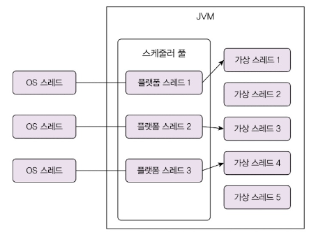
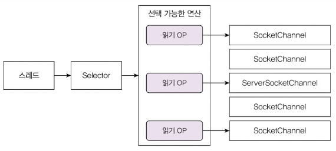
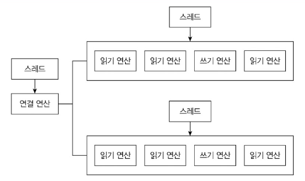

> **이 글은 주니어 백엔드 개발자가 반드시 알아야 할 핵심 지식을 기반으로 작성되었습니다.**

## I/O 병목, 어떻게 해결할까?

서버는 **네트워크 기반**으로 동작합니다. DB, 외부 API, 레디스 등 대부분의 통신이 네트워크를 통해 이뤄집니다.


네트워크 I/O 과정에서 스레드는 데이터 전송이 완료될 때까지 **대기**합니다.

```java
outputStream.write(); // 출력 스트림으로 데이터 보내기
inputStream.read(); // 완료될 때까지 대기
```


>
> **I/O 대기 시간이 전체 실행 시간의 대부분을 차지합니다.**
>
> \
> 실측 결과 전체 실행 시간 800ms 중 CPU 사용 시간은 4ms에 불과했습니다. 99.5%가 I/O 대기 시간이었습니다.

### 블로킹 I/O의 문제점

>
> **블로킹 I/O는 I/O 완료 시까지 스레드를 대기시킵니다.**
>
> \
> I/O 대기 중인 스레드는 CPU를 전혀 사용하지 않습니다. CPU 효율을 높이려면 더 많은 스레드가 필요합니다.

**요청 당 스레드**(thread per request) 방식으로 스레드를 늘리면 2가지 문제가 발생합니다.

**1. 메모리 병목**

스레드 1개당 수백 KB~수 MB의 메모리를 사용합니다. 1만 개 스레드면 약 10GB의 메모리가 필요합니다.

**2. 컨텍스트 스위칭 오버헤드**

>
> **컨텍스트 스위칭**(Context Switching)
>
> \
> OS가 스레드를 전환할 때 현재 스레드 상태를 저장하고 다음 스레드 상태를 복원하는 과정입니다.
>
> \
> 마이크로초 단위로 실행되지만, 스레드가 많아지면 CPU 효율에 영향을 줍니다.

### 성능 개선의 2가지 방법

자원 효율을 높여 성능을 개선하는 방법은 2가지입니다.

1. **가상 스레드**(경량 스레드) 사용
2. **논블로킹 I/O** 사용

>
> **성능 개선은 필요할 때만**
>
> \
> 트래픽이 적다면 성능 개선이 불필요합니다. 실제 문제가 발생하거나 예상 트래픽이 높을 때만 적용하세요.

## 가상 스레드로 자원 효율 높이기

>
> **가상 스레드는 I/O 대기 시 다른 작업을 수행합니다.**
>
> \
> 블로킹 I/O 코드 그대로 사용하면서 CPU 효율을 높일 수 있습니다. 자바의 가상 스레드나 Go의 고루틴이 이에 해당합니다.

### 가상 스레드의 구조

**경량 스레드**는 OS가 아닌 언어 런타임(JVM)이 관리하는 스레드입니다.



JVM은 CPU 코어 개수만큼 플랫폼 스레드를 생성하고, 플랫폼 스레드가 여러 가상 스레드를 번갈아 실행합니다.

### 메모리 효율 비교

**플랫폼 스레드 1만 개**: 약 9.8GB
- 스레드당 1MB 스택 메모리 사용

**가상 스레드 1만 개**: 약 28MB
- 가상 스레드당 평균 2KB
- 플랫폼 스레드 8개 추가 (8MB)
- **300배 이상 메모리 효율**

### 생성 시간 비교 (10만 개 기준)

- 플랫폼 스레드: 21,467ms
- 가상 스레드: 196ms
- **100배 이상 빠름**

### 가상 스레드의 동작 방식


>
> **마운트**(mount)와 **언마운트**(unmount)
>
> \
> 가상 스레드가 플랫폼 스레드(캐리어 스레드)에 연결되면 **마운트**, 해제되면 **언마운트**됩니다.
>
> \
> I/O 블로킹 발생 시 언마운트되고, 플랫폼 스레드는 다른 가상 스레드를 실행합니다.

**동작 과정**

1. 플랫폼 스레드 1이 가상 스레드 1 실행
2. 가상 스레드 1이 I/O 대기 시 언마운트
3. 플랫폼 스레드 1이 가상 스레드 2 실행
4. I/O 완료 시 가상 스레드 1 재개

>
> **주의: synchronized 사용 시**
>
> \
> synchronized로 인한 블로킹은 언마운트되지 않습니다. 플랫폼 스레드도 함께 블로킹됩니다.
>
> \
> 가상 스레드 사용 시 ReentrantLock 사용을 권장합니다.

### 가상 스레드 적용 시점

>
> **I/O 중심 작업에만 효과적입니다.**
>
> \
> 네트워크 I/O, DB 쿼리 등 I/O 대기가 많은 작업에서 효과를 발휘합니다.
>
> \
> CPU 중심 작업(이미지 처리, 정렬 등)에서는 효과가 없거나 오히려 성능이 나빠질 수 있습니다.

**가상 스레드 효과를 얻기 위한 조건**

가상 스레드 개수 > 플랫폼 스레드 개수

예: CPU 코어 16개, 동시 요청 10개
- 플랫폼 스레드 16개 > 가상 스레드 10개
- 효과 없음

해결: CPU 코어를 4개로 줄이거나 트래픽을 늘려 동시 요청 100개 이상으로 증가

>
> **가상 스레드의 장점**
>
> \
> **기존 코드를 거의 수정하지 않아도 됩니다.** 스프링, JDBC 드라이버 등 주요 라이브러리가 이미 지원합니다.
>
> \
> 처리량을 높이는 것이지, 개별 요청의 실행 속도를 빠르게 하는 것은 아닙니다.

## 논블로킹 I/O로 성능 더 높이기

>
> **경량 스레드도 한계가 있습니다.**
>
> \
> 트래픽이 폭발적으로 증가하면 경량 스레드도 메모리와 스케줄링 오버헤드가 발생합니다.
>
> \
> 이때는 **논블로킹 I/O**로 구조적 변경이 필요합니다.

Nginx, Netty, Node.js 등이 논블로킹 I/O를 사용합니다.

### 논블로킹 I/O 동작 방식

>
> **데이터를 읽을 때까지 대기하지 않습니다.**
>
> \
> `channel.read()`는 읽을 데이터가 없으면 즉시 0을 리턴합니다.

```java
int byteReads = channel.read(buffer); // 대기하지 않음
// 읽은 데이터가 없어도 다음 코드 즉시 실행
```

**핵심: Selector를 이용한 이벤트 루프**

1. 실행 가능한 I/O 연산이 있을 때까지 대기
2. 실행 가능한 I/O 연산 목록 조회
3. 각 I/O 연산 처리
4. 반복



>
> **I/O 멀티플렉싱**(Multiplexing)
>
> \
> 단일 이벤트 루프에서 여러 I/O 작업을 처리하는 방식입니다.
>
> \
> OS별로 epoll(리눅스), IOCP(윈도우) 등을 사용합니다.

**논블로킹 I/O의 장점**

- 블로킹 I/O: 클라이언트 1,000개 = 스레드 1,000개
- 논블로킹 I/O: 클라이언트 수와 무관하게 소수의 스레드 사용 (보통 CPU 코어 수만큼)



### 리액터 패턴

>
> **리액터(Reactor) 패턴**
>
> \
> 이벤트 루프가 이벤트를 대기하고 핸들러에 전달하는 패턴입니다.
>
> \
> Netty, Nginx, Node.js가 리액터 패턴을 사용합니다.

**구조**

1. 이벤트 발생 대기
2. 이벤트를 처리할 핸들러 조회
3. 핸들러가 이벤트 처리
4. 반복

**멀티코어 활용**

- Netty: 여러 개의 이벤트 루프 생성
- Node.js: 별도 스레드 풀로 CPU 중심 작업 처리

### 프레임워크 사용 권장

>
> **저수준 논블로킹 I/O API는 복잡합니다.**
>
> \
> Netty, Reactor Netty 등 프레임워크를 사용하면 더 간단하게 구현할 수 있습니다.

### 성능 개선 효과


**실측 결과**(힙 메모리 1.5G 조건)

- 블로킹 I/O: 최대 동접 6천
- 논블로킹 I/O: 최대 동접 12만
- **20배 성능 향상**


## 비교표: 블로킹 vs 논블로킹 vs 가상 스레드

| 항목 | 블로킹 I/O | 가상 스레드 | 논블로킹 I/O |
|------|-----------|------------|-------------|
| **스레드 사용** | 요청당 1개 | 요청당 1개 (경량) | CPU 코어 수만큼 |
| **메모리**(1만 요청) | ~10GB | ~28MB | ~수십MB |
| **구현 복잡도** | 낮음 | 낮음 | 높음 |
| **코드 수정** | - | 최소 | 대폭 |
| **최대 동시 처리** | 수천 | 수십만~백만 | 수십만~백만 |
| **적용 난이도** | - | 쉬움 | 어려움 |
| **프레임워크 지원** | 모든 프레임워크 | 주요 프레임워크 지원 | Netty, Reactor 등 |

## 실전 적용 가이드

### 1. 성능 문제 확인

>
> **먼저 문제가 있는지 확인하세요.**
>
> \
> 성능 문제가 없다면 굳이 변경할 필요가 없습니다.
>
> \
> 논블로킹 I/O는 코드 복잡도를 크게 높입니다.

### 2. 문제 원인 파악

**I/O 문제가 아닌 경우**

- DB 쿼리 느림: 쿼리 최적화, 캐시 사용
- CPU 중심 작업(이미지 처리 등): 가상 스레드/논블로킹 I/O 효과 없음

**I/O 문제인 경우**

- 동시 접속자 증가로 메모리 부족: 가상 스레드 적용
- 극대 트래픽: 논블로킹 I/O 고려

### 3. 적용 우선순위

**1순위: 가상 스레드**
- 기존 코드 거의 수정 불필요
- 빠른 적용 가능
- 대부분의 경우 충분한 성능

**2순위: 서버 확장**
- 가상 스레드 적용 불가 시
- 구현 변경 여유 없을 시
- 비용 증가 감수

**3순위: 논블로킹 I/O**
- 최고 성능 필요 시
- 팀에 기술 역량 있을 시
- 장기적 투자 가능 시