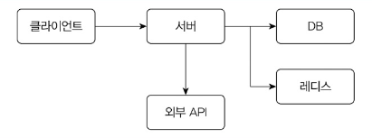
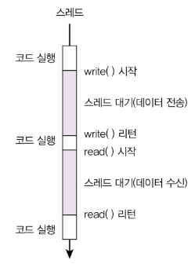

## I/O 병목, 어떻게 해결할까?

서버 프로그램은 기본적으로 네트워크 프로그램입니다. 서버는 다양한 구성요소와 네트워크를 통해 데이터를 주고받습니다.



많은 서버는 HTTP 프로토콜을 이용해서 클라이언트와 데이터를 주고받습니다. 데이터 처리를 위해 DB를 사용하는데, DB는 TCP에 기반한 프로토콜을 사용해서 데이터를 주고받습니다. 레디스를 메모리 캐시로 사용할 때도 네트워크를 통해 데이터를 주고받습니다. 서버 API를 만들 때 개발자가 직접 네트워크 프로그램을 작성하지는 않지만, 서버는 네트워크 통신을 기반으로 동작합니다.

네트워크를 통해 데이터를 주고받는 과정은 간단하게 다음 두 줄로 정리할 수 있습니다.

```java
outputStream.write(); // 출력 스트림으로 데이터 보내기
inputStream.read(); // 입력 스트림으로 데이터 받기
```

예를 들어 SELECT 쿼리를 실행한다고 해보겠습니다. 서버는 DB와 연결된 출력 스트림을 이용해서 DB에 SELECT 쿼리를 전송합니다. 그리고 DB가 보내는 데이터를 입력 스트림을 통해서 받습니다.

이때 데이터를 보내고 받는 동안 코드를 실행하는 스레드는 데이터 전송이 완료될 때까지 대기하게 됩니다.



데이터 입출력이 완료될 때까지 스레드는 아무 작업도 하지 않습니다. 즉 입출력이 끝날 때까지 스레드가 **블로킹(blocking)** 됩니다. 보통 입출력에 소요되는 시간은 코드를 실행하는 시간보다 훨씬 깁니다. 서버처럼 네트워크 연동이 많은 프로그램은 전체 실행 시간의 90% 이상을 입출력 대기에 사용하는 경우도 있습니다.

제가 실행 시간을 측정한 API 중 하나는 전체 실행 시간이 800ms였는데, 이 중 CPU 사용 시간은 4ms에 불과했습니다. 전체 실행 시간의 99.5%가 쿼리 실행이나 외부 API 호출 같은 I/O 처리에 사용된 것입니다. 3초 가까이 실행되는데 CPU 사용 시간이 고작 5ms였던 경우도 있었습니다.

### 블로킹(blocking)이란?

작업이 완료될 때까지 스레드가 대기하는 것을 블로킹이라고 합니다. 주로 데이터 입출력 과정에서 블로킹이 발생합니다. 입출력 과정에서 블로킹이 발생하기 때문에 이런 방식을 블로킹 I/O라고도 부릅니다.

스레드가 대기하는 데 시간을 소요한다는 것은, 그 스레드를 실행하는 CPU도 아무것도 하지 않는 시간이 생긴다는 의미입니다. CPU 사용률을 높이려면 CPU가 실행할 스레드를 많이 만들면 됩니다. **요청 당 스레드(thread per request)** 방식으로 구현한 서버가 이에 해당합니다. 동시에 실행되는 스레드 개수를 늘려 I/O 대기에 따른 CPU 낭비를 줄일 수 있습니다.

하지만 스레드를 생성하는 데는 한계가 있습니다. 스레드는 수백 KB에서 수 MB의 메모리를 사용합니다. 커넥션 당 스레드 방식으로 구현한 웹소켓 서버에 1만 명의 사용자가 동시에 연결했다고 하면, 스레드 1만 개를 생성하는 것만으로 사용하는 메모리는 10GB에 육박합니다. 사용자가 증가하면 메모리가 병목이 되는 것입니다.

메모리를 늘려 스레드를 많이 만들 수 있게 되더라도 여전히 문제는 남습니다. 바로 **컨텍스트 스위칭**입니다. 동시에 실행되는 스레드가 증가하면 컨텍스트 스위칭에 사용되는 시간도 증가합니다. 컨텍스트 스위칭에 들어가는 시간은 짧지만, 동시 실행되는 스레드가 많아지면 CPU 효율에 영향을 줍니다.

### 컨텍스트 스위칭이란?

운영체제는 여러 스레드를 번갈아 가면서 CPU에 할당합니다. 한 스레드를 짧은 시간 동안 실행하고 다음 스레드를 짧은 시간 실행하는 식입니다. CPU가 스레드를 전환하려면 현재 실행 중인 스레드의 상태를 기록하고 다음에 실행할 스레드의 상태 정보를 불러와야 합니다. 이렇게 상태 정보를 변경하고 스레드를 전환하는 과정을 컨텍스트 스위칭(context switching)이라고 합니다.

컨텍스트 스위칭은 마이크로초 단위로 실행되지만 컨텍스트 스위칭을 하는 동안 CPU는 실질적인 작업을 하지 않습니다. 그래서 동시에 실행되는 프로세스와 스레드가 많으면 컨텍스트 스위칭에 소요되는 시간도 무시하기 힘들 만큼 커질 수 있습니다.

정리하면 트래픽이 증가하면 다음 2가지 이유로 자원 효율이 떨어지게 된다.

- I/O 대기와 컨텍스트 스위칭에 따른 CPU 낭비
- 요청마다 스레드를 할당함으로써 메모리 사용량이 높음

여기까지 보면 왜 톰캣처럼 요청마다 스레드를 할당하는 서버를 사용하는지 궁금한 독자도 있을 것이다. 서버는 DB나 API 호출 같은 입출력 처리가 많고, 이는 톰캣 같은 서버를 사용하면 CPU와 메모리 낭비가 많다는 것을 뜻하기 때문이다.

그런데 다수의 서비스는 서버의 자원 낭비를 걱정할 필요가 없다. CPU와 메모리 사용에 영향을 줄 만큼 트래픽이 발생하지 않기 때문이다. 수백만 또는 수천만 이상의 고객이 사용할 정도로 인기 있는 서비스가 아니면 CPU와 메모리 자원 부족보다는 다른 이유로 성능 문제가 발생할 때가 많다.

서비스가 인기를 끌기 시작하면 트래픽이 증가하고 이때부터 처리량을 더 높이기 위한 방법을 고민하면 된다. 가장 쉬운 방법은 2장에서 살펴본 것처럼 서버를 수평 확장하거나 수직 확장해서 자원을 더 확보하는 것이다. 이 방법은 비교적 쉽게 달성할 수 있다. 기존 프로그램을 수정하지 않아도 되기 때문이다. 하지만 서버를 확장하는 것은 비용과 직결된다. 클라우드 환경에서 가상화 서버를 2개에서 4개로 늘리면 비용도 두 배가 된다.

서버 성능을 높이는 또 다른 방법은 자원 효율을 높이는 것이다. I/O 대기로 인한 CPU 낭비를 줄이고 요청을 처리하는데 필요한 메모리를 줄이는 것이다. 이를 위한 방법으로는 다음 2가지를 꼽을 수 있다.

- 가상 스레드나 고루틴 같은 경량 스레드 사용
- 논블로킹 또는 비동기 I/O 사용

두 방식을 적절히 사용하면 CPU와 메모리 자원을 늘리지 않고도 더 많은 트래픽을 처리할 수 있다. 이 장에서는 이 2가지 방식에 대해 차례대로 살펴볼 것이다.

### 성능 개선 시점 선택하기

성능을 높이겠다고 처음부터 비동기 I/O로 개발하거나 가상 스레드를 적용하지는 마세요. 실제로 I/O 성능을 높여야 할 만큼 트래픽이 증가하고 있거나 예상되는 트래픽이 높은 경우에만 적용 여부를 고민하시기 바랍니다.

## 가상 스레드로 자원 효율 높이기

코드를 블로킹 I/O로 작성했는데, 입출력 동안 스레드가 대기하지 않고 다른 일을 할 수 있다면 얼마나 좋을까? 만약 이게 가능하다면 CPU의 유휴 시간이 줄어들고, 더 많은 작업을 처리할 수 있게 된다. 게다가 개발자는 성능을 높이기 위해 별도의 기술을 쓰지 않아도 된다. 이렇게 특별한 노력 없이 CPU 효율을 높일 수 있는 방법이 있다. 바로 자바의 가상 스레드나 Go 언어의 고루틴을 사용하는 것이다. 이 둘을 사용하면 앞서 말한 효과를 얻을 수 있다.

언어는 다르지만, 가상 스레드와 고루틴은 경량(lightweight) 스레드라는 공통점을 갖는다. 경량 스레드는 OS가 관리하는 스레드가 아니라 JVM(자바 가상 머신) 같은 언어의 런타임이 관리하는 스레드다. 마치 OS가 CPU로 실행할 스레드를 스케줄링 하듯, 언어 런타임이 OS 스레드로 실행할 경량 스레드를 스케줄링한다.


이 책에서는 필자가 익숙한 자바를 기준으로 설명하겠다. [그림 7.3]에서 보는 것처럼 JVM은 플랫폼 스레드(OS 스레드에 1:1로 대응하는 래퍼(wrapper))로 구성된 풀을 유지한다. CPU가 OS 스케줄러에 의해 여러 스레드를 번갈아 실행하는 것처럼 플랫폼 스레드도 JVM 스케줄러에 의해 여러 가상 스레드를 번갈아 실행한다. JVM은 기본적으로 풀에 CPU 코어 개수만큼 플랫폼 스레드를 생성하고 필요에 따라 플랫폼 스레드를 증가시킨다. 이 책을 쓰는 시점에서 풀에 최대로 생성할 수 있는 플랫폼 스레드 개수의 기본값은 256이다.

가상 스레드를 경량 스레드라고 부르는 이유는 플랫폼 스레드보다 더 적은 자원을 사용하기 때문이다. 우선 가상 스레드는 플랫폼 스레드(즉 OS 스레드)보다 더 적은 메모리를 사용한다. 1만 개의 플랫폼 스레드를 생성해야 한다고 가정해보자. 스레드의 기본 스택 크기가 1MB일 때 10,000MB(약 9.8GB)의 메모리를 사용한다. 물론 이는 예약한(reserved) 메모리 기준이며 실제 사용하는 committed 메모리는 이보다 작다. 하지만 예약한 메모리라고 하더라도 상당량이 필요한 것을 알 수 있다.

가상 스레드는 훨씬 적은 메모리를 사용한다. 가상 스레드 1개가 평균적으로 2KB의 메모리를 사용한다고 했을 때, 1만 개 가상 스레드가 사용하는 힙 메모리는 약 20MB 정도이다. 여기에 스케줄링을 위한 플랫폼 스레드가 8개라고 하면 추가로 8MB의 스택 메모리를 사용한다. 즉 1만 개 가상 스레드를 실행하기 위해 28MB의 메모리(힙 메모리 20MB와 스택 메모리 8MB)를 사용하는 것이다. 앞서 플랫폼 스레드 1만 개를 만들기 위해 사용된 메모리 크기(9.8GB)와 비교하면 300배 넘게 차이가 난다.

### 가상 스레드와 메모리

가상 스레드는 수백 바이트에서 수KB~수십KB의 힙 메모리를 사용합니다. 호출 스택의 깊이에 따라 사용하는 메모리를 동적으로 늘렸다가 줄입니다. Go 언어의 고루틴도 동일한 방식으로 동작합니다.

스레드를 생성하는 시간도 차이가 많이 납니다. 얼마나 차이가 나는지 궁금해서 다음 코드를 만들어서 측정해봤습니다.

```java
Thread[] threads = new Thread[100_000]; // 10만 개
long start = System.currentTimeMillis();
for (int i = 0; i < threads.length; i++) {
// 가상 스레드는 Thread.ofVirtual()로 생성
Thread thread = Thread.ofPlatform().start(() -> {
try {
Thread.sleep(1000);
} catch (InterruptedException e) {
e.printStackTrace();
}
});
threads[i] = thread;
}
long end = System.currentTimeMillis();
```

제가 사용하는 노트북 기준으로 10만 개의 스레드를 생성하고 시작하는데 걸린 시간은 평균적으로 다음과 같았는데 거의 100배 이상 차이가 나는 것을 확인할 수 있었습니다.

- 플랫폼 스레드: 21,467ms
- 가상 스레드: 196ms

이처럼 가상 스레드는 플랫폼 스레드에 비해 훨씬 적은 비용(자원, 시간)이 들기 때문에 한 장비에서 수십만에서 백만 개에 이르는 가상 스레드를 생성할 수 있습니다.

실제로 테스트해본 결과, 가상 스레드 100만 개는 생성할 수 있었지만 플랫폼 스레드 100만 개를 생성하는 데는 실패했습니다.

이는 톰캣처럼 요청별 스레드(thread per request)를 생성하는 서버에서 가상 스레드를 사용하면 더 적은 메모리로 더 많은 요청을 처리할 수 있다는 것을 뜻합니다.

### 캐리어(carrier) 스레드란?

가상 스레드를 실행하는 플랫폼 스레드를 캐리어 스레드라고 표현합니다. CPU가 여러 스레드를 실행하는 것처럼, 한 개의 캐리어 스레드도 여러 가상 스레드를 실행하게 됩니다. 특정 가상 스레드가 특정 캐리어 스레드에 연결되는 것을 마운트(mount)되었다고 표현합니다. 가상 스레드가 캐리어 스레드에 마운트되면 가상 스레드가 실행됩니다. 반대로 가상 스레드가 캐리어 스레드로부터 언마운트(unmount)되면 가상 스레드는 실행을 멈춥니다.

### 네트워크 I/O와 가상 스레드

가상 스레드는 실행하는 과정에서 블로킹되면 플랫폼 스레드와 언마운트되고 실행이 멈춘다. 이때 언마운트된 플랫폼 스레드는 실행 대기 중인 다른 가상 스레드와 연결된 뒤 실행을 재개한다. [그림 7.4]는 이 스케줄링 과정을 간단하게 표현한 것이다.


[그림 7.4]에서 플랫폼 스레드 1은 먼저 가상 스레드 1을 실행한다. 가상 스레드 1이 I/O 대기와 같은 블로킹 연산을 만나면, 플랫폼 스레드 1은 가상 스레드 1의 블로킹이 끝날 때까지 기다리지 않고 실행 가능한 다른 가상 스레드를 찾아서 연결한다. 이런 방식으로 플랫폼 스레드 2는 가상 스레드 2를 실행했다가, 가상 스레드 3을 실행하고 다시 가상 스레드 1을 실행하게 된다.

### 블로킹 연산과 synchronized

블로킹 연산에는 I/O 기능, ReentrantLock, Thread.sleep() 등이 포함됩니다. 이들 연산을 사용해서 가상 스레드가 블로킹되면, 플랫폼 스레드는 대기 중인 다른 가상 스레드를 실행합니다. 반면에 자바 23 또는 이전 버전에서 synchronized로 인해 블로킹되면, 가상 스레드는 플랫폼 스레드로부터 언마운트되지 않습니다. 즉, 플랫폼 스레드도 같이 블로킹됩니다. 이렇게 가상 스레드가 플랫폼 스레드까지 블로킹할 때 이를 가상 스레드가 플랫폼 스레드에 고정됐다고 합니다.

자바 21 기준으로 synchronized 외에도 JNI 호출 등 가상 스레드가 플랫폼 스레드에 고정되는 경우가 있는데, 가상 스레드가 고정되면 CPU 효율을 높일 수 없습니다. 가상 스레드를 사용할 때는 이점에 유의하시기 바랍니다.

### 가상 스레드와 성능

우리가 작성하는 코드는 크게 I/O 중심(I/O-bound) 작업과 CPU 중심(CPU-bound) 작업으로 나눌 수 있다. 네트워크 프로그래밍처럼 입출력이 주를 이루는 작업은 I/O 중심 작업에 해당한다. 반대로 정렬처럼 계산이 주를 이루는 작업은 CPU 중심 작업에 해당한다.

이 두 작업 중 가상 스레드는 I/O 중심 작업일 때 효과가 있다. I/O는 가상 스레드가 지원하는 블로킹 연산이므로, I/O 중심 작업일 때 플랫폼 스레드가 CPU 낭비 없이 효율적으로 여러 가상 스레드를 실행할 수 있다.

CPU 중심 작업에 가상 스레드를 사용하면 성능 개선 효과를 얻을 수 없다. 오히려 성능이 나빠질 수도 있다. 사용자가 업로드한 이미지의 썸네일을 생성해주는 서버를 생각해보자. 이미지 연산은 전형적인 CPU 중심 작업이다. 이미지를 처리하는 코드에는 블로킹 연산이 없다. 블로킹 연산이 없으므로 이미지 연산을 실행하는 동안 플랫폼 스레드는 계속 1개의 가상 스레드만 실행하게 된다. 가상 스레드를 많이 생성하더라도 동시 실행 효과를 얻을 수 없는 것이다.

또한 I/O 중심 작업이라고 해서 무조건 가상 스레드의 이점을 얻는 것은 아니다. 스케줄링에 사용되는 플랫폼 스레드 개수보다 가상 스레드의 개수가 많아야 효과를 기대할 수 있다. 예를 들어 다음과 같은 상황을 가정해보자.

- 장비 CPU 코어는 16개다.
- 서버의 평소 TPS는 500이다.
- 1개 요청을 처리하는데 소요되는 시간은 20밀리초이다.
- 모든 요청은 I/O 중심 작업이다.

단순 계산하면 1개의 스레드는 1초 동안 약 50개의 요청을 처리할 수 있으므로 1초에 500개 요청을 처리하려면 10개의 스레드가 필요하다. 즉, 동시에 10개 요청을 처리할 수 있으면 된다.

이 서버에 가상 스레드를 사용하면 다음과 같이 오히려 플랫폼 스레드가 더 많이 생기는 상황이 벌어진다.

- 플랫폼 스레드는 기본으로 16개가 생긴다(CPU 코어 개수가 16개).
- 동시 요청은 10개이므로 동시에 생성되는 가상 스레드는 10개다.

동시에 10개의 가상 스레드가 실행되지만 I/O 중심 작업이기 때문에 대부분 시간이 I/O 대기 상태에 있다. 플랫폼 스레드는 실행 중인 가상 스레드가 I/O 대기로 블로킹되면 실행할 수 있는 다른 가상 스레드를 찾는다. 그런데 대부분의 가상 스레드가 I/O 대기 중이라 실행할 수 있는 가상 스레드가 많지 않다. 결과적으로 플랫폼 스레드 16개 중 실제로 사용되는 스레드는 10개도 안 된다. 이렇게 되면 가상 스레드의 이점을 얻을 수 없다. 가상 스레드는 플랫폼 스레드보다 개수가 많을 때 효과가 있기 때문이다.

가상 스레드의 이점을 얻으려면 CPU 코어 수를 줄이거나 트래픽이 더 많아져야 한다. 클라우드 환경을 사용한다면 CPU 코어를 16개에서 4개로 줄이고 메모리도 줄여서 더 적은 비용으로 같은 트래픽을 처리할 수 있다. 동시에 필요한 스레드가 100개에서 1000개 이상이 될 정도로 트래픽이 증가해도 가상 스레드의 이점을 얻을 수 있다. 같은 CPU와 메모리로 처리량을 10배 늘릴 수 있는 것이다.

가상 스레드를 사용해서 높일 수 있는 것은 처리량이다. 가상 스레드를 사용한다고 해서 실행 속도가 플랫폼 스레드보다 더 빨라지지는 않는다. 이는 당연한 일이다. 플랫폼 스레드나 가상 스레드나 결국 실행하는 것은 같은 CPU이기 때문이다.

### 가상 스레드와 스레드 풀

요청별 스레드 방식을 사용하는 서버는 스레드 풀을 사용할 때가 많습니다. 미리 스레드를 생성해서 요청이 들어왔을 때 스레드 생성 부하를 줄이기 위함입니다. 또한 스레드 풀 크기에 최대치를 설정해서 요청이 급격히 늘어나도 스레드가 무한정 생성되는 것을 막습니다. CPU와 메모리 같은 자원을 일정 수준으로 제한해서 서버 자원이 포화되는 것을 방지하려는 목적입니다.

가상 스레드는 플랫폼 스레드보다 생성 비용이 적기 때문에 스레드 풀을 미리 구성할 필요가 없습니다. 필요한 시점에 가상 스레드를 생성하고 필요 없으면 제거하면 됩니다.

### 가상 스레드의 중요한 장점

가상 스레드의 중요한 장점은 기존 코드를 크게 수정할 필요가 없다는 것이다. 스프링 프레임워크나 MySQL JDBC 드라이버 같은 많이 사용하는 프레임워크와 라이브러리도 이미 가상 스레드를 지원하고 있다. 따라서 조금만 신경쓰면 기존 코드를 그대로 유지하면서도 가상 스레드를 이용해서 버의 성능을 높일 수 있다.

### 실전 사례: 가상 스레드의 필요성

예전에 서버의 성능을 높이기 위해 구현 방식을 완전히 바꾼 적이 있습니다. 이 서버는 클라이언트별 스레드 방식으로 구현된 간단한 소켓 서버였습니다. 이 소켓 서버는 클라이언트에 푸시를 보내기 위해 연결을 유지했습니다. 사용자가 적을 때는 문제가 안 됐는데 연결된 클라이언트가 증가하면서 일부 클라이언트와의 연결이 비정상으로 동작하는 문제가 발생했습니다.

문제를 해결하기 위해 논블로킹 I/O를 사용해서 다시 구현했습니다. 성능이 수십 배 좋아졌고 문제가 해결됐습니다. 하지만 좋아진 성능을 제대로 쓰지는 못했습니다. 왜냐면 조금만 성능을 높이면 됐기 때문입니다. 만약 이때 가상 스레드가 있었다면 재구현할 생각은 하지 않았을 것입니다. 플랫폼 스레드를 생성하는 대신 가상 스레드를 생성하도록 기존 코드를 변경만 하면 성능 문제를 해결할 수 있었기 때문입니다. 지금 생각해도 이점이 많이 아쉽습니다.

## 논블로킹 I/O로 성능 더 높이기

가상 스레드와 고루틴과 같은 경량 스레드를 사용하면 I/O 중심 작업을 하는 서버의 처리량을 높일 수 있다고 설명했다. 하지만 경량 스레드 자체도 메모리를 사용하고 스케줄링이 필요하다. 경량 스레드가 많아질수록 더 많은 메모리를 사용하고 스케줄링에 더 많은 시간을 사용하게 된다.

사용자가 폭발적으로 증가하면 어느 순간 경량 스레드로도 한계가 온다. 이때는 서버의 I/O 구현 방식을 구조적으로 변경해야 한다. 바로 논블로킹 I/O를 사용해야 하는 것이다.

논블로킹 I/O는 새로운 것이 아니다. 오래전부터 네트워크 서버의 성능을 높이기 위해 사용한 방식이다. 여기에 비동기 API를 곁들이면 덜 복잡한 코드로 높은 성능을 낼 수 있다. 실제로 Nginx, Netty, Node.js 등 서버에서 많이 사용하는 기술은 성능을 위해 논블로킹 I/O를 사용한다.

### 논블로킹 I/O 동작 개요

논블로킹 I/O는 입출력이 끝날 때까지 스레드가 대기하지 않는다. 예를 들어 다음 코드에서 `channel.read()` 코드는 데이터를 읽을 때까지 대기하지 않는다. `channel.read()` 코드는 읽을 데이터가 없으면 바로 0을 리턴한다. 이는 데이터를 읽을 때까지 대기하는 블로킹 I/O와는 동작 방식이 다르다.

```java
// channel: SocketChannel, buffer: ByteBuffer
int byteReads = channel.read(buffer); // 데이터를 읽을 때까지 대기하지 않음
// 읽은 데이터가 없어도 다음 코드 계속 실행
```

데이터를 조회했는지 여부에 상관없이 대기하지 않고 바로 다음 코드를 실행하므로 블로킹 I/O처럼 데이터를 조회했다는 가정 하에 코드를 작성할 수 없다. 대신 루프 안에서 조회를 반복해서 호출한 뒤 데이터를 읽었을 때만 처리하는 방식으로 구현할 수 있다.

```java
// CPU 낭비가 심한 방식
while (true) {
    int byteReads = channel.read(buffer);
    if (byteReads > 0) {
        handleData(channel, buffer);
    }
}
```

하지만 위 코드처럼 작성하면 CPU 낭비가 심하다. 읽은 데이터가 없어도 while 루프가 무한히 실행되기 때문이다. 실제로 논블로킹 I/O를 사용할 때는 데이터 읽기를 바로 시도하기보다는 어떤 연산을 수행할 수 있는지 확인하고 해당 연산을 실행하는 방식으로 구현한다. 실행 흐름은 대략 다음과 같다.

1. 실행 가능한 I/O 연산 목록을 구한다(실행 가능한 연산을 구할 때까지 대기).
2. 1에서 구한 I/O 연산 목록을 차례대로 순회한다.
   A. 각 I/O 연산을 처리한다.
3. 이 과정을 반복한다.

다음은 이 방식으로 구현한 간단한 예제 코드입니다.

```java
Selector selector = Selector.open();
ServerSocketChannel serverSocket = ServerSocketChannel.open();
serverSocket.bind(new InetSocketAddress(7031));
serverSocket.configureBlocking(false); // 서버 소켓 비동기 설정
serverSocket.register(selector, SelectionKey.OP_ACCEPT); // 연결 연산 등록

while (true) {
    selector.select(); // 가능한 I/O 연산이 있을 때까지 대기
    Set<SelectionKey> selectedKeys = selector.selectedKeys();
    Iterator<SelectionKey> iterator = selectedKeys.iterator();

    while (iterator.hasNext()) { // I/O 연산 순회
        SelectionKey key = iterator.next();
        iterator.remove();

        if (key.isAcceptable()) { // 클라이언트 연결 처리 가능하면
            SocketChannel client = serverSocket.accept(); // 클라이언트 연결 처리
            client.configureBlocking(false); // 소켓 비동기 설정
            client.register(selector, SelectionKey.OP_READ); // 읽기 연산 등록
        } else if (key.isReadable()) { // 읽기 연산 가능하면
            SocketChannel channel = (SocketChannel) key.channel(); // 채널 구함
            int readBytes = channel.read(inBuffer); // 채널에 읽기 연산 실행

            if (readBytes == -1) {
                channel.close();
            } else {
                inBuffer.flip();
                outBuffer.put(inBuffer); // 출력 버퍼에 복사
                inBuffer.clear();
                outBuffer.flip();
                channel.write(outBuffer); // 채널에 쓰기 연산 실행
                outBuffer.clear();
            }
        }
    }
}
```

이 코드에서 핵심은 Selector입니다. `Selector#select()` 메서드는 I/O 처리가 가능한 연산이 존재할 때까지 대기한다. 이 메서드가 리턴하면 수행할 수 있는 연산이 존재하는 것이다. 실행 가능한 연산 목록은 `Selector#selectedKeys()`로 조회하는데 이렇게 구한 SelectionKey를 이용해서 어떤 연산이 가능한지 확인하고 해당 연산을 수행한다.


논블로킹 I/O를 이용해서 구현한 서버는 블로킹 I/O를 이용한 구현과 차이가 난다. 일반적으로 블로킹 I/O로 구현한 서버는 커넥션별로(또는 요청별로) 스레드를 할당한다. 동시 연결 클라이언트가 1,000개면 클라이언트를 처리할 스레드를 1,000개 생성한다. 반면에 논블로킹 I/O는 클라이언트 수에 상관없이 소수의 스레드를 사용한다. 위 예제 코드에서는 스레드 1개를 이용해서 여러 클라이언트의 요청을 처리한다. 논블로킹 I/O는 동시 접속하는 클라이언트가 증가해도 스레드 개수는 일정하게 유지되므로 같은 메모리로 더 많은 클라이언트 연결을 처리할 수 있다.

### I/O 멀티플렉싱(multiplexing)

I/O 멀티플렉싱, 우리말로 I/O 다중화는 단일 이벤트 루프에서 여러 I/O 작업을 처리하는 개념을 표현할 때 사용합니다. 앞서 살펴본 논블로킹 I/O와 Selector를 이용한 입출력 처리가 I/O 멀티플렉싱에 해당합니다. OS에 따라 epoll(리눅스), IOCP(윈도우) 등을 사용해서 구현합니다. I/O 멀티플렉싱을 사용함으로써 더 적은 자원(메모리와 CPU)으로 더 많은 클라이언트를 처리할 수 있어 대규모 트래픽을 처리해야 하는 서버를 구현할 때 I/O 멀티플렉싱을 사용합니다.

논블로킹 I/O를 1개 스레드로 구현하면 동시성이 떨어진다. 앞서 예제 코드를 기준으로 설명하면 1개 채널에 대한 읽기 처리가 끝나야 다음 채널에 대한 읽기 처리를 실행한다. 즉 두 채널에 대한 읽기 연산이 가능해도 한 번에 1개 채널에 대해서만 처리가 가능하다.

논블로킹 I/O에서 동시성을 높이기 위해서 사용하는 방법은 채널들을 N개 그룹으로 나누고, 각 그룹마다 스레드를 생성하는 것이다. 보통 CPU 개수만큼 그룹을 나누고 각 그룹마다 입출력을 처리할 스레드를 할당한다. 이를 통해 I/O 처리에 대한 동시성을 높일 수 있다.


### 리액터 패턴

리액터(reactor) 패턴은 논블로킹 I/O를 이용해서 구현할 때 사용하는 패턴 중 하나이다. 논블로킹 I/O로 구현된 네트워크 프레임워크의 문서를 읽다 보면 보이는 '리액터'라는 단어가 이 패턴에서 말하는 리액터에 해당한다.

리액터 패턴은 동시에 들어오는 여러 이벤트를 처리하기 위한 이벤트 처리 방법이다. 리액터 패턴은 크게 리액터와 핸들러 두 요소로 구성된다. 먼저 리액터는 이벤트가 발생할 때까지 대기하다가 이벤트가 발생하면 알맞은 핸들러에 이벤트를 전달한다. 이벤트를 받은 핸들러는 필요한 로직을 수행한다.

리액터는 다음과 유사한 형태를 갖습니다.

```java
while (isRunning) {
    List<Event> events = getEvents(); // 이벤트가 발생할 때까지 대기
    for (Event event : events) {
        Handler handler = getHandler(event); // 이벤트를 처리할 핸들러 구함
        handler.handle(event); // 이벤트를 처리함
    }
}
```

이 코드를 보면 리액터는 이벤트를 대기하고 핸들러에 전달하는 과정을 반복하는데, 그래서 리액터를 이벤트 루프(event loop)라고도 한다.

앞서 봤던 논블로킹 I/O 예제 코드의 구조만 다시 보겠습니다.

```java
Selector selector = Selector.open();
// ... 생략

while (true) {
    selector.select(); // 가능한 I/O 연산이 있을 때까지 대기
    Set<SelectionKey> selectedKeys = selector.selectedKeys();
    Iterator<SelectionKey> iterator = selectedKeys.iterator();

    while (iterator.hasNext()) {
        SelectionKey key = iterator.next();
        // ... key 타입에 따라 알맞은 처리
    }
}
```

이 코드에서 SelectionKey를 이벤트에 대응하면 리액터 패턴과 완전히 처리 방식이 동일한 것을 알 수 있다. 실제로 논블로킹 I/O에 기반한 Netty, Nginx, Node.js 등의 프레임워크나 서버는 리액터 패턴을 적용하고 있다.

리액터 패턴에서 이벤트 루프는 단일 스레드로 실행된다. 멀티코어를 가진 서버에서 단일 스레드만 사용하면 처리량을 최대한 낼 수 없다. 또 핸들러에서 CPU 연산이나 블로킹을 유발하는 연산을 수행하면 그 시간만큼 전체 이벤트 처리 시간이 지연된다. 이런 한계를 보완하기 위해 핸들러나 블로킹 연산을 별도 스레드 풀에서 실행하기도 한다. 예를 들어 Netty는 여러 개의 이벤트 루프를 생성해서 멀티코어를 활용한다. Node.js는 이벤트 루프 외에 별도의 스레드 풀을 사용해서 CPU 중심 작업이나 블로킹 연산을 동시에 처리한다.

### 프레임워크 사용하기

줄 단위로 데이터를 수신하는 서버를 구현해야 한다고 생각해보겠습니다. 블로킹 I/O일 경우 BufferedReader를 사용해서 쉽게 줄 단위로 데이터를 읽을 수 있습니다.

```java
BufferedReader br = new BufferedReader(
    new InputStreamReader(socket.getInputStream(), "UTF-8")
);
String line;
while ((line = br.readLine()) != null) { // 줄 단위로 쉽게 읽을 수 있음
    // line 처리
}
```

논블로킹 I/O를 사용하면 처리가 복잡해집니다. 데이터를 읽은 뒤 \n 문자가 있는지 확인하는 코드를 구현해야 한다. \n 문자가 없는 경우 읽은 데이터를 별도 버퍼에 계속 누적하는 처리도 해야 한다. 또한 \n 문자가 여러 개 존재하는 경우도 처리해야 한다. 채널마다 누적 처리를 위한 버퍼도 관리해야 한다.

이런 로직을 직접 구현하면 재미야 있겠지만 주고받는 데이터 형식이 조금만 바뀌어도 저수준의 I/O 처리 코드를 변경해야 한다. 필자는 이런 데이터 처리 로직을 직접 구현하는 것보다는 더 상위 수준의 로직을 처리하길 원한다. 그래서 논블로킹 I/O API를 직접 사용하기보다는 논블로킹 I/O를 보다 쉽게 구현할 수 있도록 도와주는 프레임워크를 사용하는 것을 선호한다.

예를 들어 리액터 네티를 사용하면 아래 코드를 이용해서 줄 단위로 데이터를 주고받는 에코 서버를 구현할 수 있습니다.

```java
DisposableServer server = TcpServer.create()
    .port(7031)
    .doOnConnection(conn ->
        conn.addHandlerFirst(new LineBasedFrameDecoder(1024)) // 줄 단위 읽기 처리
    )
    .handle((in, out) -> {
        return in.receive()
            .asString() // byte를 문자열로 변환
            .doOnNext(line -> {
                log.info("received: {}", line);
            })
            .flatMap(line ->
                out.sendString(Mono.just(line + "\n")) // 문자열 쓰기
            );
    })
    .bindNow();
```

리액터 네티가 줄 단위 읽기와 문자열 변환 처리 기능을 제공하므로, 저수준의 I/O 처리를 직접 구현하지 않아도 된다. 개발자는 처리할 로직에 집중할 수 있다. 물론 리액터 네티가 기반으로 하는 리액티브 API(스프링 리액터)를 익혀야 하지만, 일단 익숙해지면 논블로킹 I/O API를 직접 사용하는 것보다 간단한 코드로 논블로킹/비동기 I/O 방식으로 구현할 수 있게 된다.

### 논블로킹/비동기 I/O와 성능

실제로 논블로킹 I/O를 사용하면 성능이 좋아질까? 검색해보면 성능이 더 잘 나온다는 글을 다수 찾을 수 있을 것이다. 필자도 몇 해 전에 자바로 구현된 간단한 푸시 서버를 블로킹 I/O 방식에서 논블로킹 I/O 방식으로 변경한 적이 있다. 그때 측정한 결과는 [그림 7.7]과 같다.


[그림 7.7]의 수치는 JVM에 힙 메모리를 1.5G 할당했을 때 측정한 것으로 블로킹 I/O 방식으로 구현된 서버의 최대 동접수는 6천 정도가 나왔다. 반면 논블로킹 I/O 방식으로 구현한 서버는 동일한 조건에서 12만 정도가 나왔다. 약 20배 정도 성능이 향상된 것을 확인할 수 있었다.

유사한 성능 테스트를 Go 언어로도 해봤다. 고루틴을 사용해서 구현한 서버와 gnet 프레임워크(논블로킹/비동기 I/O)를 이용한 서버의 최대 동접수를 비교했다. 결과는 [그림 7.8]과 같다.


[그림 7.8]은 메모리 사용량이 500MB일 때 최대 동접수를 비교한 것이다. 고루틴 버전은 최대 동접수가 2만이었고 gnet 버전은 18만이었다. 대략 9배 정도의 성능 차이를 보였다.

## 언제 어떤 방법을 택할까

성능만큼 개발자를 자극하는 단어도 없는 것 같습니다. 특정 기술을 사용했더니 성능이 좋아졌다는 글이나 영상을 보면 눈길이 갑니다. 논블로킹 I/O나 가상 스레드처럼 더 높은 성능을 낼 수 있다는 기술을 사용해보고 싶기도 합니다.

적용할 때는 먼저 다음을 검토해야 합니다.

- 문제가 있는가?
- 문제가 있다면 네트워크 I/O 관련 성능 문제인가?
- 구현 변경이 가능한가?

가장 먼저 검토해야 할 점은 성능 문제가 있는지 여부입니다. 성능 문제가 없다면 또는 당분간 트래픽 증가 가능성이 없다면 논블로킹 I/O나 가상 스레드를 검토할 필요가 없습니다. 문제가 없는데 구현을 변경하는 것은 시간을 낭비하는 것에 불과합니다.

게다가 논블로킹/비동기 I/O 방식으로 구현하면 코드가 복잡해지고 유지보수 난이도도 올라갑니다. 그러니 단순한 호기심으로 안 해도 되는 구현 변경을 시도하지는 마세요. 다시 한 번 강조하지만 성능 문제가 전혀 없는데 성능을 높이겠다며 복잡하게 구현하지 마세요.

성능 문제가 있다면 그 문제가 네트워크 I/O와 관련된 자원 문제인지 확인해야 합니다. 예를 들어 트래픽은 그대로인데 DB 쿼리 시간이 느려지면서 서버 응답 시간이 길어지는 문제가 발생했다면 가상 스레드나 논블로킹 I/O를 적용해도 응답 시간을 줄일 수는 없습니다. 이 경우에는 DB 쿼리를 최적화하거나 캐시를 사용하는 것이 응답 시간을 줄이는 방법입니다. 썸네일 생성처럼 CPU 중심 작업도 마찬가지입니다. 이미지를 처리하는 과정에는 블로킹 I/O가 없으므로 가상 스레드나 논블로킹 I/O를 적용해도 처리 시간이 줄어들지 않습니다.

문제가 I/O 관련이라면 그때는 구현 변경이 가능한지를 따져봐야 합니다. 예를 들어 동시에 요청하는 클라이언트 수가 늘어나면서 실행되는 스레드 수도 많아졌고, 그 결과 메모리 사용률이 98%까지 올라갔다고 해보겠습니다. 이 상황이 지속되면서 서비스에 장애가 발생할 수 있습니다. 가상 스레드를 적용할 수 있다면 이를 사용하는 것만으로 메모리 사용률을 줄일 수 있습니다. 만약 가상 스레드를 적용할 수 없다면 일단 메모리를 늘리거나 서버를 수평 확장해서 문제를 완화하는 수밖에 없습니다.

우선순위에 밀려 구현 변경이 불가능한 상황도 있습니다. 신기능 개발에 많은 인력이 투입된 상황이라면 성능 개선에 쓸 인력이 없을 수도 있습니다. 이럴 때는 구현 방식을 바꾸는 대신 서버 확장을 통해 문제를 해결해야 합니다. 이후 여유가 생기면 성능 개선 작업을 진행하면 됩니다.

우선순위뿐만 아니라 기술에 대한 익숙함도 구현 변경 여부에 영향을 줍니다. 예를 들어 웹소켓 서버의 동시 접속자가 증가해서 성능 문제가 발생했다고 해보겠습니다. 이때 논블로킹 I/O를 적용하면 효과를 볼 수 있지만, 개발자가 관련 기술을 모르면 성능 개선은 어렵습니다.

정리하자면 문제가 있고, 그 문제가 네트워크 I/O와 관련되어 있으며, 구현 변경이 가능한 상황이라면 변경을 시도해보세요. 그렇게 하면 성능 개선이라는 결과와 새로운 기술을 적용하는 재미를 모두 얻을 수 있을 것입니다.

### 기술 탐구 시간 갖기

이상적인 이야기일 수 있지만, 팀이나 개인이 문제가 생기기 전에 기술을 도입할 수 있는 여유를 가지는 것이 중요합니다. 사전에 문제 해결에 도움이 될 기술을 여유 있게 학습해두세요. 그런 준비가 중요한 순간에 큰 힘이 됩니다. 문제가 발생한 뒤에 신속하게 대응하고 기술을 적용할 수 있습니다. 미리 비동기 I/O 관련 기술을 익혀두지 않았다면 빠르게 문제를 해결하지 못했을 것입니다. 예전에 소켓 서버를 재구현한 사례도 비슷합니다. 팀이 문제를 완전히 예방하지 못하더라도, 문제가 발생할 것을 예측할 수 있다면 필요한 역량을 미리 익혀두면 좋습니다.