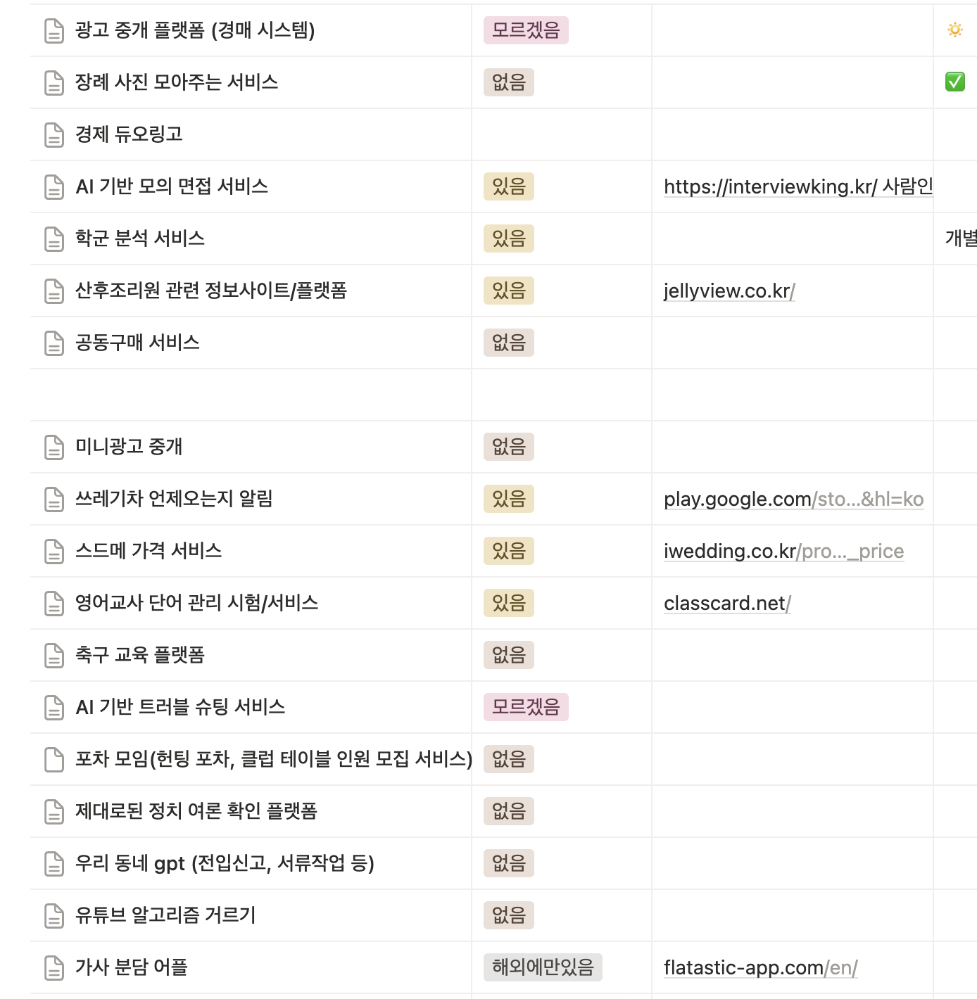
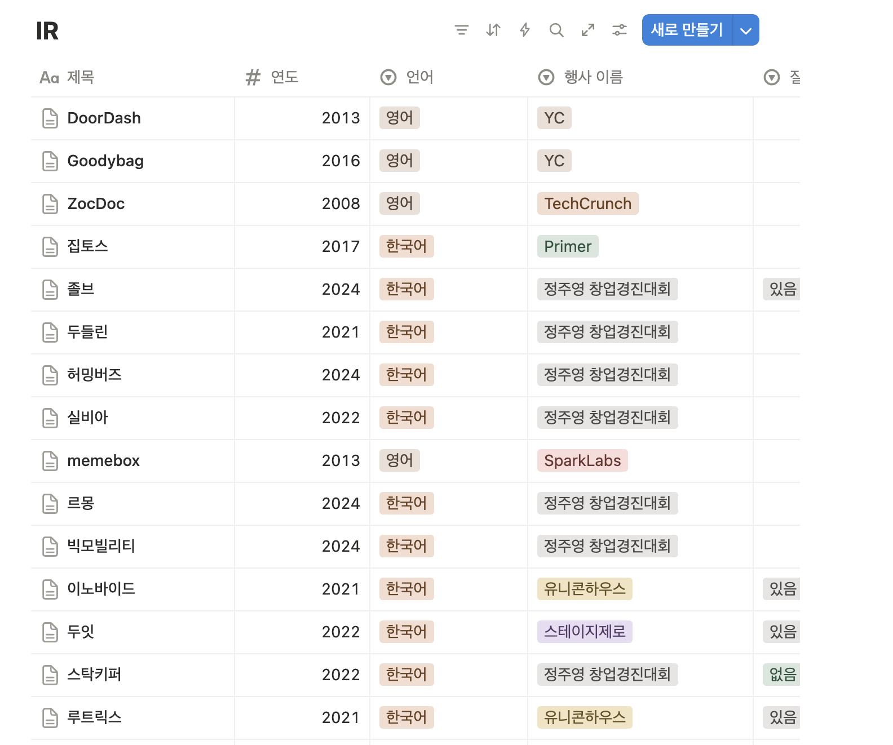
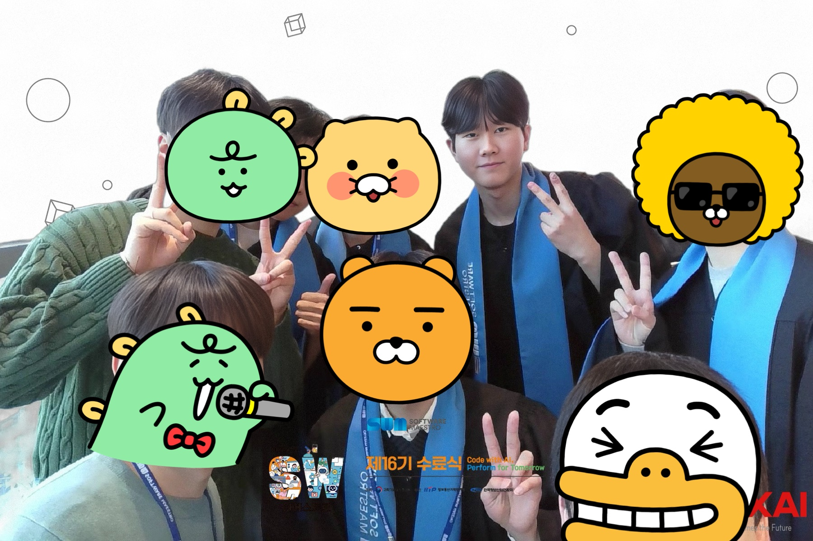
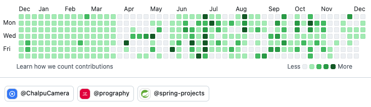

올 한 해는 정말 바빴다.

소마 활동과 프로그라피 활동을 병행하면서 정신없이 지나간 한 해였다. 소마에서 좋은 멘토님들을 만나고, 프로그라피에서 좋은 팀원들을 만났다. 

"나의 주변 사람 운은 정말 좋다"는 신조가 이번에도 깨지지 않았다.

## CS 스터디

**Real MySQL, 가상 면접 사례로 배우는 대규모 시스템 설계 1권, 주니어 백엔드 개발자가 반드시 알아야 할 실무 지식**까지 총 3권의 책을 매일 오전 9시 소마 센터에서 스터디하면서 많이 배웠다.

"그동안의 나는 그냥 코더였구나"라는 생각이 많이 들었다. 

특히 MySQL을 깊이 공부하면서 MySQL을 만든 사람들은 진짜 천재가 아닌가 싶었다.

가상 면접 책은 생각의 폭을 넓혀준 책이다. 2회독을 하니 보이는 게 더 많아지고, 저자가 첨부한 페이스북 캐시 논문까지 읽어보니 캐시와 DB의 일관성, 캐시와 캐시 사이의 일관성 등 많이 배웠다.

아직은 신입이지만 취직하고 3년 차가 되면 크게 도움이 될 것 같은 책이었다.

같이 스터디한 사람들 모두 큰 도움이 됐다고 한다. 나는 바로 2편까지 질러버렸다.

## 소마 회고

처음에는 각자 아이디어가 정말 많았다.

대충 잡아도 100개는 훌쩍 넘는 아이디어가 나왔고, 회의도 정말 많이 하고 의견도 정말 많이 나눴다.

결국 선택의 시간이 왔다. 팀장 형이랑 지금 와서 "그냥 우리가 관심 가는 경제 아이템 할 걸"이라는 후회가 간혹 나오기도 하지만, 선택한 아이템을 기획하고 디자인하고 코딩하면서 많이 배웠기 때문에 큰 후회는 없다

이 과정에서 많은 피칭 영상도 보고 스타트업을 분석하면서 어떻게 대중과 심사위원을 설득하고 PR하는지 많이 배웠다.

오히려 지금 실패해봐서 큰 깨달음을 얻었다.

1. **타겟이 확실한 아이템을 선정해야 한다.**
2. **개발자 중심의 사고를 하면 안 된다.** "우리가 막 이거 필요하고 저거 필요하고 하겠지?"라는 생각은 쓰레기다. 소비자는 필요하면 API가 4초가 걸리든 5초가 걸리든 그게 진정 필요하면 쓴다. 그렇기에 일단 만드는 게 중요하다.
3. **결국은 팀이 중심이 돼야 한다.** 우리 셋 모두 소마가 처음이다 보니 멘토님의 의견에 많이 휘둘린 느낌이 없지 않아 있다. 이 과정에서 팀이 중심이 돼야 흔들리지 않는다.
4. **아이템이 안 되면 수면 밑에 보이지 않던 문제가 수면 위로 드러난다.** 인간관계, 소통 문제 등 감정적인 문제가 많이 발생한다.
5. **B2B 아이템은 정말 힘들다.** 타겟을 설정하기도 힘들고 유저를 모으기도 힘들고 메타 광고를 돌려도 큰 리텐션이 없다. 업자만 꼬인다.

**그래도 좋은 사람들과 좋은 환경에서 많이 배웠다.** 

다시 돌아간다면 더 잘할 수 있을 것 같은데, 

어쩌겠나. 인생에 한 번밖에 못하는 건데 이 경험을 바탕으로 스스로 성장했다고 생각하면 그만이다.

## Spring Data JPA 컨트리뷰터가 되다

소마 활동을 시작하면서 작은 목표가 하나 있었다. 스프링 컨트리뷰터가 되는 것. 내가 매일 쓰는 도구에 기여해보고 싶다는 생각이었다.

바쁜 하반기를 보내면서 CS 스터디도 하고 프로젝트도 진행했다. 시간이 부족해서 미뤄뒀지만, 마음속에는 고이 간직해놨던 목표였다.

12월이 돼서야 Spring Data JPA의 컨트리뷰터가 됐다. 사소한 문법 수정이었지만 정말 기쁜 하루였다.

다음에는 테스트 커버리지를 늘리는 PR을 날려서 merge되고 싶다. 

5년 후에는 메인 컨트리뷰터가 돼서 박병진 멘토님처럼 미국 컨퍼런스에 초청받는 날이 오면 좋겠다.

## 취준 일기

마지막 남은 한 학기 동안 취준을 하려고 지원서도 쓰고 포트폴리오도 정리하고 있다. 스트레스를 많이 받는다. 탈락의 고배도 많이 마시고 있어서 자괴감이 드는 하루하루다.

그래도 열심히 노력하면 언젠가는 이뤄진다는 신조는 바뀌지 않는다. 올해 안 되면 내년 상반기에 성공하면 된다.

가끔은 그런 생각도 든다. 소마 프로젝트 할 때 나도 뭔가 기술적으로 화려하고 뛰어나 보이는 걸 했어야 했나?

근데 다시 생각해봐도 의미 없는 것 같다. 

아무리 뛰어난 기술이어도 유저가 없으면 그건 쓰레기라고 생각한다. 그래도 기술적으로 최소한의 대비는 해야 한다고 생각한다. 그 선을 정하는 게 참 애매하다.

예시로 소마의 다른 팀은 오픈채팅으로만 유저를 모아서 프로젝트를 진행했다. 그 팀이 보기에는 스프링, DB도 오버엔지니어링이다.
