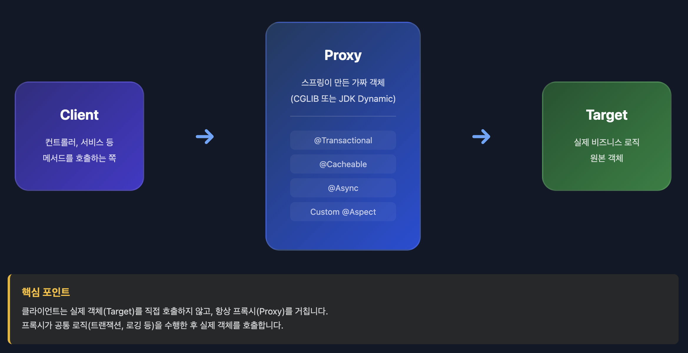
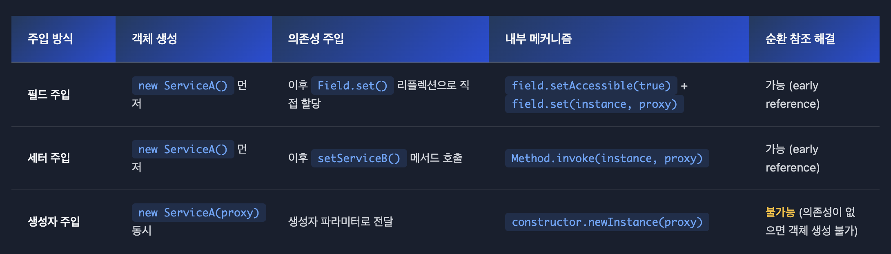
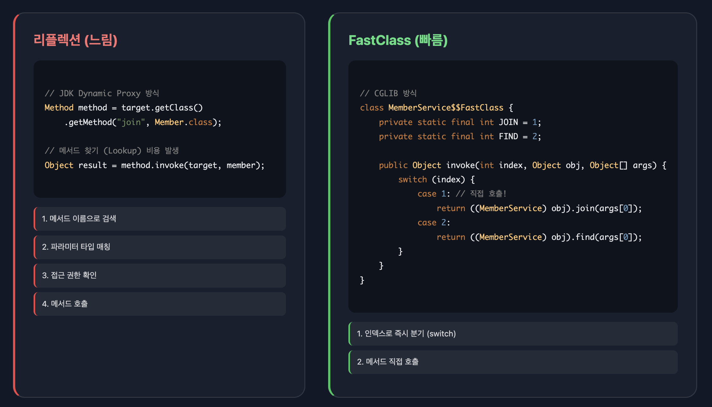
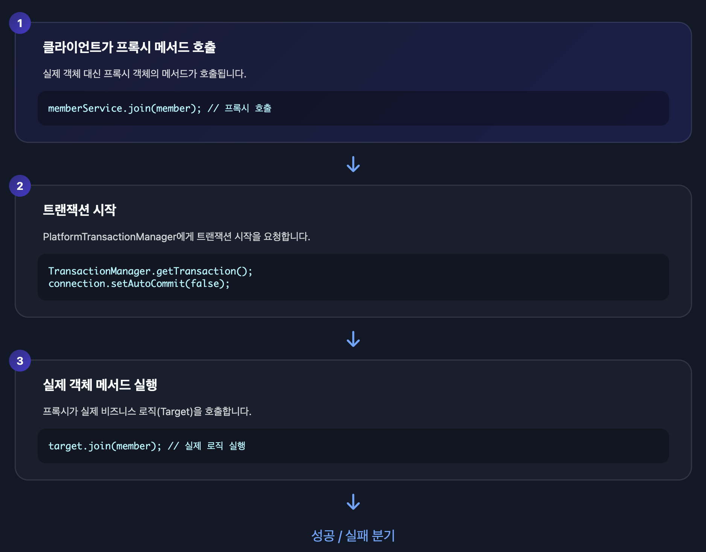
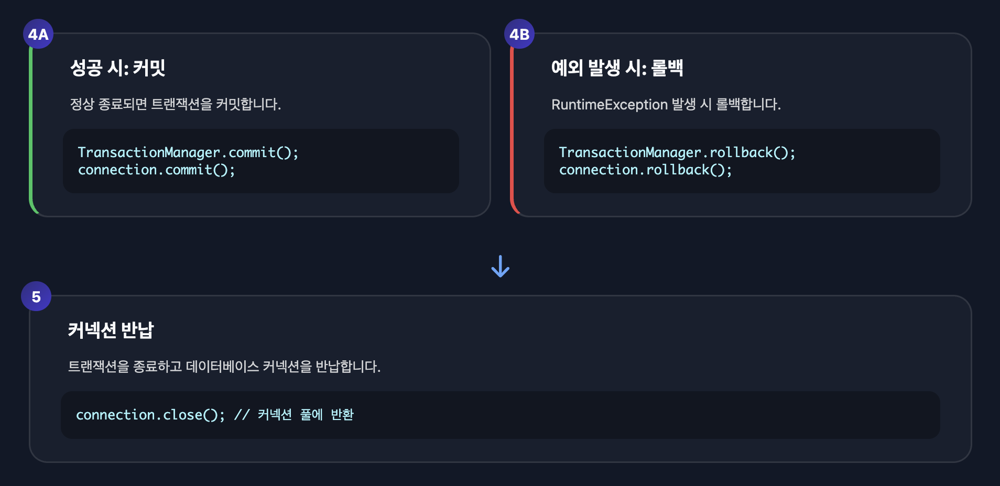
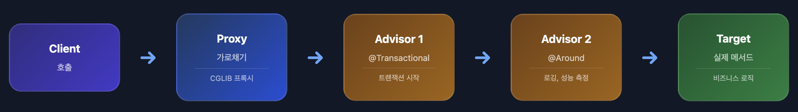
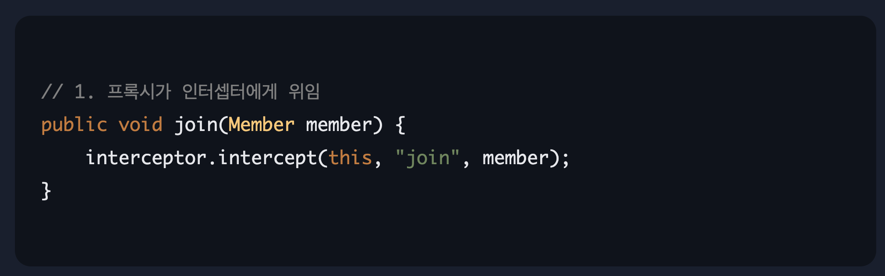
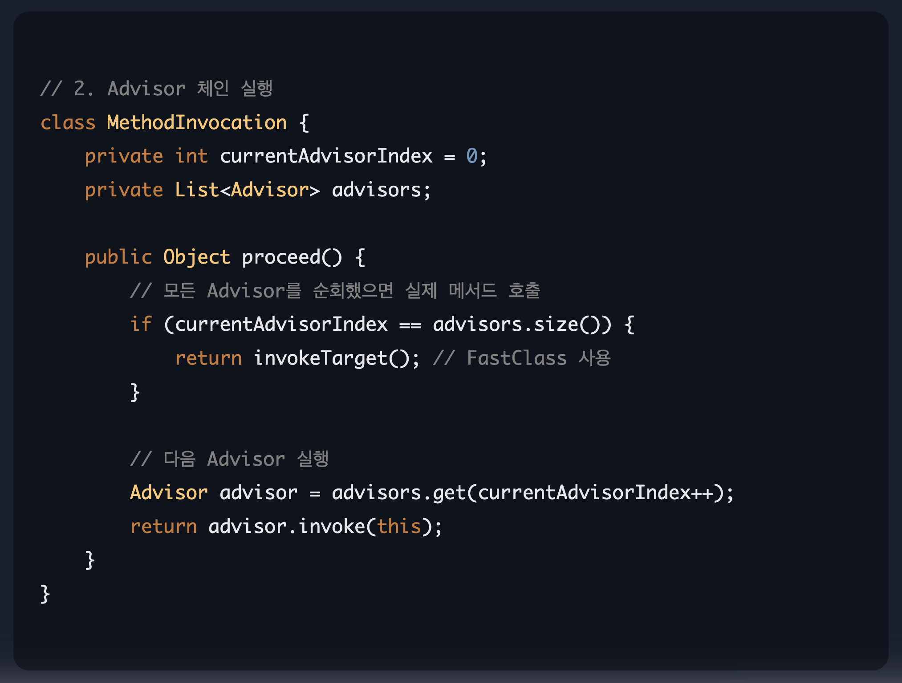
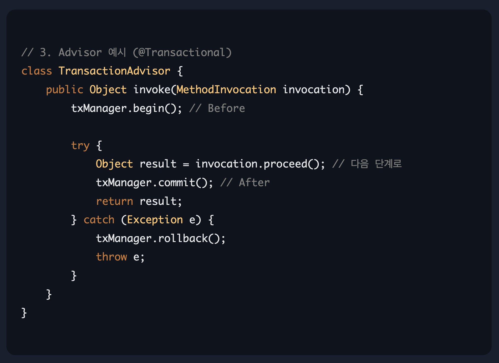

Spring을 사용하다 보면 `@Transactional`, `@Cacheable`, `@Async` 같은 애노테이션 하나만 붙이면 마법처럼 기능이 작동합니다. 이 마법의 정체는 바로 **AOP**(Aspect Oriented Programming)입니다.

이 글에서는 Spring AOP의 내부 동작 원리를 프록시 생성부터 CGLIB의 FastClass까지 완전히 정복합니다.

## AOP란 무엇인가?

**AOP**(Aspect Oriented Programming)는 **관점 지향 프로그래밍**으로, 로깅, 트랜잭션, 보안처럼 여러 곳에서 공통적으로 쓰이는 기능(횡단 관심사)을 핵심 비즈니스 로직에서 분리하여 재사용하는 기술입니다.

### 횡단 관심사 

애플리케이션 전반에 걸쳐 반복되는 공통 기능입니다.

```java
// AOP 없이 직접 작성한 코드 (반복!)
public class MemberService {

    public void join(Member member) {
        // 트랜잭션 시작
        TransactionStatus status = txManager.getTransaction();

        try {
            // 로깅
            log.info("join 시작");

            // 성능 측정
            long start = System.currentTimeMillis();

            // 핵심 비즈니스 로직
            memberRepository.save(member);

            // 성능 측정
            long end = System.currentTimeMillis();
            log.info("실행 시간: " + (end - start) + "ms");

            // 로깅
            log.info("join 종료");

            // 트랜잭션 커밋
            txManager.commit(status);
        } catch (Exception e) {
            // 트랜잭션 롤백
            txManager.rollback(status);
            throw e;
        }
    }

    public Member find(Long id) {
        // 또 다시 반복...
        TransactionStatus status = txManager.getTransaction();
        // ...
    }
}
```

모든 메서드마다 트랜잭션, 로깅, 성능 측정 코드가 반복됩니다. 핵심 로직보다 부가 기능 코드가 더 많습니다.

**AOP를 적용하면:**

```java
// AOP로 깔끔하게!
@Service
public class MemberService {

    @Transactional  // 트랜잭션은 AOP가 알아서
    @Logging        // 로깅도 AOP가 알아서
    @Performance    // 성능 측정도 AOP가 알아서
    public void join(Member member) {
        // 핵심 비즈니스 로직만!
        memberRepository.save(member);
    }
}
```

부가 기능은 AOP가 자동으로 처리하고, 개발자는 핵심 로직에만 집중할 수 있습니다.

## 핵심 용어 정리

### Aspect (@Aspect)

공통 기능(Advice)과 적용 장소(Pointcut)를 묶은 모듈입니다.

```java
@Aspect
@Component
public class LogAspect {
    // Pointcut + Advice가 모여서 하나의 Aspect
}
```

### Pointcut (@Pointcut)

**"어디에"** 적용할지 타겟을 선별하는 표현식입니다.

```java
// com.example.service 패키지 하위 모든 클래스의 모든 메서드
@Pointcut("execution(* com.example.service.*.*(..))")
public void serviceLayer() {}
```

**주요 Pointcut 표현식**

| 표현식 | 설명 | 예시 |
|-------|------|------|
| `execution` | 메서드 실행 시점 | `execution(* com.example..*(..))` |
| `@annotation` | 특정 애노테이션이 붙은 메서드 | `@annotation(Transactional)` |
| `@within` | 특정 애노테이션이 붙은 클래스 내 메서드 | `@within(Service)` |
| `within` | 특정 패키지/클래스 내 메서드 | `within(com.example.service..*)` |
| `bean` | 특정 빈 이름 | `bean(memberService)` |

### Advice (@Before, @After, @Around)

**"언제"** 공통 로직을 실행할지 정의합니다.

```java
// 메서드 실행 "전"에 동작
@Before("serviceLayer()")
public void beforeMethod(JoinPoint joinPoint) {
    String methodName = joinPoint.getSignature().getName();
    System.out.println(methodName + " 메서드 실행 전!");
}

// 메서드 실행 "후"에 동작
@AfterReturning(pointcut = "serviceLayer()", returning = "result")
public void afterReturning(JoinPoint joinPoint, Object result) {
    System.out.println("메서드 실행 완료. 결과: " + result);
}

// 메서드 실행 "전후"를 모두 제어 (가장 강력함)
@Around("serviceLayer()")
public Object aroundMethod(ProceedingJoinPoint pjp) throws Throwable {
    long start = System.currentTimeMillis();

    try {
        return pjp.proceed(); // 실제 타겟 메서드 실행
    } finally {
        long end = System.currentTimeMillis();
        System.out.println("실행 시간: " + (end - start) + "ms");
    }
}
```

**Advice 타입 정리**

| Advice | 실행 시점 | 용도 |
|--------|----------|------|
| `@Before` | 메서드 실행 전 | 파라미터 로깅, 권한 검사 |
| `@AfterReturning` | 정상 반환 후 | 반환값 로깅, 후처리 |
| `@AfterThrowing` | 예외 발생 시 | 예외 로깅, 알림 |
| `@After` | 메서드 실행 후 (항상) | 리소스 정리 |
| `@Around` | 전후 모두 제어 | 성능 측정, 트랜잭션 |

### JoinPoint

현재 실행 중인 지점의 정보를 담고 있는 객체입니다.

```java
@Before("serviceLayer()")
public void log(JoinPoint joinPoint) {
    // 실행되는 메서드 이름
    String methodName = joinPoint.getSignature().getName();

    // 파라미터 값
    Object[] args = joinPoint.getArgs();

    // 대상 객체
    Object target = joinPoint.getTarget();

    System.out.println(methodName + " 실행. 파라미터: " + Arrays.toString(args));
}
```

### Weaving (위빙)

작성한 Advice 코드를 실제 핵심 로직 코드 사이에 끼워 넣는 연결 과정입니다.

Spring은 **런타임 위빙** 방식을 사용합니다. 프록시 객체를 생성하여 위빙합니다.

### Proxy (프록시)

클라이언트가 거쳐가는 대리자 객체입니다.

```
Client -> Proxy -> Target(실제 객체)
```

Spring AOP는 프록시 기반으로 동작합니다.

## 프록시 구조



Spring AOP의 핵심은 **프록시 패턴**입니다. 클라이언트는 실제 객체를 직접 호출하지 않고, 프록시를 통해 호출합니다.

```java
// 우리가 작성한 실제 서비스
@Service
public class MemberService {
    @Transactional
    public void join(Member member) {
        memberRepository.save(member);
    }
}

// 컨트롤러에서 사용
@Controller
public class MemberController {
    private final MemberService memberService; // <- 프록시가 주입됨!

    public void request() {
        memberService.join(member); // 프록시의 join()이 호출됨
    }
}
```

실제로 주입받는 `memberService`는 원본 객체가 아니라 **프록시 객체**입니다.

## 프록시 생성 방식: JDK Dynamic Proxy vs CGLIB

Spring AOP가 프록시 객체를 만들 때 사용하는 두 가지 핵심 기술입니다.

### JDK Dynamic Proxy

**Java 표준 리플렉션 API를 사용**하여 프록시를 생성합니다.

**조건**: 대상 클래스가 **인터페이스를 구현**해야 합니다.

```java
// 인터페이스
public interface MemberService {
    void join(Member member);
}

// 구현체
@Service
public class MemberServiceImpl implements MemberService {
    @Override
    @Transactional
    public void join(Member member) {
        memberRepository.save(member);
    }
}
```

**동작 방식**

```
1. 인터페이스 기반으로 프록시 생성
2. java.lang.reflect.Proxy 사용
3. InvocationHandler를 통해 메서드 호출 가로채기
```

**장점**
- Java 표준 기술
- 별도 라이브러리 불필요

**단점**
- 인터페이스 필수
- 리플렉션 사용으로 성능이 상대적으로 느림

### CGLIB (Code Generator Library)

**바이트코드 조작**을 통해 프록시를 생성합니다.

**조건**: 인터페이스 없이 **클래스만** 있어도 가능합니다.

```java
// 인터페이스 없이 클래스만 있어도 OK
@Service
public class MemberService {
    @Transactional
    public void join(Member member) {
        memberRepository.save(member);
    }
}
```

**동작 방식**

```
1. 대상 클래스를 상속받는 자식 클래스를 바이트코드로 생성
2. ASM(바이트코드 조작 라이브러리) 사용
3. 메서드를 오버라이딩하여 부가 기능 추가
```

**장점**
- 인터페이스 없이도 프록시 생성 가능
- 바이트코드 레벨에서 작동하여 빠름
- FastClass 기법으로 리플렉션 오버헤드 제거

**단점**
- `final` 클래스나 `final` 메서드는 상속/오버라이딩 불가하므로 프록시 생성 불가
- `private` 메서드도 오버라이딩 불가

### Spring Boot의 선택

| 버전 | 기본 프록시 방식 |
|------|-----------------|
| Spring Boot 1.x | 인터페이스 O → JDK Proxy, 인터페이스 X → CGLIB |
| **Spring Boot 2.0+** | **무조건 CGLIB** (통일성 + 성능) |

Spring Boot 2.0부터는 인터페이스 유무와 상관없이 **CGLIB를 기본**으로 사용합니다.

**강제로 JDK Proxy 사용하기**

```java
@EnableAspectJAutoProxy(proxyTargetClass = false)
```

## 프록시는 언제 만들어지는가? (BeanPostProcessor)

Spring 컨테이너가 초기화될 때 **BeanPostProcessor**(빈 후처리기)가 개입합니다.

**빈 생성 과정**

```
1. 빈 인스턴스 생성 (new MemberService())
2. 의존성 주입 (DI)
3. BeanPostProcessor 실행
   - @Transactional, @Aspect 감지
   - 프록시 객체 생성 (CGLIB)
   - 원본 객체 대신 프록시 객체를 컨테이너에 등록
4. 초기화 콜백 (@PostConstruct)
5. 빈 사용 준비 완료
```

### 의존성이 있는 경우: 프록시 생성 순서

서비스 A가 서비스 B를 의존하고, 둘 다 @Transactional이 있는 경우를 봅시다.

```java
@Service
public class ServiceA {

    @Autowired
    private ServiceB serviceB; // B를 의존

    @Transactional
    public void methodA() {
        serviceB.methodB();
    }
}

@Service
public class ServiceB {

    @Transactional
    public void methodB() {
        // 비즈니스 로직
    }
}
```

**실제 생성 순서**

```
1. ServiceA 생성 시도
   └─> "ServiceB가 필요하네?"

2. ServiceB 먼저 완전히 초기화
   ├─ ServiceB 인스턴스 생성 (new ServiceB())
   ├─ ServiceB의 의존성 주입 (없음)
   ├─ BeanPostProcessor 실행
   │  └─> @Transactional 감지
   │  └─> ServiceB 프록시 생성 (CGLIB)
   │  └─> ServiceB$$Proxy를 컨테이너에 등록
   └─ ServiceB 초기화 완료 ✓

3. ServiceA로 돌아옴
   ├─ ServiceA 인스턴스 생성 (new ServiceA())
   ├─ ServiceA에 ServiceB 프록시 주입 
   │  └─> this.serviceB = ServiceB$$Proxy (프록시가 주입됨!)
   ├─ BeanPostProcessor 실행
   │  └─> @Transactional 감지
   │  └─> ServiceA 프록시 생성 (CGLIB)
   │  └─> ServiceA$$Proxy를 컨테이너에 등록
   └─ ServiceA 초기화 완료 ✓
```

**핵심 포인트**

1. **의존성이 있는 빈이 먼저 완전히 초기화됩니다** (프록시 생성까지 완료)
2. 의존하는 빈에는 **프록시가 주입**됩니다
3. 마지막으로 의존하는 빈도 프록시로 감싸집니다

**최종 구조**

```
Client
  ↓
ServiceA$$Proxy (프록시)
  ↓ (내부에 ServiceB 프록시를 가지고 있음)
ServiceB$$Proxy (프록시)
  ↓
ServiceB (실제 객체)
```

따라서 `serviceA.methodA()`를 호출하면:

```
1. Client -> ServiceA$$Proxy
2. ServiceA$$Proxy -> ServiceA 실제 객체
3. ServiceA 실제 객체 -> ServiceB$$Proxy (프록시 호출!)
4. ServiceB$$Proxy -> ServiceB 실제 객체
```

ServiceB도 프록시를 통해 호출되므로 @Transactional이 정상 작동합니다!

**순환 참조가 있는 경우**

```java
@Service
public class ServiceA {
    @Autowired
    private ServiceB serviceB;
}

@Service
public class ServiceB {
    @Autowired
    private ServiceA serviceA; // 순환 참조!
}
```

Spring은 **3단계 캐시**로 순환 참조를 해결합니다.

```
1. ServiceA 생성 시도
2. ServiceA 인스턴스 생성 (early reference)
3. ServiceB가 필요 -> ServiceB 생성 시도
4. ServiceB 인스턴스 생성
5. ServiceA가 필요 -> 아직 완성 안 됐지만 early reference를 주입
6. ServiceB 완성 (프록시 생성)
7. ServiceA에 ServiceB 프록시 주입
8. ServiceA 완성 (프록시 생성)
```

### Early Reference란?

**Early Reference**는 객체가 완전히 초기화되지 않았지만 미리 생성된 인스턴스를 의미합니다.

Spring은 빈을 생성할 때 3단계 캐시를 사용합니다.

```
1. singletonObjects: 완전히 초기화된 빈
2. earlySingletonObjects: 초기화 중인 빈 (early reference)
3. singletonFactories: 빈을 생성할 수 있는 팩토리
```

**순환 참조 해결 과정 (필드 주입)**

```java
@Service
public class ServiceA {
    @Autowired
    private ServiceB serviceB; // 필드 주입
}

@Service
public class ServiceB {
    @Autowired
    private ServiceA serviceA; // 순환 참조!
}
```

**실제 동작 순서**

```
1. ServiceA 생성 시도
   ├─ new ServiceA() 실행 (생성자 호출)
   └─ ServiceA 인스턴스 생성 완료 (아직 필드는 null)

2. ServiceA의 early reference를 캐시에 저장
   └─ earlySingletonObjects에 저장 (serviceB는 아직 null인 상태)

3. ServiceA의 의존성 주입 시도
   └─ ServiceB가 필요 -> ServiceB 생성 시도

4. ServiceB 생성
   ├─ new ServiceB() 실행
   └─ ServiceB 인스턴스 생성 완료 (아직 필드는 null)

5. ServiceB의 의존성 주입 시도
   └─ ServiceA가 필요 -> 캐시에서 ServiceA의 early reference 찾음!
   └─ ServiceB.serviceA = ServiceA의 early reference 주입 ✓

6. ServiceB 완전 초기화 완료
   └─ 프록시 생성 (필요시)
   └─ singletonObjects에 등록

7. ServiceA로 돌아옴
   └─ ServiceA.serviceB = ServiceB 주입 ✓
   └─ ServiceA 완전 초기화 완료
   └─ 프록시 생성 (필요시)
   └─ singletonObjects에 등록
```

**핵심 포인트**

필드 주입은 객체 생성과 의존성 주입이 분리되어 있기 때문에 순환 참조 해결이 가능합니다.

```
객체 생성 (new) -> early reference 저장 -> 의존성 주입 (필드에 값 할당)
```

### 생성자 주입은 왜 순환 참조를 해결할 수 없나?

```java
@Service
public class ServiceA {
    private final ServiceB serviceB;

    // 생성자 주입 + 순환 참조 = 에러!
    public ServiceA(ServiceB serviceB) {
        this.serviceB = serviceB;
    }
}

@Service
public class ServiceB {
    private final ServiceA serviceA;

    public ServiceB(ServiceA serviceA) {
        this.serviceA = serviceA;
    }
}
```

**실행 시 에러**

```
The dependencies of some of the beans in the application context form a cycle:
┌─────┐
|  serviceA defined in file [ServiceA.class]
↑     ↓
|  serviceB defined in file [ServiceB.class]
└─────┘
```

**왜 불가능한가?**

생성자 주입은 **객체 생성과 의존성 주입이 동시에** 일어납니다.

```
1. ServiceA 생성 시도
   └─ new ServiceA(serviceB) 호출
      └─ serviceB가 필요 -> ServiceB 생성 시도

2. ServiceB 생성 시도
   └─ new ServiceB(serviceA) 호출
      └─ serviceA가 필요 -> ServiceA 생성 시도 (무한 루프!)
```

**핵심 차이**

<table style="width: 100%;">
  <thead>
    <tr>
      <th style="white-space: nowrap;">주입 방식</th>
      <th style="white-space: nowrap;">객체 생성</th>
      <th style="white-space: nowrap;">의존성 주입</th>
      <th style="white-space: nowrap;">순환 참조 해결</th>
    </tr>
  </thead>
  <tbody>
    <tr>
      <td style="white-space: nowrap;">필드 주입</td>
      <td style="white-space: nowrap;"><code>new ServiceA()</code> 먼저 실행</td>
      <td style="white-space: nowrap;">이후 필드에 값 할당</td>
      <td style="white-space: nowrap;">가능 (early reference)</td>
    </tr>
    <tr>
      <td style="white-space: nowrap;">생성자 주입</td>
      <td style="white-space: nowrap;"><code>new ServiceA(serviceB)</code> 동시 실행</td>
      <td style="white-space: nowrap;">생성자 파라미터로 전달</td>
      <td style="white-space: nowrap;"><strong>불가능</strong> (객체가 없음)</td>
    </tr>
  </tbody>
</table>

생성자 주입은 객체를 만들려면 의존성이 필요한데, 그 의존성도 객체를 만들려면 원래 객체가 필요한 **닭과 달걀 문제**입니다.

### 필드 주입 vs 세터 주입 vs 생성자 주입: 내부 동작 차이

Spring의 의존성 주입 방식은 크게 세 가지가 있으며, 각각 내부 동작 방식이 다릅니다.

#### 1. 필드 주입 (Field Injection)

**리플렉션**을 사용하여 필드에 직접 값을 할당합니다.

```java
@Service
public class ServiceA {
    @Autowired
    private ServiceB serviceB; // 필드 주입
}
```

**Spring 내부 동작**

```java
// Spring이 내부적으로 수행하는 작업
public void injectDependencies(Object bean, String beanName) {
    // 1. @Autowired가 붙은 필드 찾기
    Field field = bean.getClass().getDeclaredField("serviceB");

    // 2. private 필드 접근 허용
    field.setAccessible(true);

    // 3. 컨테이너에서 ServiceB 빈 가져오기 (프록시!)
    Object dependency = getBean(ServiceB.class); // ServiceB$$Proxy

    // 4. 리플렉션으로 필드에 값 직접 할당
    field.set(bean, dependency); // serviceB 필드에 프록시 주입
}
```

**핵심 포인트**

- **Setter 메서드를 호출하지 않습니다!**
- `Field.setAccessible(true)`로 private 필드에 접근합니다.
- `Field.set(instance, value)`로 직접 값을 할당합니다.

#### 2. 세터 주입 (Setter Injection)

**Setter 메서드**를 호출하여 의존성을 주입합니다.

```java
@Service
public class ServiceA {
    private ServiceB serviceB;

    @Autowired
    public void setServiceB(ServiceB serviceB) {
        this.serviceB = serviceB;
    }
}
```

**Spring 내부 동작**

```java
// Spring이 내부적으로 수행하는 작업
public void injectDependencies(Object bean, String beanName) {
    // 1. @Autowired가 붙은 Setter 메서드 찾기
    Method setterMethod = bean.getClass().getMethod("setServiceB", ServiceB.class);

    // 2. 컨테이너에서 ServiceB 빈 가져오기 (프록시!)
    Object dependency = getBean(ServiceB.class);

    // 3. Setter 메서드 호출
    setterMethod.invoke(bean, dependency); // setServiceB(프록시) 호출
}
```

**핵심 포인트**

- 실제 메서드를 호출합니다.
- 리플렉션을 사용하지만 `Method.invoke()`로 메서드를 실행합니다.

#### 3. 생성자 주입 (Constructor Injection)

**객체 생성과 동시에** 의존성을 주입합니다.

```java
@Service
public class ServiceA {
    private final ServiceB serviceB;

    public ServiceA(ServiceB serviceB) {
        this.serviceB = serviceB;
    }
}
```

**Spring 내부 동작**

```java
// Spring이 내부적으로 수행하는 작업
public Object createBean(String beanName, Class<?> beanClass) {
    // 1. 컨테이너에서 ServiceB 빈 먼저 가져오기 (프록시!)
    Object serviceBProxy = getBean(ServiceB.class);

    // 2. 생성자 호출하면서 동시에 의존성 주입
    Constructor<?> constructor = beanClass.getConstructor(ServiceB.class);
    Object bean = constructor.newInstance(serviceBProxy); // new ServiceA(프록시)

    return bean;
}
```

**핵심 포인트**

- 생성자 호출 = 객체 생성 = 의존성 주입이 **동시에** 일어납니다.
- 생성자 파라미터로 이미 초기화된 빈(프록시)을 전달합니다.

#### 주입 방식별 비교표



#### 빈 생명주기와 프록시 생성 타이밍

Spring 빈은 다음 순서로 생성됩니다.

```
1. 객체 생성 (Constructor 호출)
   └─> new ServiceA() 또는 new ServiceA(dependency)

2. 의존성 주입 (DI)
   └─> 필드 주입: Field.set()
   └─> 세터 주입: setServiceB()
   └─> 생성자 주입: 1단계에서 이미 완료

3. BeanPostProcessor 실행
   └─> @Transactional 감지
   └─> CGLIB으로 프록시 생성
   └─> ServiceA$$Proxy 컨테이너에 등록

4. 초기화 콜백 (@PostConstruct)

5. 빈 사용 준비 완료
```

**핵심: 프록시는 의존성 주입 이후에 생성됩니다!**

```java
// ServiceA에 주입되는 serviceB는 이미 프록시
@Service
public class ServiceA {
    @Autowired
    private ServiceB serviceB; // ServiceB$$Proxy가 주입됨
}
```

ServiceB는 ServiceA보다 먼저 완전히 초기화되므로, ServiceA에 주입될 때는 이미 **프록시 객체**입니다.

#### CGLIB 프록시 생성 과정

**프록시는 어떻게 만들어지는가?**

```java
// CGLIB이 수행하는 작업
public Object createProxy(Object target) {
    // 1. Enhancer 생성 (CGLIB의 핵심 클래스)
    Enhancer enhancer = new Enhancer();

    // 2. 대상 클래스를 상속
    enhancer.setSuperclass(ServiceB.class);

    // 3. 부가 기능을 담당할 Callback 설정
    enhancer.setCallback(new MethodInterceptor() {
        @Override
        public Object intercept(Object proxy, Method method, Object[] args,
                                MethodProxy methodProxy) throws Throwable {
            // 트랜잭션 시작, 로깅 등
            Object result = methodProxy.invokeSuper(proxy, args);
            // 트랜잭션 커밋, 로깅 등
            return result;
        }
    });

    // 4. 바이트코드 조작하여 프록시 클래스 생성
    Object proxy = enhancer.create(); // ServiceB$$EnhancerBySpringCGLIB$$abc123

    return proxy;
}
```

**CGLIB 프록시의 특징**

- 대상 클래스를 **상속**받아 자식 클래스를 동적으로 생성합니다.
- ASM 라이브러리로 바이트코드를 직접 조작합니다.
- 메서드를 오버라이딩하여 부가 기능을 추가합니다.

**생성된 프록시 클래스 구조**

```java
// CGLIB이 런타임에 생성하는 클래스
public class ServiceB$$EnhancerBySpringCGLIB$$abc123 extends ServiceB {

    private MethodInterceptor interceptor;

    @Override
    public void methodB() {
        // 트랜잭션, 로깅 등 부가 기능 실행
        interceptor.intercept(this, methodB, null, fastClass);
    }
}
```

#### 왜 생성자 주입은 순환 참조를 해결할 수 없는가?

**생성자 주입의 문제점**

```java
@Service
public class ServiceA {
    private final ServiceB serviceB;

    public ServiceA(ServiceB serviceB) { // serviceB가 필요!
        this.serviceB = serviceB;
    }
}

@Service
public class ServiceB {
    private final ServiceA serviceA;

    public ServiceB(ServiceA serviceA) { // serviceA가 필요!
        this.serviceA = serviceA;
    }
}
```

**실행 흐름**

```
1. ServiceA 생성 시도
   └─> new ServiceA(serviceB) 호출
       └─> serviceB 객체가 필요함
           └─> ServiceB 생성 시도
               └─> new ServiceB(serviceA) 호출
                   └─> serviceA 객체가 필요함 (아직 생성 안 됨!)
                       └─> ServiceA 생성 시도 (무한 루프!)
```

**핵심 문제: 프록시가 아직 없음**

```
1. ServiceA 생성 시도
2. 생성자 호출: new ServiceA(serviceB)
3. serviceB가 필요 -> ServiceB의 프록시 필요
4. 하지만 ServiceB도 아직 생성 전
5. ServiceB 생성 시도
6. 생성자 호출: new ServiceB(serviceA)
7. serviceA가 필요 -> ServiceA의 프록시 필요
8. 하지만 ServiceA는 2번 단계에서 아직 생성 중!
9. 프록시는 객체 생성 후 BeanPostProcessor에서 만들어짐
10. 생성자 호출 시점에는 프록시가 존재하지 않음!
```

**필드 주입은 왜 가능한가?**

```
1. ServiceA 인스턴스 생성: new ServiceA() (의존성 없이 생성 가능!)
2. Early reference 캐시에 저장
3. ServiceB 생성 시도
4. ServiceB 인스턴스 생성: new ServiceB()
5. ServiceB에 ServiceA 필요 -> 캐시에서 early reference 찾음
6. Field.set()으로 주입 (객체가 이미 존재하므로 가능)
7. ServiceB 프록시 생성 완료
8. ServiceA에 ServiceB 프록시 주입
9. ServiceA 프록시 생성 완료
```

**결론**

<table style="width: 100%;">
  <thead>
    <tr>
      <th style="white-space: nowrap;">주입 방식</th>
      <th style="white-space: nowrap;">객체 생성 시점</th>
      <th style="white-space: nowrap;">프록시 필요 시점</th>
      <th style="white-space: nowrap;">순환 참조 해결</th>
    </tr>
  </thead>
  <tbody>
    <tr>
      <td style="white-space: nowrap;">생성자 주입</td>
      <td style="white-space: nowrap;">생성자 호출 중</td>
      <td style="white-space: nowrap;">생성자 파라미터 (프록시 아직 없음)</td>
      <td style="white-space: nowrap;"><strong>불가능</strong></td>
    </tr>
    <tr>
      <td style="white-space: nowrap;">필드 주입</td>
      <td style="white-space: nowrap;">객체 생성 후</td>
      <td style="white-space: nowrap;">필드 할당 시 (프록시 이미 생성됨)</td>
      <td style="white-space: nowrap;">가능</td>
    </tr>
    <tr>
      <td style="white-space: nowrap;">세터 주입</td>
      <td style="white-space: nowrap;">객체 생성 후</td>
      <td style="white-space: nowrap;">세터 호출 시 (프록시 이미 생성됨)</td>
      <td style="white-space: nowrap;">가능</td>
    </tr>
  </tbody>
</table>

생성자 주입은 객체를 만들려면 의존성이 먼저 필요한데, 그 의존성도 객체를 만들려면 원래 객체의 프록시가 먼저 필요합니다. 하지만 프록시는 객체가 생성된 이후에 만들어지므로 **닭과 달걀 문제**가 발생합니다.

### @RequiredArgsConstructor는 순환 참조 발생하나?

**Lombok의 @RequiredArgsConstructor**

```java
@Service
@RequiredArgsConstructor
public class ServiceA {
    private final ServiceB serviceB; // final 필드
}
```

위 코드는 컴파일되면 다음과 같이 변환됩니다.

```java
@Service
public class ServiceA {
    private final ServiceB serviceB;

    // Lombok이 자동으로 생성자를 만듦
    public ServiceA(ServiceB serviceB) {
        this.serviceB = serviceB;
    }
}
```

**결론**: @RequiredArgsConstructor는 **생성자 주입**이므로 순환 참조 시 에러가 발생합니다!

**해결 방법 1: @Lazy 사용**

```java
@Service
@RequiredArgsConstructor
public class ServiceA {
    private final ServiceB serviceB; // 순환 참조 발생!
}

@Service
@RequiredArgsConstructor
public class ServiceB {
    @Lazy // 지연 로딩: 프록시를 주입
    private final ServiceA serviceA;
}
```

`@Lazy`를 사용하면 실제 객체 대신 프록시를 먼저 주입하므로 순환 참조를 회피할 수 있습니다.

**해결 방법 2: 설계 개선 (권장)**

순환 참조가 발생한다는 것은 설계에 문제가 있을 가능성이 높습니다.

```java
// Before: 순환 참조
ServiceA -> ServiceB
ServiceB -> ServiceA

// After: 공통 로직 분리
ServiceA -> CommonService
ServiceB -> CommonService
```

공통 로직을 별도 서비스로 분리하거나, 이벤트 기반으로 전환하여 의존성을 끊는 것이 좋습니다.

**핵심 BeanPostProcessor: AnnotationAwareAspectJAutoProxyCreator**

```java
// Spring이 자동으로 등록하는 빈 후처리기
@Bean
public AnnotationAwareAspectJAutoProxyCreator autoProxyCreator() {
    // @Aspect, @Transactional 등을 찾아서 자동으로 프록시 생성
}
```

이 후처리기가 다음 작업을 수행합니다.

1. `@Aspect` 클래스 스캔
2. `@Transactional` 같은 AOP 대상 메서드 감지
3. CGLIB으로 프록시 생성
4. 원본 대신 프록시를 스프링 컨테이너에 등록

결과적으로 **클라이언트는 프록시를 주입**받습니다.

```java
@Controller
public class MemberController {
    // 실제로 주입되는 것: MemberService$$EnhancerBySpringCGLIB$$abc123
    private final MemberService memberService;
}
```

## CGLIB 프록시의 비밀: FastClass

CGLIB가 리플렉션보다 빠른 이유는 **FastClass** 때문입니다.

### 리플렉션의 문제점

JDK Dynamic Proxy는 리플렉션을 사용합니다.

```java
// 리플렉션 방식 (느림)
Method method = target.getClass().getMethod("join", Member.class);
Object result = method.invoke(target, member);
```

**리플렉션의 비용**

1. 메서드 이름으로 검색 (Lookup)
2. 파라미터 타입 매칭
3. 접근 권한 확인
4. 메서드 호출

매번 메서드를 찾는 과정이 필요합니다.

### FastClass의 해결책

CGLIB은 프록시 생성 시 **FastClass**라는 도우미 클래스도 함께 만듭니다.



**FastClass 구조**

```java
// CGLIB이 자동으로 생성하는 FastClass
public class MemberService$$FastClassByCGLIB$$abc {
    // 메서드별 인덱스 번호 부여
    private static final int JOIN = 1;
    private static final int FIND_BY_ID = 2;
    private static final int UPDATE = 3;

    public Object invoke(int methodIndex, Object target, Object[] args) {
        // switch문으로 직접 호출! (리플렉션 없음)
        switch (methodIndex) {
            case 1: // JOIN
                return ((MemberService) target).join((Member) args[0]);
            case 2: // FIND_BY_ID
                return ((MemberService) target).findById((Long) args[0]);
            case 3: // UPDATE
                return ((MemberService) target).update((Member) args[0]);
            default:
                return null;
        }
    }
}
```

**핵심 원리**

1. 각 메서드에 **인덱스 번호** 부여
2. switch문으로 인덱스 분기
3. 메서드를 **직접 호출** (리플렉션 없음)

메서드 찾기(Lookup) 과정이 없으므로 훨씬 빠릅니다.

**성능 차이**: FastClass는 리플렉션 대비 약 **10~15배** 빠릅니다.

## @Transactional 동작 원리

@Transactional은 AOP 프록시를 통해 동작합니다.




### 내부 동작 코드

```java
// [1. 우리가 작성한 실제 서비스 코드]
@Service
public class MemberService {
    @Transactional
    public void join(Member member) {
        memberRepository.save(member);
    }
}

// [2. Spring이 만든 프록시 코드 (실제 동작 방식)]
public class MemberService$$EnhancerBySpringCGLIB extends MemberService {
    private TransactionInterceptor interceptor;

    @Override
    public void join(Member member) {
        // 프록시가 인터셉터에게 위임
        interceptor.invoke(this, "join", member);
    }
}

// [3. TransactionInterceptor (트랜잭션 어드바이저)]
public class TransactionInterceptor {

    public Object invoke(MethodInvocation invocation) {
        // 1. 트랜잭션 시작
        TransactionStatus status = txManager.getTransaction();

        try {
            // 2. 실제 메서드 호출 (FastClass 사용)
            Object result = invocation.proceed();

            // 3. 정상 종료 시 커밋
            txManager.commit(status);
            return result;

        } catch (RuntimeException e) {
            // 4. 예외 발생 시 롤백
            txManager.rollback(status);
            throw e;
        }
    }
}
```

### 롤백 규칙

기본적으로 **RuntimeException**과 **Error**만 롤백됩니다.

```java
// 기본 동작
@Transactional
public void process() {
    // RuntimeException → 롤백 O
    // Checked Exception (IOException 등) → 롤백 X
}

// 체크드 예외도 롤백하려면
@Transactional(rollbackFor = Exception.class)
public void process() {
    // 모든 예외에 대해 롤백
}

// 특정 예외만 롤백하지 않으려면
@Transactional(noRollbackFor = IllegalArgumentException.class)
public void process() {
    // IllegalArgumentException은 롤백 안 함
}
```

## 프록시 내부 구조와 실행 흐름

프록시 내부에는 **Advisor**(Pointcut + Advice) 목록이 체인으로 연결되어 있습니다.



### 필터 체인 흐름

#### 프록시가 인터셉터에게 위임


#### advisor 체인


#### advisor 예시


### 실행 흐름

```
Client 호출
  ↓
Proxy 객체 (CGLIB가 만든 자식 클래스)
  ↓
MethodInterceptor (Advisor들을 가지고 있음)
  ↓
Advisor 1 실행 (@Transactional)
  ↓
Advisor 2 실행 (@Around 로깅)
  ↓
FastClass를 통해 실제 Target 메서드 호출
  ↓
결과 반환 (역순으로 After 실행)
```

## 실전 예시: 성능 측정 Aspect

```java
@Aspect
@Component
public class PerformanceAspect {

    // Pointcut: com.example.service 패키지의 모든 메서드
    @Pointcut("execution(* com.example.service.*.*(..))")
    public void serviceLayer() {}

    // Advice: 시간 측정
    @Around("serviceLayer()")
    public Object measureTime(ProceedingJoinPoint pjp) throws Throwable {

        // 메서드 정보 가져오기
        MethodSignature signature = (MethodSignature) pjp.getSignature();
        String methodName = signature.getMethod().getName();

        System.out.println("[Start] " + methodName);
        long start = System.currentTimeMillis();

        try {
            // 실제 메서드 실행
            return pjp.proceed();
        } finally {
            long end = System.currentTimeMillis();
            System.out.println("[End] " + methodName + " : " + (end - start) + "ms");
        }
    }
}
```

**실행 결과**

```
[Start] join
[End] join : 152ms
```

## @Aspect가 Advisor로 변환되는 과정

`@Aspect`로 작성한 코드는 Spring 내부에서 **Advisor** 객체로 변환됩니다.

**@Aspect (개발자가 작성하는 선언적 방식)**

```java
@Aspect
@Component
public class PerformanceAspect {
    @Pointcut("execution(* com.example.service.*.*(..))")
    public void serviceLayer() {}

    @Around("serviceLayer()")
    public Object measureTime(ProceedingJoinPoint pjp) throws Throwable {
        String methodName = ((MethodSignature) pjp.getSignature()).getMethod().getName();
        System.out.println("[Start] " + methodName);
        long start = System.currentTimeMillis();

        try {
            return pjp.proceed();
        } finally {
            long end = System.currentTimeMillis();
            System.out.println("[End] " + methodName + " : " + (end - start) + "ms");
        }
    }
}
```

**Advisor로 변환 (Spring 내부 동작)**

```java
// Spring이 자동으로 생성하는 Advisor
public class PerformanceAdvisor implements PointcutAdvisor {

    // 1. Pointcut: "어디에" 적용할지
    private Pointcut pointcut = new AspectJExpressionPointcut(
        "execution(* com.example.service.*.*(..))"
    );

    // 2. Advice: "무엇을" 실행할지 (MethodInterceptor로 변환)
    private MethodInterceptor advice = new MethodInterceptor() {
        @Override
        public Object invoke(MethodInvocation invocation) throws Throwable {
            String methodName = invocation.getMethod().getName();

            System.out.println("[Start] " + methodName);
            long start = System.currentTimeMillis();

            try {
                // 다음 Advisor 또는 실제 메서드 호출
                return invocation.proceed();
            } finally {
                long end = System.currentTimeMillis();
                System.out.println("[End] " + methodName + " : " + (end - start) + "ms");
            }
        }
    };

    @Override
    public Pointcut getPointcut() {
        return pointcut;
    }

    @Override
    public Advice getAdvice() {
        return advice;
    }
}
```

**핵심 변화**

| 구분 | @Aspect | Advisor |
|------|---------|---------|
| Pointcut | `@Pointcut` 애노테이션 | `AspectJExpressionPointcut` 객체 |
| Advice | `@Around` 메서드 | `MethodInterceptor` 구현체 |
| 파라미터 | `ProceedingJoinPoint` | `MethodInvocation` |
| 다음 단계 호출 | `pjp.proceed()` | `invocation.proceed()` |

**실행 시 동작**

```
1. AnnotationAwareAspectJAutoProxyCreator가 @Aspect 스캔
2. @Pointcut과 @Around를 분석
3. Advisor 객체 생성 (Pointcut + Advice 조합)
4. 프록시 생성 시 Advisor 체인에 등록
5. 메서드 호출 시 Advisor 체인 순회하며 실행
```

결국 `@Aspect`는 편리한 선언 방식이고, 내부적으로는 `Advisor`(Pointcut + Advice) 구조로 변환되어 프록시 체인에서 실행됩니다.

## AOP의 제약사항

### 1. private 메서드는 프록시 불가

CGLIB은 상속을 통해 프록시를 만들기 때문에 `private` 메서드는 오버라이딩할 수 없습니다.

```java
@Service
public class MemberService {

    @Transactional
    private void privateMethod() {
        // AOP 적용 안 됨!
    }
}
```

**해결**: `public` 또는 `protected`로 변경합니다.

### 2. final 클래스/메서드는 프록시 불가

```java
@Service
public final class MemberService { // final 클래스
    // CGLIB 프록시 생성 불가!
}

@Service
public class MemberService {

    @Transactional
    public final void join(Member member) { // final 메서드
        // AOP 적용 안 됨!
    }
}
```

**해결**: `final` 제거합니다.

### 3. 내부 호출 문제 (Self-Invocation)

**가장 흔한 실수!**

```java
@Service
public class MemberService {

    @Transactional
    public void methodA() {
        System.out.println("methodA 시작");
        methodB(); // 프록시를 거치지 않음!
    }

    @Transactional(readOnly = true)
    public void methodB() {
        System.out.println("methodB");
    }
}
```

`methodA`에서 `methodB()`를 호출할 때, `this.methodB()`로 직접 호출되므로 프록시를 거치지 않습니다.

**실행 흐름**

```
Client -> Proxy.methodA() -> Target.methodA()
                                    ↓
                              this.methodB() (프록시 우회!)
```

`methodB()`의 `@Transactional(readOnly=true)`가 작동하지 않습니다.

**해결 방법 1: Self-Injection**

```java
@Service
public class MemberService {

    @Autowired
    private MemberService self; // 자기 자신 주입 (프록시가 주입됨)

    @Transactional
    public void methodA() {
        self.methodB(); // 프록시를 통한 호출
    }

    @Transactional(readOnly = true)
    public void methodB() {
        System.out.println("methodB");
    }
}
```

**동작 원리**

```
1. MemberService 생성 시도
2. new MemberService() 인스턴스 생성
3. early reference를 캐시에 저장
4. 의존성 주입: self 필드에 MemberService 필요
5. 캐시에서 자기 자신의 early reference 찾음
6. BeanPostProcessor가 프록시 생성
7. self 필드에 프록시가 주입됨 ✓
```

순환 참조지만 자기 자신이므로 Spring이 해결할 수 있습니다.

**해결 방법 2: ApplicationContext에서 꺼내기 (더 명확함)**

```java
@Service
public class MemberService {

    @Autowired
    private ApplicationContext applicationContext;

    @Transactional
    public void methodA() {
        // ApplicationContext에서 자기 자신(프록시)을 꺼냄
        MemberService proxy = applicationContext.getBean(MemberService.class);
        proxy.methodB(); // 프록시를 통한 호출!
    }

    @Transactional(readOnly = true)
    public void methodB() {
        System.out.println("methodB");
    }
}
```

**왜 ApplicationContext에서 꺼내면 프록시인가?**

Spring 컨테이너에 등록된 빈은 프록시 객체입니다.

```
applicationContext.getBean(MemberService.class)
  ↓
컨테이너에서 빈 조회
  ↓
MemberService$$EnhancerBySpringCGLIB$$abc123 반환 (프록시!)
```

**해결 방법 3: 별도 클래스로 분리 (가장 권장)**

```java
@Service
public class MemberService {

    @Autowired
    private MemberDetailService memberDetailService;

    public void methodA() {
        memberDetailService.methodB(); // 다른 빈 호출
    }
}

@Service
public class MemberDetailService {

    @Transactional(readOnly = true)
    public void methodB() {
        System.out.println("methodB");
    }
}
```

## Advisor 순서 제어 (@Order)

여러 Aspect가 있을 때 실행 순서를 제어할 수 있습니다.

```java
@Aspect
@Order(1) // 가장 먼저 실행 (바깥쪽)
@Component
public class LoggingAspect {
    @Around("execution(* com.example.service.*.*(..))")
    public Object log(ProceedingJoinPoint pjp) throws Throwable {
        System.out.println("1. 로깅 시작");
        Object result = pjp.proceed();
        System.out.println("1. 로깅 종료");
        return result;
    }
}

@Aspect
@Order(2) // 두 번째 실행 (안쪽)
@Component
public class PerformanceAspect {
    @Around("execution(* com.example.service.*.*(..))")
    public Object measure(ProceedingJoinPoint pjp) throws Throwable {
        System.out.println("2. 성능 측정 시작");
        long start = System.currentTimeMillis();
        Object result = pjp.proceed();
        long end = System.currentTimeMillis();
        System.out.println("2. 성능 측정 종료: " + (end - start) + "ms");
        return result;
    }
}
```

**실행 순서**

```
1. 로깅 시작
  2. 성능 측정 시작
    [실제 메서드 실행]
  2. 성능 측정 종료: 152ms
1. 로깅 종료
```

숫자가 낮을수록 바깥쪽(먼저 실행)입니다.

**주의사항: 하나의 Aspect 클래스 내 여러 Advice**

```java
@Aspect
@Component
public class MyAspect {

    @Around("pointcut()")
    public Object around1(ProceedingJoinPoint pjp) throws Throwable {
        // 순서 보장 안 됨!
    }

    @Around("pointcut()")
    public Object around2(ProceedingJoinPoint pjp) throws Throwable {
        // 순서 보장 안 됨!
    }
}
```

같은 클래스 내에서 동일한 타입의 Advice(예: @Around가 여러 개)끼리는 순서가 보장되지 않습니다.

**해결**: 순서가 중요하면 **별도의 Aspect 클래스로 분리**합니다.

## Spring의 대표적인 AOP 적용 사례

### 1. @Transactional

try-catch-rollback/commit 코드를 프록시가 자동으로 처리합니다.

```java
@Transactional
public void transfer(Long fromId, Long toId, int amount) {
    accountRepository.withdraw(fromId, amount);
    accountRepository.deposit(toId, amount);
    // 예외 발생 시 자동 롤백
}
```

### 2. @Cacheable

메서드 실행 전 캐시 확인 → 있으면 바로 반환(Skip), 없으면 실행 후 저장합니다.

```java
@Cacheable(value = "members", key = "#id")
public Member findById(Long id) {
    // 캐시에 있으면 이 메서드 실행 안 하고 캐시 반환
    return memberRepository.findById(id);
}
```

### 3. @Async

메서드 호출 시 가로채서 별도 스레드(TaskExecutor)에 할당합니다.

```java
@Async
public void sendEmail(String to, String subject) {
    // 별도 스레드에서 비동기 실행
    emailService.send(to, subject);
}
```

### 4. @Retryable

예외 발생 시 catch하여 설정된 횟수만큼 재시도합니다.

```java
@Retryable(value = RuntimeException.class, maxAttempts = 3)
public void unstableMethod() {
    // 실패 시 최대 3번 재시도
    externalApiCall();
}
```

## 면접용 1분 요약 답변

**Q. Spring AOP는 어떻게 동작하나요?**

"Spring AOP는 프록시 패턴을 기반으로 동작합니다. 스프링 컨테이너가 초기화될 때 BeanPostProcessor가 @Transactional이나 @Aspect가 붙은 빈을 감지하면, CGLIB을 사용해 해당 클래스를 상속받는 프록시 객체를 생성합니다.

클라이언트가 메서드를 호출하면 실제 객체 대신 프록시가 먼저 받습니다. 프록시 내부에는 Advisor 체인이 있어서 트랜잭션 시작, 로깅 같은 부가 기능을 순서대로 실행한 후, FastClass를 통해 실제 메서드를 호출합니다.

CGLIB은 바이트코드를 직접 조작하여 프록시를 만들고, FastClass라는 기법으로 메서드 호출을 최적화합니다. 각 메서드에 인덱스 번호를 부여하고 switch문으로 직접 호출합니다.

중요한 점은 프록시 기반이라 같은 클래스 내에서 this로 다른 메서드를 호출하면 프록시를 거치지 않습니다. 그래서 내부 호출에는 @Transactional이 적용되지 않습니다. 이 문제는 self-injection이나 별도 클래스로 분리하여 해결할 수 있습니다."

## 정리

**Spring AOP 핵심 동작 원리**

1. **프록시 생성**: BeanPostProcessor가 CGLIB으로 프록시 객체 생성
2. **호출 가로채기**: 클라이언트는 프록시를 거쳐 실제 객체 호출
3. **Advisor 체인**: 트랜잭션, 로깅 등 부가 기능을 순서대로 실행
4. **FastClass 최적화**: 리플렉션 없이 메서드를 직접 호출하여 성능 향상
5. **내부 호출 주의**: this로 호출하면 프록시를 우회하므로 AOP가 작동하지 않음

**주의사항**

- AOP는 메서드 단위로만 적용됩니다.
- private, final 메서드/클래스는 프록시 불가합니다.
- 내부 호출(self-invocation) 시 AOP가 작동하지 않습니다.
- 순서가 중요한 Aspect는 별도 클래스로 분리하고 @Order를 사용합니다.

Spring AOP를 제대로 이해하면 @Transactional, @Cacheable, @Async 같은 애노테이션들이 어떻게 마법처럼 작동하는지 완전히 이해할 수 있습니다!
