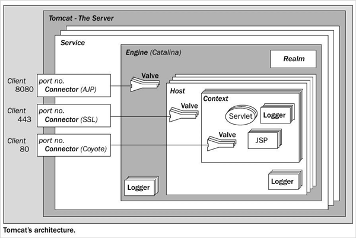
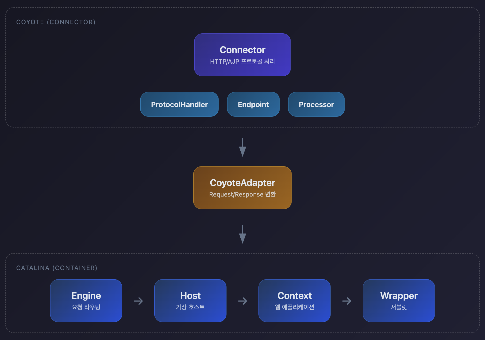
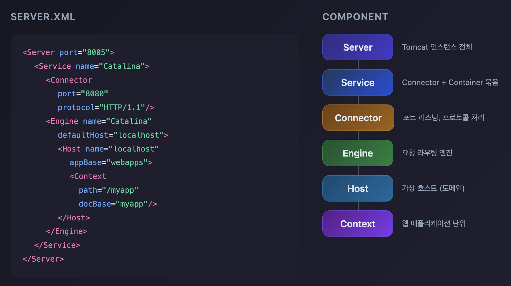
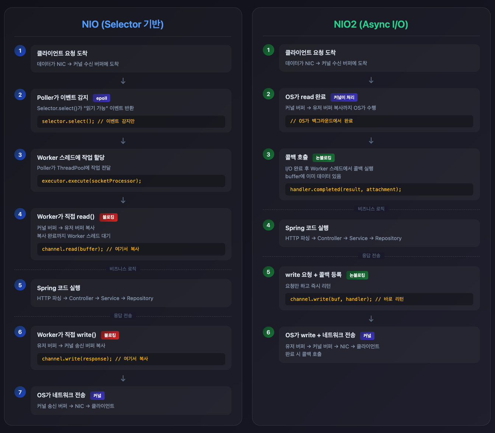
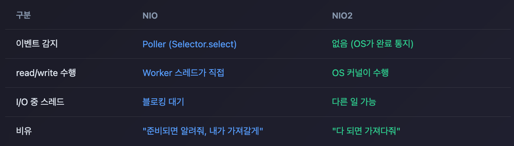
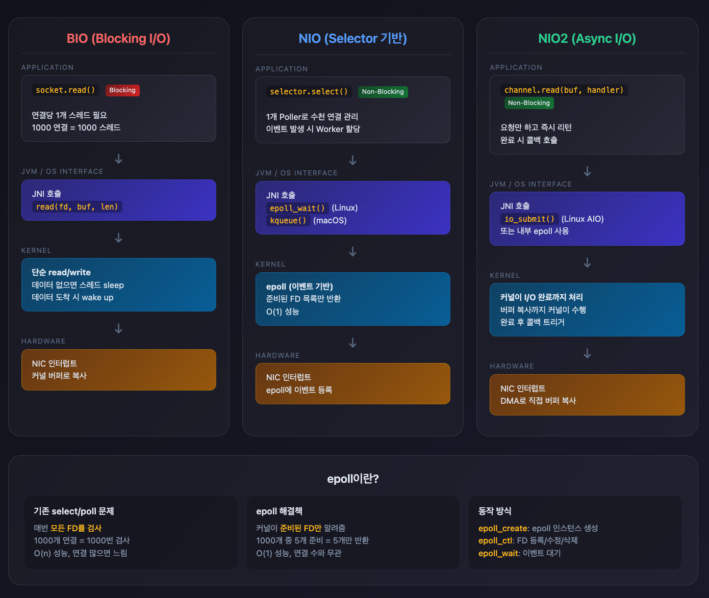
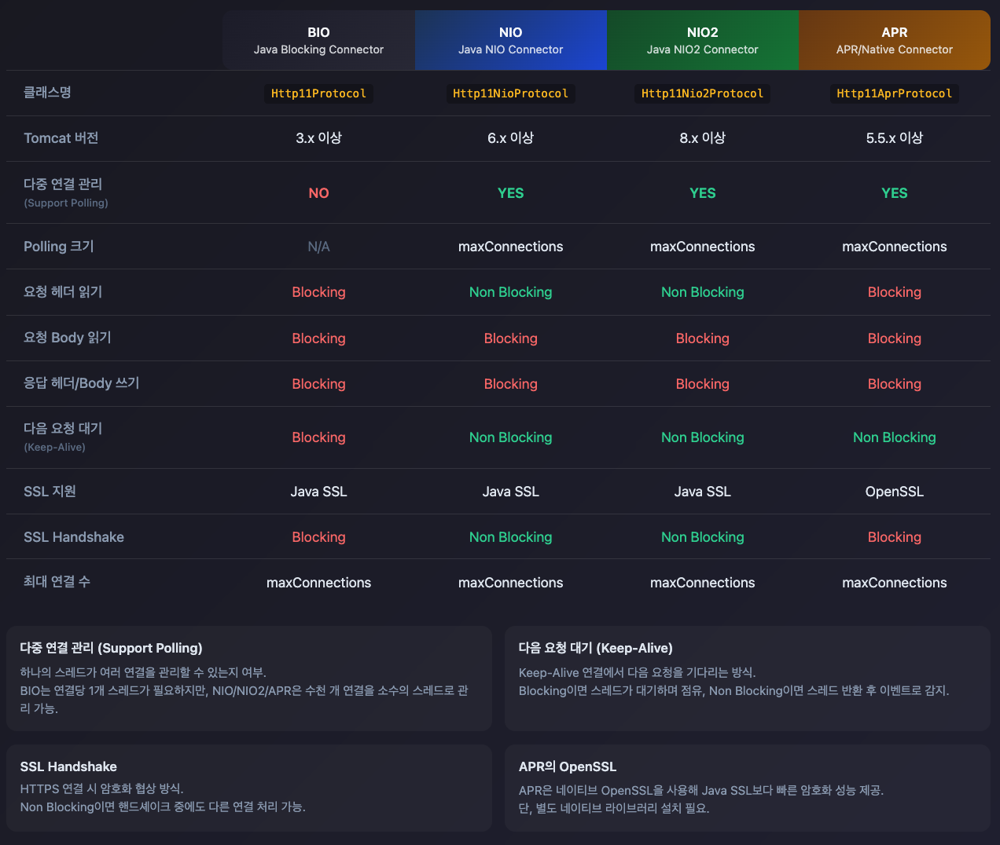

## Tomcat 아키텍처 개요

Tomcat은 단순한 웹 서버가 아닙니다. 여러 계층의 컴포넌트가 유기적으로 연결된 **Servlet Container**입니다.



### 핵심 컴포넌트

| 컴포넌트 | 역할 | 설명 |
|---------|------|------|
| **Server** | 최상위 컨테이너 | Tomcat 인스턴스 전체, 포트 8005로 shutdown 명령 수신 |
| **Service** | Connector와 Engine 묶음 | 하나의 Engine에 여러 Connector 연결 가능 |
| **Connector** | 요청 수신 | HTTP, AJP 프로토콜 처리, Socket 연결 관리 |
| **Engine** | 요청 라우팅 | 가상 호스트로 요청 전달 |
| **Host** | 가상 호스트 | 도메인별 애플리케이션 격리 |
| **Context** | 웹 애플리케이션 | WAR 파일 하나당 하나의 Context |
| **Wrapper** | Servlet | Servlet 인스턴스를 감싸는 컨테이너 |

## Connector와 Container

Tomcat 내부는 크게 두 부분으로 나뉩니다.



### Coyote (Connector)

네트워크 레벨을 담당합니다.

- **ProtocolHandler**: HTTP/1.1, HTTP/2, AJP 등 프로토콜별 처리
- **Endpoint**: 소켓 연결 관리, I/O 처리
- **Processor**: HTTP 요청 파싱, 응답 생성

### Catalina (Container)

비즈니스 로직 실행을 담당합니다.

- **Engine**: Host 헤더 기반 라우팅
- **Host**: 도메인별 애플리케이션 관리
- **Context**: 웹 애플리케이션 단위
- **Wrapper**: Servlet 인스턴스 관리

## server.xml 구조



## Connector 종류

### NIO (Non-blocking I/O)

```xml
<Connector port="8080"
           protocol="org.apache.coyote.http11.Http11NioProtocol"
           maxThreads="200"
           maxConnections="10000" />
```

**특징**:
- Java NIO 사용
- Selector 기반 I/O 멀티플렉싱
- 메모리 효율적 (연결당 Thread 불필요)
- **Spring Boot 기본값**

### NIO2 (Async I/O)

```xml
<Connector port="8080"
           protocol="org.apache.coyote.http11.Http11Nio2Protocol"
           maxThreads="200" />
```

**특징**:
- Java 7+ AsynchronousSocketChannel 사용
- 완전한 비동기 I/O
- NIO보다 약간 높은 성능 (벤치마크 환경 의존적)



### 핵심 차이점


### OS 커널 레벨에서의 차이

BIO, NIO, NIO2는 OS 커널과 상호작용하는 방식이 다릅니다.



**BIO (Blocking I/O)**:
- `read()` 시스템콜 호출 시 데이터가 올 때까지 스레드가 sleep
- 연결당 1개 스레드 필요 (1000 연결 = 1000 스레드)
- 스레드 생성/관리 오버헤드 큼

**NIO (Selector 기반)**:
- Linux의 `epoll`, macOS의 `kqueue` 활용
- 1개 Poller 스레드가 수천 개 연결의 이벤트를 감지
- 이벤트 발생 시에만 Worker 스레드 할당

**NIO2 (Async I/O)**:
- 커널이 I/O 완료까지 전부 처리
- 버퍼 복사까지 커널이 수행 후 콜백 호출
- 애플리케이션은 요청만 하고 즉시 다른 일 가능

**epoll이란?**

Linux에서 대량의 연결을 효율적으로 처리하기 위한 I/O 이벤트 알림 메커니즘입니다.

```c
// 기존 select: 모든 FD 검사 - O(n)
for (int i = 0; i < 10000; i++) {
    if (FD_ISSET(i, &readfds)) { ... }
}

// epoll: 준비된 FD만 반환 - O(1)
int n = epoll_wait(epfd, events, MAX_EVENTS, timeout);
for (int i = 0; i < n; i++) {
    // events[i]는 이미 준비된 FD만 포함
}
```

| 방식 | 시간복잡도 | 10000 연결 중 10개 이벤트 |
|------|-----------|-------------------------|
| select/poll | O(n) | 10000번 검사 |
| epoll | O(1) | 10개만 반환 |

### APR (Apache Portable Runtime)

```xml
<Connector port="8080"
           protocol="org.apache.coyote.http11.Http11AprProtocol"
           maxThreads="200" />
```

**특징**:
- Native C 라이브러리 사용
- OpenSSL 직접 연동 (SSL/TLS 성능 우수)
- 리눅스 epoll, BSD kqueue 활용
- 설치 복잡함 (별도 라이브러리 필요)

**Native C 라이브러리란?**

NIO/NIO2는 Java 코드가 JVM을 통해 OS 시스템콜을 호출합니다. APR은 Tomcat이 직접 만든 C 라이브러리(libtcnative)를 통해 OS를 호출합니다.

```
NIO:  Java 코드 → JVM (JNI) → OS 시스템콜
APR:  Java 코드 → libtcnative.so (C) → OS 시스템콜
```

JVM을 거치지 않고 C 코드가 직접 OS와 통신하므로 오버헤드가 줄어듭니다.

**왜 OpenSSL이 빠른가?**

Java SSL(JSSE)과 OpenSSL의 차이:

| 구분 | Java SSL | OpenSSL |
|------|----------|---------|
| 구현 언어 | Java (JVM 위에서 실행) | C (네이티브 코드) |
| 최적화 | 범용적 | CPU 명령어 최적화 (AES-NI 등) |
| 성능 | 기준 | 2-3배 빠름 |

OpenSSL은 CPU의 하드웨어 암호화 명령어(AES-NI)를 직접 활용합니다. Java SSL은 JVM 바이트코드로 실행되어 이런 최적화가 제한적입니다.

**현재는 APR을 권장하지 않습니다**

Tomcat 8.5+부터 NIO/NIO2도 OpenSSL을 사용할 수 있게 되어 APR의 가장 큰 장점이 사라졌습니다.

| 버전 | SSL 옵션 |
|------|----------|
| Tomcat 8.0 이전 | APR만 OpenSSL 사용 가능 |
| Tomcat 8.5+ | NIO/NIO2도 OpenSSL 사용 가능 |
| Tomcat 10+ / Java 17+ | JSSE 성능 대폭 개선 |

**JSSE**(Java Secure Socket Extension)는 Java 표준 SSL/TLS 라이브러리입니다. 

과거에는 OpenSSL보다 2-3배 느렸지만, Java 8u161+에서 AES-NI 지원이 개선되고 Java 17+에서 암호화 성능이 대폭 향상되어 현재는 대부분의 경우 JSSE만으로 충분합니다.



### I/O 레이어 구분

요청 처리는 **Connector 레이어**와 **Servlet API 레이어**로 나뉩니다.

| 단계 | 레이어 | NIO/NIO2 | APR |
|------|--------|----------|-----|
| 헤더 읽기 | Connector | 논블로킹 | 블로킹 |
| 바디 읽기 | Servlet API | 블로킹 | 블로킹 |
| 응답 쓰기 | Servlet API | 블로킹 | 블로킹 |

**헤더 읽기가 Connector 레이어인 이유**: Tomcat은 HTTP 헤더를 파싱해야 어떤 Servlet으로 라우팅할지 결정할 수 있습니다. 즉, Servlet 호출 전에 헤더 파싱이 완료되어야 합니다.

```
1. Connector가 헤더 읽기 (NIO: 논블로킹 / APR: 블로킹)
2. Host, URL 경로 파싱 → Servlet 라우팅 결정
3. Servlet 호출
4. Servlet이 바디 읽기/응답 쓰기 (블로킹)
```

**Servlet API 블로킹 동작**:

```
클라이언트 → [NIC] → [Kernel Buffer] → [ByteBuffer] → [Servlet]
                            ↑                 ↑
                       NIO/NIO2 영역      Servlet API 영역
```

- `request.getInputStream().read()`: ByteBuffer에 데이터가 준비될 때까지 대기
- `response.getOutputStream().write()`: Kernel Buffer에 공간이 생길 때까지 대기 (클라이언트가 느리면 블로킹)

## Connector 주요 파라미터

```xml
<Connector port="8080"
           protocol="HTTP/1.1"

           <!-- Thread Pool -->
           maxThreads="200"           <!-- 최대 Worker Thread 수 -->
           minSpareThreads="10"       <!-- 최소 유휴 Thread 수 -->

           <!-- Connection Pool -->
           maxConnections="10000"     <!-- 최대 동시 연결 수 -->
           acceptCount="100"          <!-- 대기열 크기 (OS backlog) -->

           <!-- Timeout -->
           connectionTimeout="20000"  <!-- Socket read timeout (ms) -->
           keepAliveTimeout="60000"   <!-- Keep-Alive timeout -->

           <!-- Keep-Alive -->
           maxKeepAliveRequests="100" <!-- 하나의 연결에서 최대 요청 수 -->

           <!-- I/O -->
           compression="on"           <!-- 응답 압축 -->
           compressionMinSize="2048"  <!-- 압축 최소 크기 -->
           />
```

### maxConnections vs maxThreads

| 설정 | 설명 |
|------|------|
| **maxConnections** | 동시에 유지할 수 있는 TCP 연결 수 (NIO 기본값: 10000) |
| **maxThreads** | 요청을 처리할 Worker Thread 수 (기본값: 200) |

예: `maxConnections=10000`, `maxThreads=200`이면 10000개 연결 중 200개만 동시 처리, 나머지는 대기합니다.

### acceptCount 동작 원리

- maxConnections 초과 시 OS 레벨 backlog에 대기
- acceptCount=100이면 큐에 100개까지 대기
- 큐도 가득차면 클라이언트는 **Connection Refused** 에러 수신

## Container 계층 구조

### Engine

가상 호스트로 요청을 라우팅합니다.

```xml
<Engine name="Catalina" defaultHost="localhost">
  <Host name="localhost" appBase="webapps" />
  <Host name="www.example.com" appBase="webapps-example" />
</Engine>
```

**요청 처리 흐름**:

1. HTTP Host 헤더 확인: `Host: www.example.com`
2. 매칭되는 Host 컴포넌트 선택
3. 매칭 실패 시 defaultHost 사용

### Host

도메인별 웹 애플리케이션을 격리합니다.

**요즘은 Engine/Host 설정을 직접 건드릴 일이 거의 없습니다.** Nginx/LB가 앞단에서 도메인별로 다른 서버로 라우팅하고, 컨테이너 환경에서는 서버(또는 Pod) 하나당 Tomcat 하나를 띄우기 때문입니다.

```xml
<Host name="localhost"
      appBase="webapps"
      unpackWARs="true"      <!-- WAR 압축 해제 -->
      autoDeploy="true"      <!-- 자동 배포 -->
      deployOnStartup="true" <!-- 시작 시 배포 -->
      >

  <!-- Valve: Host 레벨 필터 -->
  <Valve className="org.apache.catalina.valves.AccessLogValve"
         directory="logs"
         prefix="localhost_access_log"
         suffix=".txt"
         pattern="%h %l %u %t &quot;%r&quot; %s %b" />
</Host>
```

### Context

웹 애플리케이션 단위입니다.

```xml
<!-- conf/Catalina/localhost/myapp.xml -->
<Context path="/myapp"
         docBase="/var/webapps/myapp"
         reloadable="true"
         >

  <!-- Context별 DataSource -->
  <Resource name="jdbc/mydb"
            auth="Container"
            type="javax.sql.DataSource"
            maxTotal="20"
            maxIdle="10"
            driverClassName="com.mysql.cj.jdbc.Driver"
            url="jdbc:mysql://localhost:3306/mydb" />
</Context>
```

**Spring Boot에서는** embedded Tomcat을 사용하고 Context Path가 기본적으로 `/`(루트)입니다. 그래서 Controller에서 `/api/users`만 매핑하면 바로 `http://localhost:8080/api/users`가 됩니다.

```yaml
# 변경하고 싶다면
server:
  servlet:
    context-path: /myapp  # http://localhost:8080/myapp/api/users
```

### Wrapper

Servlet 인스턴스를 관리합니다. URL 패턴과 Servlet 클래스를 매핑합니다.

#### 전통적인 Servlet 방식 (과거)

```
Context: /myapp
├── Wrapper: /hello  → HelloServlet
├── Wrapper: /user   → UserServlet
├── Wrapper: /order  → OrderServlet
└── Wrapper: *.jsp   → JspServlet
```

`web.xml`에서 URL마다 Servlet을 직접 매핑했습니다.

```xml
<!-- web.xml -->
<servlet>
    <servlet-name>helloServlet</servlet-name>
    <servlet-class>com.example.HelloServlet</servlet-class>
</servlet>
<servlet-mapping>
    <servlet-name>helloServlet</servlet-name>
    <url-pattern>/hello</url-pattern>
</servlet-mapping>

<servlet>
    <servlet-name>userServlet</servlet-name>
    <servlet-class>com.example.UserServlet</servlet-class>
</servlet>
<servlet-mapping>
    <servlet-name>userServlet</servlet-name>
    <url-pattern>/user</url-pattern>
</servlet-mapping>
```

#### Spring MVC 방식 (현재)

```
Context: /
└── Wrapper: /  → DispatcherServlet (단 하나)
                    ├── /hello  → HelloController
                    ├── /user   → UserController
                    └── /order  → OrderController
```

**Servlet은 DispatcherServlet 하나만 존재**합니다. URL → Controller 매핑은 Tomcat이 아닌 Spring이 처리합니다.

```java
// Spring이 내부적으로 URL 매핑 관리
@RestController
public class HelloController {
    @GetMapping("/hello")  // Spring의 HandlerMapping이 처리
    public String hello() { return "Hello"; }
}

@RestController
public class UserController {
    @GetMapping("/user/{id}")  // Spring의 HandlerMapping이 처리
    public User getUser(@PathVariable("id") Long id) { ... }
}
```

#### 비교

| 구분 | 전통 Servlet | Spring MVC |
|------|-------------|------------|
| Servlet 수 | URL당 1개 | **전체 1개** (DispatcherServlet) |
| URL 매핑 | Tomcat(Wrapper)이 처리 | **Spring**(HandlerMapping)이 처리 |
| 설정 방식 | web.xml | @Controller + @RequestMapping |
| 요청 흐름 | Tomcat → Servlet | Tomcat → DispatcherServlet → Controller |

**왜 바뀌었는가?**

전통 방식은 Servlet마다 공통 로직(인증, 로깅, 예외처리)을 중복 구현해야 했습니다. Spring MVC는 DispatcherServlet이 모든 요청을 받아서 공통 처리 후 적절한 Controller로 위임합니다.

**Servlet 생명주기**:

```java
public class MyServlet extends HttpServlet {

    @Override
    public void init(ServletConfig config) throws ServletException {
        // 1. 초기화 (서버 시작 시 또는 첫 요청 시)
    }

    @Override
    protected void doGet(HttpServletRequest req, HttpServletResponse resp) {
        // 2. 서비스 (요청마다 호출)
    }

    @Override
    public void destroy() {
        // 3. 소멸 (서버 종료 시)
    }
}
```

**주의**: Servlet은 기본적으로 **싱글톤**입니다. 멀티 스레드 환경에서 동일 인스턴스를 공유하므로 Thread-Safe하게 작성해야 합니다.

```java
// 잘못된 예: 인스턴스 변수 사용
public class BadServlet extends HttpServlet {
    private int count = 0;  // 여러 스레드가 공유 - Race Condition

    protected void doGet(HttpServletRequest req, HttpServletResponse resp) {
        count++;  // 동시성 이슈
    }
}

// 올바른 예: 로컬 변수 사용
public class GoodServlet extends HttpServlet {
    protected void doGet(HttpServletRequest req, HttpServletResponse resp) {
        int count = 0;  // 각 스레드마다 독립적
        count++;
    }
}
```

## ClassLoader 계층 구조

```
Bootstrap ClassLoader (JRE)
    ↓
System ClassLoader (CLASSPATH)
    ↓
Common ClassLoader (tomcat/lib/*.jar)
    ↓
WebApp ClassLoader (/WEB-INF/lib/*.jar, /WEB-INF/classes)
```

#### 과거: 하나의 Tomcat에 여러 앱

```
webapps/app1
├── WEB-INF/lib/jackson-2.13.jar   ← App1은 2.13 사용

webapps/app2
├── WEB-INF/lib/jackson-2.15.jar   ← App2는 2.15 사용

→ 같은 Tomcat에서 버전 충돌 없이 동작
```

ClassLoader 격리 덕분에 하나의 Tomcat에서 여러 앱이 서로 다른 라이브러리 버전을 사용할 수 있었습니다.

#### 현재: 컨테이너당 앱 하나

```
Pod1 (Tomcat + App1)
├── jackson-2.13.jar

Pod2 (Tomcat + App2)
├── jackson-2.15.jar

→ 애초에 프로세스가 분리되어 ClassLoader 격리 불필요
```

컨테이너/Pod 환경에서는 앱마다 별도 Tomcat을 띄우므로 ClassLoader 격리 기능이 의미가 없어졌습니다. Spring Boot의 embedded Tomcat도 앱 하나만 실행하므로 마찬가지입니다.

## 요약

**핵심 포인트**

1. Tomcat은 **Coyote**(Connector)와 **Catalina**(Container) 두 부분으로 구성됩니다.
2. **NIO Connector**가 Spring Boot 기본값이며 대부분의 경우 충분합니다.
3. **maxConnections**는 연결 수, **maxThreads**는 동시 처리 수를 의미합니다.
4. Container 계층은 **Engine → Host → Context → Wrapper** 순서로 요청을 처리합니다.
5. Servlet은 싱글톤이므로 **Thread-Safe**하게 작성해야 합니다.

다음 포스트에서는 Tomcat의 요청 처리 흐름과 Thread 모델을 상세히 알아보겠습니다.
