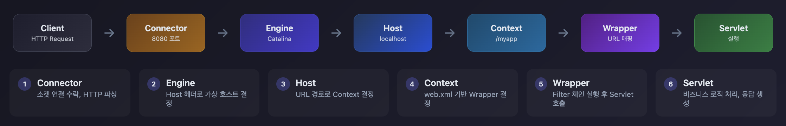
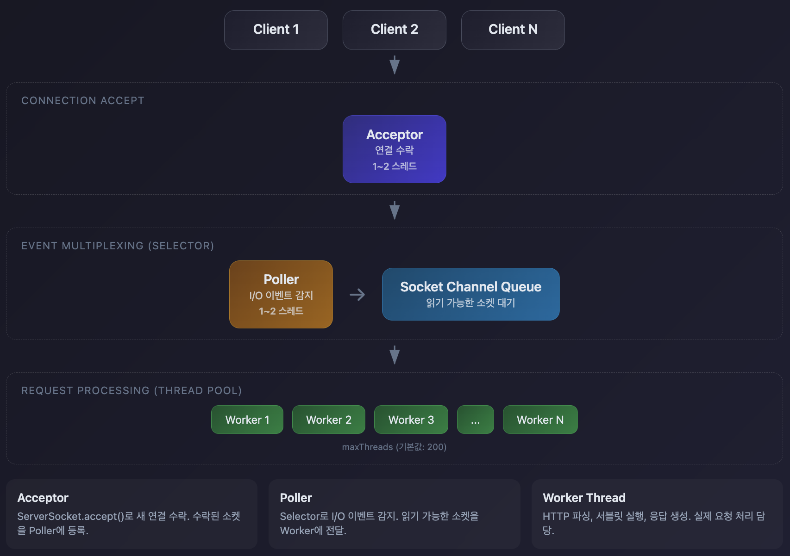
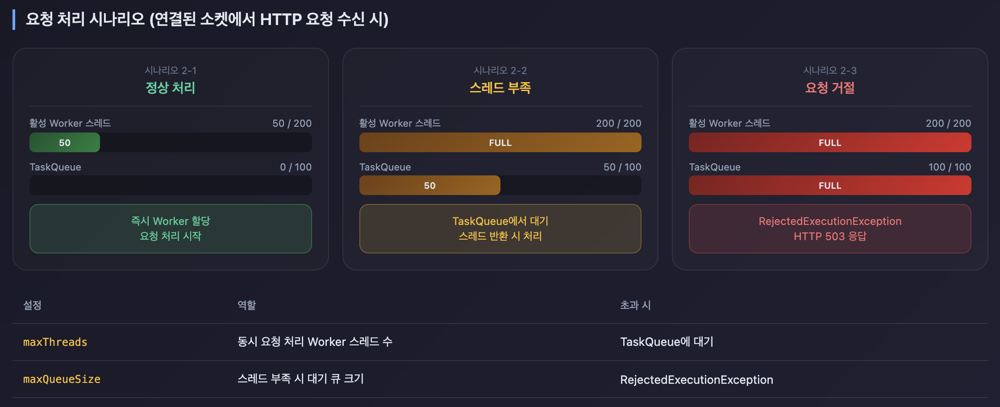
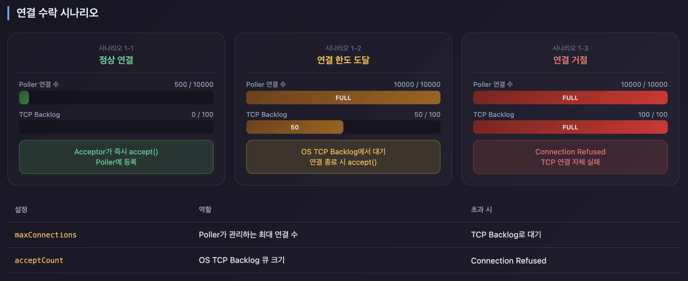

## 요청 처리 전체 흐름

클라이언트 요청이 Tomcat을 거쳐 Servlet까지 도달하는 과정을 알아봅니다.


### 처리 단계별 설명

| 단계 | 컴포넌트 | 역할 |
|------|----------|------|
| 1 | **Connector** | 소켓 연결 수락, HTTP 파싱 |
| 2 | **Engine** | Host 헤더로 가상 호스트 결정 |
| 3 | **Host** | URL 경로로 Context 결정 |
| 4 | **Context** | web.xml 기반 Wrapper 결정 |
| 5 | **Wrapper** | Filter 체인 실행 후 Servlet 호출 |
| 6 | **Servlet** | 비즈니스 로직 처리, 응답 생성 |

## Connector 내부 구조 (Coyote)

Connector는 단순히 요청을 받는 게 아닙니다. 내부적으로 세 가지 컴포넌트가 계층적으로 동작합니다.


### ProtocolHandler

프로토콜별로 요청을 처리하는 최상위 컴포넌트입니다. `server.xml`에서 `protocol` 속성으로 지정합니다.

```xml
<Connector port="8080" protocol="org.apache.coyote.http11.Http11NioProtocol" />
```

### Endpoint

Acceptor, Poller, Worker 스레드를 관리하는 주체입니다. 

소켓 레벨 I/O를 담당하며, **NIO/NIO2/APR** 중 어떤 방식으로 I/O를 처리할지 결정합니다.

### Processor

HTTP 바이트 스트림을 파싱해서 Request/Response 객체를 생성합니다. 요청 처리 후 Keep-Alive 여부에 따라 소켓을 재사용할지 결정합니다.

## NIO Thread 모델

Tomcat NIO는 세 종류의 스레드가 협력하여 요청을 처리합니다.



### Acceptor Thread

새로운 TCP 연결을 수락합니다.

```java
// 의사 코드
class Acceptor implements Runnable {
    private ServerSocketChannel serverSocket;

    public void run() {
        while (running) {
            // 1. 새 연결 대기 (블로킹)
            SocketChannel socket = serverSocket.accept();

            // 2. Non-blocking 모드로 전환 (Selector에 등록하려면 논블로킹 모드여야 함)
            socket.configureBlocking(false);

            // 3. Poller에 등록 요청
            poller.register(socket);
        }
    }
}
```

**특징**:
- 보통 1개로 충분 (accept()는 매우 빠름)
- 병목 가능성 거의 없음

### TCP 연결 관리 역할 분담

| 단계 | 담당 | 하는 일 |
|------|------|--------|
| 3-way handshake | OS 커널 | SYN → SYN-ACK → ACK |
| 연결 수락 | Acceptor | accept()로 커널의 완료 큐에서 소켓 꺼냄 |
| 연결 유지/관리 | Poller | Selector로 이벤트 감시, 타임아웃 체크 |
| 연결 종료 | Worker | close() 호출 또는 Keep-Alive 만료 시 |

### Poller Thread

I/O 이벤트를 감지하고 Worker에 작업을 할당합니다.

```java
// 의사 코드
class Poller implements Runnable {
    private Selector selector;
    private Queue<SocketChannel> registerQueue;

    public void run() {
        while (running) {
            // 1. 대기 중인 소켓 등록
            registerPending();

            // 2. I/O 이벤트 대기 (타임아웃: 1초)
            // 내부적으로 epoll_wait 호출, 이벤트 없으면 커널 레벨 슬립
            // 타임아웃을 주는 이유: 주기적으로 깨어나서 registerPending() 처리
            // 급한 경우 Acceptor가 selector.wakeup()으로 즉시 깨움
            selector.select(1000);

            // 3. 준비된 이벤트 처리
            Iterator<SelectionKey> keys = selector.selectedKeys().iterator();
            while (keys.hasNext()) {
                SelectionKey key = keys.next();
                keys.remove();

                if (key.isReadable()) {
                    // READ 이벤트: Worker Thread에 작업 위임
                    SocketChannel socket = (SocketChannel) key.channel();
                    key.cancel();  // Selector에서 등록 해제 (Worker 처리 중 중복 감지 방지)
                    executor.execute(new SocketProcessor(socket));
                }
            }
        }
    }
}
```

**특징**:
- CPU 코어 수에 따라 1-2개
- 보통 1개로 수만 개 연결 처리 가능
- 연결 수가 10만 이상이면 Poller 개수 증가 고려

### Worker Thread

실제 요청을 처리합니다.

```java
// 의사 코드
class SocketProcessor implements Runnable {
    private SocketChannel socket;

    public void run() {
        try {
            // 1. HTTP 파싱
            HttpRequest request = parseHttpRequest(socket);
            HttpResponse response = new HttpResponse(socket);

            // 2. Container Pipeline 실행
            // Engine → Host → Context → Wrapper
            getContainer().invoke(request, response);

            // 3. 응답 전송
            response.finishResponse();

            // 4. Keep-Alive 처리
            if (request.isKeepAlive()) {
                poller.register(socket);  // 다음 요청 대기
            } else {
                socket.close();
            }

        } catch (Exception e) {
            handleError(e);
        }
    }
}
```

### NIO에서 헤더 읽기 vs Body 읽기

| 구분 | 헤더 읽기 | Body 읽기 |
|------|-----------|-----------|
| 방식 | Non-Blocking | Blocking |
| 데이터 부족 시 | 상태 저장 후 스레드 반환 | 데이터 올 때까지 대기 |

**헤더 읽기가 Non-Blocking인 이유**

헤더가 여러 패킷에 나눠서 올 수 있습니다. 데이터가 아직 다 안 왔을 때 스레드가 블로킹하며 기다리면 낭비입니다.

```
1. Poller: "소켓에 데이터 왔어" → Worker 할당
2. Worker: read() → "GET /api HTT" (헤더 일부만 도착)
3. Worker: 파싱 상태 저장 → 스레드 반환 → Poller에 다시 등록
4. Poller: "데이터 더 왔어" → Worker 할당
5. Worker: 저장된 상태부터 파싱 재개 → 헤더 완료 → Servlet 호출
```

Tomcat은 `Http11InputBuffer`에 파싱 상태를 저장해서 나중에 이어서 파싱할 수 있습니다.

```java
// Http11InputBuffer - 파싱 상태 저장
private int parsingRequestLinePhase;  // 현재 파싱 단계

// Http11Processor - 헤더 불완전 시 즉시 반환
if (!inputBuffer.parseHeaders()) {
    readComplete = false;
    break;  // 블로킹하지 않고 반환
}
```

**Body 읽기가 Blocking인 이유**

Servlet API 스펙에서 `request.getInputStream().read()`는 블로킹 방식으로 동작해야 합니다. 헤더 파싱이 완료되어 Servlet에 진입한 시점부터는 해당 요청을 끝까지 처리할 책임이 있습니다.

### 요청 처리 컴포넌트 흐름

```
Worker Thread
    ↓
Http11Processor.service()
    ├── inputBuffer.parseRequestLine()  → GET /api HTTP/1.1
    ├── inputBuffer.parseHeaders()      → Host, Content-Type 등
    ↓
CoyoteAdapter.service()
    ├── Coyote Request → HttpServletRequest 변환
    ├── Coyote Response → HttpServletResponse 변환
    ↓
Container Pipeline (Engine → Host → Context → Wrapper)
    ↓
Servlet.service()
    └── 필요시 request.getInputStream().read()로 Body 읽기
```

**핵심 포인트**

| 컴포넌트 | 역할 |
|----------|------|
| Http11Processor | 바이트 스트림 → HTTP 파싱 (Request Line, Headers) |
| CoyoteAdapter | Coyote 내부 객체 → Servlet API 객체로 변환 |
| Servlet | 비즈니스 로직, 필요시 Body 읽기 |

**Body는 왜 미리 안 읽는가**

Request 객체가 생성될 때 Body는 아직 읽지 않습니다. InputStream만 소켓과 연결해둡니다.

```java
// Request 객체 내부 (단순화)
class HttpServletRequest {
    private Map<String, String> headers;  // 헤더는 이미 파싱됨
    private InputStream inputStream;       // Body는 소켓과 연결만 됨
}
```

- GET 요청은 Body가 없으므로 읽을 필요 없음
- Body가 수 GB일 수 있음 (파일 업로드)
- 스트리밍 처리가 필요할 수 있음

Servlet이 `getInputStream().read()`를 호출할 때 비로소 소켓에서 Body를 읽습니다. 이때 커널 버퍼에 데이터가 없으면 블로킹됩니다.

## Thread Pool 구조

### Thread Pool 설정

Tomcat의 기본값은 `maxThreads=200`, `minSpareThreads=10`입니다.

```xml
<Executor name="tomcatThreadPool"
          namePrefix="catalina-exec-"
          maxThreads="200"          <!-- 최대 스레드 수 -->
          minSpareThreads="10"      <!-- 최소 유휴 스레드 -->
          maxIdleTime="60000"       <!-- 유휴 스레드 제거 시간 (ms) -->
          prestartminSpareThreads="true"  <!-- 시작 시 minSpareThreads 생성 -->
          maxQueueSize="100"        <!-- 작업 큐 크기 -->
          />

<Connector port="8080"
           protocol="HTTP/1.1"
           executor="tomcatThreadPool" />
```

### Thread 생성 순서 (Tomcat TaskQueue)



1. **요청 도착**
2. **현재 스레드 수 < corePoolSize**: 새 스레드 생성
3. **corePoolSize <= 현재 스레드 수 < maxPoolSize**: 새 스레드 생성 (큐보다 스레드 우선)
4. **maxPoolSize 도달**: 큐에 추가
5. **큐도 가득참**: RejectedExecutionException

```
예: corePoolSize=10, maxPoolSize=200, queueSize=100

요청 1-10:    즉시 새 스레드 생성 (10개)
요청 11-200:  새 스레드 생성 (190개 추가, 총 200개)
요청 201-300: 큐에 대기 (100개)
요청 301+:    거부 (RejectedExecutionException)
```

Tomcat은 일반 ThreadPoolExecutor와 달리 **큐보다 스레드 생성을 우선**합니다. 큐에서 대기하는 시간을 줄여 응답 지연을 최소화하기 위한 설계입니다.

**Tomcat TaskQueue 소스코드** ([GitHub 링크](https://github.com/apache/tomcat/blob/main/java/org/apache/tomcat/util/threads/TaskQueue.java#L67)):

```java
@Override
public boolean offer(Runnable o) {
    // 스레드가 maxPoolSize보다 적으면 false 반환 → 새 스레드 생성 유도
    if (parent.getPoolSizeNoLock() < parent.getMaximumPoolSize()) {
        return false;
    }
    return super.offer(o);
}
```

`offer()`가 `false`를 반환하면 ThreadPoolExecutor는 새 스레드를 생성합니다. Tomcat은 이 특성을 활용해서 큐보다 스레드 생성을 우선합니다.

## Filter Chain 실행

```
Request
  ↓
ApplicationFilterChain
  ├── Filter 1: CharacterEncodingFilter
  ├── Filter 2: LoggingFilter
  ├── Filter 3: AuthenticationFilter
  └── Servlet: DispatcherServlet (Spring MVC)
       ↓
    Spring Interceptor Chain
       ├── Interceptor 1
       ├── Interceptor 2
       └── Controller
  ↓
Response
```

### Filter vs Interceptor

| 구분 | Filter | Interceptor |
|------|--------|-------------|
| **레벨** | Servlet 레벨 | Spring MVC 레벨 |
| **실행 시점** | DispatcherServlet 이전 | DispatcherServlet 이후 |
| **용도** | 인코딩, 인증, 로깅 | 권한 체크, 공통 로직 |
| **예외 처리** | web.xml error-page | @ExceptionHandler |

## Connection 관리

### Keep-Alive 동작 원리


**HTTP/1.0**(Keep-Alive 없음):
```
Client → Server: GET /page1
Client ← Server: 200 OK (연결 종료)

Client → Server: GET /page2 (새 연결)
Client ← Server: 200 OK (연결 종료)

→ 요청마다 TCP 3-way handshake 반복 (비효율)
```

**HTTP/1.1**(Keep-Alive 기본):
```
Client → Server: GET /page1
Client ← Server: 200 OK (Connection: keep-alive)

Client → Server: GET /page2 (같은 연결)
Client ← Server: 200 OK (Connection: keep-alive)

→ 하나의 TCP 연결로 여러 요청 처리
```

**Keep-Alive 설정**:
```xml
<Connector port="8080"
           protocol="HTTP/1.1"
           maxKeepAliveRequests="100"   <!-- 하나의 연결에서 최대 요청 수 -->
           keepAliveTimeout="60000"     <!-- Keep-Alive 타임아웃 (ms) -->
           />
```


### Connection Timeout

```xml
<Connector port="8080"
           protocol="HTTP/1.1"
           connectionTimeout="20000"  <!-- 20초 -->
           />
```

**동작**:
1. 클라이언트 연결 수립
2. HTTP 요청 헤더 대기 (connectionTimeout 시작)
3. 20초 내에 요청 헤더 도착 안 하면 연결 종료

**주의**: `connectionTimeout`은 **요청 헤더 읽기 타임아웃**입니다. Servlet 실행 시간과는 무관합니다.

### maxConnections vs acceptCount



```xml
<Connector maxConnections="10000"
           acceptCount="100"
           maxThreads="200" />
```

**요청 처리 과정**:

| 동시 연결 수 | 상태 |
|-------------|------|
| 1 ~ 10000 | 정상 처리 (Poller가 관리) |
| 10001 ~ 10100 | OS 큐 대기 (TCP backlog) |
| 10101+ | Connection Refused |
