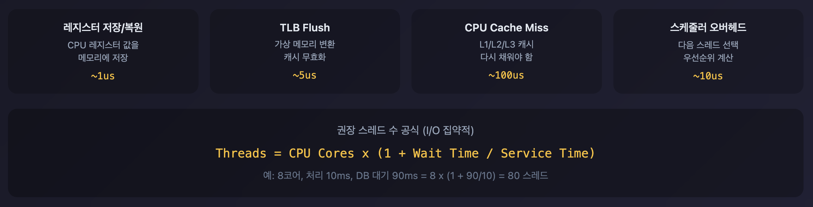

## Thread Pool 튜닝

### Context Switching 이해하기

스레드 수를 무작정 늘리면 성능이 좋아질까요? 아닙니다.

**Context Switching** 오버헤드 때문입니다.



위 수치는 일반적인 참고값입니다. 실제 비용은 환경마다 다르므로 상대적인 크기 비교로만 활용하세요.

**Context Switching이란?**

CPU가 실행 중인 스레드를 다른 스레드로 전환할 때 발생하는 작업입니다.

```
Thread A 실행 중
    ↓
[Context Switch 발생]
    1. Thread A의 레지스터 값을 메모리에 저장
    2. Thread A의 스택 포인터 저장
    3. Thread B의 레지스터 값 복원
    4. Thread B의 스택 포인터 복원
    ↓
Thread B 실행 시작
```

### 기본 원칙

**CPU 집약적 작업**:
```
최적 스레드 수 = CPU 코어 수 + 1
```

**I/O 집약적 작업** (웹 애플리케이션 대부분):
```
최적 스레드 수 = CPU 코어 수 × (1 + 대기시간 / 처리시간)

예: 8코어, 처리시간 10ms, DB 대기 90ms
   = 8 × (1 + 90/10) = 8 × 10 = 80
```

**실전 공식**:
```
maxThreads = 목표 TPS × 평균 응답 시간(초)

예: 목표 1000 TPS, 평균 응답 시간 200ms
   = 1000 × 0.2 = 200
```

### 규모별 설정 예시

**소규모 서비스** (트래픽 < 100 TPS):
```xml
<Connector port="8080"
           protocol="HTTP/1.1"
           maxThreads="50"
           minSpareThreads="10"
           maxConnections="2000"
           acceptCount="100" />
```

**중규모 서비스** (트래픽 100-1000 TPS):
```xml
<Connector port="8080"
           protocol="HTTP/1.1"
           maxThreads="200"
           minSpareThreads="25"
           maxConnections="10000"
           acceptCount="500" />
```

**대규모 서비스** (트래픽 1000+ TPS):
```xml
<Connector port="8080"
           protocol="HTTP/1.1"
           maxThreads="500"
           minSpareThreads="50"
           maxConnections="20000"
           acceptCount="1000"

           <!-- 추가 최적화 -->
           processorCache="500"
           socket.directBuffer="true"
           socket.appReadBufSize="8192"
           socket.appWriteBufSize="8192" />
```

## OS 레벨 튜닝

### 파일 디스크립터 제한

**왜 네트워크 연결이 파일 디스크립터(FD)인가?**

Unix 철학 **Everything is a file** 때문입니다. 소켓이든 파일이든 동일한 시스템 콜로 처리할 수 있도록 통일된 인터페이스를 제공합니다.

```c
// 파일 읽기
int fd = open("/tmp/file.txt", O_RDONLY);
read(fd, buffer, size);
close(fd);

// 소켓 읽기 - 동일한 read/close 사용
int fd = socket(AF_INET, SOCK_STREAM, 0);
connect(fd, ...);
read(fd, buffer, size);  // 같은 함수
close(fd);               // 같은 함수
```

커널 입장에서 소켓도 "열린 자원"이니까 FD 테이블에서 관리하는 게 자연스럽습니다.

**문제**:
```bash
# 기본값 확인
ulimit -n
# 1024 (너무 작음!)

# maxConnections=10000인데 ulimit=1024이면 1024개만 연결 가능
```

**해결**:
```bash
# 현재 세션만
ulimit -n 65535

# 영구 설정 (/etc/security/limits.conf)
tomcat soft nofile 65535
tomcat hard nofile 65535

# 시스템 전체 (/etc/sysctl.conf)
fs.file-max = 2097152
```

### TCP Backlog vs TCP 버퍼

두 개념은 완전히 다릅니다.

| 구분 | TCP Backlog | TCP 버퍼 |
|------|-------------|----------|
| **용도** | 연결 대기열 | 데이터 전송 버퍼 |
| **언제** | 3-way handshake 완료 후, accept() 전 | 데이터 송수신 중 |
| **내용물** | 연결 요청 (소켓 메타데이터) | 실제 패킷 데이터 |

```
[TCP Backlog]
Client → SYN → Server
Client ← SYN+ACK ← Server
Client → ACK → Server
                ↓
         Backlog 큐에 대기  ← somaxconn, tcp_max_syn_backlog
                ↓
         accept() 호출 시 꺼냄

[TCP 버퍼]
연결 수립 후 데이터 전송 시:
Client → "GET /api/users" → [수신 버퍼] → Server 애플리케이션
                                ↑
                        tcp_rmem (receive buffer)
```

- **somaxconn**: accept() 대기 중인 연결 개수 제한
- **tcp_rmem/wmem**: 한 연결당 송수신 데이터 버퍼 크기

### SYN Queue vs Accept Queue

`somaxconn`과 `tcp_max_syn_backlog` 둘 다 "대기열"인데, **3-way handshake 완료 전/후**가 다릅니다.

```
Client → SYN → Server
                ↓
         [SYN Queue]  ← tcp_max_syn_backlog (반쯤 연결된 상태)
                ↓
Client ← SYN+ACK ← Server
                ↓
Client → ACK → Server
                ↓
         [Accept Queue]  ← somaxconn (완전히 연결된 상태)
                ↓
         accept() 호출
```

| 설정 | 큐 이름 | 상태 | 내용물 |
|------|---------|------|--------|
| **tcp_max_syn_backlog** | SYN Queue | 반쯤 연결 (SYN 받음, ACK 대기) | handshake 진행 중 |
| **somaxconn** | Accept Queue | 완전 연결 (handshake 완료) | accept() 대기 중 |

SYN Flood 공격은 SYN만 보내고 ACK를 안 보내서 SYN Queue를 가득 채우는 공격입니다.

### TIME_WAIT와 tcp_tw_reuse

**TIME_WAIT 상태란?**

연결 종료 후 소켓이 바로 사라지지 않고 2분(기본값) 동안 남아있는 상태입니다.

```
Client: "연결 끊자" (FIN)
Server: "ㅇㅋ" (ACK)
Server: "나도 끊는다" (FIN)
Client: "ㅇㅋ" (ACK)
        ↓
   TIME_WAIT (2분간 대기)
        ↓
   소켓 완전 제거
```

**왜 2분이나 기다리나?**

네트워크에서 지연된 패킷이 뒤늦게 도착할 수 있어서입니다. 바로 소켓을 재사용하면 이전 연결의 패킷과 섞일 수 있습니다.

**문제 상황:**

고트래픽 서버에서 연결이 계속 생겼다 끊기면 TIME_WAIT 소켓이 수만 개 쌓입니다.

```bash
$ netstat -an | grep TIME_WAIT | wc -l
45000   ← TIME_WAIT 상태 소켓 45000개
```

각 소켓이 로컬 포트를 점유하니까 포트가 고갈될 수 있습니다.

**tcp_tw_reuse=1 효과:**

TIME_WAIT 상태인 소켓의 포트를 **새 연결에 재사용**할 수 있게 해줍니다. 2분 기다릴 필요 없이 바로 재활용합니다.

```
tcp_tw_reuse=0: TIME_WAIT 2분 대기 → 포트 고갈 위험
tcp_tw_reuse=1: TIME_WAIT 소켓 포트 즉시 재사용 → 포트 고갈 방지
```

### TCP 파라미터

```bash
# /etc/sysctl.conf

# TCP backlog 크기 (연결 대기열)
net.core.somaxconn = 4096
net.ipv4.tcp_max_syn_backlog = 8192

# TIME_WAIT 소켓 재사용 (Keep-Alive 효율 향상)
net.ipv4.tcp_tw_reuse = 1

# TIME_WAIT 타임아웃 (기본 60초 → 30초)
net.ipv4.tcp_fin_timeout = 30

# TCP 버퍼 크기 (데이터 송수신)
net.core.rmem_max = 16777216
net.core.wmem_max = 16777216
net.ipv4.tcp_rmem = 4096 87380 16777216
net.ipv4.tcp_wmem = 4096 65536 16777216

# 적용
sudo sysctl -p
```

### Port Range

```bash
# 로컬 포트 범위 확대
net.ipv4.ip_local_port_range = 10000 65535

# 이유: 많은 외부 연결 시 (DB, Redis, 외부 API) 로컬 포트 고갈 방지
```

## 응답 압축

Tomcat에서 `compression` 설정은 **응답**을 압축합니다. 요청이 아닙니다.

```
1. 브라우저 → 서버
   GET /api/users
   Accept-Encoding: gzip, deflate, br   ← "나 이런 압축 풀 수 있어"

2. 서버 → 브라우저
   HTTP/1.1 200 OK
   Content-Encoding: gzip               ← "gzip으로 압축했어"
   [압축된 데이터]

3. 브라우저
   Content-Encoding 헤더 보고 자동으로 gzip 해제
   → JavaScript에는 이미 압축 풀린 JSON이 전달됨
```

브라우저가 알아서 압축을 해제하므로 개발자가 별도로 압축 해제 코드를 작성할 필요 없습니다. `fetch()`나 `axios`로 받으면 이미 풀려있습니다.

**브라우저 지원 압축**:
- **gzip**: 가장 보편적
- **deflate**: 거의 안 씀
- **br** (Brotli): gzip보다 20-30% 더 작음, 최신 브라우저 지원

**설정**:
```xml
<Connector port="8080"
           compression="on"           <!-- 기본값: off (CPU 사용하므로 명시적으로 켜야 함) -->
           compressionMinSize="2048"  <!-- 2KB 이상만 압축 (작은 응답은 압축 오버헤드가 더 큼) -->
           compressibleMimeType="text/html,text/xml,application/json" />
```

## 고트래픽 Connector 설정

```xml
<!-- server.xml -->
<Connector port="8080"
           protocol="HTTP/1.1"
           maxThreads="1000"
           minSpareThreads="100"
           maxConnections="50000"
           acceptCount="2000"

           connectionTimeout="5000"
           keepAliveTimeout="30000"
           maxKeepAliveRequests="1000"

           compression="on"
           compressionMinSize="2048"
           compressibleMimeType="text/html,text/xml,application/json"

           processorCache="1000"
           socket.directBuffer="true"
           socket.appReadBufSize="16384"
           socket.appWriteBufSize="16384" />
```