> 출처: GitHub `GoToBILL/transfer#1` ("미터링 기능 개발"). 최신화 필요 시 `gh api repos/GoToBILL/transfer/issues/1` 로 재조회.

# 미터링 과금 배치 파이프라인

> 본 문서는 실제 두레이 업무 기록을 근거로 작성되었으며, 사내 식별자(appKey/productId 실값)는 제외했습니다.
> **9.6절만 예외입니다.** 대규모 부하 테스트(Story #1811의 하위 업무로 등록됐던 #1928)는 현재 로컬 동기화 스냅샷(2026-08-05 기준 프로젝트 전체 게시글, 1,622건)에도, 원본 프로젝트 인덱스에도 남아 있지 않습니다. 왜 없는지는 확인하지 못했습니다(같은 스토리의 다른 하위 업무 #1886은 정상 수집되므로 "하위 업무라서"는 아닙니다 — 작업 종료 후 삭제됐을 가능성이 있으나 단정하지 않습니다). 이 절의 수치는 그 업무를 2026-07-07 당시 직접 확인했던 과거 작업 세션의 기록에 근거하며, 다른 절(원본 파일 직접 확인)과 근거 종류가 다르다는 점을 표시해 둡니다.

- **기간**: 2026-06-18 ~ 2026-08-08 (진행 중)
- **역할**: 설계 및 구현 전담 (Story 1건 + Task 23건 단독 오너)
- **저장소**: `data-platform.poc` (모듈 `applications/aias/aias-resource-metering-batch`), `data-platform.poc_deploy`
- **기술**: Java 21, Spring Boot, Spring Batch, ShedLock, MySQL, Kubernetes(NKS), Jenkins, FastAPI(로컬 fake 서버)

---

## 1. 개요

NHN Cloud Foundry(개발 당시 명칭 PLAI, 내부 서비스명 AIAS)는 데이터 레이크가 없는 고객이 데이터를 분석하고 AI 모델을 연동하도록 돕는 서비스입니다. 이 서비스를 유료화하려면 고객이 실제로 쓴 자원 사용량을 사내 과금 플랫폼인 TC-Billing 으로 매시간 보내야 합니다. 사용량을 보내지 않으면 청구서 자체가 만들어지지 않기 때문에, 미터링 파이프라인은 유료화의 선행 조건이었습니다 (#1811).

구조는 조금 특이합니다. Foundry 는 자기가 직접 인프라를 파는 상품이 아니라, NHN Cloud 의 인프라(IaaS, API Gateway)를 우리 계정으로 빌려 고객에게 재판매하는 형태입니다. 그래서 사용량의 원본이 우리 손에 있지 않고 TC-Billing 안에 이미 쌓여 있습니다. 파이프라인은 같은 TC-Billing 을 두 번 거칩니다. 읽을 때는 우리 계정으로 고객이 쓴 IaaS 사용량을 조회하고, 보낼 때는 그 값을 고객 앞으로 다시 전송합니다 (#1858).

과금이 걸린 영역이라 요구되는 성질이 일반 배치와 달랐습니다. 한 번 더 보내면 고객에게 이중으로 청구되고, 한 번 덜 보내면 회사 매출이 그만큼 빕니다. 게다가 파드를 2대로 띄우는 이중화 요구가 있어서, 같은 정각에 두 대가 동시에 실행되면 그것만으로 이중 과금이 됩니다. 이 문서는 그 제약 아래에서 선택한 세 가지 핵심 설계(분산 락, 트랜잭션 아웃박스, 대사)와, 실제로 겪은 두 건의 트러블슈팅(타임존 9시간 밀림, 가격표 카운터 불일치)을 정리한 것입니다.

---

## 2. Situation & Task

### 2.1 배경 문제

| 문제 | 내용 | 근거 |
|---|---|---|
| 가격 미확정 | 착수 시점에 단가, 마크업, 무료 구간이 전부 미정이었습니다 | #1811 |
| 이중화와 중복 실행 | 배치 파드를 2대로 띄우면 매시 정각에 두 대가 같은 사용량을 보냅니다 | #1815 AC-4 |
| 전송과 기록의 원자성 부재 | 외부 HTTP 전송과 우리 DB 기록은 한 트랜잭션으로 묶을 수 없습니다 | #1908 |
| 검증 불가 | 우리가 보낸 값이 빌링에 제대로 쌓였는지 확인할 방법이 없었습니다 | #1816 |
| 알파 연동 불가 | 빌링 상품 등록과 키 발급 전에는 실제 엔드포인트를 부를 수 없었습니다 | #1818, #1881 |

가격 미확정 문제는 설계로 우회했습니다. 미터링이 보내는 것은 `counterName` 과 `volume`(사용량) 둘뿐이고, 단가와 구간은 빌링 요금제 메타에 등록되는 값이라 코드에 들어가지 않습니다. 따라서 단가를 0원으로 선등록해 두고 파이프라인 전체를 먼저 구현한 뒤, 가격이 확정되면 빌링 콘솔에서 단가만 켜는 전략을 택했습니다 (#1811).

### 2.2 목표

부모 Story(#1811)의 Acceptance Criteria 는 7개였습니다.

1. TC-Billing v7.0 전송 클라이언트(CAB 토큰 인증)
2. counterName / counterType / counterUnit 정의
3. 로컬 meter 원장 테이블 + 전송 이력 저장
4. 매시간 스케줄 배치 + 건별 실패 skip + 누락 catch-up
5. 중복 과금 방지 + 일일 대사
6. 사용량 조회 → 고객 식별자 치환 → 전송 연결
7. 로컬 fake 빌링 엔드포인트로 종단 검증

구현 골격은 사내 선례인 NHN Bastion 미터링(bastion-batch / bastion-meter / external-framework)을 참고하되, 카운터 이름을 그대로 쓰지 않고 AIAS 헥사고날 구조와 컨벤션으로 재작성했습니다 (#1811).

---

## 3. 아키텍처 개요

### 3.1 전체 파이프라인

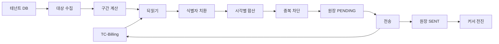

단계별로 하는 일은 이렇습니다.

1. **대상 수집**: 컨트롤 플레인 DB 의 테넌트 테이블과 테넌트 상품 테이블을 조인해, 활성 상태이면서 과금 대상 상품을 켠 테넌트를 모읍니다 (#1815).
2. **구간 계산**: 대상별 마지막 전송 시각(체크포인트)을 읽어 이번에 보낼 시간 구간을 정합니다. 배치가 밀렸으면 `ceil((now - lastSent) / 3600)` 만큼 밀린 회차를 한 번에 보충합니다 (#1815 AC-3).
3. **되읽기(READ)**: TC-Billing 에 우리 IaaS 상품 appKey 로 조회를 겁니다. 카운터 이름은 `iaas.*` 와 `apigw.v2.*` 이고, 호출은 `POST /billing/v7.0/admin/products/{productId}/meters/search` 입니다. 이 경로는 조회 전용이며 쓰기를 하지 않습니다 (#1817, #1858).
4. **식별자 치환**: 카운터 이름 앞머리를 우리 제품명으로 바꾸고, 조직 / 프로젝트 / appKey 를 고객 것으로 교체합니다. 사용량 값 자체는 손대지 않습니다 (#1817, #1858).
5. **합산과 중복 차단**: 시각과 카운터 단위로 합치고(#2211), 원장을 조회해 이미 보낸 건은 걸러 냅니다 (#1816).
6. **전송(SEND)**: 고객 Foundry appKey 로 `POST /billing/v7.0/admin/products/{productId}/meters` 를 호출합니다 (#1812).
7. **원장 기록과 커서 전진**: 보낸 내용을 원장에 남기고 체크포인트를 앞으로 옮깁니다 (#1814).

### 3.2 읽는 키와 보내는 키가 다릅니다

이 파이프라인에서 가장 헷갈리는 지점이라 초기에 문서로 못 박았습니다 (#1811 댓글, #1827).

| 구분 | 사용하는 appKey | 카운터 이름 | HTTP |
|---|---|---|---|
| READ | 우리 계정의 IaaS 상품 appKey (`tenant_product_app_key`) | `iaas.*`, `apigw.v2.*` | 조회만 |
| SEND | 고객 Foundry appKey (`tenant.app_key`) | `foundry.*` | 저장 |

원자 단위(테넌트)는 프로젝트 : appKey : 서비스 테넌트가 1:1:1 이고, 사용자 : 고객 프로젝트 : 서비스 테넌트는 1:n:n 입니다. 그래서 배치는 테넌트마다 독립 루프를 돕니다 (#1811 댓글).

읽기를 조회 전용으로 강제한 이유가 있습니다. 우리 계정에는 실제 IaaS 요금이 쌓이는데, 그 계정에 미터를 잘못 쓰면 우리 회사 요금이 틀어집니다. 그래서 READ 포트는 타입 레벨에서 조회 외의 메서드를 아예 노출하지 않도록 분리했습니다 (#1817, #1858).

### 3.3 실행 모델: Spring Batch

초기에는 `@Scheduled` 가 서비스 메서드를 직접 부르는 형태였는데, 재시도와 부분 실패 격리를 손으로 짜다 보니 코드가 늘어나서 Spring Batch Job/Step 으로 전환했습니다 (#1815, PR #1089).

| 컴포넌트 | 클래스 | 하는 일 |
|---|---|---|
| Reader | `MeteringGroupItemReader` | 과금 대상을 모으고 구간을 계산해 `(readProductId, window.from)` 단위로 묶습니다 |
| Processor | `MeteringGroupItemProcessor` | 묶음당 되읽기 1콜, appKey 로 응답을 갈라내고, 리전과 매핑을 검증한 뒤 치환하고 중복을 거릅니다 |
| Writer | `MeteringGroupItemWriter` | 고객 단위로 묶어 1회 전송하고 원장을 남긴 뒤 커서를 전진시킵니다 |
| SkipPolicy | `MeteringSkipPolicy` | 되읽기 실패만 그 묶음을 건너뛰게 합니다 |
| Listener | `MeteringStepListener` | 처리 카운터를 Step 실행 컨텍스트에 남깁니다 |

호출 수를 줄이는 최적화도 여기서 했습니다. 처음에는 테넌트마다 1콜이었는데, 검색 API 본문의 `appKeys` 배열을 활용해 같은 상품을 켠 여러 테넌트를 1콜로 조회하고 응답 행의 appKey 로 테넌트를 갈라내도록 바꿨습니다. 호출 수가 테넌트 수에서 상품 수로 줄었습니다 (#1815).

---

## 4. 핵심 설계 1: ShedLock 분산 락

### 4.1 왜 필요했는가

배포 매니페스트는 `replicas: 2` 입니다 (#1887). 배치 파드 한 대가 죽어도 다음 정각 전송이 빠지지 않게 하려는 이중화입니다. 그런데 스케줄러는 파드마다 따로 돌기 때문에, 아무 장치가 없으면 매시 정각에 두 대가 같은 사용량을 각각 전송해 정확히 두 배로 청구됩니다.

리더 선출을 직접 구현하거나 큐를 하나 더 세우는 선택지도 있었지만, 이미 컨트롤 플레인 MySQL 을 쓰고 있었고 잡이 두 종류(매시 전송, 매일 대사)뿐이라 새 인프라를 추가할 이유가 없었습니다. Bastion 선례에서도 같은 방식(`JdbcTemplateLockProvider`)을 쓰고 있어서 ShedLock 을 택했습니다 (#1811, #1815).

### 4.2 동작 원리

모든 인스턴스가 함께 바라보는 `shedlock` 테이블 한 개에 "이 잡은 지금 점유 중"이라는 행을 먼저 기록한 인스턴스만 실행하고, 나머지는 그 행을 보고 이번 회차를 건너뜁니다 (#1811).

승자를 가르는 것은 시각 비교입니다. 락을 시도할 때 그 행의 만료 시각(`lock_until`)이 현재보다 과거인지를 조건으로 걸어 갱신하므로, 만료됐거나 비어 있을 때만 성공합니다. 아직 미래(점유 중)면 갱신된 행이 0건이 되고 그것이 곧 실패이자 건너뛰기입니다 (#1811).

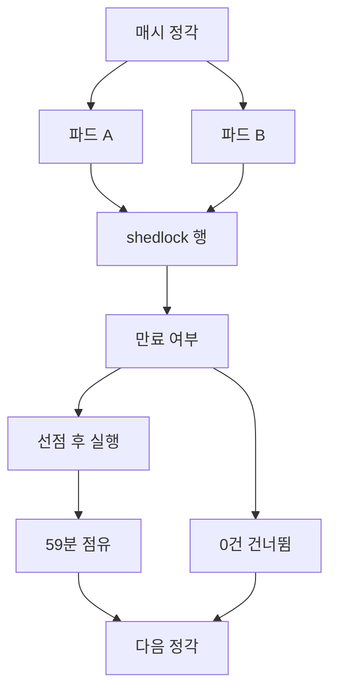

시간 순서로 보면 이렇습니다.

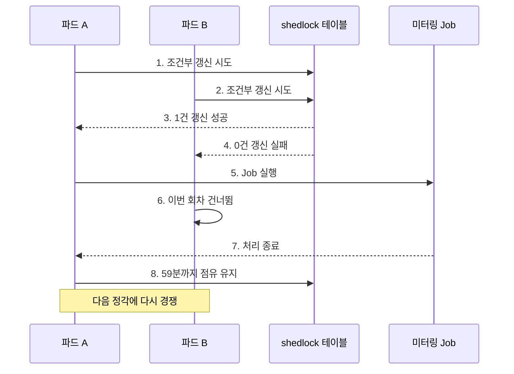

### 4.3 설정값과 그 이유

| 항목 | 값 | 근거 |
|---|---|---|
| 매시 전송 cron | `0 0 * * * *` (매시 0분 0초) | #1815 |
| 매시 전송 락 이름 | `meteringBatch` | 코드 |
| 최소 / 최대 점유 | 둘 다 `PT59M` (약 59분) | #1811, `@EnableSchedulerLock(defaultLockAtMostFor = "PT59M")` |
| 대사 cron | `0 0 4 * * *` (매일 새벽 4시) | #1816 |
| 대사 락 이름 | `reconcileBatch` | 코드 |
| 대사 점유 | 최소 `PT1M`, 최대 `PT30M` | 코드 |

점유 시간을 약 59분으로 둔 것이 핵심입니다 (#1811).

- **최대 점유(59분)**: 한 인스턴스가 락을 든 채로 죽어도 다음 주기 전에 자동으로 풀립니다. 락이 영원히 안 풀려 전송이 멈추는 사태를 막습니다.
- **최소 점유(59분)**: 잡이 몇 초 만에 끝나도 락을 바로 놓지 않습니다. 처리가 빨리 끝났을 때 옆 파드가 같은 정각의 락을 다시 잡아 두 번 실행되는 것을 막습니다.

두 값을 모두 59분으로 두어, 한 정각에는 반드시 한 번만 실행되고 다음 정각에는 반드시 다시 경쟁이 열리는 구조가 됩니다.

### 4.4 클럭 스큐 대응

`JdbcTemplateLockProvider` 를 만들 때 `usingDbTime()` 을 켰습니다. 만료 여부를 파드의 시계가 아니라 DB 시계로 판단하게 만드는 옵션입니다. 파드 두 대의 시계가 몇 초 어긋나 있으면 "아직 점유 중인데 만료로 보이는" 창이 생기는데, 기준 시계를 하나로 모아 그 창을 없앴습니다 (코드 `ShedLockConfig`).

같은 이유로 잡을 깨우는 시각 자체도 분 단위로 절삭해 Job 파라미터에 싣습니다. 정각 1회를 하나의 Job 인스턴스로 식별하게 만들어, Spring Batch 레벨에서도 같은 정각의 중복 실행을 한 번 더 막습니다 (코드 `MeteringBatchScheduler`).

---

## 5. 핵심 설계 2: 트랜잭션 아웃박스

### 5.1 왜 필요했는가

전송은 외부 HTTP 호출이고 원장 기록은 우리 DB 쓰기입니다. 이 둘은 한 트랜잭션으로 묶을 수 없습니다. 그래서 "전송 성공 → (크래시) → 원장 기록 실패" 라는 창이 생깁니다. 이 상태로 파드가 재기동하면 다음 회차가 원장을 보고 "안 보냈네" 라고 판단해 같은 사용량을 다시 보냅니다. 정확히 이중 과금입니다 (#1908).

반대 방향도 있습니다. 먼저 원장에 기록하고 나중에 전송하면, 전송 전에 죽었을 때 원장에는 보냈다고 적혀 있지만 실제로는 안 나간 상태가 됩니다. 이번에는 저과금입니다.

어느 쪽으로 순서를 잡아도 한쪽 사고가 남기 때문에, 중간 상태를 하나 두는 아웃박스 방식을 택했습니다.

### 5.2 상태 전이

`meter` 원장에 `send_status` 컬럼(`PENDING` / `SENT`)을 추가하고, Writer 의 순서를 `savePending` → `sendMeters` → `markSent` → `saveCheckpoint` 로 바꿨습니다 (#1908, 마이그레이션 `1908-meter-send-status.sql`).

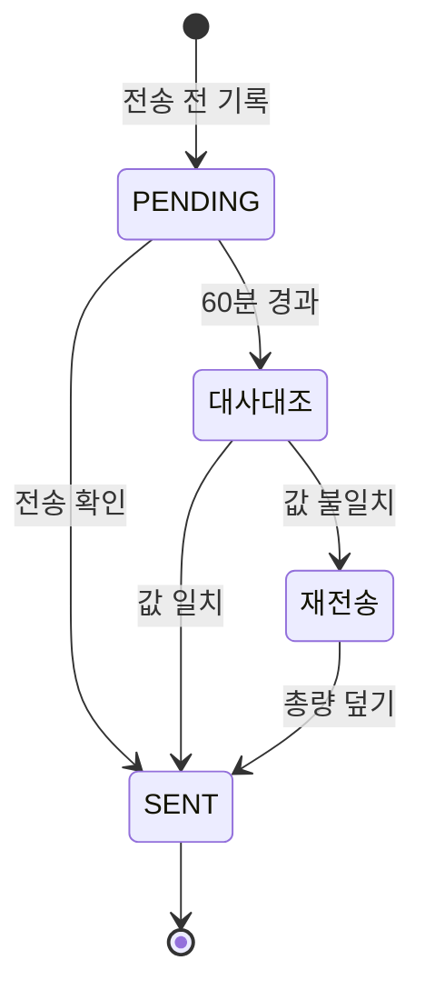

각 상태의 뜻은 이렇습니다.

- **PENDING**: 보내려고 마음먹은 시점에 먼저 커밋해 둔 행입니다. 아직 빌링에 갔는지 모릅니다.
- **SENT**: 전송이 확인된 행입니다. 매시 배치의 중복 차단 조회는 이 행들을 봅니다.

전송 직후 크래시하면 행은 `PENDING` 으로 남습니다. 매시 배치는 `PENDING` 을 재전송하지 않으므로 이중 과금이 나지 않습니다. 남은 `PENDING` 은 일일 대사가 정리합니다 (#1908).

### 5.3 대사가 PENDING 을 해소하는 방법

`ReconcileService.resolvePending` 이 유예 시간(현재 시각으로부터 60분 이전)을 지난 `PENDING` 만 골라 빌링 실제 적재분과 대조합니다. 유예를 둔 이유는, 지금 막 돌고 있는 매시 배치의 진행 중인 `PENDING` 과 경합하지 않기 위해서입니다 (#1908).

| 대조 결과 | 조치 | 막는 사고 |
|---|---|---|
| 빌링에 있고 값도 같음 | 재전송 없이 `SENT` 로 확정 | 전송 후 마킹 전 크래시분의 이중 과금 |
| 빌링에 없음 | 재전송 후 `SENT` | 전송 전 크래시분의 저과금 |
| 빌링에 있으나 값이 다름 | 그 시각 총량으로 재전송해 덮음 | 부분 총량만 반영된 채 굳는 영구 저과금 (#2211) |

세 번째 줄은 나중에 추가된 것입니다. 처음에는 "빌링에 그 키가 존재하는가" 만 봤는데, 합산 전송으로 바뀐 뒤(#2211)에는 같은 시각에 부분 총량만 반영된 채 크래시할 수 있어서, 존재 확인이 아니라 값 비교로 판정을 바꿨습니다 (#2211).

### 5.4 중복 차단의 이중 구조

중복 과금 방지는 두 겹입니다 (#1816).

1. **체크포인트로 구간을 겹치지 않게 합니다.** 대상별 마지막 전송 시각을 저장해, 다음 회차는 그 이후만 봅니다.
2. **원장 조회로 이미 보낸 건을 뺍니다.** 중복 판정 키는 `(counterName, resourceId, 사용시각)` 이고, 전용 인덱스를 걸어 두었습니다 (#1814).

체크포인트 하나만으로는 부족한 이유가 있습니다. 빌링에 지각 적재되는 데이터가 있어서, 이미 지나온 시각의 행이 다음 회차 조회에 잡힐 수 있습니다. 그때 원장 조회가 두 번째 방어선이 됩니다.

중복 차단 조회만은 의도적으로 상태와 무관하게(`PENDING` 도 포함해서) 봅니다. 진행 중인 `PENDING` 을 안 보내진 것으로 오인해 다시 보내면 그 자리가 곧 이중 과금이기 때문입니다. 이 결정은 코드 주석과 모듈 가이드에 변경 금지로 못 박아 두었습니다 (#1908).

### 5.5 체크포인트 복합키 사고

리뷰 과정에서 잡은 Blocker 하나를 기록해 둡니다. `metering_checkpoint` 의 기본키가 처음에는 appKey 단독이었습니다. 그런데 한 테넌트가 여러 빌링 상품(기본 인프라, 오브젝트 스토리지, API Gateway)을 동시에 켤 수 있습니다. 이 상태에서 첫 상품을 보내고 커서를 전진시키면, 나머지 상품은 "이미 그 시각까지 보냈다"고 판정돼 **영구히 과금되지 않습니다**. 기본키를 `(appkey, cloud_product_type)` 복합키로 확장해 해결했습니다 (#1815, 마이그레이션 `1815-checkpoint-composite-key.sql`).

---

## 6. 핵심 설계 3: 대사와 체크포인트

### 6.1 왜 필요했는가

전송 코드가 아무리 정확해도, 빌링 쪽에서 받아 놓고 적재하지 않았거나 우리가 예상 못 한 경로로 새면 알 방법이 없습니다. 우리 원장은 "보냈다고 우리가 믿는 것"이고 빌링 적재분은 "실제로 청구될 것"이라서, 이 둘을 주기적으로 맞대어 보지 않으면 차이를 영영 모릅니다 (#1816).

### 6.2 대사 흐름

`ReconcileService.reconcileAll` 이 매일 새벽 4시에 돕니다.

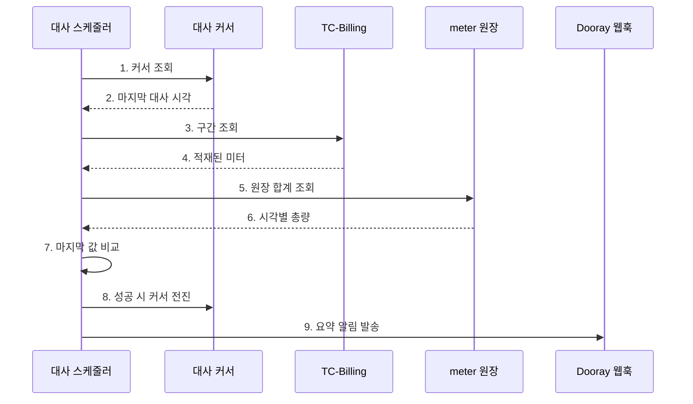

설계상 중요한 결정 하나는 **자동 보정을 하지 않는다**는 것입니다. 차이를 발견해도 코드가 알아서 재전송하거나 삭제하지 않고 리포트만 냅니다. 과금이 걸린 영역이라 자동 보정이 잘못 돌면 사고가 커지기 때문에, 운영자가 승인한 뒤 재전송(`resendByCondition`) 또는 삭제(`deleteByCondition`)로 처리합니다 (#1811, #1816).

대사 대상은 `sendAppKey` 단위로 중복을 제거합니다. 처음에는 (테넌트 × 상품) 조합마다 대사를 돌아서, 같은 면을 여러 번 비교한 결과가 중복 리포트로 나왔습니다 (#1815 리뷰 2차).

### 6.3 고정 24시간 방식의 구멍

초기 구현은 실행 시각 기준 "직전 24시간"을 고정으로 봤습니다. 어디까지 대사했는지 저장하지 않았습니다.

문제는 대사 잡이 하루라도 실행되지 않을 때 드러납니다. 파드 재기동, 배포, 분산 락 문제 등으로 한 회차가 걸러지면, 다음 회차는 다시 "직전 24시간"만 보므로 걸러진 24시간은 **영영 다시 보지 않습니다**. 실 과금 이후라면 그 구간의 저과금이나 초과가 탐지되지 않고 지나갑니다 (#1939).

역설적인 점은 매시 미터링 배치는 이미 이 문제를 체크포인트로 풀고 있었다는 것입니다. 밀린 회차를 커서부터 보충하는 장치가 전송 쪽에만 있고 대사 쪽에는 없었습니다.

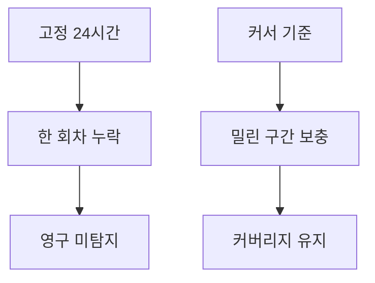

### 6.4 대사 체크포인트 도입

과금 대상(`sendAppKey`)별로 마지막 대사 완료 시각을 저장하는 `reconcile_checkpoint` 테이블을 신설했습니다 (#1939, ADR 0002 Phase 1).

```sql
CREATE TABLE reconcile_checkpoint (
    send_appkey          VARCHAR(24) NOT NULL,
    last_reconciled_time DATETIME(6) NULL,
    PRIMARY KEY (send_appkey)
);
```

전송 커서(`metering_checkpoint`)와 합치지 않고 별도 테이블로 만든 이유는 단위(grain)가 다르기 때문입니다. 전송 커서는 `(appkey, cloud_product_type)` 복합키이고 대사 커서는 `sendAppKey` 단일 키입니다 (#1939).

동작 규칙은 세 가지입니다.

- 조회 구간을 "직전 24시간"에서 "커서 이후 ~ 지금"으로 바꿉니다. 커서가 없으면 24시간으로 부트스트랩합니다.
- 대사가 성공하면 커서를 현재 시각으로 전진시키고, 실패하면 전진시키지 않습니다. 다음 회차가 그 구간을 다시 봅니다.
- 대상별 커서라서 한 대상의 실패가 다른 대상의 전진을 막지 않습니다.

### 6.5 알림 연결

대사 결과를 로그로만 남기면 담당자가 매일 로그를 열어 봐야 합니다. 그래서 대사가 끝나면 Dooray 수신 웹훅으로 요약을 밀어 넣게 붙였습니다 (#1929).

이 요구는 코드 리뷰가 아니라 팀장님 질의에서 나왔습니다. #1816 댓글에서 "reconciliation 누락이 발생한 건 알림을 받을 수 있나요?" 라는 질문이 있었고, 그 답변으로 태스크를 새로 등록해 구현했습니다 (2026-07-03).

| 설계 결정 | 내용 |
|---|---|
| 발송 조건 | 정합이어도 매일 1건 발송합니다. 하루 1건이 heartbeat 역할을 겸합니다 |
| 담는 내용 | 개별 항목은 나열하지 않고 요약 카운트만 담습니다. 알림 노이즈를 막습니다 |
| 실패 격리 | 비동기(`@Async`)로 보내고 예외를 삼킵니다. 알림 실패가 대사 배치를 죽이지 않습니다 |
| 로그 분리 | 대사 실패와 알림 실패를 나눠 남깁니다. "대사는 성공했는데 알림만 실패" 를 오해하지 않게 합니다 |
| 시크릿 취급 | 웹훅 URL 은 토큰이 포함돼 코드에 넣지 않고 배포 환경변수로만 주입합니다 |

한 가지 미묘한 케이스도 잡았습니다. 합계 차이가 0이어도 건별로는 어긋난 경우(한 건 누락 + 다른 건 초과가 상쇄된 경우)가 있습니다. 이때 합계만 보고 정합으로 넘기면 초록 표시가 오탐이 되므로, 건 단위 불일치 건수를 따로 세어 차이로 알리도록 했습니다 (#1929).

같은 대화에서 팀장님이 "부하가 있을 것 같으면 미터링 대상 고객 100개, 1,000개 가정하고 대사 테스트를 해 보면 좋겠다" 는 제안을 주셔서, 부하 확인 후 주기를 12시간으로 줄이는 것과 월 정산 마감 2~3일 전 월 단위 대사를 추가하는 것을 후속 검토 항목으로 잡았습니다 (#1816 댓글, 2026-07-03).

---

## 7. 트러블슈팅: KST 타임존 9시간 밀림

이 건은 한 번에 고쳐지지 않고 세 단계에 걸쳐 재발했습니다. "왜 첫 수정이 불완전했는가" 가 이 사례의 핵심입니다.

### 7.1 발단: 배스천 실코드 전수 대조

증상이 먼저 있었던 것이 아니라, 같은 과금 프레임워크로 이미 미터링을 보내고 있는 타 서비스(NHN Bastion)의 실코드와 우리 전송 코드를 전수 대조하다가 발견했습니다. 호출 API 와 전송 필드 구성은 동일했고, 다른 것은 시간 처리 방식 하나였습니다 (#1970).

| 항목 | 배스천 | 우리 (수정 전) |
|---|---|---|
| 조회 from/to 직렬화 | 시간대 표기 포함 (`2026-07-07T13:00:00+09:00`) | 시간대 표기 없음 (`2026-07-07T13:00:00`) |
| 배치 시계 | 시간대가 포함된 시각 타입 | 파드 기본 시계 (컨테이너 기본값 UTC) |

시간대 표기가 없으면 서버가 그 시각을 어느 시간대로 해석하느냐에 결과가 좌우됩니다. 실빌링의 미터 시각은 +09:00 기준이라, UTC 파드에서 돌면 조회 구간이 의도보다 9시간 밀립니다.

증상이 그때까지 안 보였던 이유도 명확합니다. 실빌링을 상대한 실행은 전부 KST 환경(로컬)이었고, 알파 파드는 같은 클러스터의 목(mock) 빌링만 상대해서 어긋날 상대가 없었습니다 (#1970).

그리고 이 문제는 사실 확인이 선행돼야 했습니다. 팀장님이 "프레임워크 기준 빌링 미터링이 KST 인가요, 우리가 정하기 나름인가요?" 라고 물었고, 다른 팀원은 "우리 DB 에 저장되는 값들은 전부 UTC 로 저장되고 있을 것" 이라고 답했습니다. 빌링 위키의 미터링 조회 문서를 직접 확인해 KST 기준임을 확정한 뒤에야 방향을 잡았습니다 (#1970 댓글, 2026-07-07).

### 7.2 3단계 수정 경과

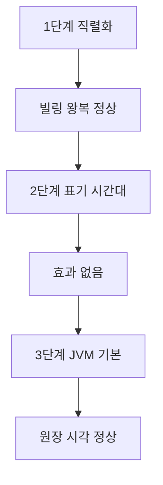

#### 1단계: 직렬화에 오프셋 명시 (2026-07-08, PR #1128)

시간 규약의 단일 진실로 `BillingTimes` 를 신설했습니다. 기준 시간대 상수(`BILLING_ZONE = Asia/Seoul`)와 오프셋 명시 직렬화 헬퍼(`format()`, ISO_OFFSET_DATE_TIME)를 제공합니다.

| 지점 | AS-IS | TO-BE |
|---|---|---|
| 배치 시계 | 파드 기본 시계 | `Asia/Seoul` 고정 |
| 되읽기 from/to | 시간대 표기 없음 | +09:00 명시 |
| 대사 검색 및 삭제 from/to | 시간대 표기 없음 | +09:00 명시 |
| 재전송 및 즉시정산 timestamp | 시간대 표기 없음 | +09:00 명시 |

매시간 배치의 전송 timestamp 는 빌링 응답 문자열을 그대로 흘려보내고 있어서 변경이 없었습니다. JP(jp1) 리전도 일본 시간이 연중 +09:00 이라(서머타임 없음) KST 고정으로 같이 동작합니다 (#1970).

**여기서 끝났다고 판단한 것이 첫 번째 오판이었습니다.** 빌링과 주고받는 문자열은 확실히 고쳤지만, 우리 DB 에 저장되는 값은 그 경로를 타지 않습니다.

#### 2단계: Hibernate 표기 시간대 (2026-08-06, PR #1256)

약 한 달 뒤 알파 원장을 raw SQL 로 들여다보다가, `meter` 의 시각 컬럼들과 두 커서 테이블이 9시간 미래로 저장돼 있는 것을 발견했습니다.

원인은 `LocalDateTime` 에 시간대 정보가 남지 않는다는 점입니다. 배치 시계를 KST 로 고정했어도 `LocalDateTime` 으로 넘기는 순간 "몇 시" 라는 벽시계 숫자만 남고 "어느 시간대의 몇 시" 인지는 사라집니다. 저장 시점에 Hibernate 가 그 숫자를 JVM 기본 시간대(파드 기본값 UTC)로 해석해 한 번 더 환산해 버렸습니다.

그래서 `application.yml` 에 `hibernate.jdbc.time_zone: Asia/Seoul` 을 추가했습니다.

**이것도 효과가 없었습니다.** 이것이 두 번째 오판입니다.

#### 3단계: JVM 기본 시간대 (2026-08-06, PR #1257)

Hibernate 가 `LocalDateTime` 을 저장할 때 하는 일은 두 단계입니다.

1. JVM 기본 시간대로 그 벽시계를 절대 시각(순간)으로 바꿉니다.
2. `jdbc.time_zone` 으로 그 순간을 DATETIME 리터럴로 표기합니다.

**두 시간대가 같아야 값이 그대로 통과합니다.** JVM 기본이 UTC 인 채로 표기만 KST 로 바꾸면, 1번에서 9시간 밀린 순간을 만들고 2번에서 그 순간을 KST 로 적으므로 결과는 그대로 9시간 밀립니다. 알파 실측으로 이것이 확인됐습니다. **실제 09:10 에 실행한 배치의 원장 `insert_time` 이 18:00 으로 저장돼 있었습니다** (#1970).

Dockerfile 의 CMD 에 `-Duser.timezone=Asia/Seoul` 을 추가해 JVM 기본 시간대를 맞추고서야 해소됐습니다.

### 7.3 근본 원인 정리

결국 세 곳이 같은 값이어야 원장 벽시계가 KST 로 맞습니다.

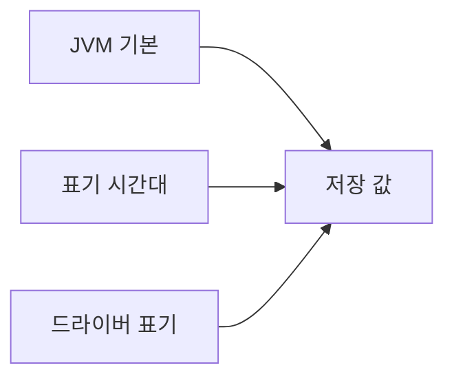

| 위치 | 설정 | 역할 |
|---|---|---|
| Dockerfile CMD | `-Duser.timezone=Asia/Seoul` | 벽시계를 순간으로 바꿀 때 씁니다 |
| `application.yml` | `hibernate.jdbc.time_zone` | 그 순간을 DATETIME 리터럴로 표기할 때 씁니다 |
| 환경별 jdbc-url | `serverTimezone` | 위 값 미설정 시의 대체 표기 시간대입니다 |

핵심은 값이 무엇인지가 아니라 셋이 같은지입니다. 첫 두 개가 다르면 그 차이만큼 저장값이 밀립니다.

### 7.4 왜 오래 무증상이었는가

읽기에도 같은 환산이 대칭으로 걸립니다. 저장할 때 9시간 더하고 읽을 때 9시간 빼므로, 배치가 자기가 쓴 값을 자기가 읽는 왕복은 앞뒤가 맞습니다. 그래서 **기능은 정상 동작하고 raw SQL 로 직접 볼 때만 드러납니다.** 무증상으로 오래 남는 유형이며, 실제로 2026-07-07 부터 2026-08-06 까지 알파에 그대로 있었습니다 (#1970).

빌링과의 왕복은 이 버그와 무관했습니다. `BillingTimes.format` 이 오프셋을 명시하고 전송 timestamp 는 문자열 패스스루이기 때문입니다. 그래서 1단계 수정만 하고 끝난 것으로 보였던 것입니다.

설정 위치에도 함정이 하나 있었습니다. 이 프로젝트는 `MySqlConfig` 가 EntityManagerFactory 를 직접 만들면서 특정 설정 맵만 주입하기 때문에, `spring.jpa.properties.hibernate.*` 아래에 적으면 **예외 없이 조용히 무시됩니다.**

### 7.5 재발 방지

- 회귀 가드 테스트 `HibernateJdbcTimeZoneBindingTest` 를 추가했습니다. yml 바인딩 형태, 기준 시간대 상수와의 일치, 그리고 Dockerfile 의 `-Duser.timezone` 존재까지 검증합니다.
- Gradle 빌드에 Dockerfile 을 테스트 입력으로 선언했습니다. 이 선언이 없으면 Dockerfile 만 고쳤을 때 Gradle 이 테스트를 up-to-date 로 판단해 건너뜁니다.
- 모듈 가이드(`CLAUDE.md`)의 시간 규약 항목에 "Clock 고정만으로는 부족하다" 는 짝 관계를 명시하고, 운영 문서에 진단 순서 런북과 헛수정 사례를 남겼습니다.

---

## 8. 트러블슈팅: 가격표 카운터 정렬 (#2211)

### 8.1 문제 1: 이름이 안 맞으면 과금이 안 됩니다

기존 방식은 되읽은 카운터 이름의 앞머리만 제품명으로 바꿔 그대로 재전송하는 것이었습니다. 뒷부분은 손대지 않으므로, 가격표에 등록된 이름과 어긋나는 카운터가 그대로 나갑니다. **등록된 이름과 어긋나면 과금되지 않습니다.**

알파에서 실제로 나가던 13종을 가격표(v0.1, 2026-07-29)와 대조한 결과입니다.

| 상태 | 카운터 |
|---|---|
| 등록됨 (4종) | `storage.volume.hdd`, `network.internet.traffic`, `network.free_service.traffic`, `compute.g2.t4.c8m64` |
| 이름이 다름 | `container.kubernetes.cluster` (등록명 `compute.fd1.cluster`), `network.vpc.count` (등록명 `network.vpc.traffic`) |
| 기본료로 흡수 | `compute.r2.c8m32` |
| 미등록 | 로드밸런서 3종, OBS 2종, 쿠버네티스 트래픽 |

반대 방향의 누락도 있었습니다. `storage.volume.ssd`, `network.region.traffic`, `network.vpc.traffic` 은 가격표에 등록됐는데 우리 카탈로그에 없어서 미매핑으로 버려지고 있었습니다. **블록 SSD 는 매출이 그대로 빠지는 항목입니다.**

### 8.2 문제 2: HOURLY_LATEST 는 여러 건을 합치지 않습니다

상품 메타를 보니 25종 전부 `counterTypeCode` 가 `HOURLY_LATEST` 이고 `usageAggregationUnitCode` 가 `COUNTER_NAME` 이었습니다. 빌링 담당자에게 확인한 결과, **같은 시간대에 같은 카운터로 여러 건을 보내면 마지막 1건만 사용량이 됩니다** (2026-08-06 확인). 합산 집계를 원하면 `DELTA` 여야 합니다.

기존 코드는 되읽기 행마다 1건을 보냈습니다. 알파에서 블록 스토리지는 한 테넌트가 한 시간에 37건이 나가고 있었으므로, 그대로 두면 **37개 볼륨 중 1개만 과금됩니다.**

그래서 전송 단위를 `(appKey, counterName, 사용시각)` 당 1건으로 바꾸고 값은 그 시각의 누적 합계로 보내도록 고쳤습니다. 원장은 되읽기 행 단위로 그대로 남겨서 중복 판정 키를 유지하고, 시각별 원장 합계가 그 시각에 보낸 총량과 같도록 맞췄습니다.

### 8.3 문제 3: 기본료 초과분은 우리가 계산해서 보내야 합니다

기본료는 72코어 기준이고, 사용자가 그 위에 추가한 코어는 빌링이 알아서 빼 주지 않습니다. 우리가 계산해서 별도 카운터로 보내야 합니다.

단위가 코어 낱개가 아니라 **추가 워커 한 대**(`r2.c8m32`, 8코어)의 시간이라는 것은 요금기획 업무(#16224)의 과금 시뮬레이션 산식(`Foundry.Cluster.extended = 24Hrs * 10Days * 1,602원`)과 홈페이지 요금표의 "추가 워커" 표기에서 확정했습니다.

```
추가 워커 수 = (그 시각 CPU 워커 코어 합 - 72) / 8
```

0 이하면 보내지 않습니다. 그 시각에 기본료(클러스터) 건이 없으면 무료 코어 기준을 정할 수 없으므로 역시 보내지 않습니다.

같은 맥락으로 SSD 도 차감이 필요했습니다. 기본료에 포함된 스토리지를 빌링이 빼 주지 않으므로, 기본료 1건당 1,400GB 를 시각별 합에서 빼고 초과분만 보냅니다. HDD 는 전량 과금입니다. 차감분은 **음수 원장 행**으로 남겨서 시각별 원장 합계와 전송 총량이 계속 같도록 유지했습니다. 이 등식이 깨지면 대사가 매일 오탐합니다 (2026-08-07 확정).

### 8.4 처리 흐름

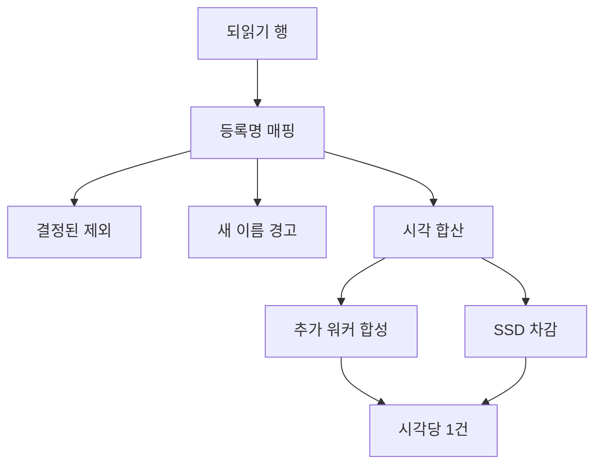

미등록 카운터를 두 갈래로 나눈 것도 의도한 설계입니다. 과금 제외로 결정이 끝난 카운터(로드밸런서, Floating IP, VPC 개수, OBS 3종, API Gateway 2종, 쿠버네티스 트래픽)는 경고 없이 debug 로 내리고, **결정된 적 없는 새 이름만** 경고와 `skippedUnmapped` 카운트로 셉니다. 그래야 경고 로그가 실제로 사람이 봐야 할 신호로 남습니다.

### 8.5 코드 변경

| 항목 | 내용 |
|---|---|
| `FoundryCounter` (신규) | 가격표 등록 25종의 이름, 전송 단위, 리전별 등록 범위, 대응하는 되읽기 소스 이름 |
| `ComputeFlavors` (신규) | CPU 워커와 GPU 판별, flavor 이름에서 코어 수 파싱, 추가 워커 환산 |
| `CounterTypeCode` | `HOURLY_LATEST` 추가 |
| `IaasMeterConverter` | 등록명과 등록 단위로 치환. 미등록은 예외 대신 분류 결과로 반환 |
| `MeteringGroupItemProcessor` | 시각과 카운터 단위 합산, 추가 워커 합성, SSD 차감 |
| `ReconcileService` | 대조 단위를 시각 단위로 맞추고 마지막 값 비교로 전환 |
| `MeterCounter` (제거) | 되읽기 소스 목록 역할이 사라져 삭제 |

등록 카운터는 kr1 17종, jp1 8종으로 총 25종입니다. GPU 는 KR1 에만 출시돼 있어 jp1 에는 등록 카운터가 없고, jp1 으로 GPU 사용량이 들어오면 보내지 않고 경고를 남깁니다.

### 8.6 실제 전송 형태

한 테넌트가 kr1 에서 한 시간 동안 사용한 경우입니다. **되읽기 62행이 전송 7건으로 줄어듭니다.**

| 고객 사용 상황 | 되읽기 소스 | 보내는 값 | 단위 |
|---|---|---|---|
| NKS 클러스터 1개 | `container.kubernetes.cluster` 1행 | 1.0 | HOURS |
| CPU 워커 12대 (96코어) | `compute.r2.c8m32` 12행 | 3.0 | HOURS |
| GPU T4 인스턴스 2대 | `compute.g2.t4.c8m64` 2행 | 2.0 | HOURS |
| SSD 볼륨 5개 합 2,000GB | `storage.volume.ssd` 5행 | 629,145,600 | KB |
| HDD 볼륨 37개 합 4,217GB | `storage.volume.hdd` 37행 | 4,421,844,992 | KB |
| 인터넷 트래픽 3개 리소스 | `network.internet.traffic` 3행 | 1,200 | KB |
| 무료 구간 트래픽 2개 리소스 | `network.free_service.traffic` 2행 | 850 | KB |

값의 근거는 셋입니다.

- 추가 워커 3.0 은 `(96코어 - 72코어) / 8코어` 입니다.
- SSD 629,145,600 은 원본 2,000GB 에서 기본 제공량 1,400GB 를 뺀 600GB 를 KB(1024 기반)로 환산한 값입니다. 원장에는 원본 5행과 차감 1행(-1,400GB)을 함께 남깁니다.
- HDD 는 차감 없이 전량입니다. 기본료에 포함된 스토리지가 SSD 기준이기 때문입니다.

단가가 확정된 두 카운터로 이 한 시간의 청구액을 계산하면 클러스터 25,000원(1.0 × 25,000)과 추가 워커 4,806원(3.0 × 1,602)입니다.

### 8.7 부수 안전장치

기본료 카운터 값이 1.0 이 아니면 경고를 남깁니다. 테넌트당 클러스터 1개가 정상인데, 2.0 이 들어오면 기본료가 조용히 두 배로 청구되기 때문입니다.

매직 넘버도 상수로 뺐습니다. `KB_PER_GB`(1024 기반 환산 계수), `SSD_BASE_QUOTA_GB`(1,400), `EXPECTED_BASE_FEE_UNITS`(1.0) 를 신설하고 `SSD_BASE_QUOTA_KB` 는 두 상수의 곱으로 유도해 값의 출처가 이름에 드러나게 했습니다.

---

## 9. 검증

### 9.1 로컬 우선 검증

알파 빌링을 직접 호출하지 않는다는 원칙 아래, 실 엔드포인트 없이 종단 검증이 가능한 경로를 두 겹으로 만들었습니다.

| 도구 | 형태 | 검증 범위 | 근거 |
|---|---|---|---|
| `FakeBillingServer` | MockWebServer (테스트 내부) | 되읽기 응답, 전송 수신 시 스키마와 카운터 이름 접두어, volume 검증 | #1818 |
| `MeteringBatchE2eTest` | 실 어댑터 체인 + fake 빌링 + 인메모리 원장 | 수집부터 치환, 전송, 원장 기록까지 | #1818 |
| 로컬 fake 빌링 서버 | FastAPI standalone (localhost:8000) | 스케줄 발화, 실 DB 원장 적재까지 포함한 전체 흐름 | #1881 |
| fake 전송 어댑터 | `aias.billing.fake-send` 토글 | 어댑터 경계에서 전송만 가로채 실 빌링 READ + 안전한 SEND | #1815 |

FastAPI 서버를 따로 만든 이유가 있습니다. 테스트 안의 e2e 는 서비스를 직접 호출하는 방식이라 스케줄링과 실제 DB 적재는 검증하지 못합니다. 그 빈 부분을 별도 프로세스로 띄우는 fake 서버와 `local-fake` 프로파일로 채웠습니다 (#1881).

fake 전송 토글은 특히 유용했습니다. 되읽기는 실 빌링을 그대로 쓰면서 전송만 가로채기 때문에, **실제 데이터로 파이프라인을 돌리면서 과금 사고 위험은 0** 인 상태를 만들 수 있었습니다. 현재도 전 환경이 이 상태입니다 (#2025, #2185).

### 9.2 테스트 커버리지

| 범위 | 결과 | 근거 |
|---|---|---|
| 빌링 전송 어댑터 | 7건 (v7.0 엔드포인트와 CAB 헤더, 페이로드 스키마, 5xx 재시도 성공, 재시도 소진, 4xx 비재시도, 401 재발급 재시도, read timeout) | #1812 |
| 되읽기와 치환 | 20건 (application-core 12 + infrastructure-billing 8) | #1817 |
| 배치 신규 코드 | 라인 및 브랜치 100% (jacoco 확인) | #1815, #1816 |
| Spring Batch 전환 후 모듈 전체 | 62건 통과 | #1815 |
| 현재 배치 모듈 테스트 파일 | 24개 (저장소 실측) | 저장소 |

리뷰에서 나온 지적도 테스트로 고정했습니다. 다중 상품 동시 전송, 복합키 조회 및 저장, 501건 2페이지 페이징, 복합키 equals/hashCode 등이 그렇습니다 (#1815).

### 9.3 리얼 환경 실측 (2026-08-07)

합산 전송 설계의 전제를 검증하려고 리얼 빌링을 **55시간** 관측했습니다.

| 항목 | 실측값 |
|---|---|
| 적재 지연 | 사용시각 + 약 1시간 55분 |
| 적재 소요 | 한 시각분이 19초 안에 전량 적재 |
| 배치 정각까지 여유 | 2분 53초 ~ 4분 09초 |
| 한 시각이 두 회차로 나뉜 사례 | 관측되지 않음 |
| 기본료 카운터 값 | 55시간 전부 1.0 |

이 실측이 설계 근거를 바꿨습니다. 원래 누적 합산과 마지막 값 비교의 근거를 "지각 적재가 있으니까" 로 잡고 있었는데, 실측상 한 시각이 두 회차로 나뉘는 일이 없어서 누적 합산이 실제로는 발동하지 않는다는 것이 확인됐습니다. 그래서 근거를 **빌링 집계 규칙과의 정합**으로 바꿨습니다. 조회는 행을 그대로 돌려주지만 과금액은 `HOURLY_LATEST` 의 마지막 값이므로, 우리 비교도 같은 기준이어야 한다는 것입니다. 조회 행 합산은 빌링 규칙과 다른 계산입니다. 누적 합산 로직 자체는 적재 구간이 배치 경계를 걸치는 경우의 방어로 남겨 두었습니다.

### 9.4 배포 검증

배포 경로는 `data-platform.poc` → Jenkins → NCR → `data-platform.poc_deploy` → NHN Cloud Pipeline → CP 클러스터입니다 (#1887).

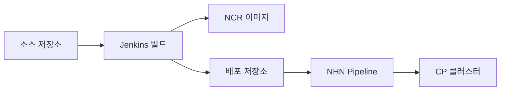

| 항목 | 내용 |
|---|---|
| Jenkins 잡 | `PLAI.CP_MeteringBatch_DEV` / `_REAL` |
| 매니페스트 프로파일 | alpha, beta, beta-jp1, real, real-jp1 (5종) |
| 구성 | deployment, service, service-monitor (ingress 불필요) |
| 파드 수 | replicas 2 + ShedLock 단일 실행 |
| 포트 | app 10392 / mgmt 10393 |

빌링 설정을 주석 상태로 두면 배치 컴포넌트가 비활성화되므로, 파드 기동만 먼저 검증할 수 있게 설계했습니다. 실제로 알파에서 billing OFF 상태 기동을 먼저 확인한 뒤 파이프라인을 붙였습니다 (#1887).

### 9.5 리뷰에서 잡은 결함들

리뷰와 정적 분석에서 나온 것 중 사고로 이어질 뻔한 항목입니다.

| 결함 | 영향 | 조치 | 근거 |
|---|---|---|---|
| 체크포인트 단일 PK | 다중 상품 테넌트의 나머지 상품이 **영구 미과금** | 복합키로 확장 | #1815 |
| 빌링 미설정 시 기동 실패 | 되읽기와 전송을 안 쓰는 환경까지 앱 부팅 차단 | 조건부 검증으로 전환 | #1812 핫픽스 PR #1066 |
| region 검증 위치 | 빌링 꺼진 프로파일도 설정 누락만으로 기동 실패 | 검증을 빌링 게이트 안으로 이동 | #1815 |
| 정렬 없는 offset 페이징 | 운영 보정 재전송에서 일부 미터 중복 또는 누락 | 안정 정렬 추가 | #1815 |
| 무제한 로드 재전송 | 긴 보정 구간에서 메모리와 시간 위험 | 500건 페이징 루프로 변경 | #1815 |
| ISO 오프셋 파싱 실패 | 실 빌링 포맷 데이터를 **전건 skip** | 오프셋을 로컬로 변환하는 처리 추가 | #1818 |
| yml 평문 DB 자격 | 자격 노출 | SKM 주입으로 전환하고 자격 rotate 필요를 명시 | #1815 |

마지막 항목은 특히 정직하게 남겼습니다. yml 에서 평문을 지웠어도 git 히스토리와 다른 모듈에 이미 남아 있으므로 자격 재발급이 별도로 필요하다는 사실을 커밋 메시지에 함께 적었습니다.

### 9.6 대규모 부하 테스트 (Task 15, #1928)

리얼 환경 관측(9.3절)이 "실제 트래픽에서 문제가 없는지"를 봤다면, 이 테스트는 "고객이 지금보다 훨씬 늘어나도 버티는지"를 미리 확인하는 것이었습니다. Story #1811의 하위 업무로 등록해 2026-07-07에 측정을 마쳤습니다.

**3단계로 물량을 늘려가며 측정했습니다.**

| 회차 | 조건 | 처리 건수 | 소요 시간 | 처리율 |
|---|---|---|---|---|
| 1차 | 테넌트 20개 × 69건 | 1,518건 | 5~6초 | 약 270건/초 |
| 2차 | 테넌트 100개 × 100건 | 10,098건 | 28초 | 약 355건/초 |
| 3차 | 테넌트 1,000개 × 201건 (운영 배치 주기와 동일 조건) | 201,402건 | 7분 11초 | 약 500~600건/초 |

3차 기준으로 정리하면 **시간당 20만 건 규모의 사용량을 실패 0건으로, 매시 정각 배치 주기(1시간) 안에서 7분 11초 만에 처리**했습니다. 배치 정각 대비 여유가 넉넉하다는 뜻입니다.

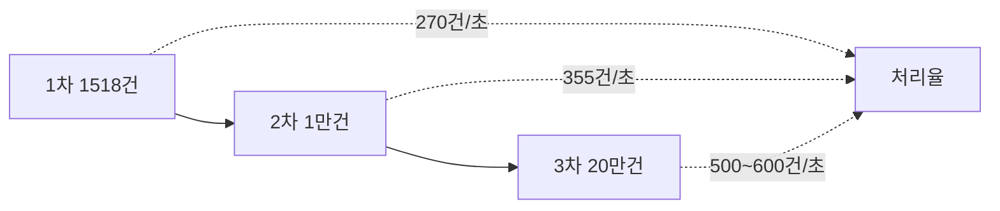

물량이 늘수록 오히려 처리율이 좋아지는 결과가 나왔는데, 원인을 찾아보니 병목이 CPU 연산이 아니라 **대상 하나당 고정된 직렬 왕복 횟수(약 6회)** 였습니다. 왕복 한 번에 실어 보내는 데이터량이 커질수록 왕복 자체의 고정 비용이 상대적으로 옅어지는 구조였습니다. 소요 시간은 대략 `1.6초 + 건당 1.33ms` 형태의 선형식으로 근사됐습니다. 이 구간에서 CPU는 상한(0.5 코어)에 닿지 않았고, 힙 512m 설정으로 60만 건 회차까지 통과해 자원 여유도 함께 확인했습니다.

**놓친 회차를 자동으로 따라잡는 기능(catch-up)도 실측했습니다.** 4일치 누락(약 15만 건), 장애 상황을 가정한 53.5만 건 복구 모두 유실 없이 처리됐습니다. 다만 이 과정에서 설계 허점을 하나 발견했습니다.

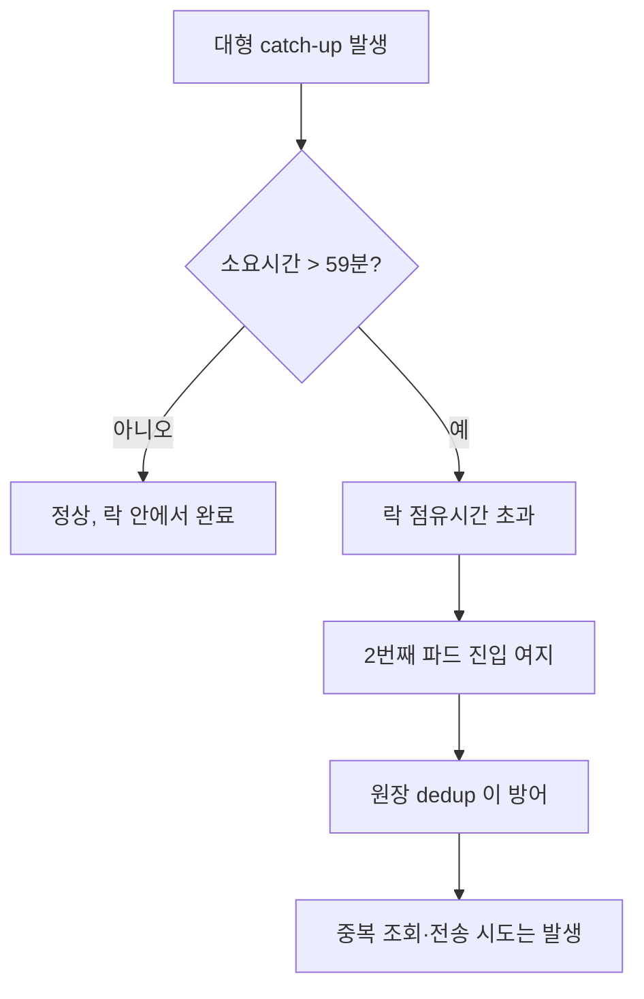

하루치(약 480만 건, 약 2시간 소요) 규모의 catch-up 이 벌어지면 ShedLock 점유 시간(약 59분, 4.1절)을 넘어서서 두 번째 파드가 같은 작업에 끼어들 여지가 생깁니다. 원장 테이블의 중복 방지 로직이 최종 결과를 보호하긴 하지만, 불필요한 중복 조회·전송 시도 자체는 막지 못합니다. 힙 사용량이 튀는 조건과 정확히 같은 조건이라, **"회차당 catch-up 상한을 둔다"**는 개선안을 후속 과제로 남겼습니다(현재 미착수).

이 밖에 확인한 것들입니다.

- **중복 제거 실증**: 회차당 20.1만 건 중 중복으로 걸러진 건을 전량 필터링하는 것을 직접 확인했습니다(이중 과금 방어가 이론이 아니라 실제로 동작).
- **대사(reconciliation) 처리 시간**: 1,002개 테넌트 규모에서 24시간 전수 대조 방식이 2분 17초 만에 끝났습니다(최악 조건 기준 상한). 다만 대사 전용 정밀 부하 측정은 "부하 축이 약하고 구버전 기준이라 측정 가치가 낮다"는 판단으로 별도 생략했습니다. 그래서 대사 주기를 12시간으로 단축할지 여부는 이 테스트로 결론 내지 못했습니다(10.4절 남은 과제 참고).
- **측정치는 하한선**: fake 빌링 서버의 응답이 실제보다 빠르기 때문입니다. 실제 빌링이 건당 100ms 지연이라고 가정하면, 3차 조건(약 3,006건의 개별 전송 요청)에 5분 정도가 더 걸릴 것으로 추정됩니다.

**측정 도구 자체에서도 문제를 몇 개 잡았습니다.** 테스트 데이터를 준비하다가 시드로 쓴 project_id(14자리)가 컬럼 제약(VARCHAR(8))에 잘려나가는 것을 발견해 별도 축약 규칙으로 바꿨고, fake 서버가 메모리 부족(OOM)으로 두 차례 죽어 4Gi로 올렸으며, 재시작 시 설정값이 초기값으로 되돌아가 버리는 문제를 환경변수 고정으로 해결했습니다. JVM 지표 확인을 위한 모니터링 리소스도 이 작업에서 추가했습니다. 부하 테스트를 준비하는 과정 자체가 별도의 버그 사냥이었던 셈입니다.

---

## 10. Result

### 10.1 완료한 것

| 구분 | 결과 |
|---|---|
| Story AC | 7개 중 6개 완료. 남은 1개(빌링 전송 클라이언트 알파 실전송 확인)는 코드 완료 상태이고 실전송 확인만 키 발급 대기 (#1811) |
| 신규 모듈 | `aias-resource-metering-batch` (별도 `@SpringBootApplication`, Spring Batch Job/Step) |
| DB 스키마 | `meter`, `metering_checkpoint`, `reconcile_checkpoint`, `shedlock` + Spring Batch 메타 6테이블. 수동 마이그레이션 9종 |
| 배포 | Dockerfile, Jenkins 잡 2종, 매니페스트 5 프로파일, 알파 파이프라인 배포 및 파드 기동 확인 (#1887) |
| 전송 카탈로그 | 가격표 등록 25종(kr1 17 / jp1 8)으로 고정. 미등록은 전송 제외 (#2211) |
| 안전 상태 | 전 환경 `fake-send=true` 유지. 실 과금 영향 0 (#2025, #2185) |

### 10.2 정량 지표

| 지표 | 값 |
|---|---|
| 관리 태스크 | Story 1건 + Task 22건 |
| 머지된 PR | 소스 저장소 15건 이상 (#1042, #1043, #1044, #1048, #1051, #1058, #1061, #1062, #1066, #1067, #1070, #1071, #1073, #1086, #1089, #1109, #1113, #1128, #1159, #1244, #1256, #1257, #1261), 배포 저장소 2건 (#26, #27) |
| 배치 모듈 테스트 파일 | 24개 |
| 신규 코드 커버리지 | 라인 및 브랜치 100% (핵심 배치 구현분, jacoco) |
| 되읽기 호출 최적화 | 테넌트 수만큼 → 상품 수만큼 |
| 전송 건수 압축 | 되읽기 62행 → 전송 7건 (한 테넌트 한 시간 기준) |
| 리얼 환경 관측 | 55시간, 정각까지 여유 2분 53초 ~ 4분 09초 |
| 이중화 | replicas 2, 분산 락으로 정각당 1회 실행 보장 |
| 대규모 부하 테스트 (#1928) | 시간당 20.1만 건을 실패 0건, 7분 11초에 처리 (배치 주기 1시간 대비 여유 확보) |
| 장애 복구(catch-up) 실측 | 최대 53.5만 건 유실 없이 자동 복구 |

### 10.3 배운 것

- **"고쳤다"의 판정 기준을 확인 경로로 잡아야 합니다.** 타임존 건에서 1단계 수정 뒤 빌링 왕복이 정상이라 끝난 줄 알았지만, DB 저장 경로는 그 왕복을 타지 않았습니다. 대칭 환산 때문에 기능은 정상 동작하고 raw SQL 로 볼 때만 드러나는 유형이었습니다.
- **자동 보정은 신중해야 합니다.** 대사가 차이를 찾아도 자동으로 고치지 않고 리포트만 내도록 한 결정은, 과금 영역에서 자동 조치가 틀렸을 때의 비용을 고려한 것입니다.
- **외부 계약은 문서가 아니라 실제 값으로 확인해야 합니다.** 카운터 이름, 집계 방식, 시간대 기준 모두 문서만 보고 판단했다면 틀렸을 항목들입니다. 배스천 실코드 대조, 빌링 담당자 직접 문의, 55시간 실측이 전부 그 확인 과정이었습니다.
- **위험한 기본값은 안전한 쪽으로 잡아야 합니다.** `fake-send=true` 를 기본으로 두고 전 환경에 유지한 덕분에, 카운터 이름이 어긋난 상태로 몇 주를 돌았어도 실제 과금 사고가 없었습니다.

### 10.4 남은 과제

| 항목 | 상태 | 근거 |
|---|---|---|
| 멀티환경 DB 스키마 적용 (kr-beta, kr-real, jp1-beta, jp1-real) | 할 일. 자동 마이그레이션이 없어 환경별 수동 적용 필요 | #1882 |
| 가격표 카운터 정렬 마무리 | 진행 중. 코드는 머지됐고 AC 체크 잔여 | #2211 |
| 단건 전송 경로 총량 전환 | 할 일. `resendByCondition` 과 `ImmediateSettlementService` 2곳. 현재 호출부가 없어 잠재 상태이며 `AIDEV-TODO` 로 표시 | #2228 |
| 지각 적재 시 추가 워커와 SSD 차감 정확 재계산 | 결정 대기. 현재는 이미 보낸 값 아래로 내려가지 않는 하한 가드만 존재. 실측상 발동 확률이 낮아 구현 또는 한계 확정 중 결론 필요 | #2228 |
| 가격표 문서 불일치 2건 | 기획팀 확인 대기. g4 카운터 이름 표기 차이, 블록 스토리지 SSD/HDD 단가가 뒤바뀐 것으로 보이는 건 | #2211, #2228 |
| go-live 절차 | fake 원장 정리, 실전송 스모크, 빌링 메타에 새 접두어 카운터 선등록 | #2185, #2228 |
| 대사 주기 단축 검토 | 메인 파이프라인 부하 테스트는 완료(#1928, 9.6절)했으나 대사 전용 정밀 부하 측정은 판단상 생략됨. 12시간 단축 여부는 미결론. 월 마감 대사 추가도 함께 검토 | #1816, #1928 |
| catch-up 상한 미도입 | 부하 테스트(9.6절)에서 발견한 "대형 catch-up 시 ShedLock 점유시간 초과 → 2번째 파드 중복 진입 여지". 원장 dedup 이 최종 결과는 지키지만, 회차당 catch-up 상한 자체는 아직 없음 | #1928 |
| 미터링 수동 보정 어드민 기능 | 할 일. 방금 등록됨(2026-08-08). 운영자가 구간을 지정해 재처리하거나 전송 원장을 재전송하는 기능. 로직(`resendByCondition`, `ImmediateSettlementService`)은 이미 있고 호출부(API·화면)만 없는 상태. AC 6개 전부 미착수라 아직 성과로 셀 내용은 없음 | #2230 |

**참고**: 과금 요소(기본료·초과 코어 요금·마진율) 자체의 정의는 팀장님과 빌링팀이 사업 측과 협의해 확정하는 영역이라, 본인은 카운터 이름 설계에 필요한 정보를 확인하는 조율자 역할이었습니다 (#2030). 이 문서의 구현 성과와는 성격이 달라 별도 항목으로 셉니다.

---

## 11. 태스크 타임라인

| 번호 | 제목 | 주요 PR | 상태 |
|---|---|---|---|
| #1811 | Story · 미터링 사용량 전송 | #1036, #1037, #1048 (문서) | 진행 중 |
| #1812 | Task 01 · TC-Billing 전송 클라이언트 | #1042, 핫픽스 #1066 | 완료 |
| #1813 | Task 02 · counterName / Type / Unit 정의 | #1044 | 완료 |
| #1814 | Task 03 · meter 전송 원장 테이블 및 repository | #1062 | 완료 |
| #1815 | Task 04 · 매시간 미터링 배치 | #1073, #1089 (Spring Batch 전환) | 완료 |
| #1816 | Task 05 · 중복과금 방지 + 일일 대사 | #1073 | 완료 |
| #1817 | Task 06 · IaaS 사용량 조회, 치환, 전송 연결 | #1061 | 완료 |
| #1818 | Task 07 · 로컬 fake 빌링 엔드포인트 + e2e 검증 | #1073 | 완료 |
| #1827 | Task 08 · 빌링 프레임워크 업무 등록 + 연동 문서 정리 | #1043, #1051 | 완료 |
| #1858 | 미터링 정의 (읽는 카운터, 과금 모델, 전송 규약) | 문서 | 완료 |
| #1881 | 로컬 fake 빌링 서버 (FastAPI) 구현 | 스크립트 | 완료 |
| #1882 | Task 09 · 멀티환경 DB 스키마 적용 | 수동 적용 | 할 일 |
| #1886 | STATUS 카운터 전송 여부 결정 | 결론: 미사용 카운터라 삭제 | 완료 |
| #1887 | 미터링 모듈 배포 | #1086, 배포 저장소 #26 / #27 | 완료 |
| #1908 | 아웃박스 (send_status PENDING / SENT) | #1089 에 포함 | 완료 |
| #1928 | Task 15 · 대규모 부하 테스트 (Story #1811 하위 업무였음, 현재 로컬/원본 인덱스 모두에 없음 — 사유 미상) | 해당 없음(측정 업무) | 완료 (2026-07-07, 과거 세션 기록 근거) |
| #1929 | Task 16 · 대사 누락 시 Dooray 알림 발송 | #1109 | 완료 |
| #1939 | Task 17 · 일일 대사 checkpoint 도입 | #1113 | 완료 |
| #1970 | Task 18 · 빌링 경계 시간 KST 고정 + 오프셋 명시 | #1128, #1256, #1257 | 완료 |
| #2025 | Task 19 · 빌링 미터 엔드포인트 변경 | #1159 | 완료 |
| #2026 | Task 20 · 알파 NKS 미터링 ACL 신청 | 업무 의뢰 | 완료 |
| #2185 | 카운터 이름 / CloudTrail 이벤트 ID / 와처 유형 코드 정리 | #1244 | 완료 |
| #2211 | Task 21 · 전송 카운터를 가격표 등록 목록으로 정렬 | #1261 | 진행 중 |
| #2228 | Task 22 · 단건 전송 총량 전환과 미터링 잔여 정리 | 예정 | 할 일 |
| #2230 | Task 23 · 미터링 수동 보정 어드민 기능 (구간 재처리·전송 원장 재전송) | 없음 | 할 일 (2026-08-08 등록) |
| #2030 | 서비스 과금 요소 정의 (참고, 팀장·빌링팀 주도) | 없음 | 진행 중 |

> 표의 번호는 사내 이슈 트래커(Dooray) 업무 번호이고, PR 번호는 사내 GitHub Enterprise 저장소의 Pull Request 번호입니다. #1927(대사 주기 설계 기준), #1926(대사 volume 대조와 보존기간 삭제)은 본 문서 작성에 쓴 1차 자료에 포함되지 않아 다른 업무의 참조로만 언급했습니다.

