> 출처: GitHub `GoToBILL/transfer#2` ("모니터링 기능 개발"). 최신화 필요 시 `gh api repos/GoToBILL/transfer/issues/2` 로 재조회.

# 테넌트 상태 관측 시스템 (어드민 모니터링)

> 본 문서는 실제 두레이 업무 기록을 근거로 작성되었으며, 사내 식별자는 제외했습니다.
> **1.5절과 5.9절(Task 09·10·11, #2140·#2158·#2159)만 예외입니다.** 이 세 업무는 로컬 동기화 폴더에도, 원본 두레이 프로젝트 인덱스에도 지금은 남아 있지 않습니다(왜 없는지는 확인하지 못했습니다). 해당 절의 내용은 그 업무들을 직접 진행했던 과거 작업 세션의 기록에 근거하며, 다른 절(원본 파일 직접 확인)과 근거 종류가 다릅니다.

---

## 목차

1. [개요](#1-개요)
2. [Situation & Task](#2-situation--task)
3. [전체 아키텍처](#3-전체-아키텍처)
4. [수집 계층 상세](#4-수집-계층-상세)
5. [판정 엔진 상세](#5-판정-엔진-상세)
6. [상태 이력 설계](#6-상태-이력-설계)
7. [메모리·부하 사전 실측](#7-메모리부하-사전-실측)
8. [어드민 연결](#8-어드민-연결)
9. [Result: 정량적 성과](#9-result-정량적-성과)
10. [남은 과제](#10-남은-과제)
11. [태스크 타임라인](#11-태스크-타임라인)

---

## 1. 개요

### 1.1 한 줄 요약

여러 테넌트에 흩어진 머신러닝 서빙·학습·데이터 파이프라인의 상태를, 운영자가 도구를 옮겨 다니지 않고 한 화면에서 "어느 단계에서 왜 멈췄는지" 까지 파악할 수 있게 만든 관측 시스템입니다.

### 1.2 무엇을 만들었나

컨트롤플레인(CP)에 `aias-resource-monitoring` 이라는 별도 실행 앱을 새로 만들었습니다. 이 앱이 하는 일은 세 가지입니다.

| 하는 일 | 설명 |
| --- | --- |
| 수집 | 컨트롤플레인 데이터베이스 조회 + 테넌트 클러스터 상시 감시 + Airflow 폴링 세 갈래로 상태를 모읍니다 |
| 판정 | 규칙 파일(`monitoring-rules.yml`) 기준으로 상태 7종과 원인 5종을 산출하고, 하위 단계를 상위 엔티티 상태로 합성합니다 |
| 노출 | 4계층 골격(테넌트 → 항목 → 실행 단위 → 리소스)의 조회 API 로 어드민 화면에 내려보냅니다 |

### 1.3 용어

| 용어 | 뜻 |
| --- | --- |
| CP (Control Plane) | 전체 테넌트를 관리하는 중앙 서버입니다 |
| ST (Service Tenant) | 고객마다 따로 떨어져 있는 서비스 클러스터입니다. 서빙 파이프라인의 실제 파드가 여기서 돕니다 |
| appKey | NHN Cloud 가 테넌트(고객 프로젝트)를 구분하려고 발급하는 식별자입니다 |
| Kubeflow | 머신러닝 작업을 순서대로 실행해 주는 도구입니다 |
| KServe / InferenceService | 학습된 모델을 호출 가능한 API 로 띄워 주는 도구이며, InferenceService 는 모델 하나를 띄우는 단위입니다 |
| Knative / Revision | 호출량에 따라 파드를 자동으로 늘렸다 줄였다 하는 실행 환경이며, Revision 은 배포 버전입니다 |
| Argo Workflow | Kubeflow 파이프라인 실행의 실제 실체가 되는 쿠버네티스 사용자 정의 자원입니다 |
| watch (상시 감시) | 쿠버네티스에 "변화가 생기면 알려 달라" 고 구독을 걸어 두는 방식입니다 |
| FreeLens | 쿠버네티스 파드를 눈으로 확인하는 데스크톱 도구입니다 |

### 1.4 이 문서의 범위

두레이 업무 기록 기준으로 Story 1건(NHN-Cloud-Foundry/1998)과 Task 12건을 다룹니다. Task 09(#2140)는 본인 커밋이 없어 짧게만 다루고, Task 10(#2158)·11(#2159)은 이 문서를 처음 쓸 때 누락됐다가 이후 추가됐습니다(5.9절 참고).

### 1.5 배포 현황 (중요)

**이 관측 앱은 문서 작성 시점 기준으로 어떤 환경에도 배포되어 있지 않습니다.** `aias-resource-monitoring` 모듈은 코드 저장소(`develop` 브랜치)에는 들어가 있지만, 컨테이너 이미지(Dockerfile)와 배포 매니페스트가 한동안 아예 없었습니다. 그래서 이 문서에 나오는 "알파 실측"은 전부 **로컬 PC에서 이 앱을 직접 띄워, 알파 클러스터의 DB와 쿠버네티스 API를 조회하도록 접속 정보만 알파로 맞춘 것**입니다. 알파 쿠버네티스 클러스터 위에서 실제로 동작하며 상시 감시한 결과가 아닙니다.

- 배포 매니페스트(alpha/beta/beta-jp1/real/real-jp1)는 이후 별도로 생겼습니다(poc_deploy PR #31).
- Dockerfile과 Porthos(사내 CI) 파이프라인은 #2190(이미 이 문서에 있는 태스크) 작업으로 생겼습니다.
- KR/JP 정식 Jenkins 배포 파이프라인(NCR 경유)은 이 문서 작성 시점에 아직 없습니다.

포트폴리오에 쓸 때는 "관측 앱을 설계·구현하고 알파 데이터로 검증했다"까지가 정확한 서술이며, "알파에 배포해 운영 중이다"라고 쓰면 사실과 다릅니다.

---

## 2. Situation & Task

### 2.1 문제 상황: 서빙이 뜨려면 네 단계를 지나야 합니다

고객이 서빙 파이프라인을 만들면 리소스가 한 번에 뜨지 않습니다. 아래 순서대로 하나씩 떠야 하고, 이 과정을 팀에서는 **기동 단계**라고 부릅니다 (1998).

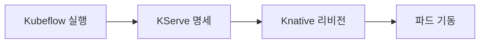

문제는 이 중 한 단계라도 멈추면(pending, 다음으로 못 넘어가고 대기) **어느 단계에서 막혔는지 보여 주는 화면이 없었다**는 점입니다. 그래서 팀원조차 "서빙 파이프라인이 문제" 라고 뭉뚱그려 말하게 됐습니다. 실제 원인은 단계마다 제각각인데도 그랬습니다.

| 실제 원인 | 어느 단계에서 나는가 |
| --- | --- |
| 리소스 부족 (GPU·CPU·메모리를 못 잡음) | 주로 실행 단계와 파드 단계 |
| 이미지를 못 받음 | 파드 단계 |
| 명세 검증 실패 | 서빙 리소스 단계 |
| 레플리카가 정원보다 적게 뜸 | 리비전 단계 |

### 2.2 Before: 운영자가 도구 두 개를 테넌트마다 오갔습니다

장애가 나면 운영자는 아래 순서를 밟았습니다.

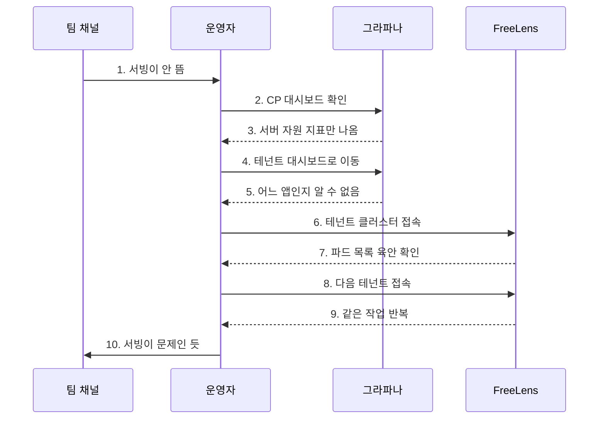

이 흐름의 구체적인 걸림돌이 세 가지였습니다 (1998 배경 절).

| 항목 | 무엇이 문제였나 |
| --- | --- |
| 원인 파악 | 그라파나와 FreeLens 를 테넌트마다 오가며 손으로 확인해야 했습니다 |
| 대상 특정 | 그라파나는 서버 자원 지표만 보여 주기 때문에 어느 테넌트의 어느 파이프라인이 문제인지 알 수 없었습니다 |
| 대시보드 위치 | 그라파나가 CP 에 1개, 테넌트(ST)마다 1개씩 흩어져 있고 한데 모아 보는 화면이 없었습니다 |

즉 지표는 있는데 **"어느 것"** 을 특정할 수 없었고, 파드는 볼 수 있는데 **테넌트 수만큼 반복**해야 했습니다. 두 도구 어느 쪽도 "파이프라인 하나" 라는 단위로 사실을 모아 주지 않았습니다.

### 2.3 After: 한 화면에서 끝냅니다

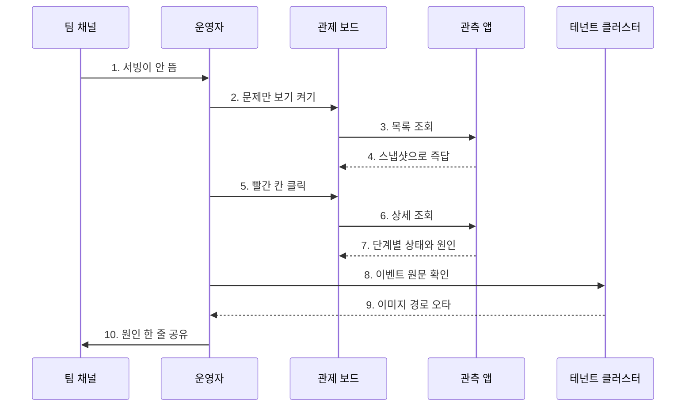

기획 단계에서 정리한 목표 사용 장면은 다음과 같습니다 (1998).

> 팀원이 "테넌트 X 의 서빙이 안 뜨는 것 같다" 고 알립니다. 운영자는 어드민의 상태 화면을 열고 "문제만 보기" 를 켭니다. 테넌트 X 의 파이프라인이 `실패 (파드가 이미지를 못 받음)` 으로 보입니다. 그 줄을 누르면 단계별 진행 화면이 뜨는데, 파이프라인 실행과 InferenceService 는 정상, 리비전은 진행 중, 파드는 실패로 표시됩니다. 파드 항목을 눌러 쿠버네티스 이벤트에서 이미지 경로 오타를 확인하고, 원인 한 줄과 함께 팀에 공유합니다. **그라파나도 FreeLens 도 열지 않았습니다.**

### 2.4 왜 직접 만들었나

상용 머신러닝 플랫폼(SageMaker, Vertex, Databricks)도, 오픈소스 기본 화면(KServe 웹앱)도 여러 리소스에 흩어진 이 단계들을 **하나의 화면으로 모아 주지 않습니다** (1998). 우리 운영 상황에 맞는 화면은 직접 만들기로 했습니다.

동시에 새로 만들 것이 많지 않다는 점도 확인했습니다. 상태 확인에 필요한 데이터(각 단계 상태, 이벤트, 로그)는 이미 CP 와 ST 양쪽에 쌓이고 있었고, 테넌트별 ST 를 조회하는 통로도 어드민에 이미 있었습니다. 그래서 이 작업은 데이터를 새로 모으거나 통로를 새로 뚫는 일이 아니라, **흩어진 데이터를 파이프라인 하나 단위로 모으는 일**로 정의했습니다.

### 2.5 요구사항 요약

기능 요구사항 16개(FR-1 ~ FR-16)와 품질 요구사항 6개(NFR-1 ~ NFR-6)를 정의했습니다. 그중 설계에 결정적이었던 항목만 옮깁니다 (1998).

| ID | 요구사항 | 설계에 미친 영향 |
| --- | --- | --- |
| FR-1 | 모든 테넌트의 파이프라인을 한 화면에. 파이프라인 1개 = 색칠된 칸 1개, 테넌트별 그룹 박스 | 관제 보드 형태를 확정했습니다 |
| FR-3 | CP 저장 상태와 실제 클러스터 상태가 다르면 "안 맞음" 표시 | CP 조회와 클러스터 감시를 둘 다 해야 하는 이유가 됐습니다 |
| FR-6 | 파이프라인 전체 상태는 단계 중 가장 나쁜 것을 따름. 단, 각 단계는 자기 정보로만 판단 | 합성 로직의 핵심 규칙입니다 |
| FR-12 | 수동 새로고침 기본, 자동 새로고침 토글. 목록 60초, 상세 15초 | 조회 부하 설계의 기준입니다 |
| FR-13 | 특정 테넌트 조회 실패 시 그 테넌트만 "확인 불가", 나머지는 정상 표시 | 부분 실패 격리 원칙이 됐습니다 |
| FR-16 | 상태가 바뀔 때마다 변화를 기록하고 상세에서 최근 이력 확인 (07-13 추가) | 상태 이력 테이블이 생겼습니다 |
| NFR-2 | 화면을 열 때마다 조회하지 않고 상시 감시로 미리 들고 있다가 즉답. 전체 재조회 주기 10분 이상 | 인메모리 스냅샷 구조의 근거입니다 |
| NFR-3 | 테넌트 한 곳이 응답하지 않아도 화면 전체가 멈추지 않음. 테넌트당 대기 최대 5초 | 부분 실패 격리를 품질 기준으로 못박았습니다 |
| NFR-4 | 목록 열기는 테넌트 십여 개 기준 상위 95% 가 5초 안에 | 조회 시점 원격 호출 금지의 근거입니다 |
| NFR-6 | 판정이 바뀔 때의 요약만 저장하고 원본 관측 데이터는 저장하지 않음 | 이력 테이블 스키마를 요약 한 줄로 제한했습니다 |

### 2.6 판정 모듈을 CP 에 둘 것인가 ST 에 둘 것인가

팀장님이 "고객 정보에 접근하지 않으려는 관점에서는 ST 에 두고 싶다" 는 의견을 주셨습니다. 이 결정을 위해 두 안을 비교했습니다 (1998 댓글 2026-07-13).

| 차원 | A. CP 총괄 | B. ST 에이전트 |
| --- | --- | --- |
| 격리 설명 | 원본 데이터가 CP 를 지나갑니다. 읽기 전용 + 원본 무저장 + 기존 배포 권한의 부분집합으로 방어합니다 | 요약만 밖으로 나갑니다 |
| 배포·운영 | 앱 1개입니다. 규칙을 고치면 1회 배포로 끝납니다 | 전 테넌트 재배포에 더해 기존 테넌트 소급 설치가 필요합니다 |
| 판정 일관성 | 규칙 1벌, 버전 1개입니다 | 배포가 도는 동안 테넌트마다 규칙 버전이 달라집니다 |
| 불일치 대조 | 같은 앱 안에서 끝납니다 | CP 에 남습니다. 판정 로직이 두 곳으로 갈라집니다 |
| 장애 모드 | CP 앱 1개가 단일점입니다. 죽어도 관측만 죽습니다 | 에이전트가 테넌트마다 죽습니다 |
| 고객 비용 | 없습니다 | 테넌트당 파드 1개가 늘어 원가와 미터링에 영향을 줍니다 |

**CP 총괄(A)로 결정한 근거 세 가지**입니다.

1. **새 권한을 뚫는 일이 아닙니다.** CP 는 이미 서빙 매니페스트를 배포하면서 같은 접속 설정(kubeconfig)을 매일 쓰고 있습니다. 마스터키가 이미 관리사무소 금고에 있고, 관측은 그 열쇠로 들어가서 계기판만 읽고 나오는 것입니다.
2. **격리 원칙과 부딪히지 않습니다.** 평면 격리가 막는 것은 대량 고객 실데이터셋입니다. 상태 요약과 원인 코드는 CP 데이터베이스의 파이프라인 상태 컬럼과 같은 급의 운영 메타데이터이며, 개인정보와 고객 실데이터는 이 경로에 아예 없습니다.
3. **ST 에 두면 판정이 오히려 쪼개집니다.** 불일치 대조(FR-3)는 CP 데이터베이스의 등록 상태를 알아야 하므로 어차피 CP 에 남습니다.

이와 함께 **CP 관측 앱이 읽는 것과 읽지 않는 것**을 명시적으로 선을 그었습니다.

| 대상 | CP 관측 앱이 읽나 | 성격 |
| --- | --- | --- |
| 사용자 정의 자원의 conditions | 읽습니다 | 인프라 메타데이터 |
| 파드 phase, 재시작 횟수 | 읽습니다 | 인프라 메타데이터 |
| 쿠버네티스 이벤트 | 읽습니다 | 고객이 지은 모델 이름이 섞일 수 있는 유일한 회색지대 |
| 파드 로그 | **읽지 않습니다** | 고객 데이터 조각이 찍힐 수 있어 CP 앱은 나르지 않습니다 |
| 고객 업로드 데이터, 추론 결과 | **읽지 않습니다** | 애초에 쿠버네티스 API 로 나오지 않습니다 |

로그 없이 판정이 되는 이유가 명확합니다. 기동 실패의 대부분(이미지 받기 실패, 스케줄 실패, 설정 오류)은 **파드가 시작도 못 해서 로그 자체가 없습니다.** 대신 쿠버네티스가 정형 신호(이벤트 reason, conditions)를 남기고 기계 판정은 이것만 씁니다. 로그가 필요한 경우는 앱이 떴다가 죽는 상황의 "왜" 뿐이며, 그것은 운영자가 화면에서 내려가 직접 봅니다.

---

## 3. 전체 아키텍처

### 3.1 4계층 구조

팀장님이 "트레이닝 파이프라인을 예로 들면 테넌트 → 트레이닝 파이프라인 → 트레이닝 잡 이렇게 계층을 추상화해서, 다른 파이프라인도 이 계층으로 나타낼 수 있는지 봐야 한다" 는 방향을 주셨습니다. 이를 받아 **4계층으로 일반화**했고, 종류마다 깊이만 다르고 전부 이 계층으로 수렴함을 확인했습니다 (1998 반영 결과 07-13).

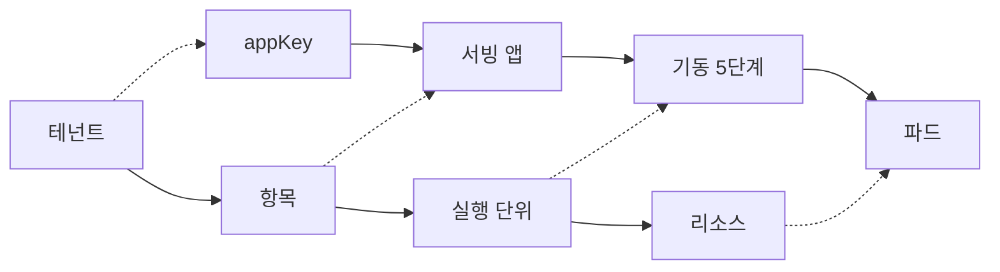

계층마다 무엇이 들어가는지는 아래와 같습니다.

| 계층 | 무엇이 오나 | 예 |
| --- | --- | --- |
| 1. 테넌트 | 고객 프로젝트 단위입니다 | appKey 로 식별합니다 |
| 2. 항목 | 서빙 앱, 데이터 소스, 데이터 파이프라인, 학습 파이프라인이 옵니다 | 종류(kind)가 달라도 같은 자리입니다 |
| 3. 실행 단위 | 기동 단계, 실행 회차, 학습 잡이 옵니다 | 서빙은 5단계 고정입니다 |
| 4. 리소스 | 실제 쿠버네티스 오브젝트가 옵니다 | 파드, 리비전, 학습 잡 |

이 계층은 화면 구조일 뿐 아니라 **조회 응답 구조 그대로**입니다 (2099). 종류가 늘어나도 API 를 다시 설계하지 않기 위해서입니다.

### 3.2 서빙 앱의 기동 5단계

항목이 서빙 앱일 때 실행 단위 계층에 오는 5단계입니다 (1998 FR-4).

| 단계 | 이름 | 조회 대상 | 상태 신호 |
| --- | --- | --- | --- |
| ① | CP 등록·설정 | CP 데이터베이스의 서빙 파이프라인 테이블 | 상태값(INITIALIZING / TRAINING / DEPLOYING / ACTIVATING / ACTIVE / DELETING / DELETED / FAILED), 마지막 학습 시각 |
| ② | 파이프라인 실행 | Argo Workflow, 학습 잡, 스케줄 자원 | 실행 phase, 하위 학습 잡 상태 |
| ③ | 서빙 리소스 | KServe InferenceService, InferenceGraph | conditions (Ready 등) |
| ④ | 리비전·확장 | Knative Revision, Configuration | conditions, 레플리카 수 |
| ⑤ | 파드 | 쿠버네티스 Pod 와 Events | phase, 컨테이너 상태, 이벤트 |

③ ~ ⑤ 는 리소스 하나가 아니라 **집합**이라는 점이 중요합니다. 모델별로 InferenceService 가 여러 개이고, 모델마다 예측기와 변환기 파드 세트가 붙습니다.

### 3.3 수집에서 노출까지의 전체 흐름

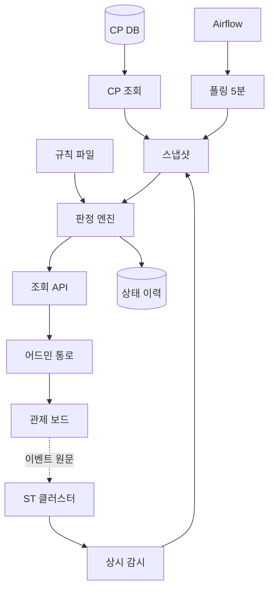

이 그림에서 놓치면 안 되는 규칙이 세 개입니다.

1. **조회는 언제나 스냅샷에서 즉답합니다.** 화면 요청 시점에 테넌트 클러스터나 Airflow 를 호출하지 않습니다. 그렇지 않으면 운영자가 화면을 열 때마다 모든 테넌트에 호출이 나가고, 한 곳이 느리면 화면 전체가 기다리며, 한 곳이 죽어 있으면 화면이 뜨지 않습니다 (2160).
2. **판정 로직의 구현처는 관측 앱 하나뿐입니다.** 어드민 화면은 받아서 그리기만 하고 상태를 계산하지 않습니다 (2101).
3. **이벤트 원문과 파드 로그 드릴다운은 관측 앱을 거치지 않습니다.** 어드민이 기존 쿠버네티스 직접 조회 경로로 갑니다. 원본이 CP 앱을 지나가지 않게 하려는 설계입니다 (2101).

### 3.4 모듈 구성

관측 앱은 기존 저장소에 Gradle 모듈로 신설했습니다. 선례는 이미 돌고 있는 `aias-resource-saga-monitor` 와 `aias-resource-metering-batch` 입니다 (2095).

| 항목 | 내용 |
| --- | --- |
| 모듈명 | `aias-resource-monitoring` |
| 초기 의존 | shared-core, resource-domain, application-core, infrastructure-mysql, kube-client, common-skm |
| 기동 | Spring Boot main, 프로파일별 yml, actuator 헬스체크 |
| 규칙 파일 | `monitoring-rules.yml` 로드 설정 자리를 뼈대 단계에서 미리 마련 |
| 의존 방향 | 헥사고날 원칙 준수 (domain → application → infrastructure) |

**프로세스를 분리한 이유**가 명확합니다. 조회 부하가 기존 API 서버의 제어 경로(사가, 등록·수정·삭제)를 방해하지 않게 하기 위해서입니다 (2095).

---

## 4. 수집 계층 상세

수집은 세 갈래이고, 각각 방식이 다릅니다. **수집 수단은 축마다 달라도 되고, 지켜야 할 것은 조회가 스냅샷으로 즉답한다는 쪽**이라는 원칙을 세웠습니다 (2160).

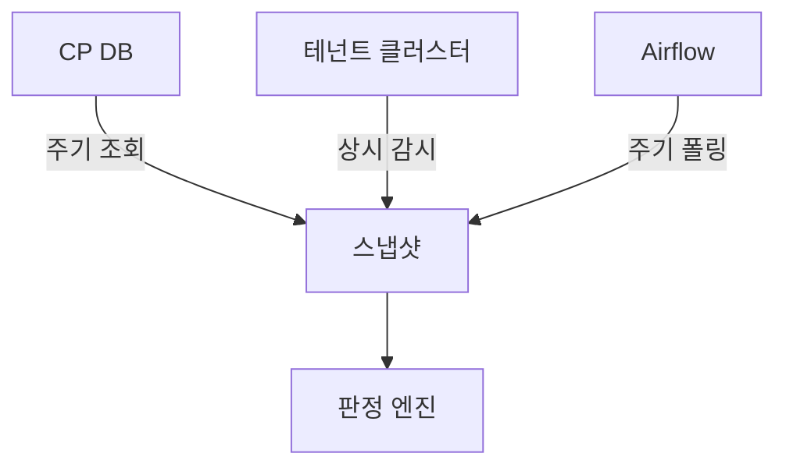

### 4.1 갈래 1: CP 데이터베이스 조회 (Task 02)

**무엇을 읽나**

| 대상 | 용도 |
| --- | --- |
| 테넌트 목록과 접속 설정 좌표 | 감시 대상을 열거하고 클러스터에 붙습니다 |
| appKey ↔ 네임스페이스 매핑 | 클러스터 안에서 어느 네임스페이스를 볼지 정합니다 |
| 서빙 파이프라인 상태와 갱신 시각 | 단계 ① 의 입력이자 불일치 판정의 CP 쪽 재료입니다 |

**왜 매핑이 별도 조각인가**

실측에서 쿠버네티스 네임스페이스 이름이 appKey 와 다른 키로 만들어져 있음을 확인했습니다 (2096). 그래서 appKey 를 그대로 네임스페이스로 쓰면 아무것도 못 봅니다. 매핑을 CP 테넌트 테이블에서 가져오는 것이 이 태스크의 핵심 조각이었습니다.

이후 Task 05 진행 중에 이 근거를 다시 검증했습니다. 처음 근거로 인용했던 식별자는 테넌트 테이블이 아니라 접속 설정 파일명에서 온 값이었고, **알파 18개 테넌트를 전수 확인한 결과 저장된 네임스페이스가 파생 규칙과 어긋나는 사례는 없었습니다** (2099). 다만 저장값을 진실로 쓰는 동작 자체는 그대로 두었습니다. 규칙으로 유도하는 것보다 저장값을 읽는 쪽이 안전하기 때문입니다.

**소스 어댑터 인터페이스**

수집기의 공통 인터페이스를 정의해, 쿠버네티스 감시 구현체와 데이터베이스 조회 구현체가 나란히 앉는 구조로 만들었습니다 (2096). 나중에 사가 같은 다른 소스를 받을 자리를 미리 열어 둔 것입니다.

### 4.2 갈래 2: 테넌트 클러스터 상시 감시 (Task 03)

**왜 폴링이 아니라 상시 감시인가**

두 가지 이유가 있습니다.

첫째, **폴링은 사진 찍기라서 사진과 사진 사이가 비어 있습니다.** 그 사이에 떴다 죽은 파드는 보이지 않고, 간격을 줄여도 0초가 되지는 않습니다. 상시 감시는 변화 사건 자체가 밀려오므로 사이에 새는 것이 없습니다 (1998).

둘째, 그리고 결정적으로, **완료된 Workflow 는 24시간 뒤에 지워지는 것을 실측으로 확인했습니다** (보존 담당 구성 요소의 TTL 86400초, 2097). 화면 열 때마다 조회하는 방식이면 야간 재학습 기록을 놓칩니다. 변화가 생기는 순간 받아 두는 상시 감시가 필수였습니다.

**받는 것 두 종류**

| 종류 | 내용 |
| --- | --- |
| 리소스 변경 통지 | 감시를 걸어 둔 리소스가 생기거나(ADDED) 바뀌거나(MODIFIED) 지워질 때(DELETED) 최신 상태가 통째로 옵니다 |
| 쿠버네티스 이벤트 오브젝트 | 클러스터가 남기는 사건 기록입니다. reason 코드가 달려 있어 원인 판정 규칙의 입력이 됩니다 |

**한 파이프라인이 밤사이 겪는 흐름을 CP 가 받는 순서** (1998 예시)

| 시각 | 받는 것 | 의미 |
| --- | --- | --- |
| 23:00 | ADDED Workflow | 재학습 시작 |
| 23:00 | ADDED Pod | 학습 워커 생성 |
| 23:01 | Event FailedScheduling (GPU 부족) | 원인 코드 RESOURCE |
| 23:11 | MODIFIED Workflow phase=Failed | 이력에 "실패 (GPU 부족)" 기록 |
| 02:00 | ADDED Workflow | 다음 주기 재시도 |
| 02:03 | Event Pulled | 이미지 받기 완료 |
| 02:14 | MODIFIED Workflow phase=Succeeded | 학습 성공 |
| 02:15 | MODIFIED InferenceService Ready=True | 이력에 "정상" 기록 |

**감시 대상**

Argo Workflow, ScheduledWorkflow, InferenceService(와 InferenceGraph), Knative Revision, Pod(와 Events)로 시작했습니다 (2097). 이후 학습 잡(PyTorchJob)과 Volcano PodGroup 이 추가됐고 (2100), 데이터소스 축이 들어오며 최종적으로 **12종(그중 선택 감시 5종)** 이 됐습니다 (2169, 2170).

선택 감시란 클러스터에 해당 정의가 없으면 그 종류만 건너뛰는 방식입니다. 두 CRD 가 없을 수 있으므로 선택 감시로 둬서, **없는 클러스터에서 테넌트 감시 전체가 실패하지 않게** 했습니다 (2100).

**동적으로 생기는 파드를 어떻게 찾나**

학습이 돌면 지시서와 일꾼이 계층으로 생깁니다.

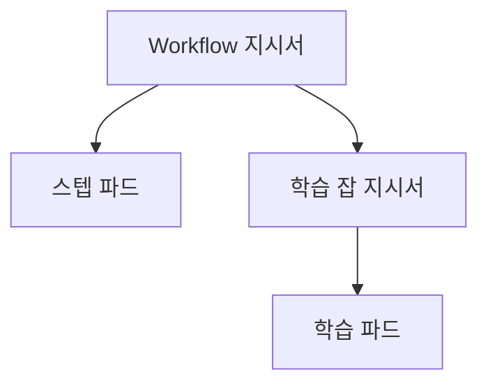

- **일꾼 찾기**: 파드 이름은 매번 무작위지만 만들어질 때 라벨이 자동으로 붙습니다. 이름 대신 라벨로 조회하니 몇 개가 언제 생기든 다 잡힙니다.
- **일꾼이 사라진 뒤**: 지시서의 상태에 결과가 남습니다. 시험지는 버려져도 성적표는 남는 구조입니다.

**연결 관리와 부분 실패 격리**

| 항목 | 내용 |
| --- | --- |
| 재연결 | 연결이 끊기면 그 사이 사건을 놓칠 수 있어, 재연결 때 전체를 다시 조회해 기준점을 잡습니다 |
| 전체 재조회 주기 | 설정값이며 10분보다 짧으면 기동을 거부합니다 |
| 실패 격리 | 연결 유실이나 재동기화 실패 테넌트는 `collected=false` 로 두고 나머지 테넌트는 정상 표시합니다 |

**Workflow 를 파이프라인에 잇기 (조인)**

라벨(스케줄 이름, 실행 ID)과 이름 안의 파이프라인 식별자 조각으로 잇습니다 (2097). 이 조인이 나중에 실전에서 크게 문제를 일으켰고, Task 06 에서 교정했습니다.

> **조인이 끊겨 있었는데 화면은 전부 정상으로 보였습니다.** 실행 단계가 모든 파이프라인에서 "run 부재" 로 떨어져 야간 재학습 실패를 이력에 남기지 못하고 있었습니다. 원인은 Kubeflow 가 잡 이름을 25자로 잘라 만드는 탓에 파이프라인 식별자 조각이 이름 맨 앞이 아니라 appKey 뒤에 있었던 것입니다 (2100).

이 사건은 이후 메모리 최적화를 미루는 판단의 근거가 됐습니다. 잘못 좁히면 **빨간불이 잘못 뜨는 것이 아니라 아무것도 안 뜨는 쪽**으로 조용히 사라진다는 사실을 이미 한 번 겪었기 때문입니다 (2170).

같은 교정에서 하나 더 발견했습니다. **파이프라인 1개에 모델별 학습 스케줄이 3개 붙어 있어서, 전체에서 최신 1건만 보면 형제 스케줄의 실패가 가려졌습니다.** 스케줄별 최신 실행 중 최악으로 판정하도록 고쳤습니다 (2100).

### 4.3 갈래 3: Airflow 폴링 (Task 12, v2)

**왜 방식이 다른가**

v1 은 상태를 전부 쿠버네티스 자원에서 읽었습니다. 자원이 바뀌면 클러스터가 알려 주므로 1초 안에 압니다. 그런데 데이터 파이프라인의 실제 실행은 테넌트 클러스터의 Airflow 가 담당하고, **Airflow 는 알려 주지 않아서 우리가 주기적으로 물어봐야 합니다.** 그래서 **물어보는 주기가 곧 알아차리는 데 걸리는 시간**이 됩니다 (2160).

이 사실을 비기능 요구사항으로 문서에 남겼고, 화면에도 관측 시각을 함께 실어 값이 얼마나 낡았는지 드러내게 했습니다.

**따라오는 것 세 가지**

| 무엇 | 왜 중요한가 |
| --- | --- |
| 가용성이 하나 늘어납니다 | 프록시가 죽으면 파이프라인 실행 단계가 통째로 판정 보류가 됩니다. 다른 축은 살지만 그 단계만 덮입니다 |
| 인증 방식이 축마다 다릅니다 | 쿠버네티스는 온보딩이 저장해 둔 접속 설정을 되읽고, Airflow 는 테넌트별 관리자 비밀번호로 토큰을 받습니다 |
| 모듈을 들이면 기동이 깨질 수 있습니다 | 과거에 쿠버네티스 클라이언트 모듈을 통째로 의존해 빈 263개가 밀려들며 앱이 기동하지 못한 적이 있습니다 |

**모듈을 새로 만들지 않았습니다**

이미 있는 Airflow 인프라 모듈을 그대로 의존했습니다. 호출 경로 상수, 어댑터, 응답 타입이 다 있었기 때문입니다. 의존 무게를 비교해 안전을 확인했습니다 (2160).

| 모듈 | 의존하는 것 |
| --- | --- |
| Airflow 모듈 | resource-domain, application-core, common-proxy-gateway, shared-core, spring-web |
| saga-monitor (이미 돌고 있는 선례) | shared-core, resource-domain, application-core, infrastructure-kafka, infrastructure-mysql, common-skm |

Airflow 모듈의 의존은 이미 잘 돌고 있는 앱이 쓰는 집합의 부분집합에 프록시 게이트웨이 하나가 더해진 형태입니다. 무거운 최상위 애플리케이션 모듈은 끌고 오지 않았습니다.

**폴링 설계**

| 항목 | 값과 근거 |
| --- | --- |
| 주기 | 기본 5분(PT5M). 배치 성격이라 이 정도가 적당합니다. **1분 미만은 기동 시 거부**합니다 |
| 평시 호출 수 | 파이프라인당 2회. 대기 실행 확인까지 포함하면 2 ~ 3회입니다 (알파 활성 파이프라인 13개) |
| 추가 호출 조건 | 마지막 실행이 실패했거나 멈춘 경우에만 어느 노드에서 깨졌는지 1회 더 조회합니다 |
| 토큰 | 테넌트별로 메모리에 캐시하고, 인증이 거부되면(401/403) 무효화한 뒤 **한 번만** 재발급 재시도합니다 |
| 상태 4종 | 대기 · 실행 중 · 성공 · 실패. 화면 상태 대응표를 규칙 파일에 두고 전수를 강제합니다 |

**실패 격리를 두 층으로 나눴습니다**

테넌트 수준(토큰 발급 실패)과 파이프라인 수준(개별 호출 실패)을 구분하고, CP 조회가 실패했을 때는 이전 스냅샷을 지우지 않습니다. **DAG 부재(404)는 관측 실패가 아니라 확정 관측으로 남깁니다** (2160). 못 본 것과 없는 것은 다르기 때문입니다.

**세 값(three-valued) 계약**

DAG 일시정지 여부는 참·거짓 두 값이 아니라 세 값입니다. `null`(관측 없음)을 `false` 로 뭉개면 **프록시 장애가 "안 멈춤" 으로 읽힙니다** (2160). 서빙 축의 불일치 필드에도 같은 원칙을 적용했습니다.

**실행 시작 전(queued) 사각지대**

리뷰에서 지적을 받아 고쳤습니다. 마지막 실행 조회는 시작 시각 정렬이라 **아직 시작하지 않은 실행이 아예 잡히지 않았습니다.** 규칙에는 대기 상태 대응이 있는데 실제로는 볼 수 없어, 대기에 묶인 실행이 이전 성공이나 이력 없음으로 덮여 초록으로 오판될 수 있었습니다. 대기 실행 조회를 공유 출력 포트에 추가하고, 실행 중이 아닐 때만 확인하도록 해서 호출을 아꼈습니다 (2160).

**실패 노드에 이름 붙이기**

Airflow 가 알려 주는 것은 노드 ID(숫자)뿐이라, 그대로 내려가면 운영자가 무슨 단계인지 알 수 없었습니다. "노드 2097 에서 깨짐" 만 보고는 그게 소스 읽기인지 조인인지 최종 데이터셋 만들기인지 알 방법이 없어 매번 데이터베이스를 직접 뒤져야 했습니다. **실패했을 때만** CP 데이터베이스를 한 번 더 조회해 이름을 붙였고, 이름 조회가 실패해도 이미 확보한 노드 ID 관측은 버리지 않습니다 (2160).

---

## 5. 판정 엔진 상세

### 5.1 설계 원칙: 엔진은 순수 로직, 기준은 규칙 파일

판정 기준(상태 우선순위, CP 대 실측 대응표, 신호 대 원인 코드, 일부 이상 신호 3종, 정체 10분)을 **전부 규칙 파일 값으로 두고, 엔진은 규칙을 입력받는 순수 로직으로 유지**했습니다 (2098). 팀 결정으로 기준이 바뀌면 값만 고칩니다.

규칙 파일은 `monitoring-rules.yml` 이고, `serving-pipeline:` 이름공간 아래에 규칙을 배치했습니다. 나중에 다른 종류가 추가될 자리를 처음부터 열어 둔 구조입니다.

### 5.2 상태 7종과 우선순위

| 상태 | 뜻 |
| --- | --- |
| 정상 | 문제 없이 떠 있습니다 |
| 진행 중 | 아직 뜨는 중입니다 |
| 일부 이상 | 일부만 살아 있거나 일부만 실패했습니다 |
| 실패 | 떴어야 하는데 실패했습니다 |
| 없음 | 있어야 할 리소스가 없습니다 |
| 꺼짐 | 고객이 의도적으로 비활성화한 상태입니다 |
| 확인 불가 | 수집이 실패해 판정을 보류합니다 |

**나쁜 순서** (규칙 파일 값): 실패 > 일부 이상 > 확인 불가 > 없음 > 진행 중 > 꺼짐 > 정상

이 순서는 BE 가 순번(severityRank)으로 계산해 응답에 실어 보냅니다. 화면은 이 값으로 정렬만 하고 상태를 다시 계산하지 않습니다 (2099, 2101).

**"일부 이상" 판정 신호 3종** (1998)

1. 파드가 정원보다 적게 떠서 일부만 살아 있음
2. 모델별 InferenceService 여러 개 중 일부만 실패
3. "진행 중" 상태로 10분 넘게 정체 (10분은 Argo CD 기본값을 준용했습니다)

### 5.3 원인 5종과 책임 라벨

| 원인 분류값 | 뜻 | 누구 책임 |
| --- | --- | --- |
| USER_CONFIG | 설정 오류 | 고객이 고칠 수 있음 |
| RESOURCE | 리소스 부족·할당량 초과 | 플랫폼 (2026-07-10 확정) |
| IMAGE | 이미지를 못 받음 | 플랫폼 (2026-07-10 확정) |
| PLATFORM | 우리 플랫폼 내부 문제 | 플랫폼 |
| UNKNOWN | 분류 안 됨 | 플랫폼 (안전하게) |

**IMAGE 와 RESOURCE 를 플랫폼 책임으로 확정한 근거**입니다. 이미지를 만들고 올리고 배포하는 일과 GPU·노드 용량 확보는 전부 플랫폼이 합니다. 고객은 이미지 저장소에 접근하지 않고 CSV 같은 데이터만 올립니다. 나중에 고객이 직접 이미지를 지정하는 기능이 생기면 그 경우만 규칙 파일 값을 고쳐 재분류합니다 (1998).

이 라벨은 이번 어드민에서는 표시만 하지만, **2차 고객 화면에서 무엇을 보여줄지 거르는 기준**이 됩니다. 플랫폼 문제로 분류된 건은 고객에게 상세를 숨기고 "일시적 오류입니다, 문의 바랍니다" 정도로만 안내할 예정입니다 (FR-8).

**신호에서 원인으로 가는 매핑** (일부)

| 신호 | 원인 분류값 |
| --- | --- |
| 파드 `ErrImagePull` / `ImagePullBackOff` | IMAGE |
| 파드 Pending + `FailedScheduling` (cpu·mem·gpu 부족) | RESOURCE |
| 학습 잡 파드 `FailedScheduling`, PodGroup `Unschedulable` | RESOURCE (단계 ② 이유로 표시) |
| InferenceService·Revision 명세 검증 실패, CP 설정값 오류 | USER_CONFIG |
| KServe·Knative 컨트롤러 오류, CP 사가 실패, 프록시 장애 | PLATFORM |
| 매핑되지 않은 신호 | UNKNOWN |

### 5.4 composer 엔진: 최악 자식을 물려받는 합성

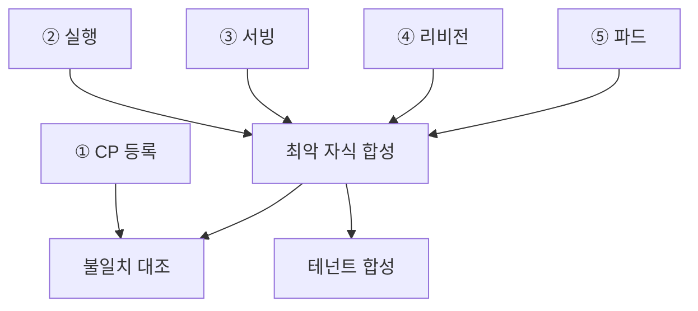

합성 규칙을 정확히 옮기면 이렇습니다 (2098).

1. **각 단계는 자기 신호로만 판단합니다.** 다른 단계의 상태를 물려받지 않습니다. 이래야 "어느 단계에서 막혔는지" 라는 애초의 목적이 성립합니다.
2. **엔티티(서빙 앱) 대표 상태는 실측 단계 ② ~ ⑤ 중 가장 나쁜 것**입니다. 이때 어느 단계가 원인이었는지(causedBy)를 함께 답니다.
3. **단계 ① CP 등록은 합성에 넣지 않습니다.** CP 에 저장된 값과 실측을 대조하는 불일치 판정에만 씁니다. 넣으면 CP 상태가 실측을 덮어 버립니다.
4. **테넌트 상태는 그 테넌트의 파이프라인들 중 최악**으로 합칩니다.

**학습 파이프라인이 계층에 들어온 뒤에도 이 계약을 지켰습니다.** 학습 노드를 엔티티 아래에 추가하면서도 단계 5칸 계약은 그대로 두고, 엔티티 합성에 학습을 다시 넣지 않았습니다. 중복 계산을 막기 위해서입니다 (2100).

### 5.5 왜 ③ ④ ⑤ 를 따로 판정하는가

서빙 리소스는 InferenceService 가 Revision 을, Revision 이 Pod 를 만드는 계층입니다. 셋 다 결국 파드로 귀결되는데도 따로 판정하는 이유는 **각 층이 자기만 아는 실패**를 갖기 때문입니다 (2098).

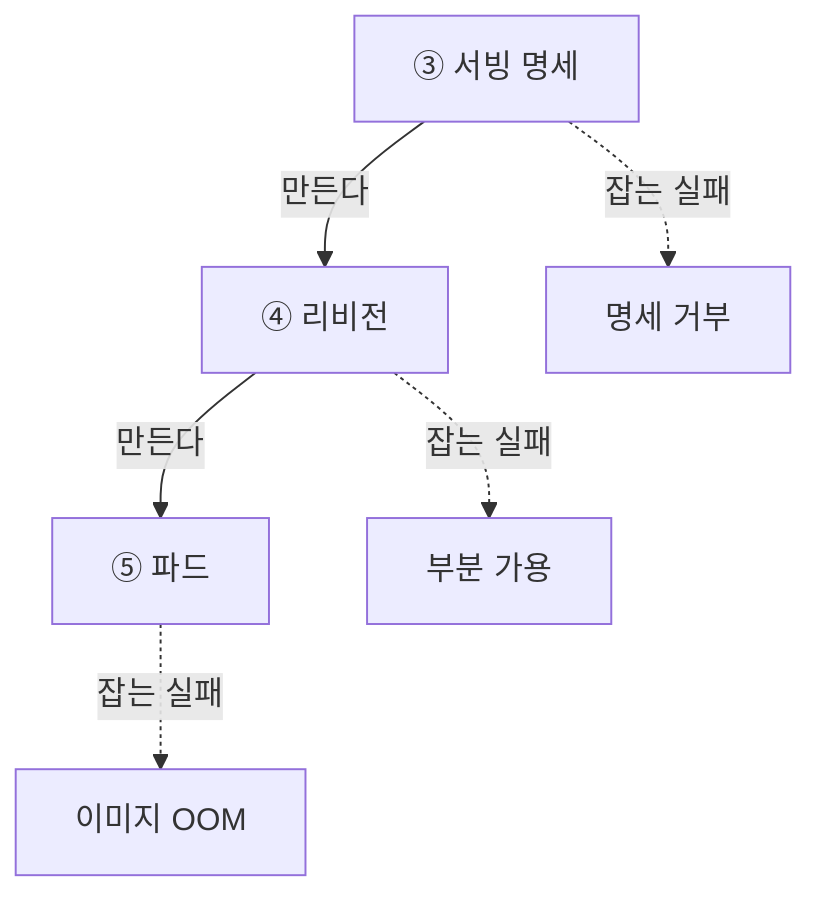

| 층 | 이 층만 잡는 실패 | 파드만 봤다면 |
| --- | --- | --- |
| ③ 서빙 리소스 | 명세 거부로 파드 생성 자체가 안 됨 | 파드가 없어서 "없음" 으로 오판합니다 |
| ④ 리비전 | 레플리카 부분 가용 (3개 중 1개만 뜸) | 뜬 파드는 정상이라 문제가 안 보입니다 |
| ⑤ 파드 | 이미지·크래시·메모리 초과 | 이건 파드가 맞습니다 |

층을 나눈 대가로, 이 파드가 어느 리비전과 어느 InferenceService 에 속하는지 잇는 조인이 필요해졌습니다. 이 조인은 별도 컴포넌트가 이름과 라벨로 처리합니다.

### 5.6 CP 대 실측 불일치 판정 (FR-3)

CP 에 저장된 상태와 실제 클러스터 상태가 어긋난다는 사실 자체가 문제의 단서입니다. 대응표를 규칙 파일에 뒀습니다 (1998).

| CP 상태 | 기대되는 실측 종합 상태 | 안 맞음의 예 |
| --- | --- | --- |
| INITIALIZING / TRAINING | 없음 또는 진행 중 | 실패 |
| DEPLOYING / ACTIVATING | 진행 중 | 실패, 일부 이상, 장시간 정체 |
| ACTIVE | 정상 | 실패, 일부 이상, 없음, 확인 불가 |
| DELETING | 진행 중 또는 없음 | 실패 |
| DELETED | 없음 | 리소스 잔존 |
| FAILED | 제한 없음 | 실측이 정상이면 역방향 불일치 |

수집이 실패했을 때는 **판정을 보류**합니다. 불일치 필드는 참·거짓 두 값이 아니라 `null`(판정 보류)을 포함한 세 값이고, 이 계약을 직렬화까지 보존합니다 (2099).

불일치의 유력한 원인 하나를 미리 짚어 뒀습니다. 실행 종료를 CP 에 알리는 콜백 파드가 실패하면 CP 상태 동기화가 누락되어 "CP 와 안 맞음" 이 됩니다 (1998).

### 5.7 알파 실측으로 규칙을 채운 과정

규칙을 코드 밖으로 뺀 설계가 실제로 값을 발휘한 지점입니다. 로컬에서 알파 테넌트에 실제로 붙여 목록·상세 API 를 확인하며 드러난 사실을 반영했습니다 (2099, 2100).

| 발견 | 조치 |
| --- | --- |
| InferenceService·Revision 실패가 규칙에 없어 전부 UNKNOWN 으로 떨어짐 | **실제 실패 신호 9종을 규칙에 추가**했습니다. 전부 PLATFORM 으로 뒀습니다 |
| 종료 코드나 리비전 실패만으로는 고객 설정 오류와 우리 결함을 구분할 수 없음 | 사용자 조치 가능으로 찍으면 원인을 제공하지 않은 고객에게 조치를 안내하게 되므로 보수적으로 분류했습니다 |
| `ProgressDeadlineExceeded` 가 앞에 오면 구체 원인을 덮음 | 이것은 원인이 아니라 증상이므로 첫 일치 규칙 목록의 맨 뒤로 옮겼습니다 |
| 정상인 테넌트의 초록 칸이 문제처럼 읽힘 | 정상 노드에는 원인을 싣지 않습니다. 진행 중은 표기 규범대로 사유를 유지합니다 |
| 실패 문구가 "not ready" 로 끝나 왜 깨졌는지 알 수 없음 | 실패 문구 뒤에 Ready condition 의 사유를 괄호로 덧붙였습니다. 조건 사유는 구조화 필드라 이벤트 원문 복사 금지 규칙에 걸리지 않습니다 |
| 학습 실행 원인이 비어 있음 | 학습 실행 실패 신호 3종(실행 phase, 파드 조건, 컨테이너 종료 사유)을 등재했습니다 |
| 규칙에 없는 신호가 계속 나올 것으로 보임 | 미등재 신호를 로그로 남겨 보강 근거를 축적하되, 중복을 접고 상한까지만 남깁니다 |

여기서 나온 판단 하나가 특히 중요합니다.

> **규칙 목록은 닫힌 집합이 될 수 없습니다.** 컨트롤러마다 사유가 다르고 종료 코드처럼 값이 파라미터화되기 때문입니다. 그래서 매핑을 무한히 늘리는 대신, **못 맞춘 신호도 문구로는 읽히게** 하는 쪽을 택했습니다 (2099).

또 하나, 사유를 고를 때 **Ready 조건을 먼저 봅니다.** 0으로 축소된 Knative Revision 처럼 Ready 는 정상인데 다른 조건만 비정상인 경우를 실패 사유로 오인하지 않기 위해서입니다 (2099).

### 5.8 데이터 파이프라인 축의 실행 판정 (v2)

Task 12 에서 실행 칸을 새로 세우며 정한 규칙입니다 (2160).

| 상황 | 판정 |
| --- | --- |
| 빌드가 완료된 적 없음 | 실행 칸은 빌드 단계 상태를 물려받습니다. 물어볼 DAG 이 없기 때문입니다 |
| 빌드 완료인데 DAG 부재 | 누락(MISSING)입니다. "DAG 이름 = 파이프라인 ID" 전제가 틀린 경우에도 전부 여기로 떨어져 화면에서 곧바로 드러납니다 |
| CP 활성인데 DAG 일시정지 | 저하로 판정합니다 |
| CP 도 꺼져 있고 DAG 일시정지 | 고객이 둔 상태이므로 중지로 접고, 중지 전 실패로 되돌아가 판정하지 않습니다 |
| Airflow 무응답 | 실행 칸만 판정 보류입니다. 빌드 칸과 다른 축은 그대로 판정됩니다 |

실행 칸을 그동안 세우지 않았던 이유도 기록에 남아 있습니다. **관측 없는 빈 칸은 "확인 불가" 이고, 확인 불가가 문제 상태 집합에 들어 있어서 정상인 파이프라인이 전부 문제로 떴기 때문**입니다. 폴링 스냅샷이 생기며 이 문제가 해소됐습니다 (2160).

### 5.9 관측 축 확장: 데이터소스(Task 10)와 파이프라인 빌드(Task 11)

> 이 절은 처음 문서를 쓸 때 빠져 있었습니다. Task 12(데이터 파이프라인 실행, 위 5.8·4.3절)와 같은 시기에 나란히 진행된 Task 10·11이 원래 자료 묶음에 없어서 누락됐다가, 이후 별도로 확인해 추가했습니다.

v2는 감시 축을 서빙 하나에서 데이터소스·데이터 파이프라인(빌드·실행) 셋으로 넓혔습니다. 세 축 모두 "같은 판정 함수에 그 축의 재료만 넣는다"는 같은 원칙을 씁니다.

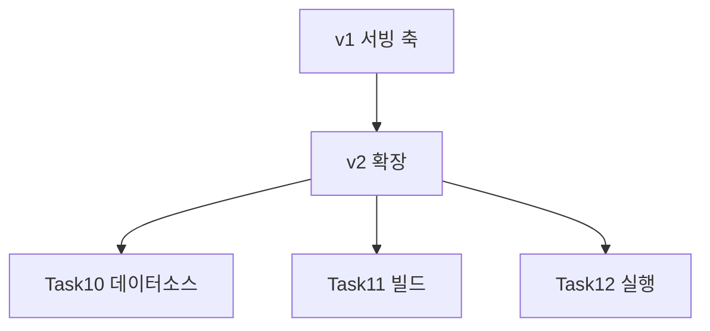

**Task 10 · 데이터소스 관측 + 정체 판정 (#2158)**

데이터소스도 서빙과 마찬가지로 등록만 해두고 실제로 인입이 되는지, 조회까지 가능한지 여러 단계를 거칩니다. 이 단계를 3칸(등록 · 인입 실행 · 조회 가능)으로 나누고, 진행 중인 인입 잡은 스파크 잡 ID로 조인해 붙였습니다.

리뷰에서 발견해 반영한 결정이 하나 있습니다. **사가 보상(작업을 되돌리는 것)이 일어난 데이터소스를 "정상"도 "실패"도 아닌 별도 표시로 다루기로 한 것**입니다. 이미 정상 상태로 자리 잡은(settled) 데이터소스는 화면에 사가 진행 상태가 안 실리기 때문에, 보상이 있었다는 기록 자체가 유일한 단서입니다. 이걸 실패로 뭉개면 "지금은 멀쩡한데 왜 실패로 뜨지" 라는 혼란을 낳고, 정상으로 뭉개면 과거에 한 번 꼬였던 이력이 사라집니다.

- **정량 결과**: 알파 실측 6건, 베타JP 1건의 사가 보상 사례를 이 방식으로 실제 화면에 반영 확인.
- **상태**: PR #1236 발행, 리뷰 1라운드(5건+사소한 지적) 반영 완료.

**Task 11 · 데이터 파이프라인 빌드 관측 (#2159)**

빌드 축에서 가장 큰 함정은 **CP 상태 값 한 칸이 빌드와 실행을 동시에 겸한다는 것**이었습니다. 빌드 사가는 8단계에서 `BUILT` 를 찍고 바로 9단계 `RUNNING`, 11단계 `COMPLETED` 로 넘어가기 때문에, `BUILT` 는 실측으로 0건이 나올 만큼 순간적으로만 존재하는 상태입니다. 그래서 실행 계열 상태(`RUNNING`/`COMPLETED`/`TERMINATED`)를 빌드 단계 판정에서는 "정상"으로 읽도록 만들어야 했습니다. 이 판정을 v1 서빙 판정과 같은 원칙으로 정리했습니다.

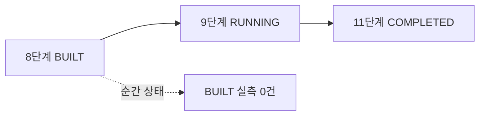

추천 앱은 학습 모델을 3종(기존 사용자용 · 롱테일용 · 콜드 스타터용) 동시에 갖는데, 기존 판정은 이 셋을 한데 묶어 "최악 하나"로만 보여줬습니다. 그래서 어떤 모델이 문제인지 구분이 안 됐습니다. **모델별로 갈라 보이도록 만드는 과정에서 이름 겹침 함정을 하나 발견했습니다.** 두 모델의 쿠버네티스 리소스 이름이 `kserve-esmr-<id>` 와 `kserve-esmr-longtail-<id>` 처럼 한쪽이 다른 쪽의 접두어였고, 이름 앞부분만 보고 묶으면 롱테일 리소스가 조용히 다른 모델 몫으로 잘못 붙었습니다. 그래서 대조는 전체 이름으로만 하고, 파드는 이름이 아니라 소속 라벨(Knative Revision → InferenceService → Argo Workflow 순서로 물려받기)로 판정하도록 고쳤습니다.

같은 작업에서 **은퇴한 서빙 리비전의 오탐도 함께 고쳤습니다.** Knative는 트래픽을 새 버전으로 옮긴 뒤에도 옛 버전을 지우지 않는데, 판정 로직이 관측된 리비전 전부를 최악 기준으로 세다 보니 몇 주 전에 이미 은퇴한 리비전 하나가 정상 서비스 중인 앱을 실패로 만들고 있었습니다. 실측 결과 한 테넌트에 리비전 107개 중 활성 14개·은퇴 93개였고, 판별 기준을 상태값이 아니라 쿠버네티스 라벨(`routingState`)로 바꿔 해결했습니다.

- **정량 결과**: 알파 Playwright E2E **16/16 PASS**. 은퇴 리비전 오탐 수정 후 응답에 실리는 리소스 수가 98개에서 8개로 줄었고, KServe 자체가 실패로 보는 대상과 일치 확인.
- **상태**: PR #1242 발행, 리뷰 1라운드 반영 완료(커밋 11개, MERGEABLE).

**Task 09 · 알파 실검증과 판정 규칙 보강 (#2140, 참고용)**

이 태스크는 본인 커밋이 하나도 없습니다. AC 5개 중 대부분이 위 Task 10·11이나 이미 문서화된 Task 05·06(2099·2100)이 실측 과정에서 자연스럽게 충족시킨 형태였고, 남은 조사(JP 리전 시각 처리)는 "이미 정상 동작 중"이라는 결론만 확인하는 감사성 태스크였습니다. 새로운 구현 성과로 세지 않고 참고로만 남깁니다.

---

## 6. 상태 이력 설계

### 6.1 왜 필요했나

FR-16 이 07-13 에 추가됐습니다. 대표 용례가 명확합니다.

> 밤 11시와 새벽 2시에 도는 야간 재학습이 어떻게 돌았는지 아침에 확인하고 싶습니다.

그런데 앞서 본 대로 **완료된 Workflow 는 24시간 뒤에 지워지고 쿠버네티스 이벤트는 약 한 시간이면 사라집니다** (2097, 2169). 그 순간에 붙잡지 못하면 나중에 캘 수 없습니다.

### 6.2 전량 기록이 아니라 변화 시점만 기록합니다

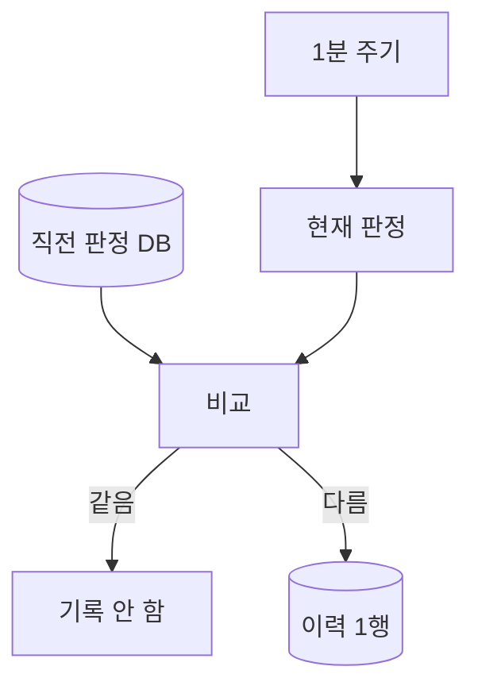

**왜 변화 시점만 남기나**

| 이유 | 설명 |
| --- | --- |
| 원본 저장 금지 원칙 (NFR-6) | 판정 요약 한 줄만 남기고 이벤트 원문과 로그는 저장하지 않습니다. 고객 데이터 평면 격리를 지키기 위해서입니다 |
| 양 | 매 주기 전량 기록이면 파이프라인 수 곱하기 주기만큼 행이 쌓입니다. 변화만 남기면 실제로 무슨 일이 있었는지가 그대로 목록이 됩니다 |
| 읽는 목적 | 운영자가 알고 싶은 것은 "언제 무엇이 바뀌었나" 이지 "매 분 어땠나" 가 아닙니다 |

### 6.3 테이블 설계와 결정들

| 항목 | 내용 |
| --- | --- |
| 테이블 | `monitoring_status_history` |
| 기록 단위 | 판정 변화 시에만 1행 (이전 상태, 새 상태, 원인 코드, 시각) |
| entity_kind 컬럼 | 처음부터 넣었습니다 |
| 보존 기간 | 기본값 제안 90일. 정리 배치는 후속 과제로 남겼습니다 |
| 동기화 | 수동 마이그레이션 DDL, H2 `schema.sql`, 스키마 문서 3곳을 같은 작업에서 맞췄습니다 |

**entity_kind 를 처음부터 넣은 이유**가 흥미롭습니다. CP 스키마는 자동 마이그레이션이 없어서 **나중에 컬럼을 추가하는 비용이 크기 때문**입니다 (2100). 아직 서빙 한 종류만 다루던 시점에 다음 종류를 대비해 컬럼을 미리 세운 판단입니다.

### 6.4 이력을 읽히게 만든 개선들

기록만 남긴다고 읽히지는 않았습니다. 알파 실측 화면을 보며 세 번 고쳤습니다 (2100, 2101).

| 문제 | 수정 |
| --- | --- |
| 이력 표가 상태만 보여줘 "실패에서 실패로" 바뀐 것처럼 읽힘 | 상태가 그대로면 무엇이 바뀌었는지(원인 변화)를 함께 적고, 원인 코드는 사람 말로 옮겼습니다 |
| 한 칸에 상태 변화와 원인 변화를 겹쳐 넣어 읽기 어려움 | 변화 칸이 이 줄이 왜 남았는지(최초 관측 / 상태 변경 / 원인 변경)를 먼저 말하게 했습니다 |
| 최초 관측인 줄에도 원인이 바뀐 것처럼 찍힘 | 최초 관측 오표기를 제거했습니다 |
| 상태와 원인이 같고 단계만 옮겨간 행이 중복으로 읽힘 | 기록 비교 키에는 있는데 응답에서 빠져 있던 최악 단계(causedBy)를 응답에 실었습니다 |

또한 **실패 당시의 경고 이벤트 증거 요약을 이력에 보존**해, 이벤트가 사라진 뒤에도 실패 사유를 볼 수 있게 했습니다 (2100).

### 6.5 이력 기록의 단일 출처는 데이터베이스입니다

이력 기록 루프를 만들면서 여러 대 운영을 가정해 분산 락(shedlock)을 넣었다가, 최종적으로 **레플리카 1대 운영으로 확정하며 걷어냈습니다** (2100). 이 과정에서 얻은 판단이 둘입니다.

1. **락만으로는 중복이 오히려 늘어납니다.** 직전 판정을 인스턴스 메모리에 두면, 락 주인이 바뀔 때 자기 옛값과 비교해 이미 기록된 변화를 다시 남깁니다. 그래서 **직전 판정을 매 주기 데이터베이스에서 읽도록** 바꿨고, 락을 걷어낸 뒤에도 이 부분은 유지했습니다. 이력의 단일 출처가 데이터베이스라서 메모리를 정답으로 삼으면 재배포나 수집 실패 구간에서 어긋나기 때문입니다.
2. **대수를 늘리려면 락만으로 부족하고 감시 분담 설계까지 함께 해야 합니다.** 게다가 베타 JP 환경에는 락 테이블이 없어 선행 적용 부담만 생겼습니다.

기록 루프 주기는 1분이고, 감시 재동기화(10분)와 스레드를 나눠 쓰지 않도록 **스케줄러 풀 크기를 2로** 올렸습니다. 기본값 1이면 CP 데이터베이스가 느려질 때 기록 지연이 판정 보류로 번지기 때문입니다 (2100). Airflow 폴링이 추가된 뒤에는 **3개**로 늘렸습니다 (2160).

### 6.6 기동을 깨뜨린 함정 하나

최근 이력 조회를 네이티브 SELECT 로 선언했다가 **앱 자체가 기동하지 못했습니다.** 클래스패스의 JSqlParser 5.0 에는 spring-data-jpa 3.2.0 이 기대하는 메서드가 없어 리포지토리 부트스트랩 중 `NoSuchMethodError` 가 났습니다. JPQL 로 바꾸면 Hibernate 가 파싱하므로 그 경로를 타지 않고, 번역된 SQL 이 같아 결과와 성능은 그대로였습니다. 같은 함정이 재발하지 않도록 **모듈 가이드에 네이티브 SELECT 금지를 적었습니다** (2100).

---

## 7. 메모리·부하 사전 실측

> 이 절은 Task 14(NHN-Cloud-Foundry/2170)의 내용입니다. 두레이 기준 아직 "할 일" 상태이며, **실측 확정 작업 자체가 별도 업무로 등록되어 있는 상태**입니다. 본문에서는 등록 시점까지 확보된 규모 실측값과, 그 값으로 세운 방아쇠 기준을 구분해서 적습니다.

### 7.1 문제: 관측 앱은 감시 대상을 자바 메모리에 통째로 들고 있습니다

관측 앱은 테넌트 클러스터의 자원을 상시로 감시하면서 그 내용을 **자바 메모리에 사본으로 들고 있습니다.** 화면을 조회하면 그 사본을 읽어 즉답합니다. 사본이 없으면 운영자가 화면을 열 때마다 모든 테넌트에 호출이 나가고 한 곳이 느리면 화면 전체가 기다립니다. 즉 이 사본은 **성능 설계의 핵심이자 동시에 위험 요소**입니다.

문제는 그 사본이 자라면 앱이 죽는다는 점이고, **상한이 두 겹**입니다.

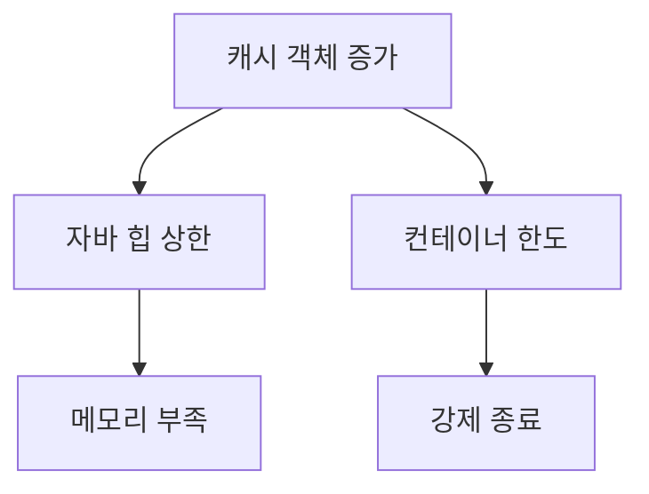

- 자바 힙 상한을 넘으면 메모리 부족 오류가 납니다.
- 컨테이너 메모리 한도를 넘으면 **관측 앱 자체가 강제 종료됩니다.**
- **컨테이너 한도가 힙 설정보다 낮으면, 힙에 여유가 있어 보이는데도 컨테이너가 먼저 죽습니다.** 그래서 어느 쪽이 먼저 걸리는지를 확정하는 것이 실측 항목에 들어갔습니다 (AC-3).

### 7.2 왜 배포부터 하지 않고 먼저 쟀나

세 가지 이유입니다.

1. **터지고 나서 알면 관측이 전면 중단됩니다.** 레플리카가 1대이므로 이 앱이 죽으면 모든 테넌트의 상태를 아무도 못 봅니다. 장애가 났을 때 상태를 보려고 만든 도구가 장애 때 먼저 죽는 구조는 피해야 합니다.
2. **급할 때 서둘러 판단하면 잃는 것이 큽니다.** 메모리를 줄이는 수단 대부분은 캐시에 담는 대상을 좁히는 것인데, 잘못 좁히면 그 자원이 **빨간불이 잘못 뜨는 것이 아니라 아무것도 안 뜨는 쪽**으로 조용히 사라집니다. 이 저장소는 학습 실행 조인이 끊겼는데 화면은 전부 정상으로 보였던 사건을 이미 한 번 겪었습니다 (4.2 절 참고).
3. **지금은 여유이기 때문에 지금 최적화하면 얻는 것이 없습니다.** 그래서 이 업무는 최적화를 실행하지 않고 **판단 근거를 만들어 두는 업무**로 정의했습니다. AC-11 에 "이 업무에서 최적화를 실행하지 않는다" 를 명시적으로 박았습니다.

### 7.3 1단계: 무엇을 감시하고 있는지 규모를 셌습니다

2026-07-30 알파 환경 실측입니다 (2170).

| 항목 | 값 |
| --- | --- |
| 감시 테넌트 | 17곳 |
| 서빙 파이프라인 | 293개 |
| 학습 파이프라인 | 141개 |
| 데이터소스 | 559개 |
| 데이터 파이프라인 | 64개 |
| **캐시 객체 총수** | **약 5,000개** |

**총계보다 편중이 중요합니다.**

서빙 파이프라인 293개 중 **186개가 한 테넌트에 몰려 있고, 중간값은 30개**입니다. 즉 가장 큰 테넌트 하나가 메모리를 좌우하므로 **평균으로 계산하면 틀립니다.** 이 편중을 확인한 것이 이 실측의 가장 큰 소득입니다.

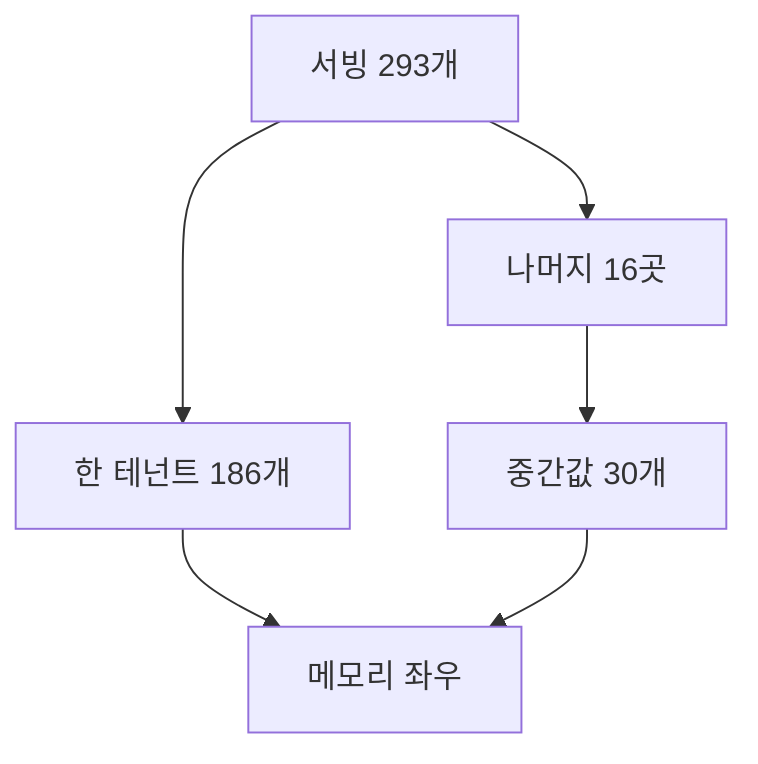

### 7.4 2단계: 방아쇠 표를 만들었습니다

캐시 객체 총수 구간별로 메모리 압박 수준과 판단을 정리했습니다 (2170).

| 캐시 객체 총수 | 메모리 | 판단 |
| --- | --- | --- |
| 약 5,000 (지금 알파) | 30 ~ 80 MB | **여유** |
| 20,000 | 150 ~ 300 MB | **주의** |
| 50,000 | 400 ~ 800 MB | **위험.** 1 GiB 한도면 여기서 걸립니다 |
| 100,000 | 1 GB 이상 | **터짐** |

**진짜 위험은 리얼 테넌트가 늘 때입니다.** 큰 테넌트 규모가 30곳이면 그것만으로 400 ~ 900 MB 입니다 (2170).

한 가지 정직하게 밝혀 둘 점이 있습니다. 위 표의 **객체 수 구간은 실측 규모에서 나왔지만 메모리 수치는 추정입니다.** 큰 테넌트 한 곳이 12 ~ 30 MB, 전체 30 ~ 80 MB 로 보고 있는데 실제로 재 본 적이 없습니다. **테넌트별 파드 수와 이벤트 수를 모르는 것이 추정 오차의 가장 큰 원인**입니다. Task 14 의 AC-1 ~ AC-4 가 바로 이 추정을 실측으로 덮어쓰는 항목이고, 두레이 기준 아직 착수 전입니다.

이와 같은 정직함을 다른 곳에도 적용했습니다. 데이터소스 축이 감시 종류를 3개 더 얹으며 9종에서 12종이 됐는데, 늘어난 객체 수를 "수십 개 수준" 으로 봅니다. 다만 **"이 문단은 아직 추정" 이라고 문서에 못박았습니다.** 데이터소스 타입이 카프카인 등록 건수가 양쪽 환경에 0건인 것과, 클러스터에 커넥터 자원이 없는 것은 다른 얘기이기 때문입니다. 알파에는 의도적으로 멈춰 둔 커넥터가 4건 실측됐습니다 (2170).

### 7.5 3단계: 레플리카를 1대로 확정한 근거

일반적인 직관은 "부하가 커지면 대수를 늘린다" 입니다. **이 앱에서는 그 길이 막혀 있습니다.**

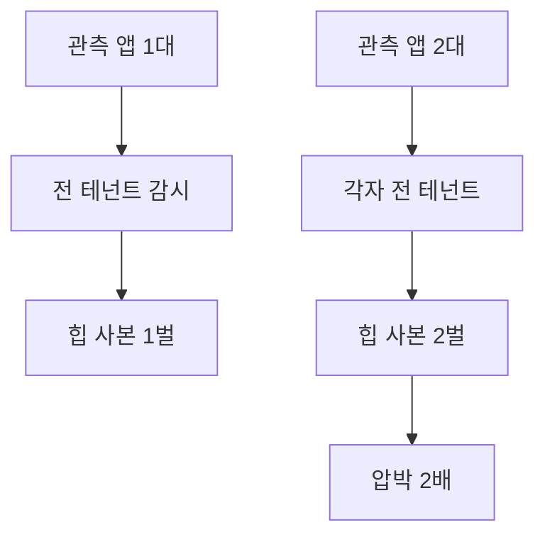

감시 연결이 **인스턴스마다 모든 테넌트에 걸리는 구조**라, 대수를 늘리면 사본도 대수만큼 복제됩니다. **두 대로 늘리면 압박이 절반이 되는 것이 아니라 두 배가 됩니다** (2170). Airflow 폴링이 들어온 뒤로는 이유가 하나 더 늘었습니다. 여러 대가 같은 파이프라인을 동시에 물어보게 되어 **Airflow 에 중복 부하**가 걸립니다 (2160).

즉 **줄이는 수단만 남아 있고 나누는 수단은 없습니다.** 그래서 줄이는 수단의 순서를 미리 정해 두는 것이 이 업무의 값이 됐습니다.

Task 06 에서 분산 락을 넣었다 뺀 것도 같은 결론의 다른 표현입니다. 락은 나누기 설계의 일부일 뿐이고 락만으로는 대수를 늘릴 수 없습니다 (2100, 2170).

### 7.6 4단계: 대비 수단의 순서와 잃는 것을 미리 정했습니다

**급할 때 서둘러 정하면 빠뜨립니다.** 그래서 꺼낼 순서를 문서로 확정했습니다 (2170).

| 순서 | 수단 | 선행 조건 | 잃는 것 |
| --- | --- | --- | --- |
| 1 | 꼬리표 조건을 걸어 캐시를 좁히기 | 학습 잡 워커 파드의 꼬리표 키 확인 (Task 13 과 공유) | 조건을 잘못 쓰면 그 자원이 화면에서 조용히 사라집니다 |
| 2 | 이벤트를 상시 감시에서 빼기 | 없습니다 | 학습 스케줄 실패 판정과 실패 증거 보존을 둘 다 잃습니다 |
| 3 | 캐시에 넣기 전에 객체 깎기 | 저장 전 변환 훅을 라이브러리가 주는지 확인 | 훅이 없으면 이 수단은 성립하지 않습니다 |

**1순위가 가장 값싸면서 동시에 가장 위험합니다.** 지금은 파드와 이벤트 감시에 조건이 아예 없어 네임스페이스 전체를 캐시에 담고 있으므로 여기서 가장 크게 줄어듭니다. 그런데 꼬리표 목록에서 하나를 빠뜨리면 그 자원이 화면에서 사라집니다. 앞서 말한 조인 단절 사건과 정확히 같은 실패 모양입니다.

지금 걸려 있는 가드는 둘입니다.

| 가드 | 내용 |
| --- | --- |
| 전체 목록 재조회 주기 | 10분보다 짧으면 기동을 거부합니다 |
| 레플리카 | 1대 고정입니다 |

### 7.7 5단계: 부하 항목의 재검토 조건을 남겼습니다

| 항목 | 지금 | 언제 다시 볼지 |
| --- | --- | --- |
| 전체 목록 재조회 주기 | 10분보다 짧으면 기동 거부 | 감시 종류가 12종으로 늘었으니 이제 한 번 봅니다. 종류가 늘면 같은 주기에 읽는 양이 늘어납니다 |
| Airflow 폴링 주기 | 5분 (Task 12) | 파이프라인 수가 늘어 호출량이 부담될 때, 또는 5분이 늦다는 요구가 올 때 |

### 7.8 6단계: 대수를 늘릴 때 할 일을 목록으로 남겼습니다

지금 하지 않지만 언제 필요해지는지와 무엇이 딸려오는지를 적어 뒀습니다 (2170).

- **필요해지는 때**: 줄이는 수단을 다 쓴 뒤입니다. 또는 한 대 장애가 곧 관측 전면 중단이라는 점이 문제가 될 때입니다.
- **함께 설계해야 하는 것**: 어느 인스턴스가 어느 테넌트를 볼지 나누기, 이력 기록 중복 방지, Airflow 폴링 분담입니다.
- **분산 락만으로는 안 됩니다.** v1 에서 넣었다 뺐습니다.

또한 문서화 위치도 정했습니다. **모듈 문서에 남겨서 다음 사람이 결정 기록을 찾지 않아도 방아쇠와 순서를 알 수 있게** 합니다 (AC-10). 관련해서 Task 06 진행 중에 "샤딩" 을 예고로만 적어 둔 주석을 걷어낸 일이 있습니다. **지금 하지 않는 일을 문서가 설명하면 읽는 사람이 있는 기능으로 오해하기 때문**입니다 (2100).

### 7.9 이 절의 요약

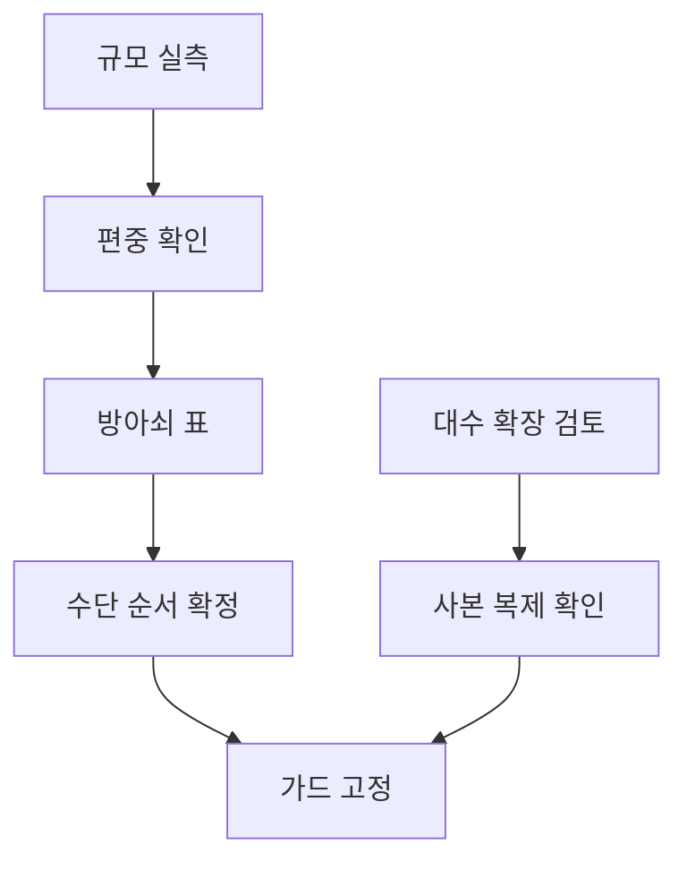

핵심은 "미리 최적화했다" 가 아니라 **"측정 없이 배포하지 않았고, 위험 임계치와 대응 순서를 미리 확정해 뒀다"** 입니다. 최적화를 실행하지 않은 것 자체가 의도적인 결정이고, 그 결정의 근거를 남긴 것이 이 업무의 산출물입니다.

---

## 8. 어드민 연결

### 8.1 얇은 통로 원칙

어드민 백엔드는 CP 관측 API 를 **그대로 전달하는 얇은 통로**만 둡니다 (2101).

| 계층 | 하는 일 | 하지 않는 일 |
| --- | --- | --- |
| CP 관측 앱 | 수집, 판정, 합성, 이력 기록 | 화면 렌더링 |
| 어드민 백엔드 | API 프록시 라우터, 쿠버네티스 이벤트 조회 엔드포인트 | 상태 판정 |
| 어드민 프런트 | 그리기, severityRank 로 정렬, 라벨 붙이기 | 상태 계산, 재판정 |

이 원칙을 프런트 코드 수준까지 지켰습니다. 예를 들어 DAG 일시정지 세 값 표시에서 **프런트는 상태를 재판정하지 않고 라벨만 붙입니다** (2160). 경과 시간을 화면에 함께 적으면서도 "낡았다" 는 판정은 하지 않습니다. **기준선인 폴링 주기가 백엔드 설정값이라 화면이 기준을 만들면 규칙과 갈라지기 때문**입니다 (2160).

어드민에는 "타 컴포넌트 API 호출 금지" 원칙이 있었는데, 이번 연결은 그 원칙의 의도적 예외입니다. 예외라는 사실을 어드민 모듈 문서에 명시했습니다 (2101).

### 8.2 드릴다운은 관측 앱을 거치지 않습니다

원시 이벤트와 파드 로그 드릴다운은 **어드민의 기존 쿠버네티스 직접 조회 경로를 재사용**합니다. 이유는 두 가지입니다.

1. 원본(이벤트 원문, 로그)이 CP 관측 앱을 지나가지 않게 하려는 격리 설계입니다.
2. 이미 있는 자산(리소스 목록, 상세, 로그 뷰어)을 그대로 씁니다.

### 8.3 새로고침 정책

| 대상 | 기본 | 자동 새로고침 주기 |
| --- | --- | --- |
| 목록 | 수동 | 60초 (토글) |
| 상세 | 수동 | 15초 (토글) |

자동 새로고침이 테넌트 클러스터에 부담을 주지 않는 이유가 설계에 박혀 있습니다. **화면 새로고침은 관측 앱이 이미 들고 있는 스냅샷을 읽는 동작**이고, 테넌트 클러스터로 나가는 호출은 상시 감시와 재조회 주기(10분 이상)가 따로 관리하기 때문입니다 (NFR-2).

여기에 사용자에게 보이는 피드백도 붙였습니다. 갱신 중 스피너, 갱신됨 확인, 조회 시각 하이라이트입니다 (2101).

### 8.4 알파 실측으로 확인한 화면 8종

2026-07-29 에 로컬 어드민을 알파 CP 관측 앱에 연결해 헤드리스 브라우저로 캡처했습니다. **조회만 수행했습니다** (2100 댓글).

| 화면 | 확인한 것 |
| --- | --- |
| 1. 관제 보드 | 테넌트 3곳의 앱을 한 화면에. 색이 상태이고 회색은 수집 실패로 판정을 보류한 테넌트입니다 |
| 2. 앱 상세 | 학습 3벌 중 하나만 학습 중이고 나머지 둘은 새벽에 끝났습니다. 기동 체인은 리비전과 파드에서 실패로 잡혔습니다 |
| 3. 학습 3벌 전부 정상 | 실행 단계는 세 스케줄 중 가장 나쁜 것으로 합성했습니다 |
| 4. 학습 1벌 | **3칸을 정원으로 그렸다면 이 앱이 2개 누락으로 잘못 읽혔을 상황**입니다 |
| 5. 추천 변형이 없는 종류 | 변형이 없어 모델 이름으로 제목을 적고, 재학습 주기가 없는 것도 그대로 표시합니다 |
| 6. 재학습 스케줄이 꺼진 앱 | CP 는 주기를 아는데 클러스터 스케줄이 꺼져 있어 주기 뒤에 "꺼짐" 을 붙였습니다 |
| 7. 수집 실패 테넌트 (결함 발견) | 기동 단계 5칸은 "알 수 없음" 인데 **학습 섹션만 통째로 사라져 학습이 없는 앱처럼 읽혔습니다** |
| 8. 같은 테넌트 (수정 후) | 학습 노드는 남기고 상태만 "알 수 없음" 으로 두었습니다. **못 본 것과 없는 것은 다르기 때문입니다** |

7번과 8번이 이 실측의 핵심 소득입니다. 부분 실패 격리를 백엔드에서 지켰더라도 **화면에서 노드를 지워 버리면 같은 오해가 다시 생긴다**는 점을 실물로 확인하고 고쳤습니다.

같은 실측에서 결함 3건을 더 잡았습니다. 종류 필터 누락, 멀티 컨테이너 로그, 쿠버네티스 연결 캐시입니다 (2101).

### 8.5 화면 단위를 앱으로 바로잡기

작업 후반에 화면 이름 자체를 고쳤습니다. 앱 하나 안에서 서빙 파이프라인과 학습 파이프라인이 도는데 화면 이름이 하위 부품 이름("서빙 파이프라인 관제")이라 **계층이 뒤집혀 읽혔습니다**. 콘솔의 "앱 ID" 가 곧 서빙 파이프라인 식별자라서 화면 문구만 앱 기준으로 옮겼습니다 (2101).

- 제목, 브레드크럼, 상세를 앱 기준으로 바꿨습니다 (앱 모니터링 / 앱 상세 / 앱 목록으로).
- 조작 바와 테이블의 "종류" 를 "앱 유형" 으로, 칸 표시를 "앱 1칸" 으로 바꿨습니다.
- 사이드바에 "모니터링" 그룹을 신설하고 데이터 소스 / 데이터 파이프라인 / 분석은 자리만 확보했습니다.

### 8.6 화면 표시 규칙을 표로 못박았습니다

같은 지적이 반복되어 표시 결정을 규칙 표로 남겼습니다 (2160). 남긴 항목은 경과 시간 표기, 출처별 묶음, 빈 값 처리, 빈 표 문구, 활자 3단, 커서와 동작 일치입니다.

특히 **출처별 묶음**이 실용적입니다. 시각 값의 출처가 CP 기록과 Airflow 실측 둘인데 한 격자에 섞여 있어, 라벨 괄호를 읽어야 어느 값이 낡을 수 있는지 알 수 있었습니다. 두 묶음으로 나누고 출처를 묶음 제목으로 올렸습니다.

---

## 9. Result: 정량적 성과

### 9.1 규모

| 항목 | 값 | 출처 |
| --- | --- | --- |
| 완료 태스크 | 10건 (Task 01 ~ 07, Task 10, 11, 12) | 2095 ~ 2101, 2158, 2159, 2160 |
| 미착수 태스크 | 2건 (Task 13, Task 14) | 2169, 2170 |
| 참고(본인 커밋 없음) | 1건 (Task 09, 5.9절) | 2140 |
| 병합/발행된 PR | 8건 (#1203, #1205, #1209, #1218, #1226, #1236, #1242, #1253) | 각 태스크 댓글 |
| 기능 요구사항 | 16개 (FR-1 ~ FR-16) | 1998 |
| 품질 요구사항 | 6개 (NFR-1 ~ NFR-6) | 1998 |

### 9.2 알파 환경 실측 (2026-07-29 ~ 07-30)

| 항목 | 값 |
| --- | --- |
| 감시 테넌트 | 17곳 |
| 서빙 파이프라인 | 293개 (한 테넌트에 186 집중, 중간값 30) |
| 학습 파이프라인 | 141개 |
| 데이터소스 | 559개 |
| 데이터 파이프라인 | 64개 |
| 캐시 객체 총수 | 약 5,000개 |
| 네임스페이스 파생 규칙 전수 확인 | 18개 테넌트, 어긋난 사례 0건 |
| Airflow 활성 파이프라인 | 13개 |
| 감시 리소스 종류 | 12종 (선택 감시 5종) |
| 화면 증적 캡처 | 8장 |

### 9.3 단위 테스트

Task 05 진행 중 테스트 수가 커밋마다 기록되어 있습니다 (2099).

| 시점 | 테스트 수 |
| --- | --- |
| 조회 API 최초 구현 (28건 추가) | 110건 |
| 감시 대상 축소 설정 추가 | 113건 |
| 계약 테스트 보강 | 119건 |
| 시간대 프로퍼티 철회 | 116건 |
| 알파 실측 반영 | 117건 |
| 원인 규칙 보강 | 123건 |
| 실패 사유 문구 (서빙·리비전) | 126건 |
| 실패 사유 문구 (실행·파드) | 129건 |

119건에서 116건으로 줄어든 구간은 시간대 설정 프로퍼티를 철회하며 관련 테스트가 함께 사라진 결과입니다. 순증 기준으로 **110건에서 129건으로 늘었습니다.**

테스트 작성 원칙도 하나 교정했습니다. 시간대 테스트의 기대값을 시스템 기본값으로 계산하고 있어서 **동어반복이었던 것을 고정 기대값으로 바꿨습니다** (2099).

### 9.4 판정 정확도 관련 개선 건수

| 항목 | 건수 |
| --- | --- |
| 알파 실측으로 추가한 실패 신호 | 9종 (전부 PLATFORM 분류) |
| 학습 실행 실패 신호 추가 | 3종 (실행 phase, 파드 조건, 컨테이너 종료 사유) |
| 알파 실측으로 잡은 화면 결함 | 3건 (종류 필터 누락, 멀티 컨테이너 로그, 연결 캐시) |
| Airflow 실측 필드 추가 | 5개 (dagPaused, lastRunState, lastRunStartedAt, lastRunEndedAt, runObservedAt) |
| 파이프라인 빌드 축 알파 E2E (Task 11) | 16/16 PASS. 은퇴 리비전 오탐 수정 후 응답 리소스 수 98개 → 8개로 감소 |
| 데이터소스 축 사가 보상 실측 (Task 10) | 알파 6건, 베타JP 1건 |

### 9.5 정성적 성과

| 성공 기준 (1998) | 달성 근거 |
| --- | --- |
| 서빙이 안 뜨는 원인 파악이 어드민 한 화면에서 끝난다 | 알파 실측 화면 8종에서 단계별 상태와 원인이 표시되는 것을 확인했습니다 |
| 단계별 상태가 보여 "서빙이 문제다" 식 오진이 줄어든다 | 기동 5단계를 각자 자기 신호로 판정하고 최악 단계(causedBy)를 응답에 실었습니다 |
| 쿠버네티스 서버 부담을 늘리지 않는다 | 조회는 스냅샷 즉답, 전체 재조회 10분 이상 강제, 조회 시점 원격 호출 금지를 구조로 보장했습니다 |
| 화면을 못 믿으면 운영자가 FreeLens 로 돌아간다 | "못 본 것과 없는 것은 다르다" 원칙으로 수집 실패 노드를 지우지 않고 남겼습니다 |

특히 마지막 항목이 이 프로젝트의 일관된 태도입니다. **거짓 초록을 만들지 않는 것**을 판정, 응답 계약, 화면 표시 전 계층에서 반복해서 지켰습니다.

| 어디서 | 어떻게 |
| --- | --- |
| 판정 | 수집 실패 시 판정을 보류합니다. 정상으로 두지 않습니다 |
| 응답 계약 | 불일치와 DAG 일시정지를 세 값으로 두어 "관측 없음" 을 "괜찮음" 으로 뭉개지 않습니다 |
| 화면 | 수집 실패 테넌트의 노드를 지우지 않고 "알 수 없음" 으로 남깁니다 |
| 데이터 파이프라인 | 빌드 완료인데 DAG 이 없으면 누락으로 올려 조인 전제가 틀린 경우까지 화면에 드러냅니다 |
| 최적화 | 잘못 좁히면 자원이 조용히 사라지므로, 실측 전에는 캐시를 좁히지 않습니다 |

---

## 10. 남은 과제

### 10.1 Task 13. 학습 실패 원인 보존 (NHN-Cloud-Foundry/2169, 할 일)

**문제**: 지금은 학습이 실패한 것만 알 수 있고 이유는 시간이 지나면 영구히 알 수 없습니다. 실행 흔적이 완료 후 지워지고 이벤트는 약 한 시간만 남기 때문입니다.

**알파 실측으로 정리한 8종 실패 원인 중 지금 못 보는 것이 2종**입니다.

| 실패 종류 | 지금 | 무엇으로 아나 |
| --- | --- | --- |
| GPU 를 못 잡아 못 뜸 | 압니다 | 이벤트. v1 에 이미 구현했습니다 |
| 이미지를 못 받음 | 압니다 | 이벤트 |
| 노드에서 밀려남 | 압니다 | 이벤트 |
| 학습 잡이 실패함 | 압니다 | 잡과 워크플로 상태 |
| 시간 초과 | 압니다 | 잡 상태 |
| 어느 스텝에서 깨졌나 | 압니다 | 워크플로 상태 |
| **메모리 초과** | **모릅니다** | 파드 종료 사유가 필요합니다 |
| **종료 코드** | **모릅니다** | 파드 종료 사유가 필요합니다 |

**모르는 둘이 실무에서 가장 흔한 학습 실패입니다.** 데이터가 커져 메모리를 넘기거나 학습 코드가 예외를 던지는 경우입니다.

**왜 못 보나**: 판정 입력에서 파드를 고를 때 꼬리표 세 개만 봅니다. 학습 스텝 파드는 그중 하나를 달고 나오므로 이미 통과합니다. 걸러지는 것은 **학습 잡 워커 파드**입니다. 학습 스텝이 학습 잡을 띄우면 실제 계산은 그 잡이 만든 워커 파드에서 도는데, 그 파드에는 세 꼬리표가 없습니다. 메모리 초과와 종료 코드는 바로 거기서 납니다.

**계획**: 파드 고르는 조건을 워커 파드까지 넓히고, 실패 회차 한 줄(파이프라인 식별자, 회차, 실패 시각, 실패 종류, 종료 코드, 깨진 스텝 이름, 파드·네임스페이스·컨테이너 이름)만 저장합니다. **한 줄에 수백 바이트**입니다.

**메모리는 늘지 않습니다.** 캐시는 이미 네임스페이스 전체를 담고 있고 조건은 판정 입력 단계에만 있습니다. 즉 워커 파드는 이미 캐시에 들어와 있으면서 판정에서만 버려지고 있습니다. 조건을 넓혀도 새로 담지 않고 버리지 않을 뿐입니다.

**로그는 저장하지 않습니다.** 이유가 셋입니다.

1. 모든 테넌트에 Loki 와 Promtail 이 이미 설치돼 있습니다 (온보딩 11단계). 파드가 지워져도 로그는 거기 남습니다.
2. 학습 로그가 한 회차에 수 MB 에서 수십 MB 라 컨트롤플레인 데이터베이스가 감당하지 못합니다.
3. 데이터 형식 오류가 나면 스택트레이스에 고객 데이터가 찍히는 일이 흔해 평면 격리를 어깁니다.

**파드 좌표를 저장하는 이유**는 하나입니다. 파드가 지워지면 그라파나에서 검색할 키가 없어집니다. 3주 전에 실패한 워커 파드의 이름은 우리 기록 말고는 알 방법이 없습니다. 좌표 한 줄로 그 연결이 성립합니다.

**선행 확인 1건이 남아 있습니다.** 워커 파드에 달리는 꼬리표 키를 아직 모릅니다. 학습 잡 자체에는 꼬리표도 소유자 참조도 없다는 것이 실측으로 확인되어 실행 인자로 잇고 있으므로, 워커 파드도 확인 없이 가정하면 안 됩니다. **이 확인은 Task 14 의 1순위 대비 수단과 선행 조건을 공유합니다.**

### 10.2 Task 14. 관측 앱 메모리·부하 여유 확정 (NHN-Cloud-Foundry/2170, 할 일)

7절에서 상세히 다뤘습니다. 남은 실측 항목만 요약합니다.

| AC | 남은 일 |
| --- | --- |
| AC-1 | 알파에서 관측 앱의 자바 힙 실제 사용량을 그라파나에서 확인하고 추정 문구를 실측값으로 바꿉니다 |
| AC-2 | 테넌트별 파드 수와 이벤트 수를 세어 캐시 객체 총수를 실측합니다 |
| AC-3 | 컨테이너 메모리 한도와 힙 설정값 중 **어느 쪽이 먼저 걸리는지** 확정합니다 |
| AC-4 | 방아쇠 표를 실측값 기준으로 확정합니다 |
| AC-6 | 꼬리표 키 확인이 Task 13 에서 해결됐는지 확인하고 반영합니다 |
| AC-7 | 저장 전 변환 훅을 라이브러리가 주는지 확인하고, 없으면 3순위 수단을 목록에서 뺍니다 |
| AC-11 | **이 업무에서 최적화를 실행하지 않습니다.** 실측 결과가 이미 방아쇠를 넘겼다면 그 사실을 보고하고 별건으로 분리합니다 |

### 10.3 그 밖에 범위 밖으로 미룬 것

| 항목 | 상태 | 출처 |
| --- | --- | --- |
| 고객(2차) 화면에 제한 노출 | 미착수. 이번의 원인 분류(FR-8)가 그 바탕입니다 | 1998 |
| 추이 그래프, 알림 연동 | 미착수 | 1998 |
| 보드 프리셋 팀 공유 저장 | 미착수. 이번에는 개인 저장까지입니다 | 1998 |
| 재시작 같은 조작 기능 | 범위 밖입니다. 이번 범위는 보기 전용입니다 (NFR-1) | 1998 |
| 이력 보존 정리 배치 | 후속. 보존 기간 기본값 90일만 제안했습니다 | 2100 |
| 모델별 이력 확장 | 코드에 TODO 로 남겼습니다 | 2100 |
| 규칙 파일 동적 리로드 | v1 은 재배포입니다 | 2098 |
| 폴링 주기를 5분보다 줄이기 | 부하와 함께 판단할 사안이라 후속 체크 항목입니다 | 2160 |
| 관측 앱 레플리카 확장 | 감시 분담 설계가 먼저입니다 | 2160, 2170 |
| DAG 이름과 파이프라인 식별자가 같은지 실제 응답으로 확인 (AC-4) | 빌드 완료인데 DAG 부재는 누락으로 떨어지도록 해서 화면에 드러나게 설계했습니다 | 2160 |
| CP 갱신 시각의 JP 리전 시간대 | Task 09(2140) 조사로 **이미 정상 확인**. KR/JP 가 JDBC 프로파일부터 다르게 설정돼(KR=Asia/Seoul, JP=UTC) 있어서 절대 시각은 양쪽 다 맞습니다. 남은 일은 코드 수정이 아니라 문서의 "JP 미확인" 문구 2곳을 지우는 것뿐입니다 | 2099, 2140 |

### 10.4 팀장님이 남긴 다음 방향

- **관측 대상을 전부로 넓히기**: "제공하는 모든 내용을 모니터링하는 게 목표입니다. 데이터 소스, 파이프라인, 분석, 앱 모두." 당장은 트레이닝과 서빙만 해도 되고 나머지는 추가해 나가는 방향입니다 (1998 댓글 07-10). v2 의 Task 10 ~ 12 에서 데이터소스와 데이터 파이프라인 축이 실제로 추가됐습니다.
- **자주 발생하는 문제를 하나씩 규칙에 추가하기**: 리소스 부족, 이미지 버전 문제, 파드 실패 이유 같은 항목을 팀 전체에서 모아 하나씩 넣는 방식입니다. 판정 기준을 규칙 파일로 외부화한 설계가 이 방향과 맞물립니다.
- **LLM 을 이용한 정확한 진단**: 아이디어 단계입니다 (1998 댓글 07-10).

---

## 11. 태스크 타임라인

### 11.1 v1 (Task 01 ~ 07)

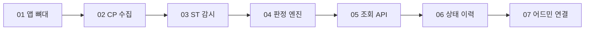

### 11.2 전체 표

| 태스크 | 번호 | 상태 | 주요 일자 | PR | 핵심 산출물 |
| --- | --- | --- | --- | --- | --- |
| Story 어드민 모니터링 | 1998 | 진행 중 | 2026-07-09 등록 | 없음 | FR 16개, NFR 6개, 상태 7종·원인 5종, 4계층 구조, CP 총괄 배치 결정 |
| Task 01 앱 뼈대 | 2095 | 완료 | 2026-07-24 | 없음 | Gradle 모듈 신설, Spring Boot 기동, 규칙 파일 로드 자리 |
| Task 02 CP 수집 | 2096 | 완료 | 2026-07-26 병합 | #1203 | 테넌트 목록·좌표 조회, appKey 대 네임스페이스 매핑, 소스 어댑터 계약, 앱 내부 시간 UTC 통일 |
| Task 03 ST 상시 감시 | 2097 | 완료 | 2026-07-27 병합 | #1205 | 테넌트별 감시 수명주기, 인메모리 스냅샷, 부분 실패 격리, Workflow 조인 |
| Task 04 판정 엔진 | 2098 | 완료 | 2026-07-28 병합 | #1209 | composer 엔진, 규칙 파일, 불일치 판정, DELETED 잔존 특례, 이벤트 유효 시간 창 |
| Task 05 조회 API | 2099 | 완료 | 2026-07-29 병합 | #1218 | 4계층 골격 DTO, 필터 3종, 알파 실측 기반 규칙 보강 9종, 테스트 129건 |
| Task 06 상태 이력 | 2100 | 완료 | 2026-07-30 병합 | #1226 | 이력 테이블·기록 루프, 학습 파이프라인 계층 승격, 학습 잡·PodGroup 감시, 레플리카 1대 확정 |
| Task 07 어드민 연결 | 2101 | 완료 | 2026-07-30 | #1226 에 포함 | 프록시 라우터, 관제 보드 실 데이터 연동, 새로고침 정책, 화면 단위를 앱으로 교정 |
| Task 09 알파 실검증·규칙 보강 (참고, 5.9절) | 2140 | 할 일 (본인 커밋 없음) | 2026-07-28 등록 | 없음 | 대부분 다른 태스크가 흡수. JP 시각 정상 확인 |
| Task 10 데이터소스 관측 (5.9절) | 2158 | 완료 | 2026-07-31 발행 | #1236 | 3단계 관측(등록·인입·조회), 사가 보상 저하 표시, 테넌트 드롭다운 필터 |
| Task 11 파이프라인 빌드 관측 (5.9절) | 2159 | 완료 | 2026-08-04 발행 | #1242 | BUILT 순간상태 처리, 모델별 갈라보기, 은퇴 리비전 오탐 수정, 알파 E2E 16/16 |
| Task 12 데이터 파이프라인 실행 관측 | 2160 | 완료 | 2026-08-06 병합 | #1253 | Airflow 폴러, 토큰 캐시, 실행 칸 판정, 실측 5필드, 실패 노드 이름 |
| Task 13 학습 실패 원인 보존 | 2169 | 할 일 | 2026-07-31 등록 | 없음 | 워커 파드 판정 입력 편입, 실패 회차 한 줄 저장 |
| Task 14 메모리·부하 여유 확정 | 2170 | 할 일 | 2026-07-31 등록 | 없음 | 힙 실측, 방아쇠 표 확정, 대비 수단 순서 문서화 |

일자는 두레이 업무 기록의 커밋 푸시 댓글(KST)과 업무 갱신 시각을 기준으로 적었습니다. Task 07 은 Task 06 과 같은 PR 에서 병합됐습니다.

### 11.3 v1 에서 v2 로의 변화

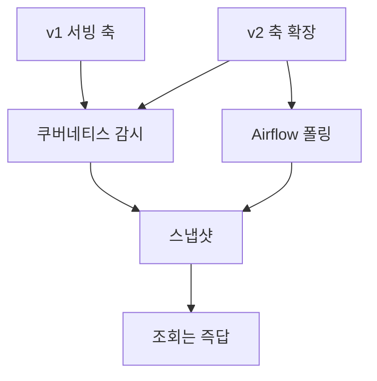

v1 은 모든 상태를 쿠버네티스 자원에서 읽었고, 자원이 바뀌면 클러스터가 알려 주므로 1초 안에 알았습니다. v2 에서 데이터 파이프라인 축이 들어오며 처음으로 **우리가 물어봐야 하는 수집원**이 생겼습니다. 이때 지킨 원칙이 "수집 수단은 축마다 달라도 되지만, **조회는 언제나 스냅샷으로 즉답한다**" 였습니다 (2160). 관측 앱에 프록시 게이트웨이 의존이 처음 생긴 것도 이 시점이고, 그 의존이 다른 축을 해치지 않도록 실패 격리를 층으로 나눠 두었습니다.

---

## 부록. 설계 판단 모음

문서 전반에 흩어진 판단 중 재사용 가치가 있는 것을 모았습니다.

| 판단 | 근거 | 출처 |
| --- | --- | --- |
| 판정 기준을 코드가 아니라 규칙 파일에 둔다 | 분류와 임계치는 팀 결정으로 바뀝니다. 값만 고칠 수 있어야 합니다 | 1998, 2098 |
| 각 단계는 자기 신호로만 판단한다 | 물려받으면 "어느 단계에서 막혔나" 라는 목적 자체가 무너집니다 | 1998 FR-6 |
| 수집 실패는 정상이 아니라 판정 보류다 | 거짓 초록을 만들면 운영자가 화면을 안 믿고 FreeLens 로 돌아갑니다 | 1998, 2100 |
| 참·거짓이 아니라 세 값을 쓴다 | 관측 없음을 괜찮음으로 뭉개면 장애가 정상으로 읽힙니다 | 2099, 2160 |
| 조회 시점에 원격 호출을 하지 않는다 | 한 테넌트가 느리면 화면 전체가 기다립니다. 구조로 보장하려고 출력 포트 자체를 주입하지 않았습니다 | 2160 |
| 못 맞춘 신호도 문구로는 읽히게 한다 | 규칙 목록은 닫힌 집합이 될 수 없습니다 | 2099 |
| 나중에 추가하기 비싼 컬럼은 처음부터 넣는다 | CP 스키마는 자동 마이그레이션이 없습니다 | 2100 |
| 지금 안 하는 일을 문서가 설명하지 않는다 | 읽는 사람이 있는 기능으로 오해합니다 | 2100 |
| 확정 규약은 설정 노브로 두지 않는다 | 노브가 있으면 환경마다 조용히 어긋납니다 | 2099 |
| 측정 전에는 최적화하지 않는다 | 잘못 좁히면 자원이 화면에서 조용히 사라집니다. 이미 한 번 겪었습니다 | 2170 |
| 대수를 늘리는 것이 항상 완화책은 아니다 | 감시 사본이 인스턴스마다 복제되는 구조에서는 압박이 배로 늡니다 | 2170 |

