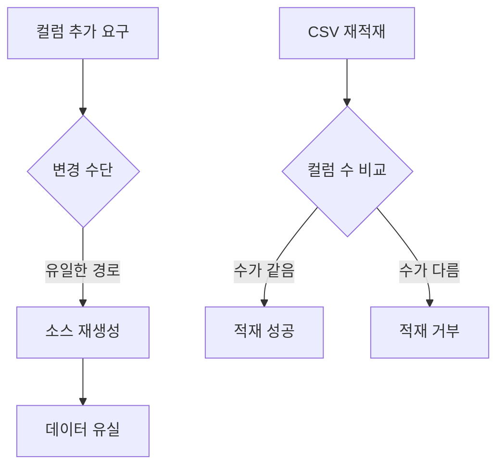
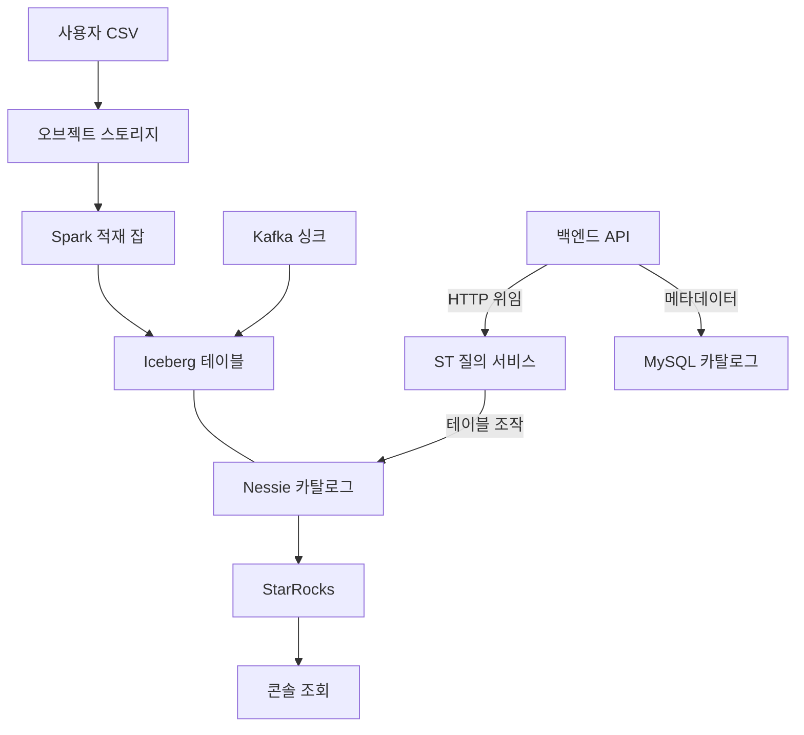
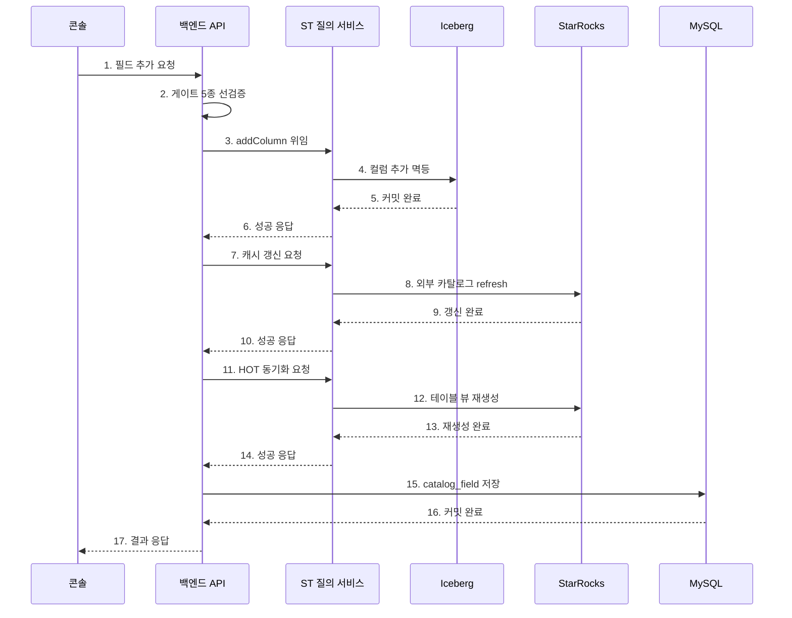
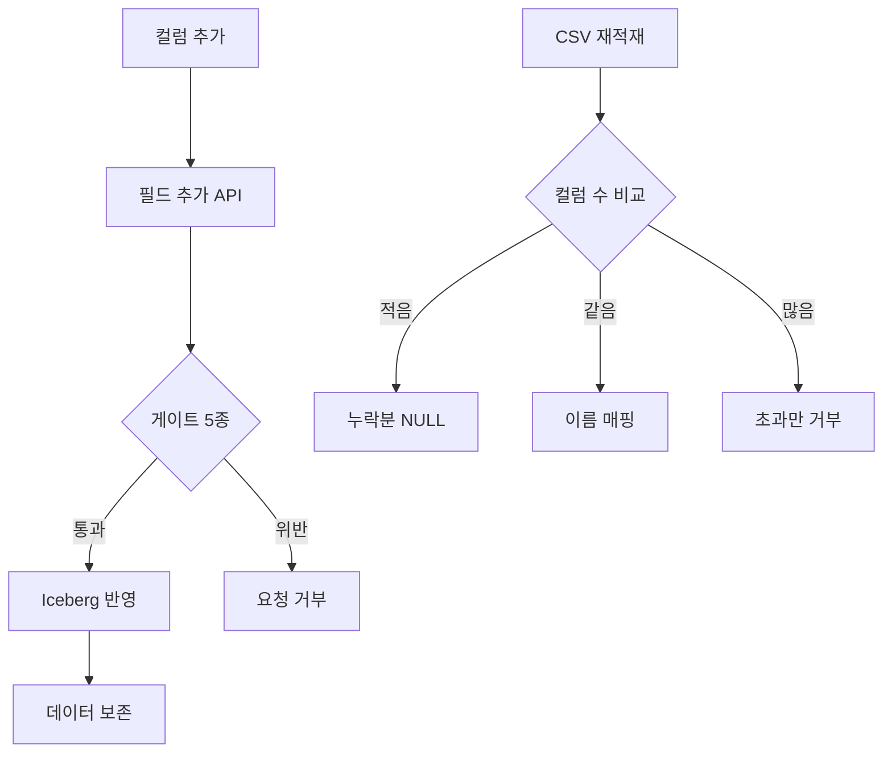
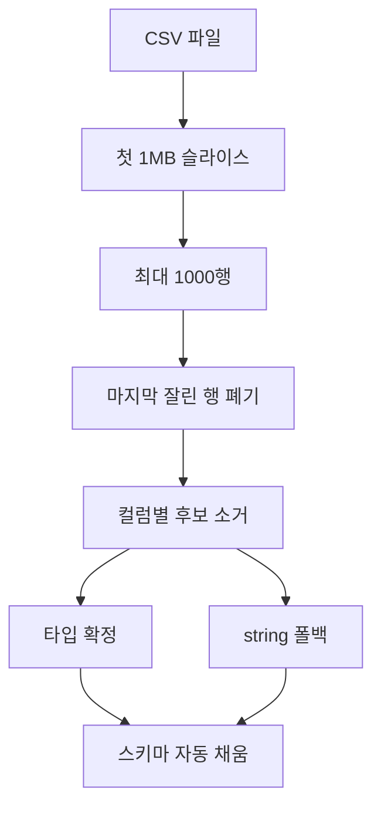
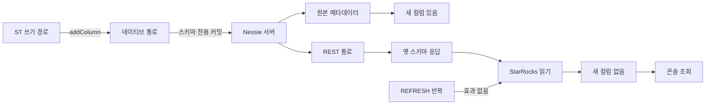
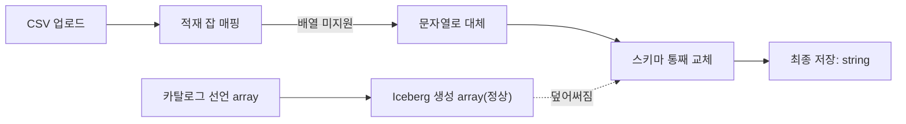
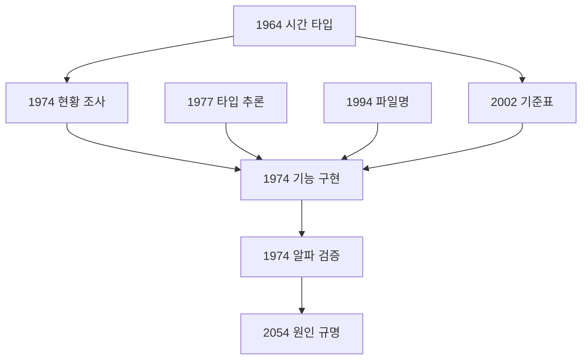

> 출처: GitHub `GoToBILL/transfer#3` ("아이스 버그"). 최신화 필요 시 `gh api repos/GoToBILL/transfer/issues/3` 로 재조회.

# Iceberg 스키마 에볼루션: 데이터를 버리지 않고 컬럼을 추가하는 길 만들기

> 본 문서는 실제 두레이 업무 기록을 근거로 작성되었으며, 사내 식별자는 제외했습니다.

출처 태스크: #1964, #1974, #1977, #1994, #2002, #2054, #2108(추가분, 9절)

---

## 1. 개요

### 1.1 한 문장 요약

데이터 소스를 삭제하고 다시 만들어야만 컬럼을 늘릴 수 있던 구조를, 기존에 쌓인 데이터를 그대로 둔 채 API 한 번으로 컬럼을 추가하는 구조로 바꾼 작업입니다.

### 1.2 무엇을 만들었나

| 구분 | 내용 | 출처 |
| --- | --- | --- |
| 기능 1 | 카탈로그 필드 추가 API (스키마 에볼루션). 추가만 허용하고 삭제와 타입 변경은 게이트에서 차단 | #1974 |
| 기능 2 | CSV 데이터 소스 생성 시 스키마 타입 자동 추론 버튼 | #1977 |
| 정합 | 시간 타입을 엔진별로 다르게 해석하던 문제를 기준표로 정리하고 저장 타입을 통일 | #1964, #2002 |
| 원인 규명 | 컬럼은 추가됐는데 조회에는 안 보이는 현상의 근본 원인 확정 | #2054 |
| 부수 개선 | 파일명에 공백이나 한글이 있으면 업로드가 막히던 문제 해결 | #1994 |

### 1.3 이 작업의 성격

세 가지 성격이 한 덩어리로 묶여 있습니다.

1. **기능 구현**: 없던 API 를 새로 만들고, 이미 있던 부품(Iceberg ADD COLUMN)을 사용자 흐름에 연결했습니다.
2. **직접 검증**: 알파 콘솔에서 실제 CSV 를 올려 생성부터 재적재까지 끝까지 돌렸고, 그 과정에서 결함 6건을 찾아 고쳤습니다 (#1974).
3. **원인 규명**: 검증 중 발견한 "컬럼은 추가됐는데 조회에는 안 보이는" 현상을 3개 지점 실측으로 좁혀 근본 원인을 확정하고 후속 태스크로 분리했습니다 (#2054).

---

## 2. Situation & Task

### 2.1 Before: 컬럼 하나 추가하려면 데이터를 통째로 버려야 했습니다

작업 착수 시점의 현황을 코드 기준으로 정리하면 이렇습니다 (#1974 조사 결과).

| 항목 | 상태 |
| --- | --- |
| 카탈로그 필드 추가 API | 없음. 카탈로그는 데이터 소스 생성 시점에 고정되고, 수정 API 는 이름과 설명, 옵션만 지원 |
| 새 컬럼이 포함된 CSV 업로드 | 적재 실패. 적재 스크립트가 컬럼 수 불일치를 에러로 처리 |
| Iceberg ADD COLUMN 인프라 | 있음. 다만 시스템 컬럼 전용으로만 쓰이고 사용자 흐름과 연결되어 있지 않음 |
| 사용자 컬럼을 늘리는 유일한 방법 | 데이터 소스 삭제 후 재생성 |

여기서 "카탈로그"는 고객이 "이 컬럼은 문자열, 저 컬럼은 시간" 처럼 컬럼 타입을 정의해 두는 스키마 장부입니다. 서비스 관리 DB(MySQL)에 저장됩니다.



### 2.2 이게 왜 실사용자에게 큰 문제였나

이 서비스의 고객은 자기 데이터를 올려서 분석하고 AI 모델을 붙이는 사람입니다. 데이터 소스는 한 번 만들어 두고 몇 달씩 계속 쌓아 갑니다.

문제는 스키마 설계가 처음부터 완벽한 경우가 거의 없다는 점입니다. 실제로 자주 벌어지는 상황은 이렇습니다.

- 석 달 치 주문 데이터를 매일 올려 왔는데, 분석을 시작하고 나서야 "고객 등급" 컬럼을 빼먹은 걸 알게 됩니다.
- 모델 학습을 돌려 보니 피처가 하나 부족합니다. 원본 CSV 에는 그 값이 있는데 카탈로그에 정의하지 않아 적재되지 않았습니다.
- 운영 중에 새 지표가 추가돼서 앞으로 들어올 데이터에는 컬럼이 하나 늘어납니다.

Before 구조에서는 이 셋 다 답이 하나뿐이었습니다. **데이터 소스를 지우고 다시 만드는 것**입니다. 그러면 그동안 적재한 데이터가 전부 사라집니다. 원본 CSV 를 전부 보관하고 있다면 다시 올릴 수는 있지만, 파일이 수십 개면 수십 번을 다시 올려야 하고, 원본을 지웠거나 스트림으로 받은 데이터라면 복구 자체가 불가능합니다.

즉 "컬럼 하나 추가"라는 가장 흔한 요구가 "지금까지 모은 데이터를 버릴 것인가"라는 선택으로 번역되는 상태였습니다. 컬럼 하나 때문에 몇 달 치 데이터를 버리는 선택을 할 사람은 없으므로, 실제로는 고객이 잘못된 스키마를 그대로 안고 가거나 데이터 소스를 하나 더 만들어 쪼개는 우회를 하게 됩니다. 둘 다 서비스 만족도를 깎는 경로입니다.

### 2.3 Task: 없는 것을 발명하는 게 아니라 있는 부품을 연결하기

조사 결과 흥미로운 사실이 하나 나왔습니다. **컬럼을 추가하는 능력 자체는 이미 있었습니다.**

우리가 쓰는 Iceberg 는 컬럼을 이름이 아니라 불변 ID 로 추적합니다. 그래서 컬럼 추가는 데이터 파일을 다시 쓰지 않고 메타데이터만 바꾸면 되고, 기존 행은 새 컬럼을 NULL 로 읽습니다. 이 능력을 쓰는 내부 API 도 이미 있었습니다. 다만 시스템 컬럼을 넣는 용도로만 쓰였고 사용자 화면과 연결되어 있지 않았습니다.

그래서 이 작업의 과제는 다음 두 가지를 새로 만들고 나머지는 이어 붙이는 것이었습니다.

1. 카탈로그 필드 추가 API
2. 위험한 변경을 걸러 내는 게이트 (추가만 자동, 삭제와 타입 변경은 거부)

여기에 하나가 더 붙습니다. StarRocks HOT 계층의 스키마 동기화는 기성 메커니즘이 없어 함께 만들어야 했습니다 (#1974).

### 2.4 업계 사례에서 가져온 설계 기준

혼자 판단하지 않고 빅테크 4곳의 공통 패턴을 먼저 조사했습니다 (#1974).

| 사례 | 방식 |
| --- | --- |
| Confluent (Kafka Schema Registry) | 스키마를 버전으로 등록하고 호환성 규칙(BACKWARD/FORWARD)을 기계가 검사. 위반 스키마는 등록 단계에서 거부 |
| Netflix (Iceberg) | 컬럼마다 불변 ID 를 부여해 추가·삭제·이름 변경을 데이터 파일 재작성 없이 메타데이터 변경만으로 처리 |
| Databricks (Delta Lake) | 스키마와 안 맞는 쓰기는 기본 거부(enforcement). 에볼루션은 명시적 옵션(mergeSchema)을 켠 쓰기에서만 허용 |
| BigQuery / Snowflake | 컬럼 추가는 자동 허용. 타입 변경은 제약. 삭제는 엔진별 상이 (BigQuery 는 스토리지 회수에 재작성 필요, Snowflake 는 DROP COLUMN 바로 지원) |

공통 분모는 세 가지였습니다.

- **단일 진실 스키마 저장소**를 둔다.
- **추가는 자동, 삭제와 타입 변경은 사람 승인 또는 제약**으로 등급을 나눈다. 컬럼 추가는 옛 데이터를 깨뜨릴 수 없으므로(옛 행은 NULL) 자동 허용해도 안전합니다.
- **쓰기 시점에 게이트로 강제**한다. 데이터가 흐르기 전에 스키마가 먼저 심사받는 구조입니다.

우리 상태를 여기에 대 보면 저장소(카탈로그)는 있는데 필드 추가 API 가 없고, 게이트는 "컬럼 수가 다르면 적재 에러"라는 원시 형태만 있었습니다. 그래서 설계 방향을 "업계 공통 패턴을 우리 부품에 얹는다"로 잡았습니다.

---

## 3. 전체 데이터 적재·조회 경로

### 3.1 엔진 구성

이 작업을 이해하려면 데이터가 어디를 거쳐 어디에 저장되고 어디로 조회되는지를 먼저 봐야 합니다. 관여하는 엔진이 5개이고, 스키마 변경은 그 5개를 전부 건드리기 때문입니다.



각 요소의 역할입니다.

| 요소 | 역할 |
| --- | --- |
| 오브젝트 스토리지 | 사용자가 올린 CSV 원본 파일 보관 |
| Spark 적재 잡 | CSV 를 읽어 카탈로그 타입으로 캐스팅한 뒤 Iceberg 테이블에 씀 (스냅샷 적재) |
| Kafka 싱크 | 스트림으로 들어오는 데이터를 Iceberg 에 append |
| Iceberg 테이블 | 실제 데이터가 파일로 쌓이는 테이블 형식. 컬럼을 불변 ID 로 추적 |
| Nessie 카탈로그 | Iceberg 테이블 목록과 버전을 관리하는 카탈로그 서버 |
| StarRocks | 콘솔 분석 쿼리를 실행하는 조회 엔진. Iceberg 를 외부 카탈로그로 읽음 |
| MySQL 카탈로그 | 고객이 정의한 컬럼 타입 장부와 서비스 관리 메타데이터 |
| 백엔드 API | 도메인 로직과 Saga 를 담당. Iceberg 를 직접 만지지 않고 ST 에 위임 |
| ST 질의 서비스 | Iceberg 카탈로그 조작과 StarRocks 질의를 전담 |

### 3.2 여기서 나오는 구조적 함의

이 그림에서 두 가지가 이 문서 전체를 관통합니다.

첫째, **스키마 정보가 네 군데에 흩어져 있습니다.** MySQL 카탈로그(고객 정의), Iceberg 메타데이터(실제 물리 스키마), StarRocks 외부 카탈로그 캐시(조회용 사본), StarRocks HOT 계층(스트림 수신용 내부 테이블)입니다. 컬럼 하나를 추가하면 네 군데가 전부 같은 상태로 수렴해야 합니다. 4장의 저장 순서 설계가 여기서 나옵니다.

둘째, **쓰기 경로와 읽기 경로가 Nessie 를 서로 다른 통로로 씁니다.** 이 사실이 7장의 장애 원인입니다.

---

## 4. 핵심 기능 1: 카탈로그 필드 추가 API

### 4.1 API 계약

```
POST /resource/v1.0/appkeys/{appKey}/data-sources/{dataSourceId}/catalog-fields
```

요청 본문은 필드 1~20건의 배열입니다.

```json
{
  "fields": [
    { "fieldName": "grade", "fieldType": "long", "fieldComment": "고객 등급" },
    { "fieldName": "memo", "fieldType": "string", "fieldComment": "메모" }
  ]
}
```

**단건이 아니라 배치로 만든 이유**가 있습니다. 뒤에서 설명할 HOT 계층 재생성(Routine Load 재생성, Union View 재생성)이 비싼 연산이라서, 필드별로 N 번 호출하면 재생성도 N 번 돕니다. 요청당 1회로 묶기 위해 배치로 전환했습니다 (#1974).

검증은 Bean Validation 으로 겁니다. 리스트는 `@NotEmpty`, 개수는 `@Size(max=20)`, 원소는 `@NotNull` 과 `@Valid` 캐스케이드입니다.

지원 대상은 FILE 데이터 소스입니다. 다른 타입은 `INVALID_DATA_SOURCE_TYPE` 으로 거부합니다.

### 4.2 게이트 5종

요청이 들어오면 실제 반영 전에 다섯 가지를 검사합니다. **요청 전체를 먼저 검증하고, 하나라도 실패하면 전체를 거부**합니다. 절반만 반영되는 상태를 만들지 않기 위해서입니다.

| 게이트 | 무엇을 막나 | 왜 필요한가 |
| --- | --- | --- |
| 1. COMPLETED 상태 확인 | 적재 중이거나 생성 중인 데이터 소스에 대한 스키마 변경 | 적재 잡이 돌고 있는 도중에 스키마가 바뀌면 잡과 테이블이 서로 다른 스키마를 보게 됩니다 |
| 2. Events API 비활성 확인 | 스트림 수신 중인 데이터 소스에 대한 필드 추가 | 라이브 Routine Load 를 재생성해야 하는데 수신 중에 이걸 건드리면 데이터 유실 위험이 있습니다 |
| 3. 예약 컬럼명 검사 | 시스템이 쓰는 이름 3종 사용 | `system_eventTimestamp`, `ingestTimestamp`, `eventTimestamp` 는 시스템이 자동으로 넣는 컬럼입니다. 충돌하면 테이블이 깨집니다 |
| 4. 중복명 검사 (대소문자 무시) | 기존 필드와 같은 이름, 요청 안에서 중복된 이름 | `name` 이 있는데 `NAME` 을 추가하면 엔진에 따라 같은 컬럼으로 보거나 다른 컬럼으로 봅니다. 아예 막는 게 안전합니다 |
| 5. 타입 화이트리스트 검사 | 우리가 매핑을 보장하지 않는 타입 | 카탈로그 타입은 Iceberg 물리 타입까지 4단계 변환을 거칩니다. 화이트리스트 밖 타입은 어딘가에서 깨집니다 |

게이트 2 는 완전 차단이 아닙니다. 콘솔에서 Events API 를 비활성화한 뒤 추가하면 HOT 계층까지 동기화하면서 성공합니다. "지금은 안 되지만 이렇게 하면 된다"는 경로를 남겨 둔 설계입니다.

여기서 지원 범위를 명확히 하면, **추가만 지원하고 삭제와 타입 변경은 하지 않습니다.** 2.4 에서 본 업계 공통 패턴(추가는 자동, 나머지는 제약)을 그대로 따랐습니다. 컬럼 추가는 옛 데이터를 깨뜨릴 수 없지만 삭제와 타입 변경은 이미 쌓인 데이터를 읽는 소비자를 깨뜨릴 수 있기 때문입니다.

### 4.3 저장 순서: Iceberg 먼저, MySQL 마지막

게이트를 통과하면 네 곳을 순서대로 반영합니다.



**이 순서여야 하는 이유**를 하나씩 짚습니다.

**(1) Iceberg 가 맨 앞인 이유.** Iceberg 는 실제 데이터가 저장되는 곳입니다. 여기에 컬럼이 안 생기면 나머지 작업은 전부 의미가 없습니다. 카탈로그에만 컬럼이 있고 실제 테이블에는 없으면, 사용자는 화면에서 컬럼을 보는데 조회하면 그런 컬럼이 없다는 에러가 납니다. 그래서 가장 근본적인 저장소를 먼저 성공시키고, 그게 성공했을 때만 다음으로 갑니다. 이 호출은 `ifNotExists` 로 멱등입니다. 같은 요청을 두 번 보내도 두 번째는 그냥 통과합니다.

**(2) MySQL 이 맨 뒤인 이유.** 원칙은 "카탈로그가 존재하지 않는 컬럼을 주장하는 상태를 만들지 않는다"입니다. MySQL 을 먼저 쓰면 Iceberg 반영에 실패했을 때 카탈로그만 앞서 나간 상태가 남습니다. 이건 사용자에게 거짓말을 하는 상태입니다. 반대로 MySQL 이 마지막이면 중간에 실패했을 때 "외부 저장소에는 컬럼이 생겼는데 카탈로그에는 없는" 상태가 남는데, 이건 사용자 눈에 안 보이는 여유 컬럼일 뿐이고 같은 요청을 다시 보내면 멱등 연산이 흡수합니다.

**(3) 재시도로 수렴하는 구조.** 각 단계가 멱등이라 중간 실패 시 같은 요청을 다시 보내면 됩니다. Iceberg 는 `ifNotExists`, HOT ALTER 는 중복 무시, 중복 필드 게이트는 MySQL 기준으로 판정하는데 MySQL 저장은 전체가 한 트랜잭션이므로 저장 전에 실패했다면 게이트를 다시 통과합니다. 분산 트랜잭션 없이 재시도만으로 수렴하는 구조입니다.

**(4) StarRocks 캐시 refresh 는 실패해도 계속 갑니다.** 이건 조회 성능을 위한 사본 갱신이라, 실패해도 데이터 정합성이 깨지지 않기 때문입니다.

**(5) HOT 계층 동기화는 조건부입니다.** Events API 를 켠 적이 있는 데이터 소스만 대상입니다. HOT 테이블, Routine Load, Union View 가 생성 시점 스키마로 남아 있기 때문에 세 개를 함께 맞춰 줘야 합니다. Routine Load 는 중지 후 새 스키마로 다시 만들고 일시정지 상태로 되돌려서 비활성 상태를 보존합니다. 요청당 1회만 돕니다.

### 4.4 CSV 재적재 정책도 함께 완화했습니다

컬럼을 추가할 수 있게 되면 곧바로 다음 질문이 생깁니다. "그럼 컬럼 추가 전에 만든 옛날 CSV 는 이제 못 올리나요?"

Before 에서는 CSV 컬럼 수와 카탈로그 컬럼 수가 정확히 같아야만 적재됐습니다. 컬럼을 추가한 순간 그전에 쓰던 CSV 형식이 전부 무효가 되는 셈입니다. 그래서 적재 게이트를 스키마 에볼루션 정책에 맞게 다시 정의했습니다.

| CSV 컬럼 수 | 처리 | 이유 |
| --- | --- | --- |
| 카탈로그보다 적음 | 허용. 누락 컬럼은 NULL 로 채움 | 옛 형식 CSV 를 계속 쓸 수 있어야 합니다. Iceberg 에서 옛 행이 NULL 로 읽히는 것과 같은 의미입니다 |
| 카탈로그와 같음 | 허용. 이름이 맞으면 이름 기준, 아니면 위치 기준 매핑 | 컬럼 순서를 바꾼 CSV 도 이름으로 맞춰 넣습니다 |
| 카탈로그보다 많음 | 거부. 필드 추가 API 를 먼저 쓰라고 안내 | 자동 병합을 허용하면 오타 컬럼이 조용히 스키마에 들어옵니다. Delta Lake 가 기본 거부를 택한 것과 같은 이유입니다 |

이 정책을 반영한 Spark 스냅샷 적재 이미지를 0.1.9 에서 0.1.10 으로 올렸습니다. 0.1.10 에는 이름 기준 매핑과 게이트 완화가 들어 있습니다.

### 4.5 After: 사용자 경험이 어떻게 달라졌나



2.2 의 상황으로 돌아가 보겠습니다. 석 달 치 주문 데이터를 쌓아 둔 상태에서 "고객 등급" 컬럼을 빼먹은 걸 알게 됐습니다.

| 단계 | Before | After |
| --- | --- | --- |
| 컬럼 추가 방법 | 데이터 소스 삭제 후 재생성 | 콘솔에서 필드 추가, 또는 API 1회 호출 |
| 기존 데이터 | 전부 유실 | 그대로 보존, 새 컬럼은 NULL 로 읽힘 |
| 서비스 중단 | 재생성 동안 조회 불가 | 없음 |
| 원본 CSV 재업로드 | 전부 다시 올려야 함 | 필요 없음 |
| 옛 형식 CSV | 이제 컬럼 수가 안 맞아 거부 | 계속 사용 가능, 누락분은 NULL |
| 한 번에 여러 컬럼 | 해당 없음 | 최대 20건 배치 |

핵심은 **"몇 달 치 데이터를 버릴 것인가"라는 질문 자체가 사라졌다**는 점입니다. 사용자는 이제 스키마 설계를 처음부터 완벽하게 할 필요가 없습니다. 일단 시작하고 필요할 때 늘리면 됩니다. 이게 이 작업이 만든 실질적인 편의성 개선입니다.

### 4.6 DB 스키마 변경

기능 배포와 별도로 수동 마이그레이션을 분리했습니다.

```sql
-- (1) field_name 폭 확대 30 -> 255
ALTER TABLE catalog_field
    MODIFY COLUMN field_name VARCHAR(255) NOT NULL;

-- (2) 유니크 제약 추가
ALTER TABLE catalog_field
    ADD CONSTRAINT uq_catalog_field_catalog_id_field_name UNIQUE (catalog_id, field_name);
```

`field_name` 을 30 자에서 255 자로 넓힌 것은 실제 고객 컬럼명이 30 자를 넘는 경우가 있기 때문이고, 유니크 제약은 게이트 4(중복명 검사)를 DB 레벨에서도 강제하기 위한 것입니다. 이 유니크 제약이 8장에서 다룰 결함 3번의 원인이 됩니다. 안전장치를 하나 넣었더니 다른 곳에서 부작용이 나온 사례입니다.

---

## 5. 핵심 기능 2: CSV 스키마 타입 자동 추론

### 5.1 문제: 컬럼이 30개면 30번을 손으로 입력해야 했습니다

파일 업로드 데이터 소스를 만들 때 스키마 JSON 을 사용자가 필드 하나씩 손으로 입력해야 했습니다 (#1977). 컬럼이 많은 CSV 일수록 진입 장벽이 커지고, 손으로 치다 보니 오타와 타입 실수가 섞입니다. 그리고 4장에서 본 것처럼, 이 시점에 실수하면 예전에는 되돌릴 방법이 없었습니다.

여기서 발견한 기회가 있습니다. **CSV 파일 선택과 스키마 입력이 같은 화면에 있어서, 버튼을 누르는 시점에 브라우저가 이미 파일을 들고 있습니다.** 파일 앞부분만 읽으면 백엔드 변경 없이 타입을 추론해 채워 줄 수 있습니다. 실제로 이 작업은 프론트엔드 전용이고 백엔드 변경이 없습니다.

### 5.2 샘플링 전략: 왜 전체를 읽지 않나



읽는 범위는 **파일 앞 1MB 슬라이스에서 최대 1,000 데이터 행**입니다. 슬라이스 경계에서 잘린 마지막 행은 폐기합니다. 인코딩은 UTF-8 만 지원합니다.

전체를 다 읽지 않는 이유는 세 가지입니다.

1. **성능**: 브라우저에서 수백 MB 파일을 전부 읽으면 탭이 멈춥니다. 타입 추론은 사용자가 버튼을 누르고 바로 결과를 봐야 하는 상호작용이라 지연이 그대로 체감됩니다.
2. **효용 체감**: 타입 판정에 필요한 정보량은 행 수에 비례하지 않습니다. 어떤 컬럼이 정수인지 문자열인지는 앞 1,000행이면 거의 정해집니다.
3. **어차피 사용자가 검토합니다**: 추론 결과는 그대로 확정되는 게 아니라 입력란에 채워지고, 사용자가 잘못된 항목만 고칩니다. 100% 정확할 필요가 없는 대신 빨라야 하는 작업입니다.

이 판단은 업계 선례와 같은 방향입니다.

| 도구 | 샘플 크기 | 방식 |
| --- | --- | --- |
| DuckDB CSV Sniffer | 기본 2,048행 | 앞부분 샘플로 타입 추론 |
| BigQuery 스키마 자동 감지 | 첫 500행 | 앞부분 샘플로 타입 추론 |
| 본 구현 | 첫 1MB 슬라이스, 최대 1,000행 | 앞부분 샘플로 타입 추론, 사용자가 검토·수정 |

1,000행은 두 선례 사이에 있는 값입니다. 여기에 바이트 상한(1MB)을 함께 건 이유는, 한 행이 매우 긴 CSV(긴 텍스트 컬럼이 있는 경우)에서 행 수 기준만으로는 읽는 양이 통제되지 않기 때문입니다.

### 5.3 판정 규칙: 후보 소거 방식

컬럼마다 후보 타입을 두고, 값을 하나씩 보면서 맞지 않는 후보를 지워 나갑니다. 마지막에 남은 것이 그 컬럼의 타입이고, 다 지워지면 `string` 으로 폴백합니다.

| 규칙 | 판정 |
| --- | --- |
| 빈 셀, `null` (대소문자 무시) | 판정에서 제외 |
| 정수 패턴, 선행 0 없음, long 범위 내 | `long` |
| long 범위 초과 정수, 소수점 또는 지수 표기 | `double` |
| 유효 셀 전부가 `yyyy-MM-dd` | `date` |
| 유효 셀 전부가 `yyyy-MM-dd HH:mm:ss` | `datetime` |
| 유효 셀 전부가 `yyyy-MM-dd'T'HH:mm:ss` 및 오프셋 (ISO) | `timestamp` |
| 선행 0 이 있는 숫자 문자열 (`007`) | `string` |
| 전부 빈 컬럼 | `string` |
| 그 외 | `string` |

헤더 체크를 해제한 상태면 필드명을 `column_1` 부터 `column_N` 까지 placeholder 로 채웁니다.

### 5.4 가장 중요한 판정: 순수 숫자를 timestamp 로 추론하지 않습니다

여기에 의도적인 예외가 하나 있습니다. **epoch millis 13자리 같은 순수 숫자는 timestamp 로 추론하지 않고 long 으로 둡니다.**

"13자리 숫자면 딱 봐도 밀리초 단위 시각인데 왜 timestamp 로 안 잡나"라고 생각할 수 있습니다. 이유는 명확합니다. **적재 잡이 숫자를 시간으로 못 읽어서 전부 null 로 들어가기 때문입니다.** timestamp 로 추론해 주면 화면에서는 똑똑해 보이지만 실제 적재 결과는 컬럼 전체가 비어 버립니다.

추론기가 "가장 그럴듯한 타입"이 아니라 "적재까지 성공하는 타입"을 골라야 한다는 원칙입니다. 사용자 입장에서는 long 으로 들어온 걸 보고 필요하면 직접 고치는 게, 조용히 null 로 채워진 컬럼을 나중에 발견하는 것보다 훨씬 낫습니다.

### 5.5 검증 결과

알파에서 13개 케이스를 추론부터 생성, 적재까지 전 구간으로 검증했습니다 (#1977).

| 번호 | 케이스 |
| --- | --- |
| 01 | 기본 타입 (long / double / string / 지수 표기) |
| 02 | 날짜 3종 (date / datetime / timestamp) |
| 03 | epoch 13자리 → long 으로 판정 |
| 04 | 전부 빈 컬럼 → string |
| 05 | 타입 혼합 → string |
| 06 | 숫자 엣지 (선행 0, long 경계값) |
| 07 | null 과 빈 셀 제외 |
| 08 | 헤더 없음 → `column_N` |
| 09 | 따옴표 셀 (콤마·줄바꿈 포함) |
| 10 | 대용량 1.3MB (첫 1MB 샘플) |
| 11 | 1,500행 (샘플 상한 초과) |
| 12 | 종합 (확인 필요 3종 혼재) |
| 13 | boolean·배열 셀 (드롭다운 수동 변경) |

13번 케이스에서 보듯 추론이 못 잡는 타입은 사용자가 드롭다운으로 직접 고릅니다. 이 작업 과정에서 FILE 타입 스키마 입력을 textarea 에서 타입 드롭다운이 있는 테이블 편집 UI 로 바꾸고, 드래그 앤 드롭 파일 첨부도 함께 넣었습니다.

### 5.6 부수 개선: 파일명 때문에 막히던 업로드

같은 시기에 인접한 사용성 문제를 하나 더 잡았습니다 (#1994).

CSV 파일명에 공백이나 한글이 있으면 업로드가 첫 단계에서 막혔습니다. 화면에는 "프리뷰 데이터를 불러오는 중 오류가 발생했습니다" 로만 보여서 원인을 알기 어려웠습니다. 실제로는 업로드 시작 요청(`ingest/snapshots/init`)의 파일명 검사가 영문·숫자와 `.` `_` `-` 만 허용하는 게 원인이었습니다. 이 요청이 막히면 적재 작업 자체가 만들어지지 않아, 테이블은 생기지만 데이터는 0건으로 남습니다.

해결은 프론트엔드에서 파일명을 안전한 문자로 치환하는 것입니다. 확장자는 보존하고, 연속된 특수문자는 밑줄 하나로 줄이고, 치환 후 이름이 비면 기본 이름을 씁니다. 치환한 이름은 init, 업로드, complete 세 곳에 똑같이 써서 저장 경로가 어긋나지 않게 했습니다.

**서버 검증 규칙은 일부러 바꾸지 않았습니다.** 이 파일명이 저장 경로와 업로드 서명, Spark 잡 인자에 그대로 쓰이기 때문에, 서버는 안전한 문자만 받는 방어를 유지하는 것이 맞다고 판단했습니다. 사용자 편의는 클라이언트에서 흡수하고 서버의 방어선은 그대로 두는 분리입니다.

---

## 6. 시간 타입 정합

### 6.1 문제: 고객이 정의한 타입과 실제 저장 타입이 달랐습니다

스키마 에볼루션을 자동화하기 전에 먼저 정리해야 할 것이 있었습니다. **타입 정의가 어긋난 상태에서 컬럼 추가를 자동화하면 불일치를 자동으로 생산하게 됩니다** (#1974).

어긋난 지점은 시간 타입이었습니다.

| 카탈로그 타입 | AS-IS (생성 결과) | TO-BE |
| --- | --- | --- |
| timestamp | long (숫자) | timestamptz (타임존 있는 시간, UTC 기준) |
| datetime | date (날짜만 남고 시각 소실) | timestamptz (타임존 있는 시간, UTC 기준) |
| date | date | date (변경 없음) |

고객이 "이 컬럼은 시각"이라고 정의했는데 실제로는 숫자 컬럼이 만들어지고, "날짜와 시각"이라고 정의했는데 시·분·초가 통째로 사라진 날짜 컬럼이 만들어졌습니다. 이 상태에서는 데이터를 소비하는 쪽(StarRocks 조회, MLOps)이 카탈로그 타입을 믿을 수 없습니다.

### 6.2 왜 애초에 이렇게 들어갔나

이건 처음부터 잘못 설계한 게 아니라 이력이 있습니다.

이 매핑은 **원래 timestamp 였습니다.** 2025-06 에 이벤트 싱크 커넥터가 시간 값을 숫자(epoch millis)로 쓰는 것에 맞춰 long 으로 낮춘 것입니다 (#1964). 당시에는 쓰기 장애를 막기 위한 합리적인 대응이었지만, 그 결정이 남아서 "고객 정의와 실제 저장 타입이 다르다"는 구조적 부채가 됐습니다.

그래서 되돌릴 때도 같은 함정을 밟지 않도록 조건을 달았습니다. **timestamp 로 되돌리기 전에 커넥터의 시간 컬럼 쓰기 타입을 먼저 확인**해야 같은 쓰기 장애가 재발하지 않습니다. 확인 결과 당시 Events API 활성 테이블이 0건이라 즉시 영향은 없는 상태였습니다.

### 6.3 엔진별 시간 타입 기준표

각 엔진이 시간을 어떻게 다루는지 한 장으로 정리했습니다 (#2002). 용어 두 개를 먼저 풀면 이렇습니다.

- **절대 시각 (timestamptz)**: 지구 어디서 봐도 같은 한 순간. 내부는 UTC 로 저장하고 보여줄 때만 보는 사람의 타임존으로 바꿉니다.
- **벽시계 시간**: `2026-07-09 10:00` 처럼 타임존 정보가 없는 값. 어느 타임존의 10시인지는 읽는 쪽이 정해야 합니다.

| 엔진 | 절대 시각 타입 | 벽시계 타입 | 우리가 쓰는 것 및 특이점 |
| --- | --- | --- | --- |
| Iceberg (데이터 저장) | `timestamptz` (UTC 저장, 마이크로초) | `timestamp` | 사용자 시간 컬럼은 `timestamptz` 만 사용. 날짜는 별도 `date` 타입 |
| Spark (CSV 스냅샷 적재) | `TimestampType` (내부 UTC 저장, 세션 타임존으로 해석·표시) | `TimestampNTZType` (미사용) | Iceberg `timestamptz` 와 1:1 대응. 세션 타임존을 UTC 로 고정 |
| StarRocks (조회) | 없음 | `DATETIME` 하나뿐 | Iceberg `timestamptz` 를 읽으면 세션 타임존 기준 `DATETIME` 으로 변환해 보여줌 |
| MySQL (관리 DB) | `TIMESTAMP` (UTC 저장, 세션 타임존 변환, 2038년 한계) | `DATETIME` (입력값 그대로 저장) | 고객 데이터가 아니라 서비스 관리용 메타데이터 저장 |
| Kafka Iceberg 커넥터 (스트림 적재) | 이벤트 싱크는 테이블 타입 기준으로 epoch millis 숫자와 ISO 문자열을 `timestamptz` 로 변환 | 없음 | 시스템 컬럼은 이벤트 싱크 `system_eventTimestamp`, 추론 싱크 `eventTimestamp` |

**표에서 읽어야 할 핵심**은 StarRocks 행입니다. StarRocks 에는 절대 시각 타입이 아예 없고 벽시계 타입인 `DATETIME` 하나뿐입니다. 즉 Iceberg 에 UTC 절대 시각으로 저장해 두면 StarRocks 는 세션 타임존 기준으로 변환해서 보여 줍니다. 그래서 "어느 타임존으로 보여 줄 것인가"는 조회 시점 설정 문제로 분리되고, 저장은 흔들리지 않습니다.

### 6.4 적재·조회 경로별 매핑

카탈로그에 timestamp 또는 datetime 으로 입력한 컬럼이 각 경로에서 받는 처리입니다 (#2002).

| 경로 | AS-IS | TO-BE |
| --- | --- | --- |
| Iceberg 테이블 생성 | timestamp → long (epoch 가정), datetime → date (시·분·초 손실). 단 FILE 은 첫 스냅샷 적재의 createOrReplace 가 스키마를 교체해 실제 컬럼은 timestamptz 로 바뀜 | 둘 다 `timestamptz` |
| Spark 스냅샷 적재 | 백엔드가 스키마 JSON 생성 시 DATETIME 을 이미 timestamp 로 변환해 넘겨서 Spark 는 datetime 도 `TimestampType` 으로 캐스팅. 세션 타임존은 파드 환경에 의존 | 동작 동일. Spark 매핑 표에 datetime 키를 추가해 이중 방어하고 세션 타임존을 UTC 로 고정 |
| StarRocks HOT 테이블 DDL | timestamp → BIGINT (epoch), datetime → DATE | 둘 다 `DATETIME`. Routine Load 에서 ISO 문자열과 epoch millis 를 DATETIME 으로 변환 적재 |
| StarRocks 차트·조회 | 시간축을 숫자(epoch) 나눗셈으로 버킷 | 시간 함수 기반 버킷. 기존 레거시 테이블용 숫자 분기는 유지 |
| 시스템 컬럼 | `system_eventTimestamp` / `eventTimestamp` = timestamptz, `ingestTimestamp` = epoch millis 숫자 | 동일 |

여기서 눈여겨볼 부분은 **"생성 타입과 적재 결과의 어긋남"** 입니다. FILE 데이터 소스는 첫 스냅샷 적재가 `createOrReplace` 로 테이블을 교체하면서 스키마도 함께 갈아 끼웁니다. 그래서 생성 시점에는 long 이었던 컬럼이 적재 후에는 timestamptz 가 되어 있습니다. 이런 어긋남이 있으면 "지금 이 테이블의 컬럼 타입이 무엇인가"를 코드만 보고 답할 수 없게 됩니다. 통일이 필요했던 실질적 이유입니다.

이 어긋남 때문에 생성 매핑 정상화(#1964)는 단독 배포하면 효과가 없습니다. 스냅샷 적재 정합, StarRocks 정합과 세트로 배포해야 합니다.

### 6.5 datetime 도 timestamptz 로 통일한 근거

카탈로그의 `timestamp` 와 `datetime` 은 사용자 입력 이름만 다를 뿐 둘 다 "시각"입니다. 물리 타입을 가르면 같은 값이 컬럼 타입 이름에 따라 다르게 저장되고 다르게 표시되는 혼란이 생깁니다. 기존의 datetime → date 매핑은 시·분·초가 통째로 사라졌으니 복원 방향은 "시각을 온전히 저장"이고, 그 계열이 timestamp 입니다.

여기서 한 걸음 더 들어가면, timestamp 계열 안에서도 타임존 없는 벽시계(`timestamp`)와 타임존 있는 절대 시각(`timestamptz`) 중에 골라야 합니다. `timestamptz` 를 고른 근거는 네 가지입니다 (#2002).

1. **Spark 와 1:1 로 맞습니다.** Spark 의 기본 `TimestampType` 이 정확히 이 의미(내부 UTC 저장)라서 별도 변환 없이 대응됩니다.
2. **시스템 컬럼과 의미가 일관됩니다.** 이벤트 시각 시스템 컬럼이 이미 timestamptz 이므로 사용자 컬럼도 같아야 한 테이블 안에서 시간 의미가 통일됩니다.
3. **CSV 계약 포맷이 오프셋을 포함합니다.** 계약 포맷이 `yyyy-MM-dd'T'HH:mm:ssXXX` 라서 타임존 오프셋이 들어 있습니다. 벽시계로 저장하면 이 정보를 버리는 셈입니다.
4. **리전 문제에 안전합니다.** UTC 절대 시각으로 저장하면 어떤 엔진, 어떤 타임존에서 읽어도 같은 순간을 가리키고 표시만 세션 타임존을 따릅니다. 일본 리전에서 시간대 미명시로 표시가 9시간 어긋난 전례가 있어서, 명시하는 쪽이 안전하다고 판단했습니다.

타임존 오프셋이 없는 값이 들어오면 UTC 로 간주한다는 규칙을 적재와 커넥터 쪽에 명시하기로 했습니다.

### 6.6 타입이 물리 타입이 되기까지

참고로 카탈로그에 입력한 타입 문자열이 실제 Iceberg 물리 타입이 되기까지는 여러 단계를 거칩니다. 게이트 5의 타입 화이트리스트가 필요한 이유가 여기 있습니다.


단계마다 매핑 표가 하나씩 있고, 어느 한 곳이라도 빠지면 그 타입은 중간에서 깨집니다. 화이트리스트 밖 타입을 게이트에서 미리 막는 것이 훨씬 저렴합니다.

---

## 7. 트러블슈팅: 컬럼은 추가됐는데 조회에는 안 보입니다

### 7.1 증상

스키마 에볼루션 알파 검증 중에 재현되는 현상을 발견했습니다. **필드를 추가하고 재적재 없이 Events API 를 다시 켜면 실패합니다.** 그런데 새 필드가 든 CSV 를 한 번 재적재하면 그 뒤로는 정상 동작합니다.

"재적재하면 낫는다"는 단서가 중요했습니다. 이건 코드 로직 버그가 아니라 상태 전파 문제라는 신호이기 때문입니다.

### 7.2 3개 지점 실측

원인을 좁히기 위해 스키마 정보가 지나가는 세 지점을 각각 직접 확인했습니다 (#2054).

| 확인 지점 | 결과 |
| --- | --- |
| Iceberg 원본 메타데이터 파일 | 새 컬럼이 현재 스키마로 정상 커밋됨 |
| Nessie 의 Iceberg REST 응답 | 새 컬럼이 없는 옛 스키마를 계속 내려줌 |
| StarRocks (콘솔 분석 쿼리 엔진) | REST 응답을 읽으므로 새 컬럼을 못 봄. `REFRESH EXTERNAL TABLE` 을 반복해도 그대로 |

이 표가 원인을 확정합니다. **쓰기는 성공했고, 읽기가 옛 상태를 보고 있습니다.** 그리고 StarRocks 쪽 캐시 문제도 아닙니다. REFRESH 를 아무리 반복해도 그대로라는 건, StarRocks 가 갱신해서 읽어 오는 원천(Nessie REST 응답) 자체가 옛 스키마이기 때문입니다.

### 7.3 구조: 같은 서버를 서로 다른 통로로 쓰고 있었습니다



정리하면 이렇습니다.

- **쓰기 경로**: ST 질의 서비스가 옛 방식(NessieCatalog 네이티브 클라이언트, Iceberg 1.9.1)으로 Nessie 에 커밋합니다.
- **읽기 경로**: StarRocks 가 새 방식(Iceberg REST)으로 Nessie 에서 읽습니다.
- **문제 지점**: Nessie 가 옛 통로로 들어온 **스키마만 바꾸는 커밋**을 새 통로 응답에 즉시 반영하지 않습니다.

데이터를 다시 적재하면 테이블이 통째로 교체되므로 Nessie 조회 응답이 갱신되고, 그때서야 새 컬럼이 보입니다. "재적재하면 낫는다"는 단서가 여기서 설명됩니다. 스키마만 바꾸는 커밋은 반영되지 않지만 데이터까지 바뀌는 커밋은 반영되는 것입니다.

### 7.4 임시 우회와 근본 해결의 분리

원인은 확정됐지만 근본 해결(쓰기 경로를 REST 로 전환)은 카탈로그 접근 방식 자체를 바꾸는 일이라 범위가 큽니다. 그래서 두 단계로 나눴습니다.

**임시 우회 (#1974 에 반영, 배포 완료)**

Union View 를 재생성할 때 COLD 쪽에서 조회할 수 없는 신규 컬럼을 `CAST(NULL AS 타입)` 으로 노출합니다. 이렇게 해도 의미가 달라지지 않는 근거가 있습니다. **필드 추가는 Events API 비활성 상태에서만 허용되므로(게이트 2), COLD 쪽에는 애초에 그 컬럼 값이 존재하지 않습니다.** 실제로 NULL 인 값을 NULL 리터럴로 표현하는 것이라 결과가 같습니다. 다음 활성화 때 실컬럼 참조로 재생성됩니다.

여기에 HOT ALTER 의 실패 처리도 함께 완화했습니다. 컬럼이 이미 있어서 나는 실패인지 다른 이유인지 구분하고 싶었는데, 질의 서비스가 500 으로 응답하면서 원인 메시지를 감춰 중복 여부를 문자열로 판별할 수 없었습니다. 그래서 실패 시 경고를 남기고 진행하되, 컬럼이 실제로 없으면 후속 Routine Load 와 View 재생성이 실패하면서 검증되도록 했습니다.

**근본 해결 (#2054 로 분리, 원인 규명만 완료)**

ST 질의 서비스의 Iceberg 카탈로그 빈을 NessieCatalog 네이티브에서 RESTCatalog(Nessie 의 `/iceberg` 엔드포인트)로 전환하는 작업입니다. 쓰기와 읽기가 같은 통로를 쓰면 불일치가 사라집니다. Nessie 공식 가이드도 이 이관을 권고합니다.

전환 시 함께 봐야 할 것들입니다.

- 인증과 스토리지 설정 재검토. 현재는 오브젝트 스토리지 키를 직접 주입하는데, REST 방식은 Nessie 가 서명된 접근 정보를 내려주도록 지원합니다.
- Spark 적재 잡의 카탈로그 설정도 같은 방식으로 전환할지 검토 (2단계로 분리 가능).
- 전환 검증 후 #1974 의 NULL 처리 우회를 실컬럼 참조로 되돌릴지 판단.

완료 기준은 세 가지입니다.

| 기준 | 내용 |
| --- | --- |
| AC-1 | 필드 추가 직후 재적재 없이 StarRocks 에서 새 컬럼 SELECT 가 성공합니다 |
| AC-2 | 필드 추가 직후 재적재 없이 Events API 재활성화가 성공합니다 |
| AC-3 | 기존 경로(테이블 생성·삭제·적재·조회)에 회귀가 없습니다 |

### 7.5 이 트러블슈팅에서 남는 것

일반화할 만한 교훈이 있습니다. **같은 저장소를 서로 다른 클라이언트 통로로 접근하면, 그 통로들이 보장하는 일관성 수준이 다를 수 있습니다.** 쓰기와 읽기가 각각 정상 동작하는데도 시스템 전체로는 불일치가 나오는 형태라, 어느 한쪽 코드만 봐서는 원인이 안 보입니다.

이런 경우에는 로그를 파는 것보다 **상태가 지나가는 지점마다 실제 값을 찍어 보는 것**이 빠릅니다. 여기서도 Iceberg 원본, Nessie REST 응답, StarRocks 조회 세 지점을 각각 확인해서 "쓰기는 됐고 읽기가 옛 걸 본다"를 한 번에 확정했습니다.

---

## 8. 알파 E2E 검증에서 발견해 수정한 결함 6건

### 8.1 검증 방식

구현 후 알파 콘솔에서 실제 CSV 를 올려 생성부터 필드 추가, 재적재, Events API 동기화까지 끝까지 돌렸습니다. 시나리오는 11개이고, 여기에 알려진 한계 1건의 우회 경로 실측이 붙습니다 (#1974).

| 번호 | 시나리오 |
| --- | --- |
| 01 | 생성 및 적재 정합. 타입 추론으로 생성 후 프리뷰에서 각 값이 제 컬럼에 있는지 확인 |
| 02 | 필드 추가 모달 유지 (중첩 모달 수정 확인) |
| 03 | 2개 필드 배치 추가 (`grade` long, `memo` string) |
| 04 | 예약 필드명 거부 (`eventTimestamp`) |
| 05 | 기존 필드와 중복 거부, 대소문자 무시 (`name` 이 있는데 `NAME`) |
| 06 | 요청 안 중복은 인라인 에러 |
| 07 | 한 번에 최대 20개 제한 |
| 08 | 옛 형식 CSV 재적재 시 누락 컬럼 NULL 채움 |
| 09 | 순서 뒤섞인 CSV 를 이름 기준으로 매핑 |
| 10 | 초과 컬럼 CSV 차단 |
| 11 | Events API 게이트 및 HOT 계층 동기화 |
| (한계) | 필드 추가 직후 재활성화 실패, 재적재 1회 후 성공 (7장 참조) |

### 8.2 발견한 결함과 조치

검증하면서 6건을 찾아 전부 수정하고 재배포 후 최종 통과를 확인했습니다.

| 번호 | 증상 | 원인 | 조치 |
| --- | --- | --- | --- |
| 1 | 필드 추가 모달에서 입력창을 클릭하면 상세 모달이 닫힘 | 모달이 형제 관계로 떠 있어서 입력창 클릭을 바깥 클릭으로 오인 | 자식 모달 구조로 변경 (중첩 모달 포털 위치 조정) |
| 2 | CSV 재업로드를 프론트엔드가 과잉 차단. 옛 형식 CSV 도 거부 | 컬럼 수가 정확히 같아야 한다는 옛 정책이 화면에 남아 있었음 | 초과 컬럼만 차단하도록 완화, 누락 시 NULL 채움 안내 표시 |
| 3 | 카탈로그 조회가 필드명순으로 바뀌어 스냅샷 적재 값이 다른 컬럼으로 밀림 | 4.6 의 유니크 인덱스를 추가하면서 정렬 없는 조회가 인덱스 순서(필드명순)로 나오게 됨 | 조회 정렬 명시 및 스냅샷 잡의 이름 기준 매핑 (적재 이미지 0.1.10) |
| 4 | 검증 에러 시 안내 없이 버튼만 비활성 | 실패 사유를 표시하는 경로가 없었음 | 클릭 시 인라인 에러 노출. 서버 검증 실패는 모달 하단 에러 배너, 예약 필드명은 제출 전 행 인라인 에러 |
| 5 | 목록 응답에 Events API 상태가 없어 필드 추가 버튼 게이트가 무동작 | 목록 API 응답에 해당 필드가 없어 프론트엔드가 판정 불가 | 상세 조회 값으로 게이트 |
| 6 | Events API 이력이 있는 데이터 소스의 필드 추가가 Union View 재생성에서 실패 | 7장의 Nessie 통로 혼용. StarRocks 가 새 컬럼을 못 봐서 CREATE VIEW 가 실패 | 신규 필드를 COLD 레그에서 NULL 리터럴로 처리, HOT ALTER 실패 시 진행 후 후속 단계에서 검증 |

### 8.3 이 6건에서 읽을 것

세 부류로 나뉩니다.

**정책 변경이 화면까지 전파되지 않은 것 (2번, 5번).** 백엔드 정책은 바꿨는데 프론트엔드에 옛 판정이 남아 있는 경우입니다. 2번은 백엔드가 허용하는 CSV 를 화면이 먼저 막았고, 5번은 백엔드가 거부할 요청을 화면이 미리 막아 줘야 하는데 판정 근거가 응답에 없었습니다. 정책을 바꿀 때 계약(응답 스키마)까지 같이 봐야 한다는 사례입니다.

**안전장치가 다른 곳에 부작용을 낸 것 (3번).** 이게 가장 위험한 결함이었습니다. 중복 필드명을 막으려고 유니크 인덱스를 넣었는데, 그 인덱스 때문에 정렬 없는 조회가 필드명순으로 나오게 됐고, 스냅샷 적재가 그 순서를 위치 기준으로 신뢰하면서 값이 다른 컬럼으로 들어갔습니다. **데이터가 조용히 잘못 들어가는** 종류의 결함이라 에러가 안 납니다. 실제 데이터를 프리뷰로 확인하는 검증(시나리오 01)이 아니었으면 못 잡았을 것입니다. 조치도 두 겹으로 넣었습니다. 조회 정렬을 명시하고, 적재 잡도 위치가 아니라 이름으로 매핑하게 바꿨습니다.

**안내가 사용자에게 도달하지 않은 것 (1번, 4번).** 기능은 맞게 동작하는데 사용자가 그걸 알 수 없는 경우입니다. 4번의 후속 조치가 특히 그런데, 처음에는 우상단 토스트로 안내했으나 토스트가 모달이나 페이지 헤더와 겹쳐 안 보였습니다. 그래서 실패는 모달 하단 배너로, 성공은 상세 모달 안에서 5초간 표시하는 식으로 안내 위치 자체를 옮겼습니다.

---

## 9. 트러블슈팅: 배열(array) 타입이 문자열로 적재됨 (#2108)

> 이 절은 처음 문서를 쓸 때 빠져 있었습니다. 담당자 필드가 `정현진, 주병주`처럼 여러 명일 때 제가 "정확히 '주병주'와 같은가"로만 걸러서 놓쳤던 태스크입니다. 로컬 동기화 폴더에는 정상적으로 존재하며, 아래 내용은 원본 파일(본문+댓글)을 다시 확인해 작성했습니다.

파일 업로드(스냅샷 API)로 데이터소스를 만들 때 컬럼 타입을 `array<double>` 처럼 배열로 선언해도, 실제 Iceberg에는 문자열로 저장되는 결함이 jp-beta 운영 중 발견됐습니다. 배열 컬럼을 쓰는 데이터셋은 병합 같은 파이프라인과 조합했을 때 좌우 타입이 어긋나 실행 자체가 실패했습니다.



원인은 두 곳이었습니다.

1. **적재 잡의 타입 매핑표에 배열 계열이 아예 없었습니다.** 알 수 없는 타입은 전부 문자열로 낮춰 적재하는 폴백 규칙 때문에, 배열도 조용히 문자열이 됐습니다.
2. **저장 방식이 스키마를 통째로 교체(`createOrReplace`)했습니다.** 그래서 데이터소스 생성 시점에는 분명히 `array<int>` 로 만들어졌던 Iceberg 스키마도, 그다음 파일을 적재하는 순간 문자열 스키마로 덮어써졌습니다.

수정은 적재 잡(`snapshot_ingest.py`)의 타입 매핑에 배열 계열(`array`, `array<int>`, `array<double>` 등)을 추가하고, CSV 셀의 `"[1,2]"` 같은 배열 문자열을 실제 배열 값으로 변환하는 로직을 넣는 것이었습니다. 카탈로그 조회 응답의 내부 이름(`LIST_DOUBLE`)을 사용자가 실제로 선택하는 표기(`array<double>`)로 바꿔주는 작업도 함께 했습니다(조회 어휘 정합).

**검증은 배열 인덱싱과 연산으로 했습니다.** 문자열이면 `scores[1]` 같은 인덱싱이나 곱셈 연산이 애초에 성립하지 않으므로, 이 연산이 성립하는지를 실측 증거로 삼았습니다.

| 검증 시점 | 배열 타입 | 연산 | 결과 |
|---|---|---|---|
| 수정 전 (알파 재현, 2026-07-27) | `array<double>` | `scores[1]` | 문자열이라 실패, 미리보기에 `"[1.5, 2.3, 4.1]"` 그대로 표시 |
| 수정 후 (알파, 2026-07-27) | `array<double>` | `scores[1]`, `array_length` | 정상 동작 (1.5, 원소 3개) |
| 배열 5종 전수 (원소 미지정 / int / double / float / string) | 각 원소 타입 | 곱셈·덧셈·upper·인덱싱 | 전 타입 정상 동작 |
| 파이프라인 → dataset 라운드트립 | `array<double>`, `array<int>` | 곱셈·덧셈 | 소스와 동일한 값·타입으로 보존 |

원소 타입을 지정하지 않은 `array`는 원소를 string으로 저장하고, 여러 타입이 섞인 컬럼은 자동으로 string 처리되며 화면에 확인 안내가 뜨도록 만들었습니다. 이 결함이 고쳐지기 전에는 배열 타입 컬럼을 가진 데이터소스를 파일 업로드로는 아예 만들 수 없었으므로, 이번 수정도 5번 절(CSV 자동 추론)과 같은 결의 사용자 편의성 개선입니다.

- **상태**: PR #1207 머지 완료(적재·조회·생성·추론 4개 지점 동시 수정). 후속 PR #1213으로 수동 선택 타입에 int/float 추가.
- **관련 파일**: 원인 코드 `applications/spark-jobs/snapshot-ingest/snapshot_ingest.py`(`SPARK_TYPE_MAP`), 타입 체계 문서 `docs/architecture/iceberg.md`.

---

## 10. Result

### 9.1 사용자 편의성 개선 요약

| 항목 | Before | After |
| --- | --- | --- |
| 컬럼 추가 | 데이터 소스 삭제 후 재생성이 유일한 방법 | API 1회 호출 또는 콘솔 조작 |
| 기존 데이터 | 재생성 과정에서 전부 유실 | 보존. 새 컬럼은 NULL 로 읽힘 |
| 서비스 중단 | 재생성 동안 조회 불가 | 없음 |
| 한 번에 추가 가능한 컬럼 | 해당 없음 | 최대 20건 |
| 옛 형식 CSV 재적재 | 컬럼 수 불일치로 거부 | 허용. 누락 컬럼은 NULL |
| 컬럼 순서가 다른 CSV | 위치 기준이라 값이 밀림 | 이름 기준 매핑 |
| 스키마 입력 | 컬럼마다 손으로 JSON 작성 | CSV 선택 후 버튼 1회로 자동 채움 |
| 파일명에 공백·한글 | 업로드 첫 요청부터 실패, 원인 파악 어려움 | 자동 치환으로 정상 업로드 |
| 잘못된 스키마 설계 | 되돌릴 방법 없음. 데이터를 버리거나 안고 가야 함 | 나중에 컬럼을 추가해 보완 가능 |

가장 큰 변화는 마지막 행입니다. **스키마 설계를 처음부터 완벽하게 해야 한다는 압박이 사라졌습니다.** 일단 시작하고 필요할 때 늘리면 되는 구조가 됐습니다.

### 9.2 검증 성과

| 검증 | 범위 | 결과 |
| --- | --- | --- |
| 카탈로그 필드 추가 E2E (#1974) | 11개 시나리오, 생성부터 필드 추가·재적재·Events API 동기화까지 | 전부 통과. 검증 중 발견한 결함 6건 수정 반영 후 재확인 |
| CSV 타입 추론 E2E (#1977) | 13개 케이스, 추론부터 생성·적재까지 | 전부 통과 |
| 알려진 한계 실측 (#1974, #2054) | 필드 추가 직후 재활성화 | 실패 재현 및 우회 경로(재적재 1회) 확인, 원인 확정 후 후속 태스크 분리 |

두 검증 모두 스크린샷 증적을 남겼습니다. 특히 필드 추가 검증은 결함 6건을 수정한 뒤의 최종 상태로 다시 찍었습니다.

### 9.3 설계 판단 요약

이 작업에서 내린 판단 중 되짚을 만한 것들입니다.

| 판단 | 근거 |
| --- | --- |
| 추가만 지원, 삭제·타입 변경은 거부 | 업계 4곳의 공통 패턴. 추가는 옛 데이터를 깨뜨릴 수 없지만 나머지는 소비자를 깨뜨림 |
| 외부 저장소 먼저, MySQL 마지막 | 카탈로그가 존재하지 않는 컬럼을 주장하는 상태를 막기 위함 |
| 단건이 아닌 1~20건 배치 | HOT 계층 재생성이 비싼 연산이라 요청당 1회로 묶음 |
| 분산 트랜잭션 대신 멱등 재시도 | 각 단계를 멱등으로 만들면 같은 요청 재전송으로 수렴 |
| 순수 숫자를 timestamp 로 추론하지 않음 | 적재 잡이 못 읽어 전부 null 이 됨. 그럴듯한 타입보다 적재까지 성공하는 타입 |
| 샘플 1MB 및 1,000행 상한 | 브라우저 성능, 판정 정보량의 효용 체감, 어차피 사용자가 검토 |
| datetime 도 timestamptz 로 통일 | 이름만 다른 같은 개념, Spark 와 1:1 대응, CSV 계약 포맷이 오프셋 포함, 리전 시간대 사고 예방 |
| 파일명 치환은 클라이언트에서만 | 서버 파일명은 저장 경로·서명·잡 인자에 그대로 쓰이므로 서버 방어선은 유지 |
| Union View 임시 우회를 먼저 배포 | 근본 해결은 카탈로그 접근 방식 전환이라 범위가 큼. 기능 출시를 막지 않도록 분리 |

---

## 11. 남은 과제

### 10.1 Nessie REST 전환 (#2054)

**현재 상태: 원인 규명 완료, 설계 확정, 구현 착수 전입니다.** 태스크 상태는 "할 일" 이고, 완료 기준 3종(AC-1 ~ AC-3)은 아직 충족되지 않았습니다.

지금은 #1974 에 넣은 임시 우회로 기능 자체는 동작하지만, **필드 추가 후 재적재 없이 Events API 를 재활성화하면 실패하는 한계**가 남아 있습니다. 우회는 새 필드가 든 CSV 를 한 번 재적재한 뒤 재활성화하는 것이고, 이건 알파에서 실측으로 확인했습니다.

전환 시 판단해야 할 것들입니다.

- 인증과 스토리지 설정 재검토 (오브젝트 스토리지 키 직접 주입 대신 Nessie 가 내려주는 서명 접근 정보 사용 가능)
- Spark 적재 잡의 카탈로그 설정도 같이 전환할지 (2단계로 분리 가능)
- 전환 후 #1974 의 NULL 처리 우회를 실컬럼 참조로 되돌릴지
- Nessie 서버 버전 업그레이드는 범위 밖이지만, 전환 과정에서 필요해지면 별도 판단

### 10.2 시간 타입 생성 매핑 정상화 (#1964)

**현재 상태: 설계와 근거 확정, 태스크 상태는 "할 일" 입니다.** 기준표 정리(#2002)는 완료됐습니다.

이 태스크는 단독 배포하면 효과가 없습니다. 스냅샷 적재가 테이블 스키마를 적재 결과로 다시 쓰기 때문에, 스냅샷 적재 정합 및 StarRocks 정합과 세트로 배포해야 합니다. 세트 배포 전 통합 테스트도 별도 태스크로 잡혀 있습니다.

배포 전에 확인해야 할 항목이 하나 남아 있습니다. **이벤트 싱크 커넥터의 시간 컬럼 쓰기 타입 확인**입니다 (#1964 의 AC-5). 6.2 에서 본 것처럼 이 매핑이 long 으로 내려간 원인이 커넥터였으므로, 되돌리기 전에 커넥터가 숫자를 그대로 쓰는지 확인해야 같은 쓰기 장애가 재발하지 않습니다. 확인 시점 기준으로는 Events API 활성 테이블이 0건이라 즉시 영향은 없습니다.

적용 범위는 신규 테이블부터입니다. 기존 테이블 마이그레이션은 범위 밖으로 두고 영향 범위 분석 결과에 따라 후속으로 진행합니다.

### 10.3 그 외

| 항목 | 내용 |
| --- | --- |
| 타입 추론 v2 | 미리보기 테이블과 컬럼별 타입 드롭다운 UI, boolean·배열·맵 타입 추론, 다른 데이터 소스 타입의 스키마 추론 (#1977 범위 밖) |
| 인코딩 자동 감지 | 현재 UTF-8 만 지원 (#1977 범위 밖) |
| 백엔드 추론 API | 업로드 후 캐스팅 실패 검증 리포트와 함께 후속 검토 (#1977 범위 밖) |
| 파일명 원본 표시 | 목록에 원본 파일명을 그대로 보여주려면 표시용과 저장용을 분리해야 함 (#1994 범위 밖) |
| 삭제·타입 변경 | 현재 게이트에서 거부. 지원하려면 소비자 영향 분석과 승인 절차 설계가 선행되어야 함 |

---

## 12. 태스크 타임라인

| 태스크 | 제목 | 등록 | 최종 갱신 | 상태 |
| --- | --- | --- | --- | --- |
| #1964 | FILE DataSource Iceberg 생성 시간 타입 정상화 | 2026-07-07 | 2026-07-08 | 할 일 |
| #1974 | 스키마 에볼루션 구현 | 2026-07-08 | 2026-07-21 | 완료 |
| #1977 | CSV 데이터 소스 생성 시 스키마 타입 자동 추론 버튼 추가 | 2026-07-08 | 2026-07-13 | 완료 |
| #1994 | CSV 스냅샷 업로드 파일명 공백·특수문자 허용 | 2026-07-09 | 2026-07-10 | 완료 |
| #2002 | 시간 타입 어댑터별 처리 기준표 | 2026-07-09 | 2026-07-21 | 완료 |
| #2054 | Iceberg 카탈로그 커밋 경로 Nessie REST 전환 | 2026-07-20 | 2026-07-20 | 할 일 |
| #2108 | 스냅샷 API의 array 타입 요청이 string 타입으로 적재되는 이슈 해결 (9절) | 2026-07-24 | 2026-07-27 | 완료 (PR #1207, #1213) |

날짜는 원본 기록의 UTC 기준 날짜입니다.

### 진행 흐름



흐름을 문장으로 옮기면 이렇습니다. 시간 타입 불일치를 먼저 파악해 기준표로 정리하고(#1964, #2002), 같은 시기에 스키마 에볼루션 현황과 업계 사례를 조사했습니다(#1974 조사 단계). 사용자가 스키마를 입력하는 진입 경험을 먼저 개선하고(#1977, #1994), 그 위에 필드 추가 API 를 구현했습니다(#1974 구현 단계). 알파에서 끝까지 검증하면서 결함 6건을 잡았고, 그중 한 건의 근본 원인을 좁혀 후속 태스크로 분리했습니다(#2054).

---

## 부록: 용어

| 용어 | 설명 |
| --- | --- |
| 스키마 에볼루션 | 기존 데이터를 보존한 채 테이블 스키마를 점진적으로 바꾸는 것 |
| 카탈로그 | 고객이 "이 컬럼은 시간" 처럼 컬럼 타입을 정의해 두는 스키마 장부. 서비스 관리 DB 에 저장 |
| Iceberg | 대용량 데이터를 파일로 쌓아 관리하는 테이블 형식. 컬럼을 불변 ID 로 추적 |
| Nessie | Iceberg 테이블 목록과 버전을 관리하는 카탈로그 서버 |
| StarRocks | 콘솔 분석 쿼리를 실행하는 조회 엔진 |
| HOT 계층 | 스트림으로 들어온 최신 데이터를 담는 StarRocks 내부 테이블 계층 |
| COLD 계층 | Iceberg 에 쌓인 과거 데이터 쪽 |
| Union View | HOT 과 COLD 를 합쳐 하나로 보여 주는 뷰 |
| Routine Load | StarRocks 가 Kafka 에서 지속적으로 데이터를 읽어 들이는 적재 작업 |
| 절대 시각 (timestamptz) | 지구 어디서 봐도 같은 한 순간. UTC 로 저장하고 표시할 때 타임존 변환 |
| 벽시계 시간 | 타임존 정보가 없는 시각 값 |
| 멱등 | 같은 요청을 여러 번 보내도 결과가 한 번 보낸 것과 같은 성질 |

