> 출처: GitHub `GoToBILL/transfer#4` ("클라우드 트레일"). 최신화 필요 시 `gh api repos/GoToBILL/transfer/issues/4` 로 재조회.

# CloudTrail 감사 로그 정합성 확보: 리전별 인프라 차별화로 접속 IP를 되살린 기록

> 본 문서는 실제 두레이 업무 기록을 근거로 작성되었으며, 사내 전용 식별자(SKM 시크릿 ID, 실 appKey/productId 값 등)는 제외했습니다. 예시로 등장하는 사설 IP 대역은 기술 설명을 위한 것입니다.

---

## 1. 개요

### 1.1 한 줄 요약

NHN Cloud의 감사 로그 서비스인 CloudTrail에 우리 서비스 이벤트를 보낼 때, "누가"와 "어디서"가 비어 있던 문제를 규명하고, 한국과 일본 리전의 앞단 인프라가 서로 다르다는 제약 위에서 리전별로 다른 설정을 적용하되 애플리케이션 코드는 리전 분기 없이 하나로 유지하는 방식으로 해결한 작업입니다.

### 1.2 CloudTrail이 무엇인가

CloudTrail은 NHN Cloud의 감사 로그 서비스입니다. 고객이 콘솔이나 API로 리소스를 만들고 지운 기록을 상품별로 모아서 보여줍니다. 고객은 자기 조직에서 누가 언제 데이터 소스를 지웠는지 같은 것을 CloudTrail 화면에서 확인할 수 있습니다 (#2204).

감사 로그 한 건은 최소한 세 가지를 담아야 의미가 있습니다.

| 축 | 의미 | 우리 구현에서 채워지는 자리 |
|---|---|---|
| 누가 | 행위를 한 콘솔 사용자 | `X-NHN-uid` 헤더로 전달된 사용자 uuid |
| 어디서 | 행위자의 실제 접속 IP | `X-TC-CONSOLE-CLIENT-IP` 헤더로 전달된 IP |
| 무엇을 | 어떤 행위인지 | `@CloudTrailAction` 애노테이션이 지정한 eventId |

이 세 축 중 "무엇을"은 애노테이션만 붙이면 채워집니다. 문제는 "누가"와 "어디서"였고, 그중에서도 "어디서"는 코드만으로는 절대 채울 수 없는 구조적 문제였습니다.

### 1.3 이 작업의 범위

2026년 7월 13일부터 8월 6일까지 진행한 CloudTrail 정비 스토리(#2020)와 그 하위 태스크 6건, 그리고 같은 감사 축에서 파생된 리소스 와처 연동(#2061), 미납 리소스 자동 정리(#2022)를 함께 다룹니다.

| 태스크 | 제목 | 이 문서에서의 위치 |
|---|---|---|
| #2020 | Story: 환경별 엔드포인트 정비와 이벤트 등록 | 전체 스토리, 커버리지 조사 |
| #2043 | Task 02: 전송 정합성 수정 (폴링 노이즈, 마스킹, productId) | 부가 성과 |
| #2051 | Task 03: 콘솔 CP 액션 이벤트 14종 추가 | 부가 성과 |
| #2068 | Task 04: ST 직행 상태변경 감사 (사용자 신원 전달) | Action 6 (누가) |
| #2075 | Task 05: ST 직행 API의 감사 접속 IP 미확보 원인과 해결 | **본 문서의 중심 (어디서)** |
| #2204 | Task 06: 수집되는 이벤트 목록 문서화 | 부가 성과 |
| #2022 | 미납 자동화 대응 리소스 삭제 API | 부가 성과 |
| #2061 | 리소스 와처 업무 파악 | 부가 성과 |

### 1.4 등장하는 시스템 용어

| 용어 | 뜻 |
|---|---|
| CP (Control Plane) | 테넌트, 파이프라인, 차트 같은 메타 정보를 관리하는 중앙 컨트롤 플레인 |
| ST (System Tenant) | 고객별로 따로 뜨는 분석용 쿠버네티스 클러스터. 실제 연산이 도는 곳 |
| ST 직행 | 콘솔이 CP를 거치지 않고 ST 서비스를 직접 호출하는 경로 |
| CP 직행 | 콘솔이 콘솔 게이트웨이를 거쳐 CP를 호출하는 경로 |
| APIGW | NHN Cloud API Gateway. KR 리전 ST 앞단에 놓인 관리형 L7 게이트웨이 |
| CAB | 상품 활성화와 고객 청구 기준 정보, 권한과 신원을 관리하는 전사 시스템 |
| SNAT | Source NAT. 패킷의 출발지 IP를 다른 IP로 바꿔치기하는 동작 |
| XFF | `X-Forwarded-For`. 중간 프록시가 원래 클라이언트 IP를 적어 주는 HTTP 헤더 |

---

## 2. Situation: 감사 로그의 절반이 비어 있었습니다

### 2.1 같은 감사 로그인데 경로마다 품질이 달랐습니다

콘솔에서 사람이 버튼을 눌러 상태를 바꾸는 작업은 전부 감사 대상입니다. 그런데 그 요청이 CP로 가느냐 ST로 가느냐에 따라 기록 품질이 완전히 갈렸습니다.

| 경로 | 사용자(uuid) | 접속 IP |
|---|---|---|
| CP 직행 (콘솔 게이트웨이 경유) | 채워짐 | 채워짐 (예: 사내 `10.78.x` 대역) |
| ST 직행 (앞단 L7 경유) | 비어 있음 (→ #2068에서 해결) | 비어 있음 (→ #2075에서 해결) |

CP 직행이 IP를 남기는 이유는 단순합니다. 콘솔 게이트웨이가 실제 클라이언트 IP를 뽑아 `X-TC-CONSOLE-CLIENT-IP` 헤더에 넣어 주고, CP가 그 헤더를 읽습니다.

ST 직행은 콘솔 게이트웨이를 지나지 않습니다. 그래서 그 헤더 자체가 오지 않습니다. KR과 JP 양쪽 nginx 로그에서 해당 칸이 `xtc="-"`로 비어 있는 것을 실측으로 확인했습니다 (#2075).

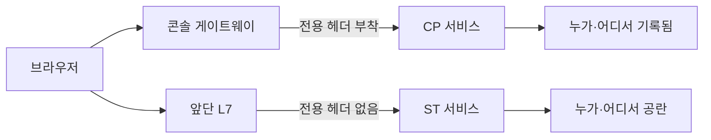

### 2.2 ST 직행 대상 작업

ST 직행 경로로 처리되는 상태변경 작업은 다음과 같습니다 (#2068).

- 단변량 그룹 활성화 / 비활성화
- CSV(스냅샷) 업로드 완료 / 중단

이 작업들은 ST가 요청을 받아 CP 내부 컨트롤러(`UnivariateGroupInternalController`, `InternalIngestController`)로 위임하는데, 그 지점에 감사 애노테이션도 없었고 사용자 식별자도 도착하지 않았습니다.

### 2.3 제약: KR과 JP의 ST 앞단 인프라가 원래 다릅니다

이 문제를 어렵게 만든 근본 제약입니다. 두 리전은 ST 앞단 구성이 처음부터 달랐습니다.

| 항목 | KR (알파 기준) | JP (베타 기준) |
|---|---|---|
| ST 앞단 | NHN Cloud API Gateway (관리형 L7) | API Gateway 없음. 수동 로드밸런서의 443 리스너 |
| 리스너 타입 | API Gateway가 L7로 종단 | `TERMINATED_HTTPS` (L7) |
| XFF를 적는 주체 | API Gateway | 로드밸런서 |
| 우리가 통제 가능한가 | 아니오 (전사 관리형 서비스) | 예 (우리가 직접 운영) |
| 노드 대역 | `192.168.0.x` | `10.137.8.x` (베타), `10.137.12.x` (리얼) |
| 파드·터널 대역 | `10.100.0.0/16` | `192.168.0.0/16` |
| 서비스 대역 | `10.254.x` | `172.30.x` |

KR과 JP는 노드 대역과 파드 대역이 서로 뒤바뀌어 있습니다. 이 대칭이 나중에 JP에서만 터지는 버그의 원인이 됩니다 (5장, 8장 참조).

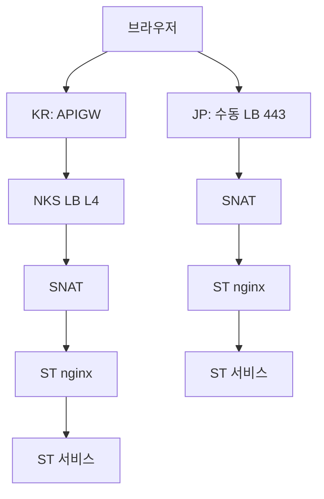

KR은 앞단이 API Gateway라 그 뒤에 NKS 로드밸런서(L4)가 한 단 더 있고, JP는 API Gateway 없이 수동 로드밸런서가 그 자리를 대신하기 때문에 홉 수 자체가 다릅니다.

### 2.4 왜 이게 문제인가

감사 로그에 접속 IP가 없으면 다음이 불가능해집니다.

1. 사고가 났을 때 어디서 들어온 요청인지 추적할 수 없습니다.
2. 특정 IP 대역에서만 일어난 이상 행위를 골라낼 수 없습니다.
3. 고객이 자기 조직의 감사 기록을 봐도 절반이 빈칸이라 감사 요건을 못 채웁니다.

게다가 이 문제는 "코드에서 `request.getRemoteAddr()`를 읽으면 되는 것 아닌가"로 보이지만, 실제로는 애플리케이션이 손댈 수 없는 계층에서 정보가 소실되는 구조적 문제였습니다.

---

## 3. Task: 무엇을 달성해야 했는가

### 3.1 목표

**리전이 무엇이든 상관없이, ST 직행 감사 로그에 실제 사용자의 접속 IP와 사용자 신원이 정확히 남게 만듭니다.**

### 3.2 목표를 쪼갠 세부 요구

| 번호 | 요구 | 왜 필요한가 |
|---|---|---|
| R1 | 실 IP가 어디서, 왜 사라지는지 실측으로 규명 | 추정으로는 해결책을 정할 수 없습니다 |
| R2 | KR/JP 각각에서 실 IP를 앱까지 운반하는 경로 확보 | 인프라가 다르므로 방법도 달라질 수밖에 없습니다 |
| R3 | 애플리케이션 코드에는 리전 분기를 두지 않음 | 리전이 늘 때마다 앱 코드를 고치면 유지보수가 무너집니다 |
| R4 | 클라이언트가 IP를 위조해도 통하지 않음을 실증 | 감사 로그는 신뢰할 수 없으면 존재 의미가 없습니다 |
| R5 | 사용자 신원(uuid)도 함께 전파 | "어디서"만 있고 "누가"가 없으면 감사가 성립하지 않습니다 |

### 3.3 설계 원칙

작업 시작 시점에 세운 원칙입니다.

> **인프라의 차이는 인프라에서 흡수하고, 애플리케이션은 하나의 계약만 본다.**

이 원칙이 이후 모든 결정의 기준이 됩니다. KR에서 플러그인 방식을 고른 것도, JP에서 신뢰 대역 방식을 고른 것도, 결과적으로 앱이 보는 헤더 이름을 통일할 수 있느냐가 판단 기준이었습니다.

---

## 4. Action 1: 문제 구조 규명

### 4.1 접속 IP는 두 번 사라집니다

ST 서비스(`aias-st-ingest-service`)는 `ClusterIP` 타입이라 클러스터 내부에서만 닿습니다. 외부 요청은 인그레스(`st-service-ingress`)와 그 앞의 로드밸런서를 거쳐 들어옵니다. 이 경로에서 출발지 IP가 두 번 바뀝니다.

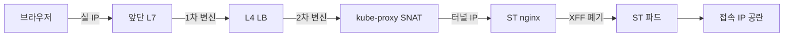

**1차 변신: 로드밸런서 프록시 모드**

NHN Cloud 로드밸런서는 패킷을 그대로 전달하지 않고 "대리 접속"합니다. 클라이언트와 로드밸런서 사이의 연결, 로드밸런서와 백엔드 사이의 연결이 별개의 TCP 연결 두 개입니다.

상담원이 손님 전화를 받아 자기 전화로 담당자에게 다시 걸어 주는 구조라고 보면 됩니다. 담당자에게 찍히는 발신 번호는 손님이 아니라 상담원 번호입니다. 그래서 백엔드가 보는 출발지 IP는 실 클라이언트가 아니라 로드밸런서의 IP가 됩니다.

**2차 변신: 쿠버네티스 SNAT**

로드밸런서 서비스(`ingress-nginx-public-controller`)가 `externalTrafficPolicy: Cluster`로 설정돼 있습니다. 이 설정은 요청을 임의 노드로 보낸 뒤 실제 파드가 있는 노드로 다시 넘깁니다. 이때 응답이 되돌아갈 경로를 확보하려고 출발지 IP를 경유 노드의 Calico VXLAN 터널 주소(파드망 IP)로 한 번 더 바꿉니다.

| 항목 | 값 | 의미 |
|---|---|---|
| 타입 | `LoadBalancer` | 외부 공인 IP로 트래픽 수신 |
| `externalTrafficPolicy` | `Cluster` | 아무 노드로 넘긴 뒤 kube-proxy가 파드로 재전달 (SNAT 발생) |
| nginx `use-forwarded-headers` | 미설정 | 상위에서 온 실 IP(XFF)를 신뢰하지도, 보존하지도 않음 |

### 4.2 SNAT 실측: 관측값이 특정 워커 노드의 터널 주소와 일치했습니다

ST nginx 로그에 찍히는 `remote_addr` 값을 관측하니 요청마다 값이 달랐습니다.

| 관측된 값 | 정체 |
|---|---|
| `10.100.55.0` | worker-node-0의 `vxlan.calico` 터널 주소 |
| `10.100.225.0` | worker-node-5의 `vxlan.calico` 터널 주소 |
| 노드 IP | nginx 파드가 있는 노드로 바로 들어온 경우 |

이 값들이 실제로 각 워커 노드의 `vxlan.calico` 인터페이스 주소와 **글자 단위로 일치하는 것**을 클러스터 조회로 확인했습니다. 즉 이 IP는 사용자와 아무 관계가 없는, 순수하게 쿠버네티스가 만들어낸 내부 주소였습니다.

### 4.3 왜 요청마다 값이 널뛰는가

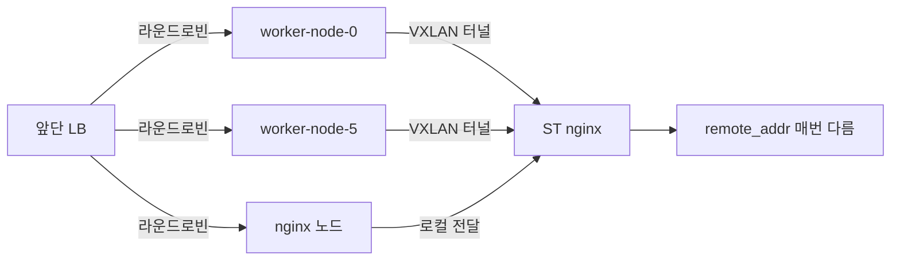

로드밸런서가 노드 NodePort로 라운드로빈하기 때문에 요청이 어느 노드에 착지하느냐가 매번 달라집니다.

- nginx 파드가 **없는** 노드에 착지하면 VXLAN을 타면서 소스가 그 노드의 터널 주소로 바뀝니다.
- nginx 파드가 **있는** 노드에 착지하면 로컬 전달이라 노드 IP로 보입니다.

둘 다 SNAT의 산물이고 실 IP는 아닙니다. 이 "널뜀"은 나중에 JP CP의 복불복 버그(8장)에서 다시 등장합니다.

### 4.4 CAB에도 물어봤지만 IP는 없었습니다

신원 검증에 이미 쓰고 있던 CAB에 접속 IP도 있는지 확인했습니다. 결과는 없음이었습니다.

- 토큰 자체에 IP가 담기지 않습니다.
- CAB 응답 객체에도 IP 필드가 없습니다.
- CAB는 토큰에서 "누구(uuid)"만 풀어 줍니다.

**결론: 실 IP는 파드에 도달하기 전에 두 번 지워지므로, 패킷 출발지 주소만으로는 앱 코드가 접속 IP를 채울 방법이 없습니다.**

### 4.5 반전: 실 IP는 HTTP 헤더에 살아 있었습니다

여기가 이 작업의 전환점입니다.

패킷의 출발지 주소(L3)는 위처럼 죽지만, **실 IP는 `X-Forwarded-For`(XFF) 헤더에 살아 있습니다.** XFF는 요청을 대신 전달하는 중간 L7 장비가 "원래 클라이언트는 이 IP"라고 적어 주는 HTTP 헤더입니다.

핵심은 이것입니다.

> **SNAT는 IP 패킷의 겉면(출발지 필드)만 바꾸고 HTTP 헤더는 건드리지 않습니다.**

SNAT는 3계층(네트워크 계층)에서 동작하고 HTTP 헤더는 7계층(응용 계층)의 데이터입니다. 계층이 다르니 서로 간섭하지 않습니다. 그래서 앞단 L7이 적어 준 실 IP가 SNAT를 그대로 통과해 nginx까지 도달합니다.

양 리전에서 실측으로 확인했습니다.

| 리전 | 실 IP를 적는 주체 | ST nginx에 도착한 XFF |
|---|---|---|
| KR | API Gateway (L7) | `xff="10.78.214.50, 10.165.160.x"` (첫 값이 사내 실 IP) |
| JP | ST 앞 로드밸런서 443 리스너 (`TERMINATED_HTTPS`, L7) | `xff="<사무실 공인 IP>"` |

이 동작은 NHN Cloud 로드밸런서 공식 문서와도 일치합니다. XFF 헤더 삽입은 `HTTP` / `TERMINATED_HTTPS` 리스너에서 기본값으로 켜져 있고(`enable_x_forwarded_for` 기본 `true`), `TCP` 리스너에서는 제공되지 않습니다. JP ST 앞 리스너가 443 `TERMINATED_HTTPS`라서 XFF가 별도 설정 없이 이미 오고 있었습니다.

### 4.6 그럼 왜 앱에는 안 왔나

XFF가 nginx까지는 왔는데 앱까지는 못 왔습니다. 이유는 nginx의 기본 동작입니다.

`use-forwarded-headers`가 꺼져 있으면 nginx는 상위에서 온 XFF를 신뢰하지 않고, 자기가 본 소스 IP(즉 SNAT된 터널 IP)로 덮어써서 백엔드에 넘깁니다. 보안 관점에서는 합리적인 기본값입니다. 신뢰할 수 없는 출처가 보낸 XFF를 그대로 믿으면 IP 위조가 가능해지기 때문입니다.

**즉 문제는 "정보가 없다"가 아니라 "정보는 있는데 nginx가 안전을 위해 버리고 있다"였습니다.** 그래서 해결책은 "nginx에게 어디까지 믿어도 되는지 알려주는 것"이 됩니다.

---

## 5. Action 2: 리전별 인프라 차별화 설정 (이 작업의 핵심)

### 5.1 왜 리전마다 다른 방법을 써야 했는가

실 IP가 XFF에 있다는 것까지는 양 리전이 같습니다. 그런데 그 IP를 뽑아내는 방법은 다를 수밖에 없었습니다.

| 판단 축 | KR | JP |
|---|---|---|
| 앞단 소유권 | 전사 관리형 API Gateway (우리 통제 밖) | 우리가 직접 띄운 nginx ingress + 수동 LB |
| 앞단이 XFF에 적는 내용 | 실 IP + API Gateway 내부 홉 IP 여러 개 | 실 IP 한 개 |
| 신뢰 대역을 지정할 수 있는가 | 내부 홉 대역을 우리가 모름 | 우리가 직접 만든 대역이라 정확히 앎 |
| 헤더를 직접 세팅할 수단 | 있음 (API Gateway 플러그인) | 없음 (관리형 게이트웨이가 없음) |

이 표가 리전별로 다른 해법을 택한 이유 전부입니다. **같은 목표에 도달하는 두 개의 다른 길이 있었고, 각 리전에서 쓸 수 있는 도구가 달랐습니다.**

### 5.2 KR 리전 해결책: API Gateway 요청 헤더 변경 플러그인

#### 5.2.1 무엇을 했는가

NHN Cloud API Gateway의 "요청 헤더 변경(SET_REQUEST_HEADER)" 플러그인을 스테이지에 추가해서, API Gateway가 실제로 본 클라이언트 IP를 확정 헤더에 직접 세팅하게 했습니다.

| 항목 | 값 |
|---|---|
| 플러그인 | 요청 헤더 변경 (`SET_REQUEST_HEADER`) |
| 헤더 이름 | `X-Client-Ip` |
| 헤더 값 | `${request.clientIp}` |
| 반영 위치 | `system-tenant-public-api.json` 감사 리소스 + 기존 테넌트 reconcile |

#### 5.2.2 왜 XFF 신뢰 대역 방식을 안 썼는가

API Gateway는 실 클라이언트 IP를 XFF에 "혼자만" 적지 않습니다. 사내 내부 홉을 여러 단 거치면서 각 홉이 자기가 본 IP를 XFF에 덧붙입니다. 그래서 ST nginx에는 실 IP와 함께 API Gateway 내부 홉 IP들이 섞여서 도착합니다.

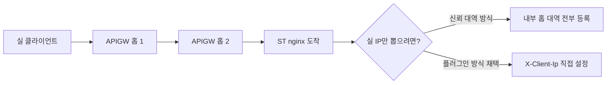

nginx 신뢰 대역 방식을 쓰려면 API Gateway 내부 홉 대역(관측값 `10.165.160.x`)을 전부 알아서 신뢰 대역에 등록해야 합니다. 그런데 이 대역은 우리가 통제할 수 없고 변동적입니다. 실제로 문서에 적힌 라우터 대역과 관측값이 서로 달랐습니다.

즉 신뢰 대역 방식을 택하면 **남의 팀 인프라의 IP 대역 변경을 우리가 계속 추적해야 하는 운영 부채**가 생깁니다.

#### 5.2.3 플러그인 방식을 택한 근거 4가지

| 번호 | 근거 | 설명 |
|---|---|---|
| 1 | API Gateway 사내망 대역을 알 필요가 없습니다 (가장 큰 이유) | 플러그인이 `${request.clientIp}`로 실 IP를 곧바로 주므로 내부 홉 대역 추적 자체가 사라집니다 |
| 2 | API Gateway 팀 공식 권고와 일치합니다 | 소스 식별에는 `X-Forwarded-*` 계열 대신 "요청 헤더 변경" 플러그인을 쓰라는 것이 API Gateway 팀 안내이며, 타 서비스(RDS)도 이 방식으로 해결한 선례가 있습니다 |
| 3 | ST 코드에 리전 분기가 필요 없습니다 | 플러그인이 실 IP를 확정 헤더에 설정하므로 앱은 헤더 하나만 읽으면 됩니다 |
| 4 | 프로비저닝에 플러그인만 추가하면 됩니다 | 온보딩 시 API Gateway 템플릿에 플러그인을 한 번 넣으면 신규 테넌트에 자동 적용됩니다 |

#### 5.2.4 KR 처리 흐름

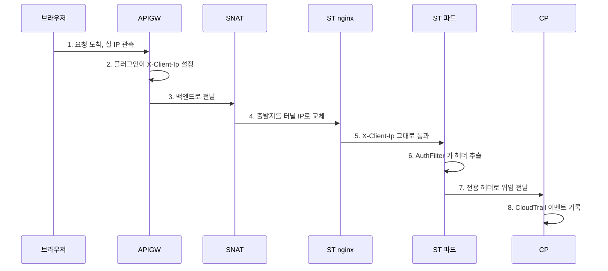

4단계에서 패킷의 출발지가 바뀌지만 2단계에서 넣은 HTTP 헤더는 그대로 살아남습니다. KR nginx는 이 헤더를 건드릴 이유가 없으므로 **별도 nginx 설정 없이 통과**합니다.

#### 5.2.5 KR 알파 실증

| 시점 | ST가 관측한 IP | 정체 |
|---|---|---|
| 플러그인 적용 **전** | `10.100.x.x` | NKS 노드/터널 IP (SNAT 산물) |
| 플러그인 적용 **후** | `10.78.214.50` | 실제 사용자 IP |

알파 환경에서 플러그인 추가 전후를 직접 비교해 확인했습니다 (#2075 댓글, 2026-07-23).

추가로 신규 온보딩 경로도 검증했습니다. 프로비저닝 시 `X-Client-Ip` 커스텀 헤더가 API Gateway 템플릿에 들어가도록 넣어 두고, 실제로 온보딩을 한 번 돌려 헤더가 주입되는 것을 확인했습니다.

#### 5.2.6 운영 함정 하나

API Gateway 콘솔에서 플러그인을 추가하고 스테이지 "적용"만 누르면 실제로는 반영되지 않습니다. **"적용" 후 "배포(Deploy)" 버튼을 따로 눌러야 실제 반영됩니다.** 이 함정 때문에 처음 검증에서 변화가 없어 보였고, 이후 런북에 기록했습니다.

### 5.3 JP 리전 해결책: nginx ingress 신뢰 대역 설정

#### 5.3.1 무엇을 했는가

JP는 API Gateway가 없으므로 플러그인을 쓸 수 없습니다. 대신 우리가 직접 운영하는 nginx ingress에 두 줄을 넣어, XFF에 이미 담겨 온 실 IP를 뽑아 `X-Real-IP` 헤더로 앱에 전달하게 했습니다.

| 설정 키 | 값 | 의미 |
|---|---|---|
| `use-forwarded-headers` | `"true"` | 상위에서 온 XFF를 신뢰하고 보존 |
| `proxy-real-ip-cidr` | `"192.168.0.0/16,10.137.0.0/16"` | 이 대역에서 온 홉은 우리 인프라이므로 건너뛰고 그 밖의 첫 IP를 실 IP로 채택 |

두 번째 값이 이 설정의 핵심입니다. 각 대역의 정체는 다음과 같습니다.

| 대역 | 정체 | 왜 신뢰 대역에 넣는가 |
|---|---|---|
| `192.168.0.0/16` | JP ST 파드·터널망 | SNAT가 만들어낸 우리 내부 주소이므로 실 IP가 아님 |
| `10.137.0.0/16` | JP 노드·LB 서브넷 | 로드밸런서와 노드가 남긴 홉이므로 실 IP가 아님 |

노드 서브넷을 `/16`으로 넓게 잡은 이유가 있습니다. 클러스터마다 노드 서브넷이 달랐습니다. 베타는 `10.137.8.x`, 리얼은 `10.137.12.x`로 실측됐습니다. 두 개를 따로 열거하면 클러스터가 늘 때마다 설정을 고쳐야 하므로 상위 `/16`으로 묶었습니다.

#### 5.3.2 JP 앞단 정보

| 항목 | 값 |
|---|---|
| ST 앞 로드밸런서 | `plai-st-dev-ingress-nginx-public-lb` |
| 리스너 | 443, `TERMINATED_HTTPS` (L7) |
| XFF 삽입 | `enable_x_forwarded_for` 기본 `true`라 별도 설정 없이 이미 동작 중 |

#### 5.3.3 JP 처리 흐름

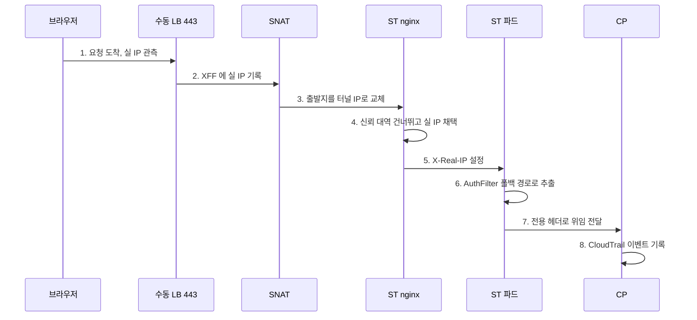

KR과 비교하면 4단계와 5단계가 다릅니다. KR은 앞단이 헤더를 이미 확정해 줬으므로 nginx가 아무것도 안 해도 됐지만, JP는 nginx가 XFF를 해석하는 일을 직접 해야 합니다.

#### 5.3.4 JP 베타 실증

베타 JP 환경에서 `use-forwarded-headers` 설정 전후를 비교해 실 IP가 잡히는 것을 확인했습니다 (#2075 댓글, 2026-07-23).

#### 5.3.5 배포 전략: 신규는 자동, 기존은 수동 1회

| 대상 | 방법 |
|---|---|
| 신규 온보딩 테넌트 | `init-step01-infra` 0.1.2부터 자동 적용 |
| 이미 떠 있는 클러스터 | `helm upgrade` 1회 수동 실행 |

**무중단인 이유**: 변경 내용이 ConfigMap 2줄뿐이라 nginx 파드가 재시작되지 않고 graceful reload만 일어납니다. 실제로 베타 JP1은 2026-07-23에 적용 완료했고 리비전 2가 됐으며 파드 재시작이 없었음을 확인했습니다.

리얼 JP1(NetLearning)은 배포일에 같은 절차를 적용하도록 런북에 남겼습니다. 절차의 뼈대는 다음과 같습니다.

1. **사전 확인 (조회만)**: 설치된 차트 버전이 4.14.3인지, 현재 values에 `config` 항목이 없는지 확인
2. **적용**: 차트 버전을 설치본과 동일하게 고정한 채 `helm upgrade`. 네임스페이스는 `ingress-nginx-public`, 서비스 타입은 `NodePort`, HTTP 31080 / HTTPS 31443
3. **검증**: ConfigMap 반영 확인, 파드 무재시작 확인, graceful reload 로그 확인
4. **롤백 대비**: 문제 시 이전 리비전으로 `helm rollback`

차트 버전을 명시적으로 고정한 이유는 `helm upgrade` 시 저장소의 최신 차트를 끌어와 의도치 않은 대규모 변경이 일어나는 것을 막기 위해서입니다.

### 5.4 두 리전 해결책 비교 정리

| 구간 | AS-IS | TO-BE |
|---|---|---|
| KR 앞단 | API Gateway가 XFF에 실 IP를 적지만 nginx가 버림 | API Gateway 요청 헤더 변경 플러그인이 `X-Client-Ip`에 실 IP를 확정 세팅 |
| JP 앞단 | 로드밸런서가 XFF에 실 IP를 적지만 nginx가 버림 | nginx `use-forwarded-headers` + 신뢰 대역 설정으로 실 IP를 `X-Real-IP`에 세팅 |
| ST 코드 | 접속 IP를 읽지 않음 | `X-Client-Ip` 우선, 없으면 `X-Real-IP` 폴백. **리전 분기 없음** |
| CP (KR) | 전용 헤더 폴백이 정상 동작 | 변경 없음 |
| CP (JP) | 내부망 판정이 `10.` 접두어만이라 터널 대역(`192.168.x`)을 외부로 오판 | 내부망 판정을 사설 대역 전체(RFC1918)로 확장 |

한 문장으로 정리하면 이렇습니다.

> **패킷 출발지 IP는 SNAT로 사라지므로 실 IP는 HTTP 헤더로 운반합니다. KR은 API Gateway 플러그인이 `X-Client-Ip`에, JP는 nginx 신뢰 대역이 `X-Real-IP`에 실 IP를 설정하고, ST는 한 헤더만 읽어 CP로 전달하며, CP가 CloudTrail에 기록합니다.**

---

## 6. Action 3: 애플리케이션은 리전 분기 없이 통합 처리

### 6.1 설계

인프라가 리전마다 다른 헤더 이름으로 실 IP를 실어 보내게 됐습니다. 그러면 앱이 리전을 알아야 할까요? 아닙니다.

앱은 **헤더 우선순위 목록**만 갖습니다.

| 순위 | 헤더 | 채우는 주체 |
|---|---|---|
| 1 | `X-Client-Ip` | KR API Gateway 플러그인 |
| 2 | `X-Real-IP` | JP nginx `real_ip` 출력 |
| 없으면 | `null` | 감사 IP 공란 (이전 상태와 동일, 회귀 없음) |

`aias-st-shared-core`의 `AuthFilter.extractClientIp`가 이 순서로 읽습니다. 코드에 `if (region == KR)` 같은 분기가 한 줄도 없습니다.

### 6.2 왜 이게 좋은 설계인가

| 관점 | 리전 분기 방식이라면 | 헤더 우선순위 방식 |
|---|---|---|
| 리전 추가 시 | 앱 코드에 분기 추가 → 빌드 → 배포 → 전 리전 회귀 테스트 | 헤더 목록에 한 줄 추가. 혹은 기존 헤더 이름을 재사용하면 앱 변경 자체가 0 |
| 리전 식별 | 앱이 자기가 어느 리전에 떠 있는지 알아야 함 (설정 주입, 환경변수 오염) | 앱은 리전을 몰라도 됨 |
| 인프라 변경 시 | 앞단 방식이 바뀌면 앱도 같이 바꿔야 함 | 앞단이 약속한 헤더만 채워 주면 앱 무변경 |
| 테스트 | 리전 수만큼 분기 경로를 테스트해야 함 | 헤더 유무 조합만 테스트하면 됨 |
| 장애 반경 | 한 리전 로직 실수가 배포 전체에 실림 | 인프라 설정 실수는 그 리전에서만 격리됨 |

핵심은 **책임 경계를 헤더 계약으로 그었다**는 점입니다. 인프라는 "실 IP를 이 헤더 중 하나에 넣는다"까지만 책임지고, 앱은 "이 헤더들을 순서대로 읽는다"까지만 책임집니다. 서로의 구현 세부를 몰라도 됩니다.

### 6.3 전달 경로

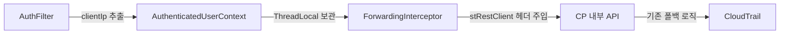

| 단계 | 컴포넌트 | 하는 일 |
|---|---|---|
| 1 | `AuthFilter.extractClientIp` | 우선순위대로 헤더를 읽어 접속 IP를 확보 |
| 2 | `AuthenticatedUserContext` (ThreadLocal) | 요청 범위에 uuid와 clientIp를 함께 보관 |
| 3 | `UserIdentityForwardingInterceptor` | 공유 `stRestClient`가 CP를 호출할 때 헤더를 자동 주입 |
| 4 | CP `CloudTrailInterceptor` | 기존 `X-TC-CONSOLE-CLIENT-IP` 폴백 로직이 그대로 값을 채움 |

**CP와 게이트웨이는 한 줄도 바꾸지 않았습니다.** ST가 CP 직행과 똑같은 모양(`X-TC-CONSOLE-CLIENT-IP`)으로 전달하도록 맞췄기 때문에, CP 입장에서는 요청이 콘솔 게이트웨이에서 온 것인지 ST에서 온 것인지 구분할 필요가 없습니다.

이것도 같은 설계 원칙의 연장입니다. 새 경로를 추가할 때 수신 측을 고치는 대신 발신 측이 기존 계약을 맞추게 하면, 수신 측 회귀 위험이 0이 됩니다.

---

## 7. Action 4: 보안 검증 (위조 IP 주입 실험)

### 7.1 왜 검증이 필요했는가

XFF 방식에는 유명한 함정이 있습니다. XFF는 클라이언트가 마음대로 붙일 수 있는 평범한 HTTP 헤더입니다. 공격자가 `X-Forwarded-For: 1.2.3.4`를 직접 실어 보내면 감사 로그에 남의 IP가 찍힐 수 있습니다.

**감사 로그는 위조 가능하면 존재 의미가 없습니다.** 그래서 "우리 구성에서는 위조가 통하지 않는다"를 추정이 아니라 실험으로 확인했습니다.

### 7.2 실험 방법

가짜 IP `6.6.6.6`을 XFF 헤더에 직접 주입한 프로브 요청을 KR과 JP 양쪽에 보내고, ST nginx 로그에 어떤 XFF가 도착하는지 관측했습니다.

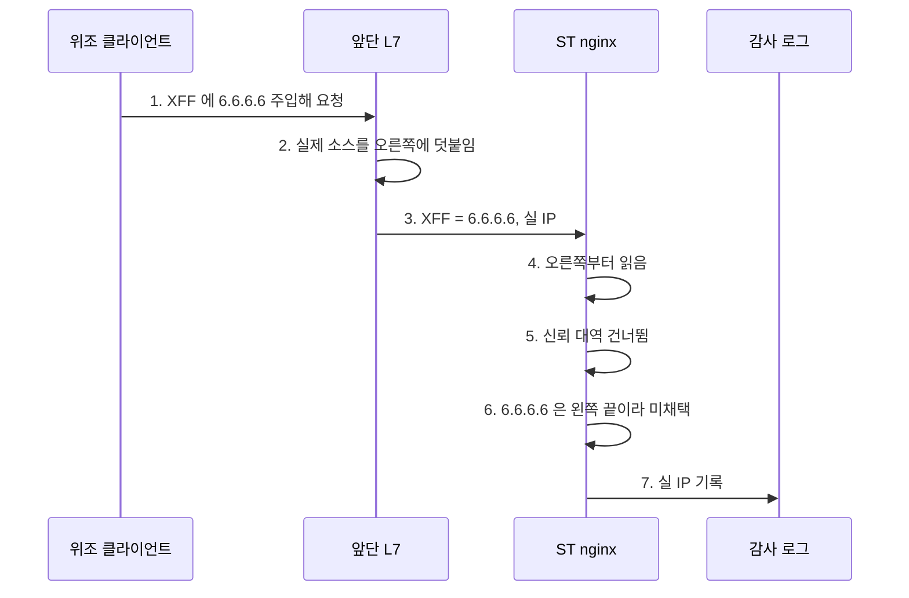

### 7.3 실험 결과

| 프로브 | KR nginx 도착 XFF | JP nginx 도착 XFF |
|---|---|---|
| 위조 (`6.6.6.6` 주입) | `6.6.6.6, 10.78.214.50, 10.165.160.x` | `6.6.6.6, <사무실 공인 IP>` |
| 정상 | `10.78.214.50, 10.165.160.x` | `<사무실 공인 IP>` |

### 7.4 왜 위조가 통하지 않는가

XFF는 **왼쪽이 가장 오래된 값, 오른쪽이 가장 최근 홉이 적은 값**입니다. 중간 L7 장비는 기존 값을 지우지 않고 자기가 실제로 본 소스 IP를 **오른쪽에 덧붙입니다(append)**.

그래서 위조 프로브의 결과를 보면, 공격자가 주입한 `6.6.6.6`은 맨 왼쪽에 남고 앞단 L7이 실제로 관측한 IP가 그 오른쪽에 붙습니다.

nginx를 "XFF를 **오른쪽부터** 읽어 신뢰 대역을 건너뛰고 처음 만나는 신뢰 대역 밖 IP를 채택"하도록 설정하면, 위조한 `6.6.6.6`은 왼쪽 끝이라 절대 채택되지 않습니다.

정리하면 이렇습니다.

| 조건 | 결과 |
|---|---|
| 앞단 L7이 append하지 않고 덮어쓴다면 | 위조 방어 불가 (하지만 실측 결과 append함) |
| nginx가 왼쪽부터 읽는다면 | 위조가 통함 (그래서 오른쪽부터 읽도록 설정) |
| 신뢰 대역을 지정하지 않는다면 | 우리 인프라 홉이 실 IP로 오인됨 (그래서 대역 지정) |
| 위 세 조건이 모두 갖춰진 우리 구성 | **위조 불가** |

KR은 여기에 더해 API Gateway 플러그인이 `${request.clientIp}`(API Gateway가 TCP 연결에서 직접 본 값)로 헤더를 **확정 세팅**하므로, 클라이언트가 `X-Client-Ip`를 위조해 보내도 플러그인이 덮어씁니다. XFF 파싱에 의존하지 않는 만큼 방어가 한 겹 더 두껍습니다.

**결론: 두 리전 모두 XFF 기반 실 IP 확보 방식이 위조에 안전함을 실증으로 확인했습니다.**

### 7.5 실측 절차의 안전성

이 검증 과정에서 KR/JP nginx의 로그 포맷에 XFF 칸을 임시로 추가해 관측했고, 검증이 끝난 뒤 **전부 원복했습니다** (2026-07-22 ~ 23). 클러스터 조회는 전부 읽기 전용으로 수행했습니다.

---

## 8. Action 5: 추가 버그 수정 (JP CP 내부망 판정 확장)

### 8.1 발견 경위

ST 직행 IP 문제를 조사하다가, ST가 아닌 **CP 직행 경로**에서도 JP만 감사 IP가 이상하게 찍히는 것을 발견했습니다. 같은 접속 IP 문제라 이번 작업에 함께 넣었습니다.

### 8.2 원인: `10.` 접두어만 검사하던 내부망 판정

CP의 `CloudTrailInterceptor`에는 이미 폴백 로직이 있었습니다. "요청의 소스 IP가 내부망이면 그건 실 사용자 IP가 아니니 `X-TC-CONSOLE-CLIENT-IP` 헤더 값을 대신 쓴다"는 로직입니다.

문제는 그 "내부망 판정"이 문자열 접두어 하나로 되어 있었다는 점입니다.

| 항목 | AS-IS |
|---|---|
| 상수 | `INTERNAL_IP_PREFIX = "10."` |
| 판정 | IP 문자열이 `10.`으로 시작하면 내부망 |

KR에서는 이것으로 충분했습니다. KR CP의 파드망이 `10.100.x`라서 항상 `10.`으로 시작합니다. 그런데 **JP는 파드·터널 대역이 `192.168.0.0/16`입니다.**

### 8.3 왜 "복불복"이었는가

4장에서 본 SNAT 널뜀이 여기서 그대로 재현됐습니다.

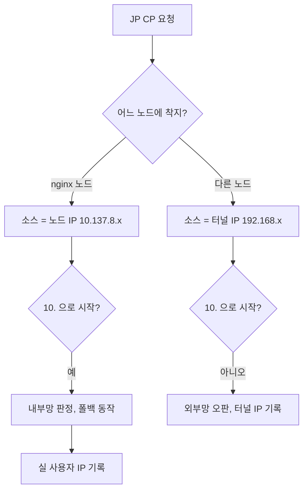

| 착지한 노드 | SNAT 결과 소스 IP | `10.` 접두어 판정 | 결과 |
|---|---|---|---|
| nginx 파드가 있는 노드 | `10.137.8.x` (노드 IP) | 내부망으로 정상 판정 | 폴백 동작 → 실 IP 기록 |
| 다른 노드 | `192.168.x` (터널 IP) | **외부망으로 오판** | 폴백 미동작 → 터널 IP를 실 IP인 줄 알고 기록 |

로드밸런서가 노드를 라운드로빈하므로 요청마다 결과가 갈립니다. 그래서 **같은 사용자가 같은 브라우저에서 연속으로 작업해도 감사 IP가 맞았다 틀렸다** 했습니다.

### 8.4 실측 사례: 16초 간격의 두 요청

같은 사용자가 JP 콘솔에서 차트 작업을 연속으로 한 기록입니다.

| 시각 간격 | 작업 | 기록된 감사 IP | 정체 |
|---|---|---|---|
| 기준 | 차트 생성 | `192.168.140.128` | **터널 IP (오판)** |
| +16초 | 차트 수정 | `10.78.66.36` | 실 사용자 IP (정상) |

16초 간격의 같은 사용자 요청인데 한 번은 클러스터 내부 주소가, 한 번은 실 IP가 찍혔습니다. 이 두 줄이 "복불복"이라는 진단의 결정적 증거였습니다.

### 8.5 수정: RFC1918 전체로 확장

내부망 판정 범위를 사설 IP 대역 전체로 넓혔습니다.

| 대역 | 표기 | 원래 판정 | 수정 후 판정 |
|---|---|---|---|
| `10.0.0.0/8` | 클래스 A 사설 | 내부망 | 내부망 |
| `172.16.0.0/12` | 클래스 B 사설 | **외부망 (오판)** | 내부망 |
| `192.168.0.0/16` | 클래스 C 사설 | **외부망 (오판)** | 내부망 |

RFC1918은 인터넷에서 라우팅되지 않는 사설 IP 대역을 규정한 표준입니다. 이 세 대역의 IP가 감사 로그에 "사용자 접속 IP"로 찍히는 일은 정의상 있을 수 없으므로, 전부 내부망으로 보고 폴백을 태우는 것이 맞습니다.

수정 후에는 JP CP에서도 착지 노드와 무관하게 항상 폴백이 동작합니다. KR은 파드망이 `10.100.x`라 원래 문제가 없었고, 이번 수정으로도 동작이 바뀌지 않습니다 (`10.` 대역은 확장 전후 모두 내부망).

### 8.6 이 버그에서 배운 것

문자열 접두어로 IP 대역을 판정하는 코드는 **그 코드를 작성한 환경에서만 맞습니다.** KR 파드망이 `10.100.x`라는 사실이 코드에 암묵적으로 박혀 있었고, 리전이 늘어나면서 그 가정이 깨졌습니다.

표준(RFC1918)에 기대어 판정하면 환경이 늘어도 코드가 버팁니다. 이것은 6장에서 세운 "리전 분기를 앱에 두지 않는다"는 원칙과 같은 방향의 교훈입니다.

---

## 9. Action 6: 사용자 신원 전파 (누가를 채우기)

### 9.1 문제: "어디서"보다 먼저 비어 있던 "누가"

접속 IP 작업(#2075)보다 하루 먼저 시작한 작업입니다 (#2068). ST 직행 경로는 IP뿐 아니라 사용자 신원도 비어 있었습니다.

원인이 두 가지 겹쳐 있었습니다.

| 원인 | 내용 |
|---|---|
| 1 | ST가 CP로 위임할 때 appKey(`X-NC-APP-KEY`)만 넘기고 사용자 식별자는 안 넘겼습니다 |
| 2 | 사용자 식별자는 콘솔 토큰 안에 있는데, 그 토큰이 암호화 토큰이라 ST가 열지 못했습니다 |

### 9.2 실측: 콘솔 토큰은 5파트 JWE였습니다

두 번째 원인을 확인하려고 ST로 전달되는 실제 콘솔 토큰을 뜯어봤습니다 (2026-07-21).

| 항목 | 실측값 |
|---|---|
| 형식 | 5파트 JWE (점으로 구분된 5개 조각) |
| 키 암호화 알고리즘 | `alg=A256KW` |
| 콘텐츠 암호화 알고리즘 | `enc=A256GCM` |

JWT(서명만 된 토큰)라면 페이로드가 Base64 인코딩일 뿐이라 누구나 읽을 수 있습니다. 그런데 JWE는 **암호화된 토큰**이고, 복호화 키는 발급처(CAB/OAuth 서버)에만 있습니다.

**즉 ST는 토큰이 유효한지 검증만 할 수 있고 안에 든 사용자 식별자는 읽을 수 없습니다.** 그래서 신원은 CAB를 거쳐야만 얻을 수 있다는 것이 확정됐습니다.

### 9.3 해결 아이디어: 이미 하고 있던 질의를 한 단계만 바꾸기

ST는 토큰 검증을 위해 이미 CAB에 질의하고 있었습니다. 그런데 그 질의가 "통과했느냐"만 묻고 있었습니다.

| 지점 | AS-IS | TO-BE |
|---|---|---|
| CAB 질의 | `PermissionService.checkPermission` (통과 여부만, 반환 `void`) | `PermissionService.getPermission`으로 교체해 응답의 `getUuid()`까지 수신 |
| CP Gateway `verify-token` | 200 / 401만 응답 | 응답 본문에 사용자 uuid (+ orgId / projectId) 포함 |
| ST 토큰 검증 | 검증 후 신원 버림 | 받은 uuid를 요청 범위에 보관 |
| ST에서 CP로 위임 | appKey만 전달 | `X-NHN-uid` 헤더로 uuid 함께 전달 |
| CP internal 컨트롤러 | 감사 애노테이션 없음 | 대상 메서드에 감사 애노테이션 부착 |

**같은 CAB SDK에 사용자 식별자를 돌려주는 메서드가 이미 있었습니다.** 새 시스템을 붙이거나 외부 호출을 추가한 것이 아니라, 이미 왕복하고 있던 호출의 응답을 더 활용한 것입니다. 추가 네트워크 왕복이 0입니다.

또한 CP의 CloudTrail 인터셉터는 `X-NHN-uid`와 `X-NC-APP-KEY` 헤더를 **이미 읽도록** 되어 있었습니다. ST가 uuid만 실어 주면 "누가"가 그대로 채워집니다. CP 인터셉터 수정이 필요 없었습니다.

### 9.4 신원 전파 경로

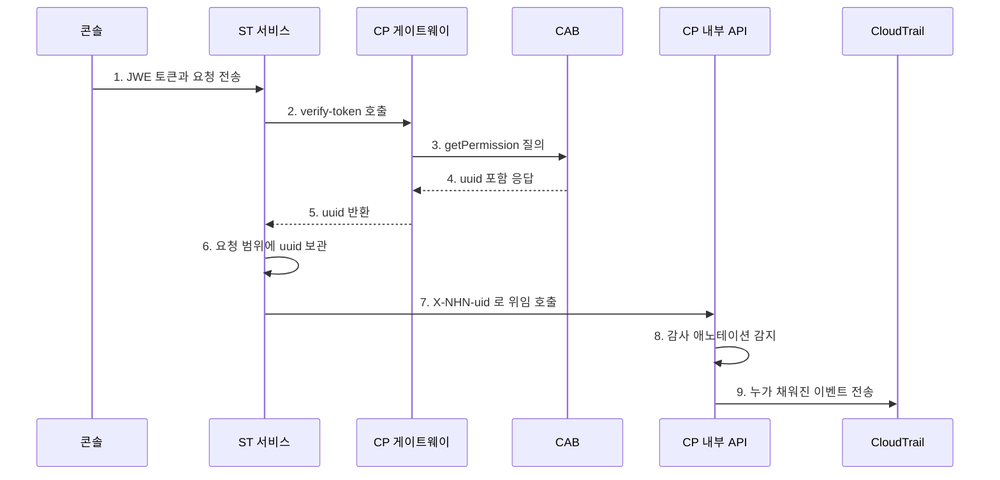

### 9.5 4개 모듈에 걸친 변경

전체가 CP와 ST 양쪽에 걸쳐 있어 슬라이스로 나눠 진행했습니다.

| 순서 | 슬라이스 | 모듈 |
|---|---|---|
| 1 | `verify-token`이 CAB `getPermission`으로 사용자 uuid를 받아 응답에 반환 | `aias-gateway` |
| 2 | ST가 uuid를 받아 요청 범위에 보관 (검증기, 필터, 캐시) | `aias-st-shared-core` |
| 3 | ST에서 CP로 위임 시 `X-NHN-uid` 헤더 주입 | `aias-st-ingest-service` |
| 4 | CP internal 컨트롤러에 감사 애노테이션 + 신규 이벤트 정의 | `aias-resource-api` |

**슬라이스를 이 순서로 자른 이유**는 각 단계가 독립적으로 배포 가능하고 앞 단계가 없어도 뒤 단계가 깨지지 않기 때문입니다. 1번만 배포되면 게이트웨이 응답에 필드가 하나 늘 뿐이고, 3번만 배포되면 헤더가 하나 더 붙을 뿐입니다. 어느 지점에서 멈춰도 기존 동작은 유지됩니다.

### 9.6 완료 기준과 검증

| 기준 | 결과 |
|---|---|
| CP Gateway `verify-token` 응답에 사용자 uuid 포함 | 완료 |
| ST가 uuid를 요청 범위에 보관하고 CP 위임에 `X-NHN-uid`로 전달 | 완료 |
| 대상 CP internal 컨트롤러에 감사 애노테이션 부착 | 완료 |
| 필요한 신규 이벤트가 `CloudTrailEvent`에 정의됨 | 완료 (단변량 그룹 활성/비활성 2종) |
| 콘솔에서 해당 작업 수행 시 CloudTrail에 "누가"가 채워진 이벤트가 남음 | 완료 |
| 그 uuid가 콘솔 직행에서 쓰는 `X-NHN-uid`와 같은 식별자임을 1회 대조 확인 | 완료 |
| 각 모듈이 단위 테스트 포함 빌드 통과 | 완료 |

알파에서 이벤트 수집 API를 켜고 끄며 실증했고, 감사 로그에 사용자 이메일이 정상 표시되는 것을 확인했습니다.

### 9.7 의도적으로 제외한 것

| 항목 | 이유 |
|---|---|
| 쿼리 실행 | 상태를 바꾸지 않는 읽기이고, 차트·대시보드 렌더마다 불리는 고빈도라 감사 대상이 아닙니다 |
| 추천 추론 | 고빈도 데이터 경로라 감사 대상이 아닙니다 |
| NCA 다국어 이름 등록 | 신규 이벤트에 한해 구현 뒤 별도 진행 (기존 등록 스크립트 재사용) |

---

## 10. 부가 성과

### 10.1 미납 리소스 자동 정리 API 신설 (#2022)

#### 10.1.1 문제: 전사 규격과 우리 구현이 어긋나 있었습니다

NHN Cloud는 미납 고객에 대해 단계적으로 자동 조치를 진행합니다.

| 단계 | 시점 |
|---|---|
| 자동 결제 시도 | 매월 8일 ~ 14일 |
| 계정 블록 | 15일 00:30 |
| 리소스 이용 정지 | 23일 00:30 |
| 리소스 삭제 | 매월 말일 00:30 |
| 블랙리스트 등록 | 말일 01:00 |

리소스 삭제 단계에서 CAB는 상품별로 **"리소스 삭제 API를 먼저 호출하고, 그 다음 비활성화 API를 호출"**합니다. 리소스 삭제 API는 비활성화 동작을 포함하지 않는 별도 API라는 것이 전사 규격으로 확정된 사항입니다.

그런데 우리 서비스의 비활성화(오프보딩)는 **사가 시작 전에 서빙/데이터 파이프라인이 전부 삭제된 상태인지 검증하고, 남아 있으면 실패**합니다. 우리에게는 리소스 삭제 API가 없었으므로, 미납 고객에게 파이프라인이 남아 있으면 비활성화가 통째로 실패했습니다.

여기에 우리 구조의 특수성이 겹칩니다. **우리 ST 인프라는 고객 조직이 아니라 우리 조직의 시스템 테넌트 프로젝트에 있습니다.** CAB가 미납 조직/프로젝트를 삭제해도 우리 인프라는 정리되지 않습니다. 우리 오프보딩이 끝까지 돌아야 비용 누수가 멈춥니다.

#### 10.1.2 설계: 삭제 사가를 돌리지 않고 표시만 합니다

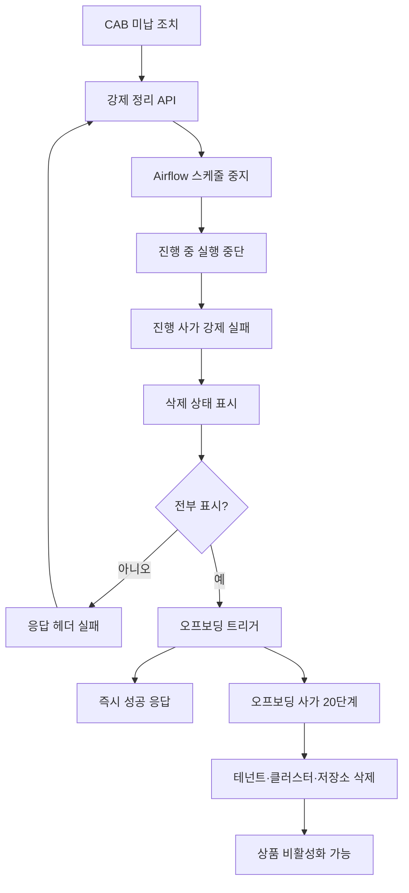

동작 순서는 다음과 같습니다.

1. 데이터 파이프라인은 **Airflow 스케줄부터 끕니다.** 꺼두지 않으면 스케줄이 새 실행 사가를 만들어 방금 표시한 삭제 상태를 되돌릴 수 있습니다.
2. 진행 중 사가가 있으면 **강제로 실패 처리**합니다. 보상(되돌리기)은 시작하지 않습니다.
3. 파이프라인을 **삭제 상태로 표시**합니다. 삭제 사가는 시작하지 않습니다.
4. 전부 표시되면 오프보딩 사가를 시작하고 **즉시 성공을 응답**합니다. 물리 자원 삭제는 오프보딩이 뒤에서 수행합니다.

**왜 파이프라인별 삭제 사가를 돌리지 않았는가**

사가 엔진의 대전제로 한 리소스에는 진행 중 사가가 하나만 있을 수 있습니다. 분석 클러스터나 Airflow, Kafka에서 돌아오는 완료 신호에 리소스 ID만 담겨 있어서, 사가가 둘이면 어느 쪽에 전달할지 가릴 수 없기 때문입니다. 진행 중 사가를 중간에 취소하는 기능도 없습니다.

그래서 새 삭제 사가를 얹는 대신 진행 중 사가를 강제 실패로 끝내고 파이프라인을 곧바로 삭제 상태로 표시합니다. 파이프라인 단위 삭제 사가가 없어도 물리 자원은 오프보딩 사가가 **테넌트 단위로 통째 삭제**하므로 남는 것이 없습니다. 만들다 만 자원도 오프보딩이 함께 정리합니다.

**멱등성과 수렴**

- 같은 호출을 반복해도 안전합니다. 이미 삭제 상태인 파이프라인은 건너뛰고 남은 것만 다시 시도합니다.
- 오프보딩이 이미 진행 중이면 중복으로 시작하지 않고 성공으로 응답합니다.
- 일부라도 표시에 실패하면 응답 헤더를 실패로 내립니다. CAB나 운영자가 다시 호출하면 남은 것부터 이어서 정리됩니다.

#### 10.1.3 알파 실증에서 잡아낸 완주 방해 요인 2가지

알파에서 **실제로 실행 중인 테넌트**를 정리 API로 지우는 시나리오를 만들어 검증했습니다. 데이터 소스 5개, 파이프라인 2개(빌드·실행 완료), 추천 앱 1개를 만들고, 파이프라인 1개를 수동 실행해 Spark가 Iceberg에 쓰는 중인 상태에서 정리 API를 호출했습니다. 실사용 중인 고객을 미납으로 지우는 상황과 가장 가까운 조건입니다.

**문제 1: ArgoCD 프로젝트 삭제 거부**

| 구분 | 내용 |
|---|---|
| 증상 | 오프보딩 3단계(GitLab·ArgoCD 프로젝트 삭제)가 400 `project is referenced by 4 applications`로 실패 |
| 원인 | 서빙 앱을 만들면 모델 인프라 앱 4종(flink, kfp, knative, kserve)이 ArgoCD에 생깁니다. 원래는 서빙 삭제 사가가 이 앱들의 매니페스트를 GitLab에서 지워 없애는데, 정리 API는 삭제 사가를 생략하고 오프보딩에 위임하다 보니 그 삭제 단계가 통째로 빠졌습니다. 그래서 앱이 남았고, ArgoCD는 참조 앱이 남은 프로젝트를 못 지웁니다 |
| 수정 | 오프보딩 3단계가 프로젝트 삭제 직전에 그 프로젝트를 참조하는 앱들을 먼저 정리(non-cascade 삭제)하고 목록이 빌 때까지 반복합니다. 실제 리소스는 뒤 단계(컴포넌트 제거, 클러스터 삭제)가 정리하므로 앱 껍데기만 떼어냅니다 |
| 결과 | 수정 배포 후 재호출에서 3단계가 **6.6초**에 통과 |

**문제 2: Iceberg 스키마 삭제 실패**

| 구분 | 내용 |
|---|---|
| 증상 | 오프보딩 5단계(Iceberg 스키마 삭제)가 프록시 500으로 실패해 테넌트가 실패 상태로 되돌아감. 정리 API 호출 약 10초 만에 발생 |
| 원인 | 정리 API 호출 직전 수동 실행으로 실행 중이던 Spark가 같은 스키마에 쓰는 중이었습니다. Iceberg의 카탈로그(Nessie)는 커밋을 조건부로 받는 방식이라, 스키마 삭제 커밋과 Spark의 쓰기 커밋이 같은 지점에서 경쟁해 거부됩니다. 정리 API의 기존 동작은 우리 DB의 사가 기록만 실패 처리하고, Airflow에서 이미 실행 중이던 Spark는 클러스터에서 계속 실행됐습니다 |
| 수정 | 정리 API가 진행 중인 Airflow 실행을 직접 중단(failed 처리)해 Spark를 선제 제거합니다. 여기에 5단계 재시도(백오프)를 더해 중단시킨 쓰기가 완전히 멎는 짧은 꼬리 시간을 흡수합니다 |

이벤트·추론 싱크 커넥터(스트림 데이터가 Iceberg에 쓰는 다른 경로)는 오프보딩 4단계가 KafkaConnect 클러스터 자체를 지워 이미 정지시키고 있어 손댈 필요가 없었습니다. 빠져 있던 것은 Airflow가 돌리는 Spark 하나였습니다.

방어를 3층으로 쌓았습니다.

1. 실행 중단 (원인 제거)
2. 5단계 재시도 (꼬리 흡수)
3. 실패 시 정리 API 재호출로 수렴 (운영자 수동 재호출)

#### 10.1.4 최종 실증 결과

| 항목 | 이전 (수정 전) | 지금 (수정 후) |
|---|---|---|
| 호출 조건 | 파이프라인 실행 중 + 앱 초기화 중 | 동일 |
| 정리 API 응답 | 마킹 3건 성공 | 마킹 3건 성공 |
| 오프보딩 첫 사가 5단계 | **10초 만에 실패** | **무실패 통과** |
| 완주 | 실패 → 재호출로 수렴 (약 **21분**) | **재호출 없이 첫 사가로 완주 (약 20분)** |

완주의 정의는 테넌트 상태 조회가 전부 비게 되는 것(hard delete)입니다.

여기서 중요한 것은 21분에서 20분으로 1분 줄었다는 숫자가 아니라, **"실패 후 재호출로 수렴"에서 "첫 시도에 무실패 완주"로 성질이 바뀐 것**입니다. 미납 자동 조치는 매월 말일 00:30에 사람 개입 없이 도는 배치라, 실패 후 운영자 재호출에 의존하는 구조는 실질적으로 동작하지 않습니다.

#### 10.1.5 API 계약

기존 비활성화 API와 동일 스펙으로 맞췄습니다 (appKey + uuid 전달, uuid는 해당 프로젝트 ADMIN 중 1인). 전사 담당자 답변으로 확인한 사항입니다. 엔드포인트는 환경별 게이트웨이의 `DELETE /product/v1.0/appkeys/{appKey}/resources` 형태이며, KR/JP 각 3개 환경(알파, 베타, 리얼) 총 6개를 CAB에 등록 요청했습니다.

### 10.2 CloudTrail 이벤트 커버리지 확대 (#2020, #2051)

#### 10.2.1 전수 조사

이벤트 정의 이후 API가 늘어났는데 애노테이션이 따라가지 못한 상태였습니다. 2026-07-13 기준으로 코드를 전수 조사했습니다.

**애노테이션 추가 필요 (13건, 전부 유저 콘솔 FE 직접 호출)**

| 대상 | 건수 | 내용 |
|---|---|---|
| `ActionController` | 3 | 액션(알림/웹훅 템플릿) 생성/수정/삭제 |
| `ActionBindingController` | 3 | 바인딩(조건과 액션 연결) 생성/수정/삭제 |
| `ActionProducesController` | 3 | 발행 선언 생성/수정/삭제 |
| `TenantController` | 3 | 온보딩/오프보딩/사이즈 변경. 자체 감사 로그는 이미 있고 CloudTrail만 빠짐 |
| `DataPipelineController.setLlmApiKey` | 1 | LLM API 키 설정(PUT). 자격증명 변경이라 감사 가치가 큼 |

**정책 결정이 필요했던 4건**

| 대상 | 쟁점 |
|---|---|
| Product enable/disable 2건 | NHN Cloud 콘솔의 상품 활성/비활성 시스템 훅이 호출합니다 (FE 직접 호출 아님). CloudTrail 스펙에는 `SYSTEM`/`API` 타입도 있는데 우리 `CloudTrailUserType` enum은 `USER_CONSOLE`/`ADMIN_CONSOLE`/`NONE`뿐이라 enum 확장이 함께 걸립니다 |
| ActionGraphLayout 저장 1건 | 그래프 노드 좌표만 저장하는 UI 편의 기능이라 제외 권장 |
| `deleteLlmApiKey` 1건 | 현재 FE에 삭제 호출 경로가 없습니다. PUT과 대칭으로 미리 추가 권장 (저순위) |

**제외가 타당한 것 (내부/조회)**

| 대상 | 이유 |
|---|---|
| Internal 컨트롤러 4개 | ST 서비스가 CP로 위임 호출하는 서버 간 API. FE 직접 호출이 없음을 확인 |
| `EventController.publishEvent` | Spark 잡과 서빙 파드가 쓰는 내부 이벤트 발행 대행 |
| `AlertRuleQueryController`의 POST 1건 | 검색 조건을 body로 받으려고 POST를 쓴 것일 뿐 실제로는 조회 |
| `TenantController.registerTenant` | 내부 API |
| `RecommendationInference.recommend` | `@Deprecated` 상태이고 실제 트래픽은 ST recommend-service로 이관됨 |

**추가 발견**: `CloudTrailEvent.DATA_PIPELINE_BUILD`는 정의만 있고 리포지토리 어디서도 참조되지 않는 미사용 상수였습니다.

#### 10.2.2 14종 추가 (#2051)

조사 결과 중 **콘솔에서 CP로 바로 가는 14종**을 먼저 처리했습니다. 이 14종이 쉬운 이유가 있습니다. 전부 `/appkeys/{appKey}/` 경로라 인터셉터의 정규식이 appKey를 뽑을 수 있고, 콘솔 게이트웨이가 `X-NHN-uid`를 이미 붙여 주므로 신원까지 자동으로 기록됩니다.

| 컨트롤러 | 동작 | HTTP | 새 이벤트 ID |
|---|---|---|---|
| `ActionController` | 액션 생성/수정/삭제 | POST/PUT/DELETE | `action_create` / `action_update` / `action_delete` |
| `ActionBindingController` | 바인딩 생성/수정/삭제 | POST/PUT/DELETE | `action_binding_create` / `action_binding_update` / `action_binding_delete` |
| `ActionProducesController` | 발행선언 생성/수정/삭제 | POST/PUT/DELETE | `action_produces_create` / `action_produces_update` / `action_produces_delete` |
| `DataPipelineController` | LLM API 키 저장/삭제 | PUT/DELETE | `llm_api_key_set` / `llm_api_key_delete` |
| `TenantController` | 테넌트 온보딩/오프보딩/크기변경 | POST/POST/PATCH | `tenant_onboarding` / `tenant_offboarding` / `tenant_size_modify` |

로직은 건드리지 않고 감사 이벤트만 붙였습니다. `CloudTrailEvent` enum에 14종 추가, 컨트롤러 메서드에 `@CloudTrailAction(consoleType = USER_CONSOLE, value = ...)` 부착, 이 두 가지뿐입니다.

#### 10.2.3 LLM API 키 전체 숨김 결정

여기에 안전 보강이 하나 들어갔습니다.

LLM API 키 저장 요청 본문에는 실제 키 값(필드명 `apiKey`)이 들어 있습니다. 이 API에 CloudTrail을 그냥 달면 **키가 평문으로 감사 로그에 전송됩니다.**

우리 인터셉터에는 두 종류의 보호 목록이 있었습니다.

| 목록 | 동작 | 시크릿에 적합한가 |
|---|---|---|
| `MASKING_KEY_LIST` | 부분 마스킹. 앞 38% 접두부는 남김 | **부적합** |
| `HIDDEN_KEY_LIST` | 값을 `[hidden]`으로 통째 치환 | 적합 |

부분 마스킹을 쓰지 않은 이유는 명확합니다. **앞 38%가 그대로 노출되면 시크릿으로서 이미 손상**됩니다. 키 앞부분만 알아도 브루트포스 탐색 공간이 크게 줄고, 키 발급처나 계정을 식별할 수 있는 접두어가 노출될 수 있습니다.

그래서 `apiKey`를 `HIDDEN_KEY_LIST`에 넣어 전체를 숨긴 뒤 애노테이션을 붙였습니다. 결과적으로 감사 로그에는 **"누가 언제 LLM API 키를 설정했다"만 남고, 어떤 키를 넣었는지는 남지 않습니다.**

### 10.3 폴링 노이즈 제거와 전송 정합성 수정 (#2043)

#### 10.3.1 폴링 노이즈: 3초마다 쌓이던 가짜 업로드 이벤트

CloudTrail 콘솔에서 "스냅샷 데이터 업로드" 이벤트가 3초 간격으로 수십 건 쌓이는 현상을 발견했습니다.

원인 추적 결과 요청 흐름은 이랬습니다.

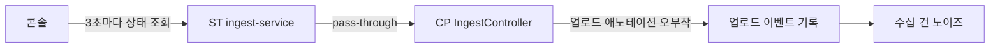

콘솔이 CSV 업로드 중 진행 상태를 3초마다 조회합니다. 이 조회를 받은 ST ingest-service가 CP의 공개 API로 그대로 전달(pass-through)합니다. CP 쪽에서 이 URL을 담당하는 `IngestController`의 **상태 조회 메서드에 업로드용 CloudTrail 애노테이션이 붙어 있어서**, 조회가 일어날 때마다 "업로드했다"는 이벤트가 기록됐습니다.

수정은 `getBatchStatus`에서 애노테이션을 제거하는 것이었습니다. 이 수정으로 폴링 유발 업로드 이벤트가 **0건**이 됐습니다.

감사 관점에서 이것은 단순한 노이즈 제거 이상입니다. 실제로 일어나지 않은 행위가 감사 로그에 수십 건 기록되면, 그 로그 전체의 신뢰도가 떨어집니다. 조회를 변경 행위로 기록하는 것은 감사 로그의 기본 계약을 깨는 일입니다.

#### 10.3.2 함께 잡은 정합성 문제 3가지

| 문제 | 내용 | 수정 |
|---|---|---|
| 마스킹 대소문자 버그 | 마스킹 키 목록에 `"appkey"`(소문자)로 들어 있었는데 매칭이 대소문자를 구분합니다. 실제 필드명은 `appKey`라 **마스킹이 전혀 동작하지 않았습니다** | 키를 `"appKey"`로 정정 |
| 마스킹 파싱 실패 시 원문 유출 | 응답 본문이 잘린 채 들어와 파싱이 실패하면 **마스킹 안 된 민감 값이 그대로 전송**될 수 있었습니다 | 파싱 실패 시 원문 전송 대신 본문 생략으로 변경 |
| 실패에도 성공 로그 | `CloudTrailService`의 전송 성공 디버그 로그가 실패 응답에도 찍혀 오해를 유발했습니다 | 로그를 `else` 블록으로 이동 |

두 번째 항목은 **실패 모드의 방향**을 바꾼 수정이라 특히 중요합니다. 파싱이 실패했을 때 "일단 원문이라도 보내자"는 fail-open 동작이었는데, 마스킹의 목적을 생각하면 "확실하지 않으면 안 보낸다"는 fail-safe가 맞습니다.

#### 10.3.3 환경 설정 오타

| 항목 | 내용 |
|---|---|
| 베타 JP1 productId | 끝 글자 한 자가 빠진 오타를 정정 |
| 리얼 productId | 게이트웨이·미터링에서 쓰는 값과 통일되도록 정정 |

환경 설정의 productId 오타는 조용히 실패합니다. 이벤트는 전송되지만 존재하지 않는 상품으로 분류돼 콘솔에 나타나지 않습니다. 배포 전에 콘솔 실제 값과 대조하는 절차를 거쳤습니다.

### 10.4 환경별 엔드포인트와 이벤트 등록 (#2020)

#### 10.4.1 조사에서 드러난 격차

| 항목 | 조사 시점 현재 상태 | 확인된 기준 |
|---|---|---|
| 전송 주소 | 알파/베타/리얼 모두 **리얼 내부 주소** | 공식 연동 가이드는 알파/베타 전용 주소를 안내 |
| 상품 ID | 환경마다 다른 ID 4종 | 타 팀 선례(Bastion)는 전 환경 동일 ID 1종 |
| 이벤트 등록 | 미등록. 콘솔에서 이벤트 다국어 노출 안 됨 | 환경별 NCA에서 각각 등록 필요 |
| 권한 | 알파만 요청됨 | 베타/리얼은 별도 요청 필요 |

우리 구조에는 특이점이 있었습니다. 유저가 프로젝트를 만들면 우리 대표 계정에 시스템 테넌트를 생성하는 구조라, 알파/베타/리얼 모두 퍼블릭 클라우드의 같은 계정에 만들어집니다. 이 구조에서 전송 주소를 어떻게 가져가야 하는지는 CloudTrail 운영 담당자에게 직접 문의해 방침을 확정했습니다.

#### 10.4.2 eventId 기반 다국어 조회라는 발견

이벤트 등록 과정에서 CloudTrail의 동작 방식 하나를 실측으로 알아냈습니다.

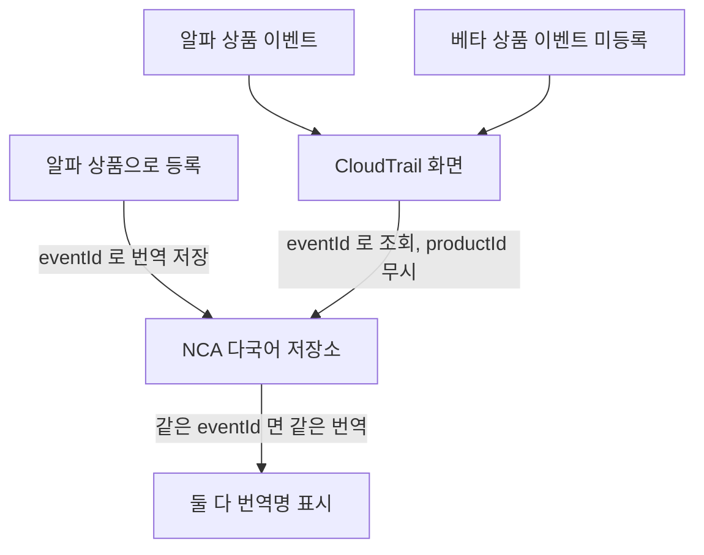

CloudTrail 화면은 이벤트 이름을 **eventId로 조회하고 productId는 보지 않습니다.** 그래서 한 상품으로 등록한 번역이 같은 eventId를 쓰는 다른 상품 이벤트에도 그대로 적용됩니다. 반대로 같은 이름의 eventId는 중복 등록이 되지 않습니다.

이 발견 덕분에 환경마다 전체 목록을 다시 등록하지 않고 export/import로 복제하는 전략이 성립했습니다.

#### 10.4.3 등록 결과

알파와 베타에서 우리가 등록한 eventId의 번역 설명이 정상 출력되는 것을 확인했습니다 (2026-07-16). 리얼은 이벤트 릴리즈 날짜를 8월 25일로 설정해 두어서 그 시점까지 노출되지 않는 것이 정상 동작입니다.

### 10.5 리소스 와처 연동 준비 (#2061)

#### 10.5.1 리소스 와처가 무엇인가

리소스 와처는 CloudTrail 이벤트를 구독해서 조직 내 모든 리소스의 장부를 관리하고, 고객에게 리소스별 이력 조회 / 태그 분류 / 이벤트 알림 기능을 제공하는 전사 공통 서비스입니다.

중요한 점은 **런타임에 우리가 와처를 직접 호출하는 일이 없다**는 것입니다. 지금처럼 CloudTrail에 이벤트만 보내면 와처가 알아서 읽어 갑니다. 우리가 넘기는 매핑 정보는 와처가 우리 이벤트를 해석하는 규칙표 역할을 합니다.

즉 **CloudTrail 이벤트를 제대로 정비해 둔 것이 리소스 와처 연동의 전제 조건**이었습니다. 앞선 작업들이 여기서 값을 만들어냈습니다.

#### 10.5.2 이벤트 51종 전체 매핑

| 상태 코드 | 건수 |
|---|---|
| `CREATE_RESOURCE` (생성) | 10 |
| `MODIFY_RESOURCE` (수정) | 14 |
| `DELETE_RESOURCE` (삭제) | 11 |
| `NOT_RELATED_RESOURCE` (리소스 존재와 무관) | 16 |
| 합계 | **51** |

**전부 등록한 이유**가 있습니다. 매핑에서 제외하면 고객의 알림 설정 목록에서도 빠져서, 고객이 그 이벤트로 알림을 걸 수 없게 됩니다. 그래서 리소스 변동이 아닌 이벤트도 `NOT_RELATED_RESOURCE`로 등록해 목록에 남겼습니다.

#### 10.5.3 리소스 유형 10종

| 리소스 유형 코드 | 한국어 |
|---|---|
| `PLAI:DataSource` | 데이터소스 |
| `PLAI:DataPipeline` | 데이터 파이프라인 |
| `PLAI:ServingPipeline` | 서빙 파이프라인 |
| `PLAI:Query` | 쿼리 |
| `PLAI:Chart` | 차트 |
| `PLAI:Dashboard` | 대시보드 |
| `PLAI:AlertRule` | 알림 규칙 |
| `PLAI:AlertChannel` | 알림 채널 |
| `PLAI:Action` | 액션 |
| `PLAI:Service` | 서비스 (테넌트) |

각 유형은 한국어/일본어/영어/중국어 4개 언어로 등록했습니다.

**리소스 ID 방침**: 새로 만들지 않고 우리 DB가 이미 발급한 각 리소스의 PK를 그대로 씁니다 (데이터소스는 `data_source_id`, 서빙 파이프라인은 `serving_pipeline_id` 등). 리소스 이름은 고객이 지은 이름 컬럼을 씁니다. 테넌트만 예외로 appKey를 리소스 ID로 씁니다.

**미터링은 변경하지 않았습니다.** 미터링의 `resourceId`는 IaaS 사용량을 되읽어 그대로 전달하는 값이라 와처용 ID와 별개입니다. 태그 기반 비용 조회는 우리 과금 모델(테넌트 단위)과 맞지 않아 범위에서 제외했습니다.

#### 10.5.4 선례 조사로 줄인 시행착오

다른 팀의 리소스 와처 업무 의뢰 40여 건을 조사해 다음을 확정했습니다.

| 선례 | 우리에게 준 시사점 |
|---|---|
| 엑셀 없이 본문 표로 제출한 팀 다수 | 이벤트 매핑은 업무 본문 표로 충분. 엑셀은 기존 리소스 동기화처럼 건수가 많을 때만 |
| 알파부터 순차 적용 | 우리도 알파 먼저 요청해 테스트 후 확산 |
| 신규 서비스는 기존 데이터 동기화 생략 | 알파는 동기화 없이 시작 가능 |
| 리소스와 무관한 이벤트는 제외 가능 | 다만 알림 목록 유지를 위해 우리는 무관 코드로 등록하는 쪽을 선택 |
| 리소스 유형은 잘게 쪼개지 않음 | 51종 이벤트를 전부 별개 유형으로 만들 필요 없음 |
| 새 이벤트가 생길 때마다 매핑 추가 요청 반복 | 일회성 연동이 아니라 **지속 운영 항목**임을 인지 |

마지막 항목이 중요합니다. 리소스 와처 연동은 한 번 하고 끝나는 작업이 아니라, CloudTrail 이벤트를 추가할 때마다 매핑 요청도 함께 내야 하는 지속 항목입니다. 이 사실을 미리 파악해 팀에 공유했습니다.

### 10.6 수집 이벤트 목록 공식 문서화 (#2204)

#### 10.6.1 왜 필요했는가

다른 상품들은 어떤 이벤트를 남기는지 공식 가이드에 목록으로 공개합니다. 우리는 그 목록이 없었습니다. 코드의 `CloudTrailEvent` 열거형과 NCA 어드민 등록분, 두 군데에만 흩어져 있어서 **"우리가 무엇을 수집하는가"를 한 장으로 보여줄 자료가 없는 상태**였습니다.

#### 10.6.2 무엇을 만들었는가

NHN Cloud 공식 가이드의 "수집되는 이벤트 목록"과 같은 양식으로 50종을 정리했습니다.

| 항목 | 공식 가이드 | 우리 목록 |
|---|---|---|
| 구획 | 서비스 단위 | 도메인 단위 11개 |
| 표 컬럼 | 이벤트, 이벤트 ID | 같음 |
| 이벤트 이름 | 한국어 | 같음 (NCA 등록명) |
| 부가 설명 | 없음 | 없음 |

우리는 상품이 하나라 서비스 단위로 나눌 것이 없었습니다. 대신 50행을 한 표에 늘어놓으면 찾기 어려워서 화면에서 다루는 대상별로 11개 구획으로 나눴습니다.

| 구획 | 이벤트 수 |
|---|---|
| 알림 | 5 |
| 차트 | 4 |
| 대시보드 | 4 |
| 데이터 소스 | 3 |
| 데이터 수집 | 5 |
| 데이터 파이프라인 | 7 |
| 쿼리 | 4 |
| 서빙 파이프라인 | 4 |
| 액션 | 9 |
| LLM API 키 | 2 |
| 테넌트 | 3 |
| **합계** | **50** |

#### 10.6.3 51개 enum 중 50종만 실린 이유

`CloudTrailEvent` 열거형에는 상수가 51개 있지만 목록은 50종입니다.

`DATA_PIPELINE_BUILD`는 선언만 있고 `@CloudTrailAction`이 붙은 자리가 없습니다. 빌드를 직접 호출하는 엔드포인트가 없어서 실제로 전송되지 않습니다. **수집되지 않는 것을 수집 목록에 적으면 안 되므로 뺐습니다.**

나중에 빌드 엔드포인트가 생겨 이벤트가 실제로 나가기 시작하면 그때 데이터 파이프라인 구획에 한 줄 추가하면 됩니다.

#### 10.6.4 완료 기준

| 기준 |
|---|
| 코드에서 실제로 전송되는 이벤트가 목록에 빠짐없이 들어간다. 기준은 `@CloudTrailAction`이 붙은 지점 |
| 표의 이벤트 ID가 코드의 `CloudTrailEvent` 값과 글자 단위로 같다 |
| 표의 이벤트 이름이 NCA 어드민에 등록한 한국어 이름과 같다 |
| 표 컬럼이 공식 가이드와 같은 2개다 |
| 코드에 이벤트를 더하거나 이름을 바꿀 때 이 목록도 같이 고친다는 것을 팀이 안다 |

세 번째 기준을 명시한 이유는, 코드 이름과 NCA 등록명이 다르면 **고객이 두 개의 이름을 보게 되기** 때문입니다. 감사 화면에 뜨는 이름은 NCA 등록명이므로 그것을 기준으로 맞췄습니다.

---

## 11. Result: 종합 성과

### 11.1 감사 3축이 모두 채워졌습니다

| 축 | 작업 전 | 작업 후 |
|---|---|---|
| 무엇을 (eventId) | 36종 (34종 실전송 + 미사용 상수) | **50종 실전송** (+14종) |
| 누가 (uuid) | CP 직행만 채워짐. ST 직행 공란 | **양 경로 모두 채워짐** (#2068) |
| 어디서 (접속 IP) | CP 직행 KR만 정상. ST 직행 공란, CP 직행 JP 복불복 | **KR/JP 양 리전, CP/ST 양 경로 모두 정상** (#2075) |

### 11.2 리전별 인프라 차별화의 결과

| 리전 | 적용 방식 | 적용 전 관측 IP | 적용 후 관측 IP |
|---|---|---|---|
| KR | API Gateway 요청 헤더 변경 플러그인 → `X-Client-Ip` | `10.100.x.x` (NKS 노드/터널) | `10.78.214.50` (실 사용자) |
| JP | nginx `use-forwarded-headers` + 신뢰 대역 → `X-Real-IP` | 터널 IP | 실 사용자 IP |

두 리전이 완전히 다른 메커니즘을 쓰는데도, **애플리케이션 코드에는 리전 분기가 한 줄도 없습니다.**

### 11.3 코드 변경 범위

| 계층 | 변경 |
|---|---|
| KR 인프라 | API Gateway 템플릿에 플러그인 1개 추가 (신규 테넌트 자동 적용) |
| JP 인프라 | nginx ConfigMap 2줄 추가 (무중단, 신규 테넌트 자동 적용) |
| ST 애플리케이션 | 헤더 우선순위 읽기 1곳 + ThreadLocal 보관 + 인터셉터 헤더 주입 |
| CP 애플리케이션 | 내부망 판정 상수 1개를 RFC1918 전체로 확장 |
| CP 게이트웨이 | 변경 없음 (신원 전파 슬라이스에서만 uuid 반환 추가) |

"실 IP를 확보한다"는 목표에 비해 애플리케이션 변경량이 매우 작습니다. **문제를 인프라 계층에서 흡수했기 때문**입니다.

### 11.4 보안 신뢰성

| 검증 항목 | 결과 |
|---|---|
| 가짜 XFF(`6.6.6.6`) 주입 시 위조 성립 여부 | **불가**. 앞단 L7이 실제 소스를 오른쪽에 append하고 nginx가 오른쪽부터 읽음 |
| KR `X-Client-Ip` 헤더 위조 | **불가**. 플러그인이 API Gateway가 직접 본 값으로 덮어씀 |
| LLM API 키 감사 로그 노출 | **없음**. `HIDDEN_KEY_LIST`로 전체 치환 |
| 마스킹 파싱 실패 시 원문 유출 | **없음**. fail-safe(본문 생략)로 전환 |
| 실제로 일어나지 않은 행위의 기록 | **없음**. 폴링 노이즈 0건화 |

### 11.5 운영 성과

| 항목 | 결과 |
|---|---|
| 미납 자동 조치 완주 | 실패 후 재호출 수렴(약 21분) → **첫 사가 무실패 완주(약 20분)** |
| 신규 온보딩 테넌트 | KR/JP 모두 인프라 설정이 자동 적용 (수동 개입 0) |
| 기존 클러스터 | JP는 무중단 helm upgrade 1회로 반영, 롤백 절차 문서화 |
| 리소스 와처 연동 | 이벤트 51종 매핑 + 리소스 유형 10종 정의 완료, 업무 의뢰 접수 |
| 수집 이벤트 목록 | 50종을 공식 가이드 양식으로 문서화 |

### 11.6 왜 이 작업이 중요했는가

**감사 요건 충족**

CloudTrail은 고객이 자기 조직의 활동을 확인하는 창구입니다. "누가"와 "어디서"가 비어 있으면 감사 로그가 아니라 그냥 이벤트 로그입니다. 이 작업으로 우리 서비스의 감사 기록이 다른 NHN Cloud 상품과 같은 수준의 완결성을 갖게 됐습니다.

**보안 신뢰성**

감사 로그는 위조 가능하면 의미가 없습니다. 위조 실험을 직접 수행해 "우리 구성에서는 통하지 않는다"를 실증으로 확인했고, LLM API 키 같은 시크릿이 감사 경로로 새지 않게 막았습니다.

**구조적 해결**

가장 쉬운 길은 앱 코드에 `if (리전 == KR) { ... } else { ... }`를 넣는 것이었습니다. 그러지 않았습니다. 인프라 차이는 인프라에서 흡수하고 앱은 헤더 계약 하나만 보게 만들었기 때문에, 리전이 세 번째, 네 번째로 늘어도 앱 코드는 그대로입니다.

**다른 작업의 전제 조건이 됨**

CloudTrail 이벤트가 정확해진 덕분에 리소스 와처 연동(#2061)이 가능해졌습니다. 리소스 와처는 우리 이벤트를 구독해 리소스 장부를 만드는데, 이벤트가 부정확하면 장부도 부정확해집니다. 감사 로그 정비가 상위 기능의 토대를 놓은 셈입니다.

---

## 12. 남은 과제

| 항목 | 상태 | 비고 |
|---|---|---|
| 리얼 JP1(NetLearning) nginx 신뢰 대역 적용 | 배포일에 수행하도록 런북 작성 완료 | 무중단 helm upgrade 1회 |
| 상품 활성/비활성 시스템 훅 감사 포함 여부 | 정책 미결정 | `CloudTrailUserType` enum에 `SYSTEM`/`API` 타입 확장이 함께 걸림 |
| `deleteLlmApiKey` 애노테이션 | 저순위 | 현재 FE에 삭제 호출 경로가 없음 |
| `DATA_PIPELINE_BUILD` 상수 정리 | 미처리 | 상수 제거 또는 빌드 트리거 지점 연결 중 택일 |
| 스냅샷 업로드 이벤트 감사 정책 | 별도 설계 필요 | 폴링 노이즈 제거로 현재 0건. "누가 업로드했는지"를 남기려면 신원 확보 방법 포함한 설계 필요 |
| CloudTrail 응답 본문 약 1KB 절단 | 외부 SDK 소관 | `CabHeaderUtil` 소관이라 우리 범위 밖 |
| 앱 생성/삭제, 트레이닝 파이프라인 이벤트 | 검토 요청 접수 | 팀장님 피드백(2026-08-06). 앱에 리소스 설정 기능이 들어가면서 리소스 확인용 앱 이벤트가 필요 |
| 미납 정리 오프보딩 후속 확인 2건 | 미완 | 오프보딩 완료 전/후 상품 비활성화 호출 거부·통과 확인 |
| 리소스 와처 화면 노출 확인 | 업무 의뢰 종료 대기 | 의뢰 종료 후 리소스 와처 탭에서 이벤트 노출 확인 예정 |

---

## 13. 태스크 타임라인

| 날짜 | 태스크 | 사건 |
|---|---|---|
| 2026-07-13 | #2020 | CloudTrail 정비 스토리 시작. 전송 주소·상품 ID·이벤트 등록·권한 4개 격차 확인 |
| 2026-07-13 | #2020 | 코드 전수 조사. 애노테이션 누락 13건, 정책 결정 4건, 미사용 상수 1건 식별 |
| 2026-07-13 | #2022 | 미납 자동화 대응 리소스 삭제 API 태스크 시작 |
| 2026-07-14 | #2020 | 등록용 이벤트 목록(50종, 한/일/영) 작성. 전송 주소 방침 확정 |
| 2026-07-15 | #2043 | 폴링 노이즈 원인 규명. 마스킹·로그·productId 문제 3건 동시 발견 |
| 2026-07-15 | #2043 | 수정 머지 (폴링 노이즈, 마스킹 대소문자, fail-safe, 성공 로그 위치, 베타 JP productId) |
| 2026-07-16 | #2020 | 알파·베타 콘솔에서 다국어 이벤트명 노출 확인. eventId 기반 i18n 조회 동작 규명 |
| 2026-07-16 | #2043 | 리얼 productId 정정 머지 (게이트웨이·미터링과 통일) |
| 2026-07-16 | #2051 | 콘솔 CP 액션 14종 추가 머지. `apiKey`를 `HIDDEN_KEY_LIST`에 추가 |
| 2026-07-16 | #2022 | 알파 통합 테스트 체크리스트 작성 |
| 2026-07-20 | #2051 | 태스크 완료 |
| 2026-07-21 | #2068 | ST 직행 신원 전달 태스크 시작. 콘솔 토큰이 5파트 JWE임을 실측 확인 |
| 2026-07-21 | #2061 | 리소스 와처 파악 시작 |
| 2026-07-21 ~ 22 | #2022 | 알파 통합 테스트. ArgoCD 참조 앱·Iceberg 커밋 경쟁 2건 규명 및 수정 |
| 2026-07-22 | #2068 | 4개 모듈 슬라이스 완료. ST 직행 감사에 "누가" 채워짐 확인 |
| 2026-07-22 | #2022 | 첫 사가 무실패 완주 실증. 정리 API 머지 |
| 2026-07-22 | #2075 | 접속 IP 미확보 원인 규명 시작 |
| 2026-07-22 ~ 23 | #2075 | KR/JP nginx 로그에 XFF 칸 임시 추가해 실측. SNAT 값이 워커 노드 터널 주소와 일치 확인. 위조 프로브 실험 |
| 2026-07-23 | #2075 | KR 알파 플러그인 적용 전후 비교 검증 (`10.100.x.x` → `10.78.214.50`) |
| 2026-07-23 | #2075 | JP 베타 nginx 설정 적용 전후 비교 검증. 베타 JP1 helm upgrade 완료 (rev 2, 무중단) |
| 2026-07-23 | #2075 | KR 신규 온보딩에서 `X-Client-Ip` 헤더 자동 주입 확인 |
| 2026-07-23 | #2061 | 리소스 와처 코드 구현 마무리, 업무 의뢰 등록 완료 |
| 2026-07-23 | #2075 | 팀장님께 ST 직행 API의 CloudTrail IP 문제 해결 보고 |
| 2026-07-24 | #2075 | 태스크 완료 |
| 2026-08-06 | #2204 | 수집 이벤트 50종 목록을 공식 가이드 양식으로 문서화. 앱·트레이닝 파이프라인 이벤트 검토 요청 접수 |

---

## 14. 이 작업에서 얻은 교훈

### 14.1 "코드로 안 되는 문제"를 먼저 판별해야 합니다

접속 IP 문제는 처음에 "코드에서 IP를 안 읽고 있나 보다"로 보였습니다. 실제로는 IP가 파드에 닿기 전에 두 번 소실되는 구조 문제였습니다. 만약 코드부터 뒤졌다면 며칠을 헤맸을 것입니다.

패킷 경로를 홉 단위로 그리고 각 홉에서 무엇이 바뀌는지 실측한 것이 해결의 시작이었습니다. **관측값(`10.100.55.0`)이 특정 워커 노드의 터널 주소와 일치한다는 것을 확인한 순간** 문제의 성질이 확정됐습니다.

### 14.2 계층이 다르면 서로 간섭하지 않습니다

SNAT는 3계층에서 동작하고 HTTP 헤더는 7계층 데이터입니다. 이 사실 하나가 해결의 열쇠였습니다. "패킷 IP는 죽었지만 HTTP 헤더는 살아 있다"는 것을 알아채면 나머지는 운반 계약을 정하는 일이 됩니다.

### 14.3 통제할 수 없는 것에 의존하지 않는 선택

KR에서 신뢰 대역 방식 대신 플러그인 방식을 택한 것이 이 원칙의 적용입니다. 신뢰 대역 방식은 기술적으로 가능했지만, **남의 팀 인프라의 IP 대역 변경을 우리가 계속 추적해야 하는 부채**를 낳습니다. 실제로 문서상 대역과 관측 대역이 이미 달랐습니다.

플러그인 방식은 그 추적 자체를 없앱니다. 당장의 구현 난이도가 아니라 **운영 기간 전체의 비용**으로 판단했습니다.

### 14.4 차이는 가장자리에서 흡수합니다

리전마다 다른 것은 리전마다 다른 곳에서 처리하고, 공통인 것은 공통으로 두는 것이 원칙입니다. 애플리케이션에 리전 분기를 넣는 것은 **차이를 시스템 중심부로 끌고 들어오는 일**입니다. 헤더 우선순위 목록은 차이를 인프라 경계에 묶어 둡니다.

### 14.5 환경 가정이 코드에 박히면 리전 확장에서 터집니다

`INTERNAL_IP_PREFIX = "10."`은 KR 파드망이 `10.100.x`라는 사실이 코드에 박힌 결과였습니다. 작성 당시에는 맞았고, JP가 생기면서 틀려졌습니다. 그것도 "항상 틀림"이 아니라 **착지 노드에 따라 복불복으로 틀림**이라 발견이 늦어졌습니다.

표준(RFC1918)에 기대어 판정하면 환경이 늘어도 버팁니다. 사설 IP 대역은 표준이 정의한 것이지 우리 클러스터가 정한 것이 아니기 때문입니다.

### 14.6 보안 가정은 반드시 실험으로 확인합니다

"XFF는 앞단이 append하니까 위조가 안 될 것이다"는 추정입니다. 앞단이 실제로 append하는지, nginx가 어느 방향으로 읽는지는 구현에 달렸습니다. 가짜 IP를 직접 주입해 로그를 확인한 것이 이 가정을 사실로 바꿨습니다.

감사 로그처럼 신뢰가 존재 이유인 시스템에서는 "될 것이다"와 "된다"의 차이가 큽니다.

### 14.7 감사 로그는 누락만큼 과잉도 문제입니다

폴링 노이즈(3초마다 가짜 업로드 이벤트)는 정보를 더 남기는 것처럼 보이지만 실제로는 감사 품질을 떨어뜨립니다. 일어나지 않은 행위가 기록되면 그 로그 전체의 신뢰가 흔들립니다.

조회를 변경 행위로 기록하지 않는 것, 실제 전송되지 않는 이벤트를 수집 목록에 적지 않는 것(`DATA_PIPELINE_BUILD` 제외)은 같은 원칙의 적용입니다.

