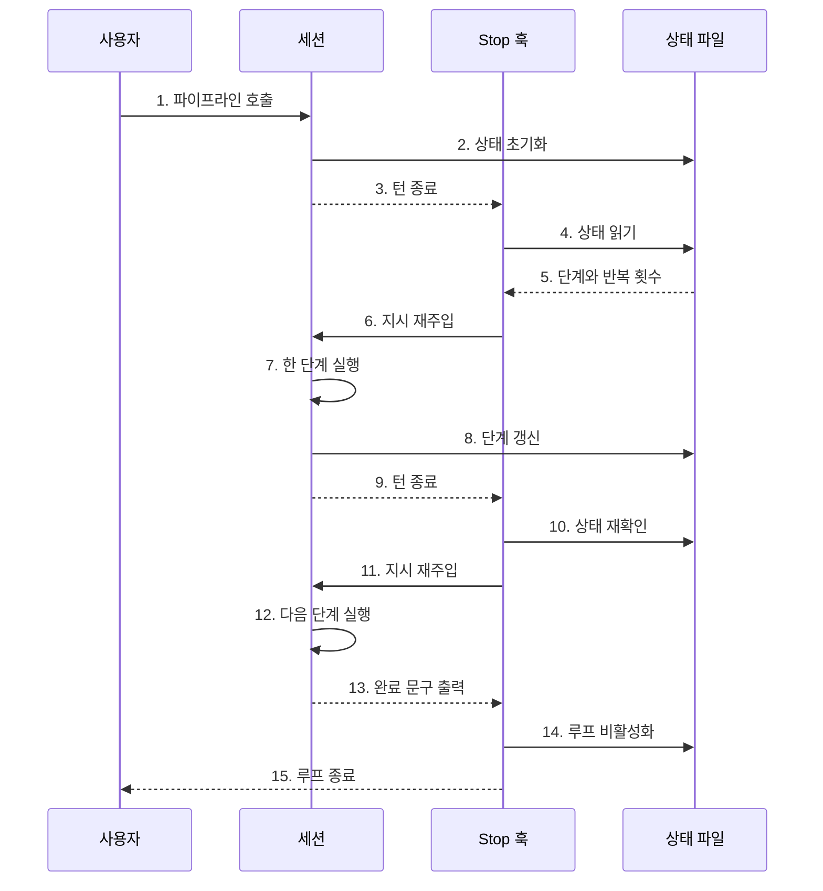
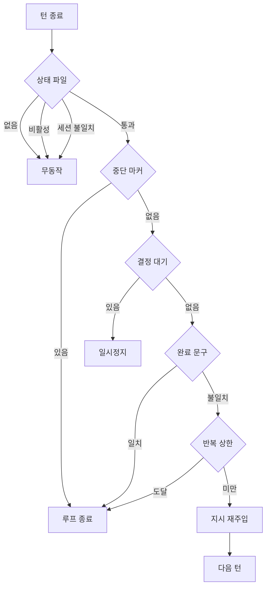
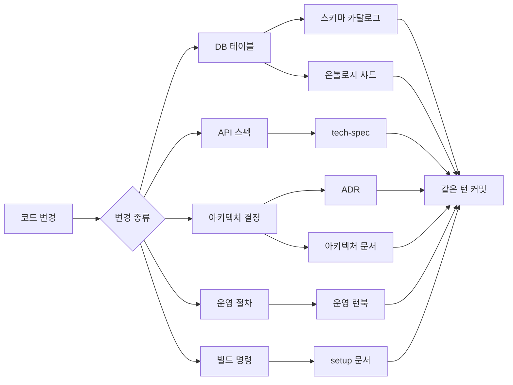
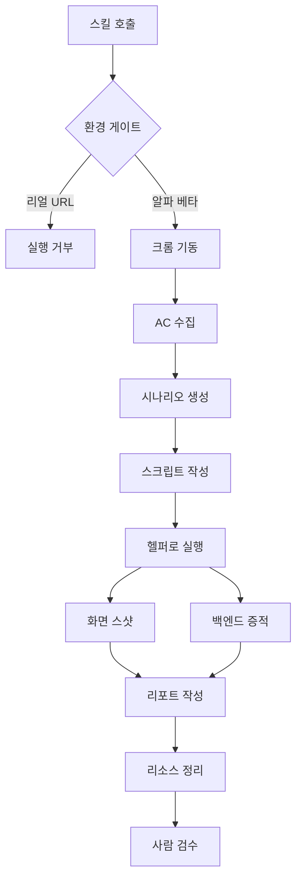
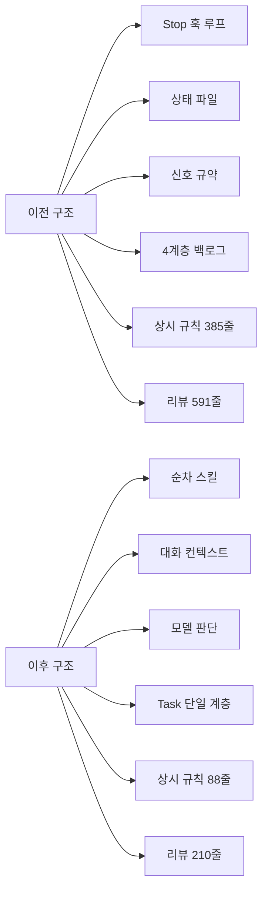

> 출처: GitHub `GoToBILL/transfer#5` ("하네스"). 최신화 필요 시 `gh api repos/GoToBILL/transfer/issues/5` 로 재조회.

# AI 협업 개발 하네스 구축과 간소화

> 본 문서는 실제 두레이 업무 기록과 저장소 코드를 근거로 작성되었습니다.

**근거 자료**

- 두레이 업무: NHN-Cloud-Foundry/1680, /1738, /1807, /1843, /2013, /2113 (부모 업무 /1643)
- 저장소: `cloud-ai/data-platform.poc` (커밋 해시, 파일 경로, 줄 수는 모두 실제 저장소에서 확인한 값입니다)

---

## 1. 개요

### 1.1 하네스가 무엇인가

**하네스(harness)** 는 사람과 AI(Claude Code)가 같은 규약 위에서 "태스크 계획 → 구현 → 리뷰 → 검증 → PR" 을 한 흐름으로 처리하도록 만든 슬래시 커맨드, 서브 에이전트, 규칙 파일의 집합입니다. 저장소 `docs/harness/README.md` 는 이를 이렇게 정의합니다.

> 하네스 = 사람과 AI(Claude) 가 같은 규약 위에서 백로그 → 구현 → PR 을 한 흐름으로 처리하기 위한 슬래시 커맨드 / 서브 에이전트 / 규칙의 집합.

말을 바꾸면, AI 에게 "잘 해줘" 라고 던지는 대신 **팀의 컨벤션과 아키텍처 지식을 코드로 박아 넣은 작업 환경**입니다. 커밋 메시지 형식, 브랜치 규칙, 헥사고날 계층 의존 방향, CP/ST 평면 분리 원칙, 두레이 API 안전 규칙 같은 것을 문서와 스크립트로 고정해 두면, AI 가 매번 같은 실수를 반복하지 않습니다.

### 1.2 전체 흐름

```
두레이 업무 (사람이 웹에서 생성)
    │  /harness:plan-task <두레이 URL>     ← 코드베이스 자동 분석으로 백로그 Task 생성
    ▼
docs/backlog/04-task/dooray-NNN-{slug}/index.md
    │  /harness:develop-pipeline <입력>    ← TDD 구현 → 리뷰 → PR 준비
    ▼
feature 브랜치 + PR (머지는 사람)
    │  /verify-e2e                         ← 알파/베타 콘솔 Playwright 검증
    ▼
사람이 리포트 검수 후 승인
```

출처: `docs/harness/README.md` §1, §4

### 1.3 본 문서에서 다루는 범위

제가 담당한 하네스 업무 중 다음 다섯 가지를 다룹니다.

| 순번 | 주제 | 두레이 |
|---|---|---|
| 1 | Stop hook 기반 자동 반복 개발 루프 | /1643, /2113 |
| 2 | 작업 후 자동 문서 동기화 규칙 | /1680 |
| 3 | Playwright 기반 콘솔 E2E 자동 검증 | /2013 |
| 4 | 하네스 대간소화 (과잉설계 제거) | /2113 |
| 5 | 초기 보안 결함 수정과 DB 스키마 문서화 | /1680, /1738, /1843 |

---

## 2. Situation & Task: 어떤 문제에서 출발했나

### 2.1 문제 1. 구현 직후 확인이 전부 수작업이었습니다

기능을 하나 구현하면 팀 전원이 콘솔에 직접 들어가 손으로 눌러보며 확인했습니다. 데이터 소스를 만들고, CSV 를 올리고, 프리뷰를 열어보고, 파이프라인 상태를 새로고침하며 기다리는 식입니다.

> 지금은 기능을 구현하면 전원이 콘솔에 들어가 손으로 눌러보며 확인하고 있습니다.
> (두레이 /2013 본문)

이 확인은 시간도 오래 걸리지만, 더 큰 문제는 **사람마다 확인 범위가 달라서 놓치는 케이스가 생긴다**는 점이었습니다.

### 2.2 문제 2. 하네스 스크립트 자체에 보안 결함이 있었습니다

하네스가 두레이 API 토큰을 다루고 워크트리를 만들고 파일을 지우는 스크립트를 포함하다 보니, 스크립트 자체가 공격 표면이 됐습니다. 두레이 /1680 에서 다음이 지적됐습니다.

- `render-template.sh:52-65` 의 sed 인젝션: `escape_sed` 가 `&`, `/`, `\`, `|` 만 이스케이프
- `fetch-dooray-task.sh:36-37` 의 `python3 -c "...'$CONFIG'..."` 문자열 보간
- 두레이 API 토큰을 쓰는 작업에 사고 방지 규칙이 없음 (업무 삭제 금지 등)

### 2.3 문제 3. 코드는 바뀌는데 문서가 따라오지 않았습니다

DB 테이블에 컬럼을 하나 추가하거나 API 응답 스키마를 바꿔도, 그 사실이 어느 문서에도 남지 않는 일이 반복됐습니다. 다음 사람이(혹은 다음 세션의 AI 가) 문서를 믿고 작업하면 이미 틀린 정보를 근거로 판단하게 됩니다.

### 2.4 문제 4. 나중에는 하네스 자신이 과잉설계가 됐습니다

이게 마지막이자 가장 흥미로운 문제입니다. 위 문제들을 풀려고 규칙과 자동화를 계속 쌓았더니, **어느 순간 하네스가 감당해야 할 복잡도가 그것이 해결하는 문제보다 커졌습니다.** 2026년 7월 시점 실측치는 이랬습니다.

- 매 세션에 자동 주입되는 상시 로드 규칙 385줄 중 **232줄이 파이프라인 실행 때만 필요한 규칙**
- 백로그 상위 계층 실사용: **initiative 0건, epic 1건** (마지막 갱신 7월 10일)
- Stop hook 루프 관련 코드 **약 3,000줄**이 "한 턴에 한 단계" 전제로 서로 얽힘

(출처: 두레이 /2113 본문 "배경")

이 문서의 뒷부분(§6)은 제가 직접 만든 자동화를 실사용 데이터를 근거로 걷어낸 이야기입니다.

---

## 3. 핵심 1. Stop hook 기반 자동 반복 루프

### 3.1 "랄프 루프" 라는 개념

Claude Code 같은 대화형 에이전트는 기본적으로 **한 번 응답하면 멈춥니다.** 사용자가 다음 지시를 줘야 다시 움직입니다. 그런데 "이 태스크를 구현하고 리뷰받고 PR 까지 만들어라" 같은 긴 작업은 응답 한 번으로 끝나지 않습니다. 사람이 옆에 붙어서 "계속해", "다음 단계", "리뷰 반영해" 를 계속 눌러줘야 합니다.

업계에서는 이 문제를 **에이전트를 루프에 넣어 스스로 다시 부르게 하는** 방식으로 풀어 왔고, 이런 패턴을 흔히 "랄프(Ralph) 루프" 라고 부릅니다. 끝났다고 판단할 때까지 같은 지시를 계속 다시 먹여서 밀어붙인다는 뜻의 은어입니다. 핵심 아이디어는 단순합니다.

> 에이전트가 "끝났다" 고 말할 때까지, 종료 시점마다 가로채서 다시 일을 시킨다.

제가 만든 구조도 정확히 이 패턴입니다. 다만 "무조건 같은 프롬프트를 반복" 하는 소박한 형태가 아니라, **JSON 상태 파일에 현재 어느 단계인지를 기록해 두고 그 단계에 맞는 지시만 다시 주입하는** 상태 기반 루프였습니다.

참고: "랄프" 라는 단어 자체는 저장소 코드나 문서에 등장하지 않습니다. 저장소는 이를 "자율 루프", "자가 구동 루프" 로 부릅니다 (`.claude/hooks/develop-pipeline-stop.sh` 헤더 주석). 본 문서에서는 개념 설명을 위해 사용자가 쓴 표현을 그대로 씁니다.

### 3.2 무엇으로 만들었나

Claude Code 는 세션이 한 번의 응답을 마치는 시점(Stop 이벤트)에 외부 스크립트를 실행하는 **훅(hook)** 기능을 제공합니다. 이 훅이 표준출력으로 `{"decision": "block", "reason": "..."}` 를 반환하면, 세션은 종료되지 않고 `reason` 을 새 지시로 받아 한 번 더 돌아갑니다.

저는 이 동작을 이용해 다음을 구성했습니다.

| 구성 요소 | 경로 | 역할 |
|---|---|---|
| Stop 훅 스크립트 | `.claude/hooks/develop-pipeline-stop.sh` (211줄) | 루프 주도. 종료할지 재주입할지 판정 |
| 훅 등록 | `.claude/settings.json` 의 `hooks.Stop` | 런타임에 훅 연결 |
| 상태 파일 | `<워크트리>/.harness/state/pipeline-state.json` | 현재 단계, 반복 횟수, 완료 문구 등 |
| 지시문 본문 | `<워크트리>/.harness/state/orchestrator-prompt.md` (657줄 템플릿) | 단계별 행동 규정 |
| 신호 로그 | `<워크트리>/.harness/state/last-signal.jsonl` | 서브 에이전트가 남긴 결과 신호 |
| 중단 마커 | `<워크트리>/.harness/state/CANCEL` | 사용자 강제 중단용 |
| 부트스트랩 | `scripts/setup-pipeline.sh` (282줄), `scripts/init-pipeline-state.sh` (181줄) | 워크트리 생성 + 상태 초기화 |
| 오케스트레이션 규칙 | `.claude/rules/harness/develop-pipeline-orchestration.md` (232줄) | 루프 계약 명문화 |

도입 커밋: `804bb9d6c1` (2026-05-26) "chore : .gitignore 의 Claude 섹션 제거 + 파이프라인 부트스트랩 hook 도입"

### 3.3 동작 원리

세션이 한 턴을 마칠 때마다 훅이 끼어들어 상태 파일을 보고 "다음 단계를 다시 시킬지, 여기서 끝낼지" 를 판정합니다.



핵심은 6번과 11번입니다. 사용자는 1번에서 한 번만 호출했는데, 훅이 세션을 계속 다시 깨워 12번까지 끌고 갑니다. 사용자가 다시 개입하는 시점은 15번 이후입니다.

### 3.4 훅의 판정 로직

훅이 아무 세션에서나 발동하면 재앙이므로 **3중 활성화 게이트**를 두었습니다. 셋 다 통과해야만 훅이 동작하고, 하나라도 어긋나면 조용히 `exit 0` 합니다.

1. `.harness/state/pipeline-state.json` 파일이 존재할 것
2. `.active == true` 일 것
3. `.session_id == $CLAUDE_CODE_SESSION_ID` 일 것 (세션 소유권 확인)

게이트를 통과하면 아래 순서로 종료 조건을 검사합니다. **순서가 곧 우선순위**입니다.



각 분기의 실제 구현은 다음과 같습니다 (`.claude/hooks/develop-pipeline-stop.sh`).

| 조건 | 판정 방법 | 결과 |
|---|---|---|
| 중단 마커 | `.harness/state/CANCEL` 파일 존재 | `active=false` 후 종료 |
| 결정 대기 | `.pending_decision != null` | 재주입 없이 종료. **반복 횟수 동결** (사용자 답변을 기다리는 동안 예산을 쓰지 않음) |
| 완료 문구 | 직전 assistant 텍스트의 `<promise>...</promise>` 가 `.completion_promise` 와 문자열 일치 | 종료 |
| 반복 상한 | `.iteration >= .max_iterations` | 종료 |
| 그 외 | 위 어디에도 해당 없음 | `iteration + 1` 후 재주입 |

완료 문구와 반복 상한의 기본값은 파이프라인별로 달랐습니다.

| 파이프라인 | 최대 반복 | 완료 문구 |
|---|---|---|
| develop-pipeline | 30 | `PIPELINE-COMPLETE` |
| develop-code (단독) | 20 | `IMPL-COMPLETE` |

(출처: `.claude/rules/harness/develop-pipeline-orchestration.md`)

### 3.5 재주입은 "포인터만" 보냅니다

훅이 매 턴 657줄짜리 지시문 전체를 다시 주입하면 대화 기록이 순식간에 오염됩니다. 그래서 훅은 **짧은 포인터 한 줄만** 주입하고, 본문은 디스크에 두고 세션이 직접 읽게 했습니다.

```
Pipeline iter N/30. .harness/state/orchestrator-prompt.md 를 Read 하고
그 지시문대로 정확히 하나의 phase 만 실행하라.
진실의 출처: .harness/state/pipeline-state.json + .harness/state/last-signal.jsonl.
```

이 설계에는 부수 효과가 하나 더 있었습니다. 컨텍스트 압축(auto-compaction)으로 지시문이 날아가도, 세션이 매 턴 파일을 다시 읽으므로 규칙이 복원됩니다.

### 3.6 단계 전이는 자연어 판단이 아니라 표 조회

루프의 각 턴은 **정확히 하나의 단계만** 처리하고 즉시 응답을 끝내도록 강제했습니다. 컨텍스트 폭주를 막기 위해서입니다. 다음 단계는 서브 에이전트가 응답 첫 줄에 남긴 `SIGNAL: <값>` 을 정규식 `^SIGNAL:\s*(\w+)` 으로 뽑아, 아래 표에서 조회해 결정했습니다.

| 현재 단계 | 신호 | 다음 단계 |
|---|---|---|
| setup | (없음) | implement |
| implement | IMPLEMENTATION_COMPLETE | review-unified |
| implement | IMPLEMENTATION_BLOCKED | pr-cleanup (블록 표시 PR) |
| implement | DECISION_NEEDED | halt-for-user |
| review-unified | LGTM | pr-cleanup |
| review-unified | CHANGES_REQUESTED (리뷰 3회 미만) | implement 재진입 |
| review-unified | CHANGES_REQUESTED (리뷰 3회 이상) | pr-cleanup (정체 판정) |
| review-unified | DEVIATION | pr-cleanup |
| review-unified | DECISION_NEEDED | halt-for-user |
| pr-cleanup | (없음) | 완료 문구 출력 |
| 표에 없는 값 | 해당 없음 | 블록 기록 후 pr-cleanup |

지시문에는 이런 문장까지 넣었습니다. "표를 읽고 그대로 따라가라. '이번엔 다르게 해야 하지 않을까' 같은 자체 판단 금지."

### 3.7 만들면서 부딪힌 실제 문제 두 가지

**(1) 소유권 lazy-claim.** 상태 파일을 만드는 `init-pipeline-state.sh` 는 Bash 도구로 실행되는데, 이 실행 컨텍스트에는 `CLAUDE_CODE_SESSION_ID` 가 노출되지 않습니다. 그래서 `session_id` 를 빈 문자열로 시작해 두고, **첫 훅 발화가 자기 세션 ID 로 소유권을 주장(claim)** 하도록 했습니다. 단, 이 주장은 자기 워크트리 안에서 발화한 경우에만 허용하고, 메인 저장소에서 발화한 세션은 하위 워크트리의 빈 슬롯을 가져가지 못하게 막았습니다. 일반 세션이 남의 파이프라인 상태를 우연히 도용하는 사고를 막기 위해서입니다.

**(2) 완료 문구를 놓치는 경쟁 조건.** 훅은 대화 기록(JSONL)을 읽어 완료 문구를 찾는데, Claude Code 런타임의 기록 쓰기와 훅 실행이 비동기라 **훅이 완료 문구를 놓치고 루프를 한 번 더 도는** 일이 생겼습니다. 실제로 dooray-1592 작업에서 반복 6회까지 진행됐습니다. 해결은 훅이 아니라 지시문 쪽에서 했습니다. 완료 문구를 출력하기 직전에 `jq '.active = false'` 를 원자적으로 쓰게 한 것입니다. 활성화 게이트가 이미 `active != true` 를 걸러내므로 **훅 코드는 0줄 수정**으로 끝났고, 기록 검사는 이중 안전망으로 남겼습니다.

> 원리: jq + tmp + mv 는 동기 atomic write 라 race 없음. 같은 fs 내 inode 변경은 다른 process 에서 즉시 visible (POSIX 보장).
> (커밋 `84b938e7c4`, 2026-05-28)

### 3.8 알려진 부작용

두레이 /1807 "[harness] 일반세션에서 스탑훅 메시지 보이는 증상" 은 파이프라인과 무관한 일반 세션에서도 훅 메시지가 노출되는 문제를 보고합니다. 다만 **해당 업무 본문에는 스크린샷 이미지만 있고 원인 분석이나 조치 내역은 원본에 명시되어 있지 않으며, 상태도 "할 일" 로 남아 있습니다.** 저장소 커밋 이력에서도 이 번호로 처리된 커밋을 찾지 못했습니다.

구조적으로는 이 증상이 §6 의 대간소화(#2113)에서 훅 자체를 없애며 소멸했습니다. 다만 이는 "고쳤다" 가 아니라 "원인이 되는 구조를 걷어냈다" 에 가깝습니다.

---

## 4. 핵심 2. 작업 후 자동 문서 동기화

### 4.1 왜 필요했나

코드가 바뀌면 문서도 바뀌어야 합니다. 모두가 아는 사실이지만 실제로는 잘 안 지켜집니다. 이유는 단순합니다. **문서 갱신이 "나중에 할 일" 로 밀리면 영원히 나중이 되기 때문**입니다.

AI 협업에서는 이 문제가 더 커집니다. 다음 세션의 AI 는 문서를 근거로 판단하는데, 문서가 코드보다 뒤쳐져 있으면 **틀린 전제로 코드를 짜고 그 결과가 다시 문서와 어긋납니다.** 오차가 누적되는 구조입니다.

### 4.2 어떻게 풀었나: 미루지 못하게 만들기

해결책은 "문서 갱신을 잊지 말자" 같은 권고가 아니라, **같은 턴 안에서 강제**하는 규칙이었습니다. 커밋 `417bd4ad61` (2026-06-02) 로 루트 `CLAUDE.md` 메타룰에 다음을 추가했습니다.

> 코드 / 스키마 / API / 설정을 변경하면 **그 작업과 같은 turn 안에서** 영향받는 문서를 함께 갱신한다. 별도 작업으로 미루거나 조용히 넘기지 않는다. "코드만 바꾸고 문서는 나중에" 는 금지.

`CLAUDE.md` 는 Claude Code 가 **모든 세션 시작 시 자동으로 읽는 파일**입니다. 여기에 규칙을 넣으면 사람이 매번 상기시킬 필요가 없습니다.

같은 커밋에서 기존 골든룰 "너는 절대로 `CLAUDE.md` 파일을 변경하지 않아" 를 제거했습니다. 문서 동기화를 하려면 참조 표에 행을 추가해야 하는데, 그 파일을 못 건드리게 막아두면 규칙이 자기모순이 되기 때문입니다.

### 4.3 무엇을 바꾸면 무엇을 갱신하는가

핵심은 **변경 종류별 매핑 표**입니다. AI 가 "이건 문서 갱신 대상인가?" 를 매번 추론하지 않고 표에서 조회하게 만든 것입니다.



현재 `CLAUDE.md` 의 실제 표입니다.

| 변경한 것 | 동기화할 문서 |
|---|---|
| DB 테이블 / 컬럼 (JPA `@Entity`, `schema.sql`, migration) | `docs/architecture/control-plane-db-schema.md` + 객체/관계가 늘거나 줄면 해당 `docs/ontology/domains/*.yaml` 샤드 |
| API spec (엔드포인트 / 요청·응답 스키마) | 관련 `docs/design/` tech-spec + 필요 시 ADR |
| 아키텍처 / 의존 방향 / 패턴 결정 | `docs/architecture/` + `docs/adr/` |
| 장애 대응 / 운영 절차 / 인프라 트러블슈팅 | `docs/operations/` 해당 런북 + `index.md` |
| 새 가이드 / 규칙 추가 | 아래 "문서 추가 시" 규칙 적용 |
| 빌드 / 환경 / 실행 명령 | `docs/setup.md` + 모듈별 `CLAUDE.md` |

도입 시점(2026-06-02)에는 5행이었고, 이후 온톨로지 샤드와 운영 런북 행이 추가돼 현재 6행입니다.

### 4.4 두 가지 안전장치

표만 두면 두 가지 실패가 남습니다. 각각에 대해 규칙을 붙였습니다.

**(1) 대상 문서를 못 찾았을 때 조용히 넘어가는 문제.**

> 동기화 대상 문서를 찾지 못했으면 **그 사실을 응답에 명시**한다 (누락 방지). 새로 만들 가치가 있으면 신규 생성을 제안한다.

"모르겠으면 침묵" 이 아니라 "모르겠으면 보고" 로 만든 것입니다.

**(2) 민감정보가 문서로 새는 문제.**

> 민감정보(키 ID / 토큰 / 알파 도메인 / 실데이터)는 문서에 옮기지 않는다. 구조(스키마 / 컬럼 / 시그니처)만 동기화한다.

문서 동기화를 강제하면 AI 가 실제 값까지 문서에 복사할 유인이 생기므로, 그 경로를 미리 막았습니다.

### 4.5 표가 낡지 않게 하는 메타 규칙

문서를 추가하면 참조 표에도 행을 추가하도록 별도 규칙을 두었습니다.

> `docs/` 하위에 새 가이드 추가 시 위 "상황별 참조 문서" 해쉬맵에 **반드시 행 추가**. 안 그러면 표 stale → 외부화 의미 사라짐.

그리고 이 규칙이 실제로 작동한 사례가 남아 있습니다. 운영 런북(`docs/operations/`)을 신설하면서 "상황별 참조 문서" 표에는 행을 추가했지만 "문서 동기화" 표를 빠뜨렸고, 바로 다음 커밋에서 보완했습니다.

> `[AI-분석-서비스/1680]; docs: 문서 동기화 표에 운영 런북 누락 보완`
> 운영 런북 등록 시 상황별 참조 표만 갱신하고 동기화 표를 빠뜨린 것 보완
> (커밋 `fc82843468`)

### 4.6 규칙을 뒷받침한 문서 자산

동기화 규칙은 갱신할 대상 문서가 있어야 의미가 있습니다. 같은 업무(/1680)에서 대상 문서들을 함께 만들었습니다.

| 문서 | 내용 | 커밋 |
|---|---|---|
| `docs/architecture/control-plane-db-schema.md` | 컨트롤플레인 DB **52개 테이블**을 도메인별 **8개 그룹**으로 정리한 컬럼 카탈로그 | `4ff928b2bb` |
| `docs/architecture/iceberg.md` | Iceberg 적재 경로, 타입 매핑 4단계 체인, Nessie 카탈로그, CP-ST 위임 | (/1680) |
| `docs/operations/` | 운영 런북 5종 (snapshot-ingest, offboarding, infra-notes, security-notes, frontend-migration) + `index.md` 표지판 | (/1680) |
| `docs/operations/public-api-gateway.md` | 퍼블릭 API 외부 노출과 API Gateway 테넌트 등록 절차 | `1358a6dc41` |

DB 스키마 문서는 처음부터 안전 원칙을 명시했습니다.

> 각 테이블 데이터 덤프의 헤더 행(컬럼 정의)에서만 추출했으며, 실제 데이터 행과 민감정보(SKM 키 ID / 알파 도메인 / app_key 값 등)는 포함하지 않는다.

현재 이 문서는 11개 그룹으로 늘어나 있습니다 (미터링, 모니터링, 액션 등 신규 도메인 추가분). 동기화 규칙이 실제로 작동해 왔다는 증거입니다.

---

## 5. 핵심 3. Playwright 기반 E2E 자동 검증 (/2013)

### 5.1 배경: 한 번 해보니 되더라

먼저 실증이 있었습니다. CSV 타입 추론 기능(/1977) 작업에서 콘솔 확인을 Playwright 로 자동화해 봤습니다.

> CSV 타입 추론 작업(#1977)에서 이 확인을 Playwright 로 자동화해 봤습니다. CSV 13종 검증, 실제 데이터 소스 생성, 프리뷰 스크린샷, 탐색 QA 까지 **로그인 한 번 말고는 사람 손 없이** 끝났습니다.
> (두레이 /2013 본문)

여기서 판단 하나를 더 했습니다. **팀 전원이 Claude Code 를 쓰고 있으니, 이걸 저장소 스킬로 만들면 커밋 한 번으로 전원에게 배포된다**는 것입니다. 개인 스크립트로 두지 않고 `.claude/skills/verify-e2e/` 로 저장소에 넣은 이유입니다.

### 5.2 설계에서 가장 중요한 결정: 시나리오를 저장하지 않습니다

E2E 자동화가 실패하는 전형적인 이유는 **화면이 바뀔 때마다 스크립트가 깨지고, 깨진 스크립트가 쌓여 아무도 안 돌리게 되는 것**입니다.

그래서 정반대로 설계했습니다.

> 시나리오는 저장해 두지 않고 실행할 때마다 AI 가 AC 문서를 읽고 새로 만듭니다. 화면이 바뀔 때마다 깨지는 스크립트를 쌓지 않기 위해서입니다.
> 대신 잘 안 바뀌는 것만 코드로 고정했습니다.

즉 **두 개의 층**으로 나눴습니다.

| 층 | 내용 | 저장 위치 | 수명 |
|---|---|---|---|
| 층 1 (고정) | NCUI 조작 노하우, 콘솔 iframe 진입, 로그인 세션 재사용, 목록 검색, 스샷 | `helpers/console.js` (449줄) | 커밋 |
| 층 2 (휘발) | 화면별 셀렉터, 시나리오 흐름 | 세션 스크래치패드 | 매 실행 폐기 |

유지보수 원칙도 명문화했습니다.

> 헬퍼에는 **NCUI/콘솔 셸 공통 패턴만** 넣는다. 특정 화면 셀렉터를 헬퍼에 넣는 순간 썩기 시작한다.
> (`.claude/skills/verify-e2e/SKILL.md` §유지보수 원칙)

### 5.3 실행 흐름



각 단계는 `SKILL.md` 의 Phase 0 ~ Phase 5 에 대응합니다.

| Phase | 하는 일 |
|---|---|
| Phase 0 준비 | 의존성 설치, 환경 게이트 검사, keeper 크롬 기동, 리포트 폴더 생성 |
| Phase 1 AC 수집 | 백로그 `index.md` 의 AC ∪ 두레이 업무 본문의 AC. **모순이면 막지 말고 리포트에 충돌로 표시**해 사람 판단으로 넘김 |
| Phase 2 시나리오 생성 | 화면 스펙(`references/screen-specs/`)과 기능 문서(`references/features/`)를 읽고 시나리오 생성. AC 항목별 매핑표 작성, AI 가 보충한 시나리오는 `(AI 보충)` 으로 구분 |
| Phase 3 실행 | 층 1 헬퍼를 require 해 스크립트 작성 후 실행. 판정 근거 화면 캡처 + devtools 콘솔 에러/네트워크 실패 수집 |
| Phase 4 리포트 | 5섹션 골격으로 `report.md` 작성 + `e2e-*` 테스트 리소스 정리 (못 지운 건 목록화) |
| Phase 5 검수 안내 | 리포트 경로와 요약(시나리오 N개, PASS/FAIL 수)을 제시하고 종료 |

### 5.4 하드 룰 7종: 자동화에 재갈을 물리다

브라우저를 자동으로 조작하는 도구는 잘못 쓰면 운영 환경을 건드립니다. `SKILL.md` 맨 위에 "위반 시 즉시 중단" 하드 룰 7종을 두었습니다.

| # | 룰 | 목적 |
|---|---|---|
| 1 | **환경 게이트**: 알파/베타 콘솔 URL 만 허용. 리얼 URL 은 `assertAllowedEnv` 가 코드 레벨에서 거부 | 운영 환경 오염 차단 |
| 2 | **SSO 로그인 자동화 금지**: 사람이 직접 로그인할 때까지 대기만. 자격증명 입력 코드 작성 금지 | 계정 정보 유출 차단 |
| 3 | **리소스 네이밍 강제**: `e2e-{작업자}-{YYMMDD}-{slug}` | 테스트 잔여물 식별 |
| 4 | **파괴는 자기 생성물만**: 이번 실행이 만든 `e2e-*` 만 삭제. 기존 리소스는 읽기 전용 | 남의 데이터 보호 |
| 5 | **에러 시나리오는 유효성/엣지 케이스만**. 장애 주입/부하/카오스 금지 | 환경 안정성 |
| 6 | **두레이/PR 자동 등록 금지**: 리포트는 로컬 산출까지 | 검수 없는 공유 차단 |
| 7 | **최종 승인은 사람**: AI 의 PASS 는 "스샷 근거가 이렇다" 까지 | 판단 책임 소재 |

환경 게이트는 문서상 규칙이 아니라 실제 코드입니다.

```javascript
function assertAllowedEnv(url) {
    if (ALLOWED_URL_PATTERNS.some((re) => re.test(url))) { return; }
    if (configuredAllowedPrefixes().some((prefix) => matchesPrefix(url, prefix))) { return; }
    throw new Error(`허용되지 않은 환경 URL: ${url} (알파/베타 콘솔만 허용, 리얼 실행 금지)`);
}
```
(`.claude/skills/verify-e2e/helpers/console.js:124-132`)

판정 기준은 콘솔 경로의 suffix 입니다. 알파는 `plai-alpha`, 베타는 `plai-beta`, **리얼은 suffix 없는 `plai` 라서 게이트가 거부**합니다.

| 환경 | 콘솔 도메인 | path suffix | 게이트 |
|---|---|---|---|
| KR 알파 | `console.nhncloud.com` | `plai-alpha` | 허용 |
| KR 베타 | `console.nhncloud.com` | `plai-beta` | 허용 |
| JP 베타 | `ncj.console.nhncloud.com` | `plai-beta` | 허용 (2026-07-20 추가) |
| 리얼 (KR/JP) | 위 도메인 | suffix 없는 `plai` | **거부** |

프로젝트 ID 가 포함된 실제 URL 은 저장소에 하드코딩하지 않고 저장소 밖 시크릿 파일(`~/.claude/secrets/verify-e2e.env`)에서 읽습니다.

### 5.5 헬퍼가 살아있는지 확인하는 스모크 테스트

층 1 헬퍼도 결국 콘솔 UI 구조에 의존하므로, NCUI 라이브러리를 올리면 깨질 수 있습니다. 이를 감지하는 `self-check.js` (124줄) 를 함께 만들었습니다.

```bash
node .claude/skills/verify-e2e/helpers/self-check.js "<알파/베타 데이터소스 화면 URL>"
```

리소스를 만들지 않는 스모크입니다 (모달을 열고 조작한 뒤 취소). 7개 체크로 구성돼 있습니다.

| # | 체크 | 검증 대상 |
|---|---|---|
| 1 | `env-gate-rejects-real` | 리얼 URL 이 실제로 거부되는지 |
| 2 | `open-console-and-find-frame` | 로그인 세션 부트스트랩 + iframe 탐색 |
| 3 | `open-modal` | 텍스트 셀렉터 + waitFor |
| 4 | `ncui-dropdown-open-and-select` | NCUI 드롭다운 열기 + `:visible` 옵션 선택 |
| 5 | `file-input-attach` | 파일 input 직접 주입 |
| 6 | `exact-button-close-modal` | exact 매칭 버튼으로 모달 닫기 (리소스 미생성 보장) |
| 7 | `list-search` | 없는 이름 검색이 null 을 반환하는지 |

커밋 메시지에 실측 결과가 기록돼 있습니다.

> helpers/self-check.js: 헬퍼 회귀 감지 스모크 (리소스 미생성, **알파 콘솔 7/7 PASS 실측**)
> (커밋 `96d72fb79d`, 2026-07-13)

체크 1번이 특히 중요합니다. **안전장치가 실제로 작동하는지를 안전장치 자신이 검증**하기 때문입니다.

### 5.6 산출물 구성

| 위치 | 내용 | 커밋 여부 |
|---|---|---|
| `.claude/skills/verify-e2e/SKILL.md` (103줄) | 스킬 본체 (하드 룰 + Phase 0~5) | 커밋 |
| `helpers/console.js` (449줄) | 층 1 공통 조작 헬퍼 | 커밋 |
| `helpers/self-check.js` (124줄) | 헬퍼 회귀 감지 스모크 | 커밋 |
| `references/interaction-cookbook.md` | NCUI/콘솔 셸 조작 패턴과 함정 (실측 검증분) | 커밋 |
| `references/report-conventions.md` | 리포트 5섹션 골격 + 네이밍 규칙 | 커밋 |
| `references/screen-map.md` | 콘솔 화면 지도 (hash 라우트 7종) | 커밋 |
| `references/screen-specs/` | 메뉴별 화면 스펙 (datasource, pipelines, apps, analytics, alerts, actions, status, admin-monitoring) | 커밋 |
| `references/features/` | 기능별 검증 문서 (시나리오 + AC + 백엔드 증적) | 커밋 |
| `~/.claude/verify-e2e/chrome-profile` | 개인 크롬 로그인 세션 | 로컬 |
| `~/.claude/verify-e2e/reports/{기능}-{날짜}/` | `report.md` + 스크린샷 | 로컬 |
| 시나리오 스크립트 | 매 실행 즉석 생성 | **저장 안 함 (의도)** |

### 5.7 팀 피드백으로 확장된 부분

PR #1151 배포 후 팀에서 피드백이 왔습니다.

> (팀장) 호오.. 잘 동작한다는 거죠.
> (본인) 데이터소스쪽은 잘 됐으나 계속 사용하면서(앱, 파이프라인) 안 되는 부분은 문서화하고 수정해야할 것 같습니다.
> (팀장) 앱, 파이프라인이 복잡해서.. 화면 스펙을 전달해보면 어떨까 싶기도 하네요? 각 메뉴의 세부 화면 설명과 기능(time step 1), 동작에 대해 순서(multi time step)를 설명하는 식으로.

이 제안을 반영해 `references/screen-specs/` 메뉴별 화면 스펙 7종을 추가했습니다 (PR #1158). 이후 JP 베타 도메인 지원과 차트 에디터 실측 함정 반영이 이어졌습니다 (PR #1182).

세 번의 PR 을 거치며 스킬이 커진 흐름입니다.

| PR | 날짜 | 내용 |
|---|---|---|
| #1151 | 2026-07-13 | 스킬 본체 + 헬퍼 + 레퍼런스 3종 신설 |
| #1158 | 2026-07-13 | `gotoRoute` 헬퍼 + 메뉴별 화면 스펙 7종 (PR #1151 피드백 반영) |
| #1182 | 2026-07-21 | JP 베타(ncj) 도메인 게이트 추가 + 차트 에디터 실측 함정 |

### 5.8 새 세션에서 부르라고 권고한 이유

`SKILL.md` 에 다음 권고가 있습니다.

> 권장: **구현했던 대화가 아니라 새 세션에서 호출** (검증 독립성 - 구현 세션의 기억이 아니라 AC 문서 기준으로 시나리오를 만들기 위함).

구현한 AI 가 자기 구현을 검증하면 "내가 만든 대로 동작하는지" 를 확인하게 됩니다. AC 문서를 기준으로 판단하게 하려면 구현 기억을 끊어야 합니다. 사람 조직의 개발자와 QA 를 분리하는 것과 같은 이유입니다.

---

## 6. 핵심 4. 하네스 대간소화 (/2113)

### 6.1 계기: 기준이 바뀌었습니다

2026년 7월, Anthropic 이 Claude 5 세대 모델용 컨텍스트 엔지니어링 지침을 공개했습니다. 요지는 이렇습니다.

> 세세한 규칙과 강제 오케스트레이션 대신 **모델 판단 위임**, 필요한 시점에만 지침을 로드하는 **점진적 공개**를 권고합니다.
> (두레이 /2113 본문, 참고 글: `https://claude.com/blog/the-new-rules-of-context-engineering-for-claude-5-generation-models`)

제가 만든 하네스는 정확히 그 반대 방향이었습니다. 상태 파일로 단계를 강제하고, 신호 규약으로 분기를 고정하고, "자체 판단 금지" 를 지시문에 박아뒀습니다. 2026년 5월 기준으로는 합리적인 선택이었지만, 모델 능력이 올라간 시점에는 **모델이 이미 할 수 있는 일을 규칙으로 대신 해주고 있는 상태**였습니다.

### 6.2 점검: 추측 대신 숫자를 셌습니다

"과잉설계 같다" 는 느낌만으로 3,000줄을 지울 수는 없습니다. 저장소를 실측했습니다.

**(1) 상시 로드 규칙 385줄 중 232줄이 특정 상황 전용**

`.claude/rules/harness/` 의 파일은 매 세션 컨텍스트에 자동 주입됩니다. 간소화 직전 시점의 줄 수입니다.

| 파일 | 줄 수 | 성격 |
|---|---|---|
| `develop-pipeline-orchestration.md` | **232** | 파이프라인 실행 때만 필요 |
| `work-size.md` | 64 | S/M/L 분류, PR 400줄 하드 리밋 |
| `dooray-safety.md` | 49 | 항상 필요 |
| `secrets-safety.md` | 40 | 항상 필요 |
| **합계** | **385** | |

즉 **일반 대화 세션에서도 파이프라인 전용 규칙 232줄이 매번 주입**되고 있었습니다. 60% 가 낭비였습니다.

**(2) 백로그 상위 계층 실사용 저조**

백로그를 Initiative → Epic → Story → Task 4계층으로 설계하고 각각에 전용 스킬(`plan-initiative`, `plan-epic`, `plan-story`, `plan-task`)을 만들어 뒀습니다. 실제 사용량은 이랬습니다.

| 계층 | 산출물 | 전용 스킬 |
|---|---|---|
| Initiative | **0건** | `plan-initiative` (198줄 에이전트) |
| Epic | **1건** | `plan-epic` (243줄 에이전트) |
| Story | 7건 (마지막 갱신 7월 10일) | `plan-story` (259줄 에이전트) |
| Task | 활발히 사용 | `plan-task` |

700줄에 가까운 에이전트 정의가 산출물 8건을 위해 존재하고 있었습니다.

**(3) Stop hook 루프 관련 코드 약 3,000줄**

루프 메커니즘에 직접 묶인 코드입니다.

| 파일 | 줄 수 |
|---|---|
| `templates/orchestrator-prompt.template.md` | 657 |
| `.claude/agents/develop-code.md` | 387 |
| `scripts/setup-pipeline.sh` | 282 |
| `.claude/rules/harness/develop-pipeline-orchestration.md` | 232 |
| `.claude/hooks/develop-pipeline-stop.sh` | 211 |
| `scripts/init-pipeline-state.sh` | 181 |
| `templates/implementer-prompt.template.md` | 173 |
| `scripts/run-gradle.sh` | 86 |
| `scripts/render-template.sh` | 69 |
| `review-unified.md` 중 상태 파일 의존분 | 381 (591 → 210) |
| **합계** | **약 2,659** (파이프라인 SKILL.md 감소분 포함 시 약 3,000) |

이 코드들은 전부 **"한 턴에 한 단계"** 라는 전제 위에 서 있어서, 하나를 고치면 나머지가 연쇄로 깨졌습니다.

### 6.3 결정: 걷어냈습니다

숫자를 보고 나서 판단은 오히려 간단했습니다.



한 커밋(`e20847a211`, 2026-07-27)에 **54개 파일, 252줄 추가 / 4,776줄 삭제** 로 정리했고, 이어서 작업 사이즈 규칙 폐지 커밋(`9aadc0e588`, 8개 파일 / 109줄 삭제)을 붙여 PR #1206 으로 머지했습니다.

### 6.4 무엇을 무엇으로 바꿨나

| 항목 | 이전 | 이후 |
|---|---|---|
| develop-pipeline | Stop hook 이 매 턴 재주입하는 강제 상태머신 (상태 파일 + 신호 규약 + 단계 분기표) | **단순 스킬**: 같은 세션에서 순차 진행, 상태는 대화 컨텍스트가 유지 |
| 장시간 자율 실행 | 자체 Stop hook 루프 (max_iterations, promise) | Claude Code 내장 `/loop` 스킬과 조합 |
| 백로그 계층 | Initiative → Epic → Story → Task 4계층 (plan-* 스킬 4종) | **Task 단일 활성 계층** (plan-task 만 유지, 상위 계층 산출물은 유산 보존) |
| develop-code 에이전트 | 별도 서브 에이전트 + 신호 파일 규약 (387줄) | 폐지. TDD 지식은 `develop-code/guides/*.md` 가 담당 |
| review-unified 에이전트 | 파이프라인 상태 파일 의존 (591줄) | 단독 동작 (**210줄**, AC 는 프롬프트/백로그에서 직접 확보) |
| 작업 사이즈 규칙 | S/M/L LOC 분류 + PR 400줄 하드 리밋 | 폐지. PR 크기는 리뷰 가능성 기준으로 모델/사람이 판단 |
| 막혔을 때 동작 | "어떻게든 `[BLOCKED]` PR 까지 간다" 강행 | 상태를 정리해 사용자에게 보고하고 멈춤 |

(출처: `docs/harness/README.md` §1.1)

### 6.5 교체한 구조: 순차 스킬

이전 `develop-pipeline/SKILL.md` (119줄) 는 "setup 스크립트를 실행하고 **즉시 턴을 종료하라**. 이후는 Stop hook 이 주도한다" 로 시작해, Pre-flight 가드 3단계와 그 실패 메시지 템플릿까지 규정하고 있었습니다.

교체 후 (57줄) 는 이렇게 시작합니다.

> 한 번 호출 = 한 task. 아래 흐름을 **이 세션 안에서 순차로** 진행한다. 별도 상태 파일 / signal 규약 / 자동 재주입 루프는 없다. turn 이 길어지면 컨텍스트 컴팩션이 작업을 이어주므로 중간 상태를 파일로 남길 필요 없다.

흐름은 5단계로 서술만 하고 강제하지 않습니다.

1. **task 파악** (AC 는 백로그 → 두레이 본문 → 사용자 확인 순으로 확보. 백로그가 없어도 중단하지 않음)
2. **워크트리 + 브랜치** (`EnterWorktree`, base 는 `origin/develop`)
3. **TDD 구현** (건드리는 계층의 가이드만 Read, AC 마다 실패 테스트 → 구현 → 게이트)
4. **리뷰** (`/verify-code`, 같은 지적 3회 반복 시 멈추고 보고)
5. **마무리** (커밋, PR 발행은 사용자 확인 후, 머지는 사용자)

`develop-code/SKILL.md` 도 51줄에서 17줄로 줄었습니다. 사라진 것은 **행동 강제**고, 남은 것은 **판단 기준**입니다.

장시간 자율 실행이 필요하면 직접 만든 루프 대신 Claude Code 내장 `/loop` 와 조합합니다. 자체 루프를 유지할 이유가 사라졌기 때문입니다.

### 6.6 결과 수치

| 지표 | 이전 | 이후 | 변화 |
|---|---|---|---|
| 상시 로드 규칙 | 385줄 | 88줄 | **-77%** |
| review-unified 에이전트 | 591줄 | 210줄 | **-64%** |
| develop-pipeline SKILL | 119줄 | 58줄 | **-51%** |
| develop-code SKILL | 51줄 | 17줄 | **-67%** |
| 서브 에이전트 정의 | 9개 | 5개 | -4개 |
| 총 변경 (주 커밋) | 252줄 추가 / 4,776줄 삭제 | | **순 -4,524줄** |

(줄 수는 모두 저장소에서 직접 셌습니다. 간소화 이후 별도 업무로 추가된 `db-readonly-safety.md` 65줄은 위 88줄에 포함되지 않습니다.)

### 6.7 무엇을 남겼는가

전부 지운 것은 아닙니다. **판단 기준과 안전장치는 그대로 뒀습니다.**

- `.claude/rules/harness/dooray-safety.md` (48줄): 두레이 API 안전 4조항
- `.claude/rules/harness/secrets-safety.md` (40줄): 시크릿 평문 노출 금지
- `.claude/skills/develop-code/guides/*.md`: 계층별 코딩 규칙 (도메인/애플리케이션/어댑터/API/서버/테스트)
- `CLAUDE.md` 의 상황별 참조 표와 문서 동기화 메타룰
- 유산 백로그 (Epic 1건 / Story 7건) 는 읽기 전용으로 보존

지운 것은 **"AI 가 스스로 할 수 있는 판단을 대신 해주던 코드"** 고, 남긴 것은 **"AI 가 알 수 없는 우리 팀 고유의 사실"** 입니다. 이 구분이 간소화의 판단 기준이었습니다.

---

## 7. 초기 하네스 고도화 (/1680, /1738, /1843)

### 7.1 보안 결함 수정 (/1680)

하네스 스크립트를 코드 리뷰 관점으로 다시 읽고 4건을 고쳤습니다.

| 결함 | 위치 | 조치 |
|---|---|---|
| sed 인젝션 | `render-template.sh:52-65` (`escape_sed` 가 `&`, `/`, `\`, `|` 만 이스케이프) | python3 치환으로 교체 (특수문자/개행 보존, 이스케이프 불필요) |
| python 문자열 보간 | `fetch-dooray-task.sh:36-37` 의 `python3 -c "...'$CONFIG'..."` | `os.environ` 패턴으로 교체 (경로 인젝션 회피) |
| 임의 스크립트 실행 | `bootstrap-worktree.sh` 의 `scripts/bootstrap.sh` 자동 실행 분기 (사용된 적 없음) | 분기 제거 (RCE 표면 제거) |
| path traversal | `setup-pipeline.sh` 의 legacy fallthrough (임의 입력 → `PIPELINE_ID`) | 두레이 풀 URL 만 허용하도록 축소. **path traversal 통한 `rm -rf` 위험 차단** |

마지막 항목이 가장 위험했습니다. 두레이 입력 형식을 관대하게 받아주다 보니, 임의 문자열이 파이프라인 ID 가 되고 그 ID 로 디렉토리를 만들고 지우는 경로가 열려 있었습니다. 입력을 `https://nhnent.dooray.com/task/<projectId>/<postId>` 한 가지로 좁혀서 막았습니다.

### 7.2 두레이 안전 규칙 4조항 신설 (/1680)

하네스가 두레이 API 토큰으로 업무를 읽고 쓰다 보니, 한 번의 실수로 팀원의 업무나 댓글이 손상될 수 있었습니다. `.claude/rules/harness/dooray-safety.md` 를 신설해 회피 불가한 하드 룰로 박았습니다.

| 조항 | 내용 |
|---|---|
| 1 | **DELETE 호출 영구 금지**. 자동화 스크립트/스킬/에이전트 본문에 DELETE 호출 코드를 두지 않음 (잠재 회귀 차단) |
| 2 | **타인 작성 업무 mutation 금지**. 댓글 append / 본문 PUT 전에 작성자가 본인인지 검증 |
| 3 | **워크플로 자동 전환 금지**. 상태 전환, 담당자 재배정의 자동 호출 금지. 허용되는 쓰기는 신규 등록 / 본인 업무 댓글 / 본인 업무 본문 수정 3가지뿐 |
| 4 | **토큰 chat 출력 영구 금지**. `echo $TOKEN`, `set -x`, `curl -v` 형식의 진단도 금지 |

이 규칙 파일은 대간소화(#2113) 이후에도 그대로 남았고, 이후 `secrets-safety.md` (시크릿 일반), `db-readonly-safety.md` (DB 읽기 전용) 로 같은 패턴이 확장됐습니다.

### 7.3 그 밖의 /1680 개선

| 항목 | 내용 |
|---|---|
| 권한 모드 런타임 강제 | 서브 에이전트가 백그라운드 실행되며 Write/Edit 이 거부되던 문제를, 산문 규칙 대신 에이전트 frontmatter 의 `permissionMode: bypassPermissions` 로 런타임 강제 |
| 댓글 축약 문제 | plan-task 에 두레이 댓글을 넘길 때 축약되던 문제 수정 (댓글에 해결책이 담겨 있을 때 치명적) |
| 인터뷰 단계 분리 | plan-task Phase 5 를 5a 자동 셀프리뷰 / 5b 조건부 인터뷰 / 5c 종료로 분리. Phase 1~4 초안 작성까지는 인터뷰 금지, 미해결 마커가 남을 때만 5b 진입 |
| 아키텍처 서베이 | plan-task 가 CP/ST 평면을 훑고 `ARCH-DECISION` 마커를 남기도록 추가 |
| 논리 단위 커밋 | 통째로 커밋하던 문제를 develop-code 의 논리 단위 분할 커밋 규칙으로 교정 |
| pre-commit hook 제거 | 유일한 hook 이던 FE Prettier 자동수정 게이트와 설치 인프라를 제거하고 관련 문서 4곳 정리 |

/1680 은 9개 PR (#974, #976, #977, #978, #979, #983, #986, #987, #989) 로 나눠 머지했습니다.

### 7.4 백로그 번호 체계 통일 (/1738)

백로그 폴더가 로컬 일련번호(`TASK-001`)라 두레이 업무와 1:1 매핑이 안 되는 문제를 풀었습니다. 흥미로운 건 **첫 해법을 스스로 폐기한 과정**입니다.

1. **1차 시도**: `create-dooray-stub.sh` 를 만들어 두레이에 "깡통 업무" 를 먼저 등록하고 발급받은 번호로 폴더를 명명 (`dooray-{번호}`)
2. **문제 발견**: 깡통 업무가 부실한 채로 양산됨
3. **2차 해법(최종)**: 스크립트를 삭제하고, **사용자가 두레이 웹에서 업무를 먼저 만들고 그 풀 URL 을 입력**하는 방식으로 전환. 두레이가 단일 진실이 되고, 진입점은 `fetch-dooray-task.sh` 로 GET 만 함

같은 업무 안에서 도입과 폐기가 함께 커밋돼 있습니다 (`844f9793ac` → `d1cb9b6d8c`). 부수 정비로 에픽 그룹 폴더 도입, plan-epic 다이어그램의 ASCII art → Mermaid 전환, PR 작성 규약(제목 = 두레이 subject 일치, 본문 H1/url 줄 제거)을 함께 처리했습니다. PR #1010.

### 7.5 가이드와 코드베이스의 불일치 해소 (/1843)

develop-code 가 만든 코드가 코드베이스 실제 컨벤션과 어긋나 PR 리뷰에서 지적되는 일이 있었습니다. 미터링 빌링 어댑터(dooray-1812) 리뷰에서 두 건이 나왔습니다.

1. 외부 API 호출을 `RestClient` 직접 호출 + 직접 헤더 주입으로 구현. 코드베이스 표준(`@HttpExchange` 인터페이스 + `RestClientAdapter` + interceptor 인증)과 불일치
2. 반복 리터럴(에러 메시지 등) 상수 미추출

원인 진단이 핵심입니다.

> `develop-code` 가이드 `adapter-layer.md` 의 "외부 HTTP" 섹션이 "WebClient / RestTemplate" 로만 적혀 있어, 선언형 패턴과 상수화 기준이 가이드에 없었다. **기준 부재가 에이전트가 놓칠 가능성을 높였다.**
> (두레이 /1843 본문)

AI 를 탓하지 않고 **가이드 문서의 결함**으로 본 것입니다. 조치도 개별 코드 수정이 아니라 가이드 갱신이었습니다. `adapter-layer.md` 의 외부 HTTP 섹션을 `@HttpExchange` + `HttpServiceProxyFactory` + interceptor 인증 + `RetryTemplate` 기준으로 고치고 (참조 구현: `CabClient`, `IaasClientConfig`), 안티패턴 표에 매직 리터럴 상수화 행을 추가했습니다. 무조건 `@HttpExchange` 가 아니라는 예외(Swift/스트리밍은 `RestClient` 직접 사용 허용)도 함께 명시했습니다. PR #1050.

그리고 재발 방지를 이렇게 정의했습니다.

> 향후 유사한 코드베이스-가이드 불일치가 나오면 같은 방식으로 해당 가이드에 누적 반영한다.

---

## 8. Result: 종합 성과

### 8.1 정량

| 지표 | 값 | 출처 |
|---|---|---|
| 상시 로드 규칙 | 385줄 → 88줄 (**-77%**) | 저장소 실측 (`e20847a211` 전후) |
| review-unified 에이전트 | 591줄 → 210줄 (**-64%**) | 저장소 실측 |
| 간소화 커밋 순 변화 | 252줄 추가 / 4,776줄 삭제 (**순 -4,524줄**, 54개 파일) | 커밋 `e20847a211` |
| DB 스키마 문서화 | **52개 테이블 / 8개 그룹** (현재 11개 그룹) | 커밋 `4ff928b2bb` |
| 보안 결함 수정 | 4건 (sed 인젝션, python 보간, RCE 표면, path traversal) | 두레이 /1680 |
| 두레이 안전 규칙 | 4조항 신설 | `.claude/rules/harness/dooray-safety.md` |
| E2E 헬퍼 | `console.js` 449줄 + `self-check.js` 124줄 | 저장소 실측 |
| E2E 셀프체크 | **알파 콘솔 7/7 PASS 실측** | 커밋 `96d72fb79d` |
| E2E 실증 | CSV 13종 검증을 로그인 1회 외 무인 완료 | 두레이 /2013 (실증 작업 /1977) |
| 관련 PR | **총 15건** | 아래 표 |

**PR 목록**

| 두레이 | PR |
|---|---|
| /1680 | #974, #976, #977, #978, #979, #983, #986, #987, #989 (9건) |
| /1738 | #1010 |
| /1843 | #1050 |
| /2013 | #1151, #1158, #1182 (3건) |
| /2113 | #1206 |

### 8.2 정성

**(1) 팀 전체에 배포되는 도구를 만들었습니다.** `verify-e2e` 는 개인 스크립트가 아니라 저장소 스킬입니다. 커밋 한 번으로 팀 전원이 씁니다. 팀장 피드백을 받아 화면 스펙 체계를 확장했고, 사내 공용 스킬 저장소(`aiservicedevmarket/skills`)에도 일반화해서 올리기로 협의했습니다.

**(2) 안전장치를 코드로 박았습니다.** "리얼에서 돌리지 마세요" 같은 문서 권고가 아니라, `assertAllowedEnv` 가 예외를 던지고 셀프체크 1번이 그 거부를 검증합니다. 두레이 안전 4조항, 시크릿 안전 룰, DB 읽기 전용 룰도 같은 패턴으로 확장됐습니다.

**(3) 문서가 코드를 따라가게 만들었습니다.** "같은 턴 안에서" 라는 시간 제약과 변경 종류별 매핑 표를 두어, 문서 갱신이 나중으로 밀리는 경로를 막았습니다. DB 스키마 문서가 8개 그룹에서 11개 그룹으로 자란 것이 규칙이 작동한 증거입니다.

**(4) 자기가 만든 것을 데이터로 부정할 수 있었습니다.** §9 에서 따로 다룹니다.

---

## 9. 배운 점

### 9.1 자동화를 만드는 것보다 걷어내는 게 어렵습니다

Stop hook 루프는 약 3,000줄이었고, 만드는 데 상당한 시간이 들었습니다. 3중 활성화 게이트, lazy-claim, 경쟁 조건 수정, 포인터 재주입까지 하나하나 문제를 만나 풀어낸 결과물입니다. **애착이 생기지 않을 수 없는 코드**였습니다.

그런데 실측치가 반대를 가리켰습니다. 상시 규칙의 60%가 특정 상황 전용이었고, 백로그 상위 계층은 사실상 안 쓰이고 있었습니다. 여기서 흔한 선택지는 "부분 최적화" 입니다. 규칙을 조금 줄이고, 스킬 하나만 없애고, 나머지는 두는 것입니다. 그렇게 하면 애착도 지키고 변경 위험도 낮습니다.

그렇게 하지 않은 이유는 **문제가 개별 파일이 아니라 "한 턴에 한 단계" 라는 전제 자체**에 있었기 때문입니다. 전제를 남기면 코드도 남고, 남은 코드는 다시 유지비를 요구합니다. 그래서 전제를 통째로 바꾸고 4,776줄을 지웠습니다.

### 9.2 판단 근거는 느낌이 아니라 숫자여야 합니다

"복잡한 것 같다" 로는 아무것도 지울 수 없습니다. 실제로 지울 수 있게 만든 것은 세 개의 숫자였습니다.

- 385줄 중 232줄 (**어느 비율로 낭비인가**)
- initiative 0건, epic 1건 (**얼마나 안 쓰이는가**)
- 약 3,000줄 (**얼마나 비싼가**)

이 숫자들은 두레이 업무 본문에 그대로 남겼습니다. 나중에 누가 "왜 지웠냐" 고 물어도 근거가 문서에 있습니다. 되돌릴 근거가 생기면 되돌릴 수도 있습니다.

### 9.3 도구는 기반의 변화를 전제로 설계해야 합니다

2026년 5월에 Stop hook 루프는 합리적인 선택이었습니다. 당시 모델은 긴 작업의 단계를 스스로 관리하기 어려웠고, 상태 파일로 붙잡아 주는 게 실제로 효과가 있었습니다.

두 달 뒤 그 전제가 바뀌었습니다. **도구가 틀렸던 게 아니라, 도구가 보정하려던 결함이 사라진 것**입니다. 여기서 얻은 교훈은 "복잡한 자동화를 만들지 말자" 가 아니라 이쪽에 가깝습니다.

> 모델의 부족함을 보정하는 코드와, 우리 팀만 아는 사실을 담은 코드를 처음부터 구분해 두면, 기반이 바뀔 때 무엇을 버릴지가 명확해집니다.

간소화에서 지운 것은 전부 전자였고, 남긴 것은 전부 후자였습니다. 두레이 안전 4조항, 계층별 코딩 가이드, DB 스키마 카탈로그, 콘솔 조작 노하우는 모델이 아무리 좋아져도 알 수 없는 우리 고유의 지식입니다.

### 9.4 안전장치는 자기 자신을 검증해야 합니다

`self-check.js` 의 1번 체크는 "리얼 URL 이 실제로 거부되는지" 를 봅니다. 게이트 코드가 있다는 사실만으로는 게이트가 작동한다는 보장이 없습니다. 특히 나중에 누가 허용 패턴을 넓히면 게이트는 조용히 무력화됩니다.

**작동하지 않는 안전장치는 없는 것보다 나쁩니다.** 있다고 믿게 만들기 때문입니다.

### 9.5 실패를 개인이 아니라 기준의 결함으로 봐야 합니다

/1843 에서 develop-code 가 표준과 다른 코드를 만들었을 때, 진단은 "AI 가 실수했다" 가 아니라 "**가이드에 기준이 없었다**" 였습니다. 그리고 조치는 그 코드 수정이 아니라 가이드 갱신이었습니다.

이 관점은 사람에게도 그대로 적용됩니다. 같은 실수가 반복되면 사람을 탓할 게 아니라 그 실수를 유발하는 기준의 공백을 찾아야 합니다. AI 협업 환경에서는 이 인과가 훨씬 선명하게 드러나서, 오히려 팀의 기준을 점검하기 좋은 계기가 됩니다.

### 9.6 스스로 만든 것을 버린 사례가 세 번 있습니다

돌아보니 같은 패턴이 반복됐습니다.

| 만든 것 | 버린 이유 | 대체물 |
|---|---|---|
| `create-dooray-stub.sh` (자동 깡통 등록) | 부실한 깡통 업무 양산 | 사용자가 웹에서 만들고 URL 입력 |
| pre-commit hook (FE Prettier 게이트) | 유일한 hook 이라 유지 가치 낮음 | 제거 후 설치 인프라·문서 4곳 정리 |
| Stop hook 루프 (약 3,000줄) | 상시 규칙 60% 낭비, 백로그 상위 계층 미사용 | 순차 스킬 + 내장 `/loop` |

앞의 두 개는 며칠 만에, 마지막은 두 달 만에 버렸습니다. **버리는 데 걸린 시간이 짧을수록 손실이 작았습니다.** 만들기 전에 "이게 안 쓰이면 어떻게 알아차릴까" 를 먼저 정해두는 게 좋다는 걸 배웠습니다. 저는 그 답을 뒤늦게(줄 수를 세면서) 찾았습니다.

---

## 10. 태스크 타임라인

| 날짜 | 두레이 | 제목 | 상태 | 핵심 산출물 |
|---|---|---|---|---|
| 2026-05-26 | /1643 (부모) | 클라우드 AI팀 하네스 구성 | 완료 | Stop hook 도입 (커밋 `804bb9d6c1`), `bootstrap-worktree.sh`, `docs/harness/README.md` 초안 |
| 2026-05-28 | /1643 | (동) | 완료 | Stop hook 경쟁 조건 수정 (커밋 `84b938e7c4`) |
| 2026-05-28 ~ 06-07 | **/1680** | 하네스 고도화 | 완료 | 보안 결함 4건 수정, 두레이 안전 4조항, DB 스키마 52테이블 문서화, **문서 동기화 메타룰**, 운영 런북 5종. PR 9건 |
| 2026-06-10 ~ 06-15 | **/1738** | plan 하네스 수정: 에픽 그룹 폴더 + plan-epic Mermaid 전환 | 완료 | 백로그 번호 두레이 통일, 에픽 그룹 폴더, Mermaid 전환, PR 작성 규약. PR #1010 |
| 2026-06-18 | /1807 | [harness] 일반세션에서 스탑훅 메시지 보이는 증상 | **할 일** | 증상 보고 (본문 이미지만, 원인·조치 원본에 명시 안됨). #2113 에서 훅 폐지로 소멸 |
| 2026-06-23 | **/1843** | [harness] develop code의 코드 구현과 코드 베이스의 불일치 해결 | **할 일** | adapter 가이드에 `@HttpExchange` 표준·매직 리터럴 상수화 반영. PR #1050 (본문 AC 는 미체크로 남음) |
| 2026-07-13 ~ 07-20 | **/2013** | [harness] 플레이라이트를 이용한 통합테스트 스킬 추가 | 완료 | `verify-e2e` 스킬 신설 (하드 룰 7종, Phase 0~5, 헬퍼 449줄, 셀프체크 7/7 PASS), 화면 스펙 7종, JP 베타 지원. PR #1151, #1158, #1182 |
| 2026-07-27 | **/2113** | 하네스 간소화: Stop hook 루프 폐지 및 plan 계층 축소 | 완료 | Stop hook 루프 폐지, 순차 스킬 재작성, plan 계층 Task 단일화, 규칙 385→88줄. 순 -4,524줄. PR #1206 |

**상태 표기 주의**: /1807 과 /1843 은 두레이 워크플로가 "할 일" 로 남아 있습니다. /1843 은 조치 커밋과 PR #1050 이 머지됐으나 업무 상태가 전환되지 않은 것으로 보이며, **상태 전환 여부는 원본에 명시되어 있지 않습니다** (하네스가 두레이 워크플로를 자동 전환하지 않도록 막아둔 안전 규칙 3조항의 부작용일 가능성이 있으나 확인되지 않았습니다).

---

## 부록 A. 참조 파일 경로

**현재 저장소에 존재**

| 경로 | 내용 |
|---|---|
| `docs/harness/README.md` | 하네스 전체 가이드 (§1.1 에 간소화 대비표) |
| `CLAUDE.md` | 상황별 참조 표 + 문서 동기화 메타룰 |
| `.claude/rules/harness/dooray-safety.md` | 두레이 안전 4조항 (48줄) |
| `.claude/rules/harness/secrets-safety.md` | 시크릿 안전 룰 (40줄) |
| `.claude/rules/harness/db-readonly-safety.md` | DB 읽기 전용 룰 (65줄, 2026-07-30 추가) |
| `.claude/skills/develop-pipeline/SKILL.md` | 순차 스킬 (57줄) |
| `.claude/skills/verify-e2e/SKILL.md` | E2E 검증 스킬 (103줄) |
| `.claude/skills/verify-e2e/helpers/console.js` | 층 1 조작 헬퍼 (449줄) |
| `.claude/skills/verify-e2e/helpers/self-check.js` | 헬퍼 회귀 스모크 (124줄) |
| `.claude/agents/review-unified.md` | 통합 리뷰 에이전트 (209줄) |
| `.claude/hooks/bootstrap-worktree.sh` | 워크트리 생성 훅 (유일하게 남은 훅) |
| `docs/architecture/control-plane-db-schema.md` | CP DB 스키마 카탈로그 |
| `docs/backlog/HIERARCHY.md` | 백로그 계층 의미론 |

**폐지되어 git 이력에만 존재** (모두 커밋 `e20847a211` 이전에서 조회 가능)

| 경로 | 줄 수 |
|---|---|
| `.claude/hooks/develop-pipeline-stop.sh` | 211 |
| `.claude/rules/harness/develop-pipeline-orchestration.md` | 232 |
| `.claude/rules/harness/work-size.md` | 64 |
| `.claude/skills/develop-pipeline/scripts/setup-pipeline.sh` | 282 |
| `.claude/skills/develop-pipeline/scripts/init-pipeline-state.sh` | 181 |
| `.claude/skills/develop-pipeline/scripts/render-template.sh` | 69 |
| `.claude/skills/develop-pipeline/scripts/run-gradle.sh` | 86 |
| `.claude/skills/develop-pipeline/templates/orchestrator-prompt.template.md` | 657 |
| `.claude/skills/develop-pipeline/templates/implementer-prompt.template.md` | 173 |
| `.claude/agents/develop-code.md` | 387 |
| `.claude/agents/plan-initiative.md` | 198 |
| `.claude/agents/plan-epic.md` | 243 |
| `.claude/agents/plan-story.md` | 259 |

## 부록 B. 확인하지 못한 사항

정확성을 위해 **원본 자료에서 확인하지 못한 항목**을 명시합니다.

| 항목 | 상태 |
|---|---|
| /1807 (스탑훅 메시지 노출)의 원인 분석과 조치 | 두레이 본문에 스크린샷 이미지만 있고 **원본에 명시 안됨**. 저장소 커밋 이력에서도 해당 번호 처리 커밋 미발견 |
| /1807, /1843 의 워크플로 상태가 "할 일" 로 남은 이유 | **원본에 명시 안됨** |
| "랄프 루프" 라는 명칭 | 저장소 코드·문서에 **등장하지 않음**. 저장소는 "자율 루프", "자가 구동 루프" 로 표기. 본 문서의 명칭은 사용자 표현을 따름 |
| /1680 서브태스크 중 "docs/adr 디렉토리 index.md 역동기화 작업" | 두레이 본문에서 **미체크 상태로 남아 있음** |
| verify-e2e 설계 스펙 `_bmad-output/specs/spec-team-e2e-automation/SPEC.md` | 두레이 /2013 이 참조하나 **현재 저장소에서 확인 안됨** (`SKILL.md` 도 "없어도 본 문서만으로 동작 가능" 이라고 명시) |
| Stop hook 루프 관련 코드 "약 3,000줄" 의 정확한 산정 기준 | 두레이 /2113 본문의 표현. 본 문서 §6.2 는 파일별 줄 수를 직접 세어 약 2,659줄까지 확인했고, 나머지는 SKILL.md 감소분 등으로 추정 |

